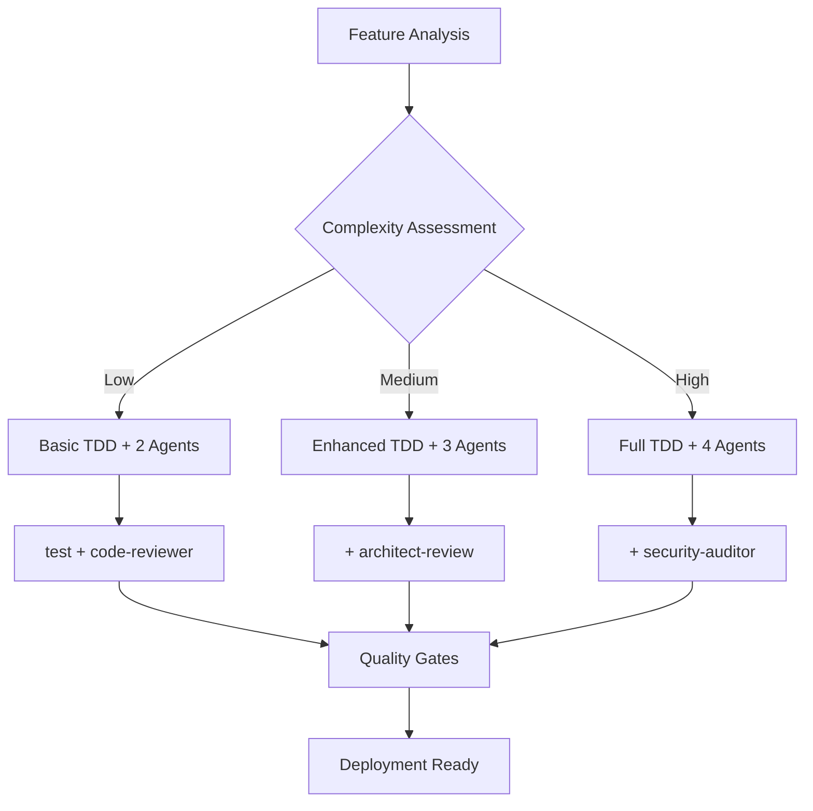

# 🔍 NeonPro Comprehensive Code Quality & Integration Audit (Enhanced)

Robust, stack-aligned, and healthcare-aware audit workflow that merges our existing audit phases with the Quality Control command’s best ideas—kept lean, non‑redundant, and mapped to our actual tech stack and source tree.

- Frontend: React 19 + Vite + TanStack Router
- Backend: Hono + Node 20
- Data: Supabase (Postgres) + Prisma ORM
- QA: Vitest, Playwright, Oxlint, dprint, TypeScript strict
- Monorepo: Turborepo + PNPM + Bun (scripts)

Use this prompt as the single source of truth for multi-agent orchestrated audits, tests, and compliance validation in NeonPro.

---

## 🤖 Agent Registry & Capabilities Matrix

### Core Code Review Agents

| Agent                    | Primary Focus                          | Execution Phase         | Parallel Capable | Dependencies     | TDD Integration         |
| ------------------------ | -------------------------------------- | ----------------------- | ---------------- | ---------------- | ----------------------- |
| **architect-review**     | System design, patterns, scalability   | Architecture validation | ✅               | None             | RED/GREEN/REFACTOR      |
| **security-auditor**     | DevSecOps, compliance, vulnerabilities | Security analysis       | ✅               | None             | ALL phases (healthcare) |
| **code-reviewer**        | Quality, maintainability, performance  | Code analysis           | ✅               | architect-review | GREEN/REFACTOR          |
| **test**                 | TDD patterns, coverage, test quality   | Test orchestration      | ✅               | code-reviewer    | RED (primary)           |
| **compliance-validator** | Healthcare regulatory validation       | Compliance checking     | ✅               | security-auditor | ALL phases (mandatory)  |

### Enhanced Agent Activation Triggers

```yaml
AGENT_TRIGGERS:
  architect-review:
    keywords:
      [
        "microservice",
        "architecture",
        "system design",
        "patterns",
        "scalability",
      ]
    file_patterns: ["**/routes/**", "**/api/**", "**/services/**"]
    always_active: true
    tdd_integration: "Validates architectural test patterns and design compliance"

  security-auditor:
    keywords:
      [
        "authentication",
        "authorization",
        "payment",
        "personal data",
        "compliance",
      ]
    file_patterns:
      ["**/auth/**", "**/security/**", "**/*patient*", "**/*clinic*"]
    healthcare_critical: true
    tdd_integration: "Security-first approach for all TDD phases in healthcare contexts"

  code-reviewer:
    keywords:
      ["performance", "maintainability", "technical debt", "code quality"]
    file_patterns: ["**/*.ts", "**/*.tsx", "**/*.js", "**/*.jsx"]
    always_active: true
    tdd_integration: "Quality gates enforcement during GREEN/REFACTOR phases"

  test:
    keywords: ["tdd", "testing", "coverage", "test patterns"]
    file_patterns: ["**/*.test.*", "**/*.spec.*", "**/tests/**"]
    always_active: true
    tdd_integration: "Primary coordinator for RED phase with test structure definition"

  compliance-validator:
    keywords:
      [
        "lgpd",
        "gdpr",
        "hipaa",
        "anvisa",
        "cfm",
        "healthcare",
        "patient",
        "clinic",
      ]
    file_patterns:
      ["**/*patient*", "**/*clinic*", "**/healthcare/**", "**/compliance/**"]
    healthcare_critical: true
    always_active: false # Only activated for healthcare features
    tdd_integration: "Mandatory validation in ALL phases for healthcare features"
```

### TDD Phase Agent Coordination Matrix

```yaml
TDD_PHASE_COORDINATION:
  RED_PHASE:
    primary_agent: test
    support_agents:
      - architect-review    # Design validation
      - security-auditor   # Security requirements (if triggered)
      - compliance-validator # Healthcare compliance (if applicable)
    mandatory_tools:
      - "sequential-thinking"
      - "archon"
      - "serena"
      - "desktop-commander"
    quality_gates:
      - "Test patterns compliance ≥95%"
      - "Architecture alignment ≥90%"
      - "Security coverage ≥100% (if applicable)"
      - "Compliance validation ≥100% (healthcare)"

  GREEN_PHASE:
    primary_agent: code-reviewer
    support_agents:
      - architect-review    # Pattern compliance
      - security-auditor   # Vulnerability scanning
      - test              # Test validation
      - compliance-validator # Implementation compliance
    mandatory_tools:
      - "desktop-commander"
      - "serena"
      - "archon"
      - "context7/tavily" (if complexity ≥7)
    quality_gates:
      - "All tests passing ≥100%"
      - "Code quality metrics ≥85%"
      - "Security validation ≥100%"
      - "Pattern compliance ≥90%"
      - "Compliance validation ≥100% (healthcare)"

  REFACTOR_PHASE:
    coordination: parallel
    agents:
      - code-reviewer     # Code quality improvements
      - architect-review  # Design optimization
      - security-auditor  # Security hardening
      - test             # Test optimization
      - compliance-validator # Compliance optimization
    mandatory_tools:
      - "sequential-thinking"
      - "serena"
      - "desktop-commander"
      - "archon"
    quality_gates:
      - "Quality metrics improved ≥10%"
      - "Architecture score maintained ≥90%"
      - "Security posture improved ≥100%"
      - "Test performance improved ≥5%"
      - "Compliance maintained/improved ≥100%"
```

---

## 📋 Enhanced Execution Sequence with Agent Orchestration

### Phase 0: Orchestration Initialization

```yaml
orchestration_setup:
  1. sequential-thinking: "Analyze audit scope and complexity"
  2. archon_mcp: "Initialize task tracking and agent coordination"
  3. serena_mcp: "Codebase analysis and change surface detection"
  4. agent_selection: "Activate agents based on triggers and complexity"
  5. workflow_selection: "Choose orchestration pattern (standard/security-critical/microservices)"
```

### @tools Orchestration Preflight (TDD-Orchestrated)

```yaml
preflight_tasks:
  build_shared: "pnpm --filter @neonpro/tools-shared build"
  build_orchestrator: "pnpm --filter @neonpro/tools-orchestration build"
  rationale:
    - "Ensures dist artifacts exist for @neonpro/tools-shared before orchestration"
    - "Prevents ERR_MODULE_NOT_FOUND when executing @neonpro/tools-orchestration"
    - "Automatically invoked by orchestration scripts, but run manually after clean installs"

agent_assignment:
  audit_consolidated:
    primary: architect-review
    support: [code-reviewer]
  unified_testing_toolkit:
    primary: test
    support: [architect-review, code-reviewer, security-auditor]
  backend_tools:
    primary: code-reviewer
    support: [architect-review, security-auditor, compliance-validator]
  database_tools:
    primary: security-auditor
    support: [architect-review, compliance-validator]
  frontend_tools:
    primary: test
    support: [code-reviewer, architect-review]
  quality_tools:
    primary: tdd-orchestrator
    support: [test, code-reviewer]
  orchestration_framework:
    primary: tdd-orchestrator
    support: [architect-review, security-auditor, test]

notes:
  - "Follow .claude/agents/code-review/tdd-orchestrator.md for phase-by-phase agent choreography"
  - "Document any failing workflows (e.g., @neonpro/tools-backend-tests type-check) in Archon with remediation plan"
  - "Re-run preflight tasks whenever pnpm store is pruned or packages are updated"
```

### Mandatory MCP Integration & Tool Sequences

```yaml
CRITICAL_MCPS:
  archon: "MANDATORY - Task management and agent coordination"
  serena: "MANDATORY - Codebase analysis and semantic search"
  desktop-commander: "MANDATORY - File operations and command execution"
  supabase: "CONDITIONAL - Database and RLS validation when applicable"
  context7: "CONDITIONAL - Documentation and best practices research"
  tavily: "CONDITIONAL - Real-time information and trends"

MANDATORY_TOOL_SEQUENCES:
  RED_PHASE_SEQUENCE:
    - "sequential-thinking" # Always first - analyze requirements
    - "archon" # Task management and coordination
    - "serena" # Codebase analysis
    - "context7/tavily" # Research if complexity ≥7
    - "desktop-commander" # Test implementation

  GREEN_PHASE_SEQUENCE:
    - "desktop-commander" # File operations
    - "serena" # Code analysis
    - "archon" # Task updates
    - "context7/tavily" # Research if stuck
    - "shadcn" # UI components if applicable

  REFACTOR_PHASE_SEQUENCE:
    - "sequential-thinking" # Analysis and optimization
    - "serena" # Code quality assessment
    - "desktop-commander" # Refactoring operations
    - "archon" # Documentation and updates

  COMPLIANCE_SEQUENCE:
    - "security-auditor" # Primary compliance validation
    - "supabase" # Database compliance checks
    - "archon" # Compliance documentation
    - "desktop-commander" # Compliance fixes

HEALTHCARE_MANDATORY_SEQUENCES:
  patient_data_operations:
    - "sequential-thinking" # Risk assessment
    - "security-auditor" # LGPD compliance validation
    - "supabase" # RLS policy verification
    - "serena" # Code analysis for PHI handling
    - "desktop-commander" # Implementation
    - "archon" # Compliance documentation

  compliance_validation:
    - "security-auditor" # Primary validation
    - "compliance-validator" # Healthcare specific checks
    - "supabase" # Database compliance
    - "archon" # Audit trail documentation
```

### Enhanced Documentation Preload with Agent Integration

```yaml
DOCUMENTATION_PRELOAD:
  architecture:
    - "docs/architecture/source-tree.md"
    - "docs/architecture/tech-stack.md"
  testing:
    - "docs/testing/AGENTS.md"
    - "docs/testing/coverage-policy.md"
    - "docs/testing/integration-testing.md"
    - ".claude/agents/code-review/tdd-orchestrator.md"
  standards:
    - "docs/rules/coding-standards.md"
    - ".claude/agents/code-review/architect-review.md"
    - ".claude/agents/code-review/code-reviewer.md"
    - ".claude/agents/code-review/security-auditor.md"
  healthcare_compliance:
    - "docs/compliance/lgpd-requirements.md"
    - "docs/compliance/anvisa-standards.md"
    - "docs/compliance/cfm-guidelines.md"
```

### Agent Quality Gate Integration

```yaml
AGENT_QUALITY_GATE_COORDINATION:
  orchestrator:
    primary: "tdd-orchestrator"
    responsibilities:
      - "Agent activation and coordination"
      - "Quality gate validation"
      - "Workflow progression management"
      - "Compliance enforcement"

  quality_gate_validation:
    architect-review:
      gates: ["architecture_compliance", "design_patterns", "scalability"]
      thresholds: ["≥90%", "≥85%", "≥80%"]

    security-auditor:
      gates:
        ["security_vulnerabilities", "compliance_validation", "data_protection"]
      thresholds: ["0 critical", "≥100%", "≥100%"]

    code-reviewer:
      gates: ["code_quality", "maintainability", "performance"]
      thresholds: ["≥85%", "≥80%", "≥75%"]

    test:
      gates: ["test_coverage", "test_quality", "tdd_patterns"]
      thresholds: ["≥90%", "≥85%", "≥95%"]

    compliance-validator:
      gates: ["lgpd_compliance", "healthcare_standards", "audit_trail"]
      thresholds: ["≥100%", "≥100%", "≥100%"]
```

---

## 🔄 TDD-Integrated Orchestration Workflows

### 1. Standard Multi-Agent TDD Workflow

**Use Case**: Regular feature development with balanced quality focus



#### RED Phase Orchestration

```yaml
phase: RED
primary_agent: test
support_agents:
  - architect-review # Design test validation
  - security-auditor # Security test requirements (if triggered)

parallel_execution:
  - test: "Define test structure and patterns"
  - architect-review: "Validate architectural test approach"
  - security-auditor: "Ensure security test coverage"

quality_gate: "All failing tests created with proper structure"
```

#### GREEN Phase Orchestration

```yaml
phase: GREEN
primary_agent: code-reviewer
support_agents:
  - architect-review # Pattern compliance
  - security-auditor # Vulnerability scanning
  - test # Test validation

sequential_execution:
  1. code-reviewer: "Implement minimal code to pass tests"
  2. architect-review: "Validate architectural patterns"
  3. security-auditor: "Perform security analysis"
  4. test: "Verify test success"

quality_gate: "All tests pass with security and architecture compliance"
```

#### REFACTOR Phase Orchestration

```yaml
phase: REFACTOR
coordination: parallel_execution
agents:
  - code-reviewer # Code quality improvements
  - architect-review # Design optimization
  - security-auditor # Security hardening
  - test # Test optimization

quality_gate: "Code quality improved while maintaining test coverage"
```

---

### 2. Security-Critical TDD Workflow

**Use Case**: Authentication, payments, personal data handling

```yaml
workflow: "security-critical-tdd"
security_first: true
compliance_gates: ["GDPR", "PCI-DSS", "LGPD"]

phase_sequence:
  RED:
    primary: security-auditor
    secondary: [test, architect-review]
    focus: "Security test requirements definition"

  GREEN:
    primary: security-auditor
    secondary: [code-reviewer, test]
    focus: "Secure implementation with vulnerability prevention"

  REFACTOR:
    coordination: security-auditor
    agents: [code-reviewer, architect-review, test]
    focus: "Security hardening and compliance validation"
```

### 3. Healthcare Compliance Workflow

**Use Case**: Patient data, clinical records, LGPD compliance

```yaml
workflow: "healthcare-compliance-tdd"
compliance_first: true
regulations: ["LGPD", "CFM", "ANVISA"]

agent_coordination:
  security-auditor: "Primary - LGPD compliance validation"
  architect-review: "Data architecture and privacy by design"
  code-reviewer: "PHI handling and audit trail implementation"
  test: "Compliance test patterns and data protection validation"
```

---

## 🗂 Phase 1 — Backend↔Database Integration (Agent-Orchestrated)

**Agent Coordination**: `architect-review` (primary) + `security-auditor` + `code-reviewer`

### 1.1 Schema & Client Validation (Parallel Execution)

```yaml
parallel_agents:
  architect-review:
    - "Validate database schema design patterns"
    - "Review service boundaries and data relationships"

  security-auditor:
    - "Verify RLS policies on sensitive tables"
    - "Audit data access patterns and permissions"

  code-reviewer:
    - "Analyze Prisma client generation and type safety"
    - "Review API-database contract consistency"
```

```bash
# Parallel execution commands
pnpm --filter @neonpro/api prisma:generate
pnpm --filter @neonpro/api build
```

### 1.2 Database Structure & RLS Analysis (Sequential with Validation)

```yaml
sequential_execution:
  1. architect-review: "Analyze database architecture and relationships"
  2. security-auditor: "Validate RLS policies and tenant isolation"
  3. code-reviewer: "Review field mapping and error handling"

quality_gates:
  - "RLS enabled on all patient/clinic tables"
  - "Multi-tenant scoping verified in all queries"
  - "No cross-tenant data leakage possible"
```

**Agent Tasks**:

- **architect-review**: Validate schema design patterns, FK relationships, enum consistency
- **security-auditor**: Verify RLS policies, audit data access patterns, tenant isolation
- **code-reviewer**: Check snake_case/camelCase mapping, error handling coverage

### 1.3 API-Database Contract Validation (Multi-Agent Analysis)

```yaml
agent_coordination:
  code-reviewer:
    - "Scan Hono routes for field name consistency"
    - "Validate error handling for DB errors and RLS denials"

  security-auditor:
    - "Ensure multi-tenant scoping in patient/clinic queries"
    - "Verify audit trail implementation for data access"

  architect-review:
    - "Review API contract alignment with database schema"
    - "Validate service layer abstraction patterns"
```

---

## 🏥 Phase 2 — LGPD & Healthcare Security (Agent-Orchestrated Critical)

**Agent Coordination**: `security-auditor` (primary) + `architect-review` + `code-reviewer` + `test`

### 2.1 LGPD Compliance Validation (Security-First Orchestration)

```yaml
workflow: healthcare-compliance-tdd
primary_agent: security-auditor

RED_phase:
  security-auditor:
    - "Define LGPD compliance test requirements"
    - "Create consent validation test patterns"
    - "Establish audit trail test structure"

  test:
    - "Implement failing compliance tests"
    - "Create PHI handling test scenarios"

GREEN_phase:
  code-reviewer:
    - "Implement consent validation logic"
    - "Add audit trail mechanisms"

  security-auditor:
    - "Validate LGPD compliance implementation"
    - "Verify data protection measures"

REFACTOR_phase:
  parallel_execution:
    - security-auditor: "Enhance security measures"
    - architect-review: "Optimize privacy-by-design patterns"
    - code-reviewer: "Improve audit trail performance"
    - test: "Optimize compliance test suite"
```

### 2.2 Healthcare Security Analysis (Multi-Agent Coordination)

```yaml
agent_tasks:
  security-auditor:
    priority: "P0 - Critical"
    tasks:
      - "Consent validation enforced on routes touching PHI/PII"
      - "Audit trails for read/write operations validated"
      - "Data retention and deletion logic compliance"
      - "Professional access controls (CFM) verification"
      - "No PHI in logs or test fixtures"
      - "TLS in transit, encrypted storage at rest validation"

  architect-review:
    priority: "P0 - Critical"
    tasks:
      - "Privacy-by-design architecture validation"
      - "Data flow analysis for PHI handling"
      - "Service boundary security review"

  code-reviewer:
    priority: "P1 - High"
    tasks:
      - "PHI handling code review"
      - "Error handling without data leakage"
      - "Logging sanitization validation"
```

### 2.3 RLS Integration Validation (Sequential Security Analysis)

```yaml
sequential_execution:
  1. architect-review:
    - "Review RLS policy architecture"
    - "Validate tenant isolation design"

  2. security-auditor:
    - "Verify policies active for patient/clinic tables"
    - "Test user context propagation (clinic, role, professional id)"
    - "Validate tenant isolation effectiveness"

  3. code-reviewer:
    - "Review RLS policy implementation in queries"
    - "Validate context passing in API layers"

  4. test:
    - "Execute tenant isolation tests"
    - "Validate cross-tenant access prevention"

quality_gates:
  - "RLS policies active on all sensitive tables: ≥100%"
  - "User context propagation verified: ≥100%"
  - "Tenant isolation tests pass: ≥100%"
  - "No cross-tenant data access possible: ≥100%"
```

### 2.4 Emergency Access & Documentation (Compliance Orchestration)

```yaml
agent_coordination:
  security-auditor:
    - "Validate emergency access protocols"
    - "Review break-glass procedures"
    - "Audit emergency access logging"

  architect-review:
    - "Review emergency access architecture"
    - "Validate failsafe mechanisms"

  code-reviewer:
    - "Review emergency access implementation"
    - "Validate audit trail for emergency procedures"
```

---

## 🧪 Phase 3 — Code Quality & Build Checks (Parallel Agent Execution)

**Agent Coordination**: `code-reviewer` (primary) + `architect-review` + `security-auditor` + `test`

### 3.1 Parallel Quality Analysis (Optimized Execution)

```yaml
parallel_execution:
  code-reviewer:
    - "TypeScript strict type checking"
    - "Code quality metrics analysis"
    - "Performance bottleneck detection"

  security-auditor:
    - "Dependency vulnerability scanning"
    - "Security advisory analysis"
    - "Code security pattern validation"

  architect-review:
    - "Architecture pattern compliance"
    - "Design consistency validation"
    - "Module dependency analysis"

  test:
    - "Test coverage analysis"
    - "Test quality assessment"
    - "TDD pattern validation"
```

### 3.2 Build & Quality Commands (Agent-Coordinated)

```bash
# TypeScript type check (strict)
pnpm --filter ./ type-check

# Oxlint fast lint (quiet). Use package scripts where available
pnpm --filter @neonpro/api lint
pnpm --filter @neonpro/web lint

# Format (non-blocking but recommended)
pnpm --filter @neonpro/api format
pnpm --filter @neonpro/web format

# Security advisory scan (deps)
pnpm audit --json > audit-report.json || true
```

Optional VS Code tasks (fast):

- “🏛️ Constitutional Audit - Quick”
- “🏛️ Constitutional Audit - Full”
- “📈 Performance Benchmark”
- “🏥 Healthcare Compliance Check”

---

### 3.3 Quality Gates & Thresholds

```yaml
quality_gates:
  code-reviewer:
    - "TypeScript strict mode: 0 errors"
    - "Oxlint errors: 0 (warnings <100)"
    - "Code complexity: Cyclomatic <10"
    - "Maintainability index: >70"

  security-auditor:
    - "Critical vulnerabilities: 0"
    - "High vulnerabilities: <5"
    - "Security patterns: 100% compliance"

  architect-review:
    - "Architecture violations: 0"
    - "Design pattern compliance: >90%"
    - "Module coupling: <80%"

  test:
    - "Test coverage: >85%"
    - "Test quality score: >8/10"
```

---

## 🧭 Phase 4 — Intelligent Test Orchestration (Agent-Coordinated)

**Agent Coordination**: `test` (primary) + `architect-review` + `code-reviewer` + `security-auditor`

### 4.1 Intelligent Test Selection (Multi-Agent Analysis)

```yaml
agent_analysis:
  test:
    - "Analyze changed files and determine test scope"
    - "Select appropriate test strategies based on file patterns"
    - "Coordinate test execution across different domains"

  architect-review:
    - "Validate test architecture and patterns"
    - "Review integration test strategies"
    - "Ensure test coverage aligns with system boundaries"

  code-reviewer:
    - "Analyze code changes for test impact"
    - "Review test quality and maintainability"
    - "Validate test performance and efficiency"

  security-auditor:
    - "Ensure security test coverage for sensitive changes"
    - "Validate compliance test execution"
    - "Review test data security and PHI handling"
```

### 4.2 Intelligent Routing Rules (Agent-Driven)

```yaml
routing_strategy:
  inputs:
    - changed_files: "git diff analysis"
    - integration_issues: "schema, API, compliance changes"
    - monorepo_map: "docs/architecture/source-tree.md"

  path_to_strategy:
    "apps/api/**":
      primary_agent: architect-review
      strategy: "Hono API integration + DB/RLS validation"
      tests: ["integration", "api-contract", "rls-security"]

    "packages/database/**":
      primary_agent: security-auditor
      strategy: "Schema & RLS verification + API regression"
      tests: ["schema-validation", "rls-policies", "migration-safety"]

    "apps/web/src/routes/**":
      primary_agent: code-reviewer
      strategy: "TanStack Router tests + API contract checks"
      tests: ["routing", "api-integration", "navigation"]

    "apps/web/src/components|hooks/**":
      primary_agent: test
      strategy: "Unit tests + Supabase client usage"
      tests: ["component", "hook", "client-integration"]

    "healthcare_domains":
      primary_agent: security-auditor
      strategy: "LGPD + RLS suites"
      tests: ["compliance", "data-protection", "audit-trails"]
```

### 4.3 Test Execution Commands (Agent-Coordinated)

```bash
# Agent: architect-review + code-reviewer
pnpm --filter @neonpro/api test

# Agent: test + code-reviewer
pnpm --filter @neonpro/web test

# Agent: test + security-auditor (E2E with compliance validation)
pnpm --filter @neonpro/web e2e
```

### 4.4 Coverage Policy & Quality Gates

```yaml
coverage_policy:
  critical: "≥95% (healthcare data, authentication, payments)"
  important: "≥85% (business logic, integrations)"
  useful: "≥75% (UI components, utilities)"

agent_validation:
  test:
    - "Validate coverage thresholds met"
    - "Review test quality metrics"

  security-auditor:
    - "Ensure compliance test coverage"
    - "Validate security test execution"

  code-reviewer:
    - "Review test maintainability"
    - "Validate test performance"
```

---

## 🛠️ Phase 5 — Systematic Fixing (Agent-Orchestrated Priorities)

**Agent Coordination**: Priority-based agent assignment with parallel execution where possible

### 5.1 P0 — Integration Blockers (Critical - Sequential Execution)

```yaml
sequential_execution:
  1. architect-review:
    - "Analyze DB schema mismatches and relationship issues"
    - "Review API field mapping and contract alignment"

  2. security-auditor:
    - "Identify RLS bypass risks and tenant isolation issues"
    - "Validate consent/audit logging on PHI paths"

  3. code-reviewer:
    - "Fix API field errors and implement tenant/role scoping"
    - "Implement missing consent/audit logging mechanisms"

blocking_issues:
  - "DB mismatches (naming/relations), RLS bypass risks"
  - "API field errors, missing tenant/role scoping"
  - "Missing consent/audit logging on PHI paths"

quality_gate: "All P0 issues resolved before proceeding"
```

### 5.2 P1 — Security & Compliance (Parallel Execution)

```yaml
parallel_execution:
  security-auditor:
    - "Implement no-eval policies and safe fetch options"
    - "Validate URL safety and input sanitization"
    - "Implement PHI redaction in logs and error messages"
    - "Add audit logs for sensitive operations"

  code-reviewer:
    - "Review and fix security code patterns"
    - "Optimize error handling without data leakage"
    - "Validate logging sanitization implementation"

security_compliance:
  - "no-eval, safe fetch options, URL safety"
  - "PHI redaction; audit logs for sensitive ops"
```

### 5.3 P2 — Type Safety & Contracts (Parallel Execution)

```yaml
parallel_execution:
  code-reviewer:
    - "Replace `any` with `unknown`/specific types"
    - "Align response types and zod schemas with routes"
    - "Improve type safety across API boundaries"

  architect-review:
    - "Review API contract consistency"
    - "Validate type system architecture"
    - "Ensure schema alignment across layers"

type_safety:
  - "Replace `any` with `unknown`/specific types"
  - "Align response types and zod schemas with routes"
```

### 5.4 P3 — Module & Hygiene (Parallel Execution)

```yaml
parallel_execution:
  code-reviewer:
    - "Convert to ES module imports"
    - "Remove dead code and unused dependencies"
    - "Optimize query performance"
    - "Improve error handling patterns"

  architect-review:
    - "Review module architecture and dependencies"
    - "Validate import/export patterns"
    - "Optimize module boundaries"

module_hygiene:
  - "ES module imports, remove dead code"
  - "Query optimization and error handling"
```

### 5.5 Error Handling & Rollback Strategy

```yaml
error_handling:
  agent_failure:
    - "Log agent failure with context"
    - "Attempt automatic recovery with alternative agent"
    - "Escalate to manual intervention if needed"

  quality_gate_failure:
    - "Stop execution at failed gate"
    - "Provide detailed failure analysis"
    - "Suggest remediation steps"

  rollback_strategy:
    - "Maintain checkpoint before each phase"
    - "Enable selective rollback to last successful state"
    - "Preserve audit trail of all changes"
```

---

## ✅ Phase 6 — Comprehensive Quality Gates (Agent-Validated)

**Agent Coordination**: All agents participate in validation with specific responsibilities

### 6.1 Gate 0 — Backend/DB Integration (Blocking)

```yaml
validation_agents:
  architect-review:
    - "API architecture integrity validation"
    - "Database schema design compliance"
    - "Service boundary validation"

  security-auditor:
    - "RLS policies active and effective"
    - "Data access pattern security validation"
    - "Tenant isolation verification"

  code-reviewer:
    - "API builds green; Prisma client generates successfully"
    - "No schema/field mapping errors"
    - "Error handling coverage validation"

blocking_criteria:
  - "API builds green; Prisma client generates: ≥100%"
  - "No schema/field errors; RLS policies verified: ≥100%"
  - "Multi-tenant scoping implemented: ≥100%"
```

### 6.2 Gate 1 — LGPD Compliance (Blocking)

```yaml
validation_agents:
  security-auditor:
    - "LGPD compliance validation (primary)"
    - "Consent mechanism verification"
    - "Audit trail completeness validation"
    - "Data protection measure verification"

  architect-review:
    - "Privacy-by-design architecture validation"
    - "Data flow compliance verification"

  code-reviewer:
    - "Consent implementation code review"
    - "Audit logging implementation validation"

blocking_criteria:
  - "Consent checks present on PHI routes: ≥100%"
  - "Audit logs exist and pass review: ≥100%"
  - "LGPD compliance validated: ≥100%"
  - "PHI handling secure: ≥100%"
```

### 6.3 Gate 2 — RLS Security (Blocking)

```yaml
validation_agents:
  security-auditor:
    - "RLS policy effectiveness validation (primary)"
    - "Cross-tenant access prevention verification"
    - "Security boundary enforcement validation"

  architect-review:
    - "RLS architecture design validation"
    - "Tenant isolation architecture review"

  test:
    - "RLS test execution and validation"
    - "Cross-tenant leakage test verification"

blocking_criteria:
  - "Queries enforce tenant + role context: ≥100%"
  - "No cross-tenant leakage in tests: ≥100%"
  - "RLS policies active on sensitive tables: ≥100%"
  - "User context propagation verified: ≥100%"
```

### 6.4 Gate 3 — Code Quality & Security (Blocking)

```yaml
validation_agents:
  code-reviewer:
    - "TypeScript strict mode compliance (primary)"
    - "Linting standards compliance"
    - "Code quality metrics validation"

  security-auditor:
    - "Security vulnerability assessment (primary)"
    - "Dependency security validation"
    - "Security pattern compliance"

  architect-review:
    - "Architecture pattern compliance"
    - "Design consistency validation"

blocking_criteria:
  - "Oxlint: 0 errors (<100 warnings)"
  - "pnpm type-check passes: ≥100%"
  - "pnpm audit has 0 criticals: ≥100%"
  - "Security patterns compliant: ≥100%"
```

### 6.5 Gate 4 — Test Coverage & Quality (Blocking)

```yaml
validation_agents:
  test:
    - "Test coverage validation (primary)"
    - "Test quality assessment"
    - "TDD pattern compliance"

  code-reviewer:
    - "Test maintainability review"
    - "Test performance validation"

  security-auditor:
    - "Security test coverage validation"
    - "Compliance test execution verification"

blocking_criteria:
  - "Critical path coverage: ≥95%"
  - "Important feature coverage: ≥85%"
  - "Security test coverage: ≥100%"
  - "Compliance test execution: ≥100%"
```

### 6.6 Final Orchestration Validation

```yaml
final_validation:
  all_agents_consensus:
    - "All quality gates passed"
    - "No blocking issues remaining"
    - "Agent coordination successful"
    - "TDD cycles completed successfully"

  deployment_readiness:
    - "Healthcare compliance validated"
    - "Security posture verified"
    - "Architecture integrity confirmed"
    - "Code quality standards met"
```

---

## 🧾 Artifacts & Reporting (Agent-Coordinated)

### Agent-Specific Reporting

```yaml
reporting_coordination:
  architect-review:
    - "Architecture compliance report"
    - "Design pattern analysis"
    - "System boundary validation results"

  security-auditor:
    - "Security vulnerability assessment"
    - "LGPD compliance validation report"
    - "RLS policy effectiveness analysis"

  code-reviewer:
    - "Code quality metrics and analysis"
    - "Type safety validation results"
    - "Performance optimization recommendations"

  test:
    - "Test coverage and quality report"
    - "TDD compliance validation"
    - "Test execution results"
```

### Consolidated Reporting

- **Quality Report**: `quality-report.txt` (aggregated from all agents)
- **Security Report**: `security-report.json` (security-auditor primary)
- **Architecture Report**: `architecture-analysis.md` (architect-review primary)
- **Test Report**: `test-coverage-report.json` (test agent primary)
- **Archon Tasks**: Update with agent decisions and evidence
- **Documentation**: Append findings to `docs/mistakes/*.md` when applicable

## 🔧 Orchestration Examples

### Example 1: Healthcare Feature Development

```yaml
feature: "patient-appointment-scheduling"
complexity: "high"
triggers: ["healthcare", "patient", "appointment", "scheduling"]

agent_activation:
  - security-auditor: "LGPD compliance, PHI handling"
  - architect-review: "Appointment system architecture"
  - code-reviewer: "Business logic implementation"
  - test: "Healthcare compliance testing"

workflow: "healthcare-compliance-tdd"
execution: "security-critical with full agent coordination"
```

### Example 2: API Integration Enhancement

```yaml
feature: "external-api-integration"
complexity: "medium"
triggers: ["api", "integration", "external"]

agent_activation:
  - architect-review: "Integration architecture patterns"
  - security-auditor: "API security validation"
  - code-reviewer: "Integration code quality"
  - test: "Integration testing patterns"

workflow: "standard-tdd"
execution: "parallel where possible, sequential for dependencies"
```

## 🧩 Minimal Examples

Type safety

```ts
// Before
type Handler = (c: any) => any;
// After
type Handler = (c: import("hono").Context) => Response | Promise<Response>;
```

ESM imports

```ts
// Before
const { execSync } = require("node:child_process");
// After
import { execSync } from "node:child_process";
```

---

## 🧭 Quick Start (Task Runner)

Use workspace tasks for speed:

- “🏛️ Constitutional Audit - Quick” → fast compliance validation
- “🏛️ Constitutional Audit - Full” → exhaustive validation
- “📈 Performance Benchmark” → perf checks
- “🏥 Healthcare Compliance Check” → LGPD/ANVISA heuristics

CLI fallbacks

```bash
# Root helpers
pnpm quality:full
pnpm workflow:ci

# Tools/audit
pnpm constitutional:quick
pnpm constitutional:full
pnpm constitutional:benchmark
```

---

## This enhanced audit prompt integrates the Quality Control command’s strengths (testing, compliance, performance, security, cleanup, formatting) into our existing phases—mapped to NeonPro’s stack and source tree, without overengineering or redundant rules.

## 🔬 Optional Advanced DB Checks (keep if needed)

Prisma advanced (use only when investigating schema drift):

```bash
# Validate schema against DB (if script exists in packages/database)
cd packages/database && pnpm prisma:validate || npx prisma validate --schema prisma/schema.prisma

# Compare actual DB schema (read‑only)
cd packages/database && npx prisma db pull --print > schema-actual.prisma

diff packages/database/prisma/schema.prisma schema-actual.prisma || true
```

## 🧯 Optional Project-Specific Tests (if available)

```bash
# API route/database integration suites (run if these scripts exist)
cd apps/api && pnpm test:routes || true
cd apps/api && pnpm test:db-integration || true
cd apps/api && pnpm test:lgpd-compliance || true
cd apps/api && pnpm test:rls-security || true
```

---

## 🔍 Troubleshooting Agent Orchestration

### Common Orchestration Issues

| Issue                            | Symptoms                                             | Solution                                             | Responsible Agent  |
| -------------------------------- | ---------------------------------------------------- | ---------------------------------------------------- | ------------------ |
| **Agent Coordination Conflicts** | Multiple agents making contradictory recommendations | Implement priority hierarchy and conflict resolution | All agents         |
| **Quality Gate Failures**        | Consistent failures in specific quality gates        | Review gate thresholds and agent effectiveness       | Primary gate agent |
| **Performance Degradation**      | Audit cycles taking significantly longer             | Optimize agent selection and parallel execution      | architect-review   |
| **Context Loss Between Phases**  | Agents losing shared context during transitions      | Strengthen state management and context persistence  | All agents         |
| **Healthcare Compliance Issues** | LGPD or RLS validation failures                      | Enhanced security-auditor focus and validation       | security-auditor   |

### Recovery Strategies

```yaml
recovery_strategies:
  agent_failure:
    - "Automatic failover to backup agent"
    - "Graceful degradation with reduced functionality"
    - "Manual intervention escalation"

  quality_gate_failure:
    - "Detailed failure analysis and reporting"
    - "Suggested remediation steps"
    - "Rollback to last successful state"

  orchestration_failure:
    - "Reset to last known good state"
    - "Re-initialize agent coordination"
    - "Fallback to manual execution mode"
```

## 🎯 Summary

**This enhanced multi-agent orchestration system transforms the basic audit into a sophisticated, intelligent quality assurance workflow. It integrates TDD methodology, parallel execution optimization, comprehensive quality gates, and healthcare compliance validation—all while maintaining compatibility with NeonPro's existing tech stack and development workflows.**

### Key Enhancements

- **🤖 Multi-Agent Coordination**: Intelligent orchestration of specialized code review agents
- **🔄 TDD Integration**: Red-green-refactor cycles with agent coordination
- **⚡ Parallel Execution**: Optimized performance through concurrent agent execution
- **🛡️ Healthcare Compliance**: Enhanced LGPD and security validation
- **✅ Comprehensive Quality Gates**: Multi-layered validation with agent-specific responsibilities
- **🔧 Error Handling**: Robust rollback and recovery strategies
- **📊 Advanced Reporting**: Agent-coordinated reporting and documentation
