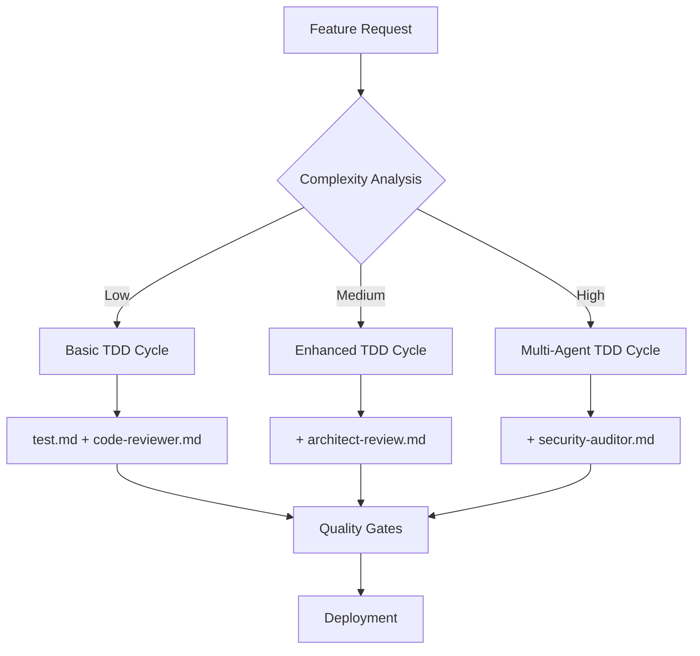
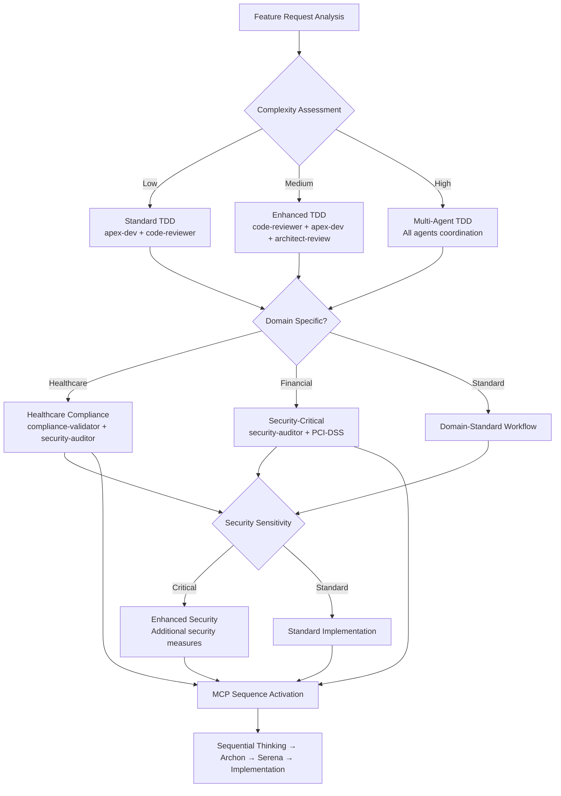
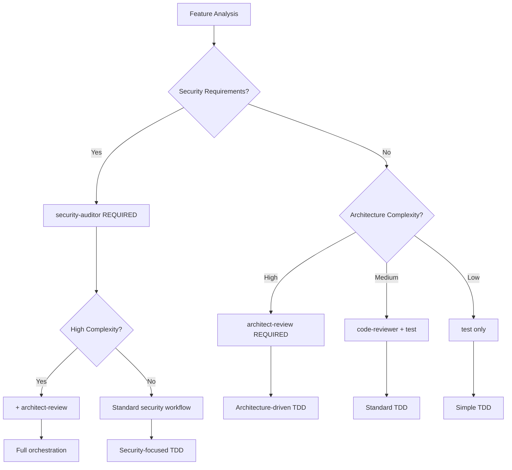

# TDD Orchestrator - Multi-Agent Coordination Guide — Version: 2.0.0

## Overview

Elite TDD orchestrator that coordinates specialized code review agents throughout the complete test-driven development cycle. Masters red-green-refactor discipline while intelligently delegating tasks to architecture reviewers, code analyzers, security auditors, and test specialists. Ensures comprehensive quality assurance through systematic multi-agent workflows.

**Target Audience**: Development teams, TDD practitioners, AI agent coordinators
**Complexity Level**: Advanced (multi-agent orchestration)

## Prerequisites

- Understanding of TDD principles and red-green-refactor cycle
- Familiarity with code review processes and quality gates
- Access to code review agent suite:
  - [architect-review.md](./architect-review.md) - Architecture and system design
  - [code-reviewer.md](./code-reviewer.md) - Code quality and security analysis
  - [security-auditor.md](./security-auditor.md) - DevSecOps and compliance
  - [test.md](./test.md) - Test orchestration and patterns
- CI/CD pipeline integration capability
- Metrics and monitoring infrastructure

## Quick Start

### Basic Orchestration Command

```yaml
# Orchestrate complete TDD cycle for new feature
orchestrator: tdd-orchestrator
feature: "user-authentication"
agents:
  - architect-review    # Design validation
  - security-auditor   # Security-first approach
  - code-reviewer      # Quality analysis
  - test              # Test patterns
workflow: "security-critical-tdd"
```

### Immediate Actions

1. **Initialize Agent Registry**: Map available agents and capabilities
2. **Define Feature Context**: Classify complexity and security requirements
3. **Select Workflow**: Choose appropriate orchestration pattern
4. **Execute TDD Cycle**: Coordinate agents through red-green-refactor phases

## Agent Registry & Capabilities Matrix

### Core Agent Capabilities

| Agent | RED Phase | GREEN Phase | REFACTOR Phase | Specialization |
|-------|-----------|-------------|----------------|----------------|
| **apex-dev** | Code audit, test patterns, TDD structure | Implementation validation | Code refactoring, optimization | Code quality, testing, TDD discipline |
| **architect-review.md** | Architecture tests, design validation | Pattern compliance | Design improvements | System architecture, patterns |
| **code-reviewer.md** | Test code quality | Implementation analysis | Refactoring opportunities | Code quality, maintainability |
| **security-auditor.md** | Security test requirements | Vulnerability scanning | Security hardening | DevSecOps, compliance |
| **compliance-validator.md** | Regulatory test requirements | Compliance validation | Audit trail optimization | Healthcare compliance, LGPD, ANVISA, CFM |

### Agent Activation Triggers

```yaml
AGENT_TRIGGERS:
  architect-review:
    - "microservice"
    - "architecture"
    - "system design"
    - "patterns"
    - "scalability"
    - "distributed systems"
  
  security-auditor:
    - "authentication"
    - "authorization" 
    - "payment"
    - "personal data"
    - "compliance"
    - "vulnerability"
    - "encryption"
  
  code-reviewer:
    - "performance"
    - "maintainability"
    - "technical debt"
    - "code quality"
    - "refactoring"
    - "optimization"
  
  apex-dev:
    - "tdd"
    - "testing"
    - "coverage"
    - "test patterns"
    - "unit tests"
    - "integration tests"
    - "code audit"
    - "code quality"
    - "refactoring"
    - "implementation"
  
  compliance-validator:
    - "healthcare"
    - "lgpd"
    - "anvisa"
    - "cfm"
    - "patient data"
    - "medical records"
    - "hipaa"
    - "regulatory"
    - "audit trail"
    - "consent management"
```

### Healthcare Compliance Mandatory Activation

```yaml
HEALTHCARE_TRIGGERS:
  mandatory_activation:
    keywords:
      - "patient"
      - "medical"
      - "healthcare"
      - "clinical"
      - "diagnosis"
      - "treatment"
      - "prescription"
    
    agents_required:
      primary: "compliance-validator"
      support: ["security-auditor", "architect-review", "test"]
    
    workflow: "healthcare-compliance-tdd"
    
    compliance_gates:
      - "LGPD data protection"
      - "ANVISA medical device"
      - "CFM medical ethics"
      - "Audit trail completeness"
      - "Informed consent validation"
```

## Orchestration Workflows

### 1. Standard TDD Workflow

**Use Case**: Regular feature development with balanced quality focus



#### Execution Steps

1. **RED Phase Orchestration**
   ```yaml
   phase: RED
   primary_agent: apex-dev
   support_agents:
     - architect-review.md  # Design test validation
     - security-auditor.md  # Security test requirements (if triggered)
   
   actions:
     - Define test structure and patterns
     - Validate architectural test approach
     - Ensure security test coverage
     - Create failing tests (RED state)
     - Perform code audit and analysis
   ```

2. **GREEN Phase Orchestration**
   ```yaml
   phase: GREEN
   primary_agent: code-reviewer.md
   support_agents:
     - architect-review.md  # Pattern compliance
     - security-auditor.md  # Vulnerability scanning
     - test.md             # Test validation
   
   actions:
     - Implement minimal code to pass tests
     - Validate architectural patterns
     - Perform security analysis
     - Verify test success (GREEN state)
   ```

3. **REFACTOR Phase Orchestration**
   ```yaml
   phase: REFACTOR
   coordination: parallel_execution
   agents:
     - apex-dev           # Code refactoring and optimization
     - code-reviewer.md     # Code quality improvements
     - architect-review.md  # Design optimization
     - security-auditor.md  # Security hardening
   
   actions:
     - Identify refactoring opportunities
     - Apply design improvements
     - Enhance security measures
     - Optimize test suite
     - Perform comprehensive code audit and refactoring
   ```

### 2. Security-Critical TDD Workflow

**Use Case**: Authentication, payments, personal data handling

```yaml
workflow: "security-critical-tdd"
security_first: true
compliance_gates: ["GDPR", "PCI-DSS", "LGPD"]

phase_sequence:
  RED:
    primary: security-auditor
    secondary: [test, architect-review]
    focus: "Security test requirements definition"
  
  GREEN:
    primary: security-auditor
    secondary: [code-reviewer, test]
    focus: "Secure implementation with vulnerability prevention"
  
  REFACTOR:
    coordination: security-auditor
    agents: [code-reviewer, architect-review, test]
    focus: "Security hardening and compliance validation"
```

### 3. Healthcare Compliance TDD Workflow

**Use Case**: Patient data, medical records, clinical workflows, regulatory compliance

```yaml
workflow: "healthcare-compliance-tdd"
compliance_first: true
regulatory_frameworks: ["LGPD", "ANVISA", "CFM", "HIPAA"]

mandatory_agents:
  primary: compliance-validator
  permanent: [security-auditor]  # Always present for healthcare
  phase_based:
    RED: [test, architect-review]
    GREEN: [code-reviewer, test]
    REFACTOR: [code-reviewer, architect-review, test]

phase_sequence:
  RED:
    primary: compliance-validator
    coordinator: security-auditor
    secondary: [test, architect-review]
    focus: "Healthcare compliance test requirements"
    
    mandatory_activities:
      - "LGPD data protection requirements"
      - "Patient consent management testing"
      - "Audit trail functionality validation"
      - "Medical record access controls"
      - "ANVISA/CFM regulatory compliance"
  
  GREEN:
    primary: compliance-validator
    coordinator: security-auditor
    secondary: [code-reviewer, test]
    focus: "Compliant implementation with security by design"
    
    mandatory_activities:
      - "Secure patient data handling"
      - "Encryption at rest and in transit"
      - "Audit logging implementation"
      - "Consent management workflows"
      - "RLS policy enforcement"
  
  REFACTOR:
    coordination: compliance-validator
    agents: [security-auditor, code-reviewer, architect-review, test]
    focus: "Compliance optimization and audit trail enhancement"
    
    mandatory_activities:
      - "Optimize audit trail completeness"
      - "Enhance data protection measures"
      - "Streamline consent workflows"
      - "Improve access control granularity"
      - "Strengthen encryption implementations"
```

## Enhanced TDD Phase Coordination with Healthcare Integration

### Healthcare-Integrated RED Phase (Test Definition)
- **Primary Agent**: `apex-dev` - Pattern enforcement and structure with code audit
- **Support Agents**:
  - `architect-review.md` - Design validation and architecture tests
  - `security-auditor.md` - Security test requirements (compliance-driven)
  - `compliance-validator.md` - Regulatory requirements (healthcare-triggered)

```yaml
enhanced_red_phase:
  coordinator: test
  base_workflow:
    1. "Define test structure and patterns"
    2. "Validate architectural test approach" 
    3. "Ensure security test coverage"
    4. "Create failing tests (RED state)"
    
  healthcare_extension:
    trigger: "patient_data_keywords"
    primary_agent: "compliance-validator"
    additional_workflow:
      - "Define LGPD data protection tests"
      - "Specify audit trail requirements"
      - "Create consent management tests"
      - "Validate access control scenarios"
  
  quality_gates:
    standard:
      - "Test patterns compliance ≥95%"
      - "Architecture alignment ≥90%"
      - "Security coverage ≥100%"
    healthcare:
      - "Compliance requirements ≥100%"
      - "Audit trail completeness ≥95%"
      - "Data protection validation ≥100%"
```

### Healthcare-Integrated GREEN Phase (Implementation)
- **Primary Agent**: `code-reviewer.md` - Quality analysis
- **Support Agents**:
  - `architect-review.md` - Pattern compliance validation
  - `security-auditor.md` - Vulnerability scanning
  - `test.md` - Test execution validation
  - `compliance-validator.md` - Compliance validation (healthcare-triggered)

```yaml
enhanced_green_phase:
  coordinator: code-reviewer
  base_workflow:
    1. "Implement minimal code to pass tests"
    2. "Validate architectural patterns"
    3. "Perform security analysis"
    4. "Verify test success (GREEN state)"
    
  healthcare_extension:
    trigger: "regulatory_keywords"
    primary_agent: "compliance-validator"
    implementation_requirements:
      - "Implement secure patient data handling"
      - "Add comprehensive audit logging"
      - "Integrate consent management"
      - "Apply proper encryption measures"
      - "Enforce RLS policies"
  
  quality_gates:
    standard:
      - "All tests passing ≥100%"
      - "Code quality metrics ≥85%"
      - "Security validation ≥100%"
      - "Pattern compliance ≥90%"
    healthcare:
      - "Regulatory compliance ≥100%"
      - "Audit trail implementation ≥95%"
      - "Data encryption ≥100%"
      - "Access control enforcement ≥100%"
```

### Healthcare-Integrated REFACTOR Phase (Optimization)
- **Coordination**: Parallel execution across all agents
- **Agents**:
  - `code-reviewer.md` - Code quality improvements
  - `architect-review.md` - Design optimization
  - `security-auditor.md` - Security hardening
  - `test.md` - Test optimization
  - `compliance-validator.md` - Compliance optimization (healthcare-triggered)

```yaml
enhanced_refactor_phase:
  coordination: parallel
  base_workflow:
    1. "Identify refactoring opportunities"
    2. "Apply design improvements"
    3. "Enhance security measures"
    4. "Optimize test suite"
    
  healthcare_extension:
    trigger: "compliance_optimization"
    coordinator: "compliance-validator"
    optimization_focus:
      - "Audit trail performance and completeness"
      - "Data protection mechanism efficiency"
      - "Consent workflow streamlining"
      - "Access control granularity improvements"
      - "Compliance documentation automation"
  
  quality_gates:
    standard:
      - "Quality metrics improved ≥10%"
      - "Architecture score maintained ≥90%"
      - "Security posture improved ≥100%"
      - "Test performance improved ≥5%"
    healthcare:
      - "Audit trail efficiency improved ≥15%"
      - "Compliance documentation ≥100%"
      - "Regulatory reporting automation ≥90%"
      - "Data access optimization ≥20%"
```

### Healthcare Compliance Validation Matrix

```yaml
HEALTHCARE_VALIDATION:
  lgpd_compliance:
    test_patterns:
      - "Patient data anonymization tests"
      - "Consent management workflow tests"
      - "Data subject rights implementation tests"
      - "Cross-border data transfer validation"
    
    validation_agents:
      primary: "compliance-validator"
      support: ["security-auditor", "test"]
    
    mandatory_coverage:
      - "100% of patient data operations"
      - "95% of consent workflows"
      - "100% of audit trail functionality"
  
  anvisa_compliance:
    test_patterns:
      - "Medical device software classification tests"
      - "Clinical workflow validation tests"
      - "Risk management implementation tests"
      - "Post-market surveillance compliance tests"
    
    validation_agents:
      primary: "compliance-validator"
      support: ["architect-review", "security-auditor"]
    
    documentation_requirements:
      - "Risk management file"
      - "Essential requirements checklist"
      - "Clinical evaluation documentation"
  
  cfm_compliance:
    test_patterns:
      - "Medical professional licensing validation tests"
      - "Telemedicine compliance tests"
      - "Digital prescription workflow tests"
      - "Patient confidentiality validation tests"
    
    validation_agents:
      primary: "compliance-validator"
      support: ["security-auditor", "test"]
    
    ethical_validations:
      - "Professional-patient relationship boundaries"
      - "Informed consent processes"
      - "Confidentiality maintenance"
```

### 3. Microservices TDD Workflow

**Use Case**: Distributed systems, service boundaries, integration testing

```yaml
workflow: "microservices-tdd"
architecture_first: true
integration_focus: true

orchestration_pattern:
  service_boundary_analysis:
    agent: architect-review
    output: "Service contracts and boundaries"
  
  contract_testing:
    agent: test
    dependencies: [architect-review]
    output: "Contract tests and integration patterns"
  
  implementation_coordination:
    agents: [code-reviewer, security-auditor]
    parallel: true
    output: "Secure, quality implementation"
```

### 4. Legacy Code TDD Workflow

**Use Case**: Brownfield development, technical debt reduction

```yaml
workflow: "legacy-tdd"
safety_first: true
incremental_approach: true

phases:
  characterization:
    agents: [code-reviewer, test]
    goal: "Understand existing behavior"
  
  safety_net:
    agents: [test, architect-review]
    goal: "Create comprehensive test coverage"
  
  refactoring:
    coordination: architect-review
    agents: [code-reviewer, security-auditor, test]
    goal: "Safe incremental improvements"
```

## Multi-Agent Coordination Patterns

### 1. Sequential Delegation Pattern

**When to Use**: Linear dependencies, phase-based execution

```yaml
pattern: sequential
execution_order:
  1. architect-review    # Design validation
  2. security-auditor   # Security requirements
  3. test              # Test creation
  4. code-reviewer     # Implementation quality
```

### 2. Parallel Execution Pattern

**When to Use**: Independent analyses, time optimization

```yaml
pattern: parallel
concurrent_agents:
  analysis_group:
    - code-reviewer     # Code quality
    - security-auditor  # Security analysis
  validation_group:
    - architect-review  # Design compliance
    - test             # Test validation
```

### 3. Hierarchical Coordination Pattern

**When to Use**: Complex orchestration, master-slave relationships

```yaml
pattern: hierarchical
coordinator: tdd-orchestrator
sub_coordinators:
  quality_coordinator:
    agents: [code-reviewer, test]
    focus: "Quality assurance"
  
  security_coordinator:
    agents: [security-auditor]
    focus: "Security validation"
  
  architecture_coordinator:
    agents: [architect-review]
    focus: "Design compliance"
```

### 4. Event-Driven Activation Pattern

**When to Use**: Dynamic agent selection, context-sensitive activation

```yaml
pattern: event_driven
triggers:
  security_keywords: ["auth", "payment", "personal", "encrypt"]
  architecture_keywords: ["microservice", "api", "integration"]
  quality_keywords: ["performance", "refactor", "technical debt"]

activation_rules:
  if_security_detected:
    primary: security-auditor
    support: [code-reviewer, test]
  
  if_architecture_detected:
    primary: architect-review
    support: [code-reviewer, security-auditor]
```

## Communication & Integration Protocols

### Inter-Agent Communication

```yaml
COMMUNICATION_PROTOCOL:
  message_format:
    sender: agent_name
    receiver: agent_name | "broadcast"
    type: "analysis" | "recommendation" | "validation"
    priority: "low" | "medium" | "high" | "critical"
    context: 
      phase: "red" | "green" | "refactor"
      feature: string
      files: array
    payload: object
  
  shared_context:
    feature_spec: "Common understanding of requirements"
    code_changes: "Current implementation state"  
    test_suite: "Test coverage and results"
    quality_metrics: "Code quality measurements"
    security_findings: "Vulnerabilities and compliance status"
```

### Agent State Management

```typescript
interface OrchestrationState {
  feature: {
    name: string;
    complexity: 'low' | 'medium' | 'high';
    domain: string[];
    requirements: string[];
  };
  
  tdd_cycle: {
    phase: 'red' | 'green' | 'refactor';
    iteration: number;
    test_status: 'failing' | 'passing' | 'optimizing';
  };
  
  agents: {
    active: AgentName[];
    completed: AgentName[];
    pending: AgentName[];
    failed: AgentName[];
  };
  
  quality_gates: {
    architecture: QualityGateStatus;
    security: QualityGateStatus;
    code_quality: QualityGateStatus;
    test_coverage: QualityGateStatus;
  };
}
```

### Tool Integration Points

```yaml
INTEGRATION_POINTS:
  ci_cd_pipeline:
    github_actions:
      - trigger: "pull_request"
        workflow: "tdd-orchestration"
        agents: ["code-reviewer", "security-auditor"]
  
  ide_integration:
    vscode_extension:
      - command: "tdd.orchestrate"
        agents: ["apex-dev", "code-reviewer"]
    
    jetbrains_plugin:
      - action: "orchestrate_tdd_cycle"
        context: "current_feature"
  
  monitoring_integration:
    metrics_dashboard:
      - agent_utilization_rates
      - workflow_completion_times
      - quality_improvement_trends
    
    alerting_rules:
      - quality_gate_failures
      - agent_coordination_issues
      - tdd_cycle_violations
```

## Enhanced Agent Activation Triggers and Decision Matrices

### Multi-Dimensional Agent Selection

```yaml
AGENT_ACTIVATION_MATRIX:
  complexity_based:
    low_complexity:
      primary_agent: "apex-dev"
      support_agents: ["code-reviewer"]
      workflow: "standard-tdd"
      mcp_sequence: ["sequential-thinking", "archon", "serena", "desktop-commander"]
    
    medium_complexity:
      primary_agent: "code-reviewer"
      support_agents: ["apex-dev", "architect-review"]
      workflow: "enhanced-tdd"
      mcp_sequence: ["sequential-thinking", "archon", "serena", "desktop-commander", "context7"]
    
    high_complexity:
      primary_agent: "tdd-orchestrator"
      support_agents: ["architect-review", "code-reviewer", "security-auditor", "apex-dev"]
      workflow: "multi-agent-tdd"
      mcp_sequence: ["sequential-thinking", "archon", "serena", "desktop-commander", "context7", "tavily"]
  
  domain_based:
    healthcare:
      activation_triggers:
        - "patient"
        - "medical"
        - "clinical"
        - "diagnosis"
        - "treatment"
        - "prescription"
        - "lgpd"
        - "anvisa"
        - "cfm"
      
      mandatory_agents:
        primary: "compliance-validator"
        permanent: ["security-auditor"]
        phase_based:
          RED: ["test", "architect-review"]
          GREEN: ["code-reviewer", "test"]
          REFACTOR: ["code-reviewer", "architect-review", "test"]
      
      compliance_requirements:
        - "LGPD data protection"
        - "ANVISA medical device"
        - "CFM medical ethics"
        - "Audit trail completeness"
        - "Informed consent validation"
    
    financial:
      activation_triggers:
        - "payment"
        - "billing"
        - "transaction"
        - "invoice"
        - "pricing"
      
      mandatory_agents:
        primary: "security-auditor"
        support: ["code-reviewer", "architect-review", "test"]
      
      compliance_requirements:
        - "PCI-DSS"
        - "Financial data protection"
        - "Audit logging"
        - "Fraud prevention"
    
    security_critical:
      activation_triggers:
        - "authentication"
        - "authorization"
        - "encryption"
        - "vulnerability"
        - "personal data"
      
      mandatory_agents:
        primary: "security-auditor"
        support: ["code-reviewer", "test", "architect-review"]
      
      security_requirements:
        - "Zero-trust architecture"
        - "End-to-end encryption"
        - "Comprehensive audit logging"
        - "Vulnerability scanning"
```

### Dynamic Agent Selection Algorithm

```typescript
interface AgentSelectionContext {
  feature: {
    name: string;
    description: string;
    complexity: 'low' | 'medium' | 'high';
    domain: string[];
    keywords: string[];
  };
  
  regulatory_requirements: {
    frameworks: string[];
    compliance_level: 'low' | 'medium' | 'high';
    audit_requirements: boolean;
  };
  
  security_context: {
    sensitivity: 'low' | 'medium' | 'high' | 'critical';
    data_classification: 'public' | 'internal' | 'confidential' | 'restricted';
    encryption_required: boolean;
  };
}

function selectAgents(context: AgentSelectionContext): AgentConfiguration {
  // Base configuration from complexity
  let config = AGENT_ACTIVATION_MATRIX.complexity_based[context.feature.complexity];
  
  // Apply domain-specific modifications
  for (const domain of context.feature.domain) {
    if (AGENT_ACTIVATION_MATRIX.domain_based[domain]) {
      const domainConfig = AGENT_ACTIVATION_MATRIX.domain_based[domain];
      config = mergeConfigurations(config, domainConfig);
    }
  }
  
  // Apply security context modifications
  if (context.security_context.sensitivity === 'critical' || 
      context.security_context.data_classification === 'restricted') {
    const securityConfig = AGENT_ACTIVATION_MATRIX.domain_based.security_critical;
    config = mergeConfigurations(config, securityConfig);
  }
  
  // Apply regulatory requirements
  if (context.regulatory_requirements.compliance_level === 'high') {
    config.mandatory_agents.push('compliance-validator');
    config.compliance_requirements = context.regulatory_requirements.frameworks;
  }
  
  return validateConfiguration(config);
}
```

### Agent Coordination Decision Tree



### Agent Performance Metrics and Optimization

```yaml
AGENT_PERFORMANCE_METRICS:
  effectiveness_indicators:
    apex_dev:
      - "Code quality improvement"
      - "Test coverage optimization"
      - "Bug detection and resolution"
      - "Pattern compliance score"
      - "Code audit effectiveness"
      - "Refactoring efficiency"
    
    compliance_validator:
      - "Compliance violation detection"
      - "Regulatory requirements coverage"
      - "Audit trail completeness"
      - "Documentation accuracy"
    
    security_auditor:
      - "Vulnerability detection rate"
      - "Security compliance score"
      - "Risk assessment accuracy"
      - "Security hardening effectiveness"
    
    architect_review:
      - "Architecture quality improvement"
      - "Pattern compliance score"
      - "Scalability assessment accuracy"
      - "Design optimization effectiveness"
    
    code_reviewer:
      - "Code quality improvement"
      - "Maintainability score"
      - "Performance optimization"
      - "Technical debt reduction"
  
  coordination_metrics:
    agent_collaboration_efficiency: "≥85%"
    workflow_completion_rate: "≥90%"
    quality_gate_pass_rate: "≥95%"
    agent_utilization_rate: "70-85%"
    inter_agent_communication_success: "≥90%"
  
  optimization_triggers:
    low_effectiveness:
      threshold: "<70% effectiveness"
      action: "Agent retraining or replacement"
    
    coordination_issues:
      threshold: ">3 conflicts per workflow"
      action: "Coordination protocol review"
    
    performance_degradation:
      threshold: ">15% decrease in metrics"
      action: "Performance analysis and optimization"
```

## Decision Trees & Selection Logic

### Agent Selection Decision Tree



### Workflow Selection Logic

```typescript
function selectWorkflow(feature: FeatureContext): WorkflowType {
  // Security-critical features
  if (hasSecurityRequirements(feature)) {
    return 'security-critical-tdd';
  }
  
  // Architectural complexity
  if (feature.complexity === 'high' || isDistributedSystem(feature)) {
    return 'microservices-tdd';
  }
  
  // Legacy codebase
  if (isLegacyCode(feature.codebase)) {
    return 'legacy-tdd';
  }
  
  // Default workflow
  return 'standard-tdd';
}

function selectAgents(workflow: WorkflowType, phase: TDDPhase): Agent[] {
  const agentMatrix = {
    'standard-tdd': {
      red: ['test', 'code-reviewer'],
      green: ['code-reviewer', 'test'],
      refactor: ['code-reviewer', 'architect-review', 'test']
    },
    'security-critical-tdd': {
      red: ['security-auditor', 'test', 'architect-review'],
      green: ['security-auditor', 'code-reviewer', 'test'],
      refactor: ['security-auditor', 'code-reviewer', 'architect-review', 'test']
    }
    // ... other workflow mappings
  };
  
  return agentMatrix[workflow][phase];
}
```

## Quality Gates & Metrics

### TDD Orchestration Metrics

```yaml
ORCHESTRATION_METRICS:
  efficiency:
    tdd_cycle_time: "Average time per red-green-refactor cycle"
    agent_coordination_overhead: "Time spent in agent coordination"
    workflow_completion_rate: "Successful workflow completion percentage"
  
  quality:
    quality_gate_pass_rate: "Percentage of quality gates passed"
    defect_prevention_rate: "Issues caught before production"
    security_compliance_score: "Security validation success rate"
  
  agent_performance:
    agent_utilization: "Individual agent activation rates"
    agent_effectiveness: "Agent contribution to quality improvements"
    coordination_efficiency: "Inter-agent collaboration success"
```

### Quality Gate Definitions

```yaml
QUALITY_GATES:
  red_phase:
    test_structure: "Tests follow established patterns ≥95%"
    security_coverage: "Security test requirements defined ≥100%"
    architecture_alignment: "Design tests validate architecture ≥90%"
  
  green_phase:
    test_passage: "All tests pass ≥100%"
    code_quality: "Quality metrics threshold ≥85%"
    security_validation: "No critical vulnerabilities ≥100%"
    pattern_compliance: "Architectural patterns followed ≥90%"
  
  refactor_phase:
    code_improvement: "Quality metrics improved ≥10%"
    test_optimization: "Test suite performance improved ≥5%"
    security_hardening: "Security posture maintained or improved ≥100%"
    design_enhancement: "Architecture score improved or maintained ≥90%"
```

### Automated Quality Assessment

```typescript
interface QualityAssessment {
  overall_score: number; // 0-100
  phase_scores: {
    red: number;
    green: number;
    refactor: number;
  };
  agent_contributions: {
    [agentName: string]: {
      issues_found: number;
      improvements_suggested: number;
      quality_impact: number;
    };
  };
  recommendations: string[];
  next_actions: string[];
}

async function assessTDDCycleQuality(
  orchestrationContext: OrchestrationState
): Promise<QualityAssessment> {
  // Implementation of quality assessment logic
  // Aggregates metrics from all participating agents
  // Provides actionable recommendations for improvement
}
```

## Practical Examples

### Example 1: User Authentication Feature

```yaml
feature: "user-authentication-jwt"
classification:
  complexity: "high"
  security_critical: true
  compliance_requirements: ["GDPR", "LGPD"]

orchestration_plan:
  workflow: "security-critical-tdd"
  
  red_phase:
    primary_agent: security-auditor
    tasks:
      - "Define security test requirements"
      - "Specify authentication flow tests"  
      - "Create authorization boundary tests"
    
    support_agents:
      test:
        - "Establish test structure and patterns"
        - "Create test fixtures and mocks"
      
      architect-review:
        - "Validate authentication architecture"
        - "Review security design patterns"

  green_phase:
    primary_agent: security-auditor
    tasks:
      - "Implement secure JWT handling"
      - "Add password hashing with bcrypt"
      - "Configure CORS and security headers"
    
    support_agents:
      code-reviewer:
        - "Analyze implementation quality"
        - "Review error handling patterns"
      
      test:
        - "Validate test execution"
        - "Verify test coverage metrics"

  refactor_phase:
    coordination: "parallel"
    agents:
      security-auditor:
        - "Perform security hardening"
        - "Add additional security layers"
      
      code-reviewer:
        - "Optimize code structure"
        - "Improve maintainability"
      
      architect-review:
        - "Enhance design patterns"
        - "Improve separation of concerns"
```

### Example 2: Microservice API Development

```yaml
feature: "patient-service-api"
classification:
  complexity: "high"
  architectural_focus: true
  integration_requirements: true

orchestration_plan:
  workflow: "microservices-tdd"
  
  preliminary_analysis:
    agent: architect-review
    deliverables:
      - "Service boundary definition"
      - "API contract specification"
      - "Integration point mapping"
  
  red_phase:
    primary_agent: test
    dependencies: ["architect-review"]
    tasks:
      - "Create contract tests"
      - "Define integration test structure"
      - "Establish API testing patterns"
    
    support_agents:
      architect-review:
        - "Validate test architecture"
        - "Review service contracts"
      
      security-auditor:
        - "Define security test requirements"
        - "Specify data protection tests"

  green_phase:
    coordination: "sequential"
    execution_order:
      1. code-reviewer:
         - "Implement API endpoints"
         - "Add request validation"
      
      2. security-auditor:
         - "Add authentication middleware"
         - "Implement rate limiting"
      
      3. test:
         - "Validate contract compliance"
         - "Run integration tests"

  refactor_phase:
    focus: "performance_and_maintainability"
    agents:
      architect-review:
        - "Optimize service architecture"
        - "Review scalability patterns"
      
      code-reviewer:
        - "Refactor for maintainability"
        - "Optimize performance bottlenecks"
```

### Example 3: Legacy Code Modernization

```yaml
feature: "legacy-patient-records-modernization"
classification:
  complexity: "high"
  legacy_codebase: true
  risk_level: "high"

orchestration_plan:
  workflow: "legacy-tdd"
  
  characterization_phase:
    primary_agent: code-reviewer
    tasks:
      - "Analyze existing code structure"
      - "Identify coupling and dependencies"
      - "Map current behavior patterns"
    
    support_agents:
      test:
        - "Create characterization tests"
        - "Establish behavior baselines"
      
      security-auditor:
        - "Audit existing security vulnerabilities"
        - "Identify compliance gaps"

  safety_net_phase:
    primary_agent: test
    dependencies: ["code-reviewer"]
    tasks:
      - "Build comprehensive test suite"
      - "Achieve 95%+ code coverage"
      - "Create approval tests for complex outputs"
    
    support_agents:
      architect-review:
        - "Define target architecture"
        - "Plan refactoring strategy"

  incremental_refactor_phase:
    coordination: "careful_sequential"
    safety_checks: true
    
    iteration_pattern:
      1. Extract small methods (code-reviewer)
      2. Validate with tests (test)
      3. Security review (security-auditor)
      4. Architecture compliance (architect-review)
      
    rollback_strategy:
      trigger: "Any test failure or quality regression"
      action: "Revert to previous working state"
```

## Troubleshooting

### Common Orchestration Issues

| Issue | Symptoms | Solution |
|-------|----------|----------|
| **Agent Coordination Conflicts** | Multiple agents making contradictory recommendations | Implement priority hierarchy and conflict resolution protocols |
| **Workflow Performance Degradation** | TDD cycles taking significantly longer | Optimize agent selection and parallel execution patterns |
| **Quality Gate Failures** | Consistent failures in specific quality gates | Review gate thresholds and agent effectiveness |
| **Context Loss Between Phases** | Agents losing shared context during phase transitions | Strengthen state management and context persistence |
| **Agent Selection Suboptimal** | Wrong agents activated for feature type | Refine trigger keywords and selection algorithms |

### Debugging Orchestration Flows

```bash
# Enable orchestration debugging
export TDD_ORCHESTRATOR_DEBUG=true
export AGENT_COMMUNICATION_LOG=verbose

# Trace agent activation
tdd-orchestrator trace --feature="user-auth" --workflow="security-critical"

# Validate agent coordination
tdd-orchestrator validate --agents="security-auditor,code-reviewer" --phase="green"

# Performance profiling
tdd-orchestrator profile --workflow="microservices-tdd" --iterations=10
```

### Agent Communication Diagnostics

```typescript
interface CommunicationDiagnostics {
  message_flow: {
    sent: number;
    received: number;
    failed: number;
  };
  
  coordination_issues: {
    conflicts: ConflictReport[];
    timeouts: TimeoutReport[];
    state_sync_failures: StateSyncError[];
  };
  
  performance_metrics: {
    average_response_time: number;
    agent_utilization: Record<string, number>;
    workflow_bottlenecks: string[];
  };
}
```

## Next Steps

### After Orchestration Setup

1. **Configure Monitoring**:
   - Set up orchestration metrics dashboard
   - Configure alerting for quality gate failures
   - Implement agent performance tracking

2. **Team Training**:
   - Conduct orchestration workflow training
   - Establish agent coordination best practices
   - Create troubleshooting runbooks

3. **Continuous Improvement**:
   - Collect orchestration effectiveness data
   - Refine agent selection algorithms
   - Optimize workflow patterns based on results

4. **Integration Expansion**:
   - Add more specialized agents as needed
   - Integrate with additional development tools
   - Expand to other development methodologies

### Scaling Orchestration

- **Multi-Team Coordination**: Extend orchestration across multiple development teams
- **Cross-Repository Workflows**: Coordinate TDD across multiple repositories
- **Advanced AI Integration**: Incorporate ML-based agent selection and optimization

## See Also

- [Code Review Agents Overview](../AGENTS.md) - Complete agent ecosystem
- [Architecture Review Agent](./architect-review.md) - System design validation
- [Code Reviewer Agent](./code-reviewer.md) - Quality analysis and improvement
- [Security Auditor Agent](./security-auditor.md) - DevSecOps and compliance
- [Test Orchestrator Agent](./test.md) - Testing patterns and strategies
- [Coding Standards](../rules/coding-standards.md) - Development guidelines
- [Memory Protocol](../memory.md) - Knowledge persistence and retrieval

## Mandatory MCP Tool Sequences for TDD Orchestration

### Core Integration Patterns

```yaml
MANDATORY_MCP_SEQUENCES:
  tdd_orchestration_startup:
    sequence:
      1. "sequential-thinking"  # Complexity analysis and planning
      2. "archon"              # Task management and context
      3. "serena"              # Codebase analysis
      4. "desktop-commander"   # Implementation and testing
      5. "context7"            # Documentation research (if needed)
      6. "tavily"             # Best practices research (if needed)
    
    triggers:
      - "Any TDD workflow initiation"
      - "Healthcare compliance requirements"
      - "Complex architectural decisions"
    
    quality_gates:
      - "Sequential thinking completed"
      - "Archon task context established"
      - "Serena analysis performed"
      - "Implementation validated"
```

### Healthcare Compliance Mandatory Sequence

```yaml
HEALTHCARE_MCP_SEQUENCE:
  activation_triggers:
    keywords:
      - "patient"
      - "medical"
      - "healthcare"
      - "clinical"
      - "lgpd"
      - "anvisa"
      - "cfm"
  
  mandatory_sequence:
    1. "sequential-thinking"  # Regulatory complexity analysis
    2. "archon"              # Compliance task creation
    3. "serena"              # Codebase compliance patterns
    4. "supabase"            # Database compliance validation
    5. "desktop-commander"   # Secure implementation
    6. "context7"            # Regulatory documentation research
    
  compliance_validation:
    lgpd_checks:
      - "Data protection implementation"
      - "Audit trail completeness"
      - "Consent management validation"
    
    anvisa_checks:
      - "Medical device classification"
      - "Risk management documentation"
      - "Clinical workflow validation"
    
    cfm_checks:
      - "Professional licensing validation"
      - "Ethical compliance verification"
      - "Confidentiality enforcement"
```

### Agent Coordination MCP Requirements

```yaml
AGENT_MCP_INTEGRATION:
  test_agent:
    required_tools:
      - "sequential-thinking"
      - "archon"
      - "serena"
      - "desktop-commander"
    optional_tools:
      - "context7"
      - "shadcn"
    never_use:
      - "native-search"
      - "native-codebase-tools"
  
  compliance_validator:
    required_tools:
      - "sequential-thinking"
      - "archon"
      - "serena"
      - "supabase"
      - "desktop-commander"
    optional_tools:
      - "context7"
      - "tavily"
    
  security_auditor:
    required_tools:
      - "sequential-thinking"
      - "archon"
      - "serena"
      - "desktop-commander"
    optional_tools:
      - "context7"
      - "tavily"
  
  architect_review:
    required_tools:
      - "sequential-thinking"
      - "archon"
      - "serena"
      - "desktop-commander"
    optional_tools:
      - "context7"
      - "tavily"
```

### Quality Gate Validation Sequence

```yaml
QUALITY_GATE_MCP_SEQUENCE:
  validation_order:
    1. "desktop-commander"  # Run tests and quality checks
    2. "archon"            # Document results and update tasks
    3. "serena"            # Analyze code quality metrics
    4. "sequential-thinking"  # Validate overall quality
    
  validation_commands:
    test_execution:
      - "bun test"
      - "bun run lint:fix"
      - "bun run type-check"
    
    quality_validation:
      - "Code coverage analysis"
      - "Security vulnerability scanning"
      - "Performance benchmarking"
      - "Compliance validation"
    
  documentation_requirements:
    - "Quality metrics documentation"
    - "Test results archiving"
    - "Compliance certification"
    - "Agent coordination notes"
```

### Integration with Testing Framework

```yaml
TESTING_INTEGRATION:
  frontend_testing:
    guide: "front-end-testing.md"
    mcp_sequence:
      - "sequential-thinking"
      - "archon"
      - "serena"
      - "desktop-commander"
      - "shadcn"
    
    agent_coordination:
      primary: "test"
      support: ["code-reviewer", "tdd-orchestrator"]
    
    validation_focus:
      - "React component testing"
      - "E2E workflow validation"
      - "Accessibility compliance"
  
  backend_testing:
    guide: "backend-architecture-testing.md"
    mcp_sequence:
      - "sequential-thinking"
      - "archon"
      - "serena"
      - "desktop-commander"
      - "context7"
    
    agent_coordination:
      primary: "architect-review"
      support: ["security-auditor", "tdd-orchestrator"]
    
    validation_focus:
      - "API contract testing"
      - "Integration validation"
      - "Security compliance"
  
  database_testing:
    guide: "database-security-testing.md"
    mcp_sequence:
      - "sequential-thinking"
      - "archon"
      - "serena"
      - "supabase"
      - "desktop-commander"
    
    agent_coordination:
      primary: "security-auditor"
      support: ["compliance-validator", "tdd-orchestrator"]
    
    validation_focus:
      - "RLS policy enforcement"
      - "Data protection validation"
      - "Audit trail completeness"
```

### Implementation Best Practices

```yaml
MCP_IMPLEMENTATION_GUIDELINES:
  mandatory_first_steps:
    - "Always start with sequential-thinking"
    - "Establish Archon task context"
    - "Use Serena for codebase analysis"
    - "Implement with desktop-commander"
  
  healthcare_compliance:
    - "Activate compliance-validator for patient data"
    - "Use Supabase MCP for database validation"
    - "Implement LGPD/ANVISA/CFM requirements"
    - "Document compliance validation"
  
  quality_validation:
    - "Run complete test suite"
    - "Validate all quality gates"
    - "Document agent coordination"
    - "Update knowledge base"
  
  continuous_improvement:
    - "Track agent effectiveness"
    - "Optimize tool sequences"
    - "Update documentation"
    - "Share best practices"
```