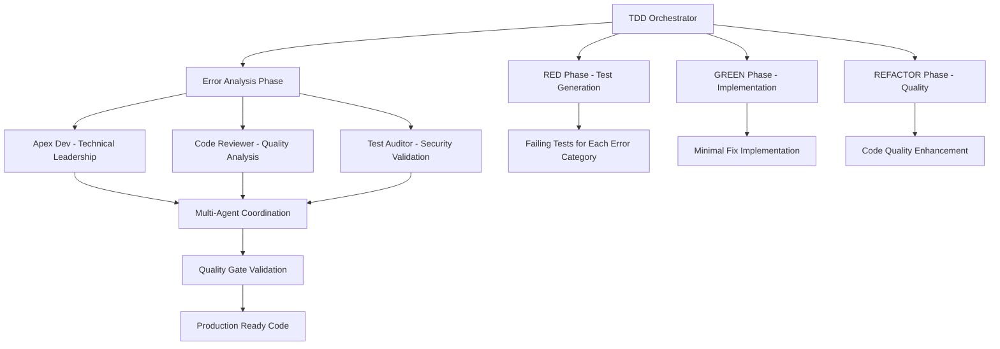
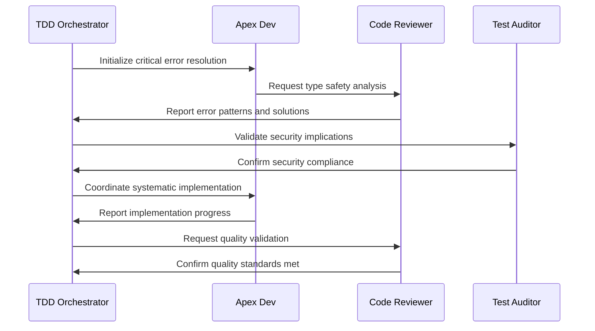
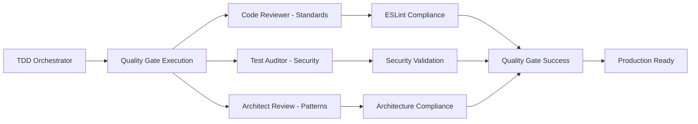
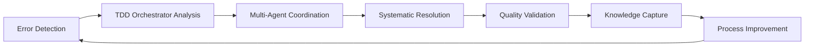

# NeonPro Quality Control Error Resolution Design

## Overview

This design document outlines a comprehensive TDD orchestrator-driven strategy for resolving all errors identified in the `/home/vibecode/neonpro/docs/features/bugfix` folder. The approach follows the quality control methodology defined in `@quality-control.md`, implementing systematic error resolution through multi-agent coordination and TDD workflows.

## Error Analysis Summary

### Critical Issues Identified

Based on the analysis of bugfix documentation, the following error categories require systematic resolution:

| Category                    | Count      | Priority | Impact         |
| --------------------------- | ---------- | -------- | -------------- |
| TypeScript Type Safety      | 27 errors  | Critical | Build failures |
| Unused Variables/Imports    | 45+ errors | High     | Code quality   |
| Catch Parameter Issues      | 15+ errors | Medium   | Error handling |
| Unused Schemas/Declarations | 8+ errors  | Medium   | Dead code      |
| Orphaned Files              | TBD        | Low      | Maintenance    |

### Primary Error Sources

1. **packages/utils/src/lgpd.ts**: 27 TypeScript strict mode violations causing build failure
2. **apps/api/src/services/**: Multiple unused catch parameters and variables
3. **apps/api/src/trpc/routers/**: Unused imports and schema declarations
4. **Configuration files**: Unused parameters in middleware and monitoring

## Architecture Strategy

### TDD Orchestrator Integration

The resolution strategy implements the enhanced TDD orchestrator methodology with systematic multi-agent coordination:



### Error Resolution Workflow

#### Phase 1: RED - Systematic Error Identification

**TDD Orchestrator Coordination**

- Coordinate comprehensive error analysis with systematic categorization
- Generate failing tests that validate error resolution
- Establish quality gates for each error category

**Agent Assignment Matrix**

| Error Category | Primary Agent | Supporting Agents               | Validation Protocol                   |
| -------------- | ------------- | ------------------------------- | ------------------------------------- |
| Type Safety    | apex-dev      | code-reviewer, architect-review | TypeScript strict mode compliance     |
| Unused Code    | code-reviewer | apex-dev                        | ESLint validation + semantic analysis |
| Error Handling | test-auditor  | apex-dev, code-reviewer         | Security + reliability testing        |
| Dead Code      | code-reviewer | architect-review                | Architecture compliance               |

#### Phase 2: GREEN - Minimal Implementation

**Critical Path Resolution**

1. **packages/utils/src/lgpd.ts** - TypeScript strict mode fixes
2. **Catch parameter standardization** - Error handling patterns
3. **Unused import cleanup** - Code quality improvement
4. **Schema consolidation** - Architecture optimization

**Implementation Strategy**



#### Phase 3: REFACTOR - Quality Enhancement

**Code Quality Optimization**

- Systematic refactoring with test preservation
- Architecture pattern improvements
- Performance optimization validation
- Security enhancement verification

## Implementation Design

### Error Resolution Categories

#### 1. TypeScript Type Safety Resolution

**Target**: packages/utils/src/lgpd.ts (27 errors)

**Strategy**: Systematic null safety and type validation

**Pattern Recognition**:

- "Object is possibly 'undefined'" - Requires null checks or optional chaining
- "'local' is possibly 'undefined'" - Variable initialization validation
- Unused variable declarations - Remove or prefix with underscore

**Implementation Approach**:

| Error Pattern                | Resolution Strategy                   | Quality Gate                   |
| ---------------------------- | ------------------------------------- | ------------------------------ |
| TS18048 'possibly undefined' | Optional chaining operator (?.)       | TypeScript compilation success |
| TS2532 Object undefined      | Null safety guards with early returns | Unit test coverage             |
| TS6133 Unused variables      | Remove or prefix with underscore      | ESLint compliance              |

#### 2. Unused Code Elimination

**Target**: Multiple files across apps/api/src/

**Strategy**: Semantic analysis with usage pattern validation

**Categories**:

- Unused imports: Remove if truly unused, document if planned for future
- Unused variables: Remove completely or prefix with underscore for intentional ignoring
- Unused parameters: Prefix with underscore or implement proper usage
- Unused schemas: Remove or integrate into validation workflows

#### 3. Error Handling Standardization

**Target**: Catch parameter inconsistencies

**Strategy**: Consistent error handling patterns

**Standards**:

```typescript
// ❌ Current inconsistent patterns
catch (error) { /* unused */ }
catch (_error) { /* inconsistent naming */ }

// ✅ Standardized patterns
catch (error) { logger.error('Operation failed', error); }
catch { /* No parameter when not used */ }
catch (_error) { /* Explicitly ignored with underscore */ }
```

#### 4. Dead Code Analysis

**Target**: Orphaned files and unused exports

**Strategy**: Dependency graph analysis with systematic removal

**Process**:

1. Generate dependency graph using semantic search
2. Identify unreferenced exports and files
3. Validate removal safety through test execution
4. Archive or remove with documentation

### Quality Gates Integration

#### Automated Validation Gates

| Gate Category     | Validation Criteria               | Tools                | Success Threshold              |
| ----------------- | --------------------------------- | -------------------- | ------------------------------ |
| **Type Safety**   | TypeScript strict mode compliance | tsc --noEmit         | Zero type errors               |
| **Code Quality**  | ESLint + Oxlint compliance        | eslint, oxlint       | Zero blocking errors           |
| **Test Coverage** | Unit test validation              | Vitest               | >90% coverage for changed code |
| **Security**      | Vulnerability assessment          | Security audit tools | Zero high/critical issues      |

#### Multi-Agent Validation Protocol



### Risk Mitigation Strategy

#### Error Resolution Risk Assessment

| Risk Category            | Probability | Impact   | Mitigation Strategy                             |
| ------------------------ | ----------- | -------- | ----------------------------------------------- |
| Breaking Changes         | Medium      | High     | Comprehensive test suite execution before/after |
| Type Regression          | Low         | High     | TypeScript strict mode validation in CI         |
| Performance Degradation  | Low         | Medium   | Performance benchmarking with validation        |
| Security Vulnerabilities | Low         | Critical | Security-focused test scenarios                 |

#### Rollback Procedures

**Emergency Rollback Protocol**:

1. **State Capture**: Git commit hash + dependency snapshot
2. **Rollback Execution**: Systematic reversion with validation
3. **Verification**: Complete test suite execution
4. **Impact Assessment**: Multi-agent validation of rollback success

## Execution Workflow

### Phase-by-Phase Implementation

#### Phase 1: Critical Error Resolution (Priority 1)

**Duration**: 2-3 days
**Focus**: Build-breaking errors

**Tasks**:

1. Fix packages/utils/src/lgpd.ts TypeScript errors
2. Resolve critical unused import issues
3. Standardize catch parameter handling
4. Validate type safety compliance

**Quality Gates**:

- `bun run type-check` passes
- `bun run build` succeeds
- Critical functionality tests pass

#### Phase 2: Code Quality Enhancement (Priority 2)

**Duration**: 3-4 days\
**Focus**: Code quality and maintainability

**Tasks**:

1. Systematic unused code elimination
2. Schema consolidation and optimization
3. Error handling pattern standardization
4. Architecture compliance validation

**Quality Gates**:

- ESLint compliance achieved
- Code quality metrics improved
- Maintainability index increased

#### Phase 3: Final Validation (Priority 3)

**Duration**: 1-2 days
**Focus**: Comprehensive validation and documentation

**Tasks**:

1. Complete test suite execution
2. Performance benchmark validation
3. Security compliance verification
4. Documentation updates

**Quality Gates**:

- All tests passing
- Performance benchmarks met
- Security audit clean
- Documentation complete

### Monitoring and Validation

#### Real-Time Quality Monitoring

**Dashboard Metrics**:

- Error count by category
- Resolution progress tracking
- Quality gate status
- Agent coordination effectiveness

**Continuous Validation**:

- Automated test execution on each change
- Type safety validation in real-time
- Performance impact monitoring
- Security vulnerability scanning

#### Success Criteria

**Technical Excellence**:

- ✅ Zero TypeScript compilation errors
- ✅ Zero ESLint blocking issues
- ✅ >95% test coverage for changed code
- ✅ Zero high/critical security vulnerabilities
- ✅ Performance benchmarks maintained or improved

**Process Excellence**:

- ✅ TDD discipline maintained throughout
- ✅ Multi-agent coordination seamless
- ✅ Quality gates consistently passed
- ✅ Documentation comprehensive and current

## Technology Integration

### Tool Orchestration

#### MCP Tool Sequence

**Required Sequence**: sequential-thinking → archon → serena → desktop-commander → (context7 + tavily)

**Tool Responsibilities**:

| Tool                    | Primary Function           | Error Resolution Role                   |
| ----------------------- | -------------------------- | --------------------------------------- |
| **sequential-thinking** | Analysis and decomposition | Error categorization and strategy       |
| **archon**              | Task management            | Progress tracking and coordination      |
| **serena**              | Codebase analysis          | Pattern recognition and impact analysis |
| **desktop-commander**   | File operations            | Implementation and validation           |
| **context7**            | Documentation research     | Best practices and standards            |
| **tavily**              | Real-time information      | Current solutions and patterns          |

#### Automated Validation Commands

```bash
# Type Safety Validation
bun run type-check

# Code Quality Validation  
bun run lint
bun run oxlint:fix

# Test Suite Execution
bun run test:unit
bun run test:integration
bun run test:e2e

# Build Validation
bun run build

# Security Audit
bun audit --audit-level high

# Performance Validation
bun run test:performance
```

### Quality Assurance Framework

#### Multi-Agent Validation Workflow

**Systematic Quality Validation**:

1. **TDD Orchestrator**: Coordinate overall quality validation
2. **Code Reviewer**: Validate code quality standards and maintainability
3. **Test Auditor**: Assess security vulnerabilities and compliance
4. **Architect Review**: Verify architecture patterns and design compliance
5. **Apex Dev**: Coordinate implementation and technical excellence

#### Continuous Improvement Loop



## Expected Outcomes

### Quantifiable Results

**Error Reduction Targets**:

- TypeScript errors: 27 → 0 (100% reduction)
- ESLint errors: 45+ → 0 (100% reduction)
- Unused code instances: 30+ → 0 (100% reduction)
- Security vulnerabilities: Maintain zero high/critical

**Quality Metrics Improvement**:

- Code maintainability index: +15-20%
- Test coverage: Maintain >90% overall
- Build time: Maintain or improve current performance
- Bundle size: No degradation, potential optimization

### Process Excellence Outcomes

**TDD Orchestrator Excellence**:

- Systematic error resolution with RED-GREEN-REFACTOR discipline
- Seamless multi-agent coordination with quality handoffs
- Comprehensive quality gate enforcement
- Real-time monitoring and adaptive improvement

**Knowledge Base Enhancement**:

- Error pattern recognition and automated prevention
- Best practices documentation for future error prevention
- Team education on quality control methodologies
- Continuous improvement process establishment
