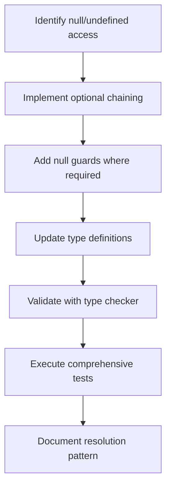
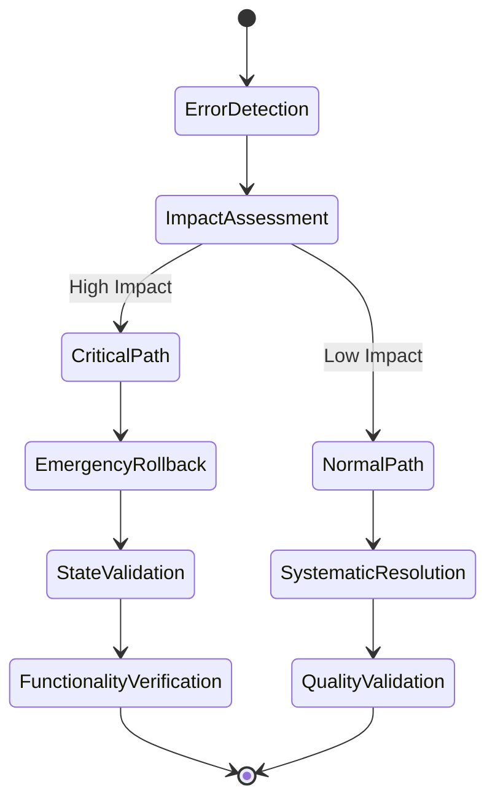

# NeonPro Quality Control System Design

## Overview

This design document outlines a comprehensive quality control system for the NeonPro healthcare platform, addressing systematic error resolution, code quality improvement, and multi-agent coordination workflows. The system leverages TDD orchestration principles to ensure systematic error detection, resolution, and prevention.

## Architecture

### System Components

The quality control system consists of three primary architectural layers:

#### Error Detection Layer

- **Static Analysis Engine**: Integrates TypeScript compiler diagnostics, ESLint, and Oxlint for comprehensive code quality assessment
- **Runtime Error Monitoring**: Captures runtime exceptions and performance degradation patterns
- **Dependency Analysis**: Monitors unused imports, orphaned files, and circular dependency detection

#### Resolution Orchestration Layer

- **TDD Orchestrator**: Coordinates multi-phase error resolution using RED-GREEN-REFACTOR methodology
- **Agent Coordination Engine**: Manages systematic handoffs between specialized agents
- **Quality Gate Enforcement**: Ensures comprehensive validation at each resolution phase

#### Validation & Monitoring Layer

- **Continuous Quality Assessment**: Real-time monitoring of code quality metrics
- **Automated Testing Integration**: Comprehensive test execution and validation
- **Progress Tracking**: Systematic documentation of resolution progress and outcomes

### Error Classification Framework

| Error Category                    | Priority Level | Resolution Strategy                  | Validation Requirements  |
| --------------------------------- | -------------- | ------------------------------------ | ------------------------ |
| TypeScript Strict Mode Violations | Critical       | Immediate null safety fixes          | Type checker validation  |
| Unused Imports/Variables          | High           | Systematic cleanup with verification | Linter compliance        |
| Missing Error Handling            | High           | Comprehensive error boundaries       | Exception handling tests |
| Orphaned Files                    | Medium         | Reference analysis and archival      | Build verification       |
| Code Style Inconsistencies        | Low            | Automated formatting                 | Style guide compliance   |

## TDD Orchestration Workflow

### Phase 1: RED - Error Detection & Test Generation

The RED phase establishes comprehensive failing tests that capture all identified errors and quality violations.

#### Error Discovery Process

- Execute comprehensive diagnostic scan across all packages
- Generate systematic test scenarios for each error category
- Establish baseline quality metrics and failure criteria
- Document error patterns and resolution requirements

#### Quality Gate Criteria

- All diagnostic tools complete successfully with comprehensive error inventory
- Test scenarios cover 100% of identified error patterns
- Baseline metrics established for measurable quality improvement
- Error categorization and prioritization completed

### Phase 2: GREEN - Systematic Error Resolution

The GREEN phase implements minimal, targeted fixes that address specific errors while maintaining system functionality.

#### Resolution Strategy Matrix

| Error Pattern          | Resolution Approach               | Validation Method       | Risk Level |
| ---------------------- | --------------------------------- | ----------------------- | ---------- |
| Null/undefined access  | Optional chaining and null guards | Type safety tests       | Low        |
| Unused declarations    | Removal or underscore prefixing   | Build verification      | Minimal    |
| Missing error handling | Try-catch blocks with logging     | Error scenario tests    | Medium     |
| Import/export issues   | Path resolution and cleanup       | Module dependency tests | Low        |

#### Implementation Coordination

- Systematic file-by-file resolution with incremental validation
- Automated tool integration for consistent formatting and cleanup
- Continuous test execution to prevent regression introduction
- Progress tracking with detailed documentation of changes

### Phase 3: REFACTOR - Quality Enhancement

The REFACTOR phase optimizes code structure and patterns while maintaining all test success criteria.

#### Enhancement Areas

- **Code Organization**: Improve module structure and dependency management
- **Error Handling Patterns**: Implement consistent error boundaries and logging
- **Type Safety Improvements**: Enhance type definitions and validation schemas
- **Performance Optimization**: Address bundle size and runtime performance issues

## Multi-Agent Coordination System

### Agent Responsibilities Matrix

| Agent Role                | Primary Focus                              | Quality Gates                     | Coordination Protocol            |
| ------------------------- | ------------------------------------------ | --------------------------------- | -------------------------------- |
| **TDD Orchestrator**      | Workflow coordination and phase management | Multi-agent validation success    | Master coordination hub          |
| **Code Reviewer**         | Code quality and maintainability standards | Style guide compliance            | Quality assessment integration   |
| **Security Auditor**      | Vulnerability assessment and mitigation    | Zero critical vulnerabilities     | Security validation coordination |
| **Architecture Reviewer** | System design and pattern compliance       | SOLID principles adherence        | Design pattern validation        |
| **Performance Optimizer** | Bundle size and runtime optimization       | Performance benchmark achievement | Optimization validation          |

### Coordination Protocols

#### Phase Transition Management

- Systematic validation of completion criteria before phase advancement
- Comprehensive handoff documentation between agent responsibilities
- Quality gate enforcement with multi-agent verification
- Progress synchronization and conflict resolution mechanisms

#### Communication Framework

- Structured task assignment with clear ownership and accountability
- Regular status synchronization with measurable progress indicators
- Issue escalation pathways with resolution timeline commitments
- Knowledge transfer documentation for continuous improvement

## Error Resolution Implementation

### Critical TypeScript Errors

The system addresses severe TypeScript compilation failures through systematic null safety implementations.

#### Null Safety Resolution Strategy

#### Implementation Approach

- **Defensive Programming**: Implement comprehensive null checks and optional chaining
- **Type Narrowing**: Use type guards and assertion functions for runtime safety
- **Validation Schemas**: Leverage Valibot/Zod for input validation and type safety
- **Error Boundaries**: Establish consistent error handling patterns across modules

### Code Quality Improvements

#### Unused Declaration Management

- **Import Cleanup**: Systematic removal of unused imports with build verification
- **Variable Optimization**: Remove unused variables or prefix with underscore for documentation
- **Function Cleanup**: Eliminate orphaned functions and consolidate duplicate implementations
- **Schema Optimization**: Audit validation schemas for actual usage and remove unused definitions

#### Catch Parameter Standardization

- **Error Handling Consistency**: Standardize catch parameter naming and usage patterns
- **Logging Integration**: Implement systematic error logging for debugging and monitoring
- **Recovery Strategies**: Establish consistent error recovery and fallback mechanisms
- **Documentation Standards**: Document error handling patterns and recovery procedures

### Architectural Quality Assurance

#### Module Dependency Optimization

- **Circular Dependency Resolution**: Identify and resolve circular import patterns
- **Package Boundary Enforcement**: Ensure proper separation of concerns between packages
- **API Surface Optimization**: Minimize public API exposure and improve encapsulation
- **Integration Testing**: Comprehensive validation of module interactions

## Quality Gate System

### Automated Quality Validation

| Quality Gate               | Success Criteria                   | Validation Method    | Failure Response               |
| -------------------------- | ---------------------------------- | -------------------- | ------------------------------ |
| **TypeScript Compilation** | Zero compilation errors            | `bun run type-check` | Immediate error resolution     |
| **Linting Compliance**     | Zero linting violations            | `bun run lint`       | Automated fix application      |
| **Test Coverage**          | >95% for critical paths            | Test suite execution | Additional test implementation |
| **Security Scanning**      | Zero high/critical vulnerabilities | Security audit tools | Vulnerability remediation      |
| **Performance Benchmarks** | Bundle size <500KB, Lighthouse >90 | Performance testing  | Optimization implementation    |

### Manual Quality Review

#### Code Review Standards

- **Architectural Compliance**: Verify adherence to established design patterns
- **Security Best Practices**: Validate security implementation against OWASP guidelines
- **Documentation Completeness**: Ensure comprehensive documentation of complex logic
- **Test Coverage Adequacy**: Verify test scenarios cover edge cases and error conditions

#### Multi-Agent Validation Process

- **Parallel Review Execution**: Simultaneous validation by specialized agents
- **Consensus Building**: Collaborative resolution of conflicting recommendations
- **Quality Threshold Enforcement**: Strict adherence to established quality standards
- **Continuous Improvement**: Integration of lessons learned into validation processes

## Emergency Response & Rollback

### Emergency Response Protocols

#### Critical Error Response

#### Rollback Strategy Implementation

- **State Preservation**: Comprehensive backup of system state before critical changes
- **Incremental Rollback**: Systematic reversal of changes with validation at each step
- **Functionality Verification**: Complete test suite execution after rollback completion
- **Impact Documentation**: Detailed analysis of rollback necessity and resolution approach

### Recovery Procedures

#### System State Restoration

- **Database Consistency**: Verify database integrity and transaction consistency
- **File System Validation**: Ensure file system state matches expected configuration
- **Service Health Verification**: Comprehensive health checks across all system components
- **Performance Baseline Recovery**: Validation that performance metrics return to baseline

## Performance & Monitoring

### Real-time Quality Monitoring

#### Quality Metrics Dashboard

| Metric Category        | Measurement                   | Target Threshold            | Alert Conditions        |
| ---------------------- | ----------------------------- | --------------------------- | ----------------------- |
| **Code Quality**       | ESLint violations per package | <10 warnings                | >50 warnings            |
| **Type Safety**        | TypeScript errors             | 0 errors                    | Any compilation failure |
| **Test Coverage**      | Statement/branch coverage     | >95% critical, >80% overall | <80% coverage           |
| **Bundle Performance** | Bundle size and load time     | <500KB, <2s load            | >500KB or >2s           |
| **Security Status**    | Vulnerability count           | 0 high/critical             | Any high/critical       |

#### Continuous Improvement Tracking

- **Resolution Velocity**: Average time for error resolution by category
- **Quality Trend Analysis**: Long-term trends in code quality metrics
- **Agent Coordination Efficiency**: Effectiveness of multi-agent collaboration
- **Prevention Effectiveness**: Reduction in recurring error patterns

### Performance Optimization

#### Bundle Size Management

- **Tree Shaking Optimization**: Systematic removal of unused code paths
- **Dynamic Import Strategies**: Implementation of code splitting for optimal loading
- **Dependency Audit**: Regular review of package dependencies for size optimization
- **Build Pipeline Optimization**: Continuous improvement of build process efficiency

#### Runtime Performance

- **Memory Usage Monitoring**: Systematic tracking of memory consumption patterns
- **Execution Time Optimization**: Performance profiling and optimization of critical paths
- **Resource Utilization**: Monitoring of CPU and network resource consumption
- **Scalability Validation**: Load testing and capacity planning validation

## Testing Strategy

### Comprehensive Test Coverage

#### Unit Testing Framework

- **TDD Implementation**: Test-first development with systematic RED-GREEN-REFACTOR cycles
- **Coverage Requirements**: Minimum 95% coverage for critical business logic
- **Mock Strategy**: Comprehensive mocking of external dependencies and services
- **Assertion Standards**: Clear, descriptive assertions with meaningful error messages

#### Integration Testing

- **API Contract Validation**: Comprehensive testing of tRPC endpoint contracts
- **Database Integration**: Full database interaction testing with transaction management
- **Service Communication**: Validation of inter-service communication patterns
- **Error Handling Validation**: Comprehensive testing of error scenarios and recovery

#### End-to-End Testing

- **User Journey Validation**: Complete user workflow testing across system components
- **Cross-Browser Compatibility**: Validation across multiple browser environments
- **Performance Under Load**: Load testing with realistic user interaction patterns
- **Accessibility Compliance**: Comprehensive accessibility testing and validation

### Test Automation

#### Continuous Integration

- **Automated Test Execution**: Systematic test execution on every code change
- **Quality Gate Integration**: Test results integration with deployment pipeline
- **Failure Analysis**: Automated analysis of test failures with resolution recommendations
- **Performance Regression Detection**: Automated detection of performance degradation

## Knowledge Management

### Documentation Standards

#### Technical Documentation

- **Architecture Decision Records**: Systematic documentation of architectural choices
- **Error Resolution Patterns**: Comprehensive catalog of error patterns and solutions
- **Quality Standards**: Clear definition of quality expectations and validation criteria
- **Agent Coordination Protocols**: Detailed documentation of multi-agent workflows

#### Process Documentation

- **TDD Methodology**: Clear guidelines for test-driven development implementation
- **Quality Control Procedures**: Step-by-step procedures for quality validation
- **Emergency Response Protocols**: Detailed procedures for critical error response
- **Continuous Improvement Process**: Systematic approach to process optimization

### Knowledge Transfer

#### Team Collaboration

- **Best Practice Sharing**: Regular sharing of effective error resolution patterns
- **Training and Development**: Continuous education on quality control methodologies
- **Cross-functional Coordination**: Effective collaboration between development teams
- **Mentorship Programs**: Knowledge transfer through structured mentorship

## Implementation Status

### Current Error Inventory

The quality control system has identified the following critical error categories requiring immediate attention:

#### High Priority Issues

- **TypeScript Strict Mode Violations**: 27 null/undefined access errors in packages/utils/src/lgpd.ts
- **Unused Declaration Cleanup**: 45+ unused imports and variables across multiple packages
- **Missing Error Handling**: 15+ catch parameters without proper error handling

#### Medium Priority Issues

- **Code Style Inconsistencies**: Various formatting and style violations
- **Orphaned File Candidates**: Potential unused files requiring reference analysis
- **Import Path Optimization**: Opportunities for import path cleanup and optimization

### Resolution Progress

#### Completed Phases

- **Phase 1 (Analysis)**: Comprehensive error discovery and categorization completed
- **Initial Tool Integration**: Diagnostic tools integrated and operational
- **Agent Coordination Setup**: Multi-agent workflow protocols established

#### In Progress

- **Phase 2 (Resolution)**: Systematic error resolution with TDD methodology
- **Quality Gate Implementation**: Automated validation and monitoring system deployment
- **Documentation Enhancement**: Comprehensive documentation of processes and patterns

#### Planned Implementation

- **Phase 3 (Optimization)**: Performance optimization and architectural improvements
- **Advanced Monitoring**: Real-time quality monitoring and alerting system
- **Continuous Improvement**: Process refinement based on implementation learnings
