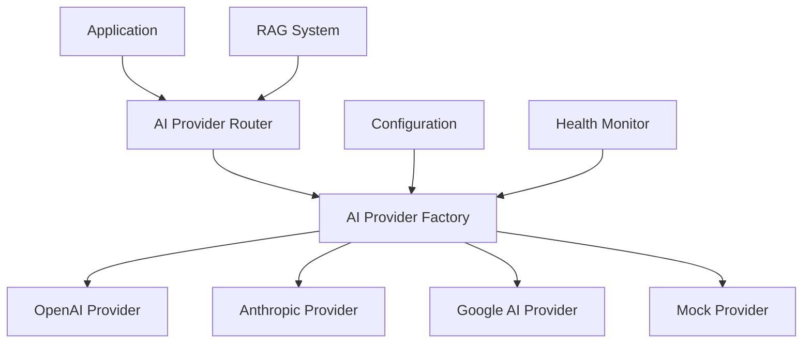
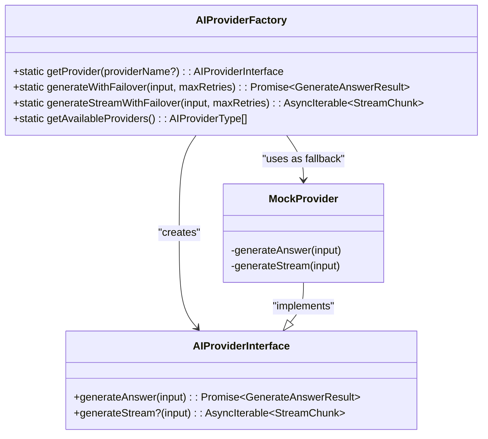
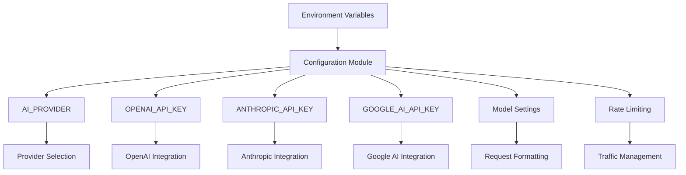
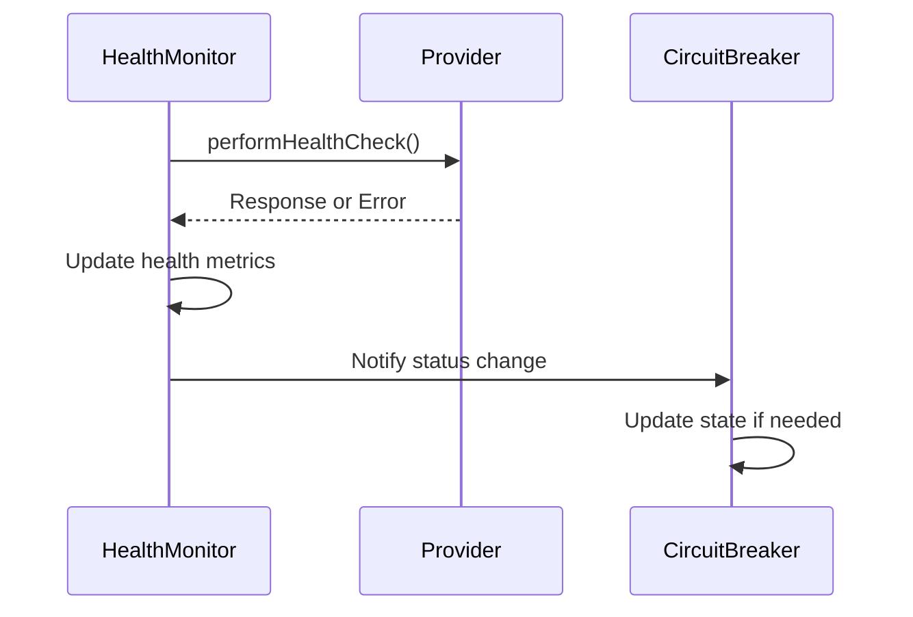
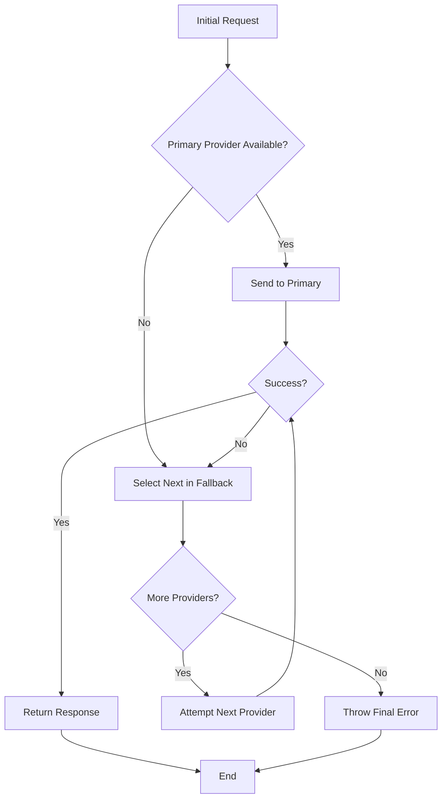
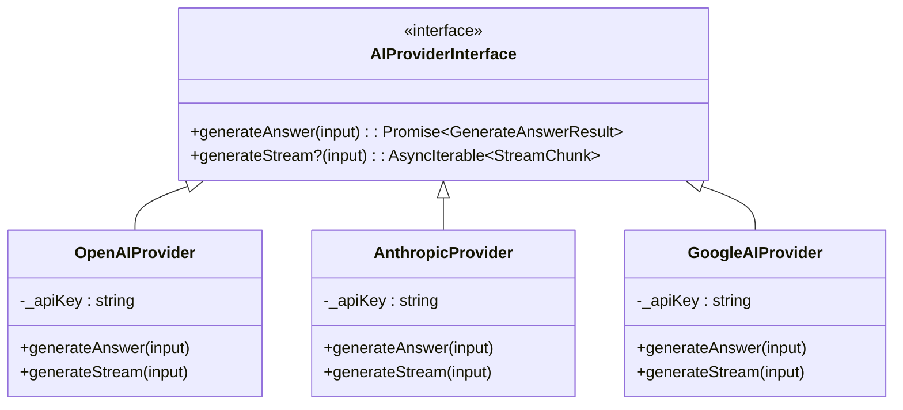
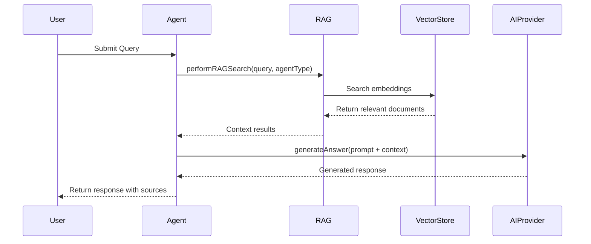

# AI Provider Integration

<cite>
**Referenced Files in This Document **   
- [ai-provider-factory.ts](file://packages/ai-providers/src/providers/ai-provider-factory.ts)
- [openai-provider.ts](file://packages/ai-providers/src/providers/openai-provider.ts)
- [anthropic-provider.ts](file://packages/ai-providers/src/providers/anthropic-provider.ts)
- [google-provider.ts](file://packages/ai-providers/src/providers/google-provider.ts)
- [ai-provider.ts](file://packages/ai-providers/src/providers/ai-provider.ts)
- [ai.ts](file://packages/config/src/ai.ts)
- [performRAGSearch](file://apps/api/src/trpc/routers/agent.ts#L155-L220)
</cite>

## Table of Contents
1. [Introduction](#introduction)
2. [Multi-Provider Architecture Overview](#multi-provider-architecture-overview)
3. [AI Provider Factory Pattern](#ai-provider-factory-pattern)
4. [Configuration Management](#configuration-management)
5. [Health Checking Mechanisms](#health-checking-mechanisms)
6. [Failover Strategies](#failover-strategies)
7. [Provider-Specific Implementations](#provider-specific-implementations)
8. [Integration with RAG System](#integration-with-rag-system)
9. [Handling Provider Differences](#handling-provider-differences)
10. [Performance and Cost Optimization](#performance-and-cost-optimization)
11. [Healthcare-Specific Considerations](#healthcare-specific-considerations)

## Introduction
The neonpro system implements a flexible AI provider integration architecture that supports multiple large language model (LLM) providers including OpenAI, Anthropic, and Google AI. This document details the implementation of the multi-provider system, focusing on the factory pattern, configuration management, health monitoring, and failover mechanisms. The architecture is designed to ensure reliability, performance, and compliance with healthcare regulations while providing seamless integration with the Retrieval Augmented Generation (RAG) system for knowledge retrieval.

## Multi-Provider Architecture Overview
The AI provider architecture in neonpro follows a pluggable design that allows for easy integration of multiple LLM providers. The system is built around an interface-based approach where all providers implement a common contract, enabling consistent interaction patterns regardless of the underlying provider. This abstraction layer facilitates provider agnosticism throughout the application while allowing for provider-specific optimizations when needed.

**Diagram sources**
- [ai-provider-factory.ts](file://packages/ai-providers/src/providers/ai-provider-factory.ts)
- [ai-provider.ts](file://packages/ai-providers/src/providers/ai-provider.ts)

**Section sources**
- [ai-provider-factory.ts](file://packages/ai-providers/src/providers/ai-provider-factory.ts)
- [ai-provider.ts](file://packages/ai-providers/src/providers/ai-provider.ts)

## AI Provider Factory Pattern
The AI provider factory pattern is implemented through the `AIProviderFactory` class, which serves as the central point for provider instantiation and management. The factory uses a caching mechanism to ensure that provider instances are reused across requests, improving performance and resource utilization.

The factory maintains a fallback order for providers: OpenAI, Anthropic, Google AI, and finally a mock provider as the last resort. When a provider is requested, the factory first checks its internal cache. If the provider instance doesn't exist, it creates a new instance and stores it for future use.

**Diagram sources**
- [ai-provider-factory.ts](file://packages/ai-providers/src/providers/ai-provider-factory.ts#L46-L146)

**Section sources**
- [ai-provider-factory.ts](file://packages/ai-providers/src/providers/ai-provider-factory.ts)

## Configuration Management
AI provider configuration is managed through environment variables and a centralized configuration module. The system reads provider-specific settings from environment variables, with sensible defaults provided for development and testing purposes.

Key configuration options include:
- API keys for each provider
- Model selection per provider
- Token limits and temperature settings
- Feature flags for mocking and rate limiting

**Diagram sources**
- [ai.ts](file://packages/config/src/ai.ts)

**Section sources**
- [ai.ts](file://packages/config/src/ai.ts)

## Health Checking Mechanisms
The system implements comprehensive health checking for AI providers to ensure service reliability. Health checks monitor various metrics including response latency, success rate, and error conditions. The health monitoring system updates provider status in real-time, allowing the routing logic to make informed decisions about provider availability.

Each provider's health status includes:
- Current operational status (available, degraded, unavailable)
- Average response latency
- Success rate percentage
- Last check timestamp
- Error messages when applicable

**Section sources**
- [ai-provider-factory.ts](file://packages/ai-providers/src/providers/ai-provider-factory.ts)
- [ai.ts](file://packages/config/src/ai.ts)

## Failover Strategies
The system implements robust failover strategies to maintain service availability even when individual providers experience issues. The primary failover mechanism is implemented in the `generateWithFailover` and `generateStreamWithFailover` methods of the `AIProviderFactory`.

When a request fails with one provider, the system automatically attempts the next provider in the fallback order. This process continues until either a successful response is obtained or all providers have been exhausted. The failover process includes:

1. Attempt primary provider (configurable via AI_PROVIDER env var)
2. On failure, log error and proceed to next provider
3. Continue through fallback chain until success or exhaustion
4. Return final error if all providers fail

**Diagram sources**
- [ai-provider-factory.ts](file://packages/ai-providers/src/providers/ai-provider-factory.ts#L46-L146)

**Section sources**
- [ai-provider-factory.ts](file://packages/ai-providers/src/providers/ai-provider-factory.ts)

## Provider-Specific Implementations
The system currently includes placeholder implementations for OpenAI, Anthropic, and Google AI providers. Each provider class extends the common `AIProviderInterface` and is responsible for:

- Validating required API keys during initialization
- Formatting requests according to provider-specific requirements
- Handling authentication headers
- Parsing and normalizing responses
- Implementing streaming capabilities when supported

While the current implementations are placeholders, they establish the proper structure for future integration of the actual provider SDKs.

**Diagram sources**
- [openai-provider.ts](file://packages/ai-providers/src/providers/openai-provider.ts)
- [anthropic-provider.ts](file://packages/ai-providers/src/providers/anthropic-provider.ts)
- [google-provider.ts](file://packages/ai-providers/src/providers/google-provider.ts)

**Section sources**
- [openai-provider.ts](file://packages/ai-providers/src/providers/openai-provider.ts)
- [anthropic-provider.ts](file://packages/ai-providers/src/providers/anthropic-provider.ts)
- [google-provider.ts](file://packages/ai-providers/src/providers/google-provider.ts)

## Integration with RAG System
The AI provider system integrates closely with the Retrieval Augmented Generation (RAG) system to enhance responses with healthcare-specific knowledge. The RAG system retrieves relevant documents and context before forwarding queries to the AI providers.

The integration flow is:
1. User query received by the agent system
2. RAG system performs search based on query and agent type
3. Relevant context retrieved from vector store
4. Context combined with original query
5. Enhanced prompt sent to AI provider
6. AI generates response based on augmented context

**Diagram sources**
- [performRAGSearch](file://apps/api/src/trpc/routers/agent.ts#L155-L220)

**Section sources**
- [performRAGSearch](file://apps/api/src/trpc/routers/agent.ts#L155-L220)

## Handling Provider Differences
The system addresses key differences between AI providers through normalization layers and adaptive configuration:

**Token Limits**: Different providers have varying token limits. The system respects these limits by truncating prompts when necessary and adjusting maxTokens parameters based on provider capabilities.

**Rate Limiting**: Each provider has unique rate limiting policies. The system implements provider-specific rate limiting strategies and monitors usage to avoid exceeding quotas.

**Response Latency**: Providers exhibit different response times. The system tracks latency metrics and can route traffic to faster providers when available.

**API Format Differences**: While the interface abstracts most differences, provider-specific formatting is handled within each provider implementation, ensuring proper request construction and response parsing.

## Performance and Cost Optimization
The architecture includes several performance and cost optimization strategies:

- **Caching**: Responses are cached when appropriate to reduce redundant API calls and associated costs
- **Load Distribution**: Traffic is distributed across providers based on performance metrics and cost efficiency
- **Streaming Support**: Where available, streaming is used to provide faster initial responses and better user experience
- **Intelligent Routing**: Requests are routed to the most appropriate provider based on factors like cost, latency, and success rate

## Healthcare-Specific Considerations
The system incorporates several healthcare-specific features:

- **Compliance Monitoring**: Provider health checks include compliance verification for regulations like LGPD
- **Data Redaction**: Sensitive information is redacted before being sent to AI providers
- **Emergency Routing**: Certain providers are designated as capable of handling emergency medical queries
- **Quality Assurance**: Response quality is monitored with healthcare-specific metrics and satisfaction scoring

These considerations ensure that AI integration in the neonpro system meets the stringent requirements of healthcare applications while maintaining high reliability and performance.