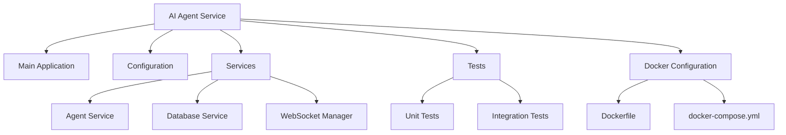
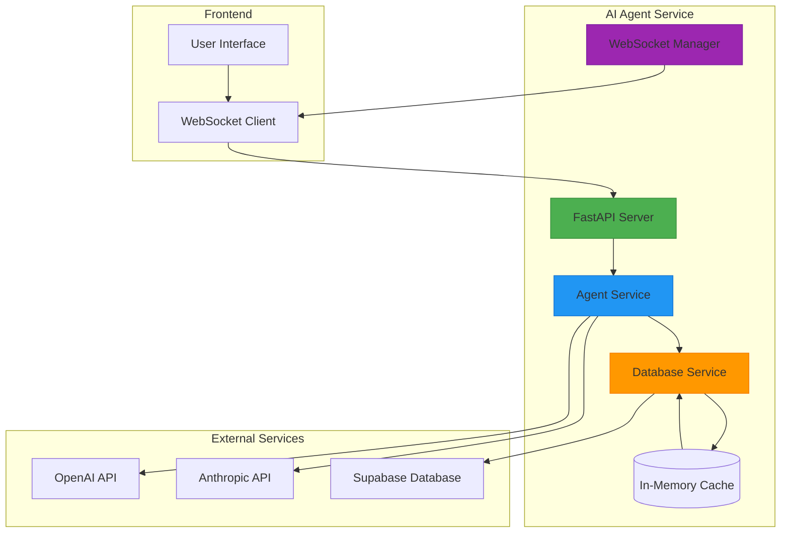
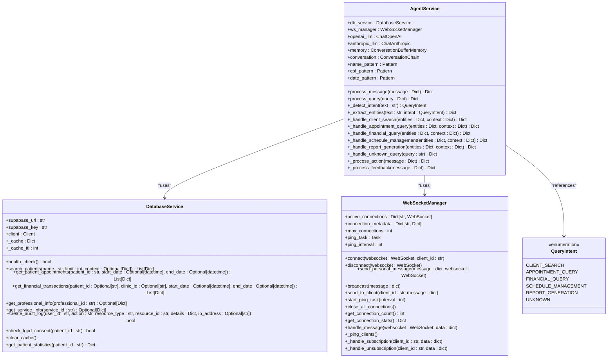
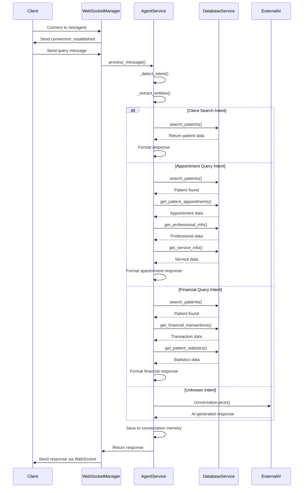
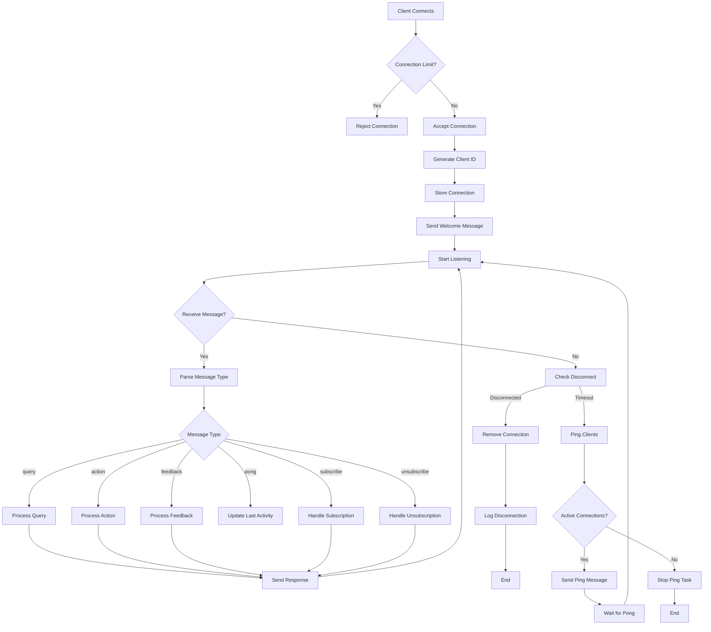
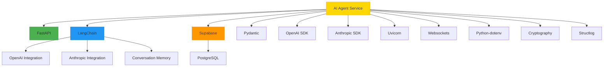

# AI Services

<cite>
**Referenced Files in This Document **   
- [main.py](file://apps/ai-agent/main.py)
- [config.py](file://apps/ai-agent/config.py)
- [agent_service.py](file://apps/ai-agent/services/agent_service.py)
- [database_service.py](file://apps/ai-agent/services/database_service.py)
- [websocket_manager.py](file://apps/ai-agent/services/websocket_manager.py)
- [requirements.txt](file://apps/ai-agent/requirements.txt)
</cite>

## Table of Contents
1. [Introduction](#introduction)
2. [Project Structure](#project-structure)
3. [Core Components](#core-components)
4. [Architecture Overview](#architecture-overview)
5. [Detailed Component Analysis](#detailed-component-analysis)
6. [Dependency Analysis](#dependency-analysis)
7. [Performance Considerations](#performance-considerations)
8. [Troubleshooting Guide](#troubleshooting-guide)
9. [Conclusion](#conclusion)

## Introduction
The NeonPro AI Agent Service is a healthcare-focused artificial intelligence system built with FastAPI and Python, designed to provide real-time assistance through WebSocket communication. The service enables natural language interaction for querying patient data, appointment information, and financial records while maintaining compliance with Brazilian healthcare regulations such as LGPD (Lei Geral de Proteção de Dados). The architecture integrates multiple AI providers including OpenAI and Anthropic, implements RAG (Retrieval-Augmented Generation) capabilities, and follows the AG-UI protocol for structured communication between frontend and backend systems.

## Project Structure
The AI agent service is organized within the `apps/ai-agent` directory and follows a modular structure with clear separation of concerns. The core functionality is divided into services for agent logic, database operations, and WebSocket management. Configuration is handled through Pydantic settings with environment variable support, and the application uses standard Python packaging conventions with requirements files for dependencies.

**Diagram sources **
- [main.py](file://apps/ai-agent/main.py)
- [services/agent_service.py](file://apps/ai-agent/services/agent_service.py)
- [services/database_service.py](file://apps/ai-agent/services/database_service.py)
- [services/websocket_manager.py](file://apps/ai-agent/services/websocket_manager.py)

**Section sources**
- [main.py](file://apps/ai-agent/main.py)
- [config.py](file://apps/ai-agent/config.py)
- [services/agent_service.py](file://apps/ai-agent/services/agent_service.py)
- [services/database_service.py](file://apps/ai-agent/services/database_service.py)
- [services/websocket_manager.py](file://apps/ai-agent/services/websocket_manager.py)

## Core Components
The AI Agent Service consists of three primary components: the AgentService handles natural language processing and business logic, the DatabaseService manages interactions with Supabase for healthcare data retrieval, and the WebSocketManager orchestrates real-time bidirectional communication with clients. These components work together to process user queries, extract relevant entities, determine intent, and return structured responses while maintaining conversation context through memory buffers.

**Section sources**
- [agent_service.py](file://apps/ai-agent/services/agent_service.py)
- [database_service.py](file://apps/ai-agent/services/database_service.py)
- [websocket_manager.py](file://apps/ai-agent/services/websocket_manager.py)

## Architecture Overview
The AI services architecture follows a microservices pattern with FastAPI as the web framework, enabling both REST API endpoints and WebSocket connections for real-time communication. The system integrates with external AI providers (OpenAI, Anthropic) through LangChain, connects to Supabase for persistent storage of healthcare data, and implements the AG-UI protocol for standardized message exchange. The architecture supports both synchronous REST queries and asynchronous WebSocket interactions, with proper error handling, logging, and health checks.

**Diagram sources **
- [main.py](file://apps/ai-agent/main.py)
- [agent_service.py](file://apps/ai-agent/services/agent_service.py)
- [database_service.py](file://apps/ai-agent/services/database_service.py)
- [websocket_manager.py](file://apps/ai-agent/services/websocket_manager.py)

## Detailed Component Analysis

### Agent Service Analysis
The AgentService class is the core component responsible for processing natural language queries, determining user intent, extracting entities, and coordinating responses from various data sources. It uses LangChain's ConversationChain with memory to maintain context across interactions and implements intent detection based on keyword patterns in Portuguese.

#### For Object-Oriented Components:

**Diagram sources **
- [agent_service.py](file://apps/ai-agent/services/agent_service.py#L35-L480)
- [database_service.py](file://apps/ai-agent/services/database_service.py#L14-L284)
- [websocket_manager.py](file://apps/ai-agent/services/websocket_manager.py#L14-L230)

#### For API/Service Components:

**Diagram sources **
- [main.py](file://apps/ai-agent/main.py#L100-L127)
- [agent_service.py](file://apps/ai-agent/services/agent_service.py#L100-L480)
- [database_service.py](file://apps/ai-agent/services/database_service.py#L50-L284)
- [websocket_manager.py](file://apps/ai-agent/services/websocket_manager.py#L50-L230)

**Section sources**
- [agent_service.py](file://apps/ai-agent/services/agent_service.py#L35-L480)
- [database_service.py](file://apps/ai-agent/services/database_service.py#L14-L284)
- [websocket_manager.py](file://apps/ai-agent/services/websocket_manager.py#L14-L230)

### Communication Protocol Analysis
The AI agent system implements real-time communication through WebSockets using the AG-UI protocol, which defines standardized message types for queries, actions, and feedback. The WebSocketManager handles connection lifecycle management, including ping/pong keep-alive messages, connection metadata tracking, and broadcast capabilities. The protocol supports both request-response patterns and event-driven subscriptions, enabling rich interactive experiences between the frontend and AI agent.

**Diagram sources **
- [websocket_manager.py](file://apps/ai-agent/services/websocket_manager.py#L14-L230)
- [main.py](file://apps/ai-agent/main.py#L100-L127)

**Section sources**
- [websocket_manager.py](file://apps/ai-agent/services/websocket_manager.py#L14-L230)

## Dependency Analysis
The AI agent service has well-defined dependencies managed through pip requirements files. The system relies on FastAPI for web server functionality, LangChain for AI integration, Supabase for database access, and various utility libraries for configuration, logging, and security. The dependency graph shows clear separation between core application logic, external integrations, and development/test utilities.

**Diagram sources **
- [requirements.txt](file://apps/ai-agent/requirements.txt)
- [main.py](file://apps/ai-agent/main.py)
- [agent_service.py](file://apps/ai-agent/services/agent_service.py)

**Section sources**
- [requirements.txt](file://apps/ai-agent/requirements.txt)

## Performance Considerations
The AI agent system incorporates several performance optimizations including in-memory caching of database queries, connection pooling through Supabase, and efficient WebSocket connection management. The system limits concurrent connections and implements ping/pong mechanisms to detect and clean up inactive connections. Database queries are optimized with appropriate indexing and filtering, and the agent service uses conversation memory to reduce redundant processing of similar queries.

**Section sources**
- [database_service.py](file://apps/ai-agent/services/database_service.py#L14-L284)
- [websocket_manager.py](file://apps/ai-agent/services/websocket_manager.py#L14-L230)

## Troubleshooting Guide
Common issues with the AI agent service typically involve configuration errors, connectivity problems with external services, or malformed requests. The system provides comprehensive logging through structlog, health check endpoints for monitoring, and detailed error handling with appropriate HTTP status codes. When troubleshooting, verify that environment variables are properly set, check the connectivity to Supabase and AI provider APIs, and review the logs for specific error messages.

**Section sources**
- [main.py](file://apps/ai-agent/main.py#L70-L85)
- [config.py](file://apps/ai-agent/config.py)
- [agent_service.py](file://apps/ai-agent/services/agent_service.py)

## Conclusion
The NeonPro AI Agent Service provides a robust foundation for AI-powered healthcare applications with real-time WebSocket communication, multi-provider AI integration, and strong compliance with Brazilian regulations. The modular architecture separates concerns effectively between agent logic, data access, and communication layers, making the system maintainable and extensible. By following the AG-UI protocol and implementing proper security measures, the service enables safe and effective natural language interaction with sensitive healthcare data.