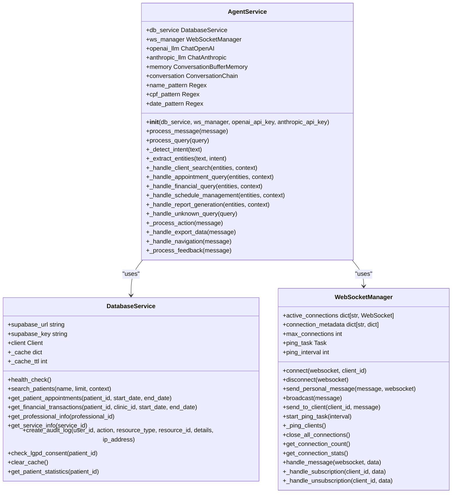
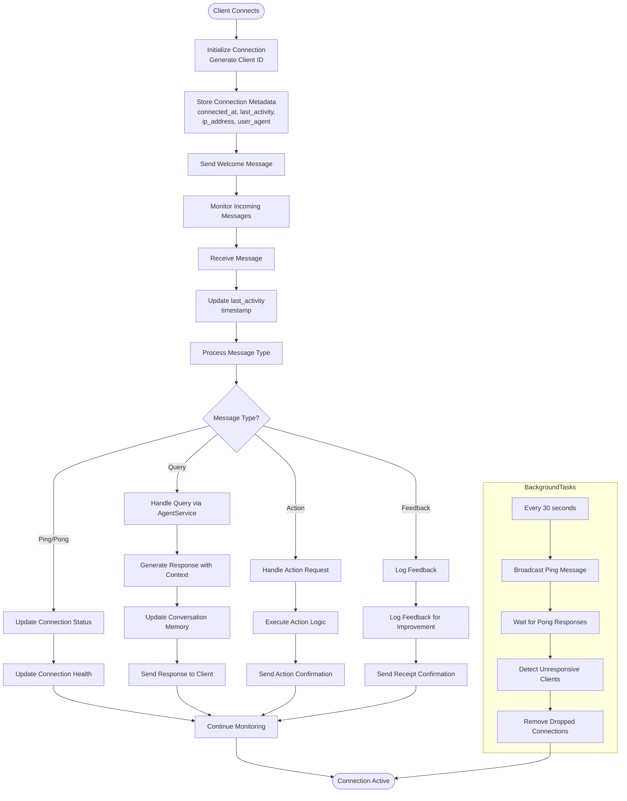

# Agent Architecture

<cite>
**Referenced Files in This Document**
- [agent_service.py](file://apps/ai-agent/services/agent_service.py)
- [database_service.py](file://apps/ai-agent/services/database_service.py)
- [websocket_manager.py](file://apps/ai-agent/services/websocket_manager.py)
- [main.py](file://apps/ai-agent/main.py)
- [config.py](file://apps/ai-agent/config.py)
</cite>

## Table of Contents

1. [Introduction](#introduction)
2. [Core Components](#core-components)
3. [Agent Service Initialization](#agent-service-initialization)
4. [Request Handling Lifecycle](#request-handling-lifecycle)
5. [Session Management and State Persistence](#session-management-and-state-persistence)
6. [Database Integration for Context Persistence](#database-integration-for-context-persistence)
7. [WebSocket Communication and Real-Time Interaction](#websocket-communication-and-real-time-interaction)
8. [Intent Detection and Entity Extraction](#intent-detection-and-entity-extraction)
9. [Error Handling and Recovery Mechanisms](#error-handling-and-recovery-mechanisms)
10. [Performance Optimization and Concurrency](#performance-optimization-and-concurrency)
11. [Troubleshooting Guide](#troubleshooting-guide)

## Introduction

The NeonPro AI agent architecture is a FastAPI-based service designed to provide intelligent assistance in healthcare data management. The system integrates real-time WebSocket communication, REST API endpoints, and persistent database interactions to deliver responsive and context-aware responses. Built with Brazilian healthcare compliance (LGPD) in mind, the agent handles sensitive patient information while maintaining robust security and audit capabilities. This document details the implementation of the agent service, focusing on its initialization process, request handling lifecycle, state management patterns, and integration with external components such as database services and WebSocket managers.

## Core Components

The AI agent service comprises several core components that work together to process user queries and deliver intelligent responses. The AgentService class serves as the central orchestrator, coordinating interactions between the WebSocketManager for real-time communication and the DatabaseService for persistent data access. The service leverages multiple AI providers through LangChain integrations, including OpenAI's GPT-4 Turbo and Anthropic's Claude 3 Sonnet models, to generate contextually appropriate responses. These components are initialized during application startup and maintain their state throughout the service lifecycle, enabling efficient processing of both WebSocket and REST API requests.

**Section sources**

- [agent_service.py](file://apps/ai-agent/services/agent_service.py#L35-L480)
- [database_service.py](file://apps/ai-agent/services/database_service.py#L14-L284)
- [websocket_manager.py](file://apps/ai-agent/services/websocket_manager.py#L14-L230)

## Agent Service Initialization

The AgentService initialization process establishes connections to essential external services and configures the AI models used for response generation. During instantiation, the service receives instances of DatabaseService and WebSocketManager, along with API keys for OpenAI and Anthropic services. It initializes two language models: ChatOpenAI configured with GPT-4 Turbo Preview and ChatAnthropic using Claude 3 Sonnet, both set with low temperature values (0.1) to ensure consistent and deterministic responses. The service also sets up ConversationBufferMemory to maintain conversation history across interactions, enabling context-aware responses. Additionally, it defines regular expressions for detecting Brazilian healthcare-specific patterns such as names, CPF numbers, and date formats, which are crucial for entity extraction in Portuguese-language queries.



**Diagram sources **

- [agent_service.py](file://apps/ai-agent/services/agent_service.py#L35-L480)
- [database_service.py](file://apps/ai-agent/services/database_service.py#L14-L284)
- [websocket_manager.py](file://apps/ai-agent/services/websocket_manager.py#L14-L230)

**Section sources**

- [agent_service.py](file://apps/ai-agent/services/agent_service.py#L35-L480)

## Request Handling Lifecycle

The request handling lifecycle in the AI agent service follows a structured flow that begins with message reception and ends with response delivery. For WebSocket connections, the main.py file establishes an endpoint at /ws/agent that accepts incoming connections through the WebSocketManager. When a message arrives, the agent_service.py processes it by first determining its type (query, action, or feedback) and then routing it to the appropriate handler method. For REST API requests, the /api/agent/query endpoint receives JSON payloads containing user queries and context information. The process_query method parses the intent and extracts relevant entities before delegating to specialized handlers based on the detected intent. Throughout this lifecycle, the service maintains proper error handling, logging, and response formatting to ensure reliable operation. Each request is processed asynchronously, allowing the service to handle multiple concurrent connections efficiently.

```mermaid
sequenceDiagram
participant Client as "Client Application"
participant Main as "main.py"
participant Agent as "AgentService"
participant DB as "DatabaseService"
participant WS as "WebSocketManager"
Client->>Main : Connect to /ws/agent
Main->>WS : websocket.accept()
WS-->>Client : Connection established
loop Message Processing
Client->>Main : Send JSON message
Main->>Agent : process_message(message)
Agent->>Agent : Determine message type
alt Query Message
Agent->>Agent : _detect_intent(text)
Agent->>Agent : _extract_entities(text, intent)
Agent->>Agent : Route to intent handler
alt Client Search
Agent->>DB : search_patients(name, context)
DB-->>Agent : Patient data
Agent->>Agent : Format results
elif Appointment Query
Agent->>DB : get_patient_appointments(patient_id)
DB-->>Agent : Appointment data
Agent->>Agent : Format appointments
elif Financial Query
Agent->>DB : get_financial_transactions(patient_id)
DB-->>Agent : Transaction data
Agent->>Agent : Format financial data
else
Agent->>Agent : Use conversation chain
end
Agent->>WS : send_personal_message(response)
elif Action Message
Agent->>Agent : Process specific action
Agent->>WS : Send action response
elif Feedback Message
Agent->>Agent : Log feedback
Agent->>WS : Confirm receipt
end
WS-->>Client : Send response
end
Note over Client,WS : WebSocket connection remains open for real-time interaction
```

**Diagram sources **

- [main.py](file://apps/ai-agent/main.py#L0-L180)
- [agent_service.py](file://apps/ai-agent/services/agent_service.py#L35-L480)
- [websocket_manager.py](file://apps/ai-agent/services/websocket_manager.py#L14-L230)

**Section sources**

- [main.py](file://apps/ai-agent/main.py#L0-L180)
- [agent_service.py](file://apps/ai-agent/services/agent_service.py#L35-L480)

## Session Management and State Persistence

The AI agent service implements comprehensive session management to maintain conversational context across interactions. While the WebSocketManager tracks active connections and their metadata (including connection time, last activity, IP address, and user agent), the AgentService uses LangChain's ConversationBufferMemory to preserve dialogue history. This memory component stores input-output pairs from previous exchanges, allowing the conversation chain to generate contextually relevant responses. The service automatically updates the last activity timestamp for each client upon receiving messages, enabling detection of idle connections. Although the current implementation focuses on in-memory state management, the architecture supports potential extensions for persistent session storage through integration with the database service. The WebSocketManager also includes a periodic ping mechanism to maintain connection health and detect dropped clients promptly.



**Diagram sources **

- [websocket_manager.py](file://apps/ai-agent/services/websocket_manager.py#L14-L230)
- [agent_service.py](file://apps/ai-agent/services/agent_service.py#L35-L480)

**Section sources**

- [websocket_manager.py](file://apps/ai-agent/services/websocket_manager.py#L14-L230)

## Database Integration for Context Persistence

The AI agent service integrates with Supabase through the DatabaseService class to access and persist healthcare data. This integration enables the agent to retrieve patient information, appointment schedules, financial transactions, and other critical data needed to fulfill user queries. The DatabaseService implements caching mechanisms with a 5-minute TTL to optimize performance for frequently accessed data, reducing redundant database queries. All database operations follow a consistent pattern of connection management, query execution, and error handling, ensuring reliability even under high load. The service also includes LGPD-compliant features such as audit logging for data access and consent verification before retrieving sensitive patient information. These database interactions are asynchronous, allowing non-blocking operations that maintain the responsiveness of the agent service.

**Section sources**

- [database_service.py](file://apps/ai-agent/services/database_service.py#L14-L284)

## WebSocket Communication and Real-Time Interaction

The WebSocket communication system enables real-time interaction between clients and the AI agent through the AG-UI protocol. The WebSocketManager class manages all active connections, enforcing limits on maximum concurrent connections and tracking detailed metadata for each client. It supports bidirectional messaging, allowing the server to push updates to clients and receive commands in return. The manager implements a heartbeat mechanism with periodic ping messages to maintain connection health and promptly detect disconnected clients. Beyond basic message passing, the system supports subscription/unsubscription functionality for event types, providing a foundation for targeted notifications. Error handling is comprehensive, with automatic cleanup of broken connections and graceful degradation when individual message deliveries fail. This real-time capability complements the REST API, offering a more interactive experience for users requiring immediate feedback.

**Section sources**

- [websocket_manager.py](file://apps/ai-agent/services/websocket_manager.py#L14-L230)

## Intent Detection and Entity Extraction

The agent service employs rule-based intent detection and entity extraction to understand user queries and extract relevant information. The _detect_intent method analyzes text content for keywords associated with specific intents such as client search, appointment queries, financial inquiries, schedule management, and report generation. This approach uses simple keyword matching in lowercase text to determine the appropriate processing path. Complementing intent detection, the _extract_entities method identifies structured data within queries using regular expressions for names, CPF numbers, and dates. Additional extraction methods handle intent-specific entities, such as clinic information for client searches or appointment status filters for scheduling queries. While currently relying on pattern matching, this system provides a solid foundation that could be extended with machine learning models for improved accuracy in understanding natural language queries.

**Section sources**

- [agent_service.py](file://apps/ai-agent/services/agent_service.py#L35-L480)

## Error Handling and Recovery Mechanisms

The AI agent service implements comprehensive error handling and recovery mechanisms to ensure reliability and resilience. Each major operation is wrapped in try-catch blocks that log errors with appropriate severity levels and return meaningful error responses to clients. The service distinguishes between different types of errors, providing specific handling for database connectivity issues, AI model failures, and invalid input data. For WebSocket communications, the system gracefully handles disconnections by cleaning up resources and updating connection state. The architecture also includes circuit breaker patterns (evident in related components) that prevent cascading failures when dependent services become unresponsive. Additionally, the service implements audit logging for security-sensitive operations, maintaining compliance with Brazilian healthcare regulations while providing traceability for troubleshooting and recovery.

**Section sources**

- [agent_service.py](file://apps/ai-agent/services/agent_service.py#L35-L480)
- [database_service.py](file://apps/ai-agent/services/database_service.py#L14-L284)

## Performance Optimization and Concurrency

The AI agent service is designed with performance optimization and concurrency in mind, leveraging Python's async/await capabilities throughout its architecture. All database operations, AI model interactions, and network communications are implemented asynchronously, preventing blocking operations that could degrade performance under load. The service utilizes connection pooling through the Supabase client and implements caching for frequently accessed data, reducing database load and improving response times. The WebSocketManager efficiently handles multiple concurrent connections through asyncio tasks, while the FastAPI framework provides built-in support for high-performance ASGI servers like Uvicorn. Configuration options allow tuning of connection limits, cache TTL, and ping intervals to balance resource usage with responsiveness. These optimizations enable the service to handle numerous simultaneous users while maintaining low latency for time-sensitive healthcare applications.

**Section sources**

- [agent_service.py](file://apps/ai-agent/services/agent_service.py#L35-L480)
- [database_service.py](file://apps/ai-agent/services/database_service.py#L14-L284)
- [websocket_manager.py](file://apps/ai-agent/services/websocket_manager.py#L14-L230)

## Troubleshooting Guide

When troubleshooting issues with the AI agent service, begin by checking the health endpoint at /health to verify overall service status. Common issues often relate to configuration problems, such as missing environment variables for API keys or incorrect database URLs. For WebSocket connectivity issues, verify that the client is properly handling the connection establishment sequence and responding to ping messages. If queries are not returning expected results, check the intent detection logic to ensure keywords match user input patterns. Database-related errors may indicate connectivity problems or permission issues with Supabase; verify that the service role key has appropriate access rights. Performance bottlenecks can often be addressed by adjusting cache settings or connection limits in the configuration. Enable debug logging to capture detailed information about request processing and error conditions for deeper analysis.

**Section sources**

- [main.py](file://apps/ai-agent/main.py#L0-L180)
- [config.py](file://apps/ai-agent/config.py#L0-L90)
- [agent_service.py](file://apps/ai-agent/services/agent_service.py#L35-L480)
