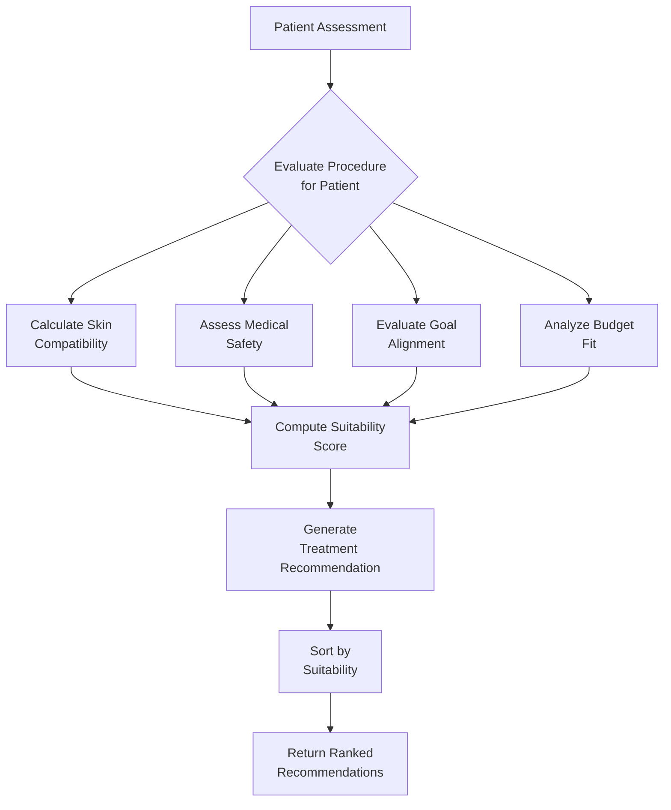
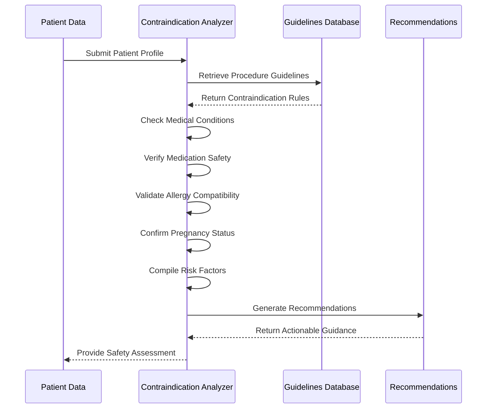

# Clinical Decision Support

<cite>
**Referenced Files in This Document**
- [ai-clinical-decision-support.ts](file://packages/core-services/src/services/ai-clinical-decision-support.ts)
- [lgpd-middleware.ts](file://apps/api/src/middleware/lgpd-middleware.ts)
- [audit-log.ts](file://apps/api/src/middleware/audit-log.ts)
- [ai-explanation.ts](file://apps/api/src/routes/ai-explanation.ts)
- [tools-clinical.ts](file://apps/api/src/routes/tools-clinical.ts)
</cite>

## Table of Contents

1. [Introduction](#introduction)
2. [Core Components](#core-components)
3. [Treatment Recommendation Engine](#treatment-recommendation-engine)
4. [Risk Assessment and Contraindication Detection](#risk-assessment-and-contraindication-detection)
5. [Integration with Electronic Health Records](#integration-with-electronic-health-records)
6. [Regulatory Compliance Framework](#regulatory-compliance-framework)
7. [Audit Logging and Accountability](#audit-logging-and-accountability)
8. [Explanation Generation for Transparency](#explanation-generation-for-transparency)
9. [Handling Incomplete Medical Histories](#handling-incomplete-medical-histories)
10. [Drug Interaction Management](#drug-interaction-management)
11. [Confidence Level Determination](#confidence-level-determination)
12. [Aesthetic Clinic Specific Considerations](#aesthetic-clinic-specific-considerations)
13. [Conclusion](#conclusion)

## Introduction

The AI clinical decision support system provides intelligent treatment recommendations, risk assessments, and diagnostic suggestions specifically tailored for aesthetic clinics while maintaining strict compliance with Brazilian healthcare regulations. The system integrates patient data from electronic health records with evidence-based medical guidelines to generate personalized treatment plans. It incorporates LGPD (Lei Geral de Proteção de Dados) compliance measures for data privacy, comprehensive audit logging for accountability, and explanation generation for transparent reasoning. The architecture is designed to handle common challenges such as incomplete medical histories, drug interactions, and appropriate confidence level determination in the context of aesthetic treatments.

## Core Components

The clinical decision support system consists of several interconnected components that work together to provide comprehensive AI-powered assistance. The core functionality is implemented in the AIClinicalDecisionSupport class, which orchestrates treatment recommendations, contraindication analysis, and outcome predictions. This component integrates with electronic health records through Prisma ORM, ensuring secure access to patient data. The system also connects with medical guidelines databases to apply evidence-based practices and interfaces with contraindication checkers to ensure patient safety. Regulatory compliance is maintained through integration with the LGPD middleware for data privacy protection and the audit logging service for complete accountability. The explanation generator provides transparent reasoning for all recommendations, enhancing trust and understanding.

**Section sources**

- [ai-clinical-decision-support.ts](file://packages/core-services/src/services/ai-clinical-decision-support.ts#L1-L815)

## Treatment Recommendation Engine

The treatment recommendation engine analyzes patient assessments to generate evidence-based treatment suggestions. It evaluates multiple factors including skin type, medical history, aesthetic goals, and budget constraints to determine suitable procedures. The engine calculates a suitability score by combining skin compatibility, medical safety, goal alignment, and budget fit metrics. Each recommendation includes confidence, efficacy, safety, and suitability scores ranging from 0 to 1, providing clinicians with quantitative measures of recommendation quality. The system also specifies expected results timeline, improvement expectations, longevity, associated risks with probability estimates, contraindications, alternative options, cost, number of sessions required, recovery information, and evidence level according to evidence-based medicine standards.



**Diagram sources **

- [ai-clinical-decision-support.ts](file://packages/core-services/src/services/ai-clinical-decision-support.ts#L300-L350)

## Risk Assessment and Contraindication Detection

The risk assessment system performs comprehensive contraindication analysis for proposed aesthetic procedures. It examines patient data including medical conditions, current medications, allergies, and pregnancy status against procedure-specific contraindications. The system distinguishes between absolute contraindications (which prevent procedure execution) and relative contraindications (which require caution and additional monitoring). For each procedure, it identifies relevant risk factors and generates specific recommendations for safe implementation. The analysis considers both medical contraindications from the patient's history and procedural contraindications based on aesthetic guidelines. When absolute contraindications are detected, the system suggests modified approaches or alternative treatments to ensure patient safety while achieving desired aesthetic outcomes.



**Diagram sources **

- [ai-clinical-decision-support.ts](file://packages/core-services/src/services/ai-clinical-decision-support.ts#L450-L500)

## Integration with Electronic Health Records

The clinical decision support system integrates seamlessly with electronic health records through the Prisma ORM, enabling secure access to comprehensive patient data. The system retrieves patient information including medical records, allergies, and current medications to inform its recommendations. This integration allows the AI to consider the complete medical context when generating treatment suggestions, ensuring that pre-existing conditions and potential complications are properly accounted for. The connection to EHR systems enables real-time access to up-to-date patient information, supporting dynamic treatment planning and adjustment based on the latest clinical findings. The integration follows strict security protocols to protect sensitive health information while providing clinicians with the necessary data for informed decision-making.

**Section sources**

- [ai-clinical-decision-support.ts](file://packages/core-services/src/services/ai-clinical-decision-support.ts#L400-L450)

## Regulatory Compliance Framework

The system implements a comprehensive regulatory compliance framework to adhere to Brazilian healthcare regulations, particularly the LGPD (Lei Geral de Proteção de Dados). The lgpd-middleware ensures that all data processing activities have proper consent based on specific purposes such as medical care, appointment scheduling, or billing. The middleware checks for valid consent before allowing access to protected health information and logs all data access events for audit purposes. For operations requiring explicit consent, the system enforces strict mode policies that deny access when consent is missing. The framework also supports data portability and erasure requests as mandated by LGPD Article 18, allowing patients to export their data or request its deletion/anonymization in accordance with their rights.

```mermaid
classDiagram
class LGPDConsent {
+_userId : string
+purpose : ProcessingPurpose
+status : ConsentStatus
+grantedAt? : Date
+expiresAt? : Date
+withdrawnAt? : Date
+ipAddress : string
+userAgent : string
+version : string
}
class ProcessingPurpose {
<<enumeration>>
medical_care
appointment_scheduling
billing
legal_obligation
legitimate_interest
vital_interest
consent
}
class ConsentStatus {
<<enumeration>>
pending
granted
denied
withdrawn
expired
}
class ConsentStore {
-consents : Map<string, LGPDConsent[]>
+getConsents(userId, purpose) : Promise~LGPDConsent[]~
+hasValidConsent(userId, purpose) : Promise~boolean~
+recordConsent(consent) : Promise~void~
+withdrawConsent(userId, purpose) : Promise~void~
}
LGPDConsent -->|contains| ProcessingPurpose
LGPDConsent -->|contains| ConsentStatus
ConsentStore --> LGPDConsent : "manages"
```

**Diagram sources **

- [lgpd-middleware.ts](file://apps/api/src/middleware/lgpd-middleware.ts#L40-L150)

## Audit Logging and Accountability

The audit logging system provides comprehensive accountability for all clinical decision support activities. Implemented through the audit-log middleware, it captures detailed information about every interaction with the system, including timestamps, user identifiers, actions performed, resources accessed, IP addresses, user agents, and request durations. Sensitive data fields are automatically redacted to protect patient privacy while maintaining the integrity of the audit trail. The system categorizes audit logs by domain, with specialized configurations for healthcare, financial, and authentication operations, each with appropriate sensitivity settings. All audit entries are logged with contextual metadata and can be used for compliance verification, security investigations, and system optimization. The middleware integrates with the application's logging infrastructure to ensure reliable storage and retrieval of audit records.

**Section sources**

- [audit-log.ts](file://apps/api/src/middleware/audit-log.ts#L1-L331)

## Explanation Generation for Transparency

The explanation generation system provides transparent reasoning for AI-generated recommendations through the ai-explanation service. This component creates concise summaries of complex medical information that can be easily understood by different audiences, including patients, administrators, and healthcare professionals. The system adapts its explanations based on the specified audience and locale, ensuring cultural and linguistic appropriateness. Each explanation includes a trace ID for tracking and verification purposes, supporting accountability and reproducibility. The service processes input text or message sequences to generate summaries with word count metrics, enabling clinicians to quickly grasp the key points while having access to the full reasoning when needed. This transparency enhances trust in the AI system and supports informed decision-making by healthcare providers.

**Section sources**

- [ai-explanation.ts](file://apps/api/src/routes/ai-explanation.ts#L1-L46)

## Handling Incomplete Medical Histories

The clinical decision support system includes robust mechanisms for handling incomplete medical histories. When patient data is partial or missing, the system calculates confidence levels for its recommendations based on data completeness. Lower confidence scores trigger additional verification steps and conservative treatment suggestions. The system identifies specific data gaps and recommends targeted information collection to improve assessment accuracy. For critical missing information such as allergy history or medication lists, the system defaults to safer alternatives and issues clear warnings about potential risks. The recommendation engine adjusts its algorithms to account for uncertainty, prioritizing procedures with broader safety margins when comprehensive medical history is unavailable. This approach ensures patient safety while still providing valuable guidance even with limited information.

**Section sources**

- [ai-clinical-decision-support.ts](file://packages/core-services/src/services/ai-clinical-decision-support.ts#L750-L780)

## Drug Interaction Management

The drug interaction management system proactively identifies potential conflicts between proposed aesthetic treatments and a patient's current medications. Through the analyzeProcedureContraindications method, the system cross-references the patient's medication list with known contraindications for each procedure. When relevant medications are detected, they are flagged as relative contraindications requiring additional monitoring or modification of the treatment plan. The system maintains a database of medication-procedure interactions and updates this knowledge base with current medical research. For high-risk combinations, the system recommends alternative treatments or modified approaches that minimize adverse event potential. The integration with electronic health records ensures that medication lists are always up-to-date, supporting accurate interaction screening.

**Section sources**

- [ai-clinical-decision-support.ts](file://packages/core-services/src/services/ai-clinical-decision-support.ts#L550-L600)

## Confidence Level Determination

The system determines confidence levels for its recommendations based on the completeness and quality of available patient data. The calculateConfidence method evaluates various factors including the comprehensiveness of medical history, presence of relevant diagnostic tests, consistency of reported symptoms, and availability of follow-up data from previous treatments. Higher confidence scores are assigned when multiple data sources corroborate findings, while lower scores reflect uncertainty due to missing or conflicting information. These confidence metrics are incorporated into treatment recommendations, helping clinicians assess the reliability of AI-generated suggestions. The system also considers the evidence level of supporting medical literature when determining overall confidence, giving greater weight to recommendations backed by high-quality studies.

**Section sources**

- [ai-clinical-decision-support.ts](file://packages/core-services/src/services/ai-clinical-decision-support.ts#L740-L750)

## Aesthetic Clinic Specific Considerations

The clinical decision support system incorporates specific considerations for aesthetic clinic operations. It accounts for unique aspects of aesthetic treatments such as skin type compatibility (using Fitzpatrick scale), recovery time requirements, and aesthetic goal alignment. The system creates phased treatment plans that sequence procedures from foundation treatments with minimal downtime to advanced procedures requiring significant recovery periods. Budget considerations are integrated into the recommendation process, aligning suggested treatments with patient financial constraints. The system also addresses aesthetic-specific contraindications such as recent sun exposure or cosmetic procedures that might interfere with proposed treatments. For combination therapies common in aesthetic practice, the system evaluates synergistic effects and potential cumulative risks to ensure safe and effective treatment protocols.

**Section sources**

- [ai-clinical-decision-support.ts](file://packages/core-services/src/services/ai-clinical-decision-support.ts#L600-L650)

## Conclusion

The AI clinical decision support system provides comprehensive assistance for aesthetic clinics while maintaining strict compliance with Brazilian healthcare regulations. By integrating patient data from electronic health records with evidence-based medical guidelines, the system generates personalized treatment recommendations that consider medical safety, aesthetic goals, and financial constraints. The architecture incorporates robust safeguards including LGPD compliance for data privacy, comprehensive audit logging for accountability, and explanation generation for transparent reasoning. The system effectively handles common challenges such as incomplete medical histories, drug interactions, and appropriate confidence level determination. Through its phased treatment planning, contraindication detection, and outcome prediction capabilities, the system enhances clinical decision-making while ensuring patient safety and regulatory compliance in the aesthetic medicine context.
