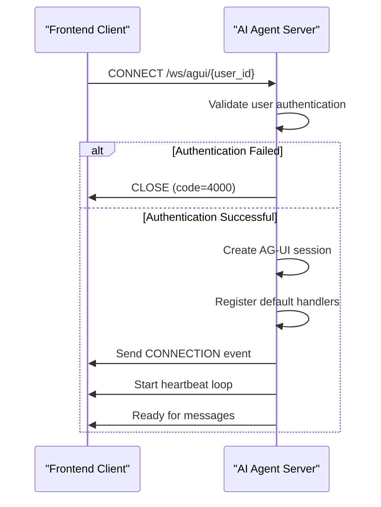
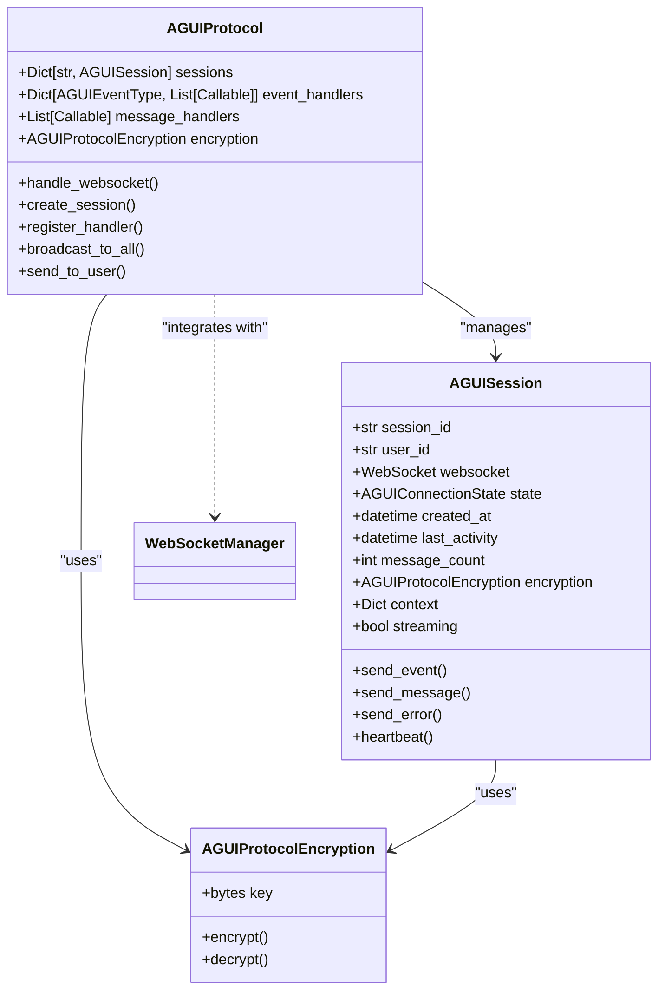
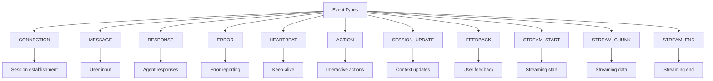
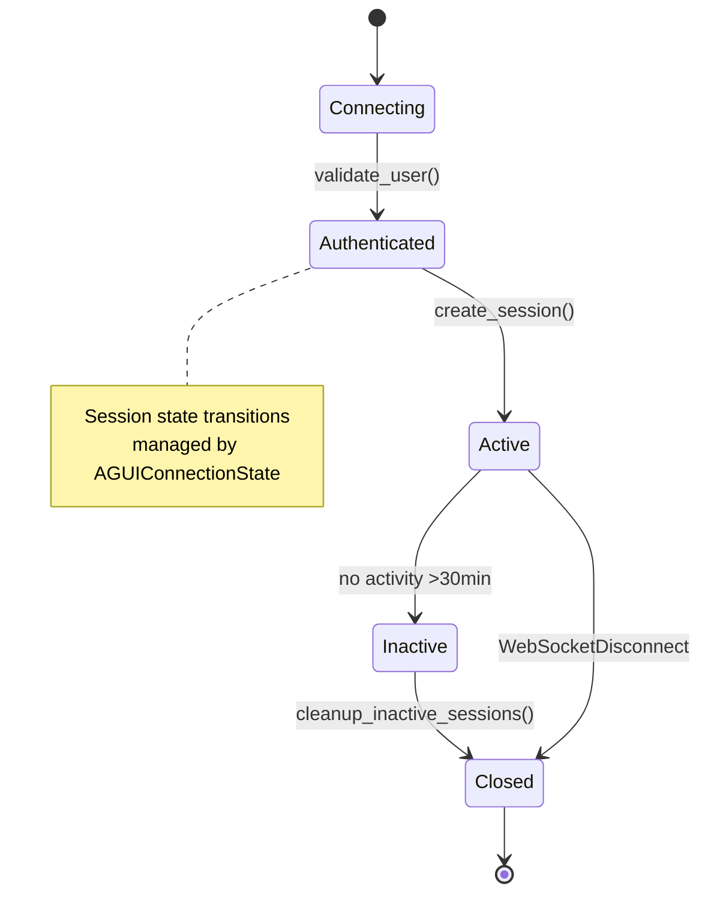
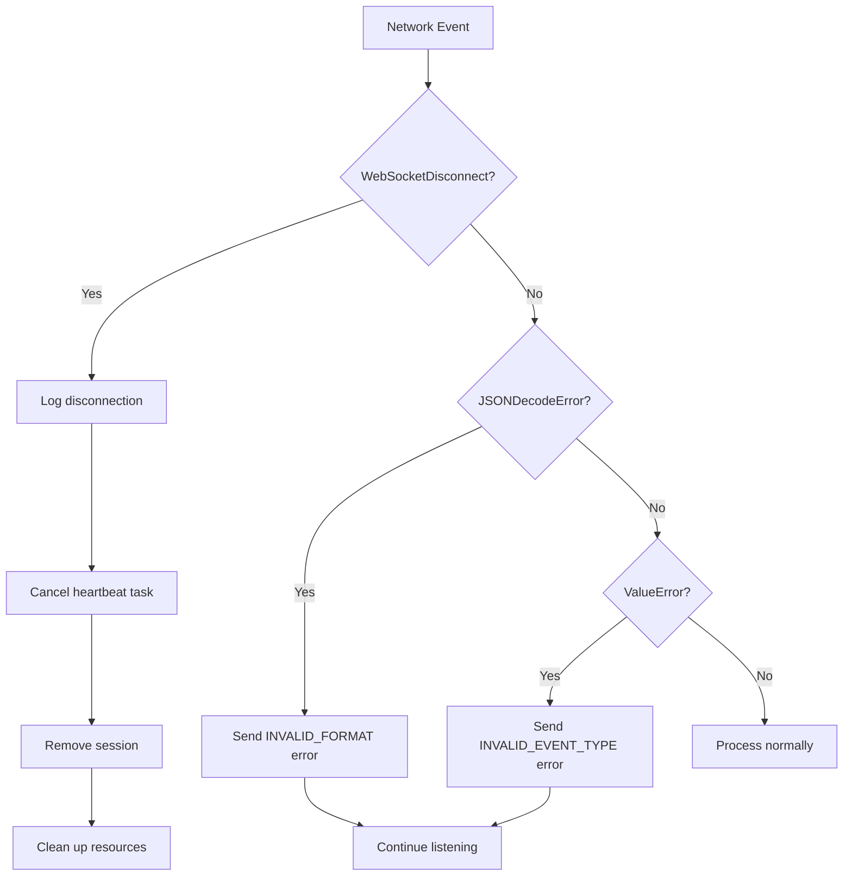

# Communication Protocols

<cite>
**Referenced Files in This Document**
- [agui_protocol.py](file://apps/api/agents/ag-ui-rag-agent/agui_protocol.py)
- [websocket_manager.py](file://apps/ai-agent/services/websocket_manager.py)
- [main.py](file://apps/api/agents/ag-ui-rag-agent/main.py)
</cite>

## Table of Contents

1. [Introduction](#introduction)
2. [WebSocket Connection Handling](#websocket-connection-handling)
3. [AGUI Protocol Structure](#agui-protocol-structure)
4. [Message Formats and Event Types](#message-formats-and-event-types)
5. [Real-time Interaction Patterns](#real-time-interaction-patterns)
6. [Authentication Methods](#authentication-methods)
7. [Error Handling Strategies](#error-handling-strategies)
8. [Security Considerations](#security-considerations)
9. [Rate Limiting Approaches](#rate-limiting-approaches)
10. [Client Implementation Guidelines](#client-implementation-guidelines)
11. [Performance Optimization Tips](#performance-optimization-tips)

## Introduction

The NeonPro healthcare platform implements a WebSocket-based communication protocol between frontend clients and AI agents, known as the AG-UI protocol. This documentation details the complete communication framework that enables real-time, secure interactions for healthcare conversations. The protocol is designed to support low-latency messaging with end-to-end encryption, session management, and compliance with healthcare data regulations.

The system consists of two main components: the AGUIProtocol class that handles the application-level protocol logic and message processing, and the WebSocketManager class that manages the underlying WebSocket connections. Together, these components provide a robust foundation for real-time communication between the TypeScript frontend and Python agent codebases.

**Section sources**

- [agui_protocol.py](file://apps/api/agents/ag-ui-rag-agent/agui_protocol.py#L1-L50)
- [websocket_manager.py](file://apps/ai-agent/services/websocket_manager.py#L1-L20)

## WebSocket Connection Handling

### Handshake Process

The WebSocket handshake process begins when a frontend client connects to the `/ws/agui/{user_id}` endpoint. The connection follows a strict sequence:

1. The client initiates a WebSocket connection with a user ID parameter
2. The server accepts the connection via `websocket.accept()`
3. User authentication is validated through the `validate_user` method
4. Upon successful authentication, an AG-UI session is created
5. A connection established event is sent to the client with session details

The handshake includes comprehensive security measures including TLS 1.3 encryption, CORS validation, and trusted host verification. The protocol version (1.0) and encryption method (AES-256-CFB) are communicated during the initial connection event.



**Diagram sources**

- [agui_protocol.py](file://apps/api/agents/ag-ui-rag-agent/agui_protocol.py#L233-L257)
- [main.py](file://apps/api/agents/ag-ui-rag-agent/main.py#L100-L115)

### Ping/Pong Keep-alive Mechanisms

The protocol implements a robust keep-alive mechanism to maintain connection health and detect dropped connections. Each active session runs a heartbeat loop that sends periodic heartbeat events every 30 seconds.

The heartbeat system works as follows:

- Server sends HEARTBEAT events containing timestamp and message count
- Client should respond with PONG messages (handled by WebSocketManager)
- Inactive sessions exceeding 30 minutes of inactivity are automatically cleaned up
- The WebSocketManager also broadcasts ping messages to all clients at configurable intervals

This dual-layer approach ensures connection reliability while minimizing network overhead. The heartbeat interval is configurable and can be adjusted based on network conditions and performance requirements.

**Section sources**

- [agui_protocol.py](file://apps/api/agents/ag-ui-rag-agent/agui_protocol.py#L371-L381)
- [websocket_manager.py](file://apps/ai-agent/services/websocket_manager.py#L105-L118)

### Graceful Disconnection Procedures

The protocol provides multiple pathways for graceful disconnection:

1. **Normal Closure**: When a WebSocket disconnects normally, the server catches the WebSocketDisconnect exception, cancels the heartbeat task, and removes the session from active sessions.
2. **Explicit Cleanup**: The `cleanup_inactive_sessions` method periodically checks for inactive sessions and closes them gracefully.
3. **Administrative Actions**: Admin endpoints allow manual cleanup of sessions and broadcasting disconnection messages.

During disconnection, the system performs proper cleanup by removing the session from the sessions dictionary, closing the WebSocket connection, and logging the disconnection event. This prevents resource leaks and ensures accurate connection tracking.

**Section sources**

- [agui_protocol.py](file://apps/api/agents/ag-ui-rag-agent/agui_protocol.py#L259-L310)
- [websocket_manager.py](file://apps/ai-agent/services/websocket_manager.py#L56-L65)

## AGUI Protocol Structure

### Protocol Architecture

The AG-UI protocol is structured as a layered architecture with clear separation of concerns:



**Diagram sources**

- [agui_protocol.py](file://apps/api/agents/ag-ui-rag-agent/agui_protocol.py#L203-L424)
- [websocket_manager.py](file://apps/ai-agent/services/websocket_manager.py#L14-L230)

### Message Framing

Messages in the AG-UI protocol follow a standardized JSON structure with the following fields:

- `id`: Unique identifier for the message
- `type`: Event type (from AGUIEventType enum)
- `timestamp`: Unix timestamp of message creation
- `session_id`: Associated session identifier
- `user_id`: User identifier
- `data`: Payload data specific to the message type
- `metadata`: Additional metadata about the message
- `encrypted`: Boolean flag indicating if data is encrypted

All sensitive data in the `data` field is encrypted using AES-256-CFB before transmission. The protocol uses a fixed salt and key derivation function (PBKDF2HMAC) to generate encryption keys, ensuring consistent encryption across sessions.

**Section sources**

- [agui_protocol.py](file://apps/api/agents/ag-ui-rag-agent/agui_protocol.py#L100-L150)

## Message Formats and Event Types

### Event Type Classification

The AG-UI protocol defines several event types through the AGUIEventType enum, each serving a specific purpose in the communication flow:



**Diagram sources**

- [agui_protocol.py](file://apps/api/agents/ag-ui-rag-agent/agui_protocol.py#L20-L35)

### Payload Schemas

Each event type has a specific payload schema that defines its data structure:

#### Connection Event Schema

```json
{
  "id": "string",
  "type": "connection",
  "timestamp": "number",
  "session_id": "string",
  "user_id": "string",
  "data": {
    "status": "connected",
    "session_id": "string",
    "protocol_version": "string",
    "encryption": "string",
    "tls_version": "string"
  }
}
```

#### Message Event Schema

```json
{
  "id": "string",
  "type": "message",
  "timestamp": "number",
  "session_id": "string",
  "user_id": "string",
  "data": {
    "message": {
      "id": "string",
      "content": "string",
      "type": "string",
      "actions": "array",
      "metadata": "object",
      "streaming": "boolean"
    }
  }
}
```

#### Error Event Schema

```json
{
  "id": "string",
  "type": "error",
  "timestamp": "number",
  "session_id": "string",
  "user_id": "string",
  "data": {
    "code": "string",
    "message": "string"
  }
}
```

**Section sources**

- [agui_protocol.py](file://apps/api/agents/ag-ui-rag-agent/agui_protocol.py#L152-L190)

## Real-time Interaction Patterns

### Session Management

The protocol implements sophisticated session management to handle user interactions:



Sessions are created with a unique session ID and associated with a specific user ID. The system tracks session activity, message count, and context data throughout the session lifecycle. Multiple sessions per user are supported, allowing concurrent connections from different devices.

**Diagram sources**

- [agui_protocol.py](file://apps/api/agents/ag-ui-rag-agent/agui_protocol.py#L192-L201)

### Broadcasting and Targeted Messaging

The protocol supports both broadcast and targeted messaging patterns:

- **Broadcast to All**: The `broadcast_to_all` method sends an event to all active sessions, useful for system-wide announcements
- **Send to User**: The `send_to_user` method delivers messages to all sessions associated with a specific user ID
- **Personal Messages**: Direct messaging to individual WebSocket connections

These patterns enable flexible communication scenarios, from emergency alerts to personalized notifications.

**Section sources**

- [agui_protocol.py](file://apps/api/agents/ag-ui-rag-agent/agui_protocol.py#L383-L398)

## Authentication Methods

### User Authentication

The current implementation validates users based on a user ID parameter in the WebSocket URL. While the production-ready version would implement JWT validation, the current logic performs basic validation:

```python
async def validate_user(self, user_id: str, websocket: WebSocket) -> bool:
    """Validate user authentication"""
    return bool(user_id and user_id.strip())
```

For administrative endpoints, API key validation is implemented using an environment variable (`ADMIN_API_KEY`). This allows privileged operations like broadcasting messages to all users or cleaning up sessions.

### Security Headers

The protocol enforces security through HTTP headers:

- `X-AG-UI-Version`: Specifies the protocol version (1.0)
- `X-AG-UI-Security`: Indicates TLSv1.3 encryption
- Standard security headers from TLS configuration

CORS policies restrict origins to trusted domains including localhost, neonpro.com, and api.neonpro.com, preventing unauthorized cross-origin access.

**Section sources**

- [main.py](file://apps/api/agents/ag-ui-rag-agent/main.py#L65-L99)

## Error Handling Strategies

### Network Interruption Handling

The system implements comprehensive error handling for network interruptions:



**Diagram sources**

- [agui_protocol.py](file://apps/api/agents/ag-ui-rag-agent/agui_protocol.py#L259-L310)

### Error Event Types

The protocol defines specific error codes for different failure scenarios:

- `INVALID_FORMAT`: Malformed JSON payload
- `INVALID_EVENT_TYPE`: Unrecognized event type
- `EVENT_HANDLER_ERROR`: Failure in event processing
- `PROCESSING_ERROR`: Query processing failures
- `AUTHENTICATION_FAILED`: Authentication validation failed

Each error includes a descriptive message to aid debugging while avoiding exposure of sensitive system information.

**Section sources**

- [agui_protocol.py](file://apps/api/agents/ag-ui-rag-agent/agui_protocol.py#L170-L175)

## Security Considerations

### Message Validation

All incoming messages undergo rigorous validation:

1. **Structural Validation**: Checks for required fields (id, type, timestamp, session_id)
2. **Type Validation**: Ensures event types match defined enum values
3. **Content Validation**: Validates payload structure based on message type
4. **Timestamp Validation**: Rejects messages with timestamps too far in past/future
5. **Session Validation**: Verifies session ID format and existence

The validation process prevents malformed messages from disrupting service operation.

### Injection Prevention

The protocol employs multiple layers of injection prevention:

- **Input Sanitization**: All user input is treated as untrusted data
- **Parameterized Queries**: Database interactions use parameterized queries
- **Context Isolation**: User context is separated from system context
- **Output Encoding**: Responses are properly encoded before transmission

Additionally, the end-to-end encryption ensures that even if messages are intercepted, the content remains protected.

### End-to-End Encryption

The AGUIProtocolEncryption class implements AES-256-CFB encryption for message payloads:

```python
class AGUIProtocolEncryption:
    def __init__(self, key: bytes = None):
        self.key = key or self._generate_key()
    
    def _generate_key(self) -> bytes:
        return PBKDF2HMAC(
            algorithm=hashes.SHA256(),
            length=32,
            salt=b'neonpro_agui_salt',
            iterations=100000,
            backend=default_backend()
        ).derive(b'neonpro_agui_key_material')
    
    def encrypt(self, data: str) -> str:
        # AES-256-CFB encryption
        pass
        
    def decrypt(self, encrypted_data: str) -> str:
        # AES-256-CFB decryption
        pass
```

Each session has its own encryption instance, providing isolation between user communications.

**Section sources**

- [agui_protocol.py](file://apps/api/agents/ag-ui-rag-agent/agui_protocol.py#L152-L190)

## Rate Limiting Approaches

### Connection-Level Rate Limiting

While the core AGUIProtocol doesn't implement rate limiting directly, it integrates with systems that do:

- **Maximum Connections**: The WebSocketManager limits concurrent connections (default: 100)
- **Message Queueing**: Supports queuing messages for offline connections
- **Administrative Controls**: Admin endpoints can manage connections and broadcast messages

The protocol design allows for extension with rate limiting through handler registration. Custom handlers can be added to monitor message frequency and enforce limits based on user ID or IP address.

### Future Rate Limiting Integration

The architecture supports integration with dedicated rate limiting services:

```python
# Example of potential rate limiting integration
def register_rate_limiting_handler(protocol: AGUIProtocol):
    async def rate_limit_handler(session: AGUISession, event: AGUIEvent):
        # Check rate limits based on user_id or session
        if exceeds_rate_limit(session.user_id):
            await session.send_error("RATE_LIMIT_EXCEEDED", "Too many requests")
            return False
        return True
    
    protocol.register_handler(AGUIEventType.MESSAGE, rate_limit_handler)
```

This modular approach allows rate limiting policies to be updated without modifying core protocol logic.

**Section sources**

- [websocket_manager.py](file://apps/ai-agent/services/websocket_manager.py#L17-L22)

## Client Implementation Guidelines

### TypeScript Frontend Implementation

For the TypeScript frontend, implement the AG-UI protocol client as follows:

```typescript
class AguiClient {
  private socket: WebSocket | null = null
  private sessionId: string
  private reconnectAttempts = 0
  private maxReconnectAttempts = 5

  constructor(private userId: string, private baseUrl: string) {
    this.sessionId = this.generateSessionId()
  }

  async connect(): Promise<void> {
    const url = `${this.baseUrl}/ws/agui/${this.userId}`
    this.socket = new WebSocket(url)

    this.socket.onopen = this.handleOpen.bind(this)
    this.socket.onmessage = this.handleMessage.bind(this)
    this.socket.onclose = this.handleClose.bind(this)
    this.socket.onerror = this.handleError.bind(this)
  }

  private handleOpen(): void {
    console.log('Connected to AG-UI protocol')
    // Start heartbeat if needed
  }

  private handleMessage(event: MessageEvent): void {
    const message: AguiEvent = JSON.parse(event.data)

    switch (message.type) {
      case 'connection':
        this.handleConnection(message)
        break
      case 'response':
        this.handleResponse(message)
        break
      case 'error':
        this.handleErrorEvent(message)
        break
      case 'heartbeat':
        this.handleHeartbeat(message)
        break
      default:
        this.handleCustomEvent(message)
    }
  }

  send(message: Partial<AguiEvent>): void {
    if (this.socket && this.socket.readyState === WebSocket.OPEN) {
      const fullMessage: AguiEvent = {
        id: crypto.randomUUID(),
        type: 'message',
        timestamp: Date.now(),
        sessionId: this.sessionId,
        ...message,
      }

      this.socket.send(JSON.stringify(fullMessage))
    }
  }

  disconnect(): void {
    if (this.socket) {
      this.socket.close()
      this.socket = null
    }
  }

  private handleClose(): void {
    // Attempt reconnection if within limits
    if (this.reconnectAttempts < this.maxReconnectAttempts) {
      this.reconnectAttempts++
      setTimeout(() => this.connect(), 1000 * Math.pow(2, this.reconnectAttempts))
    }
  }
}
```

Key considerations for frontend implementation:

- Implement exponential backoff for reconnection
- Handle different message types appropriately
- Manage connection state locally
- Implement message queuing for offline scenarios
- Ensure proper cleanup of event listeners

**Section sources**

- [agui_protocol.py](file://apps/api/agents/ag-ui-rag-agent/agui_protocol.py#L203-L424)

### Python Agent Implementation

For the Python agent, extend the existing AGUIProtocol implementation:

```python
class HealthcareAgent(AGUIProtocol):
    def __init__(self, tls_config: TLSConfig = None):
        super().__init__(tls_config)
        self.healthcare_service = HealthcareDataService()
        
        # Override default handlers
        self.register_message_handler(self.handle_healthcare_query)
        self.register_handler(AGUIEventType.FEEDBACK, self.handle_feedback_with_analysis)
    
    async def handle_healthcare_query(self, session: AGUISession, event: AGUIEvent):
        """Process healthcare-specific queries"""
        try:
            query = event.data.get('message', {}).get('content', '')
            response = await self.healthcare_service.process_query(query, session.context)
            
            agui_message = AGUIMessage(
                id=str(uuid.uuid4()),
                content=response['text'],
                type=response['type'],
                actions=response.get('actions', []),
                metadata={
                    'processing_time': response['processing_time'],
                    'intent': response['intent']
                }
            )
            
            await session.send_message(agui_message)
            
        except Exception as e:
            await session.send_error("QUERY_PROCESSING_ERROR", str(e))
    
    async def handle_feedback_with_analysis(self, session: AGUISession, event: AGUIEvent):
        """Enhanced feedback handler with sentiment analysis"""
        await super()._handle_feedback(session, event)
        
        # Additional analytics processing
        feedback_text = event.data.get('feedback_text', '')
        self.analyze_feedback_sentiment(feedback_text)
```

Best practices for agent implementation:

- Register custom handlers for domain-specific logic
- Leverage the existing encryption and session management
- Implement proper error handling and logging
- Use the provided utility methods for message sending
- Extend functionality through inheritance rather than modification

**Section sources**

- [agui_protocol.py](file://apps/api/agents/ag-ui-rag-agent/agui_protocol.py#L216-L221)

## Performance Optimization Tips

### Low-Latency Communication

To optimize healthcare conversations for low latency:

1. **Minimize Processing Time**: Optimize query processing algorithms
2. **Efficient Serialization**: Use efficient JSON serialization
3. **Connection Pooling**: Reuse WebSocket connections when possible
4. **Message Compression**: Implement compression for large payloads
5. **Asynchronous Processing**: Use async/await for non-blocking operations

### Streaming Support

For long-running queries, implement streaming responses:

```python
async def stream_response(self, session: AGUISession, query: str):
    """Stream response chunks for long-running queries"""
    
    # Send stream start event
    stream_start_event = AGUIEvent(
        id=str(uuid.uuid4()),
        type=AGUIEventType.STREAM_START,
        session_id=session.session_id,
        user_id=session.user_id,
        data={'query': query}
    )
    await session.send_event(stream_start_event)
    
    # Stream response chunks
    async for chunk in self.generate_response_chunks(query):
        stream_chunk = AGUIEvent(
            id=str(uuid.uuid4()),
            type=AGUIEventType.STREAM_CHUNK,
            session_id=session.session_id,
            user_id=session.user_id,
            data={'content': chunk}
        )
        await session.send_event(stream_chunk)
    
    # Send stream end event
    stream_end_event = AGUIEvent(
        id=str(uuid.uuid4()),
        type=AGUIEventType.STREAM_END,
        session_id=session.session_id,
        user_id=session.user_id
    )
    await session.send_event(stream_end_event)
```

### Resource Management

Optimize resource usage with these strategies:

- Set appropriate heartbeat intervals (30 seconds recommended)
- Configure maximum connection limits based on server capacity
- Implement efficient session cleanup for inactive sessions
- Monitor memory usage of active sessions
- Use connection metadata to track performance metrics

The WebSocketManager provides connection statistics through `get_connection_stats()` which can be used to monitor system performance and identify bottlenecks.

**Section sources**

- [websocket_manager.py](file://apps/ai-agent/services/websocket_manager.py#L143-L165)
- [agui_protocol.py](file://apps/api/agents/ag-ui-rag-agent/agui_protocol.py#L408-L424)
