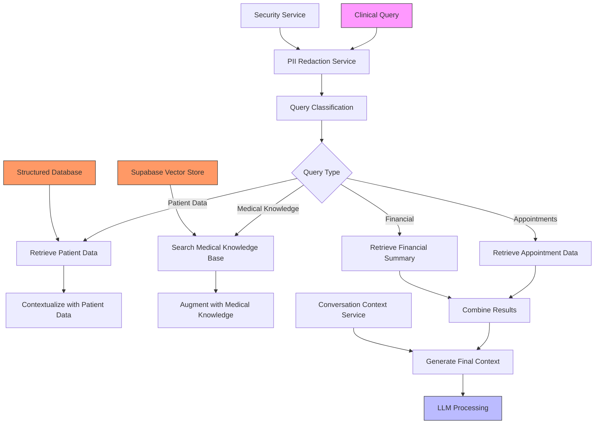
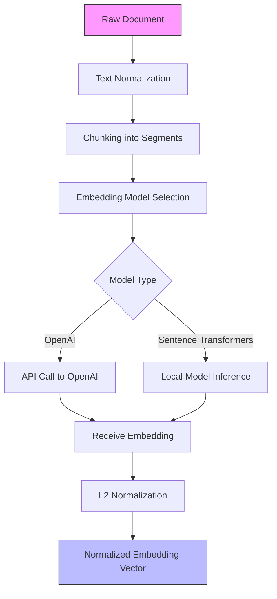
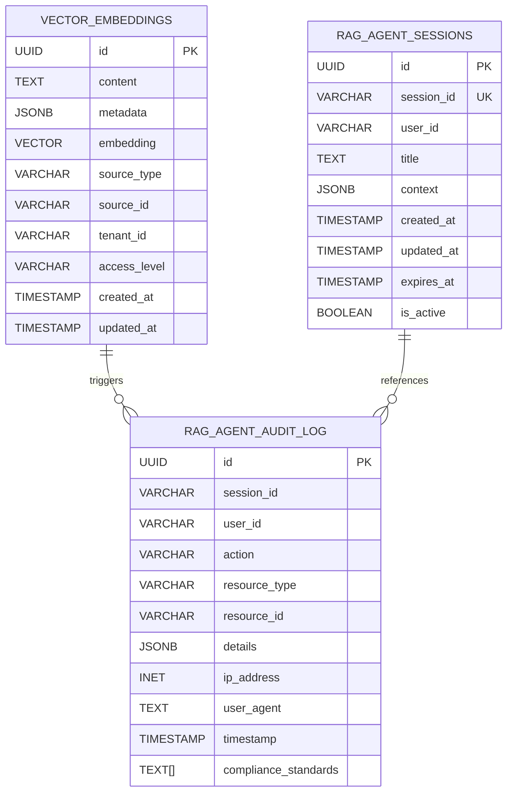
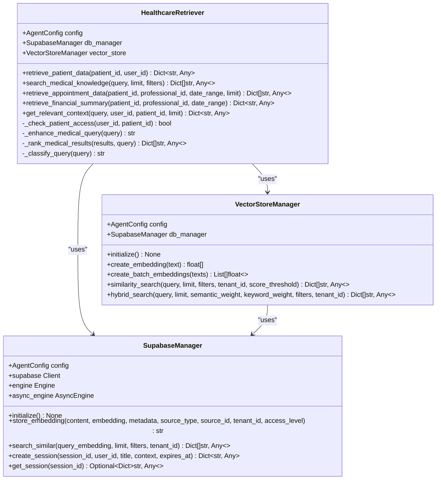
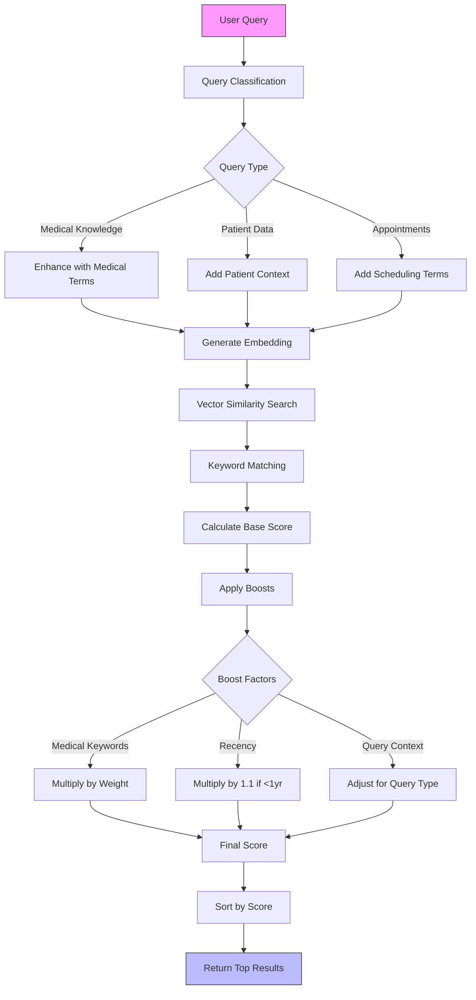
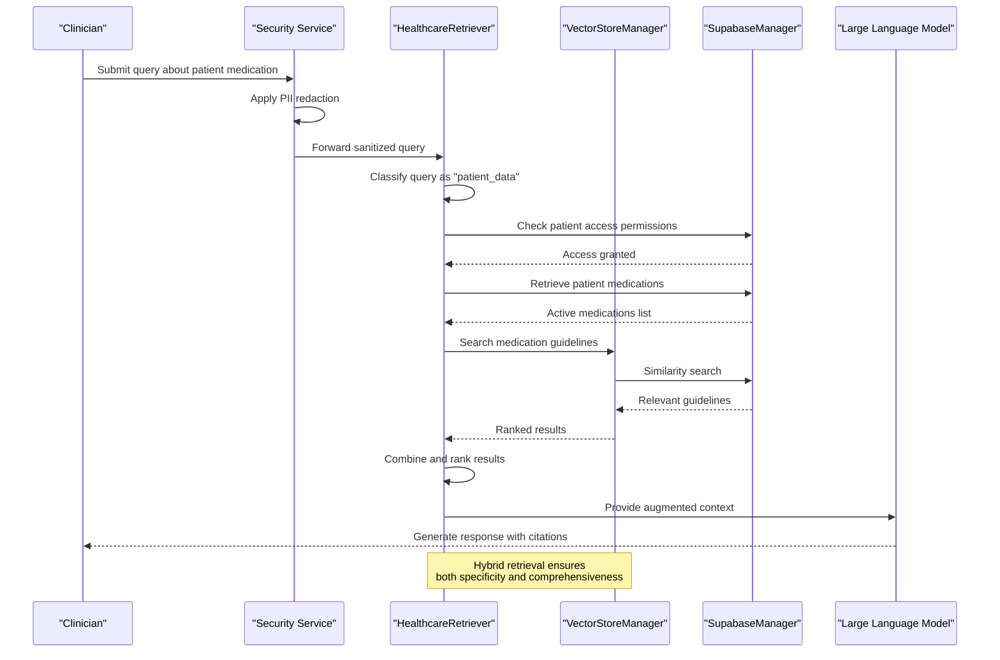
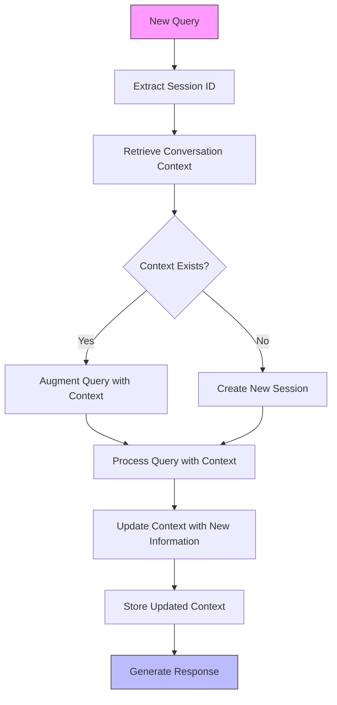
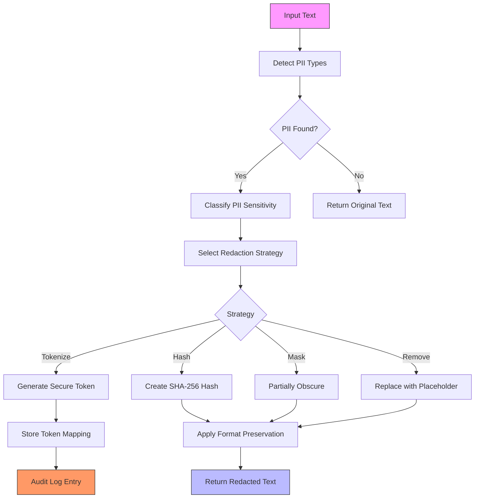

# Natural Language Processing

<cite>
**Referenced Files in This Document**
- [retriever.py](file://apps/api/agents/ag-ui-rag-agent/src/retriever.py)
- [vector_store.py](file://apps/api/agents/ag-ui-rag-agent/src/vector_store.py)
- [config.py](file://apps/api/agents/ag-ui-rag-agent/src/config.py)
- [database.py](file://apps/api/agents/ag-ui-rag-agent/src/database.py)
- [pii-redaction.ts](file://apps/api/src/lib/pii-redaction.ts)
</cite>

## Table of Contents

1. [Introduction](#introduction)
2. [RAG Architecture Overview](#rag-architecture-overview)
3. [Document Preprocessing and Embedding Generation](#document-preprocessing-and-embedding-generation)
4. [Vector Storage in Supabase](#vector-storage-in-supabase)
5. [Retriever Component Analysis](#retriever-component-analysis)
6. [Query Expansion and Relevance Scoring](#query-expansion-and-relevance-scoring)
7. [Clinical Query Processing Example](#clinical-query-processing-example)
8. [Integration with Conversation Context Service](#integration-with-conversation-context-service)
9. [Security and PII Redaction](#security-and-pii-redaction)
10. [Common Issues and Mitigation Strategies](#common-issues-and-mitigation-strategies)

## Introduction

The NeonPro AI system implements a sophisticated Retrieval Augmented Generation (RAG) architecture specifically designed for healthcare applications. This document details the natural language processing pipeline, focusing on how clinical queries are processed, contextualized, and augmented with medical knowledge before being sent to large language models. The system integrates multiple components including document preprocessing, embedding generation using healthcare-specific models, vector storage in Supabase, and advanced semantic search algorithms. Special attention is given to the retriever component's query expansion techniques, relevance scoring, and result ranking logic, as well as integration with security services for PII redaction and conversation context management.

## RAG Architecture Overview

**Diagram sources**

- [retriever.py](file://apps/api/agents/ag-ui-rag-agent/src/retriever.py#L23-L583)
- [vector_store.py](file://apps/api/agents/ag-ui-rag-agent/src/vector_store.py#L17-L444)

**Section sources**

- [retriever.py](file://apps/api/agents/ag-ui-rag-agent/src/retriever.py#L23-L583)
- [vector_store.py](file://apps/api/agents/ag-ui-rag-agent/src/vector_store.py#L17-L444)

## Document Preprocessing and Embedding Generation

The document preprocessing pipeline begins with text normalization and cleaning, followed by chunking into semantically coherent segments. The system uses healthcare-specific embedding models to generate vector representations of these text chunks. Two primary embedding models are supported: OpenAI's text-embedding-3-small and sentence-transformers/all-MiniLM-L6-v2. The choice of model is configurable through the AgentConfig class, allowing for optimization based on specific use cases and performance requirements.

Embedding generation occurs through the VectorStoreManager class, which handles both single and batch embedding creation. The process includes normalization of embedding vectors using L2 normalization to ensure consistent similarity calculations. Batch processing is implemented to improve efficiency when handling large volumes of documents, with configurable batch sizes determined by the embedding configuration.

**Diagram sources**

- [vector_store.py](file://apps/api/agents/ag-ui-rag-agent/src/vector_store.py#L17-L444)
- [config.py](file://apps/api/agents/ag-ui-rag-agent/src/config.py#L1-L190)

**Section sources**

- [vector_store.py](file://apps/api/agents/ag-ui-rag-agent/src/vector_store.py#L17-L444)
- [config.py](file://apps/api/agents/ag-ui-rag-agent/src/config.py#L1-L190)

## Vector Storage in Supabase

The vector storage system leverages Supabase with the pgvector extension to store and retrieve embeddings efficiently. The VectorStoreManager class manages all interactions with the vector database, handling operations such as storing embeddings, performing similarity searches, and managing metadata. The system creates a dedicated table for vector embeddings with an IVF Flat index for efficient approximate nearest neighbor search using cosine similarity.

Each stored embedding includes comprehensive metadata that enables filtering and faceted search capabilities. Metadata fields include source type (e.g., "medical_knowledge", "patient_data"), source ID, tenant ID, access level, and creation timestamp. This metadata structure allows for fine-grained access control and targeted searches within specific document categories or time periods.

**Diagram sources**

- [vector_store.py](file://apps/api/agents/ag-ui-rag-agent/src/vector_store.py#L17-L444)
- [database.py](file://apps/api/agents/ag-ui-rag-agent/src/database.py#L1-L399)

**Section sources**

- [vector_store.py](file://apps/api/agents/ag-ui-rag-agent/src/vector_store.py#L17-L444)
- [database.py](file://apps/api/agents/ag-ui-rag-agent/src/database.py#L1-L399)

## Retriever Component Analysis

The HealthcareRetriever class serves as the central component for retrieving relevant information in response to clinical queries. It orchestrates multiple data retrieval strategies based on query classification, combining results from both structured databases and vector stores to provide comprehensive responses. The retriever implements a modular design with specialized methods for different data types, including patient data, medical knowledge, appointments, and financial information.

Key features of the retriever include permission checking for patient data access, automatic query enhancement with medical terminology, and hybrid search capabilities that combine semantic and keyword-based approaches. The component also handles compliance logging for audit purposes, ensuring that all data access is properly recorded according to healthcare regulations.

**Diagram sources**

- [retriever.py](file://apps/api/agents/ag-ui-rag-agent/src/retriever.py#L23-L583)
- [vector_store.py](file://apps/api/agents/ag-ui-rag-agent/src/vector_store.py#L17-L444)
- [database.py](file://apps/api/agents/ag-ui-rag-agent/src/database.py#L1-L399)

**Section sources**

- [retriever.py](file://apps/api/agents/ag-ui-rag-agent/src/retriever.py#L23-L583)

## Query Expansion and Relevance Scoring

The retriever component implements sophisticated query expansion and relevance scoring mechanisms to improve search accuracy. When processing medical queries, the system automatically enhances the input query by adding domain-specific terms such as "medical," "clinical," "patient," and "treatment" if they are not already present. This expansion increases the likelihood of retrieving relevant medical knowledge even when users employ non-technical language.

Relevance scoring combines multiple factors to rank search results. The base score comes from vector similarity, but this is augmented by several boosting factors:

- Keyword matching with weighted medical terms (diagnosis: 2.0, treatment: 1.8, medication: 1.7)
- Recency boost for documents created within the past year (1.1x multiplier)
- Semantic relevance based on query type classification

The ranking algorithm prioritizes recent, highly relevant medical information while maintaining sensitivity to the specific context of the query.

**Diagram sources**

- [retriever.py](file://apps/api/agents/ag-ui-rag-agent/src/retriever.py#L23-L583)
- [vector_store.py](file://apps/api/agents/ag-ui-rag-agent/src/vector_store.py#L17-L444)

**Section sources**

- [retriever.py](file://apps/api/agents/ag-ui-rag-agent/src/retriever.py#L23-L583)

## Clinical Query Processing Example

The processing of clinical queries follows a systematic workflow that ensures accurate and secure information retrieval. When a user submits a query about a patient's medication history, the system first applies PII redaction to protect sensitive information. The query is then classified as "patient_data" based on keywords like "patient" and "history." The retriever component authenticates the user's access rights to the specified patient record before proceeding.

For medication-related queries, the system retrieves active medications from the structured database while simultaneously searching the vector store for relevant medical guidelines and potential drug interactions. The results are combined and ranked, with recent prescriptions receiving priority. The final context includes both the specific patient data and general medical knowledge about the prescribed medications, providing a comprehensive basis for the LLM to generate an informed response.

**Diagram sources**

- [retriever.py](file://apps/api/agents/ag-ui-rag-agent/src/retriever.py#L23-L583)
- [vector_store.py](file://apps/api/agents/ag-ui-rag-agent/src/vector_store.py#L17-L444)
- [database.py](file://apps/api/agents/ag-ui-rag-agent/src/database.py#L1-L399)
- [pii-redaction.ts](file://apps/api/src/lib/pii-redaction.ts#L0-L2974)

**Section sources**

- [retriever.py](file://apps/api/agents/ag-ui-rag-agent/src/retriever.py#L23-L583)

## Integration with Conversation Context Service

The RAG pipeline integrates with the conversation context service to maintain dialogue history and provide temporal coherence across interactions. The SupabaseManager class manages conversation sessions in the rag_agent_sessions table, storing context information that includes previous queries, retrieved results, and user preferences. Each session has a configurable expiration time, after which it is automatically cleaned up to comply with data retention policies.

When processing a new query, the system retrieves the relevant conversation context to understand the ongoing dialogue. This context is used to disambiguate references and maintain consistency in the generated responses. For example, if a clinician asks follow-up questions about a previously discussed patient, the system can reference the earlier context without requiring repetition of patient identifiers.

**Diagram sources**

- [database.py](file://apps/api/agents/ag-ui-rag-agent/src/database.py#L1-L399)
- [retriever.py](file://apps/api/agents/ag-ui-rag-agent/src/retriever.py#L23-L583)

**Section sources**

- [database.py](file://apps/api/agents/ag-ui-rag-agent/src/database.py#L1-L399)

## Security and PII Redaction

The system implements comprehensive security measures to protect patient privacy and ensure compliance with healthcare regulations like LGPD and HIPAA. The PII redaction service detects and protects sensitive information including CPF, CNPJ, RG, phone numbers, emails, and medical record numbers. The service uses pattern matching with validation algorithms to accurately identify PII while minimizing false positives.

Redaction strategies vary by PII type and context, with options including hashing, masking, removal, and tokenization. Tokenization provides reversible redaction, allowing authorized users to restore original values when necessary for clinical care. All redaction operations are logged for audit purposes, with detailed records of what information was redacted, by whom, and under what justification.

**Diagram sources**

- [pii-redaction.ts](file://apps/api/src/lib/pii-redaction.ts#L0-L2974)
- [retriever.py](file://apps/api/agents/ag-ui-rag-agent/src/retriever.py#L23-L583)

**Section sources**

- [pii-redaction.ts](file://apps/api/src/lib/pii-redaction.ts#L0-L2974)

## Common Issues and Mitigation Strategies

The RAG system addresses several common challenges in healthcare AI applications. Hallucination reduction is achieved through strict citation requirements and confidence scoring, where the system only presents information that can be verified against retrieved sources. Citation accuracy is ensured by maintaining provenance information for all retrieved content, allowing the LLM to reference specific documents in its responses.

Ambiguous medical terminology is handled through context-aware disambiguation, where the system considers the patient's diagnosis history and current treatment plan when interpreting terms. For example, the term "pressure" might refer to blood pressure in a cardiology context but to tissue pressure in a wound care context. Clinical relevance is maintained through recency weighting and specialty-specific knowledge bases, ensuring that retrieved information is both current and appropriate to the medical field.

Performance considerations include caching of frequent queries and pre-loading of patient data when a clinician opens a patient record. Error handling includes graceful degradation when external services are unavailable, fallback to simpler search methods when hybrid search fails, and comprehensive logging for troubleshooting.

**Section sources**

- [retriever.py](file://apps/api/agents/ag-ui-rag-agent/src/retriever.py#L23-L583)
- [vector_store.py](file://apps/api/agents/ag-ui-rag-agent/src/vector_store.py#L17-L444)
- [pii-redaction.ts](file://apps/api/src/lib/pii-redaction.ts#L0-L2974)
