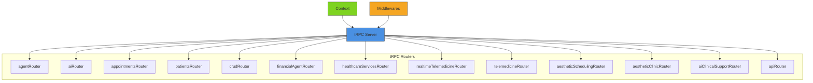
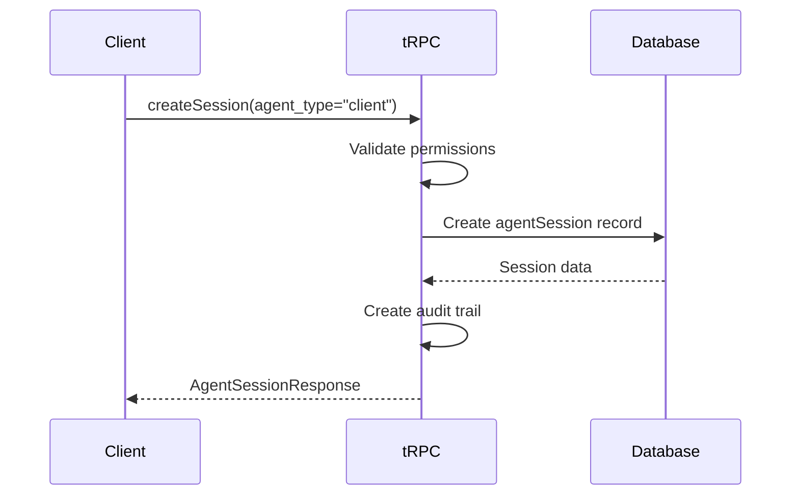
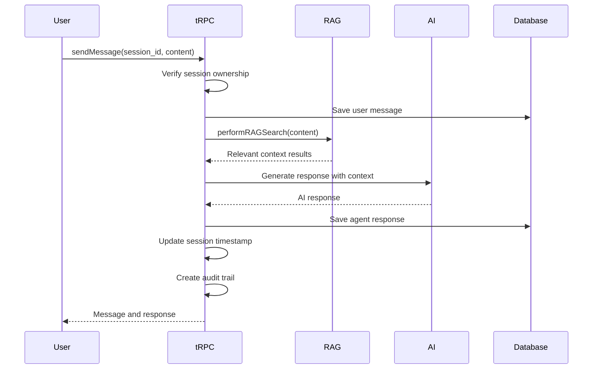
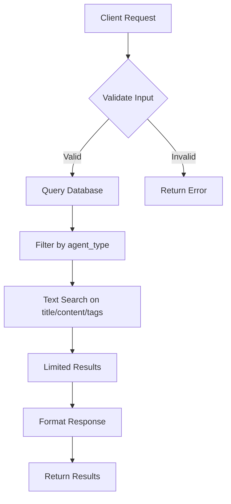
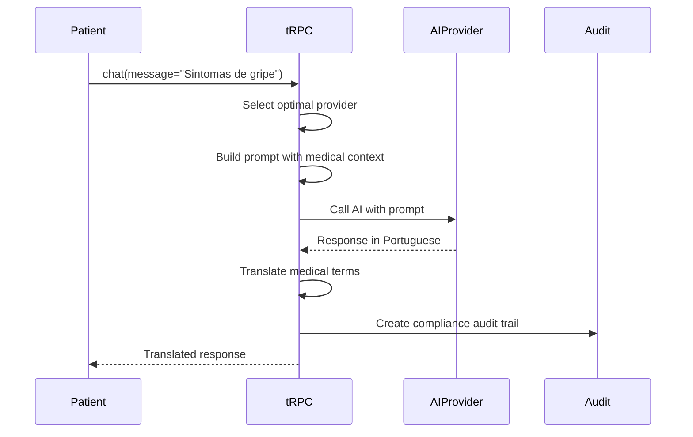
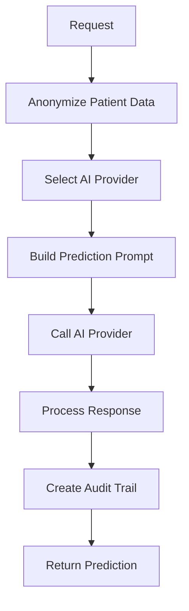
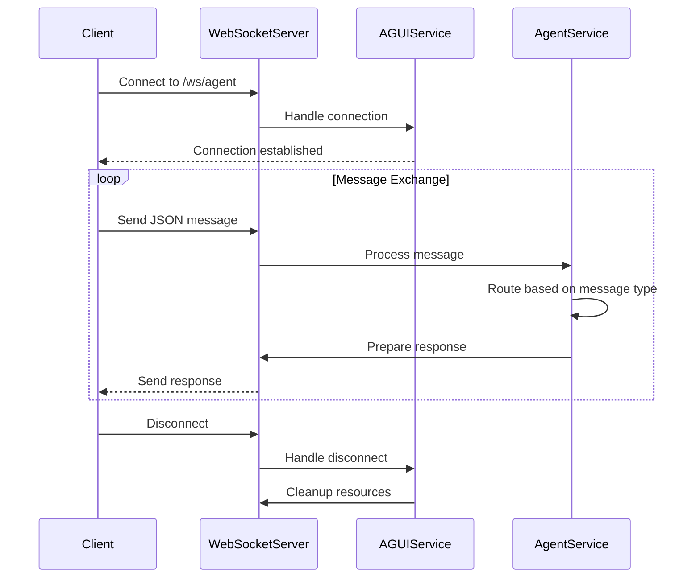
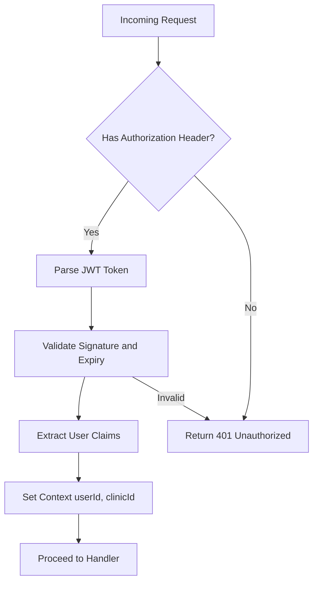
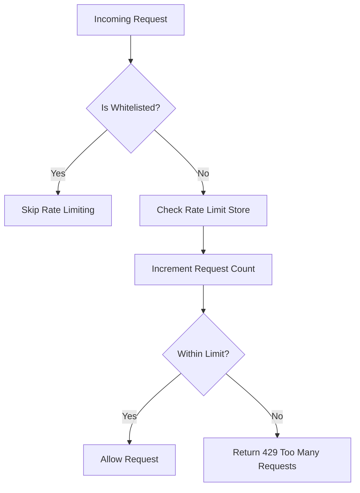
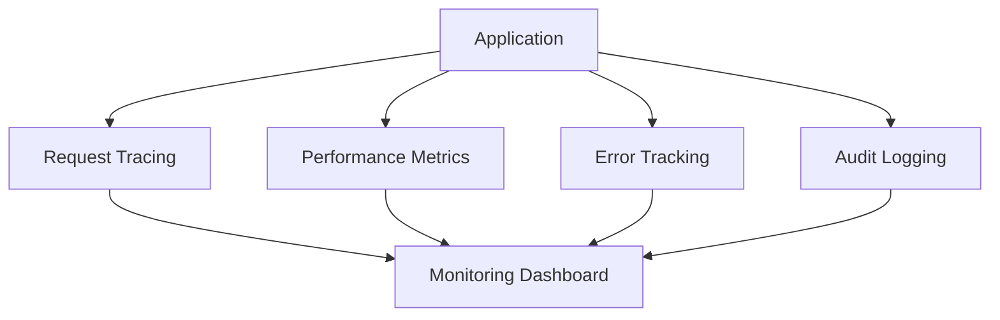

# API Reference

<cite>
**Referenced Files in This Document **
- [agent.py](file://apps/ai-agent/agent.py)
- [main.py](file://apps/ai-agent/main.py)
- [websocket_manager.py](file://apps/ai-agent/services/websocket_manager.py)
- [context.ts](file://apps/api/src/trpc/context.ts)
- [router.ts](file://apps/api/src/trpc/router.ts)
- [trpc.ts](file://apps/api/src/trpc/trpc.ts)
- [agent.ts](file://apps/api/src/trpc/routers/agent.ts)
- [ai.ts](file://apps/api/src/trpc/routers/ai.ts)
- [contracts/agent.ts](file://apps/api/src/trpc/contracts/agent.ts)
- [websocket-server.ts](file://apps/api/src/middleware/websocket-server.ts)
- [openapi.json.ts](file://apps/api/vercel/openapi.json.ts)
</cite>

## Table of Contents

1. [Introduction](#introduction)
2. [RESTful APIs](#restful-apis)
3. [tRPC Interfaces](#trpc-interfaces)
4. [WebSocket APIs for AI Agents](#websocket-apis-for-ai-agents)
5. [Authentication and Security](#authentication-and-security)
6. [Rate Limiting and Performance](#rate-limiting-and-performance)
7. [Error Handling](#error-handling)
8. [Versioning and Migration](#versioning-and-migration)
9. [Client Implementation Guidelines](#client-implementation-guidelines)
10. [Monitoring and Debugging](#monitoring-and-debugging)

## Introduction

The NeonPro application provides a comprehensive API suite for healthcare services with Brazilian regulatory compliance (LGPD, CFM, ANVISA). The API ecosystem consists of RESTful endpoints, tRPC interfaces for type-safe communication, and WebSocket connections for real-time AI agent interactions. This documentation covers all public interfaces, their usage patterns, security considerations, and implementation details.

**Section sources**

- [openapi.json.ts](file://apps/api/vercel/openapi.json.ts#L27-L81)

## RESTful APIs

NeonPro exposes RESTful endpoints for health checks and basic service discovery. These endpoints follow OpenAPI 3.0 specification and are designed for monitoring and integration purposes.

### Health Check Endpoint

The health check endpoint provides service status information for monitoring systems.

```mermaid
flowchart TD
A[Client] --> B[/health]
B --> C{Service Status}
C --> |Healthy| D["{status: 'healthy', message: 'API is healthy'}"]
C --> |Unhealthy| E["{status: 'unhealthy', error: 'error description'}"]
```

**Diagram sources **

- [openapi.json.ts](file://apps/api/vercel/openapi.json.ts#L27-L81)

**Section sources**

- [openapi.json.ts](file://apps/api/vercel/openapi.json.ts#L27-L81)

## tRPC Interfaces

The primary API interface for NeonPro is built using tRPC, providing type-safe, end-to-end typed endpoints with comprehensive healthcare compliance features.

### Architecture Overview

tRPC routers are organized by domain functionality with proper authorization and audit logging middleware applied consistently across all endpoints.



**Diagram sources **

- [router.ts](file://apps/api/src/trpc/router.ts#L78-L102)
- [context.ts](file://apps/api/src/trpc/context.ts#L27-L61)

**Section sources**

- [router.ts](file://apps/api/src/trpc/router.ts#L78-L102)
- [context.ts](file://apps/api/src/trpc/context.ts#L27-L61)

### Agent Management API

The Agent Management API enables creation, management, and interaction with AI agents through a comprehensive set of endpoints.

#### Create Agent Session

Creates a new conversational session with an AI agent.

**Endpoint**: `mutation agent.createSession`\
**Input Schema**: `CreateAgentSessionSchema`\
**Output Schema**: `AgentSessionResponseSchema`



**Diagram sources **

- [agent.ts](file://apps/api/src/trpc/routers/agent.ts#L226-L968)
- [contracts/agent.ts](file://apps/api/src/trpc/contracts/agent.ts#L21-L25)

#### Send Message to Agent

Processes user messages and generates AI responses within an existing session.

**Endpoint**: `mutation agent.sendMessage`\
**Input Schema**: `CreateAgentMessageSchema`\
**Output Schema**: `AgentMessageResponseSchema`



**Diagram sources **

- [agent.ts](file://apps/api/src/trpc/routers/agent.ts#L226-L968)
- [contracts/agent.ts](file://apps/api/src/trpc/contracts/agent.ts#L43-L58)

#### Search Knowledge Base

Enables semantic search within the agent's knowledge base.

**Endpoint**: `query agent.searchKnowledge`\
**Input Schema**: `SearchKnowledgeBaseSchema`\
**Output Schema**: `KnowledgeEntryResponseSchema`



**Diagram sources **

- [agent.ts](file://apps/api/src/trpc/routers/agent.ts#L226-L968)

**Section sources**

- [agent.ts](file://apps/api/src/trpc/routers/agent.ts#L226-L968)
- [contracts/agent.ts](file://apps/api/src/trpc/contracts/agent.ts#L21-L100)

### AI Services API

Provides AI-powered capabilities for healthcare applications with Portuguese language support.

#### AI Chat

Engages in medical conversations with proper terminology in Portuguese.

**Endpoint**: `mutation ai.chat`\
**Input Schema**: Message and optional context\
**Output Schema**: AI response with compliance metadata



**Diagram sources **

- [ai.ts](file://apps/api/src/trpc/routers/ai.ts#L310-L566)

#### No-Show Prediction

Predicts patient no-show risk using AI analysis of historical patterns.

**Endpoint**: `query ai.predictNoShow`\
**Input Schema**: Patient ID and appointment time\
**Output Schema**: Risk score and prevention recommendations



**Diagram sources **

- [ai.ts](file://apps/api/src/trpc/routers/ai.ts#L310-L566)

**Section sources**

- [ai.ts](file://apps/api/src/trpc/routers/ai.ts#L310-L566)

## WebSocket APIs for AI Agents

Real-time communication channels for AI agent interactions using the AG-UI protocol.

### Connection Handling

WebSocket endpoints provide bidirectional communication for real-time AI interactions.



**Diagram sources **

- [main.py](file://apps/ai-agent/main.py#L70-L127)
- [agent.py](file://apps/ai-agent/agent.py#L274-L320)
- [websocket-server.ts](file://apps/api/src/middleware/websocket-server.ts#L21-L300)

### Message Formats

Messages follow the AG-UI protocol with standardized event types and payload structures.

```json
{
  "type": "userMessage",
  "session_id": "uuid-v4",
  "payload": {
    "message": "User query text",
    "context": {}
  }
}
```

```json
{
  "type": "agentMessage",
  "session_id": "uuid-v4",
  "payload": {
    "content": "AI response text",
    "actions": [],
    "processing_time": 123
  }
}
```

Supported event types:

- `userMessage`: User input to the AI agent
- `agentMessage`: AI response to the user
- `ping`: Connection health check
- `session_update`: Session context update
- `error`: Error notification

**Section sources**

- [agent.py](file://apps/ai-agent/agent.py#L274-L320)
- [websocket_manager.py](file://apps/ai-agent/services/websocket_manager.py)

## Authentication and Security

NeonPro implements comprehensive security measures for API protection and healthcare compliance.

### Authentication Methods

All tRPC procedures use authentication middleware that validates JWT tokens and extracts user context.



Protected procedures additionally verify user permissions through role-based access control.

**Diagram sources **

- [trpc.ts](file://apps/api/src/trpc/trpc.ts#L108-L111)
- [context.ts](file://apps/api/src/trpc/context.ts#L27-L61)

### Security Headers

All responses include security headers to protect against common web vulnerabilities:

- Strict-Transport-Security: Enforces HTTPS usage
- X-Content-Type-Options: Prevents MIME type sniffing
- X-Frame-Options: Protects against clickjacking
- X-XSS-Protection: Enables XSS filtering
- Content-Security-Policy: Restricts resource loading

**Section sources**

- [specs/006-implemente-o-https/research.md#L89-L134]

## Rate Limiting and Performance

API performance optimization strategies and rate limiting policies.

### Rate Limiting

Rate limiting is implemented at multiple levels to prevent abuse and ensure service availability.



Limits vary by endpoint type and user tier, with higher limits for enterprise clients.

### Performance Optimization

Recommended practices for optimal API performance:

- **Batching**: Combine multiple operations in single requests when possible
- **Caching**: Implement client-side caching for read operations with appropriate TTL
- **Connection Reuse**: Maintain persistent connections for frequent interactions
- **Payload Optimization**: Minimize request/response sizes by requesting only needed fields

**Section sources**

- [websocket-server.ts](file://apps/api/src/middleware/websocket-server.ts#L21-L300)

## Error Handling

Comprehensive error handling strategies for different failure modes.

### Error Formats

All APIs return structured error responses with consistent formatting:

```json
{
  "success": false,
  "error": {
    "code": "VALIDATION_ERROR",
    "message": "Human-readable error description",
    "details": {},
    "timestamp": "ISO8601",
    "requestId": "unique-id"
  }
}
```

### Failure Mode Strategies

Different approaches for handling various failure scenarios:

- **Validation Errors**: Return 400 with specific field validation issues
- **Authentication Errors**: Return 401 with clear authentication requirements
- **Authorization Errors**: Return 403 with required permission details
- **Resource Not Found**: Return 404 with resource identifier
- **Rate Limiting**: Return 429 with retry-after guidance
- **Server Errors**: Return 500 with internal tracking ID

**Section sources**

- [agent.ts](file://apps/api/src/trpc/routers/agent.ts#L226-L968)
- [ai.ts](file://apps/api/src/trpc/routers/ai.ts#L310-L566)

## Versioning and Migration

API versioning strategy and migration guidance.

### Versioning Approach

NeonPro uses semantic versioning with backward compatibility guarantees:

- **Major versions**: Breaking changes, require migration
- **Minor versions**: New features, backward compatible
- **Patch versions**: Bug fixes, fully compatible

Legacy endpoints are maintained with deprecation notices before removal.

### Backwards Compatibility

The system ensures backward compatibility through:

- Maintaining legacy tRPC routers alongside new implementations
- Providing adapter layers for deprecated features
- Comprehensive OpenAPI documentation for all supported versions
- Clear deprecation timelines and migration paths

**Section sources**

- [router.ts](file://apps/api/src/trpc/router.ts#L78-L102)

## Client Implementation Guidelines

Best practices for implementing NeonPro API consumers.

### Frontend Integration

For web applications, use the tRPC client with React hooks:

```typescript
const { data, isLoading } = trpc.agent.listSessions.useQuery({
  page: 1,
  limit: 10
});
```

Handle authentication by including JWT tokens in request headers.

### External Systems

For external integrations, consider:

- Using the RESTful health check endpoints for monitoring
- Implementing exponential backoff for retry logic
- Setting appropriate timeouts for all API calls
- Logging request IDs for debugging and support

**Section sources**

- [router.ts](file://apps/api/src/trpc/router.ts#L78-L102)
- [context.ts](file://apps/api/src/trpc/context.ts#L27-L61)

## Monitoring and Debugging

Protocol-specific tools and approaches for API monitoring and debugging.

### Monitoring Approaches

Implement comprehensive monitoring with:

- Request tracing using unique request IDs
- Performance metrics collection for all endpoints
- Error tracking with detailed context
- Audit logging for compliance requirements

The WebSocket server provides health status and metrics endpoints for monitoring.



**Diagram sources **

- [websocket-server.ts](file://apps/api/src/middleware/websocket-server.ts#L21-L300)

**Section sources**

- [websocket-server.ts](file://apps/api/src/middleware/websocket-server.ts#L21-L300)
