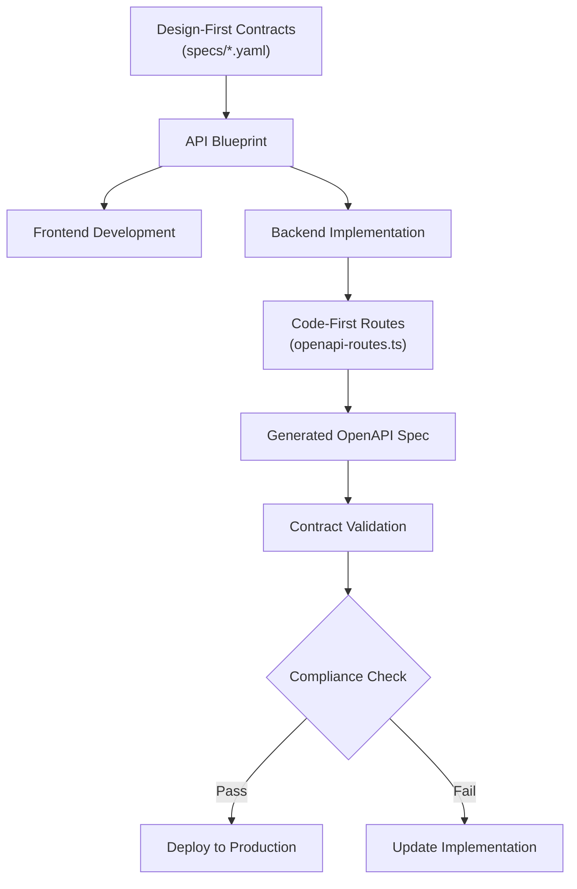

# OpenAPI Specification

<cite>
**Referenced Files in This Document**
- [openapi-config.ts](file://apps/api/src/schemas/openapi-config.ts)
- [openapi-routes.ts](file://apps/api/src/schemas/openapi-routes.ts)
- [healthcare-validation-schemas.ts](file://apps/api/src/schemas/healthcare-validation-schemas.ts)
- [api-vercel.json](file://api-vercel.json)
- [specs/005-financial-dashboard-enhancement/contracts/api.yaml](file://specs/005-financial-dashboard-enhancement/contracts/api.yaml)
- [specs/006-implemente-o-https/contracts/api.yaml](file://specs/006-implemente-o-https/contracts/api.yaml)
- [specs/007-update-o-specs/contracts/api.yaml](file://specs/007-update-o-specs/contracts/api.yaml)
</cite>

## Table of Contents

1. [Introduction](#introduction)
2. [OpenAPI Configuration](#openapi-configuration)
3. [Route Registration System](#route-registration-system)
4. [Healthcare Validation Schemas](#healthcare-validation-schemas)
5. [Design-First and Code-First Integration](#design-first-and-code-first-integration)
6. [Production API Manifest](#production-api-manifest)
7. [Specification Utilization](#specification-utilization)

## Introduction

The NeonPro platform implements a comprehensive OpenAPI specification system that combines code-first development with design-first contract management. This documentation details the implementation of OpenAPI across the healthcare-focused application, covering configuration, route registration, validation schemas, and integration between code and design specifications. The system ensures LGPD compliance, robust security, and standardized API contracts for both internal and external consumers.

## OpenAPI Configuration

The OpenAPI configuration in `openapi-config.ts` establishes the foundation for API documentation and metadata. It defines the API's core information including title, version, description, contact details, and licensing. The configuration includes multiple server URLs for production, staging, and development environments, enabling proper endpoint routing across different deployment stages.

Security is implemented through JWT-based authentication using Bearer tokens, clearly documented in the security schemes section. The API description contains comprehensive information about LGPD compliance requirements, authentication methods, rate limiting policies, and error handling standards. This centralized configuration ensures consistent documentation across all API endpoints.

The module also sets up automatic Swagger UI generation at `/docs`, providing an interactive interface for API exploration and testing. Additional endpoints include the OpenAPI JSON specification at `/openapi.json` and a documentation health check at `/docs/health` to verify documentation availability.

**Section sources**

- [openapi-config.ts](file://apps/api/src/schemas/openapi-config.ts#L1-L238)

## Route Registration System

The route registration system in `openapi-routes.ts` implements a code-first approach to OpenAPI documentation by auto-generating Swagger specifications from route handlers. Each API endpoint is defined using the `createRoute` function from `@hono/zod-openapi`, which captures method, path, summary, description, tags, security requirements, request parameters, and response schemas.

The system organizes routes into logical groups such as System, Authentication, Clients, Appointments, and Patients, each with appropriate security requirements. Protected endpoints require Bearer authentication, enforced through the security property in route definitions. Request parameters are strongly typed using Zod schemas, ensuring type safety and automatic documentation generation.

Response schemas are defined using shared schema objects imported from `openapi-schemas`, promoting consistency across endpoints. The route definitions include comprehensive descriptions, summaries, and examples that automatically populate the generated documentation. This approach eliminates documentation drift by keeping the API contract co-located with the implementation.

**Section sources**

- [openapi-routes.ts](file://apps/api/src/schemas/openapi-routes.ts#L1-L463)

## Healthcare Validation Schemas

The healthcare-specific validation schemas in `healthcare-validation-schemas.ts` provide comprehensive data validation for medical applications with LGPD compliance. These schemas use Zod for runtime type checking and validation, ensuring data integrity across patient records, appointments, medical documentation, prescriptions, and healthcare professionals.

Patient data validation includes Brazilian-specific fields such as CPF (individual taxpayer registry), RG (identity document), and address components with CEP (postal code). The PatientSchema enforces data quality through regex patterns, length constraints, and custom validation functions like CPF verification. It also implements LGPD compliance by requiring explicit consent flags and validating that either email or phone contact information is provided.

Appointment validation ensures temporal consistency by verifying that start times are in the future, end times follow start times, and bookings do not exceed 90 days in advance. The schema supports various appointment types relevant to aesthetic clinics and includes virtual appointment validation requiring access links when applicable.

Medical record and prescription schemas enforce ANVISA (Brazilian Health Regulatory Agency) compliance with specialized validation rules. Prescription validation requires registration numbers for controlled substances and validates dosage instructions. Medical record validation automatically flags sensitive content related to HIV, cancer, or psychiatric conditions, requiring confidentiality marking.

The module exports utility functions like `getEntitySchema` and `validateEntityData` that enable dynamic schema selection and validation based on entity type, providing a flexible validation framework across the application.

**Section sources**

- [healthcare-validation-schemas.ts](file://apps/api/src/schemas/healthcare-validation-schemas.ts#L1-L542)

## Design-First and Code-First Integration

NeonPro implements a hybrid approach to API design that combines design-first contracts in the specs/ directory with code-first implementation. The YAML files in the specs directory represent design-first API contracts that define the expected behavior, data structures, and security requirements before implementation.

These design documents serve as blueprints for API development, containing detailed OpenAPI specifications with operation IDs, request/response schemas, and security schemes. They include comprehensive descriptions of security requirements, performance expectations, and compliance obligations specific to healthcare applications.

The code-first implementation in `openapi-routes.ts` aligns with these design contracts, ensuring that the actual API behavior matches the specified contracts. This dual approach enables parallel development, where frontend teams can work from the design specifications while backend teams implement the corresponding endpoints.

The integration between these approaches is validated through automated contract testing, ensuring that the generated OpenAPI documentation from the code-first implementation remains consistent with the design-first specifications. This prevents API drift and maintains contract integrity across the development lifecycle.

**Diagram sources **

- [specs/005-financial-dashboard-enhancement/contracts/api.yaml](file://specs/005-financial-dashboard-enhancement/contracts/api.yaml#L1-L469)
- [specs/006-implemente-o-https/contracts/api.yaml](file://specs/006-implemente-o-https/contracts/api.yaml#L1-L359)
- [specs/007-update-o-specs/contracts/api.yaml](file://specs/007-update-o-specs/contracts/api.yaml#L1-L500)
- [openapi-routes.ts](file://apps/api/src/schemas/openapi-routes.ts#L1-L463)

## Production API Manifest

The `api-vercel.json` file serves as the production API manifest, defining the deployment configuration for Vercel. This configuration specifies the project name, framework settings, build commands, output directories, and installation procedures required for deployment.

The manifest defines function routing rules that map API endpoints to their corresponding handler files, such as routing `/health` to `/api/health.ts` and `/openapi.json` to `/api/openapi.json.ts`. These rewrites ensure proper request handling in the serverless environment.

Security headers are comprehensively configured in the manifest, including HSTS, CORS, X-Frame-Options, Content-Security-Policy, and other security directives that protect against common web vulnerabilities. The configuration enforces HTTPS with strict transport security and prevents clickjacking attacks.

Environment variables are securely referenced using the @ syntax, connecting the deployment to database connections, authentication secrets, and other critical services. The manifest also specifies regional deployment to GRU1 (São Paulo), ensuring low-latency access for Brazilian users and compliance with data residency requirements.

This production manifest works in conjunction with the generated OpenAPI documentation, providing both the runtime configuration and the API contract that describes how the deployed service should behave.

**Section sources**

- [api-vercel.json](file://api-vercel.json#L1-L84)

## Specification Utilization

The OpenAPI specification in NeonPro serves multiple purposes beyond documentation. It enables automatic client library generation for various programming languages, reducing integration effort for third-party developers and ensuring type-safe API consumption.

API testing tools can consume the OpenAPI specification to generate comprehensive test suites that validate all endpoints against their defined contracts. This includes automated validation of request/response formats, status codes, and security requirements, helping maintain API reliability.

Interactive documentation portals are automatically generated from the specification, providing developers with a sandbox environment to explore API capabilities, test requests, and view examples without leaving the documentation interface. The Swagger UI implementation at `/docs` provides this functionality with a user-friendly interface.

The specification also facilitates contract testing in CI/CD pipelines, where the generated OpenAPI document is compared against design-first contracts to detect any deviations. This ensures that API changes are intentional and properly documented.

Additionally, the OpenAPI specification enables API gateway configuration, code generation for DTOs (Data Transfer Objects), and integration with monitoring tools that can understand the API structure for better observability.
