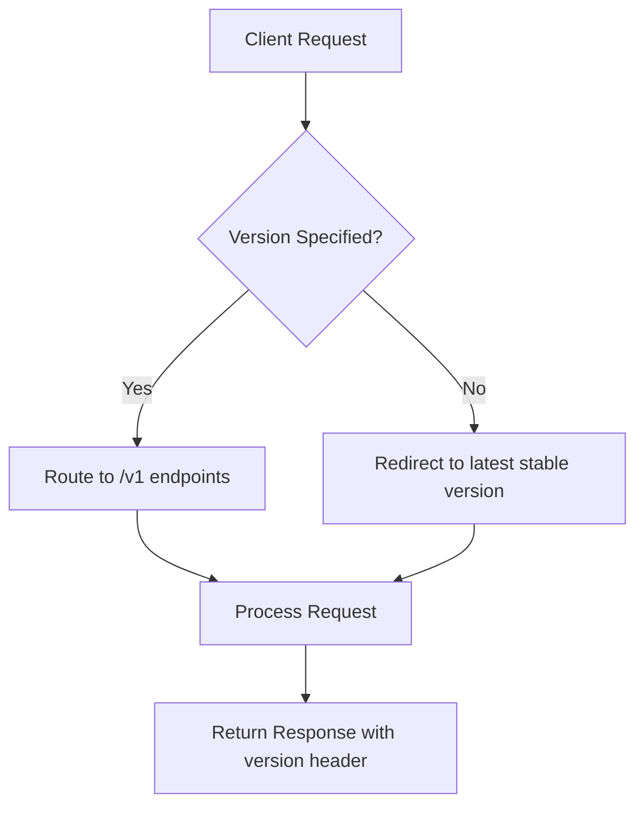
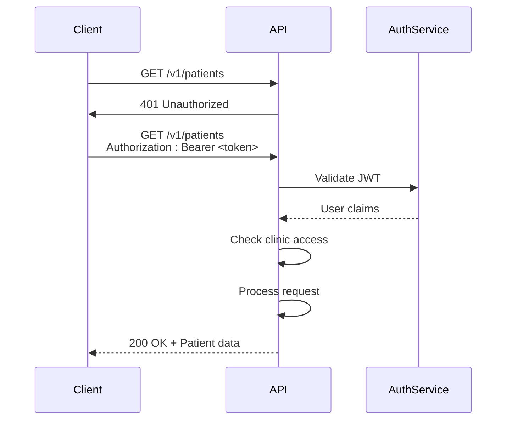
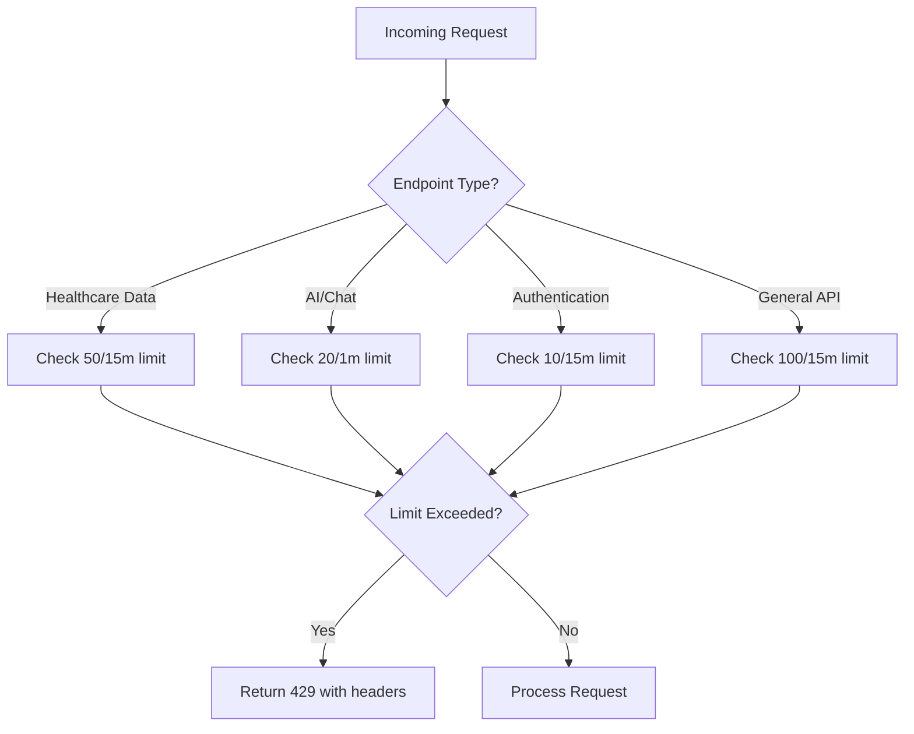
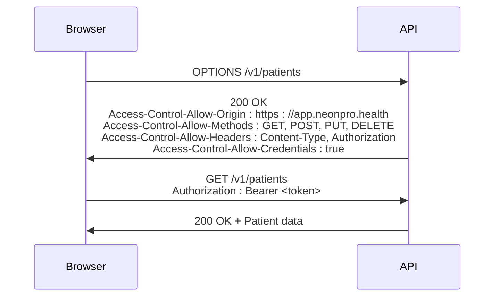
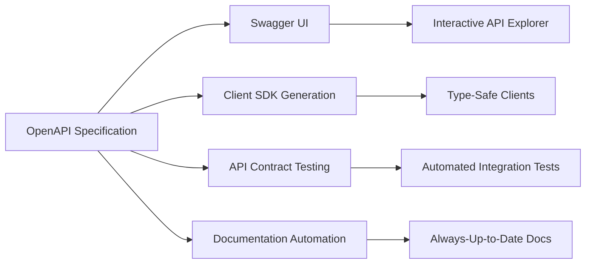

# REST API Reference

<cite>
**Referenced Files in This Document**   
- [openapi-config.ts](file://apps/api/src/schemas/openapi-config.ts)
- [openapi-routes.ts](file://apps/api/src/schemas/openapi-routes.ts)
- [openapi-schemas.ts](file://apps/api/src/schemas/openapi-schemas.ts)
- [auth.ts](file://apps/api/src/middleware/auth.ts)
- [rate-limiting.ts](file://apps/api/src/middleware/rate-limiting.ts)
- [security-headers.ts](file://apps/api/src/middleware/security-headers.ts)
- [patients.ts](file://apps/api/src/routes/patients.ts)
- [appointments.ts](file://apps/api/src/routes/appointments.ts)
- [index.ts](file://apps/api/src/routes/billing/index.ts)
- [ai-chat.ts](file://apps/api/src/routes/ai-chat.ts)
- [health.ts](file://apps/api/vercel/health.ts)
- [v1/health.ts](file://apps/api/vercel/v1/health.ts)
</cite>

## Table of Contents
1. [Introduction](#introduction)
2. [API Versioning Strategy](#api-versioning-strategy)
3. [Authentication and Security](#authentication-and-security)
4. [Rate Limiting Policies](#rate-limiting-policies)
5. [CORS Configuration](#cors-configuration)
6. [Error Handling](#error-handling)
7. [Endpoint Reference](#endpoint-reference)
8. [OpenAPI Specification](#openapi-specification)
9. [Client Examples](#client-examples)

## Introduction
The NeonPro Healthcare API provides a comprehensive RESTful interface for managing patient data, appointments, billing, and AI-powered healthcare services. Built with Hono and TypeScript, the API follows LGPD compliance standards for Brazilian healthcare data protection. The API is organized around resource-oriented URLs, standard HTTP methods, and predictable response formats.

All API endpoints are designed to be intuitive and consistent, with comprehensive OpenAPI documentation available at `/docs`. The API supports JSON request and response payloads, with proper error handling and status codes. The system prioritizes security, performance, and regulatory compliance throughout its architecture.

**Section sources**
- [openapi-config.ts](file://apps/api/src/schemas/openapi-config.ts#L1-L238)

## API Versioning Strategy
The NeonPro API implements a clear versioning strategy using URL path prefixes. All stable endpoints are accessible under the `/v1` path prefix, ensuring backward compatibility for existing integrations. The versioning approach follows semantic versioning principles, where breaking changes require a major version increment.

The API maintains multiple versions simultaneously during transition periods, allowing clients time to migrate. Version deprecation notices are communicated through API response headers and documentation updates at least 90 days before endpoint removal. Clients are encouraged to specify the API version they expect to ensure consistent behavior.



**Diagram sources**
- [openapi-config.ts](file://apps/api/src/schemas/openapi-config.ts#L1-L238)
- [v1/health.ts](file://apps/api/vercel/v1/health.ts#L1-L50)

**Section sources**
- [openapi-config.ts](file://apps/api/src/schemas/openapi-config.ts#L1-L238)
- [v1/health.ts](file://apps/api/vercel/v1/health.ts#L1-L50)

## Authentication and Security
The NeonPro API implements JWT-based authentication for all protected endpoints. Clients must include a valid JWT token in the Authorization header using the Bearer scheme. The authentication system validates tokens and extracts user context including user ID, clinic ID, and permissions.

Role-based access control (RBAC) ensures that users can only access resources appropriate to their role. The system supports various roles including admin, healthcare professional, and billing specialist, each with specific permission sets. Clinic access middleware enforces multi-tenancy by ensuring users can only access data belonging to their assigned clinic.



**Diagram sources**
- [auth.ts](file://apps/api/src/middleware/auth.ts#L1-L283)

**Section sources**
- [auth.ts](file://apps/api/src/middleware/auth.ts#L1-L283)

## Rate Limiting Policies
The NeonPro API implements tiered rate limiting policies based on endpoint sensitivity and client type. The system uses an in-memory store with sliding window counting to track request rates per client IP address. Different limits apply to various endpoint categories:

- **Healthcare data endpoints**: 50 requests per 15 minutes
- **AI/Chat endpoints**: 20 requests per minute  
- **Authentication endpoints**: 10 attempts per 15 minutes (failed attempts only)
- **General API endpoints**: 100 requests per 15 minutes

Rate limit information is included in response headers, allowing clients to monitor their usage and avoid exceeding limits. When a rate limit is exceeded, the API returns a 429 Too Many Requests status code with Retry-After and rate limit details in the response headers.



**Diagram sources**
- [rate-limiting.ts](file://apps/api/src/middleware/rate-limiting.ts#L1-L215)

**Section sources**
- [rate-limiting.ts](file://apps/api/src/middleware/rate-limiting.ts#L1-L215)

## CORS Configuration
The NeonPro API implements strict CORS (Cross-Origin Resource Sharing) policies to protect against cross-site request forgery attacks while allowing legitimate browser-based clients. The API whitelists specific origins defined in the ALLOWED_ORIGINS environment variable, with fallback to known NeonPro domains.

Preflight requests (OPTIONS method) are handled automatically by the API, returning appropriate Access-Control headers without processing the full request. The API sets Vary: Origin to ensure proper caching behavior when multiple origins are allowed. Credentials are supported for authenticated requests, enabling session cookies to be sent with cross-origin requests.



**Diagram sources**
- [security-headers.ts](file://apps/api/src/middleware/security-headers.ts#L1-L382)
- [v1/health.ts](file://apps/api/vercel/v1/health.ts#L1-L50)

**Section sources**
- [security-headers.ts](file://apps/api/src/middleware/security-headers.ts#L1-L382)
- [v1/health.ts](file://apps/api/vercel/v1/health.ts#L1-L50)

## Error Handling
The NeonPro API returns standardized error responses with descriptive messages and machine-readable error codes. All error responses follow the ErrorResponseSchema defined in the OpenAPI specification, including error message, code, and timestamp.

The API distinguishes between different error types with appropriate HTTP status codes:
- **400 Bad Request**: Invalid request parameters or body
- **401 Unauthorized**: Missing or invalid authentication token
- **403 Forbidden**: Insufficient permissions or LGPD consent required
- **404 Not Found**: Requested resource does not exist
- **429 Too Many Requests**: Rate limit exceeded
- **500 Internal Server Error**: Unexpected server error

Specific error codes like LGPD_CONSENT_REQUIRED and RATE_LIMIT_EXCEEDED allow clients to implement targeted error handling logic. Error responses exclude sensitive information to prevent information leakage.

**Section sources**
- [openapi-schemas.ts](file://apps/api/src/schemas/openapi-schemas.ts#L1-L299)

## Endpoint Reference

### Health Check Endpoints
#### GET /health
Basic health check endpoint for load balancers and monitoring systems.

**Parameters**
- None

**Responses**
- `200 OK`: Service is healthy
```json
{
  "status": "ok",
  "message": "NeonPro API v2 - Fresh deployment working!",
  "timestamp": "2025-01-11T12:00:00.000Z",
  "deployment": "neonpro-v2"
}
```

#### GET /v1/health
Detailed health check with system diagnostics and environment info.

**Parameters**
- None

**Responses**
- `200 OK`: Detailed system health information
```json
{
  "status": "healthy",
  "version": "v1",
  "uptime": 3600.5,
  "timestamp": "2025-01-11T12:00:00.000Z"
}
```

**Section sources**
- [health.ts](file://apps/api/vercel/health.ts#L1-L48)
- [v1/health.ts](file://apps/api/vercel/v1/health.ts#L1-L50)

### Patient Management Endpoints
#### GET /v1/patients
Retrieve a list of patients with pagination and filtering.

**Authentication**: Required (JWT Bearer token)  
**Query Parameters**:
- `clinicId`: Clinic identifier (required)
- `page`: Page number (default: 1)
- `limit`: Items per page (default: 20, max: 100)
- `search`: Text search term
- `status`: Filter by status (active, inactive, all)

**Responses**
- `200 OK`: List of patients
- `400 Bad Request`: Missing required parameters
- `401 Unauthorized`: Authentication required
- `403 Forbidden`: Insufficient permissions

#### GET /v1/patients/{patientId}
Retrieve detailed information about a specific patient.

**Authentication**: Required (JWT Bearer token)  
**Path Parameters**:
- `patientId`: Patient unique identifier

**Responses**
- `200 OK`: Patient details with appointments and consent records
- `401 Unauthorized`: Authentication required
- `403 Forbidden`: Insufficient permissions
- `404 Not Found`: Patient not found

#### POST /v1/patients
Create a new patient record.

**Authentication**: Required (JWT Bearer token)  
**Request Body**:
```json
{
  "clinicId": "string",
  "fullName": "string",
  "familyName": "string",
  "cpf": "string",
  "birthDate": "datetime",
  "phone": "string", 
  "email": "string",
  "lgpdConsentGiven": false
}
```

**Responses**
- `201 Created`: Patient successfully created
- `400 Bad Request`: Validation failed
- `401 Unauthorized`: Authentication required
- `403 Forbidden`: Insufficient permissions

#### PUT /v1/patients/{patientId}
Update an existing patient record.

**Authentication**: Required (JWT Bearer token)  
**Path Parameters**:
- `patientId`: Patient unique identifier

**Request Body**: Same as POST but all fields optional

**Responses**
- `200 OK`: Patient successfully updated
- `400 Bad Request`: Validation failed
- `401 Unauthorized`: Authentication required
- `403 Forbidden`: Insufficient permissions
- `404 Not Found`: Patient not found

**Section sources**
- [patients.ts](file://apps/api/src/routes/patients.ts#L1-L438)
- [openapi-routes.ts](file://apps/api/src/schemas/openapi-routes.ts#L1-L463)

### Appointment Management Endpoints
#### GET /v1/appointments
Retrieve a list of appointments with LGPD consent validation.

**Authentication**: Required (JWT Bearer token)  
**Responses**
- `200 OK`: List of appointments
- `401 Unauthorized`: Authentication required
- `403 Forbidden`: Insufficient permissions

#### GET /v1/appointments/client/{clientId}
Retrieve appointments for a specific client.

**Authentication**: Required (JWT Bearer token)  
**Path Parameters**:
- `clientId`: Client unique identifier

**Responses**
- `200 OK`: Client appointments
- `401 Unauthorized`: Authentication required
- `403 Forbidden`: Insufficient permissions
- `404 Not Found`: Client not found

#### POST /v1/appointments
Create a new appointment with conflict detection.

**Authentication**: Required (JWT Bearer token)  
**Request Body**:
```json
{
  "clinicId": "string",
  "patientId": "string",
  "professionalId": "string",
  "startTime": "datetime",
  "endTime": "datetime",
  "status": "scheduled"
}
```

**Responses**
- `201 Created`: Appointment successfully created
- `400 Bad Request`: Validation failed or time conflict
- `401 Unauthorized`: Authentication required
- `403 Forbidden`: Insufficient permissions

#### PUT /v1/appointments/{id}
Update an existing appointment with conflict detection.

**Authentication**: Required (JWT Bearer token)  
**Path Parameters**:
- `id`: Appointment identifier

**Responses**
- `200 OK`: Appointment successfully updated
- `400 Bad Request`: Validation failed or time conflict
- `401 Unauthorized`: Authentication required
- `403 Forbidden`: Insufficient permissions
- `404 Not Found`: Appointment not found

**Section sources**
- [appointments.ts](file://apps/api/src/routes/appointments.ts#L1-L252)
- [openapi-routes.ts](file://apps/api/src/schemas/openapi-routes.ts#L1-L463)

### Billing Endpoints
#### POST /billing/invoices
Create a new invoice with Brazilian tax compliance.

**Authentication**: Required (JWT Bearer token)  
**Request Body**:
```json
{
  "patientId": "string",
  "clinicId": "string",
  "items": [
    {
      "description": "string",
      "quantity": 1,
      "unitPrice": 100.0,
      "taxRate": 0.18,
      "susCode": "string",
      "cbhpmCode": "string",
      "tussCode": "string"
    }
  ],
  "dueDate": "datetime"
}
```

**Responses**
- `201 Created`: Invoice successfully created
- `400 Bad Request`: Validation failed
- `401 Unauthorized`: Authentication required
- `403 Forbidden`: Insufficient permissions

#### GET /billing/invoices
Search invoices with filters.

**Authentication**: Required (JWT Bearer token)  
**Query Parameters**:
- `patientId`: Filter by patient
- `clinicId`: Filter by clinic
- `status`: Filter by payment status
- `dateFrom`: Start date filter
- `dateTo`: End date filter

**Responses**
- `200 OK`: Search results
- `401 Unauthorized`: Authentication required
- `403 Forbidden`: Insufficient permissions

#### POST /billing/invoices/{id}/payments
Process a payment for an invoice.

**Authentication**: Required (JWT Bearer token)  
**Path Parameters**:
- `id`: Invoice identifier

**Request Body**:
```json
{
  "amount": 100.0,
  "paymentMethod": "credit_card",
  "installments": 1
}
```

**Responses**
- `201 Created`: Payment processed successfully
- `400 Bad Request`: Validation failed
- `401 Unauthorized`: Authentication required
- `403 Forbidden`: Insufficient permissions
- `404 Not Found`: Invoice not found

**Section sources**
- [index.ts](file://apps/api/src/routes/billing/index.ts#L1-L481)

### AI Chat Endpoints
#### POST /ai-chat/stream
Stream AI chat responses for aesthetic clinic consultations.

**Authentication**: Optional (JWT Bearer token)  
**Request Body**:
```json
{
  "messages": [
    {
      "role": "user",
      "content": "string"
    }
  ],
  "sessionId": "string",
  "locale": "pt-BR"
}
```

**Responses**
- `200 OK`: Streaming text response
- `500 Internal Server Error`: AI processing failed

#### POST /ai-chat/suggestions
Get search suggestions for aesthetic treatments.

**Authentication**: Optional (JWT Bearer token)  
**Request Body**:
```json
{
  "query": "string",
  "sessionId": "string"
}
```

**Responses**
- `200 OK`: Array of treatment suggestions
- `500 Internal Server Error`: Suggestion generation failed

**Section sources**
- [ai-chat.ts](file://apps/api/src/routes/ai-chat.ts#L1-L493)

## OpenAPI Specification
The NeonPro API includes a comprehensive OpenAPI 3.1.0 specification available at `/openapi.json`. The specification is automatically generated using @hono/zod-openapi, ensuring consistency between the documentation and actual implementation. The API documentation is accessible via Swagger UI at `/docs`.

The OpenAPI configuration includes detailed descriptions of all endpoints, request parameters, request body schemas, and response formats. Security schemes are properly documented, with JWT Bearer authentication required for protected endpoints. The specification includes examples and validation rules for all data structures.

The OpenAPI specification enables automatic client SDK generation for various programming languages. Developers can use tools like OpenAPI Generator or Swagger Codegen to create type-safe client libraries from the specification. This reduces integration time and minimizes errors in API consumption.



**Diagram sources**
- [openapi-config.ts](file://apps/api/src/schemas/openapi-config.ts#L1-L238)
- [openapi-routes.ts](file://apps/api/src/schemas/openapi-routes.ts#L1-L463)

**Section sources**
- [openapi-config.ts](file://apps/api/src/schemas/openapi-config.ts#L1-L238)
- [openapi-routes.ts](file://apps/api/src/schemas/openapi-routes.ts#L1-L463)

## Client Examples

### cURL Examples
#### Get Patient List
```bash
curl -X GET "https://api.neonpro.health/v1/patients?clinicId=clinic_123" \
  -H "Authorization: Bearer your-jwt-token" \
  -H "Content-Type: application/json"
```

#### Create New Patient
```bash
curl -X POST "https://api.neonpro.health/v1/patients" \
  -H "Authorization: Bearer your-jwt-token" \
  -H "Content-Type: application/json" \
  -d '{
    "clinicId": "clinic_123",
    "fullName": "Ana Silva",
    "familyName": "Silva",
    "email": "ana.silva@email.com",
    "lgpdConsentGiven": true
  }'
```

#### Schedule Appointment
```bash
curl -X POST "https://api.neonpro.health/v1/appointments" \
  -H "Authorization: Bearer your-jwt-token" \
  -H "Content-Type: application/json" \
  -d '{
    "clinicId": "clinic_123",
    "patientId": "patient_456",
    "professionalId": "prof_789",
    "startTime": "2025-01-15T14:30:00Z",
    "endTime": "2025-01-15T15:30:00Z",
    "status": "scheduled"
  }'
```

### JavaScript Fetch Examples
#### Patient Management
```javascript
// Get patients
async function getPatients(clinicId, token) {
  const response = await fetch(
    `https://api.neonpro.health/v1/patients?clinicId=${clinicId}`,
    {
      method: 'GET',
      headers: {
        'Authorization': `Bearer ${token}`,
        'Content-Type': 'application/json'
      }
    }
  );
  return await response.json();
}

// Create patient
async function createPatient(patientData, token) {
  const response = await fetch('https://api.neonpro.health/v1/patients', {
    method: 'POST',
    headers: {
      'Authorization': `Bearer ${token}`,
      'Content-Type': 'application/json'
    },
    body: JSON.stringify(patientData)
  });
  return await response.json();
}
```

#### Appointment Scheduling
```javascript
// Create appointment
async function createAppointment(appointmentData, token) {
  const response = await fetch('https://api.neonpro.health/v1/appointments', {
    method: 'POST',
    headers: {
      'Authorization': `Bearer ${token}`,
      'Content-Type': 'application/json'
    },
    body: JSON.stringify(appointmentData)
  });
  return await response.json();
}

// Get patient appointments
async function getPatientAppointments(patientId, token) {
  const response = await fetch(
    `https://api.neonpro.health/v1/appointments/client/${patientId}`,
    {
      method: 'GET',
      headers: {
        'Authorization': `Bearer ${token}`
      }
    }
  );
  return await response.json();
}
```

#### Billing Operations
```javascript
// Create invoice
async function createInvoice(invoiceData, token) {
  const response = await fetch('https://api.neonpro.health/billing/invoices', {
    method: 'POST',
    headers: {
      'Authorization': `Bearer ${token}`,
      'Content-Type': 'application/json'
    },
    body: JSON.stringify(invoiceData)
  });
  return await response.json();
}

// Process payment
async function processPayment(invoiceId, paymentData, token) {
  const response = await fetch(
    `https://api.neonpro.health/billing/invoices/${invoiceId}/payments`,
    {
      method: 'POST',
      headers: {
        'Authorization': `Bearer ${token}`,
        'Content-Type': 'application/json'
      },
      body: JSON.stringify(paymentData)
    }
  );
  return await response.json();
}
```

**Section sources**
- [patients.ts](file://apps/api/src/routes/patients.ts#L1-L438)
- [appointments.ts](file://apps/api/src/routes/appointments.ts#L1-L252)
- [index.ts](file://apps/api/src/routes/billing/index.ts#L1-L481)