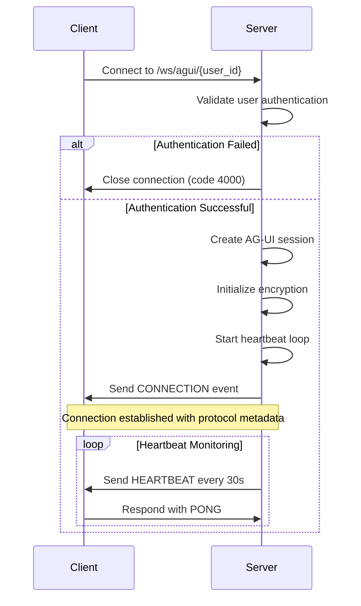
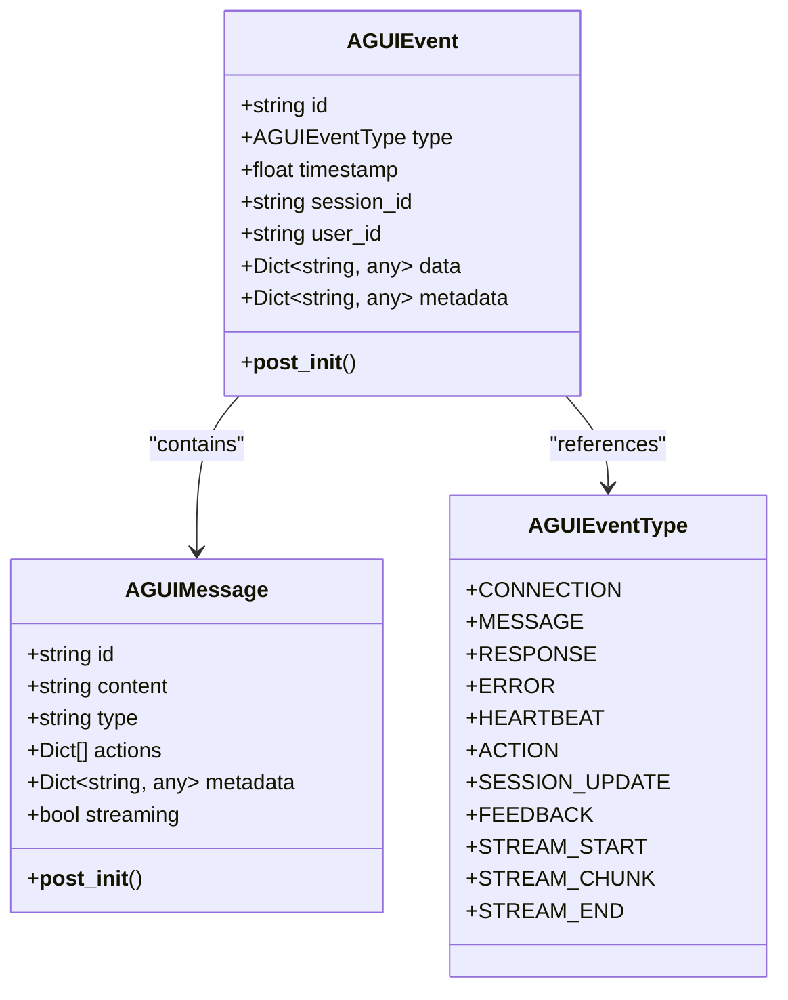
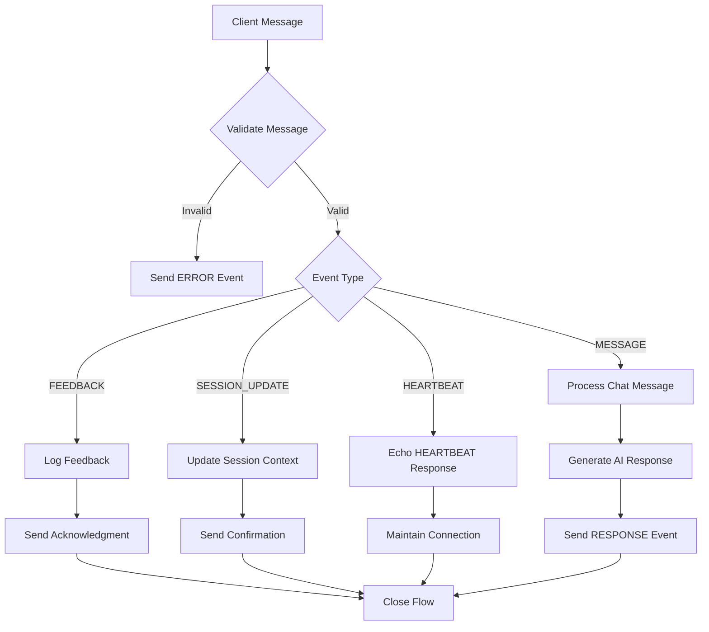
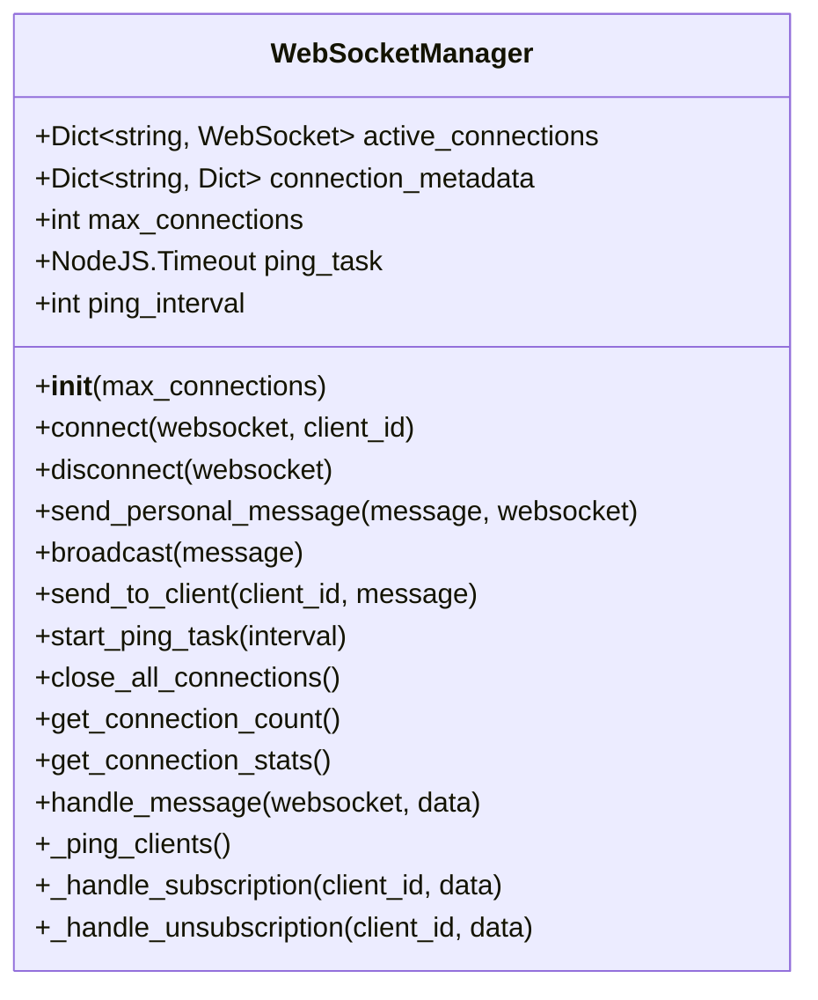
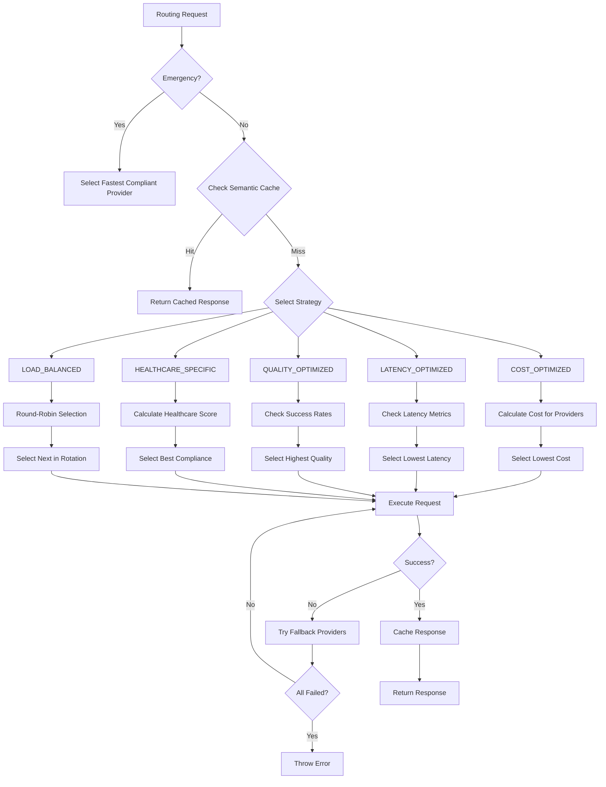
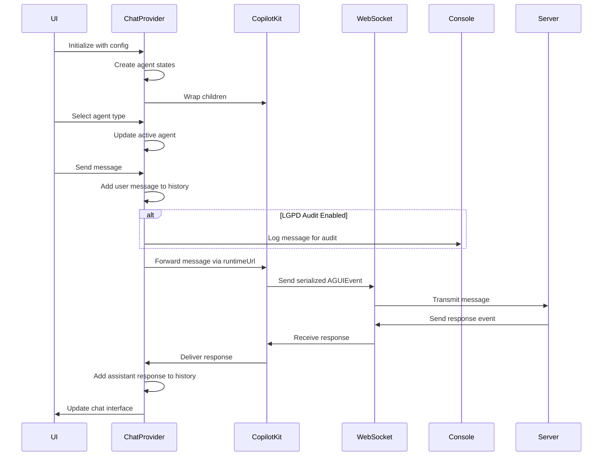

# WebSocket AI Agent API

<cite>
**Referenced Files in This Document**
- [agui_protocol.py](file://apps/api/agents/ag-ui-rag-agent/agui_protocol.py)
- [websocket_manager.py](file://apps/ai-agent/services/websocket_manager.py)
- [ai-provider-router.ts](file://apps/api/src/services/ai-provider-router.ts)
- [NeonProChatProvider.tsx](file://apps/web/src/components/chat/NeonProChatProvider.tsx)
</cite>

## Table of Contents

1. [Introduction](#introduction)
2. [Connection Handshake Process](#connection-handshake-process)
3. [Message Framing Format](#message-framing-format)
4. [Real-Time Interaction Patterns](#real-time-interaction-patterns)
5. [WebSocket Manager Implementation](#websocket-manager-implementation)
6. [AI Provider Routing Logic](#ai-provider-routing-logic)
7. [Client Implementation Examples](#client-implementation-examples)
8. [Security Considerations](#security-considerations)

## Introduction

The WebSocket AI Agent API in NeonPro provides a robust real-time communication layer between frontend clients and AI agents, specifically designed for healthcare applications with LGPD compliance. The system implements the AG-UI Protocol, which standardizes interactions through structured events and messages. This documentation details the complete architecture, from connection establishment to message processing and security enforcement.

The core components include the AG-UI Protocol implementation for message handling, WebSocket Manager for connection pooling, AI Provider Router for intelligent LLM routing, and client-side implementation for seamless integration. The system supports various message types including chat, feedback, and session control, with comprehensive error signaling and performance monitoring capabilities.

**Section sources**

- [agui_protocol.py](file://apps/api/agents/ag-ui-rag-agent/agui_protocol.py#L1-L50)
- [websocket_manager.py](file://apps/ai-agent/services/websocket_manager.py#L1-L20)

## Connection Handshake Process

The connection handshake process establishes secure WebSocket connections between clients and AI agents using the AG-UI Protocol. The process begins when a client connects to the `/ws/agui/{user_id}` endpoint, where user authentication is validated before establishing the WebSocket connection.

Upon successful authentication, the server creates an AG-UI session and sends a connection established event containing protocol metadata such as version, encryption method (AES-256-CFB), and TLS version (1.3). The session maintains state information including connection status, creation timestamp, and last activity time. Heartbeat mechanisms are initiated immediately after connection establishment, with periodic 30-second intervals to maintain connection health.

The protocol supports end-to-end encryption using PBKDF2HMAC key derivation with SHA256 hashing and AES-256-CFB mode. Each session generates its own encryption key derived from a master key material with a fixed salt value. The handshake also includes rate limiting protection and maximum connection constraints to prevent abuse.

**Diagram sources **

- [agui_protocol.py](file://apps/api/agents/ag-ui-rag-agent/agui_protocol.py#L203-L424)
- [main.py](file://apps/api/agents/ag-ui-rag-agent/main.py#L150-L170)

**Section sources**

- [agui_protocol.py](file://apps/api/agents/ag-ui-rag-agent/agui_protocol.py#L203-L424)
- [main.py](file://apps/api/agents/ag-ui-rag-agent/main.py#L150-L170)

## Message Framing Format

The AG-UI Protocol defines a standardized message framing format using JSON serialization with specific event types and data structures. All messages follow the AGUIEvent schema, which includes essential fields such as id, type, timestamp, session_id, user_id, data, and metadata. The protocol supports multiple event types including MESSAGE, RESPONSE, ERROR, HEARTBEAT, ACTION, SESSION_UPDATE, FEEDBACK, STREAM_START, STREAM_CHUNK, and STREAM_END.

Each message is encrypted when sensitive data is present, indicated by the 'encrypted' flag in the event payload. The encryption uses AES-256-CFB mode with base64 encoding for transmission. Message payloads can contain various data types, with chat messages following the AGUIMessage structure that includes content, type, actions, and metadata fields.

The protocol implements strict validation rules, rejecting messages with invalid JSON format or unrecognized event types. Error responses are standardized with error codes and descriptive messages to facilitate client-side error handling. Streaming responses are supported through STREAM_START, STREAM_CHUNK, and STREAM_END events, enabling real-time delivery of large responses.

**Diagram sources **

- [agui_protocol.py](file://apps/api/agents/ag-ui-rag-agent/agui_protocol.py#L20-L150)

**Section sources**

- [agui_protocol.py](file://apps/api/agents/ag-ui-rag-agent/agui_protocol.py#L20-L150)

## Real-Time Interaction Patterns

The real-time interaction patterns in NeonPro's WebSocket AI Agent API support various communication scenarios between frontend clients and AI agents. The system handles different message types through registered event handlers, allowing extensible processing of chat messages, feedback submissions, and session control commands.

Chat interactions follow a request-response pattern where client messages trigger AI processing and generate structured responses with optional actions. Feedback events are processed separately and logged for quality improvement purposes. Session updates allow dynamic modification of session context, enabling personalized interactions based on user roles and permissions.

The protocol supports broadcasting capabilities, allowing administrators to send messages to all connected users or specific user groups. Inactive session cleanup runs periodically to remove connections with no activity beyond the configured threshold (default 30 minutes). The system also supports message acknowledgment through heartbeat mechanisms and connection health monitoring.

**Diagram sources **

- [agui_protocol.py](file://apps/api/agents/ag-ui-rag-agent/agui_protocol.py#L203-L424)

**Section sources**

- [agui_protocol.py](file://apps/api/agents/ag-ui-rag-agent/agui_protocol.py#L203-L424)

## WebSocket Manager Implementation

The WebSocket Manager implementation handles connection pooling, message broadcasting, and session persistence for the AI agent communication system. The WebSocketManager class maintains active connections in a dictionary indexed by client ID, with associated metadata including connection timestamps, IP addresses, and user agents.

Connection pooling is managed through configurable maximum connection limits, with new connections rejected when capacity is reached. The manager implements automatic ping-pong mechanisms to detect and clean up stale connections, sending periodic ping messages every 30 seconds by default. When a client disconnects, the manager automatically removes the connection from active pools and cleans up associated metadata.

Message broadcasting capabilities allow efficient distribution of messages to all connected clients or specific recipients by client ID. The implementation includes built-in error handling for failed message delivery, automatically removing disconnected clients during broadcast operations. Connection statistics are available through the get_connection_stats method, providing detailed information about active sessions, connection duration, and idle times.

**Diagram sources **

- [websocket_manager.py](file://apps/ai-agent/services/websocket_manager.py#L14-L230)

**Section sources**

- [websocket_manager.py](file://apps/ai-agent/services/websocket_manager.py#L14-L230)

## AI Provider Routing Logic

The AI provider routing logic bridges WebSocket connections to external LLM providers through intelligent routing decisions based on multiple factors including cost, latency, quality, and healthcare-specific compliance requirements. The AIProviderRouterService evaluates available providers against the request's routing strategy, which can be COST_OPTIMIZED, LATENCY_OPTIMIZED, QUALITY_OPTIMIZED, HEALTHCARE_SPECIFIC, EMERGENCY_PRIORITY, or LOAD_BALANCED.

Healthcare-specific routing considers LGPD compliance, ANVISA certification, and CFM professional standards when selecting providers. Emergency requests receive priority routing to providers with the lowest latency and highest compliance scores. The router integrates with a semantic caching system, checking for cached responses before forwarding requests to external providers.

Fallback mechanisms are implemented to handle provider failures, automatically retrying requests with alternative providers when configured. Performance metrics are continuously updated for each provider, tracking latency percentiles, success rates, error rates, and cost efficiency. The system also enforces budget constraints and model category requirements based on the request configuration.

**Diagram sources **

- [ai-provider-router.ts](file://apps/api/src/services/ai-provider-router.ts#L43-L603)

**Section sources**

- [ai-provider-router.ts](file://apps/api/src/services/ai-provider-router.ts#L43-L603)

## Client Implementation Examples

The client implementation in NeonProChatProvider.tsx demonstrates connection lifecycle management, reconnection strategies, and message serialization for the WebSocket AI Agent API. The React component uses the CopilotKit integration to manage multiple AI agents (client, financial, appointment) within a single interface, maintaining separate message histories and states for each agent type.

Connection lifecycle management includes initialization of chat configuration with clinic ID, user ID, role, language preferences, and compliance settings. The provider automatically manages agent states, tracking whether each agent is idle, thinking, responding, or in error state. Message serialization follows the AG-UI Protocol format, with proper timestamp generation and metadata inclusion.

Reconnection strategies are implemented through the underlying CopilotKit runtime, which handles temporary network disruptions and automatically re-establishes connections when possible. The implementation includes LGPD-compliant data handling, with audit logging for message transmission and redaction of sensitive information during chat export operations. Accessibility features ensure WCAG 2.1 AA+ compliance for healthcare professionals with diverse needs.

**Diagram sources **

- [NeonProChatProvider.tsx](file://apps/web/src/components/chat/NeonProChatProvider.tsx#L65-L279)

**Section sources**

- [NeonProChatProvider.tsx](file://apps/web/src/components/chat/NeonProChatProvider.tsx#L65-L279)

## Security Considerations

The WebSocket AI Agent API implements comprehensive security measures to protect healthcare data and ensure LGPD compliance. Authentication token passing occurs during the initial WebSocket connection setup, with user ID validation performed before establishing the session. The system validates all incoming messages for proper JSON format and recognized event types, rejecting malformed payloads with appropriate error codes.

Message validation includes content filtering and injection attack protection, with server-side sanitization of all user inputs. End-to-end encryption protects sensitive data in transit using AES-256-CFB mode with PBKDF2HMAC key derivation. The implementation includes rate limiting and maximum connection constraints to prevent denial-of-service attacks.

Additional security layers include CORS policy enforcement, trusted host middleware, and security headers such as Content-Security-Policy and X-Content-Type-Options. The AI provider router performs healthcare compliance checks on all providers, ensuring only LGPD-approved services handle patient data. Audit trails are maintained for all critical operations, including message transmission, cache access, and emergency requests.

**Section sources**

- [agui_protocol.py](file://apps/api/agents/ag-ui-rag-agent/agui_protocol.py#L203-L424)
- [ai-provider-router.ts](file://apps/api/src/services/ai-provider-router.ts#L43-L603)
- [websocket_security_middleware.ts](file://apps/api/src/middleware/websocket-security-middleware.ts#L1-L100)
