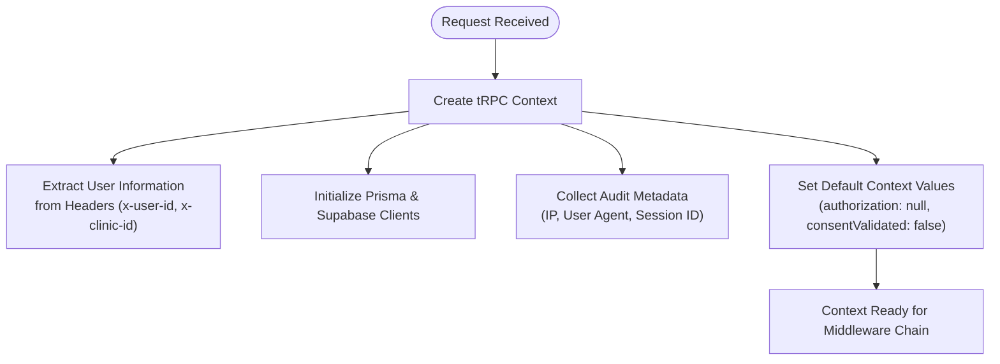
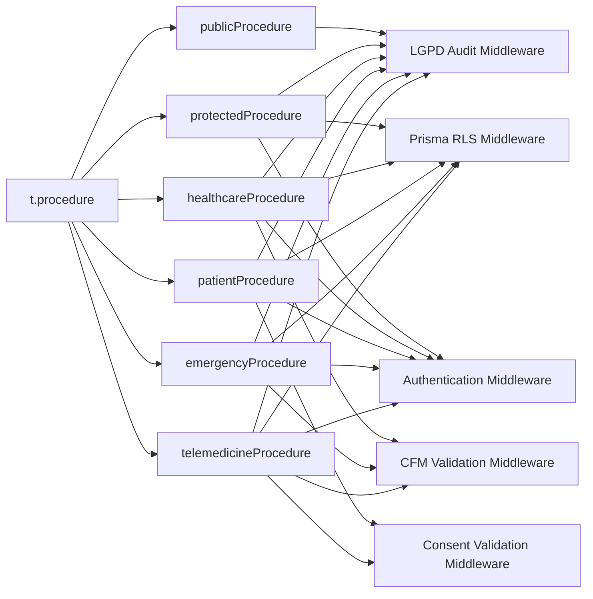
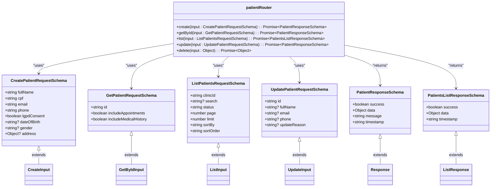
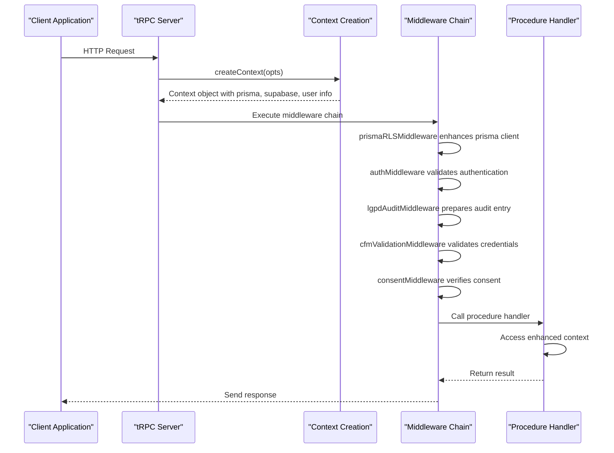
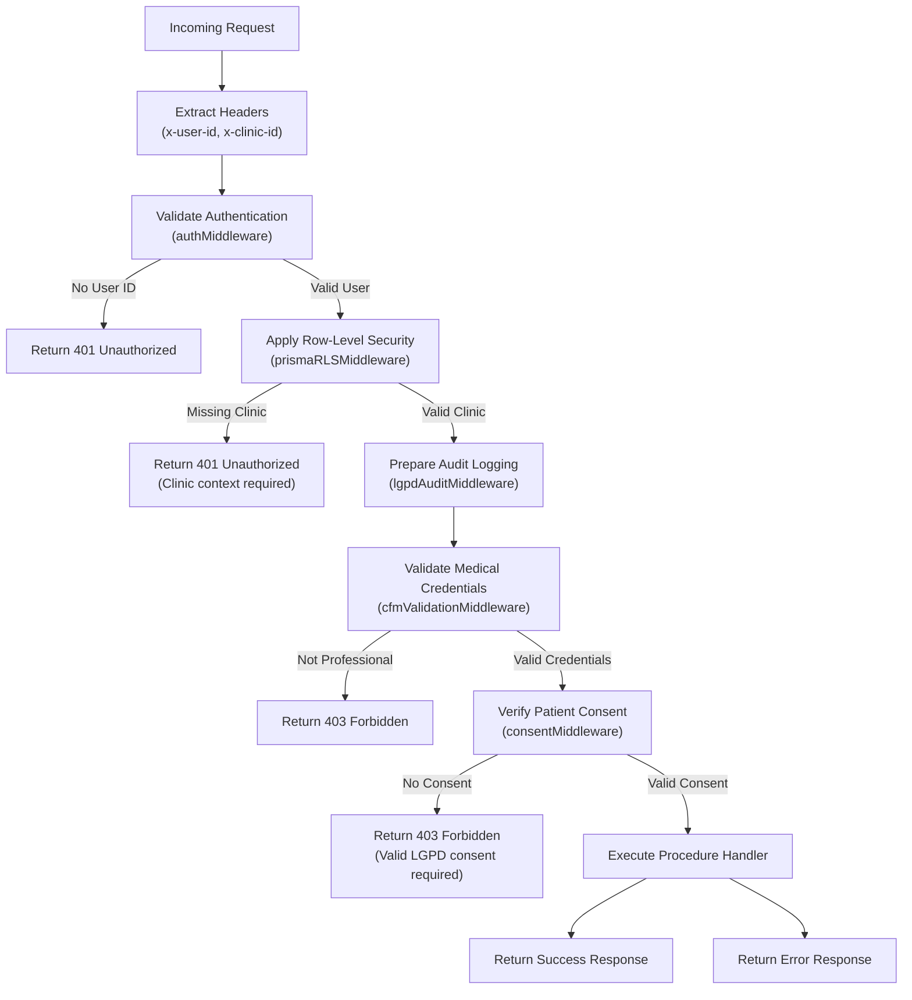
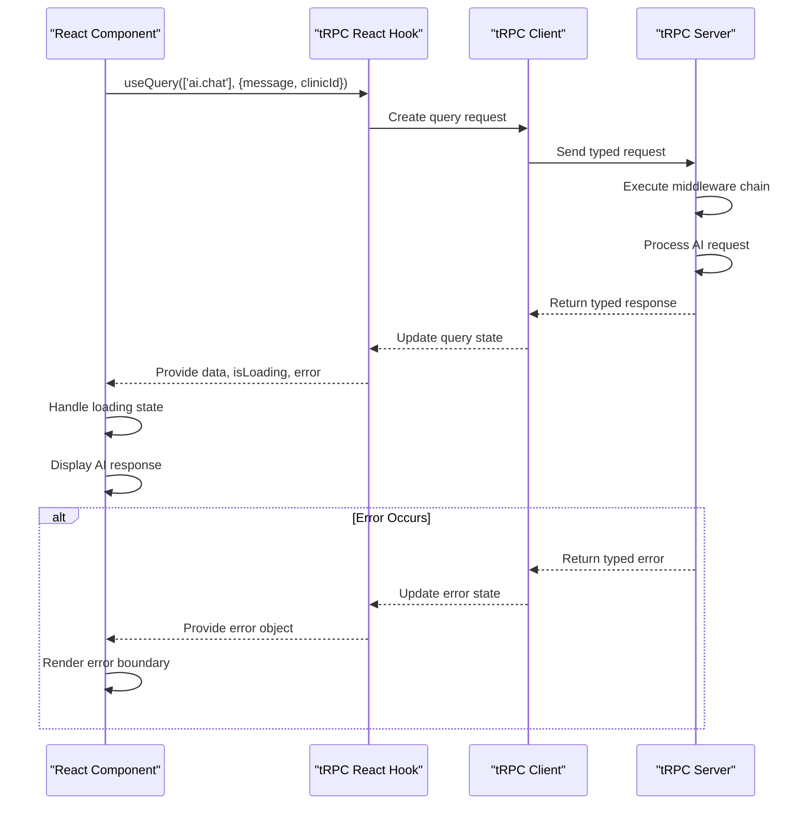

# tRPC Interfaces

<cite>
**Referenced Files in This Document**
- [context.ts](file://apps/api/src/trpc/context.ts)
- [router.ts](file://apps/api/src/trpc/router.ts)
- [trpc.ts](file://apps/api/src/trpc/trpc.ts)
- [prisma-rls.ts](file://apps/api/src/trpc/middleware/prisma-rls.ts)
- [lgpd-audit.ts](file://apps/api/src/trpc/middleware/lgpd-audit.ts)
- [cfm-validation.ts](file://apps/api/src/trpc/middleware/cfm-validation.ts)
- [ai.ts](file://apps/api/src/trpc/contracts/ai.ts)
- [patient.ts](file://apps/api/src/trpc/contracts/patient.ts)
</cite>

## Table of Contents

1. [Introduction](#introduction)
2. [tRPC Context and Request Flow](#trpc-context-and-request-flow)
3. [Router Structure and Endpoint Organization](#router-structure-and-endpoint-organization)
4. [Procedure Types and Middleware Chain](#procedure-types-and-middleware-chain)
5. [Contract-First API Design](#contract-first-api-design)
6. [Input Validation and Output Typing](#input-validation-and-output-typing)
7. [Context Propagation Mechanism](#context-propagation-mechanism)
8. [Authentication and Authorization Flow](#authentication-and-authorization-flow)
9. [Row-Level Security Implementation](#row-level-security-implementation)
10. [Client-Side Usage Patterns](#client-side-usage-patterns)
11. [Error Handling and Custom Error Types](#error-handling-and-custom-error-types)

## Introduction

The neonpro application implements a comprehensive tRPC interface system that provides end-to-end type safety, healthcare compliance, and robust security for medical data operations. The tRPC implementation follows a contract-first approach with strict validation, audit logging, and row-level security enforcement to meet Brazilian regulatory requirements including LGPD, CFM Resolution 2,314/2022, and ANVISA standards. This documentation details the architecture, implementation patterns, and usage guidelines for the tRPC interfaces across the neonpro platform.

## tRPC Context and Request Flow

The tRPC context serves as the foundation for request processing, providing essential information and services throughout the middleware chain and procedure execution. The context is created at the beginning of each request and propagated through all subsequent operations.



**Diagram sources**

- [context.ts](file://apps/api/src/trpc/context.ts#L1-L65)

**Section sources**

- [context.ts](file://apps/api/src/trpc/context.ts#L1-L65)

## Router Structure and Endpoint Organization

The main tRPC router combines domain-specific routers into a unified API surface while maintaining backward compatibility with legacy endpoints. The router structure follows a domain-driven design pattern with specialized routers for different healthcare functions.

```mermaid
graph TB
AppRouter[App Router] --> PatientsRouter[Patients Router]
AppRouter --> AppointmentsRouter[Appointments Router]
AppRouter --> AIRouter[AI Router]
AppRouter --> AgentsRouter[Agents Router]
AppRouter --> FinancialAgentRouter[Financial Agent Router]
AppRouter --> HealthcareServicesRouter[Healthcare Services Router]
AppRouter --> RealtimeTelemedicineRouter[Real-Time Telemedicine Router]
AppRouter --> TelemedicineRouter[Telemedicine Router]
AppRouter --> AestheticSchedulingRouter[Aesthetic Scheduling Router]
AppRouter --> AestheticClinicRouter[Aesthetic Clinic Router]
AppRouter --> AIClinicalSupportRouter[AI Clinical Support Router]
AppRouter --> APIContractsRouter[API Contracts Router]
style AppRouter fill:#4A90E2,stroke:#333,stroke-width:2px
style PatientsRouter fill:#7ED321,stroke:#333
style AppointmentsRouter fill:#7ED321,stroke:#333
style AIRouter fill:#7ED321,stroke:#333
style AgentsRouter fill:#7ED321,stroke:#333
style FinancialAgentRouter fill:#7ED321,stroke:#333
style HealthcareServicesRouter fill:#7ED321,stroke:#333
style RealtimeTelemedicineRouter fill:#7ED321,stroke:#333
style TelemedicineRouter fill:#7ED321,stroke:#333
style AestheticSchedulingRouter fill:#7ED321,stroke:#333
style AestheticClinicRouter fill:#7ED321,stroke:#333
style AIClinicalSupportRouter fill:#7ED321,stroke:#333
style APIContractsRouter fill:#7ED321,stroke:#333
```



**Diagram sources**

- [router.ts](file://apps/api/src/trpc/router.ts#L1-L107)

**Section sources**

- [router.ts](file://apps/api/src/trpc/router.ts#L1-L107)

## Procedure Types and Middleware Chain

The tRPC implementation defines multiple procedure types with different middleware chains to handle various security and compliance requirements. Each procedure type applies a specific sequence of middleware functions to enforce appropriate access controls.



**Diagram sources**

- [trpc.ts](file://apps/api/src/trpc/trpc.ts#L1-L187)

**Section sources**

- [trpc.ts](file://apps/api/src/trpc/trpc.ts#L1-L187)

## Contract-First API Design

The neonpro application implements a contract-first approach using tRPC v11 with comprehensive API contracts defined in the trpc/contracts directory. These contracts define the complete interface for each service, ensuring consistency between server implementation and client consumption.

### AI Service Contracts

The AI service contracts define endpoints for chat completion, conversation history retrieval, and health analysis with comprehensive input validation and output typing.

```mermaid
classDiagram
class AIRequestSchema {
+string message
+string? conversationId
+string? patientId
+string clinicId
+enum _context
+enum model
+number temperature
+number maxTokens
+boolean includeHistory
+boolean lgpdCompliant
}
class AIChatResponseSchema {
+boolean success
+object data
+string message
+string timestamp
}
class PaginationSchema {
+number page
+number limit
}
class HealthcareTRPCError {
+string code
+string message
+string errorCode
+object? details
}
AIRequestSchema <|-- ChatInput : extends
AIChatResponseSchema <|-- ChatOutput : extends
PaginationSchema <|-- HistoryInput : extends
HealthcareTRPCError <|-- CustomError : extends
class aiRouter {
+chat(input : AIRequestSchema) : Promise~AIChatResponseSchema~
+getConversationHistory(input : PaginationSchema & {conversationId? : string}) : Promise~Object~
+healthAnalysis(input : Object) : Promise~Object~
}
aiRouter --> AIRequestSchema : "uses"
aiRouter --> AIChatResponseSchema : "returns"
aiRouter --> PaginationSchema : "uses"
aiRouter --> HealthcareTRPCError : "throws"
```

**Diagram sources**

- [ai.ts](file://apps/api/src/trpc/contracts/ai.ts#L1-L799)

**Section sources**

- [ai.ts](file://apps/api/src/trpc/contracts/ai.ts#L1-L799)

### Patient Service Contracts

The patient service contracts define endpoints for patient management operations with LGPD compliance validation and audit logging.



**Diagram sources**

- [patient.ts](file://apps/api/src/trpc/contracts/patient.ts#L1-L417)

**Section sources**

- [patient.ts](file://apps/api/src/trpc/contracts/patient.ts#L1-L417)

## Input Validation and Output Typing

The tRPC implementation uses Zod schemas for comprehensive input validation and TypeScript types for output typing, ensuring end-to-end type safety from server to client.

### Input Validation Schema

```mermaid
erDiagram
INPUT_SCHEMA {
string message PK
string? conversationId FK
string? patientId FK
string clinicId FK
enum _context
enum model
number temperature
number maxTokens
boolean includeHistory
boolean lgpdCompliant
}
OUTPUT_SCHEMA {
boolean success PK
object data FK
string message
string timestamp
string? requestId
}
ERROR_SCHEMA {
string code PK
string message
string errorCode
object? details
}
INPUT_SCHEMA ||--o{ PROCEDURE : "used by"
OUTPUT_SCHEMA ||--o{ PROCEDURE : "returned by"
ERROR_SCHEMA ||--o{ PROCEDURE : "thrown by"
class PROCEDURE {
+input: INPUT_SCHEMA
+output: OUTPUT_SCHEMA
+error: ERROR_SCHEMA
}
```

**Section sources**

- [ai.ts](file://apps/api/src/trpc/contracts/ai.ts#L1-L799)
- [patient.ts](file://apps/api/src/trpc/contracts/patient.ts#L1-L417)

## Context Propagation Mechanism

The context propagation mechanism ensures that authentication state, audit metadata, and other contextual information are available throughout the request lifecycle. The context is enhanced by middleware functions as it passes through the middleware chain.



**Diagram sources**

- [context.ts](file://apps/api/src/trpc/context.ts#L1-L65)
- [trpc.ts](file://apps/api/src/trpc/trpc.ts#L1-L187)

**Section sources**

- [context.ts](file://apps/api/src/trpc/context.ts#L1-L65)
- [trpc.ts](file://apps/api/src/trpc/trpc.ts#L1-L187)

## Authentication and Authorization Flow

The authentication and authorization flow integrates with the healthcare platform's identity management system to validate user credentials and permissions before allowing access to protected resources.



**Diagram sources**

- [trpc.ts](file://apps/api/src/trpc/trpc.ts#L1-L187)
- [cfm-validation.ts](file://apps/api/src/trpc/middleware/cfm-validation.ts#L1-L532)

**Section sources**

- [trpc.ts](file://apps/api/src/trpc/trpc.ts#L1-L187)
- [cfm-validation.ts](file://apps/api/src/trpc/middleware/cfm-validation.ts#L1-L532)

## Row-Level Security Implementation

The Prisma RLS middleware implements automatic clinic-based data isolation and user context validation to ensure proper multi-tenant access control and data protection.

```mermaid
classDiagram
class RLSContext {
+string _userId
+string clinicId
+string userRole
+string? professionalId
+boolean isEmergency
+enum accessLevel
}
class RLSPolicy {
+clinic_isolation()
+user_context()
+professional_access()
+emergency_override()
}
class MODEL_RLS_CONFIG {
+Patient : policies, sensitiveFields, emergencyAccess
+Appointment : policies, sensitiveFields, emergencyAccess
+MedicalRecord : policies, sensitiveFields, emergencyAccess
+AuditTrail : policies, sensitiveFields, emergencyAccess
+User : policies, sensitiveFields, emergencyAccess
+LGPDConsent : policies, sensitiveFields, emergencyAccess
}
class prismaRLSMiddleware {
+createRLSContext(ctx)
+applyRLSPolicies(rlsContext, model, operation, existingWhere)
+createRLSEnforcedPrisma(originalPrisma, rlsContext, auditMeta)
}
RLSContext <|-- createRLSContext : "created by"
RLSPolicy <|-- applyRLSPolicies : "used by"
MODEL_RLS_CONFIG <|-- applyRLSPolicies : "used by"
prismaRLSMiddleware --> RLSContext : "uses"
prismaRLSMiddleware --> RLSPolicy : "uses"
prismaRLSMiddleware --> MODEL_RLS_CONFIG : "uses"
note right of prismaRLSMiddleware
Enhances Prisma client with RLS-enforced
queries that automatically include
clinicId and role-based filters
end note
```

**Diagram sources**

- [prisma-rls.ts](file://apps/api/src/trpc/middleware/prisma-rls.ts#L1-L526)

**Section sources**

- [prisma-rls.ts](file://apps/api/src/trpc/middleware/prisma-rls.ts#L1-L526)

## Client-Side Usage Patterns

The client-side usage patterns demonstrate how React components consume the tRPC interfaces with proper typing and error handling.



**Section sources**

- [ai.ts](file://apps/api/src/trpc/contracts/ai.ts#L1-L799)
- [patient.ts](file://apps/api/src/trpc/contracts/patient.ts#L1-L417)

## Error Handling and Custom Error Types

The error handling system uses custom error types to provide detailed information about failures while maintaining type safety across the API boundary.

```mermaid
classDiagram
class TRPCError {
+string code
+string message
+Error? cause
}
class HealthcareTRPCError {
+string code
+string message
+string errorCode
+Object? details
}
class ValidationError {
+string zodError
+Object fieldErrors
}
class RateLimitError {
+number currentUsage
+number limit
+number retryAfter
}
class ConsentError {
+string patientId
+string purpose
+string operation
}
class SecurityError {
+string threatType
+Object detectionDetails
}
TRPCError <|-- HealthcareTRPCError : extends
HealthcareTRPCError <|-- ValidationError : "validation failure"
HealthcareTRPCError <|-- RateLimitError : "rate limiting"
HealthcareTRPCError <|-- ConsentError : "consent violation"
HealthcareTRPCError <|-- SecurityError : "security threat"
note right of HealthcareTRPCError
Extends TRPCError with healthcare-specific\nerror codes and structured details\nfor better error handling and auditing
end note
```

**Diagram sources**

- [ai.ts](file://apps/api/src/trpc/contracts/ai.ts#L1-L799)
- [patient.ts](file://apps/api/src/trpc/contracts/patient.ts#L1-L417)

**Section sources**

- [ai.ts](file://apps/api/src/trpc/contracts/ai.ts#L1-L799)
- [patient.ts](file://apps/api/src/trpc/contracts/patient.ts#L1-L417)
