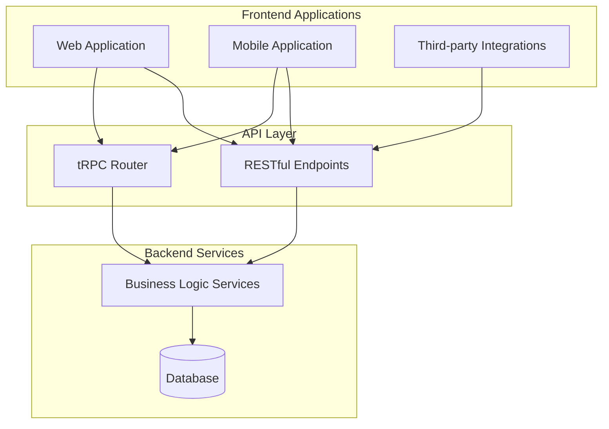
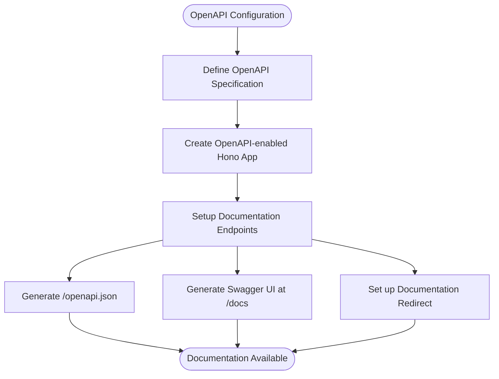

# API Design

<cite>
**Referenced Files in This Document **
- [app.ts](file://apps/api/src/app.ts)
- [index.ts](file://apps/api/src/index.ts)
- [openapi-config.ts](file://apps/api/src/schemas/openapi-config.ts)
- [router.ts](file://apps/api/src/trpc/router.ts)
- [patients.ts](file://apps/api/src/routes/patients.ts)
- [ai-chat.ts](file://apps/api/src/routes/ai-chat.ts)
- [patient.ts](file://apps/api/src/trpc/contracts/patient.ts)
- [appointment.ts](file://apps/api/src/trpc/contracts/appointment.ts)
</cite>

## Table of Contents

1. [Introduction](#introduction)
2. [Hybrid API Architecture](#hybrid-api-architecture)
3. [Design Principles](#design-principles)
4. [OpenAPI Documentation Generation](#openapi-documentation-generation)
5. [Public REST APIs vs Internal tRPC Interfaces](#public-rest-apis-vs-internal-trpc-interfaces)
6. [Payload Validation with Zod Schemas](#payload-validation-with-zod-schemas)
7. [Request/Response Transformation Patterns](#requestresponse-transformation-patterns)
8. [API Composition Strategies](#api-composition-strategies)
9. [Domain-Based Endpoint Grouping](#domain-based-endpoint-grouping)
10. [Business Logic Abstraction](#business-logic-abstraction)
11. [Extending the API Consistently](#extending-the-api-consistently)

## Introduction

The NeonPro backend implements a sophisticated hybrid API architecture that combines RESTful endpoints with tRPC for type-safe communication. This design enables both external accessibility through standard REST APIs and internal type safety through tRPC interfaces. The API layer serves as the primary interface between frontend applications and backend services, enforcing consistent response formatting, standardized error handling, and comprehensive documentation through OpenAPI/Swagger integration.

**Section sources**

- [app.ts](file://apps/api/src/app.ts#L1-L571)
- [index.ts](file://apps/api/src/index.ts#L1-L95)

## Hybrid API Architecture

The NeonPro backend employs a hybrid approach that leverages both RESTful endpoints and tRPC for different use cases within the system. RESTful APIs provide public access to resources following standard HTTP conventions, while tRPC enables type-safe, end-to-end typed communication for internal service interactions.



**Diagram sources **

- [app.ts](file://apps/api/src/app.ts#L1-L571)
- [router.ts](file://apps/api/src/trpc/router.ts#L1-L106)

**Section sources**

- [app.ts](file://apps/api/src/app.ts#L1-L571)
- [router.ts](file://apps/api/src/trpc/router.ts#L1-L106)

## Design Principles

The API design follows several key principles to ensure consistency, reliability, and maintainability across the entire system.

### Consistent Response Formatting

All API responses follow a standardized format regardless of endpoint or method. Successful responses include status indicators, data payloads, timestamps, and request identifiers, while error responses contain error codes, messages, and contextual information.

### Error Standardization

The system implements a comprehensive error standardization strategy using custom error types like `HealthcareTRPCError` that include structured error codes, messages, and metadata. This ensures consistent error handling across both REST and tRPC interfaces.

### Versioning Strategy

The API employs a clear versioning strategy with endpoints organized under versioned paths such as `/v1/`, `/v2/`, and `/api/v2/`. This allows for backward compatibility while enabling evolution of the API surface over time without disrupting existing clients.

**Section sources**

- [app.ts](file://apps/api/src/app.ts#L1-L571)
- [patients.ts](file://apps/api/src/routes/patients.ts#L1-L437)
- [ai-chat.ts](file://apps/api/src/routes/ai-chat.ts#L1-L492)

## OpenAPI Documentation Generation

The API documentation is automatically generated using OpenAPI specifications defined in the `openapi-config.ts` file. This configuration provides comprehensive details about the API, including security schemes, server endpoints, tags, and detailed descriptions of each API feature.



**Diagram sources **

- [openapi-config.ts](file://apps/api/src/schemas/openapi-config.ts#L1-L237)

**Section sources**

- [openapi-config.ts](file://apps/api/src/schemas/openapi-config.ts#L1-L237)
- [app.ts](file://apps/api/src/app.ts#L1-L571)

## Public REST APIs vs Internal tRPC Interfaces

The architecture clearly separates public REST APIs from internal tRPC interfaces, each serving distinct purposes within the system.

### Public REST APIs

Public REST endpoints are exposed at predictable URL paths such as `/v1/chat`, `/v1/appointments`, and `/api/v2/patients`. These endpoints handle HTTP requests directly and are designed for consumption by external clients and third-party integrations.

### Internal tRPC Interfaces

Internal tRPC interfaces are mounted at the `/trpc` path and provide type-safe access to backend functionality. These interfaces are primarily used for internal service communication and offer end-to-end type safety from client to server.

```mermaid
classDiagram
class RESTEndpoint {
+string path
+string method
+function handler()
+middleware[]
}
class TRPCProcedure {
+string name
+function input()
+function output()
+function mutation()
+function query()
+meta{}
}
class APIRouter {
+mountRest()
+mountTRPC()
+applyMiddleware()
}
RESTEndpoint --> APIRouter : "registered with"
TRPCProcedure --> APIRouter : "mounted via"
APIRouter --> app.ts : "implemented in"
```

**Diagram sources **

- [app.ts](file://apps/api/src/app.ts#L1-L571)
- [router.ts](file://apps/api/src/trpc/router.ts#L1-L106)

**Section sources**

- [app.ts](file://apps/api/src/app.ts#L1-L571)
- [router.ts](file://apps/api/src/trpc/router.ts#L1-L106)

## Payload Validation with Zod Schemas

Payload validation is implemented using Zod schemas throughout the API layer to ensure data integrity and type safety. Each endpoint defines specific validation schemas for request parameters, query strings, and JSON bodies.

### Patient Management Validation

The patient management endpoints use Zod schemas to validate critical healthcare data including CPF numbers, contact information, and consent status. These validations enforce business rules and regulatory compliance requirements.

### AI Chat Validation

The AI chat endpoints employ Zod validation to ensure message content meets quality standards and contains appropriate metadata for processing by the underlying AI providers.

**Section sources**

- [patients.ts](file://apps/api/src/routes/patients.ts#L1-L437)
- [ai-chat.ts](file://apps/api/src/routes/ai-chat.ts#L1-L492)

## Request/Response Transformation Patterns

The API implements consistent patterns for transforming requests and responses to maintain uniformity across different endpoints and service boundaries.

### Request Transformation

Incoming requests are transformed through middleware chains that extract authentication information, validate inputs, and prepare context objects for downstream processing. The tRPC context creation function transforms Hono request objects into structured context objects containing user identification and audit metadata.

### Response Transformation

Responses are standardized through response utility functions that ensure consistent formatting regardless of the underlying service implementation. Error responses are transformed to include appropriate HTTP status codes, error codes, and structured error details.

**Section sources**

- [app.ts](file://apps/api/src/app.ts#L1-L571)
- [patients.ts](file://apps/api/src/routes/patients.ts#L1-L437)

## API Composition Strategies

The API layer employs strategic composition patterns to organize functionality and promote code reuse across different domains.

### Router Composition

The main application router composes multiple domain-specific routers for patients, appointments, AI services, and billing. This modular approach allows teams to work independently on different API domains while maintaining a cohesive overall structure.

### Middleware Composition

Security, performance, and monitoring middleware are composed into a pipeline that processes all incoming requests. This includes CORS handling, authentication, rate limiting, error tracking, and healthcare-specific compliance checks.

**Section sources**

- [app.ts](file://apps/api/src/app.ts#L1-L571)
- [router.ts](file://apps/api/src/trpc/router.ts#L1-L106)

## Domain-Based Endpoint Grouping

Endpoints are grouped by functional domain to improve organization and maintainability. Each domain corresponds to a specific aspect of the healthcare management system.

### Patients Domain

The patients domain includes endpoints for managing patient records, medical histories, and consent documentation. These endpoints are accessible at `/api/v2/patients` and follow LGPD compliance requirements.

### Appointments Domain

The appointments domain handles scheduling, conflict detection, and appointment management. Endpoints are available at `/v1/appointments` and include AI-powered no-show prediction capabilities.

### Financial Domain

The financial domain manages billing, payments, and financial analytics. Although the specific billing route file was not found, the architecture indicates this domain would be accessible at `/v1/billing`.

**Section sources**

- [app.ts](file://apps/api/src/app.ts#L1-L571)
- [routes directory](file://apps/api/src/routes)

## Business Logic Abstraction

The API layer serves as an abstraction boundary between frontend clients and backend business logic services.

### Service Layer Integration

Each API endpoint delegates to dedicated service classes that encapsulate business logic. For example, the patients router uses a `PatientService` class that handles database operations, audit logging, and compliance checks.

### Data Access Abstraction

Database access is abstracted through Prisma ORM with additional service wrappers that provide auditing, access control, and transaction management. This ensures that data access patterns remain consistent across different parts of the application.

**Section sources**

- [patients.ts](file://apps/api/src/routes/patients.ts#L1-L437)
- [app.ts](file://apps/api/src/app.ts#L1-L571)

## Extending the API Consistently

When extending the API with new endpoints, developers should follow established patterns to maintain consistency across the codebase.

### Adding New REST Endpoints

New REST endpoints should be added to the appropriate domain router, use consistent naming conventions, implement proper validation with Zod, and follow the same response formatting patterns as existing endpoints.

### Adding New tRPC Procedures

New tRPC procedures should be added to the appropriate contract router, define clear input and output schemas, include descriptive metadata, and implement proper authorization checks.

### Maintaining Documentation

All new endpoints should be automatically included in the OpenAPI documentation through the existing generation mechanism, ensuring that API consumers always have access to up-to-date specifications.

**Section sources**

- [app.ts](file://apps/api/src/app.ts#L1-L571)
- [router.ts](file://apps/api/src/trpc/router.ts#L1-L106)
- [openapi-config.ts](file://apps/api/src/schemas/openapi-config.ts#L1-L237)
