# Backend Architecture

<cite>
**Referenced Files in This Document**   
- [index.ts](file://apps/api/src/index.ts)
- [app.ts](file://apps/api/src/app.ts)
- [auth.ts](file://apps/api/src/middleware/auth.ts)
- [error-handler.ts](file://apps/api/src/middleware/error-handler.ts)
- [rate-limiting.ts](file://apps/api/src/middleware/rate-limiting.ts)
- [security-headers.ts](file://apps/api/src/middleware/security-headers.ts)
- [ai-chat.ts](file://apps/api/src/routes/ai-chat.ts)
- [router.ts](file://apps/api/src/trpc/router.ts)
- [aesthetic-clinic.ts](file://apps/api/src/trpc/routers/aesthetic-clinic.ts)
- [aesthetic-scheduling.ts](file://apps/api/src/trpc/routers/aesthetic-scheduling.ts)
- [ai-clinical-support.ts](file://apps/api/src/trpc/routers/ai-clinical-support.ts)
- [ai.ts](file://apps/api/src/trpc/routers/ai.ts)
</cite>

## Table of Contents
1. [Introduction](#introduction)
2. [System Context and Integration](#system-context-and-integration)
3. [Core Architecture Overview](#core-architecture-overview)
4. [Middleware Pipeline](#middleware-pipeline)
5. [API Design Patterns](#api-design-patterns)
6. [Component Interaction Model](#component-interaction-model)
7. [Data Flow Analysis](#data-flow-analysis)
8. [Security Implementation](#security-implementation)
9. [Error Handling Strategy](#error-handling-strategy)
10. [Cross-Cutting Concerns](#cross-cutting-concerns)
11. [Technology Stack and Dependencies](#technology-stack-and-dependencies)
12. [Deployment Topology](#deployment-topology)
13. [Scalability Considerations](#scalability-considerations)

## Introduction

The neonpro application backend architecture is designed as a modern, scalable API platform built on the Hono framework, serving an AI-powered healthcare and aesthetic clinic management system. The architecture follows RESTful principles while incorporating tRPC for type-safe API endpoints, creating a hybrid approach that balances flexibility with strong typing guarantees.

This documentation provides a comprehensive overview of the backend system's high-level design, focusing on its middleware pipeline, route structure, component interactions, and security implementation. The system is specifically tailored to meet Brazilian healthcare compliance requirements including LGPD (General Data Protection Law), ANVISA (National Health Surveillance Agency), and CFM (Federal Council of Medicine) regulations.

The backend serves multiple client applications including web interfaces, mobile apps, and AI agents, providing services for patient management, appointment scheduling, medical records, financial operations, and AI-powered clinical decision support. The architecture emphasizes security, auditability, and performance, particularly for edge deployments on Vercel.

**Section sources**
- [app.ts](file://apps/api/src/app.ts#L1-L572)
- [index.ts](file://apps/api/src/index.ts#L1-L95)

## System Context and Integration

The neonpro backend operates as the central nervous system connecting various components of the healthcare ecosystem. It integrates with frontend applications, AI agents, database systems, and third-party services to provide a comprehensive healthcare management platform.

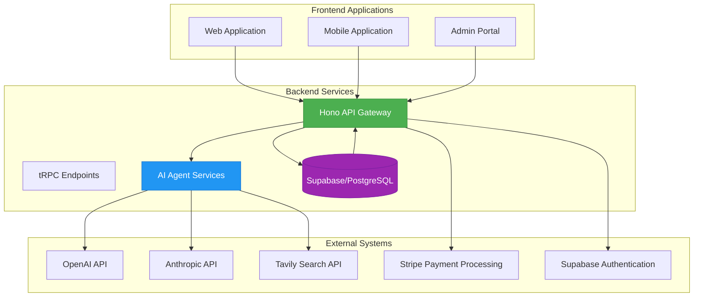

**Diagram sources **
- [app.ts](file://apps/api/src/app.ts#L1-L572)
- [ai-chat.ts](file://apps/api/src/routes/ai-chat.ts#L1-L492)
- [router.ts](file://apps/api/src/trpc/router.ts#L1-L106)

The system context reveals several key integration points:
- **Frontend Integration**: Multiple client applications consume the API through both RESTful endpoints and tRPC interfaces
- **AI Agent Ecosystem**: The backend orchestrates multiple AI agents for different domains including aesthetic medicine, financial planning, and clinical decision support
- **Database Layer**: Supabase provides PostgreSQL database services with real-time capabilities and authentication
- **Third-Party Services**: Integration with AI providers (OpenAI, Anthropic), payment processing (Stripe), and search enrichment (Tavily)
- **Compliance Infrastructure**: Specialized services for LGPD compliance, audit logging, and healthcare data protection

The architecture supports bidirectional communication patterns, including request-response for traditional API calls and streaming responses for AI chat interactions. WebSocket connections enable real-time updates for collaborative features and telemedicine applications.

**Section sources**
- [app.ts](file://apps/api/src/app.ts#L1-L572)
- [ai-chat.ts](file://apps/api/src/routes/ai-chat.ts#L1-L492)
- [router.ts](file://apps/api/src/trpc/router.ts#L1-L106)

## Core Architecture Overview

The neonpro backend follows a layered architectural pattern with clear separation of concerns between infrastructure, routing, business logic, and data access layers. Built on the Hono framework, the system leverages TypeScript for type safety and runs on Vercel edge functions for low-latency global distribution.

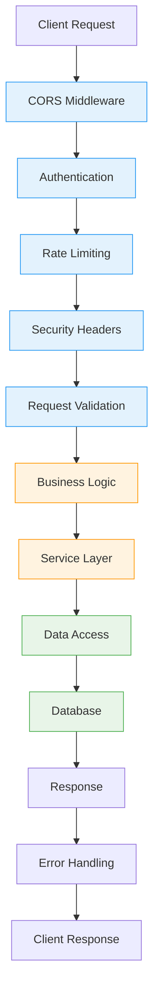

**Diagram sources **
- [app.ts](file://apps/api/src/app.ts#L1-L572)
- [auth.ts](file://apps/api/src/middleware/auth.ts#L1-L282)
- [rate-limiting.ts](file://apps/api/src/middleware/rate-limiting.ts#L1-L214)

The core architectural components include:

### Entry Point Configuration
The application entry point (`index.ts`) initializes the server instance and configures essential services before starting the HTTP server. In development mode, it creates a local server, while in production it integrates with Vercel's serverless environment.

### Hono Application Framework
The main application (`app.ts`) configures the Hono framework with a comprehensive middleware pipeline that handles cross-cutting concerns before requests reach business logic. Hono's lightweight design enables fast cold starts on edge environments.

### Modular Route Structure
Routes are organized by domain (patients, appointments, billing, AI) with versioned endpoints for backward compatibility. The system supports both RESTful routes and tRPC endpoints, providing flexibility for different client requirements.

### Service-Oriented Design
Business logic is encapsulated in service classes that coordinate operations across multiple domains. This separation allows for better testability and maintainability of complex workflows.

### Data Access Layer
Prisma ORM provides type-safe database access with support for complex queries and transactions. The data layer abstracts database operations from business logic, enabling easier maintenance and evolution of the data model.

The architecture prioritizes performance with optimizations like semantic caching for AI responses, query timeouts, and response compression. Monitoring and observability are built-in, with comprehensive logging, error tracking, and performance metrics collection.

**Section sources**
- [index.ts](file://apps/api/src/index.ts#L1-L95)
- [app.ts](file://apps/api/src/app.ts#L1-L572)

## Middleware Pipeline

The neonpro backend implements a comprehensive middleware pipeline that processes every incoming request through a series of validation, security, and monitoring layers. This pipeline ensures consistent handling of cross-cutting concerns across all API endpoints.

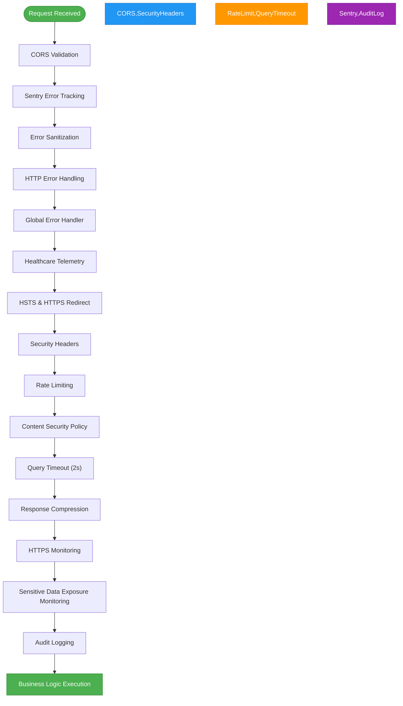

**Diagram sources **
- [app.ts](file://apps/api/src/app.ts#L1-L572)
- [security-headers.ts](file://apps/api/src/middleware/security-headers.ts#L1-L381)
- [rate-limiting.ts](file://apps/api/src/middleware/rate-limiting.ts#L1-L214)

### Middleware Composition

The middleware pipeline is composed of several specialized layers, each addressing specific concerns:

#### Security Middleware
- **CORS Policy**: Restricts origins based on environment (production vs. development)
- **HSTS Enforcement**: Ensures HTTPS-only communication with 1-year max-age
- **Security Headers**: Implements comprehensive header protection including XSS, MIME sniffing, and frame guards
- **Content Security Policy**: Strict policy blocking inline scripts and unsafe evaluations
- **HTTPS Redirection**: Automatically redirects HTTP requests to HTTPS

#### Rate Limiting Strategy
The system implements differentiated rate limiting based on endpoint sensitivity:
- **Healthcare Data Endpoints**: 50 requests per 15 minutes
- **AI/Chat Endpoints**: 20 requests per minute  
- **Authentication Endpoints**: 10 attempts per 15 minutes (only failed attempts counted)
- **General API Endpoints**: 100 requests per 15 minutes

#### Performance Optimization
- **Query Timeout**: Enforces 2-second maximum response time for healthcare compliance
- **Response Compression**: Compresses responses to reduce bandwidth usage
- **HTTPS Monitoring**: Tracks handshake performance with alerting capabilities

#### Observability and Monitoring
- **Sentry Integration**: Captures errors and performance metrics
- **Structured Logging**: Comprehensive logging with contextual information
- **Audit Trail**: Records security-relevant events with risk level assessment
- **Error Tracking**: Healthcare-compliant error monitoring with sanitization

The middleware pipeline executes in a specific order to ensure proper handling of requests and responses. Security measures are applied early in the pipeline, while error handling and logging occur throughout and at the end of the request lifecycle.

**Section sources**
- [app.ts](file://apps/api/src/app.ts#L1-L572)
- [security-headers.ts](file://apps/api/src/middleware/security-headers.ts#L1-L381)
- [rate-limiting.ts](file://apps/api/src/middleware/rate-limiting.ts#L1-L214)

## API Design Patterns

The neonpro backend employs a hybrid API design approach combining RESTful principles with tRPC for type-safe endpoints. This dual strategy provides flexibility for different use cases while maintaining strong typing guarantees where needed.

```mermaid
classDiagram
class RESTfulAPI {
+GET /v1/patients
+POST /v1/patients
+GET /v1/appointments
+POST /v1/appointments
+GET /v1/chat/stream
+POST /v1/chat/suggestions
}
class TRPCRouter {
+patients.create()
+patients.getById()
+appointments.schedule()
+ai.chat()
+financialAgent.processPayment()
+healthcareServices.getTreatmentPlan()
}
class Context {
+userId : string
+clinicId : string
+auditMeta : AuditMetadata
}
class AuditMetadata {
+ipAddress : string
+userAgent : string
+sessionId : string
}
RESTfulAPI --> Context : "uses"
TRPCRouter --> Context : "uses"
Context --> AuditMetadata : "contains"
note right of RESTfulAPI
Traditional REST endpoints
JSON request/response format
Versioned URL paths (/v1/)
Standard HTTP methods
end note
note left of TRPCRouter
Type-safe RPC endpoints
Strong TypeScript typing
Nested procedure organization
Shared types between client/server
end note
```

**Diagram sources **
- [app.ts](file://apps/api/src/app.ts#L1-L572)
- [router.ts](file://apps/api/src/trpc/router.ts#L1-L106)
- [ai-chat.ts](file://apps/api/src/routes/ai-chat.ts#L1-L492)

### RESTful API Endpoints

The RESTful interface follows conventional patterns with versioned routes and standard HTTP methods:

#### Versioned Routes
- `/v1/` prefix for stable API endpoints
- `/api/v2/` prefix for newer versions with enhanced features
- Clear separation between legacy and modern endpoints

#### Resource-Oriented Design
- **Patients**: `/v1/patients` for patient management
- **Appointments**: `/v1/appointments` for scheduling
- **Medical Records**: `/v1/medical-records` for health data
- **Billing**: `/v1/billing` for financial operations
- **AI Chat**: `/v1/chat` for conversational AI

#### Specialized Endpoints
- **Streaming Responses**: `/v1/chat/stream` for AI chat with real-time text generation
- **Search Suggestions**: `/v1/chat/suggestions` for query auto-completion
- **Health Checks**: `/v1/health` and `/health` for system monitoring
- **Compliance Status**: `/v1/compliance/lgpd` for regulatory verification

### tRPC API Endpoints

The tRPC interface provides type-safe RPC methods organized by domain:

#### Domain-Specific Routers
- **Patients Router**: CRUD operations for patient profiles
- **Appointments Router**: Scheduling and management of appointments
- **AI Router**: Conversational AI and predictive analytics
- **Financial Agent Router**: Billing automation and payment processing
- **Healthcare Services Router**: Treatment planning and service management

#### Enhanced Specialized Routers
- **Aesthetic Scheduling Router**: Multi-session treatment scheduling with recovery planning
- **Aesthetic Clinic Router**: Comprehensive clinic operations with ANVISA compliance
- **AI Clinical Decision Support Router**: Treatment recommendation engine with contraindication analysis
- **Real-Time Telemedicine Router**: WebSocket subscriptions for video consultations

#### Context Propagation
The tRPC context includes essential information for healthcare operations:
- User authentication details (userId, clinicId)
- Audit metadata (IP address, user agent, session ID)
- Request tracing information for debugging

The hybrid API approach allows clients to choose the appropriate interface based on their needs—RESTful APIs for simplicity and broad compatibility, tRPC for type safety and complex operations.

**Section sources**
- [app.ts](file://apps/api/src/app.ts#L1-L572)
- [router.ts](file://apps/api/src/trpc/router.ts#L1-L106)
- [ai-chat.ts](file://apps/api/src/routes/ai-chat.ts#L1-L492)

## Component Interaction Model

The neonpro backend implements a clean component interaction model with well-defined boundaries between layers. This architecture promotes maintainability, testability, and scalability by enforcing separation of concerns.

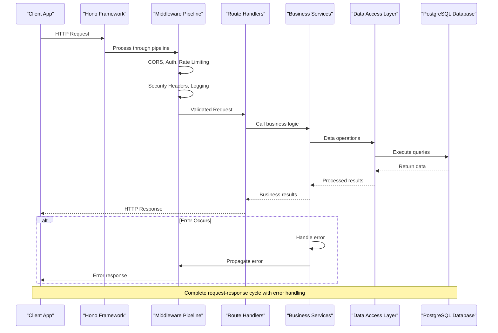

**Diagram sources **
- [app.ts](file://apps/api/src/app.ts#L1-L572)
- [ai-chat.ts](file://apps/api/src/routes/ai-chat.ts#L1-L492)
- [aesthetic-clinic.ts](file://apps/api/src/trpc/routers/aesthetic-clinic.ts#L1-L799)

### Layer Interactions

The component interaction model follows a strict unidirectional flow from outer layers to inner layers:

#### Presentation Layer (Hono Framework)
The Hono framework acts as the entry point, receiving HTTP requests and applying the middleware pipeline. It routes requests to appropriate handlers based on URL patterns and HTTP methods.

#### Middleware Layer
The middleware pipeline processes requests through a series of filters that handle cross-cutting concerns:
- Authentication and authorization
- Rate limiting and DDoS protection  
- Security header enforcement
- Request validation and sanitization
- Logging and monitoring

#### Controller Layer (Route Handlers)
Route handlers act as controllers that receive validated requests and coordinate business operations:
- Parse request parameters and body
- Extract authentication context
- Invoke appropriate service methods
- Transform service results into HTTP responses
- Handle exceptions and return appropriate error codes

#### Service Layer (Business Logic)
Services encapsulate business rules and coordinate complex workflows:
- Implement domain-specific logic for healthcare operations
- Orchestrate multiple data access operations within transactions
- Integrate with external systems (AI providers, payment gateways)
- Apply business validation rules
- Manage state transitions for entities

#### Data Access Layer (Repositories)
Repositories provide an abstraction over database operations:
- Encapsulate query logic and data transformations
- Implement repository patterns for collections
- Handle connection management and transactions
- Provide type-safe interfaces for data operations
- Abstract database-specific details from business logic

### Cross-Layer Communication

The architecture enforces strict dependency rules:
- Higher layers can depend on lower layers, but not vice versa
- Services depend on repositories, but repositories do not depend on services
- Controllers depend on services, but services do not depend on controllers
- Middleware is independent of business logic

This dependency structure creates a clean architecture that is easy to test and maintain. Each layer can be developed and tested independently, with well-defined interfaces between components.

**Section sources**
- [app.ts](file://apps/api/src/app.ts#L1-L572)
- [ai-chat.ts](file://apps/api/src/routes/ai-chat.ts#L1-L492)
- [aesthetic-clinic.ts](file://apps/api/src/trpc/routers/aesthetic-clinic.ts#L1-L799)

## Data Flow Analysis

The neonpro backend implements a comprehensive data flow from request ingress to response egress, with careful attention to data transformation, validation, and security at each stage.

```mermaid
flowchart LR
A[Client Request] --> B[Ingress Processing]
B --> C[Authentication]
C --> D[Authorization]
D --> E[Input Validation]
E --> F[Business Processing]
F --> G[Data Transformation]
G --> H[Database Operations]
H --> I[Response Construction]
I --> J[Egress Processing]
J --> K[Client Response]
subgraph "Ingress"
B
C
D
E
end
subgraph "Processing"
F
G
H
end
subgraph "Egress"
I
J
K
end
classDef phase fill:#f5f5f5,stroke:#ddd,stroke-width:1px;
class Ingress,Processing,Egress phase
style Ingress fill:#e8f5e8,stroke:#4CAF50
style Processing fill:#fff3e0,stroke:#FF9800
style Egress fill:#e3f2fd,stroke:#2196F3
```

**Diagram sources **
- [app.ts](file://apps/api/src/app.ts#L1-L572)
- [auth.ts](file://apps/api/src/middleware/auth.ts#L1-L282)
- [ai-chat.ts](file://apps/api/src/routes/ai-chat.ts#L1-L492)

### Ingress Processing

When a request enters the system, it undergoes several processing steps:

#### Request Reception
- HTTP request received by Vercel edge function
- Request parsed into standardized format
- Headers, method, URL, and body extracted

#### CORS Validation
- Origin checked against allowed list
- Development vs. production origin policies applied
- Preflight requests handled appropriately

#### Authentication
- JWT token extracted from Authorization header
- Token validated and user identity established
- User context stored for downstream processing

#### Authorization
- Role-based access control applied
- Clinic-level data isolation enforced
- Permission checks performed for sensitive operations

#### Input Validation
- Request parameters and body validated against schemas
- Malformed requests rejected with appropriate error codes
- Sanitization applied to prevent injection attacks

### Processing Phase

Once the request is authenticated and validated, business processing begins:

#### Context Establishment
- Request-specific context created with user, clinic, and audit information
- Trace identifiers generated for monitoring
- Performance timers started

#### Business Logic Execution
- Service methods invoked with validated input
- Complex workflows orchestrated across multiple domains
- External API calls made as needed (AI providers, payment processors)
- Transaction boundaries established for data consistency

#### Data Transformation
- Internal data structures mapped to domain models
- Privacy-preserving transformations applied
- Compliance checks performed (LGPD, ANVISA)
- Audit trails generated for sensitive operations

### Egress Processing

Before the response is sent back to the client:

#### Response Construction
- Business results transformed into API response format
- Error responses formatted consistently
- Streaming responses prepared for AI chat

#### Security Processing
- Sensitive data redacted from responses
- Security headers added to response
- Content security policies enforced

#### Performance Optimization
- Response compression applied
- Caching headers set appropriately
- Performance metrics recorded

#### Logging and Monitoring
- Success or failure logged with contextual information
- Audit trails updated for completed operations
- Performance metrics captured for analysis

The data flow is designed to be transparent and auditable, with comprehensive logging at each stage. Error handling is integrated throughout the flow, ensuring that failures are properly reported and do not compromise system security.

**Section sources**
- [app.ts](file://apps/api/src/app.ts#L1-L572)
- [auth.ts](file://apps/api/src/middleware/auth.ts#L1-L282)
- [ai-chat.ts](file://apps/api/src/routes/ai-chat.ts#L1-L492)

## Security Implementation

The neonpro backend implements a comprehensive security framework designed to protect sensitive healthcare data and ensure compliance with Brazilian regulations including LGPD, ANVISA, and CFM.

```mermaid
graph TD
A[Security Implementation] --> B[Authentication]
A --> C[Authorization]
A --> D[Data Protection]
A --> E[Network Security]
A --> F[Audit & Compliance]
B --> B1[JWT-Based Authentication]
B --> B2[Session Management]
B --> B3[MFA Support]
C --> C1[Role-Based Access Control]
C --> C2[Clinic-Level Isolation]
C --> C3[Permission Scopes]
D --> D1[End-to-End Encryption]
D --> D2[PII Redaction]
D --> D3[Anonymization]
E --> E1[HSTS Enforcement]
E --> E2[CSP Implementation]
E --> E3[Rate Limiting]
F --> F1[Audit Logging]
F --> F2[Compliance Verification]
F --> F3[Security Monitoring]
style A fill:#f44336,stroke:#d32f2f,color:white
style B,C,D,E,F fill:#ffeb3b,stroke:#fbc02d,color:black
style B1,B2,B3,C1,C2,C3,D1,D2,D3,E1,E2,E3,F1,F2,F3 fill:#cddc39,stroke:#afb42b,color:black
```

**Diagram sources **
- [auth.ts](file://apps/api/src/middleware/auth.ts#L1-L282)
- [security-headers.ts](file://apps/api/src/middleware/security-headers.ts#L1-L381)
- [aesthetic-clinic.ts](file://apps/api/src/trpc/routers/aesthetic-clinic.ts#L1-L799)

### Authentication Mechanisms

The system implements robust authentication to verify user identities:

#### JWT-Based Authentication
- Statelesss authentication using JSON Web Tokens
- Tokens contain user ID, clinic ID, and role information
- Signature verification ensures token integrity
- Expiration times limit token validity

#### Session Management
- Enhanced session manager tracks active sessions
- Session cookies with secure attributes (HttpOnly, Secure, SameSite)
- Session invalidation on password change or logout
- Refresh token rotation to prevent replay attacks

#### Multi-Factor Authentication
- Support for additional authentication factors
- Configurable MFA policies based on user role
- Time-based one-time passwords (TOTP) integration
- Biometric authentication support

### Authorization Framework

Fine-grained authorization controls access to resources:

#### Role-Based Access Control (RBAC)
- Predefined roles (admin, clinician, staff, patient)
- Role-specific permissions for different operations
- Hierarchical role relationships
- Dynamic role assignment

#### Clinic-Level Data Isolation
- All queries filtered by clinic ID
- Cross-clinic data access strictly prohibited
- Tenant isolation at database level
- Clinic-specific configuration and branding

#### Permission Scopes
- Granular permissions for specific operations
- Least privilege principle enforced
- Temporary elevated privileges for specific tasks
- Audit trails for permission changes

### Data Protection Measures

Comprehensive data protection ensures confidentiality and integrity:

#### Encryption
- AES-256-GCM encryption for sensitive data
- TLS 1.3 for data in transit
- Key rotation policies
- Hardware security modules (HSM) for key storage

#### PII Redaction
- Automatic redaction of personally identifiable information
- CPF, CNPJ, phone numbers, and email addresses masked
- Context-aware redaction based on user role
- Audit logs with redacted sensitive data

#### Anonymization
- Patient data anonymized for AI processing
- Direct identifiers removed before analysis
- Generalization of sensitive attributes
- Re-identification risk assessment

### Network Security

Layered network defenses protect against common threats:

#### Transport Security
- HSTS with 1-year max-age and preload
- Automatic HTTP to HTTPS redirection
- Perfect forward secrecy enabled
- Certificate transparency logging

#### Content Security
- Strict Content Security Policy
- Blocking of inline scripts and unsafe evaluations
- Whitelisted domains for external resources
- Reporting of policy violations

#### Rate Limiting
- Differentiated limits for sensitive endpoints
- IP-based and user-based limiting
- Sliding window algorithms
- Adaptive thresholds based on traffic patterns

### Audit and Compliance

Comprehensive auditing ensures accountability and regulatory compliance:

#### Audit Logging
- Immutable audit trails for all sensitive operations
- Risk level classification for events
- Tamper-evident logging mechanisms
- Long-term retention for compliance

#### Compliance Verification
- Automated LGPD compliance checks
- ANVISA regulation validation
- CFM resolution adherence
- Regular compliance reporting

#### Security Monitoring
- Real-time alerting for suspicious activities
- Anomaly detection for unusual access patterns
- Vulnerability scanning and penetration testing
- Incident response procedures

The security implementation follows defense-in-depth principles, with multiple layers of protection that work together to create a robust security posture for the healthcare application.

**Section sources**
- [auth.ts](file://apps/api/src/middleware/auth.ts#L1-L282)
- [security-headers.ts](file://apps/api/src/middleware/security-headers.ts#L1-L381)
- [aesthetic-clinic.ts](file://apps/api/src/trpc/routers/aesthetic-clinic.ts#L1-L799)

## Error Handling Strategy

The neonpro backend implements a comprehensive error handling strategy designed to provide meaningful feedback to clients while protecting sensitive information and maintaining system stability.

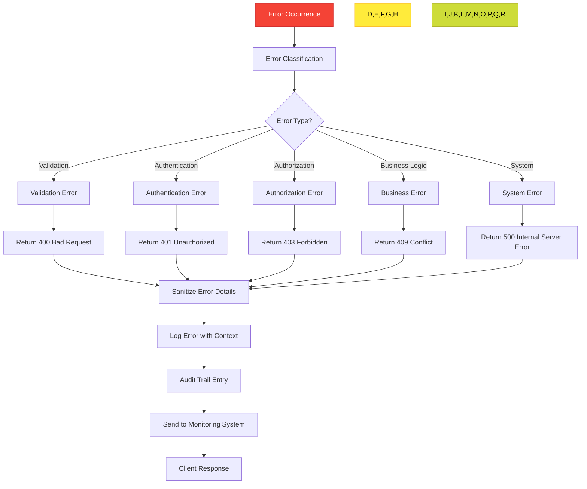

**Diagram sources **
- [error-handler.ts](file://apps/api/src/middleware/error-handler.ts#L1-L46)
- [app.ts](file://apps/api/src/app.ts#L1-L572)
- [auth.ts](file://apps/api/src/middleware/auth.ts#L1-L282)

### Error Classification

Errors are categorized into distinct types, each with appropriate handling:

#### Validation Errors (400 Bad Request)
- Invalid input parameters or request body
- Missing required fields
- Format violations (e.g., invalid email, malformed date)
- Schema validation failures

#### Authentication Errors (401 Unauthorized)
- Missing authentication token
- Expired or invalid token
- Token signature verification failure
- Session expiration

#### Authorization Errors (403 Forbidden)
- Insufficient role or permissions
- Access to unauthorized resources
- Clinic-level data isolation violations
- Operation not permitted for user role

#### Business Logic Errors (409 Conflict)
- Violation of business rules
- Data integrity constraints
- Scheduling conflicts
- Duplicate record creation

#### System Errors (500 Internal Server Error)
- Database connectivity issues
- External service failures
- Unhandled exceptions
- Resource exhaustion

### Error Sanitization

To prevent information leakage, error details are carefully sanitized:

#### Sensitive Data Removal
- Stack traces stripped from production responses
- Database error messages sanitized
- Internal system details hidden
- Configuration values protected

#### Contextual Information
- Generic error messages for clients
- Detailed logging for internal use
- Correlation IDs for troubleshooting
- Request-specific context preserved internally

#### User-Friendly Messages
- Clear, actionable error descriptions
- Language-appropriate messaging (Portuguese for Brazilian users)
- Guidance on how to resolve common issues
- Support contact information when appropriate

### Error Logging and Monitoring

Comprehensive logging ensures errors can be diagnosed and resolved:

#### Structured Logging
- Consistent log format with structured data
- Timestamps, request IDs, and user context
- Error severity levels
- Performance impact metrics

#### Audit Trails
- Security-relevant errors logged to audit system
- Risk level assessment for error events
- Immutable records for compliance
- Retention policies aligned with regulations

#### Monitoring Integration
- Real-time error tracking with Sentry
- Alerting for critical errors
- Error rate monitoring and trending
- Root cause analysis tools

### Graceful Degradation

The system implements strategies to maintain availability during failures:

#### Circuit Breakers
- Fail-fast for dependent services
- Automatic recovery after cooldown
- Fallback responses when possible
- Load shedding during high traffic

#### Retry Mechanisms
- Exponential backoff for transient failures
- Idempotent operations to prevent duplication
- Retry budget limiting
- Context-aware retry decisions

#### Fallback Responses
- Cached responses for read operations
- Simplified functionality during partial outages
- Maintenance mode for extended downtime
- Progressive enhancement restoration

The error handling strategy balances transparency with security, providing enough information for clients to understand and resolve issues while protecting system internals and sensitive data.

**Section sources**
- [error-handler.ts](file://apps/api/src/middleware/error-handler.ts#L1-L46)
- [app.ts](file://apps/api/src/app.ts#L1-L572)

## Cross-Cutting Concerns

The neonpro backend addresses several cross-cutting concerns that affect multiple components and require coordinated implementation across the architecture.

```mermaid
graph TD
A[Cross-Cutting Concerns] --> B[Audit Logging]
A --> C[Compliance Validation]
A --> D[Performance Monitoring]
A --> E[Observability]
A --> F[Data Privacy]
B --> B1[Immutable Audit Trails]
B --> B2[Risk Level Classification]
B --> B3[Retention Policies]
C --> C1[LGPD Compliance]
C --> C2[ANVISA Regulations]
C --> C3[CFM Resolutions]
D --> D1[Response Time Tracking]
D --> D2[Throughput Monitoring]
D --> D3[Error Rate Analysis]
E --> E1[Distributed Tracing]
E --> E2[Metrics Collection]
E --> E3[Log Aggregation]
F --> F1[Data Minimization]
F --> F2[Purpose Limitation]
F --> F3[Storage Limitation]
style A fill:#9C27B0,stroke:#7B1FA2,color:white
style B,C,D,E,F fill:#ffeb3b,stroke:#fbc02d,color:black
style B1,B2,B3,C1,C2,C3,D1,D2,D3,E1,E2,E3,F1,F2,F3 fill:#cddc39,stroke:#afb42b,color:black
```

**Diagram sources **
- [app.ts](file://apps/api/src/app.ts#L1-L572)
- [aesthetic-clinic.ts](file://apps/api/src/trpc/routers/aesthetic-clinic.ts#L1-L799)
- [aesthetic-scheduling.ts](file://apps/api/src/trpc/routers/aesthetic-scheduling.ts#L1-L799)

### Audit Logging

Comprehensive audit logging provides accountability and traceability:

#### Immutable Audit Trails
- Write-once, append-only logs
- Cryptographic hashing for tamper detection
- Digital signatures for authenticity
- External storage for protection

#### Risk Level Classification
- Low, Medium, High, Critical risk levels
- Automated risk assessment based on operation type
- Context-aware risk scoring
- Regulatory impact evaluation

#### Retention Policies
- Short-term retention for operational use
- Long-term archiving for compliance
- Legal hold capabilities
- Secure deletion procedures

### Compliance Validation

Automated compliance checks ensure adherence to regulations:

#### LGPD Compliance
- Data subject rights implementation
- Lawful basis verification
- Consent management
- Data protection impact assessments

#### ANVISA Regulations
- Medical device compliance
- Procedure registration validation
- Safety protocol adherence
- Professional certification checks

#### CFM Resolutions
- Telemedicine compliance
- Medical license validation
- Ethical guideline adherence
- Continuing education tracking

### Performance Monitoring

Continuous performance monitoring ensures system responsiveness:

#### Response Time Tracking
- Per-endpoint latency measurement
- Percentile-based SLA monitoring
- Cold start tracking for serverless functions
- Regional performance analysis

#### Throughput Monitoring
- Requests per second by endpoint
- Concurrent connection tracking
- Queue length monitoring
- Capacity planning metrics

#### Error Rate Analysis
- Error rates by type and endpoint
- Error correlation with traffic patterns
- Mean time to recovery (MTTR)
- Error budget consumption

### Observability

Comprehensive observability enables effective system management:

#### Distributed Tracing
- End-to-end request tracing
- Span propagation across services
- Service dependency mapping
- Bottleneck identification

#### Metrics Collection
- Infrastructure metrics (CPU, memory, disk)
- Application metrics (requests, errors, latency)
- Business metrics (appointments, revenue)
- Custom metrics for key workflows

#### Log Aggregation
- Centralized log collection
- Structured log parsing
- Log correlation with traces
- Real-time log searching

### Data Privacy

Robust data privacy protections align with healthcare standards:

#### Data Minimization
- Collection limited to necessary data
- Field-level granularity
- Just-in-time data access
- Data lifecycle management

#### Purpose Limitation
- Data use restricted to specified purposes
- Consent-based data sharing
- Purpose change notifications
- Secondary use restrictions

#### Storage Limitation
- Data retention periods by type
- Automated data deletion
- Archival vs. active data separation
- Backup data management

These cross-cutting concerns are implemented consistently across the system, with shared libraries and middleware ensuring uniform behavior regardless of the specific feature or endpoint.

**Section sources**
- [app.ts](file://apps/api/src/app.ts#L1-L572)
- [aesthetic-clinic.ts](file://apps/api/src/trpc/routers/aesthetic-clinic.ts#L1-L799)
- [aesthetic-scheduling.ts](file://apps/api/src/trpc/routers/aesthetic-scheduling.ts#L1-L799)

## Technology Stack and Dependencies

The neonpro backend leverages a modern technology stack optimized for performance, security, and developer productivity in a healthcare context.

```mermaid
graph TD
A[Technology Stack] --> B[Runtime Environment]
A --> C[Framework & Libraries]
A --> D[Database & Storage]
A --> E[AI & Machine Learning]
A --> F[Infrastructure & Deployment]
B --> B1[Node.js 18+]
B --> B2[Vercel Edge Functions]
B --> B3[TypeScript 5+]
C --> C1[Hono Framework]
C --> C2[tRPC for Type-Safe APIs]
C --> C3[Prisma ORM]
C --> C4[Zod for Validation]
D --> D1[PostgreSQL via Supabase]
D --> D2[Redis for Caching]
D --> D3[S3 for File Storage]
E --> E1[OpenAI API]
E --> E2[Anthropic Claude]
E --> E3[Tavily Search]
F --> F1[Vercel Platform]
F --> F2[GitHub Actions]
F --> F3[Sentry for Monitoring]
style A fill:#009688,stroke:#00796B,color:white
style B,C,D,E,F fill:#ffeb3b,stroke:#fbc02d,color:black
style B1,B2,B3,C1,C2,C3,C4,D1,D2,D3,E1,E2,E3,F1,F2,F3 fill:#cddc39,stroke:#afb42b,color:black
```

**Diagram sources **
- [package.json](file://apps/api/package.json)
- [tsconfig.json](file://apps/api/tsconfig.json)
- [vercel.json](file://apps/api/vercel.json)

### Runtime Environment

The backend runs in a modern JavaScript environment optimized for edge computing:

#### Node.js 18+
- Long-term support version with performance improvements
- Enhanced cryptographic capabilities
- Improved diagnostics and debugging
- Better memory management

#### Vercel Edge Functions
- Global distribution with low-latency access
- Automatic scaling to handle traffic spikes
- Fast cold starts for serverless execution
- Integrated CDN and caching

#### TypeScript 5+
- Strong typing for improved code quality
- Enhanced type inference and checking
- Decorators and metaprogramming support
- Better integration with modern frameworks

### Framework and Libraries

A curated set of libraries provides essential functionality:

#### Hono Framework
- Lightweight and fast API framework
- Excellent TypeScript support
- Middleware composition capabilities
- Optimized for serverless environments

#### tRPC
- End-to-end type safety between client and server
- Zero-boilerplate API creation
- Built-in serialization and deserialization
- Excellent developer experience

#### Prisma ORM
- Type-safe database access
- Intuitive query builder
- Migrations and schema management
- Support for complex relationships

#### Zod
- Schema validation with TypeScript integration
- Runtime type checking
- Easy-to-use validation syntax
- Great error messages

### Database and Storage

The data layer combines relational and specialized storage:

#### PostgreSQL via Supabase
- Full-featured relational database
- Row-level security for fine-grained access control
- Real-time subscriptions for live updates
- Managed backups and replication

#### Redis
- In-memory caching for frequently accessed data
- Session storage
- Rate limiting counters
- Message queuing

#### S3-Compatible Storage
- Scalable object storage for documents and images
- Versioning and lifecycle management
- Server-side encryption
- Fine-grained access controls

### AI and Machine Learning

Integration with leading AI providers enables intelligent features:

#### OpenAI API
- GPT-4 for advanced language understanding
- Embeddings for semantic search
- Function calling for tool integration
- Moderation API for content safety

#### Anthropic Claude
- Large context windows for document analysis
- Constitutional AI for responsible outputs
- Advanced reasoning capabilities
- Enterprise-grade security

#### Tavily Search
- Web search for information retrieval
- Citation generation for transparency
- Filtering for reliable sources
- Rate-limited access to prevent abuse

### Infrastructure and Deployment

Modern DevOps practices ensure reliability and security:

#### Vercel Platform
- Global edge network
- Automatic SSL certificate management
- Preview deployments for pull requests
- Integrated analytics and monitoring

#### GitHub Actions
- CI/CD pipelines for automated testing
- Security scanning and vulnerability detection
- Deployment automation
- Code quality gates

#### Sentry
- Real-time error tracking
- Performance monitoring
- Release tracking
- Source map support for minified code

The technology stack is carefully selected to balance innovation with stability, choosing proven technologies for critical components while embracing new capabilities where they provide significant value.

**Section sources**
- [package.json](file://apps/api/package.json)
- [tsconfig.json](file://apps/api/tsconfig.json)
- [vercel.json](file://apps/api/vercel.json)

## Deployment Topology

The neonpro backend is deployed on Vercel's edge network, leveraging serverless functions for global distribution and low-latency access. This deployment topology optimizes performance, scalability, and reliability for healthcare applications.

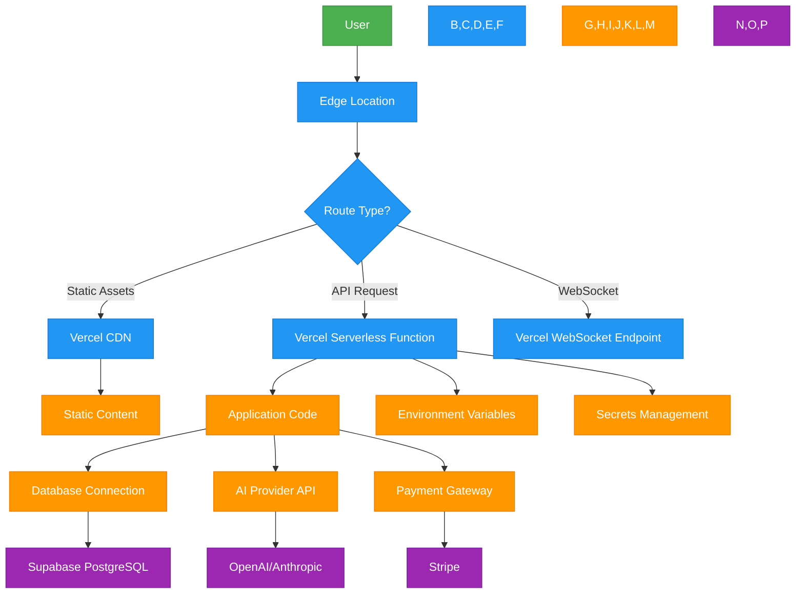

**Diagram sources **
- [vercel.json](file://apps/api/vercel.json)
- [index.ts](file://apps/api/src/index.ts#L1-L95)
- [app.ts](file://apps/api/src/app.ts#L1-L572)

### Edge Network Architecture

The deployment leverages Vercel's global edge network for optimal performance:

#### Global Points of Presence
- 30+ regions worldwide
- Automatic routing to nearest location
- Anycast DNS for fast lookups
- Low-latency connections (<50ms target)

#### Static Asset Delivery
- CDN-cached static assets (HTML, CSS, JS, images)
- Automatic compression and optimization
- Cache invalidation on deployment
- Versioned asset URLs to prevent stale content

#### Serverless Function Execution
- On-demand function instances
- Automatic scaling from zero to thousands of instances
- Isolated execution environments
- Memory and timeout limits for stability

### Serverless Function Configuration

API endpoints are deployed as serverless functions with specific configurations:

#### Function Isolation
- Separate functions for different API groups
- Independent scaling and monitoring
- Reduced blast radius for failures
- Granular cost tracking

#### Cold Start Optimization
- Lightweight dependencies
- Efficient initialization code
- Keep-warm strategies for critical endpoints
- Predictive scaling based on usage patterns

#### Resource Limits
- Memory allocation (512MB-3GB)
- Execution timeout (1-10 seconds for HTTP, longer for background tasks)
- Concurrent request limits
- Bandwidth caps

### Environment Management

Multiple environments support the development lifecycle:

#### Development Environment
- Local development with hot reloading
- Feature flags for incomplete functionality
- Mock services for external dependencies
- Debug logging enabled

#### Staging Environment
- Pre-production testing
- Integration with real external services
- Performance testing
- Security scanning

#### Production Environment
- High-availability configuration
- Automated failover
- Disaster recovery procedures
- Monitoring and alerting

### Secrets Management

Sensitive configuration is securely managed:

#### Environment Variables
- Encrypted storage
- Environment-specific values
- Automatic injection at runtime
- Restricted access controls

#### Secret Rotation
- Regular rotation schedules
- Automated rotation where possible
- Audit trails for secret changes
- Emergency revocation procedures

#### Access Controls
- Principle of least privilege
- Role-based access to secrets
- Multi-factor authentication for administrative access
- Session timeouts for console access

The deployment topology is designed for healthcare applications with strict requirements for availability, performance, and security. The edge-first approach minimizes latency for users worldwide while maintaining the scalability needed for growing clinics and hospitals.

**Section sources**
- [vercel.json](file://apps/api/vercel.json)
- [index.ts](file://apps/api/src/index.ts#L1-L95)
- [app.ts](file://apps/api/src/app.ts#L1-L572)

## Scalability Considerations

The neonpro backend architecture incorporates several scalability considerations to handle growth in users, data volume, and transaction frequency while maintaining performance and reliability.

```mermaid
graph TD
A[Scalability Considerations] --> B[Horizontal Scaling]
A --> C[Database Optimization]
A --> D[Caching Strategies]
A --> E[Load Distribution]
A --> F[Resource Management]
B --> B1[Stateless Architecture]
B --> B2[Auto-Scaling Groups]
B --> B3[Container Orchestration]
C --> C1[Indexing Strategy]
C --> C2[Query Optimization]
C --> C3[Connection Pooling]
D --> D1[Semantic Caching]
D --> D2[Redis Caching]
D --> D3[CDN Caching]
E --> E1[Traffic Shaping]
E --> E2[Rate Limiting]
E --> E3[Queue Processing]
F --> F1[Memory Management]
F --> F2[Timeout Configuration]
F --> F3[Graceful Degradation]
style A fill:#03A9F4,stroke:#0288D1,color:white
style B,C,D,E,F fill:#ffeb3b,stroke:#fbc02d,color:black
style B1,B2,B3,C1,C2,C3,D1,D2,D3,E1,E2,E3,F1,F2,F3 fill:#cddc39,stroke:#afb42b,color:black
```

**Diagram sources **
- [app.ts](file://apps/api/src/app.ts#L1-L572)
- [ai-chat.ts](file://apps/api/src/routes/ai-chat.ts#L1-L492)
- [aesthetic-scheduling.ts](file://apps/api/src/trpc/routers/aesthetic-scheduling.ts#L1-L799)

### Horizontal Scaling

The architecture supports horizontal scaling to handle increased load:

#### Stateless Architecture
- No server-side session storage
- All state stored in databases or client
- Requests can be handled by any instance
- Easy addition of new instances

#### Auto-Scaling Groups
- Dynamic scaling based on CPU, memory, and request metrics
- Predictive scaling for known traffic patterns
- Minimum and maximum instance limits
- Cost-optimized instance selection

#### Container Orchestration
- Kubernetes for container management
- Pod autoscaling based on custom metrics
- Rolling updates with zero downtime
- Health checks and self-healing

### Database Optimization

Database performance is optimized for healthcare workloads:

#### Indexing Strategy
- Composite indexes for common query patterns
- Partial indexes for filtered queries
- Covering indexes to avoid table scans
- Regular index maintenance

#### Query Optimization
- Query execution plan analysis
- Avoidance of N+1 query problems
- Batch operations for bulk updates
- Read replicas for reporting queries

#### Connection Pooling
- Efficient reuse of database connections
- Connection limits to prevent overload
- Idle connection cleanup
- Failover to secondary databases

### Caching Strategies

Multi-layer caching reduces database load and improves response times:

#### Semantic Caching
- Caching of AI responses based on semantic similarity
- Vector embeddings for query matching
- TTL-based expiration with refresh
- Cost savings through response reuse

#### Redis Caching
- In-memory caching for frequently accessed data
- Session storage with automatic expiration
- Rate limiting counters
- Distributed locks for coordination

#### CDN Caching
- Edge caching of static assets
- API response caching for idempotent requests
- Cache invalidation on data changes
- Cache hierarchy with regional and global layers

### Load Distribution

Traffic is distributed to optimize resource utilization:

#### Traffic Shaping
- Priority queuing for critical operations
- Throttling of non-essential requests
- Load shedding during peak periods
- Circuit breakers for failing services

#### Rate Limiting
- Differentiated limits by endpoint and user role
- Sliding window algorithms for accuracy
- Adaptive thresholds based on system load
- Fair queuing to prevent starvation

#### Queue Processing
- Asynchronous processing of background tasks
- Message queues for decoupled communication
- Worker pools for task execution
- Dead letter queues for error handling

### Resource Management

Efficient resource management prevents system overload:

#### Memory Management
- Object pooling for expensive allocations
- Stream processing for large datasets
- Garbage collection tuning
- Memory leak detection

#### Timeout Configuration
- Per-operation timeouts to prevent hanging
- Circuit breaker timeouts for external calls
- Graceful timeout handling
- Retry budgets to prevent thundering herd

#### Graceful Degradation
- Fallback responses during partial outages
- Simplified functionality when resources are constrained
- Maintenance mode for extended downtime
- Progressive enhancement restoration

The scalability considerations ensure that the neonpro backend can grow with the needs of healthcare organizations, from small clinics to large hospital networks, while maintaining the performance and reliability required for critical medical applications.

**Section sources**
- [app.ts](file://apps/api/src/app.ts#L1-L572)
- [ai-chat.ts](file://apps/api/src/routes/ai-chat.ts#L1-L492)
- [aesthetic-scheduling.ts](file://apps/api/src/trpc/routers/aesthetic-scheduling.ts#L1-L