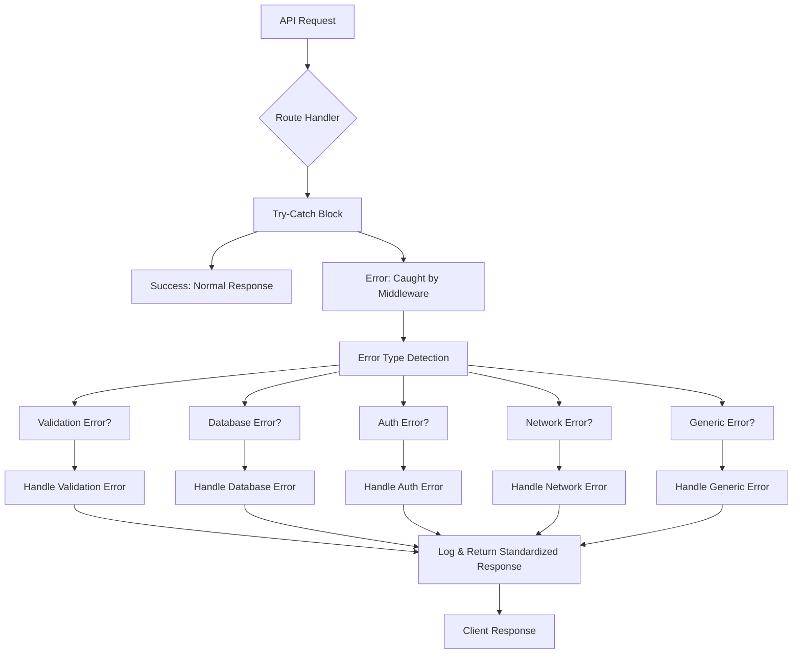
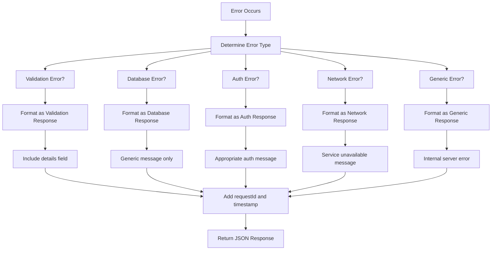
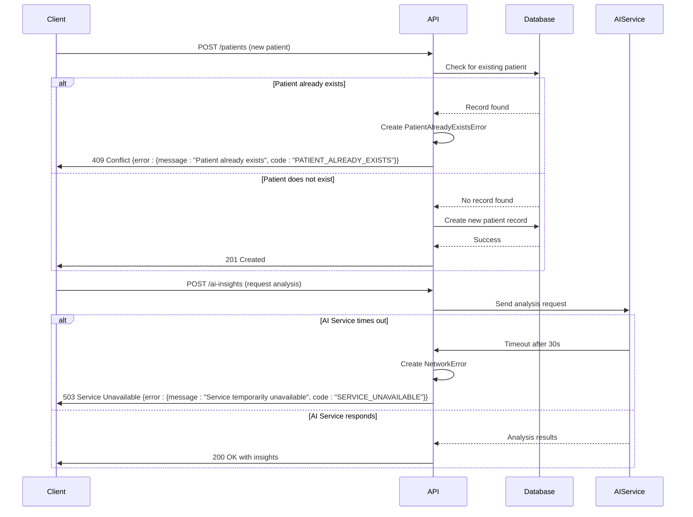

# Error Handling

<cite>
**Referenced Files in This Document **
- [http-error-handling.ts](file://apps/api/src/middleware/http-error-handling.ts)
- [error-handler.ts](file://apps/api/src/middleware/error-handler.ts)
- [healthcare-errors.ts](file://packages/utils/src/healthcare-errors.ts)
- [error-sanitization.ts](file://apps/api/src/middleware/error-sanitization.ts)
- [error-tracking.ts](file://apps/api/src/middleware/error-tracking.ts)
</cite>

## Table of Contents

1. [Introduction](#introduction)
2. [Centralized Error Handling Mechanism](#centralized-error-handling-mechanism)
3. [Error Type Hierarchy](#error-type-hierarchy)
4. [Standardized Error Response Format](#standardized-error-response-format)
5. [Error Transformation and Client Exposure](#error-transformation-and-client-exposure)
6. [Error Scenarios and Examples](#error-scenarios-and-examples)
7. [Error Logging and Monitoring Integration](#error-logging-and-monitoring-integration)
8. [Client-Friendly Message Sanitization](#client-friendly-message-sanitization)
9. [HTTP Status Code Usage](#http-status-code-usage)
10. [createHealthcareError Utility](#createhealthcareerror-utility)

## Introduction

The neonpro backend implements a comprehensive error handling strategy designed specifically for healthcare applications with strict compliance requirements. The system features centralized error handling through middleware, a hierarchical error type system, standardized response formats, and robust logging and monitoring integration. This documentation details the implementation and usage of these components to ensure consistent, secure, and compliant error handling across the application.

## Centralized Error Handling Mechanism

The neonpro backend employs a centralized error handling mechanism using middleware to catch unhandled exceptions throughout the application. The primary component is the `httpErrorHandlingMiddleware` function defined in `http-error-handling.ts`, which serves as the main error handler for API requests. This middleware wraps all route handlers in a try-catch block, ensuring that any unhandled exceptions are caught and processed consistently.

The middleware captures comprehensive context information including request path, method, user agent, IP address, and request ID, which is included in error logs for debugging purposes. It distinguishes between different types of errors such as HTTP exceptions from the Hono framework, validation errors, database errors, authentication/authorization errors, and network/timeout errors, handling each appropriately.

A secondary `errorHandler` middleware in `error-handler.ts` provides additional global error handling, particularly for uncaught exceptions and unhandled promise rejections. This creates a layered approach to error handling, ensuring that errors are captured at multiple levels of the application stack.



**Diagram sources**

- [http-error-handling.ts](file://apps/api/src/middleware/http-error-handling.ts#L7-L254)
- [error-handler.ts](file://apps/api/src/middleware/error-handler.ts#L7-L46)

**Section sources**

- [http-error-handling.ts](file://apps/api/src/middleware/http-error-handling.ts#L7-L254)
- [error-handler.ts](file://apps/api/src/middleware/error-handler.ts#L7-L46)

## Error Type Hierarchy

The error handling system implements a comprehensive hierarchy of error types tailored to healthcare applications. The base class is `HealthcareError` defined in `healthcare-errors.ts`, which extends JavaScript's native Error class with healthcare-specific properties and compliance features.

The error hierarchy includes specialized error classes for different domains:

- `HealthcareValidationError` for validation failures
- `HealthcareAuthenticationError` for authentication issues
- `HealthcareAuthorizationError` for authorization problems
- `HealthcareComplianceError` for regulatory violations (LGPD, ANVISA, CFM)
- `HealthcareSystemError` for system-level failures

Each error type has a category and severity level. Categories include AUTHENTICATION, AUTHORIZATION, VALIDATION, BUSINESS_LOGIC, EXTERNAL_SERVICE, DATABASE, NETWORK, SYSTEM, LGPD_COMPLIANCE, HEALTHCARE_COMPLIANCE, and AI_SERVICE. Severity levels are LOW, MEDIUM, HIGH, and CRITICAL, allowing for appropriate prioritization and response to different types of errors.

The system also includes factory functions like `_HealthcareErrors` that create commonly used healthcare-specific errors such as patientNotFound, appointmentConflict, medicalRecordAccessDenied, and crmVerificationFailed, ensuring consistency in error creation across the application.

```mermaid
classDiagram
class HealthcareError {
+id : string
+category : ErrorCategory
+severity : ErrorSeverity
+code : string
+healthcareContext : boolean
+lgpdCompliant : boolean
+timestamp : Date
+metadata? : Record~string, unknown~
+cause? : Error
+getAuditInfo() AuditInfo
+toJSON() Object
}
class HealthcareValidationError {
+validationDetails : {field : string, message : string, code : string}[]
}
class HealthcareAuthenticationError
class HealthcareAuthorizationError
class HealthcareComplianceError {
+complianceFramework : "lgpd" | "anvisa" | "cfm"
}
class HealthcareSystemError
HealthcareError <|-- HealthcareValidationError
HealthcareError <|-- HealthcareAuthenticationError
HealthcareError <|-- HealthcareAuthorizationError
HealthcareError <|-- HealthcareComplianceError
HealthcareError <|-- HealthcareSystemError
class ErrorCategory {
<<enumeration>>
AUTHENTICATION
AUTHORIZATION
VALIDATION
BUSINESS_LOGIC
EXTERNAL_SERVICE
DATABASE
NETWORK
SYSTEM
LGPD_COMPLIANCE
HEALTHCARE_COMPLIANCE
AI_SERVICE
}
class ErrorSeverity {
<<enumeration>>
LOW
MEDIUM
HIGH
CRITICAL
}
```

**Diagram sources**

- [healthcare-errors.ts](file://packages/utils/src/healthcare-errors.ts#L47-L464)

**Section sources**

- [healthcare-errors.ts](file://packages/utils/src/healthcare-errors.ts#L47-L464)

## Standardized Error Response Format

The error handling system enforces a standardized error response format to ensure consistency across all API endpoints. When an error occurs, the system returns a JSON response with a predictable structure that includes essential information while protecting sensitive data.

The standard error response includes:

- A top-level `error` object containing error details
- Error message that is client-friendly and sanitized
- Error code for programmatic identification
- HTTP status code
- Request ID for correlation with server logs
- Timestamp of when the error occurred

For example, validation errors return a 400 status code with a response structure that includes the validation failure details, while database errors return a 500 status code with a generic message to prevent exposure of internal system details. Authentication errors return 401 or 403 status codes with appropriate messages indicating whether authentication is required or access is forbidden.

The standardized format enables clients to handle errors consistently, regardless of which service generated them, and facilitates automated error processing and user interface responses.



**Diagram sources**

- [http-error-handling.ts](file://apps/api/src/middleware/http-error-handling.ts#L7-L254)

**Section sources**

- [http-error-handling.ts](file://apps/api/src/middleware/http-error-handling.ts#L7-L254)

## Error Transformation and Client Exposure

The error handling system transforms internal errors before exposing them to clients, ensuring that sensitive information is not leaked while still providing useful feedback. This transformation process occurs in the `httpErrorHandlingMiddleware` and involves several steps to sanitize and standardize the error representation.

When an error is caught, the system first determines its type using helper functions like `isValidationError`, `isDatabaseError`, `isAuthError`, and `isNetworkError`. These functions examine the error's name, message, and other properties to classify it correctly. Based on the classification, the error is transformed into a standardized format appropriate for client consumption.

For example, database errors may contain sensitive information about the database structure or queries, so they are transformed into a generic "Database operation failed" message with a 500 status code. Similarly, validation errors are transformed to include only the fact that validation failed, without exposing the specific validation rules that were violated.

The transformation process also adds contextual information such as the request ID and timestamp, which helps with debugging and support without compromising security. This ensures that clients receive meaningful error information while protecting the system's internal details.

**Section sources**

- [http-error-handling.ts](file://apps/api/src/middleware/http-error-handling.ts#L7-L254)

## Error Scenarios and Examples

The error handling system addresses various common scenarios encountered in healthcare applications. For patient creation conflicts, when attempting to create a patient with an identifier that already exists, the system throws a `PatientAlreadyExistsError` from the domain layer, which is then caught by the middleware and transformed into a standardized 409 Conflict response with an appropriate error code.

For AI service timeouts, when communication with external AI services exceeds the configured timeout threshold, the system generates a network error that is classified as a service availability issue. This results in a 503 Service Unavailable response, indicating that the service is temporarily unable to process the request but may be available later.

Other examples include:

- Validation errors when patient data fails schema validation, resulting in a 400 Bad Request response
- Authentication errors when invalid credentials are provided, resulting in a 401 Unauthorized response
- Authorization errors when a user attempts to access resources they don't have permission for, resulting in a 403 Forbidden response
- Database connection failures, resulting in a 500 Internal Server Error response

These scenarios demonstrate how the system handles both expected business logic errors and unexpected system failures in a consistent manner.



**Diagram sources**

- [http-error-handling.ts](file://apps/api/src/middleware/http-error-handling.ts#L7-L254)
- [healthcare-errors.ts](file://packages/utils/src/healthcare-errors.ts#L47-L464)

**Section sources**

- [http-error-handling.ts](file://apps/api/src/middleware/http-error-handling.ts#L7-L254)
- [healthcare-errors.ts](file://packages/utils/src/healthcare-errors.ts#L47-L464)

## Error Logging and Monitoring Integration

The error handling system integrates with monitoring systems to ensure that errors are properly logged and can be analyzed for operational improvement. When an error occurs, it is logged with comprehensive context including the error message, stack trace, request path, method, user agent, IP address, and request ID.

The `logger.error` function is used to log errors at appropriate levels based on their severity. For example, validation errors are logged at the warning level since they represent client-side issues, while database errors and system errors are logged at the error level due to their impact on service availability.

The system also includes global error handlers for unhandled exceptions and unhandled promise rejections, ensuring that even errors that escape the middleware are captured and logged. In production environments, unhandled exceptions and unhandled promise rejections trigger process exit after logging, preventing the application from continuing in an unstable state.

Additionally, the system is designed to integrate with external monitoring services like Sentry or DataDog, though the specific integration points are currently implemented as placeholders that log warnings about missing implementations. This indicates a planned enhancement for more sophisticated error tracking and alerting.

**Section sources**

- [http-error-handling.ts](file://apps/api/src/middleware/http-error-handling.ts#L7-L254)
- [error-tracking.ts](file://apps/api/src/middleware/error-tracking.ts#L7-L113)

## Client-Friendly Message Sanitization

To protect patient privacy and comply with regulations like LGPD, the error handling system sanitizes error messages before exposing them to clients. The `sanitizeErrorMessage` function in `healthcare-errors.ts` removes personal data patterns from error messages, replacing them with redacted placeholders.

The system identifies personal data using regular expressions that match common Brazilian healthcare identifiers such as CPF (individual taxpayer registry), email addresses, phone numbers, SUS card numbers, and CRM (medical registration) numbers. When these patterns are detected in an error message, they are replaced with `[REDACTED_X]` placeholders where X is an index corresponding to the pattern type.

Additionally, the `errorSanitizationMiddleware` in `error-sanitization.ts` provides another layer of protection by recursively sanitizing objects that may contain sensitive information. This middleware checks both the values and keys of object properties, redacting any that match sensitive patterns related to authentication, personal data, medical information, and financial data.

The system also evaluates whether an error message is LGPD compliant by checking if it contains any personal data patterns. This compliance check is stored as a property on the `HealthcareError` object, allowing downstream processes to make decisions based on compliance status.

**Section sources**

- [healthcare-errors.ts](file://packages/utils/src/healthcare-errors.ts#L47-L464)
- [error-sanitization.ts](file://apps/api/src/middleware/error-sanitization.ts#L7-L146)

## HTTP Status Code Usage

The error handling system uses HTTP status codes appropriately to indicate the nature of errors to clients. The system maps different error types to the most appropriate HTTP status code based on REST conventions and the specific circumstances of the error.

Common mappings include:

- 400 Bad Request for validation errors
- 401 Unauthorized for authentication failures
- 403 Forbidden for authorization failures
- 404 Not Found for resource not found errors
- 409 Conflict for resource conflicts (e.g., duplicate patient records)
- 422 Unprocessable Entity for semantic errors in well-formed requests
- 429 Too Many Requests for rate limiting
- 500 Internal Server Error for generic server errors
- 503 Service Unavailable for temporary service outages
- 504 Gateway Timeout for upstream service timeouts

The `getErrorCode` function in `http-error-handling.ts` provides a lookup table that maps HTTP status codes to standardized error codes, ensuring consistency in error reporting. This allows clients to programmatically handle different types of errors based on both the HTTP status code and the error code in the response body.

**Section sources**

- [http-error-handling.ts](file://apps/api/src/middleware/http-error-handling.ts#L7-L254)

## createHealthcareError Utility

The `createHealthcareError` utility function is a key component of the error handling system, providing a consistent way to generate error objects throughout the application. Defined in `healthcare-errors.ts`, this factory function creates instances of `HealthcareError` with proper defaults and healthcare-specific properties.

The function accepts parameters for the error message, category, severity, and optional configuration including a custom error code, metadata, and a cause error. It returns a fully formed `HealthcareError` object with a unique ID, timestamp, and compliance flags. The function ensures that all healthcare errors have consistent structure and behavior, making them easy to work with across different parts of the application.

The utility automatically checks if the error message contains personal data patterns and sets the `lgpdCompliant` flag accordingly. It also preserves the causal chain of errors by allowing a cause error to be specified, which helps with debugging by maintaining the full context of what led to the error.

This utility is used throughout the application to create errors in a standardized way, ensuring consistency in error handling and reducing the likelihood of errors being created with missing or incorrect properties.

**Section sources**

- [healthcare-errors.ts](file://packages/utils/src/healthcare-errors.ts#L226-L237)
