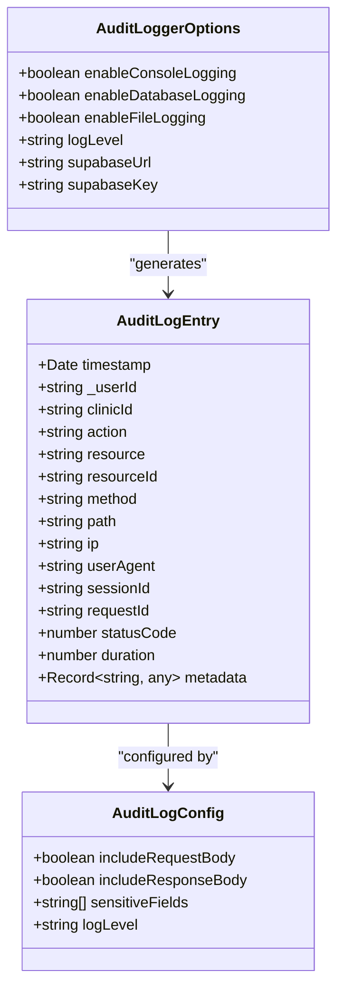
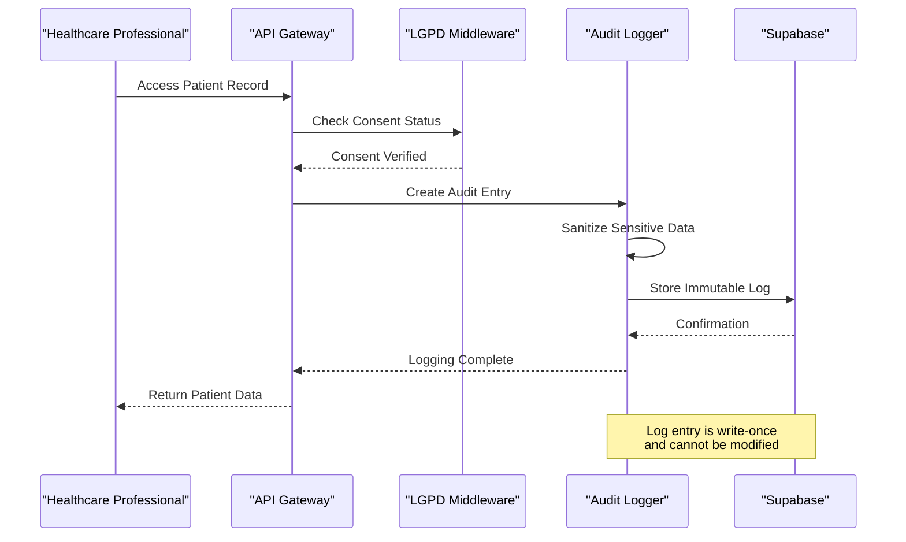
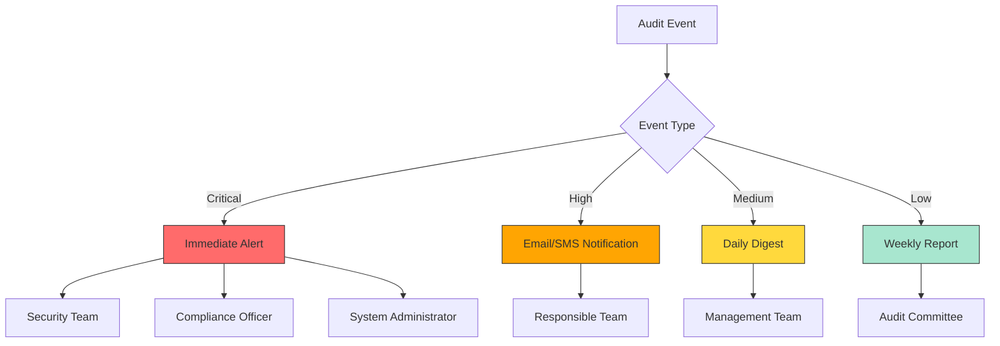

# Audit Logging Middleware

<cite>
**Referenced Files in This Document **
- [audit-log.ts](file://apps/api/src/middleware/audit-log.ts)
- [logger.ts](file://packages/security/src/audit/logger.ts)
- [lgpd-middleware.ts](file://apps/api/src/middleware/lgpd-middleware.ts)
</cite>

## Table of Contents

1. [Introduction](#introduction)
2. [Audit Log Structure](#audit-log-structure)
3. [Immutable Logging and LGPD Compliance](#immutable-logging-and-lgpd-compliance)
4. [Log Enrichment with Contextual Information](#log-enrichment-with-contextual-information)
5. [Integration with External Monitoring Systems](#integration-with-external-monitoring-systems)
6. [Performance Considerations for High-Volume Logging](#performance-considerations-for-high-volume-logging)
7. [Log Aggregation, Search, and Analysis](#log-aggregation-search-and-analysis)
8. [Audit Log Queries for Compliance and Investigation](#audit-log-queries-for-compliance-and-investigation)

## Introduction

The audit logging middleware in neonpro provides a comprehensive system for capturing all significant user actions and system events across the healthcare platform. This documentation details the architecture, implementation, and operational aspects of the audit trail system, which is designed to meet strict regulatory requirements including Brazil's LGPD (Lei Geral de Proteção de Dados). The system captures detailed information about every interaction with sensitive data, ensuring accountability, traceability, and compliance.

**Section sources**

- [audit-log.ts](file://apps/api/src/middleware/audit-log.ts#L1-L330)

## Audit Log Structure

The audit log entries follow a standardized structure that captures essential information about each event. Each log entry includes:

- **Timestamp**: Precise date and time when the action occurred
- **User ID (_userId)**: Identifier of the user who performed the action
- **Clinic ID**: Identifier of the healthcare facility associated with the action
- **Action Type**: Classification of the operation (read, create, update, delete)
- **Resource**: The type of resource affected by the action
- **Resource ID**: Specific identifier of the resource instance
- **HTTP Method**: The HTTP method used for the request
- **Path**: The API endpoint path accessed
- **IP Address**: Client IP address extracted from request headers
- **User Agent**: Browser or client application information
- **Session ID**: Current session identifier
- **Request ID**: Unique identifier for the request
- **Status Code**: HTTP response status code
- **Duration**: Processing time in milliseconds
- **Metadata**: Additional contextual information about the operation

The system automatically maps HTTP methods to semantic actions: GET requests are logged as "read", POST as "create", PUT/PATCH as "update", and DELETE as "delete". Resource identification is extracted from URL paths, with special handling for versioned APIs.

**Diagram sources **

- [audit-log.ts](file://apps/api/src/middleware/audit-log.ts#L8-L78)
- [logger.ts](file://packages/security/src/audit/logger.ts#L19-L45)

**Section sources**

- [audit-log.ts](file://apps/api/src/middleware/audit-log.ts#L8-L78)
- [logger.ts](file://packages/security/src/audit/logger.ts#L19-L45)

## Immutable Logging and LGPD Compliance

The audit logging system implements immutable logging principles to ensure the integrity and reliability of audit trails, meeting LGPD requirements for data protection and accountability. All audit logs are write-once records that cannot be modified after creation, preventing tampering and ensuring forensic accuracy.

The system enforces LGPD compliance through several mechanisms:

- Automatic redaction of sensitive fields such as CPF, RG, CNS (Cartão Nacional de Saúde), medical records, and financial information
- Consent tracking integration that verifies legitimate processing basis before allowing data access
- Data classification system that identifies sensitive healthcare information
- Retention policies aligned with Brazilian regulations

Healthcare-specific audit middleware configures enhanced sensitivity field detection, including medical terminology like diagnosis, medication, treatment, and patient_data. The system also supports different retention periods based on data category: personal data (2 years), financial data (5 years per tax requirements), and medical records (20 years per CFM Resolution 1821/2007).

**Diagram sources **

- [audit-log.ts](file://apps/api/src/middleware/audit-log.ts#L263-L330)
- [lgpd-middleware.ts](file://apps/api/src/middleware/lgpd-middleware.ts#L114-L200)

**Section sources**

- [audit-log.ts](file://apps/api/src/middleware/audit-log.ts#L263-L330)
- [lgpd-middleware.ts](file://apps/api/src/middleware/lgpd-middleware.ts#L114-L200)

## Log Enrichment with Contextual Information

The audit logging system enriches log entries with comprehensive contextual information to support security analysis and compliance auditing. Beyond basic request metadata, the system captures:

- **IP Address**: Extracted from multiple possible headers (x-forwarded-for, x-real-ip, cf-connecting-ip) to accurately identify client origin
- **User Agent**: Full browser/device information for client identification
- **Geolocation**: Derived from IP address for location-based access pattern analysis
- **Session Context**: Active session identifier and authentication state
- **Request Context**: Correlation ID for tracing requests across services
- **User Role**: Professional role and permissions level
- **Clinical Context**: For healthcare operations, includes patient ID, encounter ID, and facility information

The middleware automatically extracts and associates this contextual data with each audit entry, providing a complete picture of the operational environment during each event. This enriched context enables sophisticated anomaly detection, such as identifying access from unusual geographic locations or unexpected device types.

**Section sources**

- [audit-log.ts](file://apps/api/src/middleware/audit-log.ts#L130-L150)

## Integration with External Monitoring Systems

The audit logging infrastructure integrates seamlessly with external monitoring and alerting systems to provide real-time visibility into system activity and potential security threats. The architecture supports multiple output destinations:

- **Supabase Database**: Primary storage for audit logs with structured schema for efficient querying
- **External SIEM Systems**: Integration points for security information and event management platforms
- **Real-time Alerting**: Immediate notifications for sensitive operations
- **Compliance Dashboards**: Visualization tools for audit trail analysis

Critical operations trigger immediate alerts through multiple channels (email, SMS, pager) based on severity levels. The system monitors for patterns indicating potential security incidents, including unauthorized data access, audit tampering attempts, and large-scale data exports. These alerts are configured with appropriate notification channels based on the severity of the event.

**Diagram sources **

- [lgpd-middleware.ts](file://apps/api/src/middleware/lgpd-middleware.ts#L655-L689)
- [security-monitoring-dashboard.ts](file://apps/api/src/services/security-monitoring-dashboard.ts#L774-L822)

**Section sources**

- [lgpd-middleware.ts](file://apps/api/src/middleware/lgpd-middleware.ts#L655-L689)
- [security-monitoring-dashboard.ts](file://apps/api/src/services/security-monitoring-dashboard.ts#L774-L822)

## Performance Considerations for High-Volume Logging

The audit logging system is optimized for high-volume environments typical in healthcare applications while maintaining minimal impact on primary application performance. Key performance strategies include:

- **Asynchronous Logging**: Audit entries are written asynchronously to prevent blocking request processing
- **Batch Processing**: Logs are batched for database insertion to reduce I/O overhead
- **Selective Body Inclusion**: Request bodies are only included when necessary, with automatic redaction of sensitive fields
- **Efficient Serialization**: Metadata is safely serialized for database storage without compromising performance
- **Configurable Logging Levels**: Granular control over what gets logged based on endpoint sensitivity

The middleware minimizes performance impact by avoiding expensive operations during request processing. Sensitive data redaction uses efficient string matching algorithms, and database writes are handled through non-blocking operations. For high-frequency endpoints, the system can be configured to exclude request bodies from audit logs while still capturing essential metadata.

**Section sources**

- [audit-log.ts](file://apps/api/src/middleware/audit-log.ts#L200-L260)
- [performance/security-compliance-validator.ts](file://apps/api/src/services/performance/security-compliance-validator.ts#L304-L344)

## Log Aggregation, Search, and Analysis

The audit logging system supports comprehensive aggregation, search, and analysis capabilities to facilitate compliance reporting and incident investigation. Logs are stored in a structured format that enables efficient querying across multiple dimensions:

- **Time-based queries**: Filter logs by specific date ranges or relative time periods
- **User-centric analysis**: Track all actions performed by specific users
- **Resource-focused searches**: Identify all access to particular resources or data types
- **Pattern detection**: Identify anomalous access patterns or potential security threats
- **Compliance verification**: Validate adherence to data protection policies

The system maintains separate retention policies for different data categories, with automated processes for data lifecycle management. Medical records are retained for 20 years as required by CFM Resolution 1821/2007, financial data for 5 years per Brazilian tax code, and general personal data for 2 years. The architecture supports both immediate access for compliance audits and long-term archival for legal requirements.

**Section sources**

- [data-retention-service.ts](file://apps/api/src/services/data-retention-service.ts#L129-L173)
- [enhanced-lgpd-lifecycle.ts](file://apps/api/src/services/enhanced-lgpd-lifecycle.ts#L272-L325)

## Audit Log Queries for Compliance and Investigation

The audit logging system supports a wide range of queries for compliance reporting and incident investigation. Common query patterns include:

- **Consent Verification**: Retrieve all data access events with corresponding consent status
- **Data Portability Requests**: Aggregate all user data for export under LGPD Article 18
- **Breach Investigation**: Identify all access to compromised data following a security incident
- **Anomaly Detection**: Find unusual access patterns such as off-hours access or rapid successive operations
- **Role-Based Audits**: Review actions performed by specific user roles or permission levels

For compliance reporting, the system can generate comprehensive reports showing data access patterns, consent management activities, and retention policy enforcement. During incident investigations, security teams can reconstruct user sessions, trace data flows, and identify potential insider threats through detailed audit trail analysis.

**Section sources**

- [lgpd-data-retention-deletion.test.ts](file://apps/api/src/__tests__/compliance/lgpd-data-retention-deletion.test.ts#L41-L72)
- [lgpd-audit-trail-verification.test.ts](file://apps/api/src/__tests__/compliance/lgpd-audit-trail-verification.test.ts#L655-L689)
