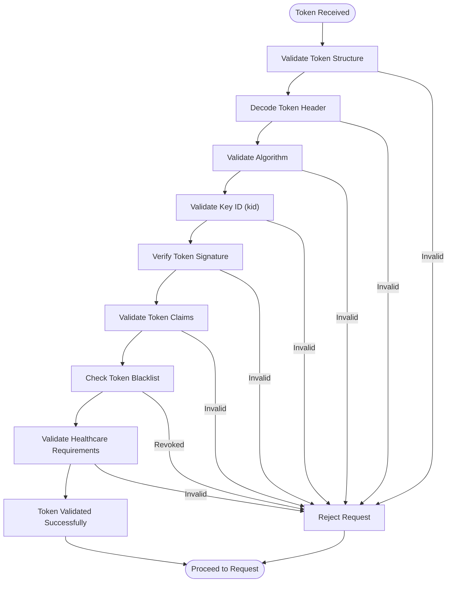
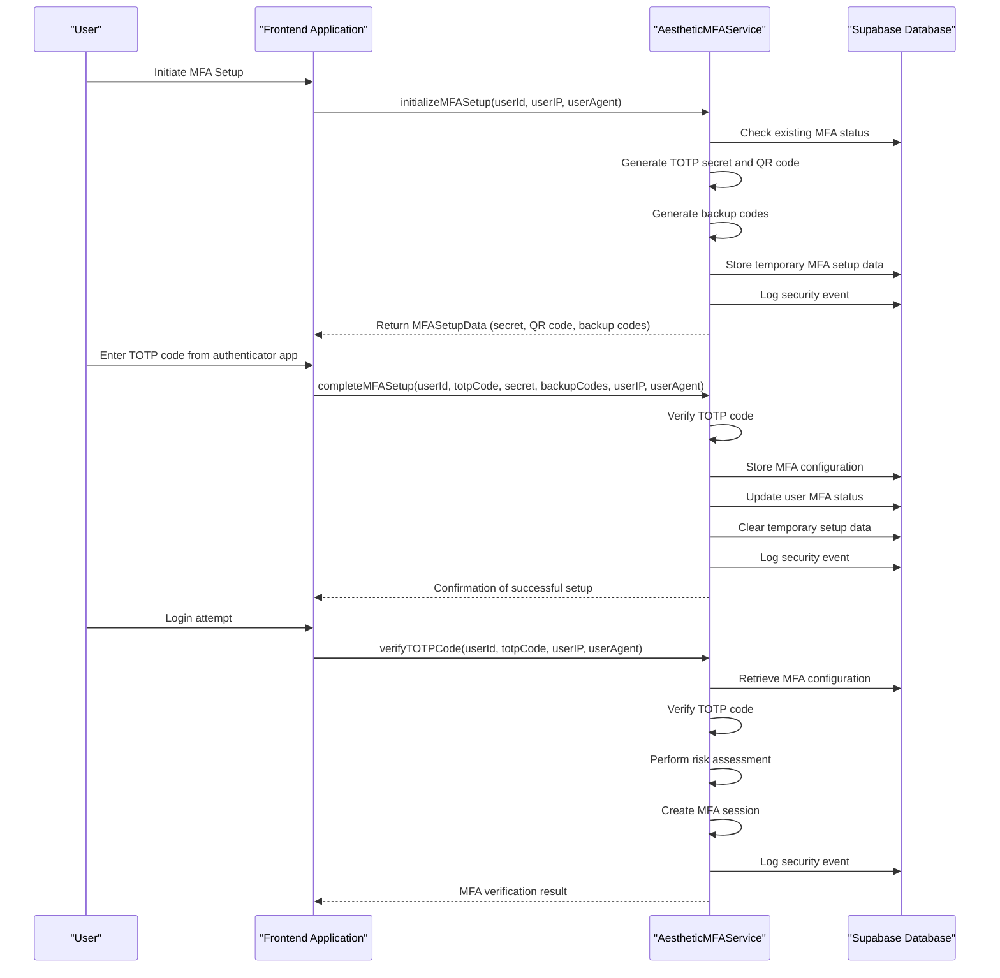
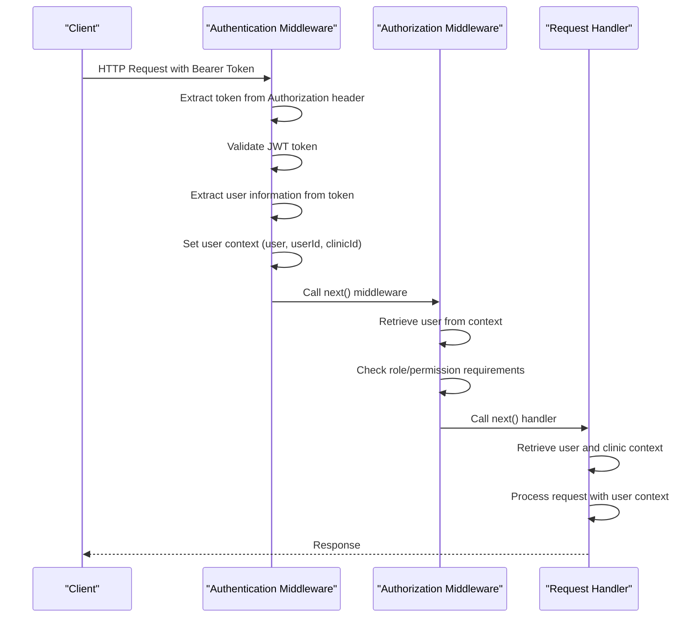
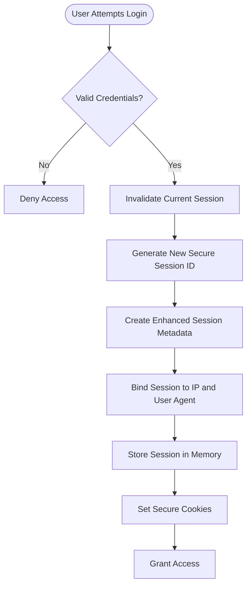
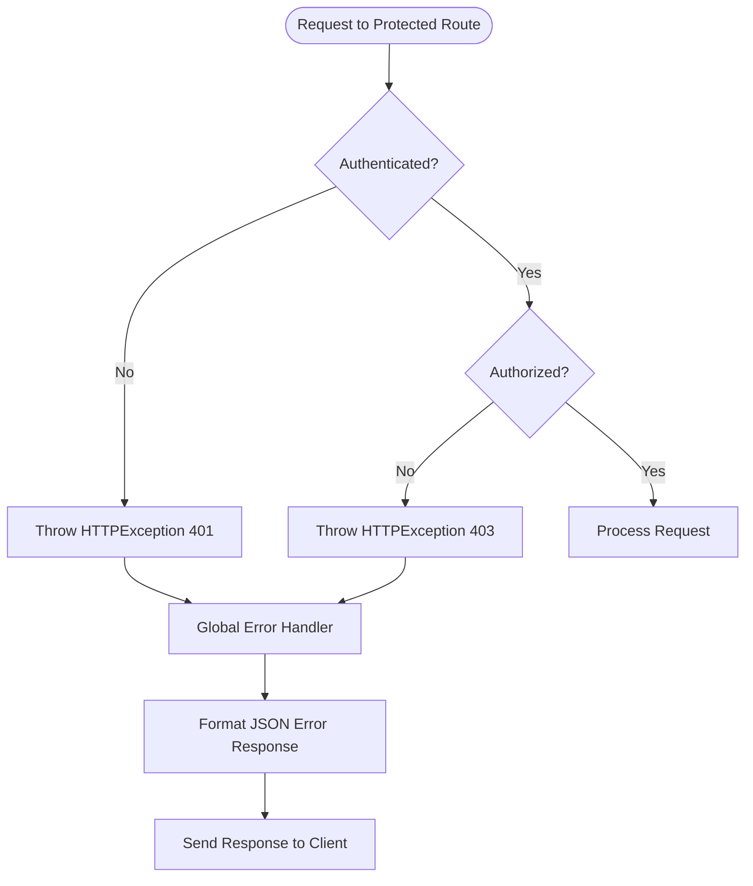

# Authentication & Authorization Middleware

<cite>
**Referenced Files in This Document**
- [auth.ts](file://apps/api/src/middleware/auth.ts)
- [agent-permissions.ts](file://apps/api/src/services/permissions/agent-permissions.ts)
- [aesthetic-mfa-service.ts](file://apps/api/src/security/aesthetic-mfa-service.ts)
- [jwt-validator.ts](file://apps/api/src/security/jwt-validator.ts)
- [supabase.ts](file://apps/api/src/clients/supabase.ts)
- [authn.ts](file://apps/api/src/middleware/authn.ts)
- [enhanced-session-manager.ts](file://apps/api/src/security/enhanced-session-manager.ts)
- [session-cookie-utils.ts](file://apps/api/src/security/session-cookie-utils.ts)
</cite>

## Table of Contents

1. [Introduction](#introduction)
2. [JWT-Based Authentication Flow](#jwt-based-authentication-flow)
3. [Role-Based Access Control System](#role-based-access-control-system)
4. [Supabase Integration and Session Management](#supabase-integration-and-session-management)
5. [Multi-Factor Authentication Support](#multi-factor-authentication-support)
6. [Authentication Context Propagation](#authentication-context-propagation)
7. [Security Considerations](#security-considerations)
8. [Protected Route Implementation Examples](#protected-route-implementation-examples)
9. [Error Handling for Unauthorized Requests](#error-handling-for-unauthorized-requests)

## Introduction

The authentication and authorization middleware in neonpro provides a comprehensive security framework for protecting API endpoints and ensuring proper access control. The system implements JWT-based authentication with Supabase integration, role-based access control, multi-factor authentication support, and advanced session management. This document details the implementation of these security features, focusing on how they work together to provide robust protection for healthcare data and sensitive operations.

**Section sources**

- [auth.ts](file://apps/api/src/middleware/auth.ts#L1-L283)
- [authn.ts](file://apps/api/src/middleware/authn.ts#L1-L307)

## JWT-Based Authentication Flow

### Token Validation Process

The JWT validation process in neonpro follows a comprehensive security approach that includes multiple layers of validation to prevent common attacks such as token tampering, replay attacks, and algorithm confusion. The `JWTSecurityValidator` class in `jwt-validator.ts` implements this multi-step validation process:



**Diagram sources**

- [jwt-validator.ts](file://apps/api/src/security/jwt-validator.ts#L1-L712)

**Section sources**

- [jwt-validator.ts](file://apps/api/src/security/jwt-validator.ts#L1-L712)
- [authn.ts](file://apps/api/src/middleware/authn.ts#L1-L307)

### Expiration Handling and Refresh Mechanisms

The JWT validation system implements strict expiration handling to ensure tokens are not used beyond their intended lifetime. The validator checks both the token's expiration claim (`exp`) and enforces a maximum allowable expiration time to prevent excessively long-lived tokens. The configuration allows a maximum token lifetime of 24 hours, which helps mitigate the risk of token compromise.

When a token is nearing expiration, the system can be configured to issue refresh tokens through the Supabase authentication integration. The refresh mechanism follows the OAuth 2.0 standard, where a refresh token is exchanged for a new access token without requiring the user to re-authenticate. This process maintains security while providing a seamless user experience.

The rate limiting feature prevents brute force attacks on the authentication endpoint by limiting the number of authentication attempts from a single IP address or session within a specified time window (60 seconds by default). This protects against credential stuffing and password spraying attacks.

## Role-Based Access Control System

### Agent Permissions Implementation

The role-based access control system is implemented in the `AgentPermissionService` class located in `agent-permissions.ts`. This service provides fine-grained permission checking for AI agent data access with LGPD compliance and healthcare security requirements.

```mermaid
classDiagram
class AgentPermissionService {
+checkPermission(context : PermissionContext) : Promise~PermissionResult~
+getUserRoles(userId : string) : Promise~UserRole[]~
+clearCache(userId : string) : void
+clearAllCaches() : void
+getUserPermissions(userId : string) : Promise~{roles : UserRole[], effectivePermissions : string[]}~
+hasLgpdConsent(userId : string, consentType : 'data_processing' | 'ai_interaction' | 'data_retention') : Promise~boolean~
+validateSessionAccess(sessionId : string, userId : string) : Promise~{valid : boolean, session? : any, reason? : string}~
}
class UserRole {
+id : string
+_role : 'admin' | 'clinic_admin' | 'professional' | 'staff' | 'patient'
+clinicId? : string
+permissions : string[]
+scopes : string[]
}
class PermissionContext {
+_userId : string
+sessionId? : string
+patientId? : string
+action : 'read' | 'write' | 'delete' | 'admin'
+resource : 'agent_sessions' | 'agent_messages' | 'agent_context' | 'agent_audit' | 'patient_data' | 'financial_data'
+metadata? : Record~string, any~
}
class PermissionResult {
+granted : boolean
+reason? : string
+conditions? : Record~string, any~
+auditLog? : { action : string; resource : string; _userId : string; details : Record~string, any~ }
}
AgentPermissionService --> UserRole : "uses"
AgentPermissionService --> PermissionContext : "accepts"
AgentPermissionService --> PermissionResult : "returns"
```

**Diagram sources**

- [agent-permissions.ts](file://apps/api/src/services/permissions/agent-permissions.ts#L1-L1021)

**Section sources**

- [agent-permissions.ts](file://apps/api/src/services/permissions/agent-permissions.ts#L1-L1021)

### Permission Hierarchy and Role Types

The system implements a hierarchical permission model with five distinct roles, each with specific access rights:

1. **Admin**: Full access to all resources across the entire system
2. **Clinic Admin**: Clinic-wide access to all patients and staff within their clinic
3. **Professional**: Access limited to assigned patients only
4. **Staff**: Limited access with read-only privileges for most data types
5. **Patient**: Access restricted to their own data only

Each role has specific permission logic that determines what actions they can perform on different resources. For example, professionals can access patient data only if they have an active assignment with that patient, while staff members cannot access financial data at all.

The permission system also supports LGPD (Brazilian General Data Protection Law) compliance by checking for explicit user consent before allowing certain data processing operations. The `hasLgpdConsent` method verifies whether a user has granted consent for specific types of data processing, such as AI interaction or data retention.

## Supabase Integration and Session Management

### Supabase Client Architecture

The Supabase integration is implemented through a three-tier client architecture that provides different levels of access for various use cases:

```mermaid
classDiagram
class createAdminClient {
+validateConnection() : Promise~boolean~
+handleConnectionError(error : any) : Promise~void~
+exportUserData(userId : string) : Promise~any~
+deleteUserData(userId : string, options? : { cascadeDelete? : boolean }) : Promise~void~
}
class createServerClient {
+session : any
}
class createUserClient {
+signInWithPassword(credentials : { email : string; password : string }) : Promise~any~
}
class healthcareRLS {
+canAccessClinic(userId : string, clinicId : string) : Promise~boolean~
+canAccessPatient(userId : string, patientId : string) : Promise~boolean~
}
class RLSQueryBuilder {
+buildPatientQuery(baseQuery : any) : any
+buildClinicQuery(baseQuery : any) : any
}
createAdminClient --> healthcareRLS : "includes"
createServerClient --> healthcareRLS : "includes"
createUserClient --> healthcareRLS : "includes"
createAdminClient --> RLSQueryBuilder : "uses"
createServerClient --> RLSQueryBuilder : "uses"
```

**Diagram sources**

- [supabase.ts](file://apps/api/src/clients/supabase.ts#L1-L490)

**Section sources**

- [supabase.ts](file://apps/api/src/clients/supabase.ts#L1-L490)

### Row Level Security Implementation

The Supabase integration implements comprehensive Row Level Security (RLS) policies to ensure data isolation between clinics and appropriate access controls for healthcare professionals. The `healthcareRLS` helper functions validate whether a user can access specific clinic or patient data based on their membership and role permissions.

The RLS system automatically applies clinic and patient access filters to database queries, preventing unauthorized access to sensitive healthcare data. This implementation ensures compliance with Brazilian healthcare regulations and protects patient privacy by enforcing strict data access controls.

## Multi-Factor Authentication Support

### MFA Service Architecture

The multi-factor authentication system is implemented in the `AestheticMFAService` class located in `aesthetic-mfa-service.ts`. This service provides TOTP-based multi-factor authentication with backup code generation and validation.



**Diagram sources**

- [aesthetic-mfa-service.ts](file://apps/api/src/security/aesthetic-mfa-service.ts#L1-L845)

**Section sources**

- [aesthetic-mfa-service.ts](file://apps/api/src/security/aesthetic-mfa-service.ts#L1-L845)

### MFA Enforcement Policy

The MFA system implements a configurable enforcement policy that determines when multi-factor authentication is required. The policy can be configured to enforce MFA for specific roles (admin, professional, clinic_manager), sensitive operations (patient data access, financial transactions, medical records), and new users. The system also supports a grace period of 72 hours during which users can access the system without MFA before it becomes mandatory.

The MFA service includes risk assessment capabilities that evaluate the security context of each authentication attempt. Factors such as suspicious IP addresses, unusual user agents, geolocation anomalies, and time-based anomalies are considered when determining the risk level of a login attempt. Based on the risk assessment, the system may require additional verification steps or temporarily block access.

## Authentication Context Propagation

### Request Lifecycle Integration

The authentication context is propagated through the request lifecycle using Hono.js context objects, which allow middleware to set and retrieve values that are accessible to downstream handlers. When a user is successfully authenticated, their information is stored in the context using the `c.set()` method.



**Diagram sources**

- [auth.ts](file://apps/api/src/middleware/auth.ts#L1-L283)
- [authn.ts](file://apps/api/src/middleware/authn.ts#L1-L307)

**Section sources**

- [auth.ts](file://apps/api/src/middleware/auth.ts#L1-L283)
- [authn.ts](file://apps/api/src/middleware/authn.ts#L1-L307)

### Context Availability in Downstream Handlers

Once the authentication context is established, it remains available throughout the request lifecycle and can be accessed by any downstream middleware or route handlers. The context includes the authenticated user object, user ID, and clinic ID, which are essential for implementing business logic that depends on the user's identity and permissions.

Route handlers can retrieve the authentication context using the `c.get()` method, allowing them to personalize responses, filter data based on user permissions, and log audit trails with user information. This propagation mechanism ensures that authentication state is consistently available without requiring repeated token validation.

## Security Considerations

### Token Storage and Transmission

The system implements secure token storage and transmission practices to protect authentication credentials. JWT tokens are transmitted over HTTPS only in production environments, with the `enforceHttpsInProduction` configuration option preventing token transmission over unencrypted connections.

For session management, the system uses secure cookies with appropriate flags:

- **HttpOnly**: Prevents client-side JavaScript access to session cookies
- **Secure**: Ensures cookies are only transmitted over HTTPS
- **SameSite**: Protects against CSRF attacks by controlling when cookies are sent with cross-site requests

The `SessionCookieUtils` class provides utilities for generating and validating secure session cookies with integrity signatures to prevent tampering.

### CSRF Protection

Cross-Site Request Forgery (CSRF) protection is implemented through a combination of secure cookie attributes and anti-CSRF tokens. The system generates a CSRF token for each session and stores it in a separate cookie that is accessible to JavaScript. When processing state-changing requests (POST, PUT, DELETE), the server validates that the CSRF token in the request header matches the one stored in the cookie.

This defense-in-depth approach combines multiple CSRF protection mechanisms:

1. SameSite cookie attribute to prevent automatic cookie inclusion in cross-site requests
2. Anti-CSRF tokens that must be explicitly included in requests
3. Secure cookie attributes to prevent cookie theft

### Session Fixation Prevention

The enhanced session manager implements several measures to prevent session fixation attacks:

- Session ID regeneration upon authentication
- Cryptographically secure session ID generation with high entropy
- Session binding to IP address and user agent
- Automatic cleanup of expired sessions

The `regenerateSessionOnAuth` configuration option ensures that a new session ID is generated when a user authenticates, preventing attackers from fixing a user's session to a known identifier.



**Diagram sources**

- [enhanced-session-manager.ts](file://apps/api/src/security/enhanced-session-manager.ts#L1-L799)
- [session-cookie-utils.ts](file://apps/api/src/security/session-cookie-utils.ts#L1-L406)

**Section sources**

- [enhanced-session-manager.ts](file://apps/api/src/security/enhanced-session-manager.ts#L1-L799)
- [session-cookie-utils.ts](file://apps/api/src/security/session-cookie-utils.ts#L1-L406)

## Protected Route Implementation Examples

### Basic Authentication Example

To implement a protected route that requires authentication, use the `requireAuth` middleware:

```typescript
import { requireAuth } from './middleware/auth';

app.get('/api/protected', requireAuth(), async c => {
  const user = c.get('user');
  return c.json({ message: `Hello ${user.name}`, userId: user.id });
});
```

### Role-Based Access Control Example

For routes that require specific roles, pass the allowed roles to the `requireAuth` middleware:

```typescript
import { requireAuth } from './middleware/auth';

// Only admins and clinic admins can access this route
app.get('/api/admin-data', requireAuth(['admin', 'clinic_admin']), async c => {
  // Implementation here
});

// Only professionals can access patient data
app.get('/api/patients/:id', requireAuth(['professional', 'admin']), async c => {
  const patientId = c.req.param('id');
  const user = c.get('user');

  // Additional authorization check for patient access
  if (!await canAccessPatient(user.id, patientId)) {
    throw new HTTPException(403, { message: 'Access denied to patient data' });
  }

  // Implementation here
});
```

### Permission-Based Access Example

For fine-grained permission control, use the `AgentPermissionService` directly:

```typescript
import { AgentPermissionService } from './services/permissions/agent-permissions';

const permissionService = new AgentPermissionService(
  process.env.SUPABASE_URL!,
  process.env.SUPABASE_SERVICE_ROLE_KEY!,
);

app.post('/api/agent-sessions', requireAuth(), async c => {
  const user = c.get('user');
  const sessionId = generateSessionId();

  // Check if user has permission to create agent sessions
  const permissionResult = await permissionService.checkPermission({
    _userId: user.id,
    action: 'write',
    resource: 'agent_sessions',
    metadata: { sessionId },
  });

  if (!permissionResult.granted) {
    throw new HTTPException(403, {
      message: permissionResult.reason || 'Insufficient permissions',
    });
  }

  // Implementation here
});
```

**Section sources**

- [auth.ts](file://apps/api/src/middleware/auth.ts#L1-L283)
- [agent-permissions.ts](file://apps/api/src/services/permissions/agent-permissions.ts#L1-L1021)

## Error Handling for Unauthorized Requests

### Unauthorized and Forbidden Responses

The authentication and authorization middleware throws `HTTPException` instances with appropriate status codes when access is denied. These exceptions are caught by the global error handler middleware, which formats consistent error responses:



**Diagram sources**

- [auth.ts](file://apps/api/src/middleware/auth.ts#L1-L283)
- [error-handler.ts](file://apps/api/src/middleware/error-handler.ts#L1-L47)

**Section sources**

- [auth.ts](file://apps/api/src/middleware/auth.ts#L1-L283)
- [error-handler.ts](file://apps/api/src/middleware/error-handler.ts#L1-L47)

### Standardized Error Format

Unauthorized and forbidden requests receive standardized JSON error responses:

```json
{
  "error": {
    "message": "Authentication required",
    "status": 401
  }
}
```

or

```json
{
  "error": {
    "message": "Insufficient permissions",
    "status": 403
  }
}
```

The global error handler in `error-handler.ts` ensures that all errors are properly logged and formatted consistently, providing clear feedback to clients while maintaining security by not exposing sensitive information about the authentication system's internal workings.
