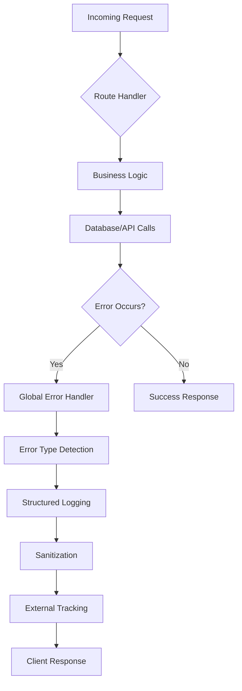
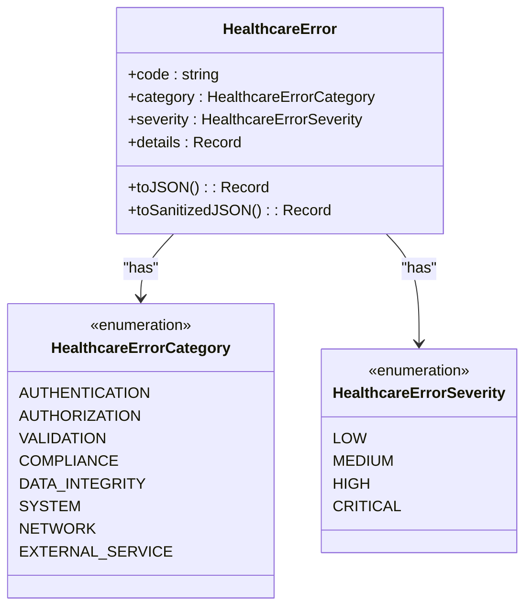
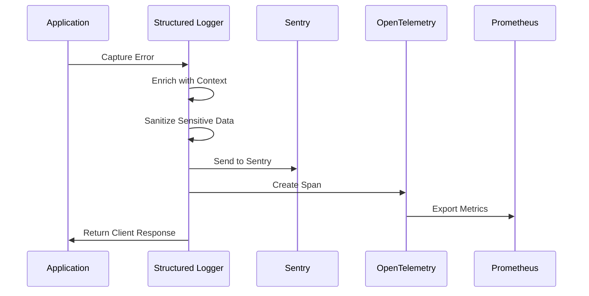
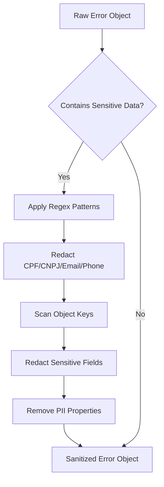
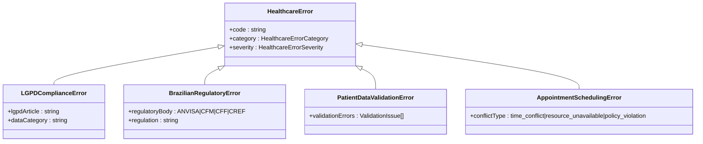

# Error Tracking & Handling Middleware

<cite>
**Referenced Files in This Document**
- [error-handler.ts](file://apps/api/src/middleware/error-handler.ts)
- [error-sanitization.ts](file://apps/api/src/middleware/error-sanitization.ts)
- [http-error-handling.ts](file://apps/api/src/middleware/http-error-handling.ts)
- [error-tracking.ts](file://apps/api/src/middleware/error-tracking.ts)
- [error-tracking.ts](file://apps/api/src/config/error-tracking.ts)
- [healthcare-errors.ts](file://apps/api/src/utils/healthcare-errors.ts)
</cite>

## Table of Contents
1. [Introduction](#introduction)
2. [Centralized Error Handling Mechanism](#centralized-error-handling-mechanism)
3. [Error Classification and HTTP Status Mapping](#error-classification-and-http-status-mapping)
4. [External Error Tracking Integration](#external-error-tracking-integration)
5. [Structured Logging and Context Enrichment](#structured-logging-and-context-enrichment)
6. [Sensitive Data Redaction and Sanitization](#sensitive-data-redaction-and-sanitization)
7. [Distributed Error Correlation with Trace IDs](#distributed-error-correlation-with-trace-ids)
8. [Custom Healthcare Error Types](#custom-healthcare-error-types)
9. [Error Handling Patterns Across Codebase](#error-handling-patterns-across-codebase)
10. [Conclusion](#conclusion)

## Introduction
The NeonPro platform implements a comprehensive error tracking and handling system designed specifically for healthcare applications with strict compliance requirements. The middleware architecture provides centralized exception interception, consistent error response formatting, and robust integration with monitoring services while ensuring patient data protection under LGPD regulations. This document details the implementation of the error handling pipeline, from initial detection through to external reporting and alerting.

## Centralized Error Handling Mechanism
The error handling system in NeonPro is built around a layered middleware approach that intercepts exceptions at multiple levels of the application stack. The primary entry point is the `errorHandler` middleware which wraps all API routes, catching unhandled exceptions and converting them into standardized JSON responses. This middleware works in conjunction with `httpErrorHandlingMiddleware` which provides more granular handling of different error types including validation, database, authentication, and network errors.

The system uses Hono's native `HTTPException` class as a foundation but extends it with healthcare-specific error handling logic. When an error occurs, the middleware captures essential context including request path, method, user agent, IP address, and request ID before processing. The error is then logged with full stack trace information and converted into a sanitized response format that maintains consistency across all API endpoints.

**Diagram sources**
- [error-handler.ts](file://apps/api/src/middleware/error-handler.ts#L1-L47)
- [http-error-handling.ts](file://apps/api/src/middleware/http-error-handling.ts#L1-L255)

**Section sources**
- [error-handler.ts](file://apps/api/src/middleware/error-handler.ts#L1-L47)
- [http-error-handling.ts](file://apps/api/src/middleware/http-error-handling.ts#L1-L255)

## Error Classification and HTTP Status Mapping
NeonPro implements a comprehensive error classification system based on healthcare-specific categories and severity levels. Errors are categorized into distinct domains including authentication, authorization, validation, compliance, data integrity, system, network, and external service failures. Each category maps to appropriate HTTP status codes following REST conventions:

**Diagram sources**
- [healthcare-errors.ts](file://apps/api/src/utils/healthcare-errors.ts#L54-L142)
- [http-error-handling.ts](file://apps/api/src/middleware/http-error-handling.ts#L150-L250)

**Section sources**
- [healthcare-errors.ts](file://apps/api/src/utils/healthcare-errors.ts#L1-L651)
- [http-error-handling.ts](file://apps/api/src/middleware/http-error-handling.ts#L1-L255)

The system automatically maps error categories to appropriate HTTP status codes:
- Authentication errors → 401 Unauthorized
- Authorization/compliance errors → 403 Forbidden  
- Validation errors → 400 Bad Request
- Data integrity errors → 422 Unprocessable Entity
- System errors → 500 Internal Server Error
- Network errors → 502 Bad Gateway
- External service errors → 503 Service Unavailable

This mapping ensures clients receive meaningful status codes that reflect the nature of the error while maintaining API consistency.

## External Error Tracking Integration
The error tracking system integrates with external monitoring services through the `error-tracking.ts` configuration file, which sets up both Sentry and OpenTelemetry instrumentation. The initialization process configures these services with healthcare-specific settings to ensure compliance with Brazilian data protection regulations (LGPD).

Sentry integration includes beforeSend hooks that strip sensitive healthcare data such as patient identifiers, CPF numbers, and health records before transmission. The configuration also disables PII collection and filters breadcrumbs containing sensitive information. Sampling rates are adjusted based on environment, with higher sampling in development and reduced sampling in production to manage costs.

OpenTelemetry is configured with auto-instrumentations for key Node.js modules while disabling those that might capture sensitive filesystem or network data. The HTTP instrumentation includes request and response hooks that remove sensitive headers like authorization tokens and cookies from traces. The resource configuration includes healthcare-specific attributes such as compliance status and regional information.

**Diagram sources**
- [error-tracking.ts](file://apps/api/src/config/error-tracking.ts#L1-L288)
- [error-tracking.ts](file://apps/api/src/middleware/error-tracking.ts#L1-L114)

**Section sources**
- [error-tracking.ts](file://apps/api/src/config/error-tracking.ts#L1-L288)

## Structured Logging and Context Enrichment
The error logging system captures comprehensive context for every error occurrence, enabling effective troubleshooting and audit trails. Each log entry includes standard metadata such as timestamp, request path, HTTP method, and client information. Additionally, healthcare-specific context is captured when available, including clinic ID, user ID, patient ID, and resource identifiers.

The `HealthcareLogger` class provides specialized logging capabilities for healthcare operations, automatically creating audit trail entries in the database when a Prisma client is available. These audit logs capture error details including code, category, severity, message, and structured details while respecting privacy constraints.

Log entries are structured as JSON objects with consistent field naming, making them easily parseable by log aggregation systems. The system captures full stack traces for debugging purposes while providing sanitized versions for external systems. Performance metrics such as operation duration can also be included in success logs for monitoring system health.

**Section sources**
- [healthcare-errors.ts](file://apps/api/src/utils/healthcare-errors.ts#L54-L142)
- [error-handler.ts](file://apps/api/src/middleware/error-handler.ts#L1-L47)

## Sensitive Data Redaction and Sanitization
Data protection is a critical aspect of the error handling system, with multiple layers of sanitization to prevent leakage of personally identifiable information (PII) and protected health information (PHI). The `errorSanitizationMiddleware` implements pattern-based redaction of sensitive fields in error messages and stack traces.

A comprehensive set of regular expressions targets Brazilian-specific sensitive data patterns including:
- CPF (individual taxpayer registry) and CNPJ (corporate taxpayer registry) numbers
- CNS (National Health Card) numbers
- RG (Registro Geral) identification numbers
- Email addresses and phone numbers in Brazilian formats
- Medical record numbers and treatment information
- Financial data including credit card numbers and bank account details

The sanitization process operates at multiple levels:
1. String-level redaction using regex patterns for common sensitive data formats
2. Object-level sanitization that recursively processes nested structures
3. Field-name-based redaction when keys match sensitive patterns
4. Post-processing cleanup of common data representations

The `toSanitizedJSON()` method on `HealthcareError` removes PII fields entirely from the serialized representation while replacing sensitive values in the details object with '[SANITIZED]' placeholders.

**Diagram sources**
- [error-sanitization.ts](file://apps/api/src/middleware/error-sanitization.ts#L1-L148)
- [healthcare-errors.ts](file://apps/api/src/utils/healthcare-errors.ts#L100-L142)

**Section sources**
- [error-sanitization.ts](file://apps/api/src/middleware/error-sanitization.ts#L1-L148)

## Distributed Error Correlation with Trace IDs
To enable effective troubleshooting across distributed services, the error tracking system implements comprehensive request tracing using correlation IDs. Each incoming request is assigned a unique request ID (x-request-id) that propagates through all service calls and database operations.

The `extractHealthcareContext` function captures this request ID along with other contextual information, ensuring it appears in all error logs and monitoring events. This allows engineers to trace an error's path through the entire system by searching for the correlation ID across log streams and monitoring dashboards.

Trace IDs are included in all outbound HTTP requests via the x-trace-id header, enabling cross-service correlation. The OpenTelemetry instrumentation automatically propagates these context headers between services. In the event of an error, the full trace context—including parent span IDs and trace flags—is preserved in the error record, allowing reconstruction of the complete request flow.

**Section sources**
- [error-tracking.ts](file://apps/api/src/config/error-tracking.ts#L200-L250)
- [http-error-handling.ts](file://apps/api/src/middleware/http-error-handling.ts#L50-L100)

## Custom Healthcare Error Types
NeonPro provides a rich hierarchy of custom error types tailored to healthcare scenarios, extending the base `HealthcareError` class. These specialized error classes encapsulate domain-specific information and provide appropriate categorization and severity levels.

Key custom error types include:
- `HealthcareAuthenticationError`: For failed login attempts and token validation issues
- `HealthcareAuthorizationError`: When users lack permissions for specific resources
- `LGPDComplianceError`: Violations of Brazilian data protection regulations
- `BrazilianRegulatoryError`: Issues related to ANVISA, CFM, or other regulatory bodies
- `PatientDataValidationError`: Failed validation of patient demographic or clinical data
- `AppointmentSchedulingError`: Conflicts or policy violations in appointment booking
- `HealthcareDataIntegrityError`: Database constraint violations affecting medical records
- `ExternalHealthcareServiceError`: Failures when integrating with insurance or lab systems

Each error type includes additional properties relevant to its domain, such as regulatory article numbers for compliance errors or conflict types for scheduling issues. The constructor parameters guide proper error creation with appropriate defaults for category and severity.

**Diagram sources**
- [healthcare-errors.ts](file://apps/api/src/utils/healthcare-errors.ts#L150-L450)

**Section sources**
- [healthcare-errors.ts](file://apps/api/src/utils/healthcare-errors.ts#L1-L651)

## Error Handling Patterns Across Codebase
The recommended error handling pattern throughout the NeonPro codebase follows a consistent approach that balances developer convenience with system reliability and compliance requirements. Services and business logic components should throw domain-specific healthcare errors rather than generic JavaScript errors.

The `HealthcareErrorHandler` singleton provides utility methods for handling errors consistently across the application. When catching errors from external systems or legacy code, developers should wrap them in appropriate healthcare error types using the error handler's conversion capabilities.

For API routes, controllers should focus on business logic and allow errors to propagate to the global error handling middleware rather than implementing local error handling. This ensures consistent response formats and proper logging across all endpoints. When immediate error handling is necessary, the `createErrorResponse` method generates properly formatted responses that match the global error schema.

Asynchronous operations should always include error boundaries, particularly for database calls and external service integrations. The use of try-catch blocks with proper error transformation ensures that promise rejections are handled appropriately and don't result in unhandled rejection warnings.

**Section sources**
- [healthcare-errors.ts](file://apps/api/src/utils/healthcare-errors.ts#L500-L651)
- [error-handler.ts](file://apps/api/src/middleware/error-handler.ts#L1-L47)

## Conclusion
The error tracking and handling middleware in NeonPro provides a robust, compliant foundation for managing exceptions in a healthcare environment. By combining centralized error interception, healthcare-specific error classification, comprehensive monitoring integration, and rigorous data protection measures, the system ensures reliable operation while meeting stringent regulatory requirements.

The layered architecture allows for flexible error handling patterns while maintaining consistency in client responses and logging output. The extensive customization for Brazilian healthcare regulations demonstrates the platform's commitment to operating effectively within specific legal and cultural contexts.

Future enhancements could include more sophisticated alerting rules based on error patterns, enhanced correlation between related errors, and improved visualization of error trends across the system. The current implementation provides a solid foundation for these advancements while already delivering enterprise-grade reliability and compliance.