# Middleware Pipeline

<cite>
**Referenced Files in This Document**   
- [app.ts](file://apps/api/src/app.ts)
- [security-headers.ts](file://apps/api/src/middleware/security-headers.ts)
- [rate-limiting.ts](file://apps/api/src/middleware/rate-limiting.ts)
- [authn.ts](file://apps/api/src/middleware/authn.ts)
- [audit-log.ts](file://apps/api/src/middleware/audit-log.ts)
- [error-tracking.ts](file://apps/api/src/middleware/error-tracking.ts)
- [performance-middleware.ts](file://apps/api/src/middleware/performance-middleware.ts)
- [query-timeout-middleware.ts](file://apps/api/src/middleware/query-timeout-middleware.ts)
- [compression-middleware.ts](file://apps/api/src/middleware/compression-middleware.ts)
- [aesthetic-clinic-middleware.ts](file://apps/api/src/middleware/aesthetic-clinic-middleware.ts)
- [https-monitoring-middleware.ts](file://apps/api/src/middleware/https-monitoring-middleware.ts)
- [lgpd-middleware.ts](file://apps/api/src/middleware/lgpd-middleware.ts)
</cite>

## Table of Contents
1. [Introduction](#introduction)
2. [Middleware Execution Order](#middleware-execution-order)
3. [Security Headers Injection](#security-headers-injection)
4. [Rate Limiting Strategy](#rate-limiting-strategy)
5. [Authentication and Validation](#authentication-and-validation)
6. [Audit Logging System](#audit-logging-system)
7. [Error Tracking and Interception](#error-tracking-and-interception)
8. [Performance Monitoring](#performance-monitoring)
9. [Query Timeout Enforcement](#query-timeout-enforcement)
10. [Response Compression](#response-compression)
11. [Custom Middleware Examples](#custom-middleware-examples)
12. [LGPD Compliance Checks](#lgpd-compliance-checks)
13. [HTTPS Monitoring](#https-monitoring)
14. [Context Propagation](#context-propagation)
15. [Middleware Composition Strategies](#middleware-composition-strategies)

## Introduction
The NeonPro API implements a comprehensive middleware pipeline architecture based on the chain-of-responsibility pattern, where HTTP requests pass through multiple layers of processing before reaching their final handlers. This document details the complete middleware stack implemented in `app.ts`, explaining how each component contributes to security, performance, compliance, and observability across all API endpoints.

The middleware pipeline ensures that every request is systematically processed for security validation, rate limiting, authentication, audit logging, error handling, and performance monitoring. Each middleware layer has the ability to terminate the request early when necessary (e.g., unauthorized access or rate limit exceeded), preventing further processing while ensuring appropriate responses are returned to clients.

This architecture enables cross-cutting concerns to be handled consistently across all endpoints without duplicating logic in individual route handlers, promoting maintainability and reducing the risk of security or compliance oversights.

**Section sources**
- [app.ts](file://apps/api/src/app.ts#L72-L150)

## Middleware Execution Order
The middleware pipeline in NeonPro follows a specific execution order designed to handle foundational concerns first, followed by security, business logic, and finally error handling. The sequence ensures that requests are properly validated and secured before reaching application-specific handlers.

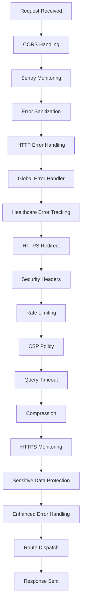

**Diagram sources **
- [app.ts](file://apps/api/src/app.ts#L152-L315)

The execution begins with CORS configuration to control cross-origin requests, followed by Sentry integration for error tracking and performance monitoring. Security measures are then applied in sequence: HTTPS redirection, security headers injection, rate limiting, and Content Security Policy enforcement. Performance-related middleware such as query timeout and compression are applied before the request reaches its designated route handler.

Each middleware operates on the Hono context object, which propagates through the chain, allowing subsequent middleware and route handlers to access information set by previous layers (such as authenticated user data or request timing).

## Security Headers Injection
The security headers middleware injects critical HTTP security headers to protect against common web vulnerabilities and ensure healthcare compliance. Implemented through `healthcareSecurityHeadersMiddleware` in `security-headers.ts`, this component applies a comprehensive set of security directives to all responses.

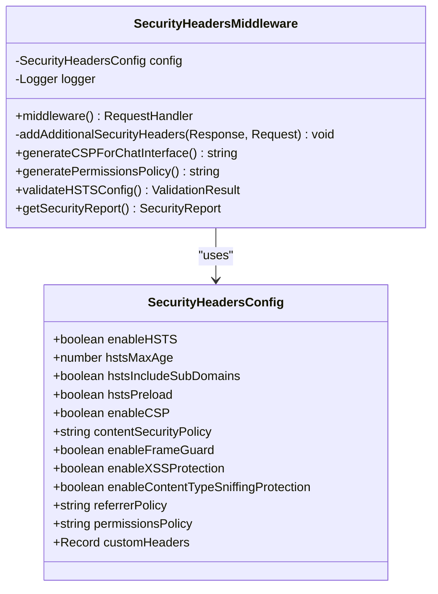

**Diagram sources **
- [security-headers.ts](file://apps/api/src/middleware/security-headers.ts#L15-L100)

The middleware enforces HTTP Strict Transport Security (HSTS) with a one-year max-age, includeSubDomains, and preload directives. It implements a strict Content Security Policy (CSP) that restricts script sources to self, unsafe-inline, and unsafe-eval while blocking framing of the application. Additional protections include X-Frame-Options (DENY), X-Content-Type-Options (nosniff), and X-XSS-Protection (1; mode=block).

The configuration is healthcare-specific, including custom headers like `X-Healthcare-API` and `X-LGPD-Compliant` to indicate compliance status. The middleware also dynamically adjusts headers based on request characteristics, applying stricter caching controls for API endpoints and additional anti-clickjacking protection for administrative routes.

**Section sources**
- [security-headers.ts](file://apps/api/src/middleware/security-headers.ts#L15-L382)
- [app.ts](file://apps/api/src/app.ts#L247-L250)

## Rate Limiting Strategy
NeonPro implements a sophisticated rate limiting strategy through `rateLimitMiddleware` that applies different limits based on endpoint sensitivity and function. This approach provides granular control over API usage while maintaining usability for legitimate clients.

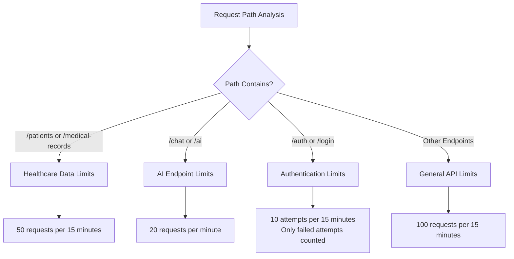

**Diagram sources **
- [rate-limiting.ts](file://apps/api/src/middleware/rate-limiting.ts#L150-L215)

The implementation uses an in-memory store with automatic cleanup to track request counts per client IP address. Different endpoint categories receive tailored rate limits:

- **Healthcare data endpoints** (`/patients`, `/medical-records`) are most restrictive with 50 requests per 15 minutes
- **AI/Chat endpoints** have moderate limits of 20 requests per minute
- **Authentication endpoints** enforce strict limits of 10 attempts per 15 minutes, counting only failed attempts
- **General API endpoints** allow 100 requests per 15 minutes

The middleware sets standard rate limit headers (`X-RateLimit-Limit`, `X-RateLimit-Remaining`, `X-RateLimit-Reset`, `Retry-After`) and returns HTTP 429 responses when limits are exceeded. The system includes safeguards against memory leaks by cleaning up expired entries every five minutes.

**Section sources**
- [rate-limiting.ts](file://apps/api/src/middleware/rate-limiting.ts#L1-L215)
- [app.ts](file://apps/api/src/app.ts#L252-L254)

## Authentication and Validation
The authentication system in NeonPro combines JWT token validation with role-based access control through a modular middleware approach. The `authn.ts` file implements a comprehensive security framework that handles both authentication and authorization concerns.

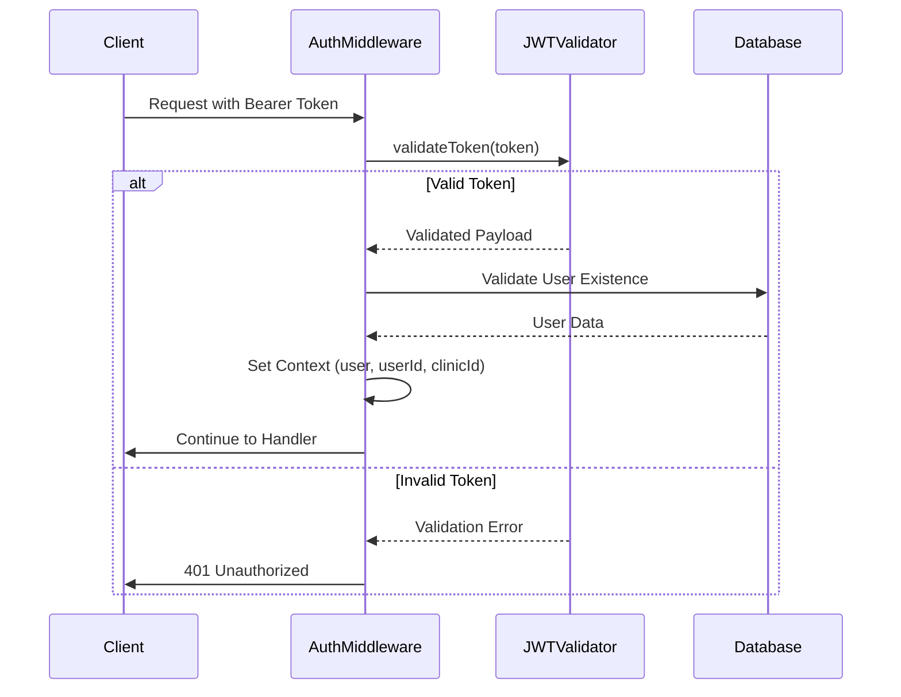

**Diagram sources **
- [authn.ts](file://apps/api/src/middleware/authn.ts#L15-L100)

The authentication process begins with extracting the Bearer token from the Authorization header. The `jwtValidator.validateToken()` function performs comprehensive validation of the JWT, checking signature, expiration, and other security parameters. Upon successful validation, the system verifies the user's existence in the database by matching both user ID and email from the token payload.

Authenticated user information is stored in the Hono context using `c.set()` calls, making it available to downstream middleware and route handlers. The system supports optional authentication through `optionalAuth()` middleware, which attempts authentication but doesn't fail if no valid token is provided.

Role-based authorization is implemented through `authorizationMiddleware()`, which checks if the authenticated user has the required roles for protected endpoints. Clinic access control ensures users can only access data belonging to their associated clinic, preventing cross-clinic data access.

**Section sources**
- [authn.ts](file://apps/api/src/middleware/authn.ts#L1-L307)
- [app.ts](file://apps/api/src/app.ts#L239-L245)

## Audit Logging System
NeonPro's audit logging system provides comprehensive tracking of API interactions for security, compliance, and operational purposes. The `audit-log.ts` middleware captures detailed information about each request and response, with specialized variants for different data types.

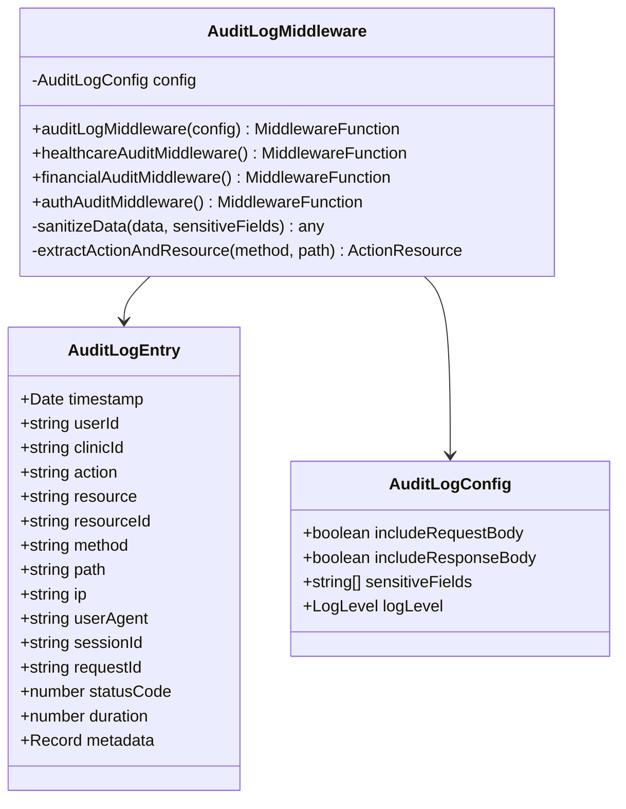

**Diagram sources **
- [audit-log.ts](file://apps/api/src/middleware/audit-log.ts#L15-L100)

The system automatically redacts sensitive fields such as passwords, tokens, CPF (Brazilian individual taxpayer registry), RG (Brazilian identity document), medical records, and financial data. Different audit variants are available for specific contexts:

- **Healthcare audit**: Includes request body but excludes response body, with enhanced sensitive field detection
- **Financial audit**: Focuses on payment-related sensitive data like credit card numbers and bank accounts
- **Authentication audit**: Excludes request bodies entirely to prevent password logging

Audit entries capture comprehensive metadata including timestamp, user information, request details, IP address, user agent, and processing duration. The logs are structured to support both debugging and compliance requirements, particularly for LGPD (Brazilian General Data Protection Law) adherence.

**Section sources**
- [audit-log.ts](file://apps/api/src/middleware/audit-log.ts#L1-L331)
- [app.ts](file://apps/api/src/app.ts#L281-L283)

## Error Tracking and Interception
The error handling system in NeonPro consists of multiple layers designed to catch, sanitize, and report errors while providing meaningful responses to clients. This multi-tiered approach ensures robust error management throughout the request lifecycle.

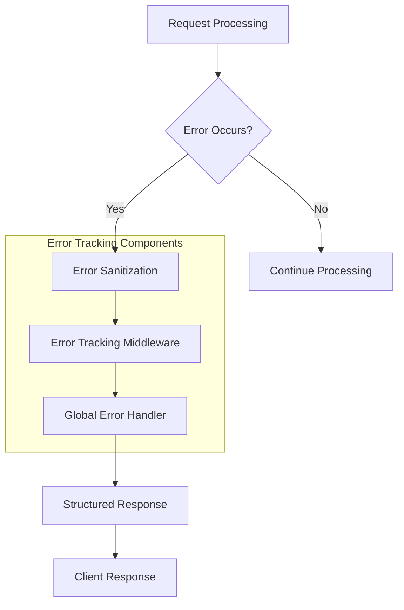

**Diagram sources **
- [error-tracking.ts](file://apps/api/src/middleware/error-tracking.ts#L1-L114)

The pipeline begins with `errorSanitizationMiddleware` which removes sensitive information from error objects before they're processed further. This is followed by `healthcareErrorTrackingMiddleware` which captures errors and sends them to monitoring systems with full context.

The global error handler (`globalErrorHandler`) intercepts unhandled exceptions and ensures consistent error responses. It logs detailed error information including message, stack trace, URL, and method, while sending sanitized responses to clients that don't expose internal implementation details.

Process-level error handlers are configured to catch uncaught exceptions and unhandled promise rejections, ensuring the application remains stable even when unexpected errors occur. In production environments, these handlers trigger graceful shutdown procedures to prevent corrupted states.

**Section sources**
- [error-tracking.ts](file://apps/api/src/middleware/error-tracking.ts#L1-L114)
- [error-handler.ts](file://apps/api/src/middleware/error-handler.ts#L1-L47)
- [app.ts](file://apps/api/src/app.ts#L233-L237)

## Performance Monitoring
Performance monitoring in NeonPro is implemented through dedicated middleware that tracks request timing, resource usage, and response characteristics. The system provides real-time insights into API performance and helps identify potential bottlenecks.

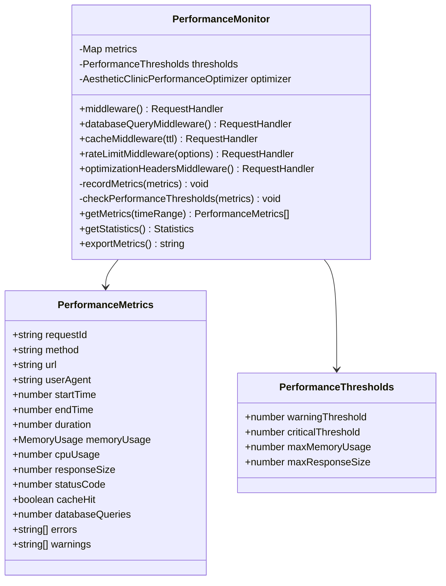

**Diagram sources **
- [performance-middleware.ts](file://apps/api/src/middleware/performance-middleware.ts#L15-L100)

The performance monitor tracks key metrics including request duration, memory usage, response size, and database query counts. It generates unique request IDs for tracing requests across systems and sets appropriate headers for response timing.

Warning and critical thresholds are defined for response times (1 second and 5 seconds respectively), memory usage (500MB), and response size (10MB). When thresholds are exceeded, the system logs appropriate warnings to facilitate proactive performance optimization.

The middleware also implements periodic cleanup of old metrics to prevent memory leaks, retaining only the most recent 24 hours of performance data for analysis and reporting.

**Section sources**
- [performance-middleware.ts](file://apps/api/src/middleware/performance-middleware.ts#L1-L425)

## Query Timeout Enforcement
To ensure compliance with healthcare performance requirements (<2s response time), NeonPro implements query timeout enforcement through dedicated middleware. This mechanism prevents long-running queries from degrading overall system performance.

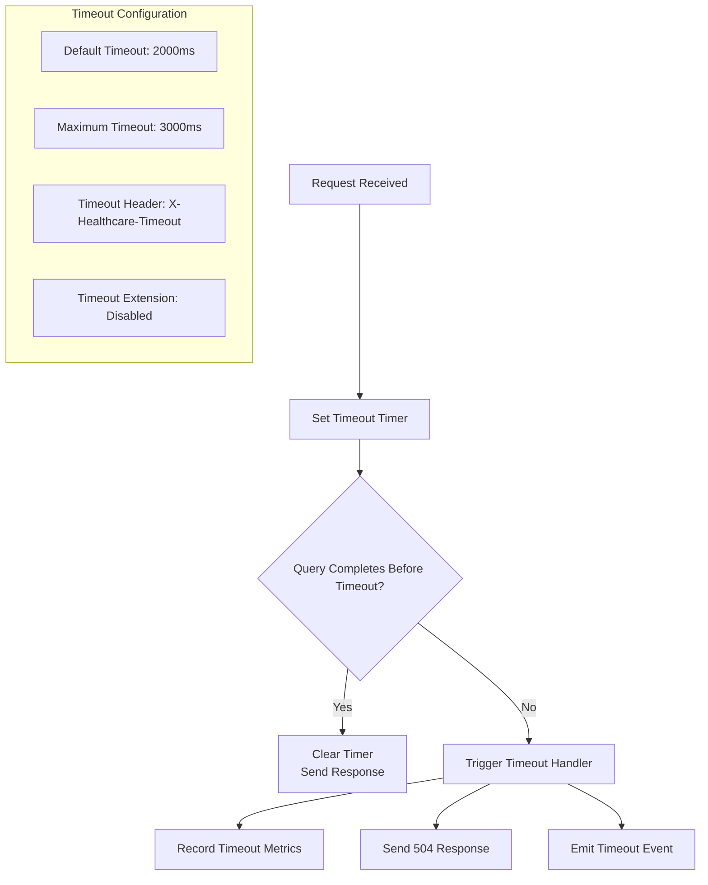

**Diagram sources **
- [query-timeout-middleware.ts](file://apps/api/src/middleware/query-timeout-middleware.ts#L150-L200)

The `createHealthcareTimeoutMiddleware()` function configures a strict 2-second default timeout with a maximum of 3 seconds for complex healthcare queries. Timeout extension is disabled to ensure compliance with performance requirements.

The middleware tracks active queries in a Map, associating each with its start time and configured timeout. When a timeout occurs, the system records detailed metrics including query ID, route, method, and duration, then sends an HTTP 504 Gateway Timeout response with retryable indication.

Real-time monitoring capabilities allow administrators to check approaching timeouts, identify problematic routes, and generate health recommendations based on timeout statistics. The system also implements response compression to reduce latency and improve perceived performance.

**Section sources**
- [query-timeout-middleware.ts](file://apps/api/src/middleware/query-timeout-middleware.ts#L1-L508)
- [app.ts](file://apps/api/src/app.ts#L256-L260)

## Response Compression
NeonPro optimizes network performance through response compression middleware that reduces payload sizes and improves transfer efficiency. The system supports multiple compression algorithms and intelligently applies compression based on content characteristics.

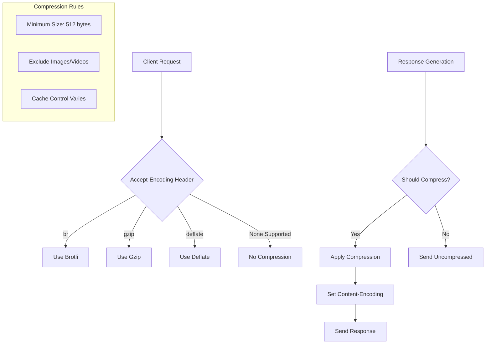

**Diagram sources **
- [compression-middleware.ts](file://apps/api/src/middleware/compression-middleware.ts#L150-L200)

The `CompressionMiddleware` class implements support for Brotli, Gzip, and Deflate compression algorithms, selecting the optimal method based on the client's Accept-Encoding header. Brotli is preferred when available due to its superior compression ratios.

Compression is selectively applied based on response size (minimum 512 bytes) and content type, avoiding compression of already-compressed formats like images and videos. The middleware sets appropriate Vary headers to ensure proper caching behavior across different encoding types.

Different cache strategies are applied based on content type:
- AI responses: cached for 5 minutes
- Static assets: cached for 1 year with immutable flag
- General GET requests: cached for 1 hour
- Dynamic content: no caching

The system records detailed compression metrics including original and compressed sizes, compression ratio, and method used, enabling continuous optimization of compression strategies.

**Section sources**
- [compression-middleware.ts](file://apps/api/src/middleware/compression-middleware.ts#L1-L665)
- [app.ts](file://apps/api/src/app.ts#L262-L266)

## Custom Middleware Examples
NeonPro includes specialized custom middleware components designed for specific use cases and compliance requirements. These demonstrate the extensibility of the middleware architecture and its ability to address domain-specific needs.

### Aesthetic Clinic Middleware
The `aesthetic-clinic-middleware.ts` provides enhanced security and compliance features specifically for aesthetic clinic operations, addressing T085 requirements.

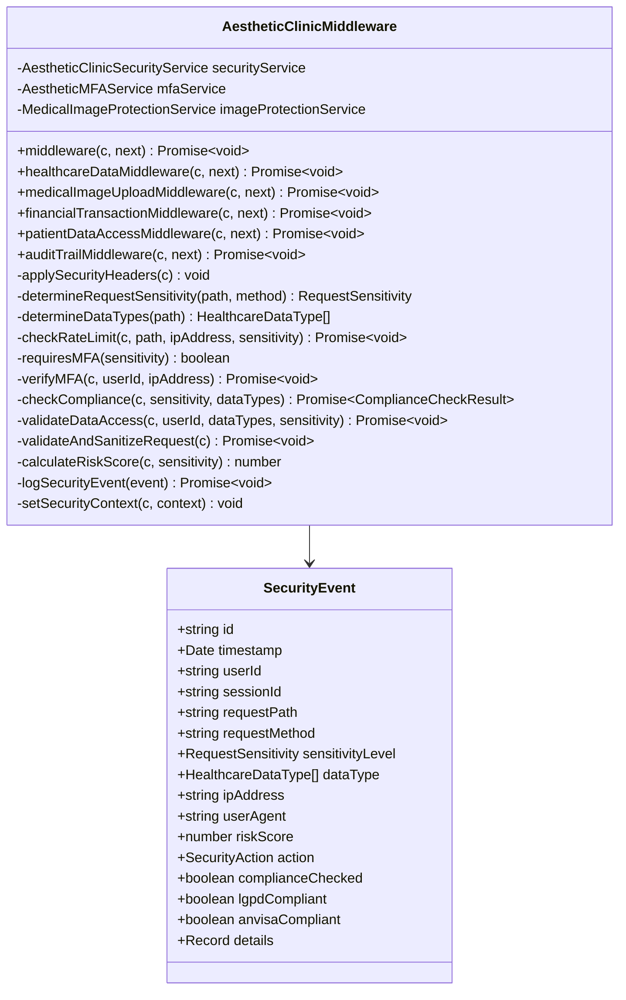

**Diagram sources **
- [aesthetic-clinic-middleware.ts](file://apps/api/src/middleware/aesthetic-clinic-middleware.ts#L150-L200)

This middleware implements multi-factor authentication requirements for sensitive operations, medical image upload validation, and financial transaction security. It determines request sensitivity levels (low, medium, high, critical) based on the requested path and applies corresponding security measures.

The system enforces ANVISA (Brazilian Health Regulatory Agency) compliance for medical image operations and LGPD compliance for personal data processing. Security events are logged with detailed context including risk scores, data types accessed, and compliance verification results.

**Section sources**
- [aesthetic-clinic-middleware.ts](file://apps/api/src/middleware/aesthetic-clinic-middleware.ts#L1-L857)

### HTTPS Monitoring Middleware
The `https-monitoring-middleware.ts` provides real-time monitoring of TLS handshake performance to ensure compliance with healthcare requirements.

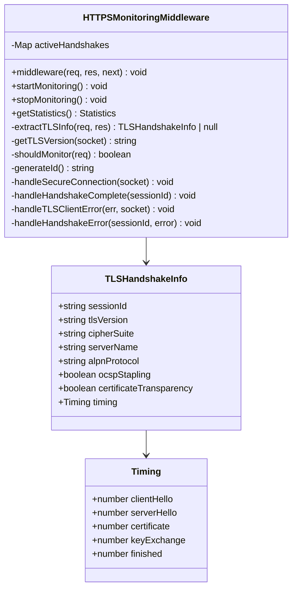

**Diagram sources **
- [https-monitoring-middleware.ts](file://apps/api/src/middleware/https-monitoring-middleware.ts#L150-L200)

This middleware intercepts and monitors TLS handshake performance, recording metrics such as handshake duration, TLS version, cipher suite, and timing breakdown of handshake phases. It integrates with `httpsMonitoringService` to record handshake metrics and track compliance rates.

The system provides an endpoint (`/v1/monitoring/https`) that exposes monitoring status, performance summaries, and compliance information. Handshake completion events trigger metric recording, while errors are logged for troubleshooting and security analysis.

**Section sources**
- [https-monitoring-middleware.ts](file://apps/api/src/middleware/https-monitoring-middleware.ts#L1-L456)
- [app.ts](file://apps/api/src/app.ts#L268-L270)

## LGPD Compliance Checks
The LGPD (Lei Geral de Proteção de Dados) middleware ensures compliance with Brazilian data protection regulations through consent management, data portability, and right to erasure implementations.

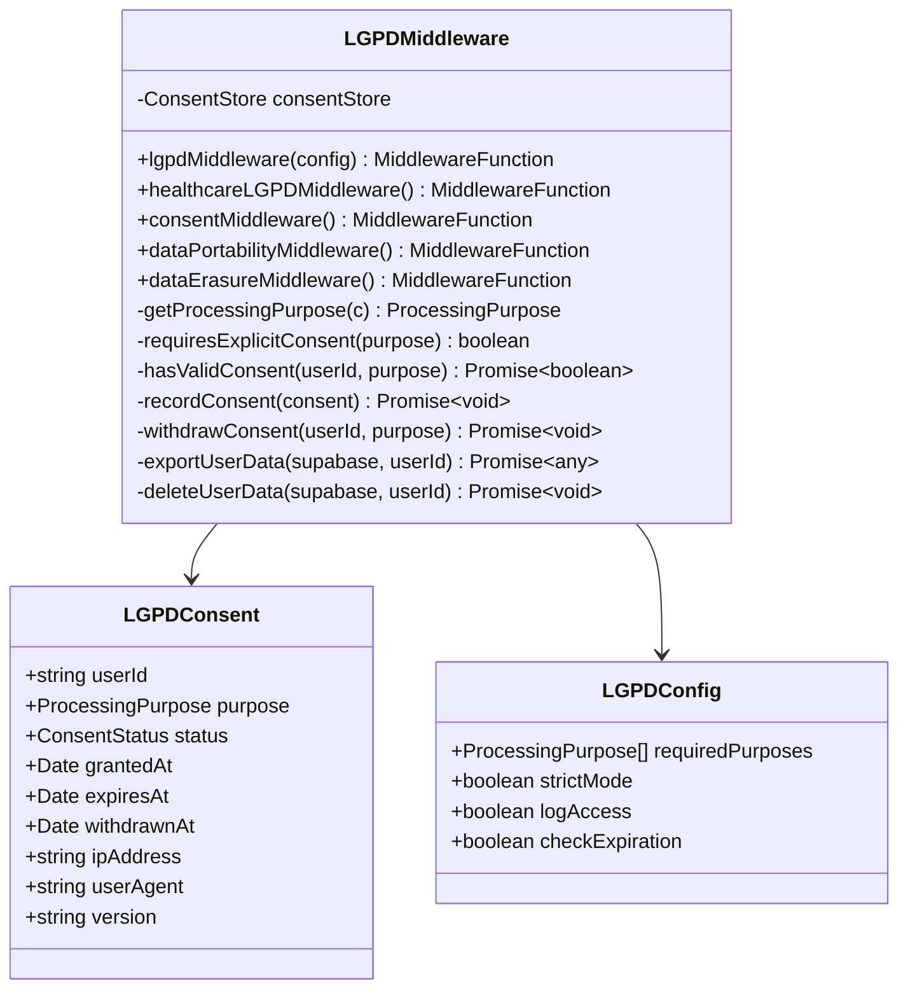

**Diagram sources **
- [lgpd-middleware.ts](file://apps/api/src/middleware/lgpd-middleware.ts#L150-L200)

The middleware implements several key LGPD requirements:

- **Consent Management**: Tracks user consent for different processing purposes (medical care, appointment scheduling, billing) with status, timestamps, and withdrawal capabilities
- **Data Portability**: Provides `/data-export` endpoint that collects all user data across systems in JSON format for export
- **Right to Erasure**: Implements `/data-erasure` endpoint that anonymizes or deletes user data according to Article 18 requirements
- **Access Logging**: Records all data access operations for audit purposes, noting whether valid consent was present

The system distinguishes between purposes requiring explicit consent and those exempt under LGPD (legal obligation, vital interest). In strict mode, access is denied when required consent is missing, returning appropriate error codes and URLs for consent granting.

**Section sources**
- [lgpd-middleware.ts](file://apps/api/src/middleware/lgpd-middleware.ts#L1-L686)
- [app.ts](file://apps/api/src/app.ts#L317-L348)

## HTTPS Monitoring
HTTPS monitoring in NeonPro extends beyond simple availability checks to provide deep insights into TLS handshake performance and security characteristics. This ensures compliance with healthcare requirements for secure and performant connections.

The monitoring system tracks key metrics including:
- Handshake duration (target ≤300ms)
- TLS protocol version (prefer TLS 1.3)
- Cipher suite strength
- OCSP stapling status
- Certificate transparency
- ALPN protocol negotiation

Real-time statistics are available through the `/v1/monitoring/https` endpoint, which returns configuration details, performance summaries, active alerts, and compliance rates. The system maintains a target of 99% compliance rate for handshake times, triggering alerts when performance degrades.

The monitoring infrastructure also captures security events such as TLS client errors and handshake failures, providing valuable data for identifying potential attacks or configuration issues. Historical performance data is retained for trend analysis and capacity planning.

**Section sources**
- [https-monitoring-middleware.ts](file://apps/api/src/middleware/https-monitoring-middleware.ts#L1-L456)
- [app.ts](file://apps/api/src/app.ts#L350-L378)

## Context Propagation
Context propagation is a fundamental aspect of NeonPro's middleware architecture, enabling data sharing and state management across the entire request lifecycle. The Hono context object serves as the primary mechanism for passing information between middleware layers and route handlers.

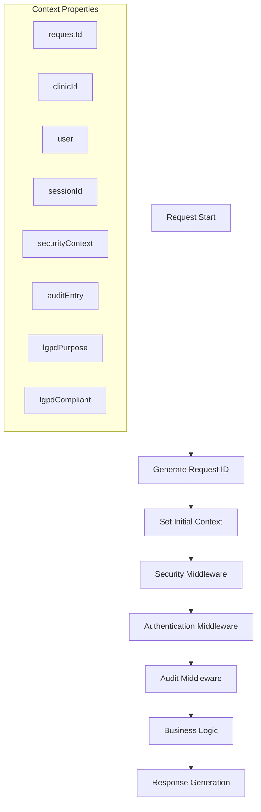

**Diagram sources **
- [app.ts](file://apps/api/src/app.ts#L272-L315)

Key context properties propagated through the pipeline include:
- **Request identification**: Unique `requestId` generated at the start of processing
- **User authentication**: `userId`, `clinicId`, and full `user` object after successful authentication
- **Security context**: Sensitivity levels, data types, and compliance results from specialized middleware
- **Audit information**: Audit entry object populated with request details
- **Compliance flags**: LGPD purpose and compliance status

The context system enables middleware to make informed decisions based on previously established state. For example, audit logging can include user information only if authentication has successfully occurred, and rate limiting can apply different rules based on user roles stored in the context.

This approach eliminates the need for repeated database queries or redundant validation, improving performance while maintaining consistency across the application.

**Section sources**
- [app.ts](file://apps/api/src/app.ts#L272-L315)
- [authn.ts](file://apps/api/src/middleware/authn.ts#L1-L307)

## Middleware Composition Strategies
NeonPro employs several middleware composition strategies to create flexible, maintainable, and efficient processing pipelines. These patterns enable the creation of specialized middleware stacks for different scenarios while promoting code reuse.

### Functional Composition
The application uses functional composition to build middleware chains, where higher-order functions return configured middleware instances:

```typescript
// Example from app.ts
app.use('*', httpsRedirectMiddleware());
app.use('*', healthcareSecurityHeadersMiddleware());
app.use('*', rateLimitMiddleware());
```

Each middleware function returns a handler that can be registered with the application, allowing for clean, readable pipeline construction.

### Configuration-Based Specialization
Many middleware components support configuration objects that customize behavior without requiring code changes:

```typescript
// From rate-limiting.ts
export function rateLimitMiddleware() {
  return async (c: Context, next: Next) => {
    // Different limits for different endpoint types
    if (path.includes('/patients')) {
      const healthcareLimit = createRateLimit({ windowMs: 900000, maxRequests: 50 });
      return healthcareLimit(c, next);
    }
    // ... other conditions
  };
}
```

This strategy allows a single middleware implementation to serve multiple purposes through conditional logic based on request characteristics.

### Layered Security Approach
Security middleware is applied in layers, with each layer addressing a specific concern:

1. Network-level security (HTTPS redirect)
2. Header-based security (security headers, CSP)
3. Rate-based security (rate limiting)
4. Content security (query timeout, sensitive data protection)
5. Authentication security (JWT validation, role checking)

This defense-in-depth approach ensures that even if one security layer is compromised, others remain effective.

### Early Termination Pattern
Several middleware components implement early termination, stopping the request pipeline when conditions aren't met:

```typescript
// From authn.ts
if (!authHeader || !authHeader.startsWith('Bearer ')) {
  throw new HTTPException(401, { message: 'Authorization header required' });
}
```

This pattern prevents unnecessary processing of invalid requests, conserving resources and improving response times for error conditions.

These composition strategies enable NeonPro to maintain a clean separation of concerns while providing comprehensive functionality across all API endpoints.

**Section sources**
- [app.ts](file://apps/api/src/app.ts#L152-L315)
- [rate-limiting.ts](file://apps/api/src/middleware/rate-limiting.ts#L1-L215)
- [authn.ts](file://apps/api/src/middleware/authn.ts#L1-L307)
- [security-headers.ts](file://apps/api/src/middleware/security-headers.ts#L1-L382)