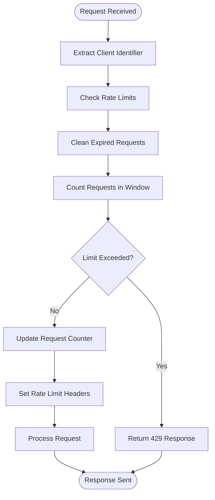
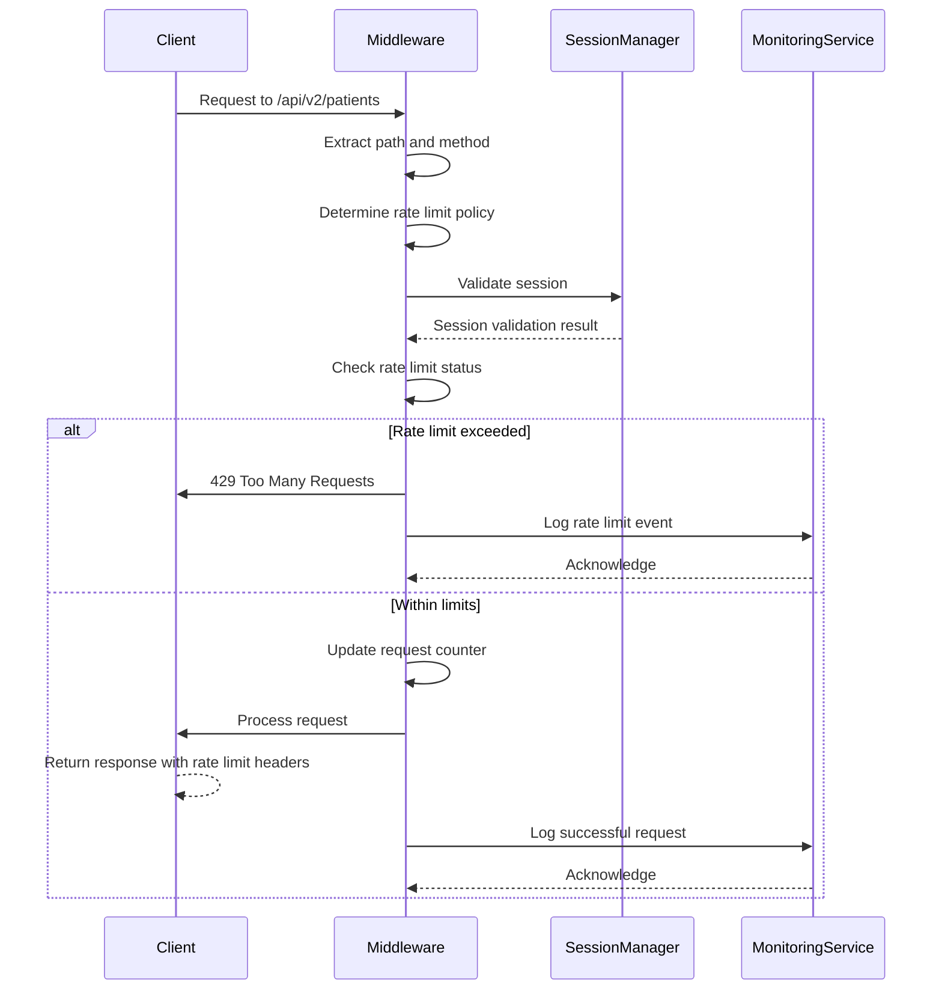

# Rate Limiting Middleware

<cite>
**Referenced Files in This Document**
- [rate-limit.ts](file://apps/api/src/middleware/rate-limit.ts)
- [rate-limiting.ts](file://apps/api/src/middleware/rate-limiting.ts)
- [rate-limit-service.ts](file://apps/api/src/services/rate-limit-service.ts)
- [enhanced-session-manager.ts](file://apps/api/src/security/enhanced-session-manager.ts)
- [https-monitoring-service.ts](file://apps/api/src/services/monitoring/https-monitoring-service.ts)
</cite>

## Table of Contents

1. [Introduction](#introduction)
2. [Implementation Algorithms](#implementation-algorithms)
3. [Configuration Parameters](#configuration-parameters)
4. [Enforcement Levels](#enforcement-levels)
5. [Redis-Backed Storage Mechanism](#redis-backed-storage-mechanism)
6. [Rate Limit Headers](#rate-limit-headers)
7. [Endpoint and User Tier Configuration](#endpoint-and-user-tier-configuration)
8. [Monitoring and Alerting Integration](#monitoring-and-alerting-integration)
9. [Handling Rate Limit Exceeded Scenarios](#handling-rate-limit-exceeded-scenarios)

## Introduction

The rate limiting middleware in neonpro provides a comprehensive system for controlling API request rates to prevent abuse, ensure fair usage, and maintain system stability. The implementation includes multiple rate limiting strategies for different endpoint types, with specialized handling for healthcare data access, AI chat endpoints, authentication flows, and general API usage. The system integrates with session management and monitoring services to provide a robust security and performance framework.

**Section sources**

- [rate-limit.ts](file://apps/api/src/middleware/rate-limit.ts#L1-L221)
- [rate-limiting.ts](file://apps/api/src/middleware/rate-limiting.ts#L1-L214)

## Implementation Algorithms

The rate limiting system implements sliding window algorithms through in-memory counters that track request timestamps within specified time windows. For chat-specific endpoints, the system uses a dual-window approach with both short-term (5 minutes) and long-term (1 hour) limits to prevent burst and sustained abuse patterns.

The core algorithm maintains a list of request timestamps for each client identifier, filtering out expired requests outside the current window before evaluating limits. This sliding window approach provides more accurate rate limiting compared to fixed window methods, as it prevents clients from making a large number of requests immediately after a window boundary.

For general rate limiting, a simpler counter-based approach is used with automatic cleanup of expired entries every 5 minutes. The system stores request counts with reset times, allowing for efficient evaluation of rate limit status without maintaining extensive historical data.



**Diagram sources**

- [rate-limit.ts](file://apps/api/src/middleware/rate-limit.ts#L8-L77)
- [rate-limiting.ts](file://apps/api/src/middleware/rate-limiting.ts#L10-L169)

**Section sources**

- [rate-limit.ts](file://apps/api/src/middleware/rate-limit.ts#L8-L77)
- [rate-limiting.ts](file://apps/api/src/middleware/rate-limiting.ts#L10-L169)

## Configuration Parameters

The rate limiting system supports several configurable parameters that control the behavior of rate limits:

- **maxRequests**: The maximum number of requests allowed within the time window
- **timeWindow**: The duration in milliseconds for which the rate limit applies
- **burstCapacity**: Implicitly handled through the sliding window algorithm by allowing requests up to the maxRequests threshold
- **keyGenerator**: Function to determine the client identifier for rate limiting purposes
- **skipSuccessfulRequests**: Option to exclude successful requests from counting toward limits (used for authentication endpoints)
- **skipFailedRequests**: Option to exclude failed requests from counting toward limits

These parameters are configured differently for various endpoint types, with healthcare data endpoints having stricter limits than general API endpoints. The configuration also includes options for enabling or disabling standard rate limit headers in responses.

**Section sources**

- [rate-limiting.ts](file://apps/api/src/middleware/rate-limiting.ts#L79-L169)
- [rate-limit-service.ts](file://apps/api/src/services/rate-limit-service.ts#L1-L193)

## Enforcement Levels

The rate limiting system enforces limits at both IP and user levels, providing layered protection against abuse. For authenticated users, the system prioritizes user ID as the primary identifier, falling back to IP address for anonymous users.

### IP-Level Enforcement

IP-based rate limiting serves as the baseline protection for all clients. The system extracts the client IP from standard HTTP headers (`x-forwarded-for`, `x-real-ip`, or `cf-connecting-ip`) and uses this as the key for rate limiting when no authenticated user is present. This prevents unauthenticated clients from overwhelming the system with excessive requests.

### User-Level Enforcement

For authenticated users, the system uses the user ID as the primary rate limiting key. This provides more granular control and prevents scenarios where multiple legitimate users behind the same IP address would be unfairly limited. The integration with the enhanced session manager ensures that user sessions are properly validated before applying user-level rate limits.

The system implements different enforcement policies based on endpoint sensitivity:

- Healthcare data endpoints: 50 requests per 15 minutes
- AI/Chat endpoints: 20 requests per minute
- Authentication endpoints: 10 attempts per 15 minutes (counting only failed attempts)
- General API endpoints: 100 requests per 15 minutes

```mermaid
classDiagram
class RateLimitConfig {
+windowMs : number
+maxRequests : number
+keyGenerator : function
+skipSuccessfulRequests : boolean
+skipFailedRequests : boolean
}
class ChatRateLimiter {
-limits : Map~string, LimitData~
+isLimited(key, maxRequests, windowMs) : boolean
+getRemainingRequests(key, maxRequests, windowMs) : number
+getResetTime(key, windowMs) : number
}
class RateLimitStore {
-store : Map~string, {count, resetTime}~
+get(key) : {count, resetTime}
+set(key, count, windowMs) : void
+increment(key, windowMs) : number
+cleanup() : void
}
class EnhancedSessionManager {
+validateAndUpdateSession(sessionId, ip, userAgent) : ValidationResult
+createSession(userId, metadata) : string
+regenerateSession(oldSessionId) : string
}
RateLimitConfig <|-- ChatRateLimiter : "uses"
RateLimitConfig <|-- RateLimitStore : "uses"
ChatRateLimiter --> RateLimitStore : "delegates to"
RateLimitStore --> EnhancedSessionManager : "integrates with"
```

**Diagram sources**

- [rate-limit.ts](file://apps/api/src/middleware/rate-limit.ts#L8-L77)
- [rate-limiting.ts](file://apps/api/src/middleware/rate-limiting.ts#L10-L169)
- [enhanced-session-manager.ts](file://apps/api/src/security/enhanced-session-manager.ts#L92-L797)

**Section sources**

- [rate-limit.ts](file://apps/api/src/middleware/rate-limit.ts#L8-L77)
- [rate-limiting.ts](file://apps/api/src/middleware/rate-limiting.ts#L10-L169)
- [enhanced-session-manager.ts](file://apps/api/src/security/enhanced-session-manager.ts#L92-L797)

## Redis-Backed Storage Mechanism

While the current implementation uses in-memory storage for rate limit tracking, the architecture supports distributed deployment through Redis-backed storage. The system is designed to integrate with Redis for storing request counts across multiple instances, ensuring consistent rate limiting in horizontally scaled environments.

The rate limit store maintains keys that combine the client identifier with endpoint-specific prefixes, allowing for efficient retrieval and updates. In a distributed setup, Redis would serve as the central store for these counters, with appropriate TTL settings to automatically expire old rate limit data.

Although the current implementation uses JavaScript Maps for storage, the interface is designed to be easily replaceable with Redis operations. The cleanup process that runs every 5 minutes to remove expired entries would be unnecessary with Redis, as expiration can be handled natively through Redis TTL functionality.

**Section sources**

- [rate-limiting.ts](file://apps/api/src/middleware/rate-limiting.ts#L10-L76)
- [rate-limit-service.ts](file://apps/api/src/services/rate-limit-service.ts#L1-L193)

## Rate Limit Headers

The rate limiting middleware returns standardized headers to inform clients about their rate limit status:

- **X-RateLimit-Limit**: The total number of requests allowed in the current window
- **X-RateLimit-Remaining**: The number of requests remaining in the current window
- **X-RateLimit-Reset**: The time at which the current window resets, in Unix epoch seconds
- **Retry-After**: The number of seconds to wait before retrying after exceeding the limit

For chat endpoints, the system provides additional headers with suffixes indicating the time window:

- **X-RateLimit-Limit-Short** and **X-RateLimit-Remaining-Short**: For the 5-minute window
- **X-RateLimit-Limit-Long** and **X-RateLimit-Remaining-Long**: For the 1-hour window
- **X-RateLimit-Reset-Short** and **X-RateLimit-Reset-Long**: Reset times for each window

These headers follow industry standards while extending them to support multiple concurrent rate limit windows, providing clients with detailed information about their usage and limitations.

**Section sources**

- [rate-limit.ts](file://apps/api/src/middleware/rate-limit.ts#L120-L160)
- [rate-limiting.ts](file://apps/api/src/middleware/rate-limiting.ts#L140-L155)

## Endpoint and User Tier Configuration

The rate limiting system implements differentiated configurations based on endpoint type and user tier. The middleware dynamically selects appropriate limits by examining the request path and applying rules based on endpoint sensitivity.

### Endpoint-Based Configuration

Different endpoint categories have specific rate limit policies:

- **Healthcare data endpoints** (/patients, /medical-records): Most restrictive with 50 requests per 15 minutes
- **AI/Chat endpoints** (/chat, /ai): Moderate limits of 20 requests per minute
- **Authentication endpoints** (/auth, /login): Strict limits of 10 attempts per 15 minutes, counting only failed attempts
- **General API endpoints**: Default limits of 100 requests per 15 minutes

### User Tier Configuration

While not explicitly implemented in the current code, the architecture supports user tier differentiation through the key generation mechanism. Different user tiers could be assigned different rate limits by modifying the key generator function to incorporate user tier information into the rate limit key.

The system also supports draft rules and disabled rules through configuration flags, allowing for testing and gradual rollout of new rate limiting policies without affecting production traffic.



**Diagram sources**

- [rate-limiting.ts](file://apps/api/src/middleware/rate-limiting.ts#L172-L213)
- [enhanced-session-manager.ts](file://apps/api/src/security/enhanced-session-manager.ts#L92-L797)
- [https-monitoring-service.ts](file://apps/api/src/services/monitoring/https-monitoring-service.ts#L49-L429)

**Section sources**

- [rate-limiting.ts](file://apps/api/src/middleware/rate-limiting.ts#L172-L213)
- [rate-limit-service.ts](file://apps/api/src/services/rate-limit-service.ts#L1-L193)

## Monitoring and Alerting Integration

The rate limiting system integrates with the HTTPS monitoring service to provide comprehensive observability and alerting capabilities. While the rate limiting middleware itself handles request-level monitoring, it works in conjunction with the broader monitoring infrastructure to detect and respond to potential abuse patterns.

The monitoring service tracks rate limit events and can trigger alerts when certain thresholds are exceeded, such as a high volume of rate-limited requests from a particular IP range or geographic region. These alerts can be escalated through external systems like Slack or PagerDuty for immediate attention by the operations team.

The system logs detailed information about rate limit events, including the client identifier, request path, method, and remaining limits, which can be used for forensic analysis and pattern detection. This integration ensures that rate limiting is not just a defensive measure but also a valuable source of intelligence about API usage patterns and potential security threats.

**Section sources**

- [https-monitoring-service.ts](file://apps/api/src/services/monitoring/https-monitoring-service.ts#L49-L429)
- [rate-limit.ts](file://apps/api/src/middleware/rate-limit.ts#L1-L221)

## Handling Rate Limit Exceeded Scenarios

When a client exceeds the rate limit, the system responds with a 429 Too Many Requests status code and includes detailed information about the rate limiting condition. The response contains a structured error object with:

- A descriptive message explaining the rate limit violation
- An error code (CHAT_RATE_LIMIT_EXCEEDED or RATE_LIMIT_EXCEEDED)
- The Retry-After value in seconds
- Details about the applicable limits

The system distinguishes between chat-specific rate limit violations and general rate limit violations, providing tailored messages for each scenario. For chat endpoints, the error response includes information about both the short-term and long-term limits, helping clients understand the multi-window nature of the restrictions.

The middleware is designed to fail gracefully in case of rate limiter errors, logging the issue but allowing the request to proceed rather than blocking it. This ensures that transient issues with the rate limiting system do not result in denial of service for legitimate users.

The enhanced session manager complements the rate limiting system by detecting and responding to suspicious session activity that might indicate abuse attempts, such as rapid IP changes or consecutive authentication failures, providing an additional layer of protection beyond simple request counting.

**Section sources**

- [rate-limit.ts](file://apps/api/src/middleware/rate-limit.ts#L100-L221)
- [rate-limiting.ts](file://apps/api/src/middleware/rate-limiting.ts#L140-L160)
- [enhanced-session-manager.ts](file://apps/api/src/security/enhanced-session-manager.ts#L92-L797)
