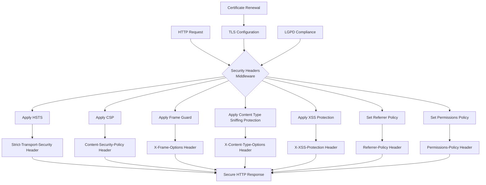
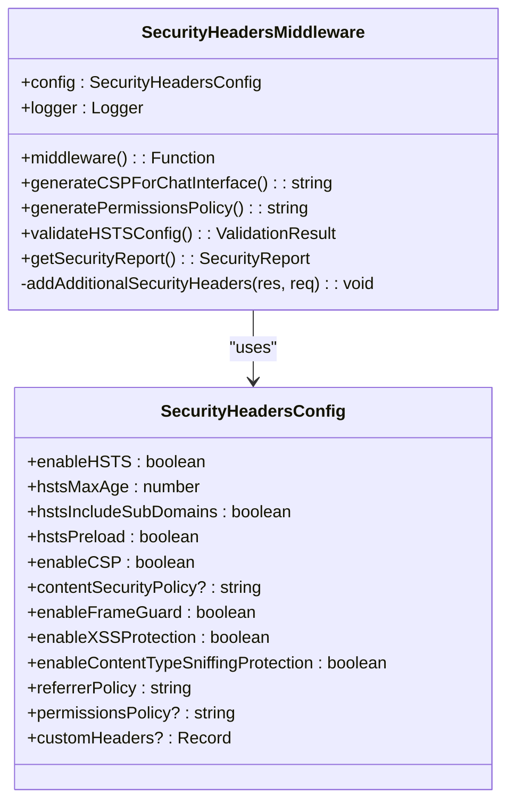
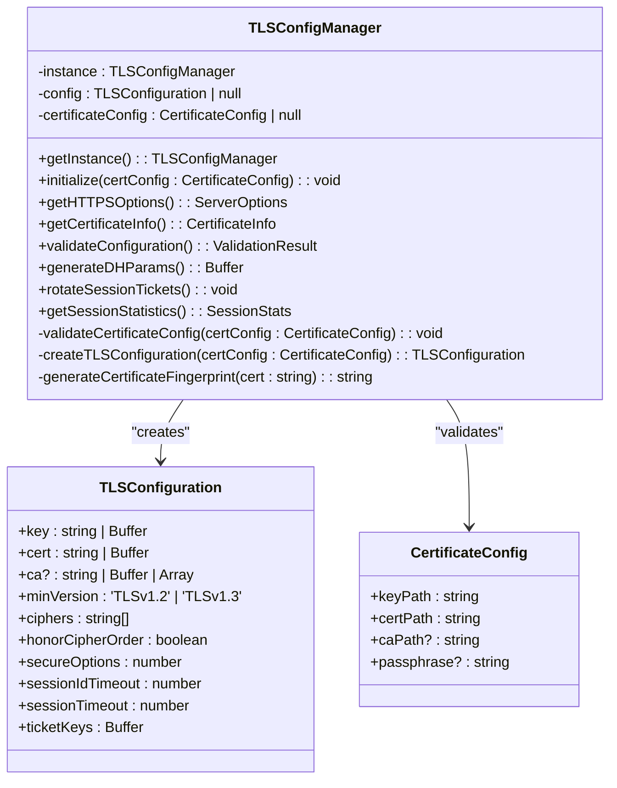
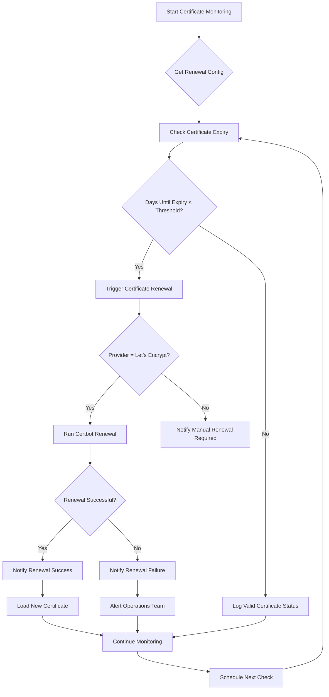
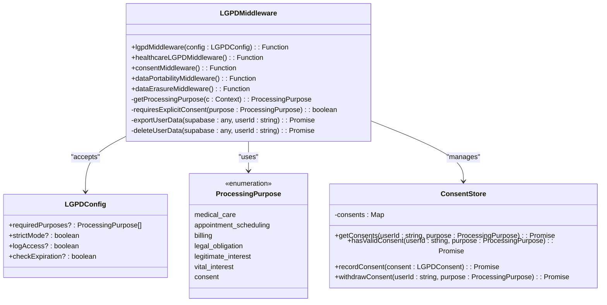
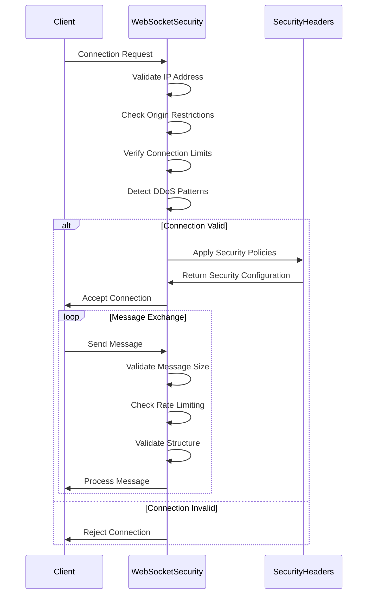

# Security Headers Middleware

<cite>
**Referenced Files in This Document**
- [security-headers.ts](file://apps/api/src/middleware/security-headers.ts)
- [tls-config.ts](file://apps/api/src/config/tls-config.ts)
- [certificate-renewal.ts](file://apps/api/src/config/certificate-renewal.ts)
- [websocket-security-middleware.ts](file://apps/api/src/middleware/websocket-security-middleware.ts)
- [lgpd-middleware.ts](file://apps/api/src/middleware/lgpd-middleware.ts)
</cite>

## Table of Contents
1. [Introduction](#introduction)
2. [Core Components](#core-components)
3. [Architecture Overview](#architecture-overview)
4. [Detailed Component Analysis](#detailed-component-analysis)
5. [Configuration and Compliance](#configuration-and-compliance)
6. [WebSocket Security Integration](#websocket-security-integration)
7. [Testing and Validation](#testing-and-validation)
8. [Troubleshooting Guide](#troubleshooting-guide)
9. [Conclusion](#conclusion)

## Introduction
The Security Headers Middleware in neonpro implements a comprehensive security layer for HTTP responses, enforcing critical security policies through standardized headers. This middleware ensures compliance with healthcare regulations like LGPD (Brazil's General Data Protection Law) and CFM (Federal Council of Medicine) guidelines by injecting essential security headers such as Content-Security-Policy (CSP), X-Content-Type-Options, X-Frame-Options, and Strict-Transport-Security (HSTS). The implementation is tightly integrated with TLS configuration and certificate management systems to provide end-to-end security for healthcare applications.

**Section sources**
- [security-headers.ts](file://apps/api/src/middleware/security-headers.ts#L1-L382)

## Core Components

The security headers implementation consists of several key components that work together to protect the application from common web vulnerabilities. The `SecurityHeadersMiddleware` class serves as the central component, responsible for applying security policies based on configuration settings. It works in conjunction with TLS configuration managers and certificate renewal systems to ensure consistent security enforcement across all HTTP responses.

The middleware provides methods for generating specific security policies, including CSP directives tailored for AI chat interfaces and Permissions Policies that restrict access to sensitive browser features. Additionally, it includes validation capabilities to verify HSTS configuration compliance and generate security reports detailing enabled features and potential issues.

**Section sources**
- [security-headers.ts](file://apps/api/src/middleware/security-headers.ts#L1-L382)
- [tls-config.ts](file://apps/api/src/config/tls-config.ts#L1-L312)

## Architecture Overview



**Diagram sources**
- [security-headers.ts](file://apps/api/src/middleware/security-headers.ts#L1-L382)
- [tls-config.ts](file://apps/api/src/config/tls-config.ts#L1-L312)
- [certificate-renewal.ts](file://apps/api/src/config/certificate-renewal.ts#L1-L297)

## Detailed Component Analysis

### Security Headers Middleware Implementation

The `SecurityHeadersMiddleware` class implements a configurable system for applying security headers to HTTP responses. It accepts a `SecurityHeadersConfig` interface that defines various security options including HSTS settings, CSP directives, and other protective measures.



**Diagram sources**
- [security-headers.ts](file://apps/api/src/middleware/security-headers.ts#L1-L382)

#### Header Injection Process

The middleware processes requests through a systematic header injection process that applies security policies based on configuration and request characteristics. For HTTPS requests, HSTS headers are applied with configurable max-age, subdomain inclusion, and preload directives. The Content Security Policy is applied when enabled, helping prevent cross-site scripting (XSS) attacks by restricting resource loading.

```mermaid
sequenceDiagram
participant Client
participant Middleware
participant Response
Client->>Middleware : HTTP Request
Middleware->>Middleware : Validate Configuration
alt HSTS Enabled & Secure Request
Middleware->>Response : Set Strict-Transport-Security
Middleware->>Middleware : Log HSTS Application
end
alt CSP Enabled
Middleware->>Response : Set Content-Security-Policy
end
alt Frame Guard Enabled
Middleware->>Response : Set X-Frame-Options : DENY
end
alt Content Type Sniffing Protection Enabled
Middleware->>Response : Set X-Content-Type-Options : nosniff
end
alt XSS Protection Enabled
Middleware->>Response : Set X-XSS-Protection : 1; mode=block
end
Middleware->>Response : Set Referrer-Policy
alt Permissions Policy Configured
Middleware->>Response : Set Permissions-Policy
end
Middleware->>Response : Remove X-Powered-By Header
alt Custom Headers Configured
Middleware->>Response : Set Custom Security Headers
end
Middleware->>Response : Apply Additional Security Headers
Middleware->>Middleware : Log Security Headers Applied
Middleware->>Client : Continue Request Processing
```

**Diagram sources**
- [security-headers.ts](file://apps/api/src/middleware/security-headers.ts#L1-L382)

## Configuration and Compliance

### TLS Configuration Integration

The security headers system integrates closely with the TLS configuration manager to ensure consistent security policies across the application. The `TLSConfigManager` singleton handles certificate management, cipher suite configuration, and security settings that complement the HTTP security headers.



**Diagram sources**
- [tls-config.ts](file://apps/api/src/config/tls-config.ts#L1-L312)

### Certificate Renewal System

The certificate renewal system ensures that SSL/TLS certificates remain valid and secure, which is essential for maintaining HSTS compliance. The system monitors certificate expiration and automatically renews certificates before they expire, preventing security warnings and service disruptions.



**Diagram sources**
- [certificate-renewal.ts](file://apps/api/src/config/certificate-renewal.ts#L1-L297)

### Compliance with LGPD and CFM

The security headers implementation supports compliance with Brazilian regulations including LGPD and CFM guidelines. The system includes specialized middleware configurations that enforce strict security policies required for healthcare applications handling sensitive patient data.



**Diagram sources**
- [lgpd-middleware.ts](file://apps/api/src/middleware/lgpd-middleware.ts#L1-L686)

## WebSocket Security Integration

The security headers system extends its protection to WebSocket connections through integration with the WebSocket security middleware. This ensures consistent security policies across both HTTP and WebSocket communications, which is critical for real-time healthcare applications.



**Diagram sources**
- [websocket-security-middleware.ts](file://apps/api/src/middleware/websocket-security-middleware.ts#L1-L715)

## Testing and Validation

### Header Effectiveness Testing

To verify the effectiveness of security headers, multiple testing approaches should be employed:

1. **Browser Developer Tools**: Inspect network requests to confirm header presence and values
2. **Automated Scanners**: Use tools like OWASP ZAP or Burp Suite to identify missing or misconfigured headers
3. **Security Audits**: Run automated security audits using scripts that validate header compliance
4. **Penetration Testing**: Conduct regular penetration tests to identify potential bypasses

The middleware includes built-in validation methods such as `validateHSTSConfig()` that can be used to programmatically verify configuration correctness before deployment.

**Section sources**
- [security-headers.ts](file://apps/api/src/middleware/security-headers.ts#L1-L382)
- [tls-config.ts](file://apps/api/src/config/tls-config.ts#L1-L312)

## Troubleshooting Guide

### Common Issues and Solutions

When implementing security headers, several common issues may arise:

**Mixed Content Blocking**: Occurs when HTTPS pages load resources over HTTP. Solution: Ensure all resources use HTTPS URLs or relative protocol (//).

**CSP Violations**: Happen when content violates the defined Content Security Policy. Solution: Review browser console errors and adjust CSP directives accordingly, potentially using report-only mode initially.

**WebSocket Connection Issues**: Can occur due to strict frame ancestor policies. Solution: Configure appropriate CSP directives for WebSocket connections (connect-src wss:).

**Certificate Renewal Failures**: May cause HSTS-related outages. Solution: Monitor certificate health and ensure automated renewal processes are functioning correctly.

**Performance Impact**: Strict security policies can impact performance. Solution: Balance security requirements with performance needs through careful configuration.

The system provides diagnostic capabilities through the `getSecurityReport()` method and certificate health monitoring via `getCertificateHealth()`.

**Section sources**
- [security-headers.ts](file://apps/api/src/middleware/security-headers.ts#L1-L382)
- [certificate-renewal.ts](file://apps/api/src/config/certificate-renewal.ts#L1-L297)
- [websocket-security-middleware.ts](file://apps/api/src/middleware/websocket-security-middleware.ts#L1-L715)

## Conclusion

The Security Headers Middleware in neonpro provides a robust foundation for protecting healthcare applications against common web vulnerabilities. By systematically applying security headers like HSTS, CSP, and others, the system helps ensure compliance with regulatory requirements while protecting sensitive patient data. The integration with TLS configuration and certificate management systems creates a comprehensive security framework that addresses both transport-layer and application-layer concerns. Proper configuration and regular testing are essential to maintain effective protection against evolving threats in the healthcare technology landscape.