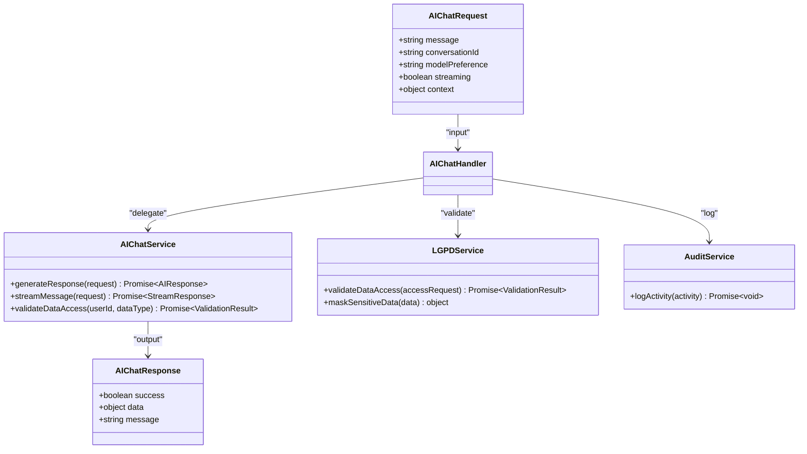

# Route Structure

<cite>
**Referenced Files in This Document**
- [app.ts](file://apps/api/src/app.ts)
- [patients/index.ts](file://apps/api/src/routes/patients/index.ts)
- [patients/create.ts](file://apps/api/src/routes/patients/create.ts)
- [patients/update.ts](file://apps/api/src/routes/patients/update.ts)
- [ai/index.ts](file://apps/api/src/routes/ai/index.ts)
- [ai/chat.ts](file://apps/api/src/routes/ai/chat.ts)
- [ai/analyze.ts](file://apps/api/src/routes/ai/analyze.ts)
</cite>

## Table of Contents

1. [Introduction](#introduction)
2. [Project Structure](#project-structure)
3. [Core Components](#core-components)
4. [Architecture Overview](#architecture-overview)
5. [Detailed Component Analysis](#detailed-component-analysis)
6. [Dependency Analysis](#dependency-analysis)
7. [Performance Considerations](#performance-considerations)
8. [Troubleshooting Guide](#troubleshooting-guide)
9. [Conclusion](#conclusion)

## Introduction

The neonpro application implements a robust, healthcare-compliant routing system built on Hono and integrated with TanStack Router for client-side navigation. The API routes are organized by functional domains including AI, patients, billing, and healthcare services, following a hierarchical structure that ensures scalability, maintainability, and compliance with Brazilian healthcare regulations (LGPD, CFM, ANVISA). This document provides a comprehensive analysis of the route structure, detailing how requests are processed from entry point through middleware to service layers.

## Project Structure

The route structure follows a domain-driven design pattern with clear separation of concerns. Routes are organized under the `apps/api/src/routes` directory, with subdirectories for each functional domain: AI, patients, billing, and healthcare services. The system uses a hybrid approach combining file-based routing with programmatic route composition, allowing for both organizational clarity and flexible configuration.

**Diagram sources**

- [app.ts](file://apps/api/src/app.ts#L72-L100)
- [routes directory](file://apps/api/src/routes)

**Section sources**

- [app.ts](file://apps/api/src/app.ts#L1-L100)
- [routes directory](file://apps/api/src/routes)

## Core Components

The routing system consists of several core components working together to handle HTTP requests. At the foundation is the Hono framework, which provides the base router functionality. On top of this, custom middleware handles authentication, authorization, error handling, and compliance requirements. Each route delegates to service layers that contain the business logic, ensuring separation of concerns and testability.

**Section sources**

- [app.ts](file://apps/api/src/app.ts#L72-L100)
- [middleware directory](file://apps/api/src/middleware)

## Architecture Overview

The architecture follows a layered approach with clear separation between routing, middleware, controllers, and services. Requests enter through the main app.ts file, where they pass through a series of middleware functions before reaching the appropriate route handler. Each route handler validates input, processes the request by calling service methods, and returns a properly formatted response with appropriate headers.

**Diagram sources**

- [app.ts](file://apps/api/src/app.ts#L72-L150)
- [middleware directory](file://apps/api/src/middleware)

## Detailed Component Analysis

### Patient Management Routes

The patient management routes provide CRUD operations for patient records with comprehensive validation and LGPD compliance. These routes are organized under the `/api/v2/patients` namespace and include specialized endpoints for bulk operations, document uploads, and export functionality.

#### Patient Creation Flow

**Diagram sources**

- [patients/create.ts](file://apps/api/src/routes/patients/create.ts#L1-L50)
- [services/patient-service](file://apps/api/src/services/patient-service)

**Section sources**

- [patients/create.ts](file://apps/api/src/routes/patients/create.ts#L1-L299)
- [patients/index.ts](file://apps/api/src/routes/patients/index.ts#L1-L29)

#### Patient Update Flow

**Diagram sources**

- [patients/update.ts](file://apps/api/src/routes/patients/update.ts#L1-L50)
- [services/patient-service](file://apps/api/src/services/patient-service)

**Section sources**

- [patients/update.ts](file://apps/api/src/routes/patients/update.ts#L1-L329)
- [services/lgpd-service](file://apps/api/src/services/lgpd-service)

### AI Service Routes

The AI service routes provide advanced artificial intelligence capabilities for healthcare applications, including chat, analysis, and diagnostic support. These routes are organized under the `/api/v2/ai` namespace and follow a modular design pattern that allows for easy extension of new AI capabilities.

#### AI Chat Endpoint

**Diagram sources**

- [ai/chat.ts](file://apps/api/src/routes/ai/chat.ts#L1-L50)
- [services/ai-chat-service](file://apps/api/src/services/ai-chat-service)

**Section sources**

- [ai/chat.ts](file://apps/api/src/routes/ai/chat.ts#L1-L754)
- [services/ai-chat-service](file://apps/api/src/services/ai-chat-service)

#### AI Analysis Endpoint

**Diagram sources**

- [ai/analyze.ts](file://apps/api/src/routes/ai/analyze.ts#L1-L50)
- [services/ai-chat-service](file://apps/api/src/services/ai-chat-service)

**Section sources**

- [ai/analyze.ts](file://apps/api/src/routes/ai/analyze.ts#L1-L294)
- [services/ai-chat-service](file://apps/api/src/services/ai-chat-service)

## Dependency Analysis

The route system has well-defined dependencies between components, following the dependency inversion principle. Routes depend on abstract service interfaces rather than concrete implementations, allowing for easier testing and maintenance. The middleware layer provides cross-cutting concerns like security, logging, and error handling that are applied consistently across all routes.

**Diagram sources**

- [app.ts](file://apps/api/src/app.ts#L72-L100)
- [routes directory](file://apps/api/src/routes)
- [services directory](file://apps/api/src/services)

**Section sources**

- [app.ts](file://apps/api/src/app.ts#L72-L200)
- [services directory](file://apps/api/src/services)

## Performance Considerations

The routing system incorporates several performance optimizations to ensure fast response times and efficient resource utilization. Query timeout middleware enforces a maximum processing time of 2 seconds, meeting healthcare compliance requirements. Compression middleware reduces payload sizes for HTTPS responses, improving network efficiency. The use of Hono's lightweight router minimizes overhead for route matching and dispatch.

Additionally, the system implements rate limiting to prevent abuse and ensure fair usage of resources. For AI endpoints, streaming responses are supported to reduce perceived latency for long-running operations. The architecture also supports caching at multiple levels, though specific cache implementation details are handled at the service layer rather than in the routes themselves.

## Troubleshooting Guide

When troubleshooting issues with the routing system, start by examining the request flow through the middleware chain. Common issues include authentication failures, validation errors, and permission denials. The comprehensive audit logging system can help trace the path of a request and identify where it failed.

For patient-related routes, ensure that LGPD consent is properly provided and validated. For AI routes, verify that the appropriate models are available and that data access permissions are correctly configured. When debugging, check the response headers for compliance indicators like X-CFM-Compliant and X-LGPD-Compliant, which indicate successful processing of regulatory requirements.

## Conclusion

The neonpro application's route structure demonstrates a well-architected, healthcare-compliant API design that balances functionality, security, and performance. By organizing routes by functional domains and implementing consistent middleware patterns, the system provides a maintainable foundation for healthcare applications. The integration of Hono with TanStack Router creates a seamless experience between server-side API routes and client-side navigation, while the emphasis on compliance ensures adherence to Brazilian healthcare regulations.
