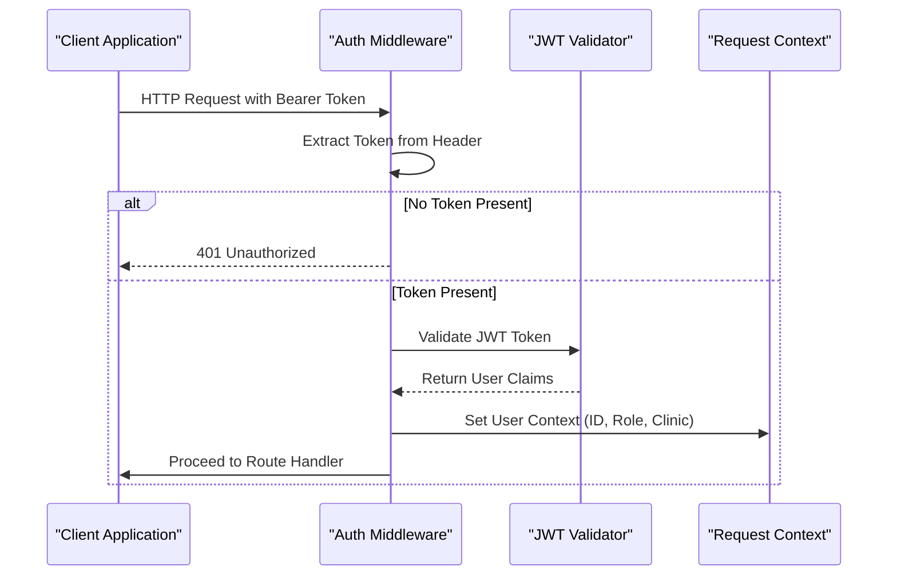
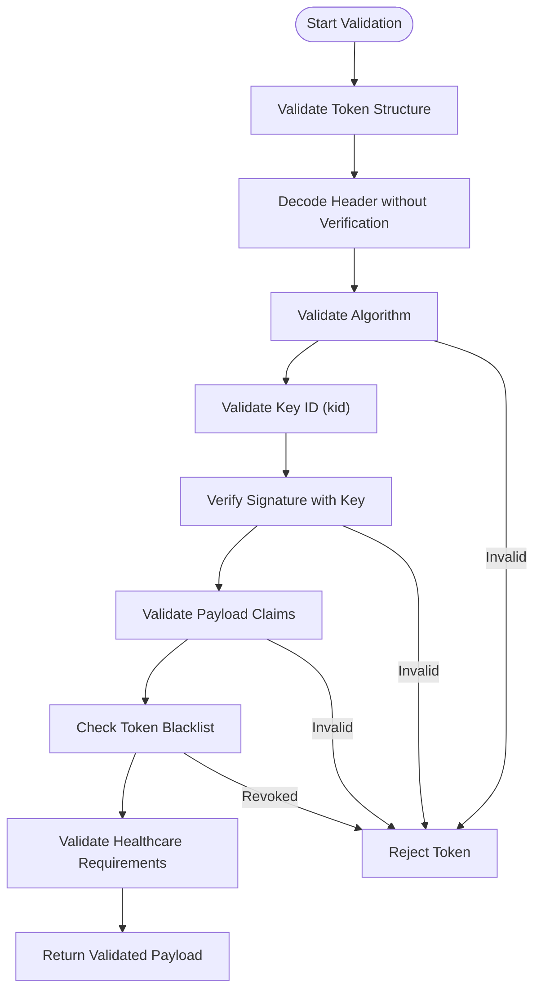
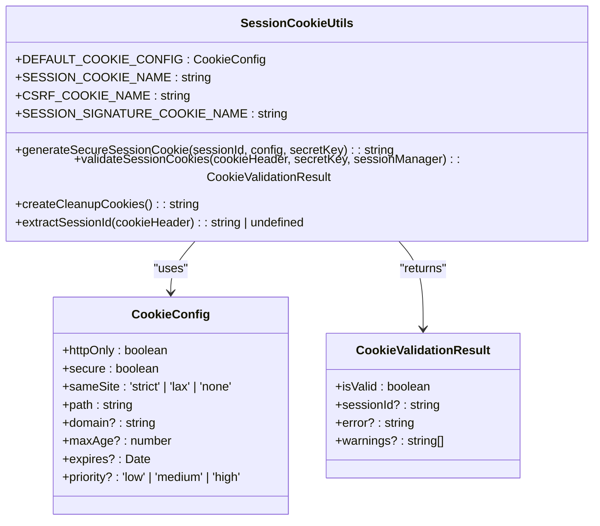
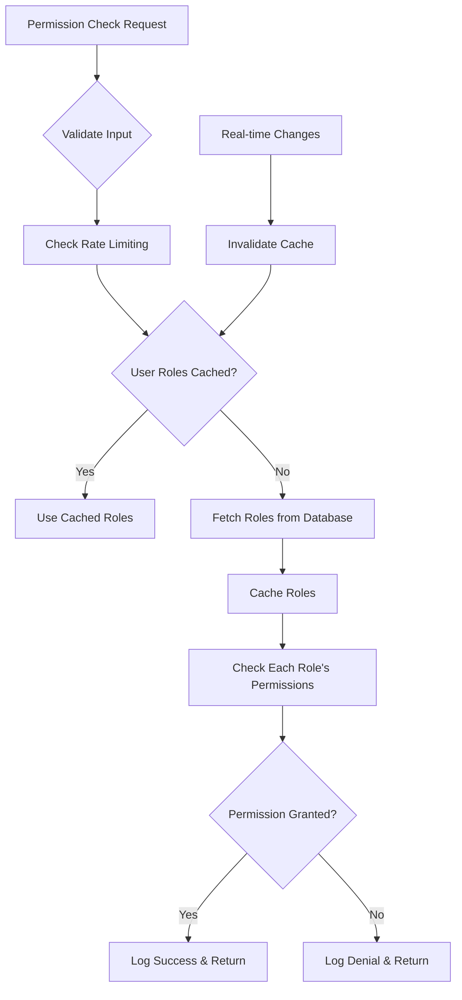

# Authentication and Authorization

<cite>
**Referenced Files in This Document **
- [auth.ts](file://apps/api/src/middleware/auth.ts)
- [jwt-validator.ts](file://apps/api/src/security/jwt-validator.ts)
- [agent-permissions.ts](file://apps/api/src/services/permissions/agent-permissions.ts)
- [session-cookie-utils.ts](file://apps/api/src/security/session-cookie-utils.ts)
- [aesthetic-mfa-service.ts](file://apps/api/src/security/aesthetic-mfa-service.ts)
</cite>

## Table of Contents

1. [Introduction](#introduction)
2. [JWT-Based Authentication Flow](#jwt-based-authentication-flow)
3. [Token Validation and Security](#token-validation-and-security)
4. [Session Management with Secure Cookies](#session-management-with-secure-cookies)
5. [Role-Based Access Control (RBAC)](#role-based-access-control-rbac)
6. [User Identity Propagation and Row-Level Security](#user-identity-propagation-and-row-level-security)
7. [Multi-Factor Authentication](#multi-factor-authentication)
8. [Error Handling for Unauthorized Access](#error-handling-for-unauthorized-access)
9. [Conclusion](#conclusion)

## Introduction

The neonpro platform implements a comprehensive authentication and authorization system designed to meet healthcare compliance requirements while providing secure access to AI agent services. The system is built around JWT-based authentication, role-based access control, and multi-factor authentication capabilities. This document details the implementation of these security mechanisms across the codebase.

## JWT-Based Authentication Flow

The authentication system in neonpro follows a standard JWT-based flow implemented through middleware and validation services. The core authentication process begins with the `auth()` middleware function defined in `auth.ts`, which intercepts incoming requests and validates authentication tokens.

When a request arrives, the middleware extracts the JWT token from the Authorization header using the `extractToken()` helper function. If no token is present, the system returns a 401 Unauthorized response. Valid tokens are then processed through the JWT validation pipeline, where user identity is established and attached to the request context.

**Diagram sources **

- [auth.ts](file://apps/api/src/middleware/auth.ts#L50-L150)

**Section sources**

- [auth.ts](file://apps/api/src/middleware/auth.ts#L1-L283)

## Token Validation and Security

The JWT validation process is handled by the `JWTSecurityValidator` class in `jwt-validator.ts`, which implements comprehensive security checks following OWASP best practices and healthcare compliance requirements. The validator performs multiple layers of verification to ensure token integrity and prevent common attacks.

Key security features include:

- Algorithm confusion attack prevention by rejecting 'none' algorithm and validating allowed algorithms
- Audience and issuer claim validation against configured values
- Expiration time validation with maximum lifetime enforcement
- Key ID (kid) validation for proper key rotation support
- Rate limiting for authentication attempts to prevent brute force attacks
- Token blacklisting for revocation capabilities

The validation process follows a step-by-step approach, checking token structure, header integrity, signature validity, and payload claims. Each validation step contributes to an overall security level assessment, with critical issues like algorithm confusion receiving the highest severity rating.

**Diagram sources **

- [jwt-validator.ts](file://apps/api/src/security/jwt-validator.ts#L150-L400)

**Section sources**

- [jwt-validator.ts](file://apps/api/src/security/jwt-validator.ts#L1-L712)

## Session Management with Secure Cookies

For web-based sessions, neonpro implements secure cookie management through the `SessionCookieUtils` class. Session cookies are configured with strict security attributes to prevent common web vulnerabilities. The system uses three related cookies for comprehensive session management: a session ID cookie, a CSRF token cookie, and a session signature cookie.

All session cookies are configured with the HttpOnly flag to prevent client-side script access, the Secure flag to ensure transmission only over HTTPS, and the SameSite=strict attribute to mitigate cross-site request forgery attacks. The default configuration sets a reasonable maximum age of 8 hours to limit exposure from stolen cookies.

The session cookie generation process includes cryptographic signing to ensure integrity, preventing tampering with session identifiers. When users log out, the system creates cleanup cookies with immediate expiration to properly terminate sessions on the client side.

**Diagram sources **

- [session-cookie-utils.ts](file://apps/api/src/security/session-cookie-utils.ts#L1-L350)

**Section sources**

- [session-cookie-utils.ts](file://apps/api/src/security/session-cookie-utils.ts#L1-L350)

## Role-Based Access Control (RBAC)

The authorization system in neonpro implements a sophisticated role-based access control model through the `AgentPermissionService` class. This service evaluates permissions based on user roles, resource types, and actions, ensuring appropriate access levels across different user types including administrators, clinic staff, healthcare professionals, and patients.

The permission service supports five primary roles with distinct access patterns:

- **admin**: Full system access
- **clinic_admin**: Clinic-wide administrative access
- **professional**: Access limited to assigned patients
- **staff**: Read-only access to clinic data
- **patient**: Access limited to their own data

Permissions are evaluated through a hierarchical process that first retrieves user roles from the database (with caching), then checks each role's permissions against the requested action and resource. The system implements fail-secure principles, denying access when errors occur during permission evaluation.

**Diagram sources **

- [agent-permissions.ts](file://apps/api/src/services/permissions/agent-permissions.ts#L1-L1021)

**Section sources**

- [agent-permissions.ts](file://apps/api/src/services/permissions/agent-permissions.ts#L1-L1021)

## User Identity Propagation and Row-Level Security

The authentication system ensures user identity is properly propagated throughout the request lifecycle and enforced at the database level through row-level security (RLS). When a user is authenticated, their identity (user ID, role, and clinic ID) is attached to the request context using Hono's `c.set()` method.

This contextual information is then available to downstream services and database queries, enabling fine-grained access control. The permission service integrates with Supabase to enforce RLS policies that restrict data access based on the authenticated user's context. For example, healthcare professionals can only access patient records they are assigned to, while clinic administrators have access to all patients within their clinic.

Database queries include the user's context to ensure compliance with LGPD and other healthcare regulations. The system also logs permission checks for audit purposes, capturing details such as the requested action, resource, processing time, and whether access was granted or denied.

## Multi-Factor Authentication

neonpro supports multi-factor authentication through the `AestheticMFAService` implementation, which provides TOTP-based second factor authentication. The MFA system follows a standard setup and verification flow, generating time-based one-time passwords using the TOTP algorithm.

During MFA setup, users receive a QR code containing their secret key and a set of backup codes for emergency access. The system stores encrypted MFA configurations in the database and maintains active MFA sessions in memory with appropriate expiration times. Risk assessment is performed during verification, considering factors like IP address reputation, geolocation anomalies, and unusual login times.

The MFA service also implements comprehensive security logging, recording all MFA-related events with risk scores for monitoring and incident response. Backup codes can be regenerated when needed, with proper audit trails maintained for compliance purposes.

## Error Handling for Unauthorized Access

The authentication and authorization system implements consistent error handling for unauthorized and forbidden access attempts. Unauthorized requests (missing or invalid authentication) receive HTTP 401 responses, while authorized but insufficient permission requests receive HTTP 403 responses.

All authentication failures are logged with appropriate severity levels, including contextual information such as the request path, method, and client IP address. The system distinguishes between expected failures (invalid tokens) and potential security incidents (repeated failed attempts), applying rate limiting to prevent brute force attacks.

The error handling follows fail-secure principles, ensuring that any unexpected errors during authentication or authorization result in access denial rather than unintended access grants. Detailed error messages are avoided in production to prevent information disclosure, while sufficient logging is maintained for debugging and security monitoring.

## Conclusion

The authentication and authorization system in neonpro provides a robust security foundation for the healthcare AI platform. By combining JWT-based authentication, comprehensive token validation, secure session management, role-based access control, and multi-factor authentication, the system meets stringent healthcare compliance requirements while providing flexible access controls for different user types. The implementation emphasizes security best practices, fail-secure principles, and comprehensive auditing to ensure both protection of sensitive health data and accountability for access decisions.
