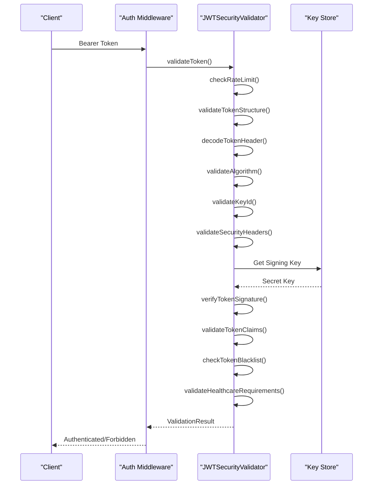
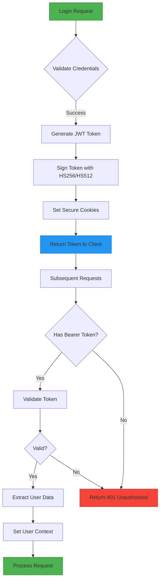
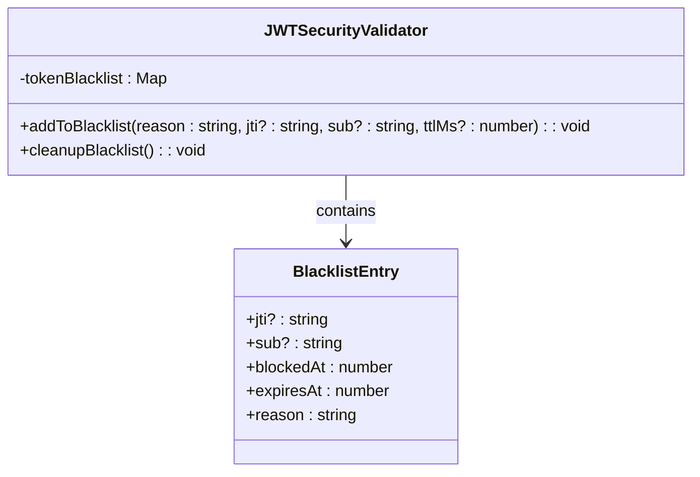
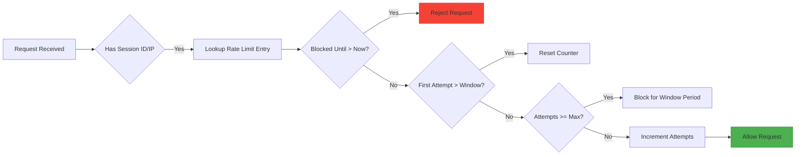

# JWT Authentication

<cite>
**Referenced Files in This Document**
- [jwt-validator.ts](file://apps/api/src/security/jwt-validator.ts)
- [authn.ts](file://apps/api/src/middleware/authn.ts)
- [session-cookie-utils.ts](file://apps/api/src/security/session-cookie-utils.ts)
- [enhanced-session-manager.ts](file://apps/api/src/security/enhanced-session-manager.ts)
</cite>

## Table of Contents

1. [Introduction](#introduction)
2. [JWT Token Structure and Claims](#jwt-token-structure-and-claims)
3. [Token Validation Process](#token-validation-process)
4. [Authentication Flow](#authentication-flow)
5. [Security Configuration](#security-configuration)
6. [Token Revocation and Blacklisting](#token-revocation-and-blacklisting)
7. [Rate Limiting and Abuse Prevention](#rate-limiting-and-abuse-prevention)
8. [Protected Routes and Authorization](#protected-routes-and-authorization)
9. [Session Management Integration](#session-management-integration)
10. [Security Considerations](#security-considerations)

## Introduction

The neonpro platform implements a comprehensive JWT authentication system designed to meet healthcare compliance requirements (LGPD, ANVISA) while following OWASP security best practices. The system provides robust token validation, secure session management, and protection against common attacks such as algorithm confusion, replay attacks, and token leakage. This document details the implementation of JWT generation, signing, verification, and associated security mechanisms.

**Section sources**

- [jwt-validator.ts](file://apps/api/src/security/jwt-validator.ts#L1-L711)

## JWT Token Structure and Claims

The JWT tokens used in neonpro follow standard structure with specific claims required for healthcare applications. Each token consists of three parts: header, payload, and signature.

### Required Claims

The system validates the following standard JWT claims:

- **sub**: Subject identifier (user ID), required and must be a string
- **exp**: Expiration time, required and must not exceed 24 hours from issuance
- **iat**: Issued at time, automatically included during token creation
- **aud**: Audience claim, must be "authenticated" or in allowed audiences list
- **iss**: Issuer claim, must match configured issuers including Supabase endpoints

### Healthcare-Specific Claims

Additional claims are validated for healthcare compliance:

- **role**: User role, restricted to approved values including 'patient', 'healthcare_professional', 'admin', and 'staff'
- **clinic_id**: Clinic identifier for multi-tenant access control
- **email**: User email address for identity verification

The system enforces strict validation of these claims during the token verification process to ensure only properly formatted and authorized tokens are accepted.

**Section sources**

- [jwt-validator.ts](file://apps/api/src/security/jwt-validator.ts#L370-L415)

## Token Validation Process

The JWT validation process in neonpro follows a comprehensive 10-step security check to ensure token integrity and authenticity.



**Diagram sources**

- [jwt-validator.ts](file://apps/api/src/security/jwt-validator.ts#L130-L225)
- [authn.ts](file://apps/api/src/middleware/authn.ts#L29-L111)

### Step-by-Step Validation

1. **Rate Limit Check**: Prevents brute force attacks by limiting authentication attempts
2. **Structure Validation**: Ensures token has exactly three parts separated by dots
3. **Header Analysis**: Decodes and examines the token header without verification
4. **Algorithm Validation**: Confirms the signing algorithm is allowed and prevents "none" algorithm attacks
5. **Key ID Validation**: Verifies the key ID exists in the keystore for proper key rotation support
6. **Security Headers**: Validates HTTPS usage in production environments
7. **Signature Verification**: Uses the appropriate secret key to verify token integrity
8. **Claim Validation**: Checks all required claims including expiration, audience, and issuer
9. **Blacklist Check**: Determines if the token or user has been revoked
10. **Healthcare Requirements**: Validates role and other healthcare-specific constraints

Each step returns detailed error information and security level assessment to aid in monitoring and debugging.

**Section sources**

- [jwt-validator.ts](file://apps/api/src/security/jwt-validator.ts#L130-L225)

## Authentication Flow

The authentication flow begins with a login request and proceeds through token issuance and validation for subsequent requests.



**Diagram sources**

- [authn.ts](file://apps/api/src/middleware/authn.ts#L29-L111)
- [jwt-validator.ts](file://apps/api/src/security/jwt-validator.ts#L130-L225)

### Login and Token Issuance

When a user logs in successfully:

1. Credentials are verified against the database using bcrypt hashing
2. A JWT token is generated with appropriate claims including sub, exp, iat, aud, iss, and role
3. The token is signed using HS256 or HS512 algorithm with a secret key from the keystore
4. Secure session cookies are set with HttpOnly, Secure, and SameSite=Strict attributes
5. The token is returned to the client in the response

For password hashing, the system uses bcrypt with appropriate work factors to protect against brute force attacks, though the specific implementation details are managed by the underlying authentication provider.

**Section sources**

- [authn.ts](file://apps/api/src/middleware/authn.ts#L186-L237)

## Security Configuration

The JWT authentication system is highly configurable through security settings that can be adjusted based on environment and compliance requirements.

### Configuration Options

```typescript
interface JWTSecurityConfig {
  algorithms: Algorithm[] // Allowed signing algorithms
  allowedAudiences: string[] // Permitted audience values
  allowedIssuers: string[] // Trusted token issuers
  maxExpirationHours: number // Maximum token lifetime
  requireKeyId: boolean // Whether kid claim is required
  enforceHttpsInProduction: boolean // HTTPS enforcement
  rateLimitWindowMs: number // Rate limiting window
  rateLimitMaxAttempts: number // Maximum attempts per window
}
```

### Default Settings

- **Algorithms**: HS256 and HS512 for symmetric signing
- **Audience**: 'authenticated' as default audience
- **Issuers**: Configured based on SUPABASE_URL environment variable
- **Maximum Expiration**: 24 hours to limit exposure window
- **Rate Limiting**: 100 attempts per minute per client
- **HTTPS Enforcement**: Required in production environments

The configuration is initialized with sensible defaults but can be overridden during validator instantiation for testing or special deployment scenarios.

**Section sources**

- [jwt-validator.ts](file://apps/api/src/security/jwt-validator.ts#L75-L125)

## Token Revocation and Blacklisting

The system implements multiple token revocation strategies to handle logout, compromised tokens, and user deactivation.

### Token Blacklist Mechanism

The `JWTSecurityValidator` maintains an in-memory blacklist of revoked tokens using a Map data structure:



**Diagram sources**

- [jwt-validator.ts](file://apps/api/src/security/jwt-validator.ts#L570-L595)

### Revocation Strategies

1. **Individual Token Revocation**: Tokens can be blacklisted by their JWT ID (jti) when a user logs out
2. **User-Wide Revocation**: All tokens for a user can be invalidated by their subject (sub) when credentials change
3. **Automatic Cleanup**: Expired blacklist entries are removed periodically to prevent memory leaks

The `addToBlacklist` method allows specifying a reason and custom TTL for the revocation entry. For user-wide revocation, the system checks all blacklist entries for matching subject claims during validation.

Tokens are checked against the blacklist during the validation process before any other business logic is executed, ensuring revoked tokens are rejected immediately.

**Section sources**

- [jwt-validator.ts](file://apps/api/src/security/jwt-validator.ts#L570-L595)

## Rate Limiting and Abuse Prevention

The authentication system includes built-in rate limiting to prevent brute force attacks and denial-of-service attempts.

### Rate Limiting Implementation



**Diagram sources**

- [jwt-validator.ts](file://apps/api/src/security/jwt-validator.ts#L500-L565)

### Protection Mechanisms

- **Per-Client Tracking**: Rate limits are tracked by session ID or IP address
- **Sliding Window**: 1-minute window with configurable attempt limits
- **Automatic Blocking**: Clients exceeding limits are blocked for the duration of the window
- **Memory Management**: Expired rate limit entries are cleaned up periodically

The system uses a Map to store rate limit entries keyed by client identifier. Each entry tracks the number of attempts, first attempt time, and optional block expiration. The default configuration allows 100 attempts per minute, which can be adjusted based on security requirements.

Rate limiting is applied at the beginning of the token validation process, preventing excessive processing for potentially malicious requests.

**Section sources**

- [jwt-validator.ts](file://apps/api/src/security/jwt-validator.ts#L500-L565)

## Protected Routes and Authorization

The system provides middleware for protecting routes and enforcing role-based access control.

### Authentication Middleware

The `authenticationMiddleware` function validates JWT tokens on protected routes:

```typescript
export function authenticationMiddleware() {
  return async (c: Context, next: Next) => {
    // Extract Bearer token from authorization header
    // Validate token using JWTSecurityValidator
    // Extract user data from validated token
    // Set user context for downstream handlers
    // Proceed to next middleware or handler
  }
}
```

### Authorization Middleware

Complementary middleware enforces role-based access:

```typescript
export function authorizationMiddleware(allowedRoles: string[] = []) {
  return async (c: Context, next: Next) => {
    const user = c.get('user')
    if (!user || !allowedRoles.includes(user._role)) {
      throw new HTTPException(403, { message: 'Insufficient permissions' })
    }
    await next()
  }
}
```

Multiple middleware functions can be combined to create comprehensive protection:

```typescript
// Require authentication and specific roles
app.use('/admin/*', requireAuth(['admin']))
app.use('/provider/*', requireAuth(['healthcare_professional', 'admin']))
```

The middleware extracts user information from the validated token and makes it available to downstream handlers through the context object.

**Section sources**

- [authn.ts](file://apps/api/src/middleware/authn.ts#L29-L111)

## Session Management Integration

The JWT authentication system integrates with enhanced session management for additional security layers.

### Secure Cookie Handling

The `SessionCookieUtils` class manages secure session cookies:

```mermaid
classDiagram
class SessionCookieUtils {
+SESSION_COOKIE_NAME : string
+CSRF_COOKIE_NAME : string
+SESSION_SIGNATURE_COOKIE_NAME : string
+generateSecureSessionCookie(sessionId : string, config : Partial<CookieConfig>, secretKey : string) : string
+validateSessionCookies(cookieHeader : string, secretKey : string, sessionManager : EnhancedSessionManager) : CookieValidationResult
+createCleanupCookies() : string
}
class EnhancedSessionManager {
+validateAndUpdateSession(sessionId : string, currentIP? : string, userAgent? : string) : ValidationResult
+createSession(userId : string, metadata : Partial<Metadata>) : string
+removeSession(sessionId : string) : boolean
}
SessionCookieUtils --> EnhancedSessionManager : uses
```

**Diagram sources**

- [session-cookie-utils.ts](file://apps/api/src/security/session-cookie-utils.ts#L1-L405)
- [enhanced-session-manager.ts](file://apps/api/src/security/enhanced-session-manager.ts#L92-L797)

### Enhanced Session Features

The `EnhancedSessionManager` provides:

- **IP Binding**: Sessions are bound to the originating IP address with tolerance for mobile networks
- **Fixation Protection**: Session IDs are regenerated upon authentication
- **Concurrent Session Limits**: Maximum of 3 concurrent sessions per user
- **Anomaly Detection**: Monitors for suspicious activity like rapid IP changes
- **Timeout Controls**: 30-minute idle timeout and 8-hour absolute timeout

These features work in conjunction with JWT authentication to provide defense in depth, where the JWT serves as the primary authentication mechanism and the session manager provides additional security context and controls.

**Section sources**

- [session-cookie-utils.ts](file://apps/api/src/security/session-cookie-utils.ts#L1-L405)
- [enhanced-session-manager.ts](file://apps/api/src/security/enhanced-session-manager.ts#L92-L797)

## Security Considerations

The JWT authentication system addresses multiple security concerns to protect against common attacks and vulnerabilities.

### Attack Protections

- **Algorithm Confusion**: Explicitly rejects 'none' algorithm and validates against allowed list
- **Replay Attacks**: Short token expiration (24 hours maximum) and blacklist for immediate revocation
- **Token Leakage**: Secure cookie attributes (HttpOnly, Secure, SameSite) prevent XSS and CSRF
- **Brute Force**: Rate limiting on authentication attempts
- **Session Fixation**: Session regeneration on login
- **IP Spoofing**: IP binding with anomaly detection for suspicious changes

### Error Handling

The system provides careful error messaging to avoid information disclosure:

- Generic error messages for invalid tokens ("Invalid or expired token")
- Detailed logging for monitoring and investigation
- No distinction between non-existent users and incorrect passwords
- Rate limit exceeded messages without revealing remaining attempts

### Cryptographic Practices

- **Signing Algorithms**: HS256 and HS512 for symmetric signing
- **Key Management**: Secrets stored in environment variables with fallback for development
- **Key Rotation**: Support for multiple keys via kid parameter
- **Entropy**: High-entropy session IDs (128 bits) for session fixation protection

The implementation follows industry standards and best practices while incorporating healthcare-specific compliance requirements for patient data protection.

**Section sources**

- [jwt-validator.ts](file://apps/api/src/security/jwt-validator.ts#L1-L711)
- [session-cookie-utils.ts](file://apps/api/src/security/session-cookie-utils.ts#L1-L405)
- [enhanced-session-manager.ts](file://apps/api/src/security/enhanced-session-manager.ts#L92-L797)
