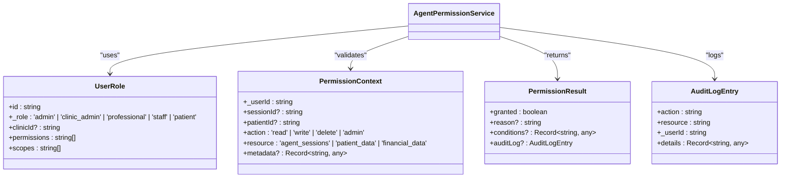
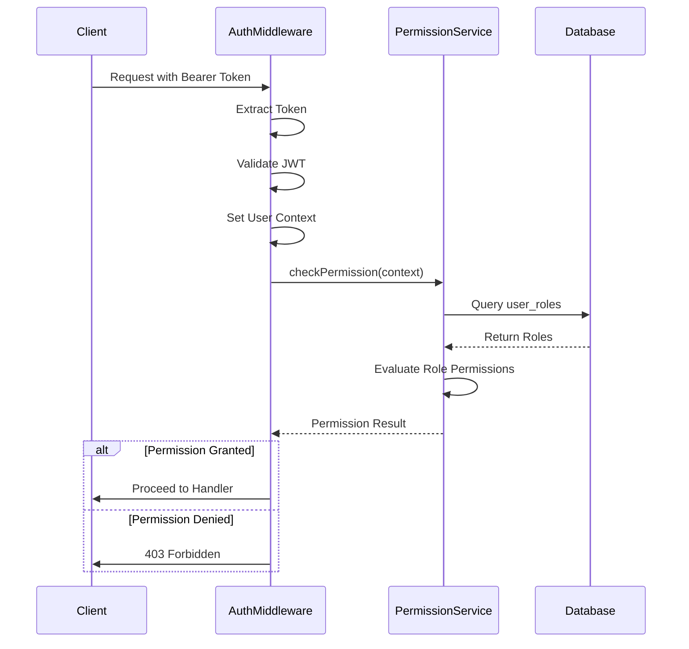
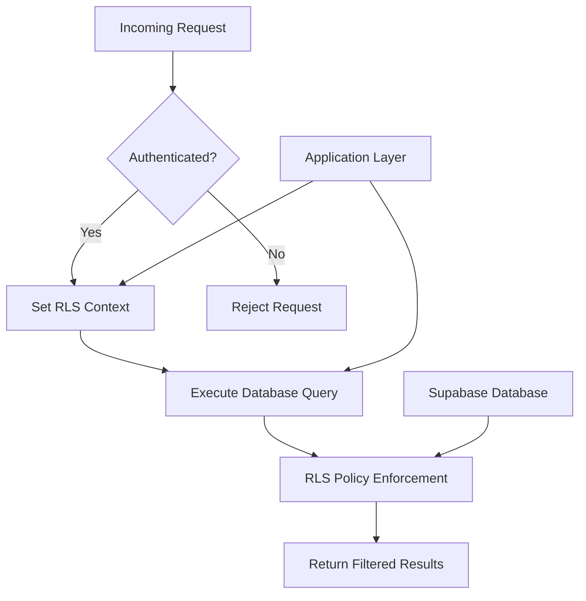

# Role-Based Access Control

<cite>
**Referenced Files in This Document**
- [agent-permissions.ts](file://apps/api/src/services/permissions/agent-permissions.ts)
- [auth.ts](file://apps/api/src/middleware/auth.ts)
- [rls-policies.ts](file://apps/api/src/security/rls-policies.ts)
</cite>

## Table of Contents

1. [Introduction](#introduction)
2. [Permission Model and Roles](#permission-model-and-roles)
3. [User Permission Assignment](#user-permission-assignment)
4. [Permission Checking in Auth Middleware](#permission-checking-in-auth-middleware)
5. [Fine-Grained Access Controls](#fine-grained-access-controls)
6. [Integration with Row-Level Security (RLS)](#integration-with-row-level-security-rls)
7. [Permission Inheritance and Escalation Paths](#permission-inheritance-and-escalation-paths)
8. [Audit Logging of Access Control Decisions](#audit-logging-of-access-control-decisions)
9. [Extending the Permission System](#extending-the-permission-system)

## Introduction

The Role-Based Access Control (RBAC) system in neonpro is designed to enforce strict access policies across healthcare data, AI agent interactions, and administrative functions. It integrates with Supabase for database-level security, implements fine-grained route protection via middleware, and ensures compliance with LGPD regulations through comprehensive audit logging. The system supports multiple roles including admin, clinic_admin, professional, staff, and patient, each with clearly defined capabilities and scope limitations.

**Section sources**

- [agent-permissions.ts](file://apps/api/src/services/permissions/agent-permissions.ts#L0-L1021)

## Permission Model and Roles

The permission model is defined in `agent-permissions.ts` and revolves around a structured set of roles: **admin**, **clinic_admin**, **professional**, **staff**, and **patient**. Each role has specific permissions that determine what actions they can perform on various resources such as agent sessions, patient data, and financial records.

Permissions are expressed in the format `{action}:{resource}`, where action can be _read_, _write_, _delete_, or _admin_, and resource includes types like _agent_sessions_, _patient_data_, or _financial_data_. Wildcard permissions (`*:*`) grant full access and are reserved for administrative roles.

Role-specific capabilities include:

- **Admin**: Full global access to all resources.
- **Clinic Admin**: Clinic-wide access, including managing patients and billing within their clinic.
- **Professional**: Access limited to assigned patients, with read/write privileges on medical and agent data.
- **Staff**: Read-only access to clinic data, excluding financial information.
- **Patient**: Can only read their own agent session data.

This hierarchical structure ensures least-privilege access while supporting delegation and supervision patterns required in clinical environments.

**Diagram sources**

- [agent-permissions.ts](file://apps/api/src/services/permissions/agent-permissions.ts#L38-L88)

**Section sources**

- [agent-permissions.ts](file://apps/api/src/services/permissions/agent-permissions.ts#L38-L88)

## User Permission Assignment

Permissions are assigned to users through the `AgentPermissionService`, which retrieves role-based permissions from the `user_roles` and `role_permissions` database tables. When a user logs in, their roles are fetched and cached for 5 minutes to optimize performance. The service validates and sanitizes all inputs using Zod schemas to prevent injection attacks.

Each user may have multiple roles, and the system checks each role sequentially until a matching permission is found. Permissions are stored as strings in the format `{action}:{resource}` and are validated against predefined lists to ensure correctness.

Caching uses SHA-256 hashing of the user ID combined with a salt to generate secure cache keys. Real-time cache invalidation is implemented via Supabase's real-time channels, ensuring immediate propagation of permission changes across instances.

**Section sources**

- [agent-permissions.ts](file://apps/api/src/services/permissions/agent-permissions.ts#L200-L250)

## Permission Checking in Auth Middleware

Permission checks occur during request processing via the authentication middleware located in `auth.ts`. After JWT token validation, the middleware sets user context including `_userId`, `_role`, and `clinicId`. Subsequent route handlers use higher-order functions like `requireRole()` and `requirePermission()` to enforce access control.

For example, `requireAIAccess()` combines authentication with permission checks for AI-related endpoints, requiring either `ai_access` or `admin` privileges. These middleware functions throw HTTP 401 or 403 errors when access is denied, with detailed logging for audit purposes.

The middleware also enforces clinic isolation by comparing the requested `clinicId` parameter with the user’s assigned `clinicId`, preventing cross-clinic data access.

**Diagram sources**

- [auth.ts](file://apps/api/src/middleware/auth.ts#L56-L117)
- [agent-permissions.ts](file://apps/api/src/services/permissions/agent-permissions.ts#L131-L174)

**Section sources**

- [auth.ts](file://apps/api/src/middleware/auth.ts#L56-L117)

## Fine-Grained Access Controls

Fine-grained access controls are enforced at both route and data levels. At the route level, middleware functions restrict access based on roles or specific permissions. At the data level, the `AgentPermissionService` evaluates context-aware conditions such as patient assignments, session ownership, and time-based restrictions.

For instance, professionals can only access patient data if there is an active assignment in the `professional_patient_assignments` table. Similarly, patients can only access their own agent sessions, verified through `session.user_id === _userId`.

Additional security measures include:

- Session age validation (max 24 hours)
- Rate limiting on permission checks (50 requests per minute)
- Input sanitization to prevent SQL/HTML injection
- Secure cache key generation using cryptographic hashing

These layered controls ensure robust protection even if one layer is compromised.

**Section sources**

- [agent-permissions.ts](file://apps/api/src/services/permissions/agent-permissions.ts#L300-L450)

## Integration with Row-Level Security (RLS)

The RBAC system integrates tightly with Supabase's Row-Level Security (RLS) policies defined in `rls-policies.ts`. RLS enforces data isolation at the database level by restricting row visibility based on user identity, role, and context.

The `AdvancedRLSPolicies` class defines SQL policies for healthcare tables like `patients`, `medical_records`, and `billing_records`. These policies use PostgreSQL `USING` expressions that reference runtime settings such as `current_setting('app.user_role')` and `current_setting('app.current_clinic_id')`.

Before executing database queries, the application calls `setRLSContext()` to configure these settings based on the authenticated user. This ensures that even direct database access respects organizational boundaries and compliance requirements.

Emergency access bypasses time restrictions but triggers enhanced audit logging, maintaining accountability during critical situations.

**Diagram sources**

- [rls-policies.ts](file://apps/api/src/security/rls-policies.ts#L40-L634)

**Section sources**

- [rls-policies.ts](file://apps/api/src/security/rls-policies.ts#L40-L634)

## Permission Inheritance and Escalation Paths

The system implements a clear role hierarchy without implicit inheritance. Higher-privileged roles do not automatically inherit lower-role permissions but are granted broader explicit permissions.

Escalation paths are strictly controlled:

- Only admins can assign new roles or modify permissions.
- Clinic admins can manage staff and professionals within their clinic.
- Professionals require explicit patient assignments to access records.
- Emergency access requires justification and is logged comprehensively.

There are no self-escalation mechanisms; privilege elevation must go through administrative workflows outside this system. This prevents privilege abuse and maintains separation of duties.

**Section sources**

- [agent-permissions.ts](file://apps/api/src/services/permissions/agent-permissions.ts#L500-L550)

## Audit Logging of Access Control Decisions

All permission checks are audited through asynchronous logging to the `agent_audit_log` table. Each log entry includes:

- Action and resource involved
- User ID and role
- Grant/denial status
- Processing time
- Error details (if applicable)
- Cache version and timestamp

Logs are queued and processed asynchronously to avoid blocking request handling. Failed log attempts are retried silently, ensuring resilience under load.

Additionally, RLS context changes and suspicious activities (e.g., high-frequency permission checks) trigger separate security event logs, enabling detection of potential abuse patterns.

Compliance metadata is structured to support LGPD audit requirements, including consent verification and data subject rights tracking.

**Section sources**

- [agent-permissions.ts](file://apps/api/src/services/permissions/agent-permissions.ts#L657-L700)
- [rls-policies.ts](file://apps/api/src/security/rls-policies.ts#L300-L350)

## Extending the Permission System

To extend the permission system for new roles or features:

1. Define new role constants in `PERMISSION_TEMPLATES`
2. Add corresponding entries in the database schema
3. Implement role-specific logic in `checkRolePermission()`
4. Update RLS policies if new tables are introduced
5. Register new routes with appropriate middleware

For example, adding a "researcher" role would involve:

- Creating a new role type in `UserRole`
- Defining read-only access to anonymized datasets
- Implementing time-limited access tokens
- Adding RLS policies that mask sensitive fields

The modular design allows safe extension while preserving existing security guarantees.

**Section sources**

- [agent-permissions.ts](file://apps/api/src/services/permissions/index.ts#L53-L111)
- [agent-permissions.ts](file://apps/api/src/services/permissions/agent-permissions.ts#L1000-L1021)
