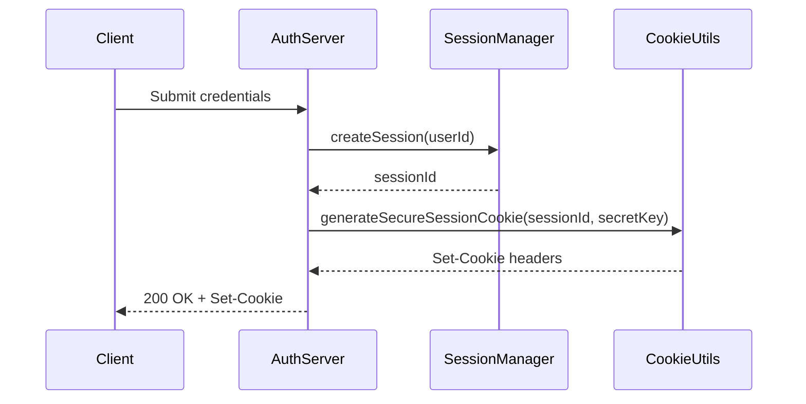
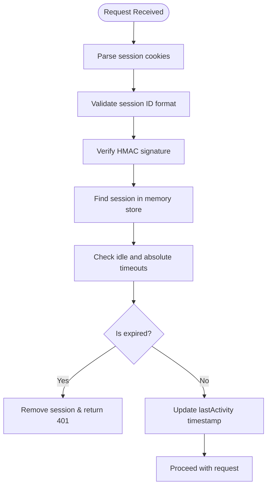

# Session Management

<cite>
**Referenced Files in This Document**
- [session-cookie-utils.ts](file://apps/api/src/security/session-cookie-utils.ts)
- [enhanced-session-manager.ts](file://apps/api/src/security/enhanced-session-manager.ts)
</cite>

## Table of Contents

1. [Introduction](#introduction)
2. [Session Establishment and Cookie Configuration](#session-establishment-and-cookie-configuration)
3. [Server-Side Session Storage and Authentication Integration](#server-side-session-storage-and-authentication-integration)
4. [Session Expiration and Renewal Policies](#session-expiration-and-renewal-policies)
5. [Logout Procedures and Session Invalidation](#logout-procedures-and-session-invalidation)
6. [Security Measures: Encryption, CSRF Protection, and Cross-Origin Considerations](#security-measures-encryption-csrf-protection-and-cross-origin-considerations)
7. [Monitoring, Cleanup, and Concurrent Login Handling](#monitoring-cleanup-and-concurrent-login-handling)

## Introduction

The session management system in neonpro ensures secure user authentication and state persistence through robust mechanisms for session creation, validation, and termination. This document details the implementation of HTTP-only, secure cookies with appropriate SameSite settings, as defined in `session-cookie-utils.ts` and integrated with server-side session storage via `EnhancedSessionManager`. The system enforces strict security policies including session fixation protection, IP binding, anomaly detection, and concurrent session limits. It also implements comprehensive expiration strategies, CSRF protection, and automated cleanup of expired sessions to maintain system integrity and compliance with OWASP standards.

## Session Establishment and Cookie Configuration

User sessions in neonpro are established using cryptographically secure session identifiers generated with high entropy (128 bits) to prevent predictability. Upon successful authentication, the system creates a session cookie named `sessionId` that is configured with critical security attributes: **HttpOnly**, **Secure**, and **SameSite=Strict** by default. These settings prevent client-side script access, ensure transmission only over HTTPS, and mitigate cross-site request forgery attacks by restricting cookie sending to same-origin requests.

In addition to the session ID cookie, two companion cookies are issued: a `csrfToken` accessible to JavaScript for inclusion in API requests, and a `sessionSig` containing a cryptographic signature of the session ID derived from a server-side secret key using HMAC. This signature ensures cookie integrity and prevents tampering. The `generateSecureSessionCookie` method orchestrates this multi-cookie pattern, allowing flexible configuration while maintaining secure defaults such as an 8-hour maximum age and high priority.



**Diagram sources**

- [session-cookie-utils.ts](file://apps/api/src/security/session-cookie-utils.ts#L48-L90)
- [enhanced-session-manager.ts](file://apps/api/src/security/enhanced-session-manager.ts#L430-L487)

**Section sources**

- [session-cookie-utils.ts](file://apps/api/src/security/session-cookie-utils.ts#L48-L90)
- [enhanced-session-manager.ts](file://apps/api/src/security/enhanced-session-manager.ts#L430-L487)

## Server-Side Session Storage and Authentication Integration

Sessions are stored server-side in memory using an `EnhancedSessionManager` instance that maintains two primary data structures: a `Map<string, EnhancedSessionMetadata>` for direct session lookup and a `Map<string, Set<string>>` to track all active sessions per user. Each session contains metadata including user ID, creation time, last activity timestamp, IP address, user agent, risk score, and security level.

During each authenticated request, the system validates the incoming session cookies using `validateSessionCookies`, which performs multiple checks: presence of required cookies, format validation of the session ID (32-character hex string), verification of the HMAC signature against the server secret, and confirmation that the session exists in the manager's store. If validation passes, the session's last activity time is updated, contributing to idle timeout calculations. The integration with authentication flow includes automatic session regeneration on login (`regenerateSession`) to prevent session fixation attacks.

**Section sources**

- [session-cookie-utils.ts](file://apps/api/src/security/session-cookie-utils.ts#L95-L179)
- [enhanced-session-manager.ts](file://apps/api/src/security/enhanced-session-manager.ts#L509-L656)

## Session Expiration and Renewal Strategies

neonpro implements dual-layer session expiration policies combining **idle timeout** and **absolute timeout**. By default, sessions expire after 30 minutes of inactivity or 8 hours of total duration, whichever occurs first. These values are configurable through the `SessionSecurityConfig` object. Before expiration, clients receive a warning when less than 5 minutes remain, allowing for proactive renewal.

Session renewal occurs implicitly upon successful validation of any authenticated request—the `lastActivity` timestamp is refreshed, resetting the idle timer. There is no explicit refresh endpoint; instead, continued interaction extends the session lifetime up to the absolute limit. Once either timeout threshold is crossed, the session is immediately invalidated and removed from storage during the next validation attempt. The `checkSessionTimeouts` method evaluates both conditions atomically to determine validity and potential warning status.



**Diagram sources**

- [enhanced-session-manager.ts](file://apps/api/src/security/enhanced-session-manager.ts#L344-L387)
- [session-cookie-utils.ts](file://apps/api/src/security/session-cookie-utils.ts#L95-L179)

**Section sources**

- [enhanced-session-manager.ts](file://apps/api/src/security/enhanced-session-manager.ts#L344-L387)

## Logout Procedures and Session Invalidation

User logout is handled by sending a `Set-Cookie` header for each session-related cookie with empty values, `Max-Age=0`, and an immediate expiration date (`new Date(0)`). This forces the browser to discard the cookies. The `createCleanupCookies` method generates these invalidation directives for `sessionId`, `csrfToken`, and `sessionSig` simultaneously, ensuring complete session removal on the client side.

On the server side, calling `removeSession(sessionId)` deletes the session from both the global session map and the user-to-sessions mapping, effectively terminating it. For administrative actions or password changes, `removeAllUserSessions(userId)` can invalidate all active sessions for a given user. Session invalidation also occurs automatically when anomalies are detected (e.g., IP/user agent mismatch triggering MFA requirement) or when concurrent session limits are exceeded.

**Section sources**

- [session-cookie-utils.ts](file://apps/api/src/security/session-cookie-utils.ts#L311-L335)
- [enhanced-session-manager.ts](file://apps/api/src/security/enhanced-session-manager.ts#L668-L684)

## Security Measures: Encryption, CSRF Protection, and Cross-Origin Considerations

To protect against session hijacking and tampering, neonpro employs multiple layers of defense. Session IDs are generated using `crypto.getRandomValues` with sufficient entropy and validated not only by format but also by Shannon entropy calculation to detect weak randomness. The session cookie itself is not encrypted but its integrity is protected via a server-signed HMAC (`sessionSig`) that binds the session ID to a secret key unavailable to attackers.

CSRF protection is implemented using a double-submit cookie pattern: the `csrfToken` cookie is read by client JavaScript and included in a custom `X-CSRF-Token` header on mutating requests. The server validates that this header matches the value in the cookie, preventing unauthorized cross-origin submissions. Because the `sessionId` cookie has `SameSite=Strict`, it is not sent in cross-site contexts, further reducing CSRF risk. When cross-origin access is required (e.g., embedded widgets), developers must explicitly configure `SameSite=None` along with `Secure`, though this is discouraged for sensitive operations.

```mermaid
classDiagram
class SessionCookieUtils {
+DEFAULT_COOKIE_CONFIG : CookieConfig
+SESSION_COOKIE_NAME : string
+CSRF_COOKIE_NAME : string
+SESSION_SIGNATURE_COOKIE_NAME : string
+generateSecureSessionCookie(sessionId, config, secretKey) : string
+validateSessionCookies(cookieHeader, secretKey, sessionManager) : CookieValidationResult
+createCleanupCookies() : string
+getCSRFToken(cookieHeader) : string
+validateCSRFRequest(cookieHeader, csrfTokenHeader) : {isValid, error}
}
class EnhancedSessionManager {
-sessions : Map~string, EnhancedSessionMetadata~
-userSessions : Map~string, Set~string~~
-config : SessionSecurityConfig
+createSession(userId, metadata) : string
+validateAndUpdateSession(sessionId, currentIP, userAgent) : ValidationResult
+regenerateSession(oldSessionId) : string | null
+removeSession(sessionId) : boolean
+cleanExpiredSessions(maxInactiveHours?) : number
}
class EnhancedSessionMetadata {
+sessionId : string
+userId : string
+createdAt : Date
+lastActivity : Date
+ipAddress? : string
+userAgent? : string
+securityLevel : 'normal' | 'elevated' | 'high'
+riskScore : number
+consecutiveFailures : number
}
SessionCookieUtils --> EnhancedSessionManager : "uses for validation"
SessionCookieUtils ..> EnhancedSessionMetadata : "extracts sessionId"
```

**Diagram sources**

- [session-cookie-utils.ts](file://apps/api/src/security/session-cookie-utils.ts)
- [enhanced-session-manager.ts](file://apps/api/src/security/enhanced-session-manager.ts)

**Section sources**

- [session-cookie-utils.ts](file://apps/api/src/security/session-cookie-utils.ts#L179-L251)
- [enhanced-session-manager.ts](file://apps/api/src/security/enhanced-session-manager.ts#L152-L200)

## Monitoring, Cleanup, and Concurrent Login Handling

The system actively monitors session health and enforces concurrency limits. Up to three concurrent sessions per user are allowed by default. When a new session would exceed this limit, the oldest session (by creation time) is automatically terminated. This behavior is managed by `manageConcurrentSessions`, which compares existing sessions and removes the least recent one if necessary.

An automated cleanup process runs every 5 minutes, removing sessions that have been inactive for more than 24 hours (configurable). This prevents unbounded memory growth and reduces attack surface. The `cleanExpiredSessions` method iterates through all sessions, checking their `lastActivity` timestamp against a cutoff. Additionally, real-time monitoring tracks anomalies such as rapid IP changes, user agent switches, or repeated failed validations, escalating session risk levels accordingly.

Administrative visibility is provided through `getSessionStats`, which reports total sessions, active users, distribution by security level, and average risk score—enabling operational oversight of authentication patterns and potential threats.

**Section sources**

- [enhanced-session-manager.ts](file://apps/api/src/security/enhanced-session-manager.ts#L753-L797)
- [enhanced-session-manager.ts](file://apps/api/src/security/enhanced-session-manager.ts#L382-L434)
