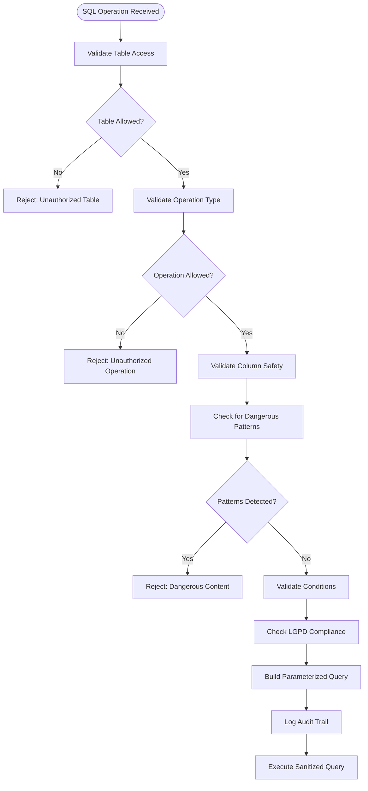
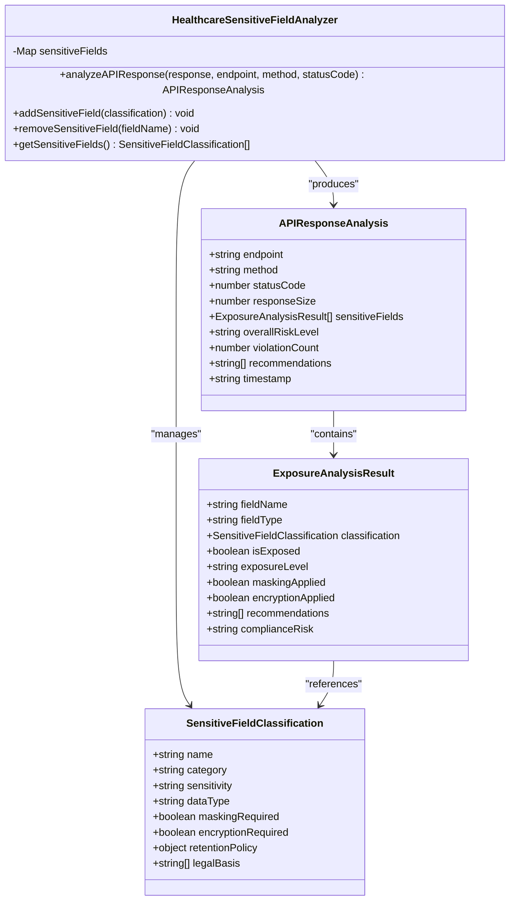
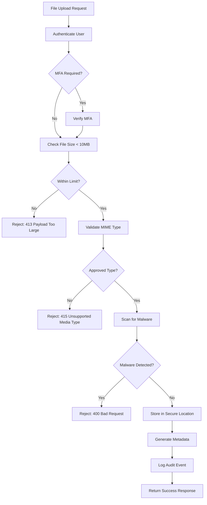

# Input Sanitization

<cite>
**Referenced Files in This Document **   
- [sql-sanitizer.ts](file://apps/api/src/security/sql-sanitizer.ts)
- [sensitive-field-analyzer.ts](file://apps/api/src/services/sensitive-field-analyzer.ts)
- [security-middleware.ts](file://apps/api/src/middleware/security-middleware.ts)
- [prisma.ts](file://apps/api/src/clients/prisma.ts)
- [healthcare-validation-schemas.ts](file://apps/api/src/schemas/healthcare-validation-schemas.ts)
- [error-sanitization.ts](file://apps/api/src/middleware/error-sanitization.ts)
- [lgpd-middleware.ts](file://apps/api/src/middleware/lgpd-middleware.ts)
- [aesthetic-clinic-middleware.ts](file://apps/api/src/middleware/aesthetic-clinic-middleware.ts)
</cite>

## Table of Contents
1. [Introduction](#introduction)
2. [SQL Injection Prevention](#sql-injection-prevention)
3. [ORM and Prisma Protections](#orm-and-prisma-protections)
4. [XSS Prevention and Content Filtering](#xss-prevention-and-content-filtering)
5. [Data Validation Practices](#data-validation-practices)
6. [Sensitive Field Handling](#sensitive-field-handling)
7. [File Upload Security](#file-upload-security)
8. [Secure Logging Practices](#secure-logging-practices)
9. [Conclusion](#conclusion)

## Introduction
The NeonPro platform implements a comprehensive input sanitization framework to protect against various security threats, particularly injection attacks and data exposure risks. The system employs multiple layers of defense including SQL sanitization, ORM protections, content filtering, and sensitive data analysis. This document details the implementation of these security measures across the codebase, focusing on how user inputs are validated and sanitized at various entry points.

## SQL Injection Prevention

NeonPro employs a robust SQL sanitization mechanism through the `SQLSanitizer` class defined in [sql-sanitizer.ts](file://apps/api/src/security/sql-sanitizer.ts). This component provides advanced protection against SQL injection attacks through multiple mechanisms:

- **Whitelist-based validation**: Only predefined tables and operations are permitted, with strict configuration for each table's allowed operations
- **Pattern detection**: Comprehensive regex patterns detect dangerous SQL constructs including UNION SELECT, DROP, ALTER, EXECUTE, and comment-based attacks
- **Dynamic query building**: Instead of direct string concatenation, queries are constructed using parameterized placeholders ($identifier) to prevent injection
- **Multi-layer validation**: Operations undergo validation for table access, operation type, column safety, condition safety, and LGPD compliance

The sanitizer validates SQL operations against a configuration that specifies allowed operations per table, sensitive columns, and compliance requirements. For example, the "patients" table allows SELECT, INSERT, and UPDATE operations but prohibits DELETE, while the "audit_logs" table restricts modifications to authorized personnel only.

**Diagram sources**
- [sql-sanitizer.ts](file://apps/api/src/security/sql-sanitizer.ts#L1-L512)

**Section sources**
- [sql-sanitizer.ts](file://apps/api/src/security/sql-sanitizer.ts#L1-L512)

## ORM and Prisma Protections

The application leverages Prisma as its ORM layer, providing inherent protection against SQL injection attacks through parameterized queries and type-safe database operations. The Prisma client configuration in [prisma.ts](file://apps/api/src/clients/prisma.ts) implements several security-enhancing practices:

- **Connection pooling with timeouts**: Database connections include timeout configurations to prevent resource exhaustion
- **Query logging with sanitization**: Database queries are logged with sensitive information redacted according to LGPD requirements
- **Transaction management**: Complex operations use database transactions with proper error handling and rollback capabilities
- **Type-safe queries**: Prisma's type system prevents malformed queries at compile time

The integration between the SQL sanitizer and Prisma creates a defense-in-depth strategy where even if lower-level protections were bypassed, the ORM layer provides an additional barrier against injection attacks. All database operations flow through middleware that applies both sanitization rules and Prisma's built-in security features.

**Section sources**
- [prisma.ts](file://apps/api/src/clients/prisma.ts#L1-L100)
- [sql-sanitizer.ts](file://apps/api/src/security/sql-sanitizer.ts#L1-L512)

## XSS Prevention and Content Filtering

Cross-site scripting (XSS) prevention is implemented through a combination of input validation, output encoding, and content security policies. The validation framework in [healthcare-validation-schemas.ts](file://apps/api/src/schemas/healthcare-validation-schemas.ts) defines strict schemas for all user inputs, including:

- **String length limitations**: All text fields have maximum length constraints to prevent buffer overflow attacks
- **Pattern matching**: Regular expressions validate data formats (email, phone, medical codes) while rejecting potentially malicious content
- **Content-type restrictions**: File uploads and rich text content are validated against approved MIME types and formats
- **Special character filtering**: Scripts, JavaScript handlers, and HTML tags are removed or escaped from user inputs

The system also implements Content Security Policy (CSP) headers through security middleware to mitigate the impact of any potential XSS vulnerabilities by restricting the sources from which scripts can be loaded.

**Section sources**
- [healthcare-validation-schemas.ts](file://apps/api/src/schemas/healthcare-validation-schemas.ts#L1-L200)
- [security-middleware.ts](file://apps/api/src/middleware/security-middleware.ts#L1-L150)

## Data Validation Practices

NeonPro employs comprehensive data validation at multiple levels to ensure input integrity and security:

- **Type validation**: All inputs are validated for correct data types (string, number, boolean, date)
- **Format validation**: Specific formats are enforced for healthcare data (CNS, CPF, medical codes) using specialized validators
- **Range validation**: Numerical values are checked against minimum and maximum acceptable ranges
- **Length validation**: String fields enforce minimum and maximum length requirements
- **Semantic validation**: Business logic rules validate the meaning and context of data (e.g., appointment dates cannot be in the past)

Validation occurs at the request ingress point through middleware, ensuring that invalid data is rejected before reaching business logic layers. Error responses provide generic messages to avoid information leakage while detailed validation results are logged securely for diagnostic purposes.

**Section sources**
- [healthcare-validation-schemas.ts](file://apps/api/src/schemas/healthcare-validation-schemas.ts#L1-L200)
- [validators](file://packages/validators/src/index.ts#L1-L50)

## Sensitive Field Handling

The platform implements specialized handling for sensitive fields through the `HealthcareSensitiveFieldAnalyzer` class in [sensitive-field-analyzer.ts](file://apps/api/src/services/sensitive-field-analyzer.ts). This component provides:

- **Automatic field classification**: Predefined categories for sensitive data including personal identification, medical information, financial data, and contact details
- **Exposure analysis**: Real-time analysis of API responses to detect unintended disclosure of sensitive information
- **Risk assessment**: Multi-level risk scoring based on sensitivity, exposure level, and compliance requirements
- **Masking recommendations**: Guidance on appropriate data masking techniques for different field types

Sensitive fields are categorized by sensitivity level (LOW, MEDIUM, HIGH, CRITICAL) with corresponding protection requirements. Fields like CPF, medical diagnoses, and genetic data are classified as CRITICAL and require encryption and strict access controls, while less sensitive fields may only require basic protection measures.

**Diagram sources**
- [sensitive-field-analyzer.ts](file://apps/api/src/services/sensitive-field-analyzer.ts#L1-L595)

**Section sources**
- [sensitive-field-analyzer.ts](file://apps/api/src/services/sensitive-field-analyzer.ts#L1-L595)

## File Upload Security

File upload functionality includes multiple security controls to prevent malicious file uploads:

- **Size limitations**: Uploads are restricted to 10MB maximum size through middleware validation in [aesthetic-clinic-middleware.ts](file://apps/api/src/middleware/aesthetic-clinic-middleware.ts)
- **MIME type validation**: Only approved content types are accepted (e.g., PDF, JPEG, PNG for documents and images)
- **Malware scanning**: Placeholder implementation indicates integration with antivirus scanning services
- **MFA requirement**: Medical image uploads require multi-factor authentication verification
- **Content disposition**: Download responses properly set Content-Disposition headers to prevent automatic execution

The system rejects executable files and other high-risk content types, with test cases verifying that attempts to upload .exe files receive appropriate 415 Unsupported Media Type responses.

**Diagram sources**
- [aesthetic-clinic-middleware.ts](file://apps/api/src/middleware/aesthetic-clinic-middleware.ts#L266-L318)
- [documents.upload.test.ts](file://apps/api/src/routes/patients/__tests__/documents.upload.test.ts#L42-L126)

**Section sources**
- [aesthetic-clinic-middleware.ts](file://apps/api/src/middleware/aesthetic-clinic-middleware.ts#L266-L318)
- [documents.upload.test.ts](file://apps/api/src/routes/patients/__tests__/documents.upload.test.ts#L42-L126)

## Secure Logging Practices

The platform implements secure logging practices to balance diagnostic needs with privacy protection:

- **Input sanitization in logs**: The `error-sanitization.ts` middleware ensures sensitive user input is not recorded in error logs
- **Audit-specific logging**: Separate audit logs capture data access events without storing sensitive content
- **Redaction policies**: Automatic redaction of sensitive fields (CPF, RG, medical diagnoses) in diagnostic logs
- **Minimal logging**: Error messages provide generic information to users while detailed diagnostics are restricted to authorized personnel

The logging framework distinguishes between different log types:
- **Application logs**: General operational information with sensitive data redacted
- **Security logs**: Authentication events, access control decisions, and security policy violations
- **Audit logs**: Regulatory-compliant records of data access and modifications with immutable storage

This layered approach ensures that troubleshooting information is available to developers while protecting patient privacy and complying with healthcare regulations.

**Section sources**
- [error-sanitization.ts](file://apps/api/src/middleware/error-sanitization.ts#L1-L50)
- [lgpd-middleware.ts](file://apps/api/src/middleware/lgpd-middleware.ts#L1-L80)
- [medical-image-protection-service.ts](file://apps/api/src/security/medical-image-protection-service.ts#L219-L269)

## Conclusion
NeonPro implements a comprehensive, multi-layered approach to input sanitization that effectively mitigates injection attacks and protects sensitive healthcare data. The system combines proactive prevention through SQL sanitization and ORM protections with reactive monitoring via sensitive field analysis and secure logging. By enforcing strict validation rules, implementing defense-in-depth strategies, and maintaining regulatory compliance, the platform ensures the security and privacy of user data while providing robust protection against common web application vulnerabilities.