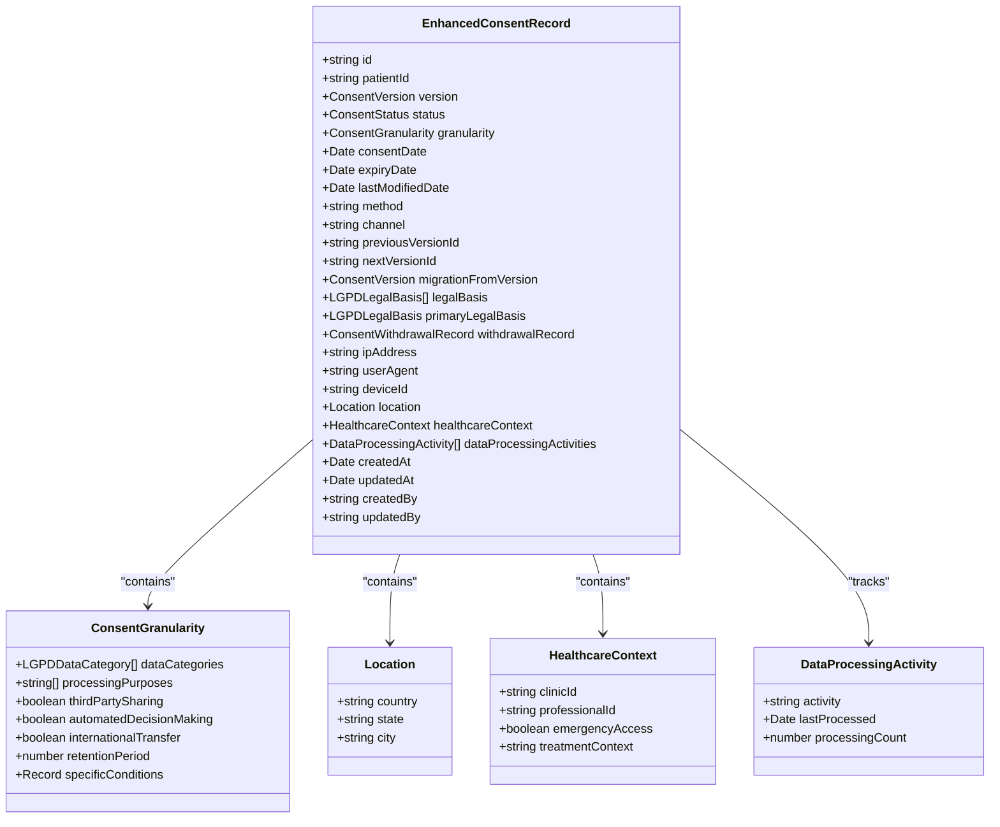
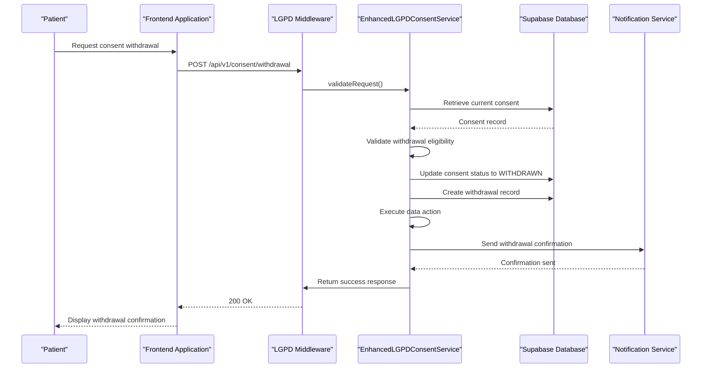
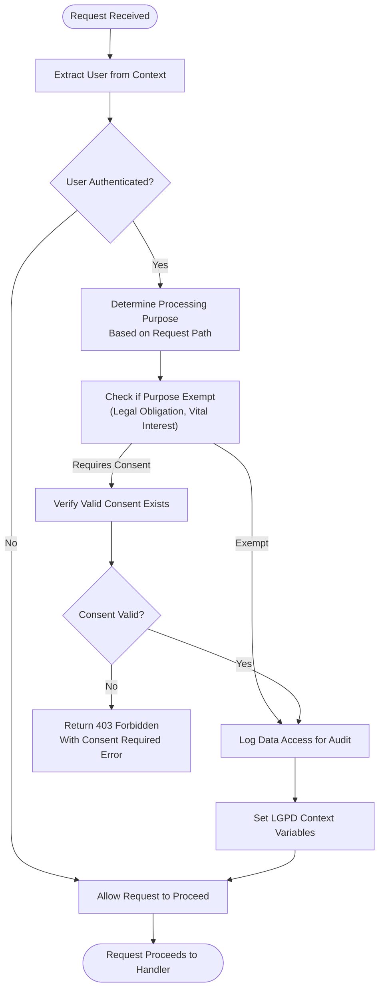
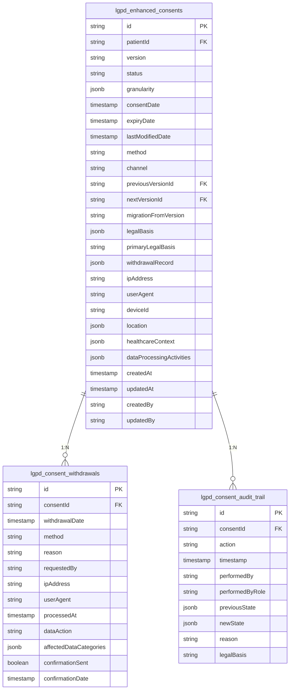

# Consent Management

<cite>
**Referenced Files in This Document**
- [enhanced-lgpd-consent.ts](file://apps/api/src/services/enhanced-lgpd-consent.ts)
- [lgpd-middleware.ts](file://apps/api/src/middleware/lgpd-middleware.ts)
- [lgpd-compliance-validator.ts](file://apps/api/src/utils/lgpd-compliance-validator.ts)
</cite>

## Table of Contents

1. [Introduction](#introduction)
2. [Consent Data Model](#consent-data-model)
3. [Consent Lifecycle Management](#consent-lifecycle-management)
4. [Middleware Integration and Enforcement](#middleware-integration-and-enforcement)
5. [Validation Rules and Compliance Checks](#validation-rules-and-compliance-checks)
6. [Error Handling and Authorization Prevention](#error-handling-and-authorization-prevention)
7. [Secure Storage and Access Controls](#secure-storage-and-access-controls)
8. [Audit Logging and Compliance Reporting](#audit-logging-and-compliance-reporting)

## Introduction

The LGPD consent management system in neonpro provides a comprehensive framework for handling patient data privacy in compliance with Brazil's Lei Geral de Proteção de Dados (LGPD). The system centers around two key components: `enhanced-lgpd-consent.ts` which manages the full consent lifecycle, and `lgpd-middleware.ts` which enforces consent requirements across API routes. This documentation details how patient consent is collected, stored, verified, and enforced throughout the application, ensuring compliance with LGPD Articles 7º, 11º, and 18º in the healthcare context.

**Section sources**

- [enhanced-lgpd-consent.ts](file://apps/api/src/services/enhanced-lgpd-consent.ts#L0-L42)
- [lgpd-middleware.ts](file://apps/api/src/middleware/lgpd-middleware.ts#L0-L686)

## Consent Data Model

The consent system implements a sophisticated data model that captures granular consent details, versioning information, and comprehensive metadata. The `EnhancedConsentRecordSchema` defines the structure of consent records with multiple layers of information.

At its core, each consent record includes the patient identifier, consent status, and version information. The system supports three consent versions: V1_0 (basic consent), V2_0 (granular consent with data categories), and V3_0 (enhanced with withdrawal tracking and purpose limitation). Each version corresponds to evolving compliance requirements and feature enhancements.

The granularity component captures detailed permissions including specific data categories (such as health data, biometric data, or personal data), processing purposes, third-party sharing permissions, automated decision-making consent, international transfer authorization, and retention periods. This granular approach enables precise control over data usage in accordance with LGPD principles.

Additional metadata includes technical information such as IP address, user agent, device ID, and geolocation data, which provides context for consent collection. Healthcare-specific fields track clinic and professional identifiers, emergency access flags, and treatment context. The legal basis for processing is explicitly documented, supporting compliance with LGPD Article 7º requirements.

**Diagram sources**

- [enhanced-lgpd-consent.ts](file://apps/api/src/services/enhanced-lgpd-consent.ts#L42-L188)

**Section sources**

- [enhanced-lgpd-consent.ts](file://apps/api/src/services/enhanced-lgpd-consent.ts#L42-L188)

## Consent Lifecycle Management

The enhanced LGPD consent system manages the complete lifecycle of patient consent through well-defined operations for creation, updates, withdrawals, and version migrations. The `EnhancedLGPDConsentService` class provides methods that handle each stage of the consent journey while maintaining compliance with Brazilian regulations.

### Initial Consent Capture

The consent creation process begins with the `createConsent` method, which validates incoming consent data against the defined schema and checks for overlapping consents with similar purposes. Before creating a new record, the system verifies that no active consent already exists for the requested processing purposes, preventing duplicate or conflicting authorizations.

When a new consent is created, the system generates a unique identifier, sets the status to ACTIVE, and records timestamps for creation and modification. The consent record is stored in the `lgpd_enhanced_consents` database table, and an audit trail entry is created to document the creation event. If the consent specifies a retention period, the system schedules automated cleanup to ensure data is not retained beyond the authorized duration.

### Consent Updates and Version Migration

As compliance requirements evolve, the system supports migration between consent versions through the `migrateConsentVersion` method. This process creates a new consent record with the target version while maintaining links to the previous version through `previousVersionId` and `nextVersionId` fields. The migration preserves the patient's consent history while updating permissions according to the latest standards.

The service maintains a registry of consent versions with metadata including effective dates, deprecation timelines, and required changes. For example, V3_0 introduces enhanced withdrawal mechanisms, detailed audit trails, and data retention automation. When migrating to a newer version, administrators can provide updated granularity settings and document the migration reason, ensuring transparency in the evolution of consent policies.

### Consent Withdrawal Process

Patients can withdraw their consent through the `withdrawConsent` method, which initiates a comprehensive process respecting LGPD Article 18 rights. The withdrawal request includes details about the method (electronic, written, verbal, or automated), reason for withdrawal, and the requested data action (immediate deletion, anonymization, or retention until expiry).

Upon withdrawal, the system updates the consent status to WITHDRAWN, creates a detailed withdrawal record in the `lgpd_consent_withdrawals` table, and executes the specified data action. The system then triggers appropriate data processing: immediate deletion removes the data entirely, anonymization renders it non-attributable to the individual, or retention scheduling ensures deletion after the legally required period. A confirmation is sent to the patient, and the withdrawal is logged in the audit trail.

**Diagram sources**

- [enhanced-lgpd-consent.ts](file://apps/api/src/services/enhanced-lgpd-consent.ts#L307-L409)
- [lgpd-middleware.ts](file://apps/api/src/middleware/lgpd-middleware.ts#L264-L314)

**Section sources**

- [enhanced-lgpd-consent.ts](file://apps/api/src/services/enhanced-lgpd-consent.ts#L237-L456)

## Middleware Integration and Enforcement

The LGPD middleware system integrates consent enforcement into the API request lifecycle, ensuring that data processing only occurs with proper authorization. The `lgpdMiddleware` function serves as the primary enforcement mechanism, intercepting requests and validating consent requirements before allowing access to protected resources.

### Request Processing Flow

The middleware operates by first extracting the authenticated user from the request context. For unauthenticated requests, the middleware allows passage without consent checks, recognizing that consent verification requires an identified data subject. Once the user is identified, the middleware determines the processing purpose based on the request path, mapping endpoints to specific purposes such as medical care, appointment scheduling, or billing.

For each request, the middleware evaluates whether explicit consent is required by checking against exempt purposes like legal obligation or vital interest. If consent is required, the system queries the consent store to verify the existence of a valid consent for the determined purpose. In strict mode (enabled by default), the absence of valid consent results in a 403 Forbidden response with detailed error information including the missing purpose and a link to the consent interface.

### Purpose-Based Enforcement

The system implements intelligent purpose determination by analyzing the request path. Endpoints containing "/patients" or "/medical-records" are classified as medical_care purposes, while "/appointments" paths trigger appointment_scheduling purposes. Billing-related endpoints are categorized accordingly, and all other operations default to general consent requirements. This contextual analysis ensures appropriate protection levels for different types of data processing.

The healthcare-specific middleware configuration enhances this enforcement by requiring multiple purposes simultaneously and enabling expiration checks. This specialized middleware is designed for sensitive healthcare operations where stringent compliance is mandatory, providing an additional layer of protection beyond the general LGPD requirements.

**Diagram sources**

- [lgpd-middleware.ts](file://apps/api/src/middleware/lgpd-middleware.ts#L113-L222)

**Section sources**

- [lgpd-middleware.ts](file://apps/api/src/middleware/lgpd-middleware.ts#L113-L222)

## Validation Rules and Compliance Checks

The consent system implements rigorous validation rules to ensure compliance with LGPD requirements at every stage of the consent lifecycle. These validations occur at both the data model level through Zod schema validation and at the business logic level through custom validation methods.

### Schema-Level Validation

The `EnhancedConsentRecordSchema` employs Zod for comprehensive type and constraint validation. All fields are strictly typed, with enums enforcing valid values for status, version, legal basis, and other categorical data. Date fields are validated as actual Date objects, preventing timestamp manipulation. The schema also enforces required fields and proper nesting of complex objects like the granularity specification.

During consent creation, the system uses `EnhancedConsentRecordSchema.omit()` to validate the input data while excluding fields that will be automatically generated (ID, timestamps, status). This ensures that only legitimate, client-provided data is accepted while maintaining integrity of system-managed fields.

### Business Logic Validation

Beyond schema validation, the system implements business rules that prevent common compliance issues. The `createConsent` method checks for overlapping purposes by comparing the requested processing purposes against existing active consents for the same patient. If any purpose overlaps, the system rejects the new consent to prevent contradictory authorizations.

The `isProcessingConsented` method provides a query interface for determining whether specific data processing is authorized. It evaluates both data categories and processing purposes against active consents, returning detailed information about missing requirements when consent is insufficient. This method enables fine-grained access control decisions based on the specific data elements and purposes involved in an operation.

The system also validates consent version compatibility during migration, ensuring that attempts to migrate to non-existent versions or to the same version are rejected. These validations maintain the integrity of the consent versioning system and prevent erroneous state transitions.

**Section sources**

- [enhanced-lgpd-consent.ts](file://apps/api/src/services/enhanced-lgpd-consent.ts#L237-L282)
- [enhanced-lgpd-consent.ts](file://apps/api/src/services/enhanced-lgpd-consent.ts#L554-L592)

## Error Handling and Authorization Prevention

The consent management system implements comprehensive error handling to prevent unauthorized data processing while providing meaningful feedback for legitimate use cases. The middleware and service layers work together to create a robust defense against both accidental and malicious attempts to bypass consent requirements.

### Middleware Enforcement

The `lgpdMiddleware` employs a strict enforcement policy by default, denying access when required consent is missing. Instead of generic error messages, the system returns structured HTTP exceptions with detailed cause information including the specific purpose requiring consent and a direct link to the consent interface. This approach balances security with usability, guiding legitimate users toward proper authorization rather than simply blocking access.

When access is denied due to missing consent, the system logs a warning with comprehensive context including the user ID, requested purpose, request path, method, and IP address. This audit trail supports compliance monitoring and incident investigation. For successful requests, the middleware logs data access with information about whether valid consent was present, creating a complete record of all protected operations.

### Service-Level Error Management

The `EnhancedLGPDConsentService` implements defensive programming practices to handle edge cases and potential attacks. Methods wrap critical operations in try-catch blocks, ensuring that errors do not leave the system in an inconsistent state. Specific error conditions are anticipated and handled explicitly, such as rejecting withdrawal requests for already-withdrawn consents or preventing version migrations to invalid targets.

In the event of database errors during consent creation or modification, the system throws descriptive exceptions that can be appropriately handled by upstream components. The service avoids exposing sensitive implementation details in error messages, maintaining security while providing sufficient information for debugging and monitoring.

The system also prevents race conditions during concurrent consent operations by relying on database constraints and transactional integrity. When checking for existing consents, the service retrieves the complete set of active consents before evaluating overlap, ensuring consistency even if other processes modify consents during the operation.

**Section sources**

- [lgpd-middleware.ts](file://apps/api/src/middleware/lgpd-middleware.ts#L167-L222)
- [enhanced-lgpd-consent.ts](file://apps/api/src/services/enhanced-lgpd-consent.ts#L307-L345)

## Secure Storage and Access Controls

The consent management system employs secure storage practices and access controls to protect sensitive consent data in accordance with LGPD requirements. Consent records are stored in dedicated database tables with appropriate indexing for performance and security.

### Database Storage

Consent data is persisted in the `lgpd_enhanced_consents` table, with withdrawal records stored separately in `lgpd_consent_withdrawals` and audit trails in `lgpd_consent_audit_trail`. This separation of concerns ensures that withdrawal actions and historical changes are preserved even if consent records are modified or deleted.

The system uses Supabase as the database backend, leveraging its row-level security features to enforce access controls at the database layer. The `createAdminClient` function provides elevated privileges for consent management operations, ensuring that only authorized service components can modify consent records.

### Access Control Implementation

Access to consent data follows the principle of least privilege, with different levels of access based on user roles and responsibilities. The middleware acts as a gatekeeper, preventing unauthorized access to protected routes before requests reach business logic handlers. Within the service layer, methods validate user permissions and data ownership before performing operations.

The system implements temporal access controls by honoring consent expiration dates and withdrawal statuses. Even if a user has legitimate credentials, access is denied when the underlying consent is expired or withdrawn. This time-based authorization ensures ongoing compliance throughout the data processing lifecycle.

**Section sources**

- [enhanced-lgpd-consent.ts](file://apps/api/src/services/enhanced-lgpd-consent.ts#L282-L307)
- [enhanced-lgpd-consent.ts](file://apps/api/src/services/enhanced-lgpd-consent.ts#L499-L552)

## Audit Logging and Compliance Reporting

The consent system maintains comprehensive audit logs to support accountability, regulatory compliance, and incident investigation. Every significant consent operation is recorded in the audit trail, creating an immutable history of consent lifecycle events.

### Audit Trail Structure

The `ConsentAuditTrail` interface defines the structure of audit entries, capturing essential information including the consent ID, action type (created, updated, withdrawn, expired, or version_migrated), timestamp, performer details, previous and new states, reason for change, and technical metadata like IP address and user agent. The legal basis for the audit operation is also recorded, typically set to LEGAL_OBLIGATION as required by LGPD Article 37.

The `logConsentActivity` private method centralizes audit logging, ensuring consistent formatting and storage across all consent operations. Each audit entry receives a unique identifier and is stored in the `lgpd_consent_audit_trail` database table. The system captures both the previous and new states of consent records when applicable, enabling reconstruction of the complete consent history.

### Compliance Monitoring

The system supports compliance reporting through the `getConsentAuditTrail` method, which retrieves all audit entries for a specific consent ID, ordered by timestamp in descending order. This chronological view allows administrators and auditors to trace the complete history of a consent record from creation through any modifications to final disposition.

Additional reporting capabilities are provided by the `getConsentStatistics` method, which aggregates consent data across various dimensions including total counts, status distribution, version adoption, and data category usage. These statistics support compliance monitoring, operational planning, and regulatory reporting requirements.

The audit system also integrates with broader data subject rights management, supporting LGPD Article 18 requirements for access, rectification, deletion, and portability. When patients exercise these rights, the system creates corresponding audit entries that document the request and fulfillment process.

**Diagram sources**

- [enhanced-lgpd-consent.ts](file://apps/api/src/services/enhanced-lgpd-consent.ts#L188-L237)

**Section sources**

- [enhanced-lgpd-consent.ts](file://apps/api/src/services/enhanced-lgpd-consent.ts#L750-L822)
