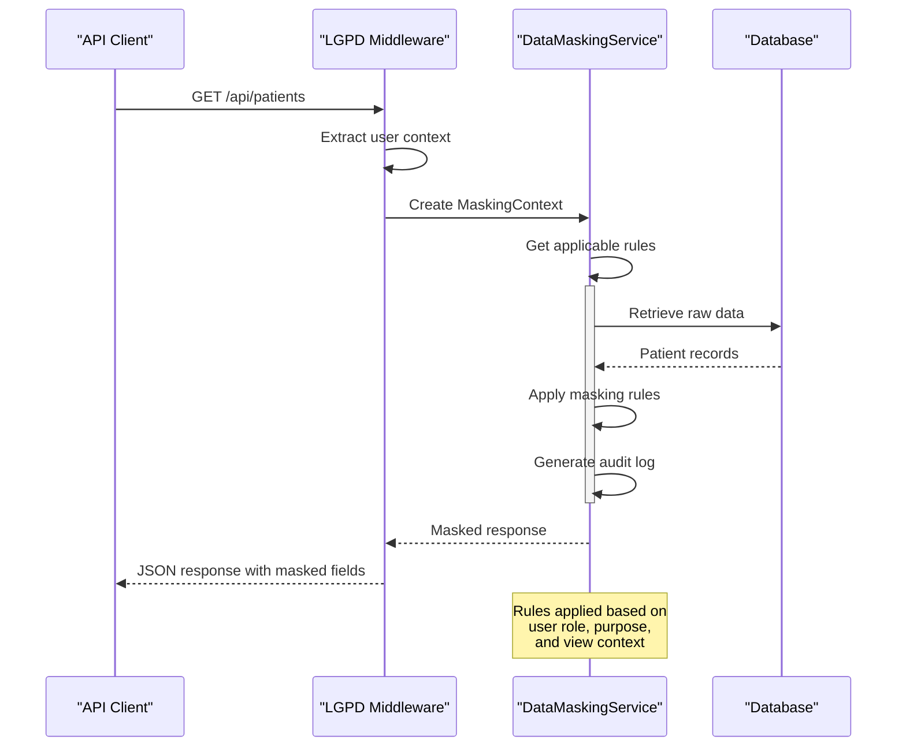
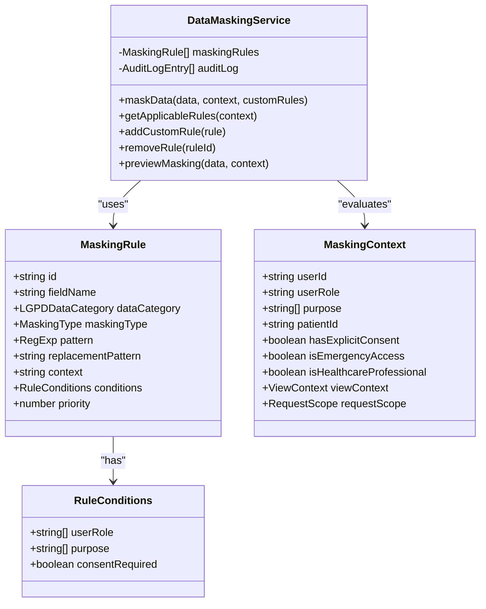

# Data Anonymization & Pseudonymization

<cite>
**Referenced Files in This Document**   
- [data-masking-service.ts](file://apps/api/src/services/data-masking-service.ts)
- [sensitive-field-analyzer.test.ts](file://apps/api/src/__tests__/security/sensitive-field-analyzer.test.ts)
</cite>

## Table of Contents
1. [Introduction](#introduction)
2. [Core Components](#core-components)
3. [Anonymization vs Pseudonymization](#anonymization-vs-pseudonymization)
4. [Data Masking Implementation](#data-masking-implementation)
5. [Sensitive Field Detection](#sensitive-field-detection)
6. [Configuration and Rules Management](#configuration-and-rules-management)
7. [Performance Considerations](#performance-considerations)
8. [Testing and Validation](#testing-and-validation)
9. [Audit and Compliance Logging](#audit-and-compliance-logging)

## Introduction
The LGPD data anonymization and pseudonymization implementation in neonpro provides comprehensive protection for sensitive health information through a sophisticated data masking system. The architecture implements Brazilian General Data Protection Law (LGPD) Articles 7º, 11º, and 18º with healthcare-specific data protection measures. The system automatically identifies personal and medical data fields, applies appropriate masking techniques based on context and user roles, and ensures compliance while preserving necessary functionality. Real-time field-level masking is applied during API responses to protect sensitive information such as CPF numbers, medical diagnoses, and financial data according to predefined rules and contextual conditions.

## Core Components

The LGPD compliance system in neonpro centers around two primary components: the DataMaskingService for real-time data protection and the HealthcareSensitiveFieldAnalyzer for security validation. The DataMaskingService implements automated data masking for sensitive information in list views, detail views, exports, and API responses. It uses configurable masking rules that specify how different types of sensitive data should be handled based on context, user role, and purpose. The service supports multiple masking techniques including partial masking, full masking, hashing, tokenization, and redaction. The HealthcareSensitiveFieldAnalyzer complements this by providing security testing capabilities that detect sensitive field exposure, assess compliance risks, and generate remediation recommendations. Together, these components create a robust framework for protecting personal health information while maintaining system functionality.

**Section sources**
- [data-masking-service.ts](file://apps/api/src/services/data-masking-service.ts#L1-L50)
- [sensitive-field-analyzer.test.ts](file://apps/api/src/__tests__/security/sensitive-field-analyzer.test.ts#L1-L50)

## Anonymization vs Pseudonymization

The system implements distinct approaches for data anonymization and pseudonymization based on regulatory requirements and use cases. Anonymization refers to the irreversible processing of personal data to prevent identification of individuals, even by the data controller. In neonpro, complete anonymization is achieved through techniques like full masking ('***'), redaction ('[REDACTED]'), and cryptographic hashing that make re-identification practically impossible. This approach is applied when data is used for statistical analysis, research, or public health monitoring where individual identification is not required.

Pseudonymization, conversely, involves replacing identifying information with artificial identifiers (pseudonyms) while maintaining the ability to re-identify individuals under specific authorized circumstances. The system implements pseudonymization through tokenization, where sensitive values are replaced with tokens that can be reversed only with proper authorization and cryptographic keys. This approach is used in clinical research settings where longitudinal tracking of patient outcomes is necessary but direct identification must be restricted. The key distinction lies in reversibility: anonymized data cannot be restored to its original form, while pseudonymized data can be re-identified with appropriate authorization, typically requiring emergency access protocols or research ethics committee approval.

```mermaid
flowchart TD
A[Raw Sensitive Data] --> B{Processing Purpose}
B --> |Statistical Analysis| C[Anonymization]
B --> |Clinical Research| D[Pseudonymization]
B --> |Emergency Care| E[No Masking]
C --> F[Full Masking: ***]
C --> G[Redaction: [REDACTED]]
C --> H[Hashing: hash_abc123]
D --> I[Tokenization: token_abc123]
D --> J[Partial Masking: XXX.XXX.XXX-XX]
F --> K[Irreversible]
G --> K
H --> K
I --> L[Reversible with Authorization]
J --> L
style K fill:#f9f,stroke:#333
style L fill:#bbf,stroke:#333
```

**Diagram sources**
- [data-masking-service.ts](file://apps/api/src/services/data-masking-service.ts#L100-L200)
- [data-masking-service.ts](file://apps/api/src/services/data-masking-service.ts#L400-L450)

## Data Masking Implementation

The data masking implementation in neonpro operates through the DataMaskingService class, which applies field-level masking to API responses in real-time. The service uses a rule-based approach where each masking rule specifies the target field name, data category, masking type, and application context. When an API request is processed, the service evaluates the masking context including user role, request purpose, view context (list, detail, export), and consent status to determine which rules should be applied. For example, CPF numbers are partially masked in list views using the pattern '$1.***.***-$4' but fully masked in export contexts. Medical diagnosis fields are redacted for non-clinical staff like receptionists but remain visible to doctors and specialists.

The masking process preserves data structure and usability while protecting sensitive information. Partial masking retains some characters to maintain data recognition without compromising privacy—for instance, phone numbers appear as '($1) *****-$3' showing area code and last four digits. Hashing transforms sensitive values into consistent but non-reversible representations, enabling data matching without exposing original values. Tokenization provides reversible masking through base64-encoded tokens that can be resolved back to original values with proper authorization. The system handles nested objects and arrays recursively, ensuring comprehensive protection across complex data structures. Emergency access scenarios are specifically addressed by temporarily disabling medical data masking when isEmergencyAccess flag is set, allowing critical healthcare professionals immediate access to complete patient information during emergencies.



**Diagram sources**
- [data-masking-service.ts](file://apps/api/src/services/data-masking-service.ts#L200-L300)
- [data-masking-service.ts](file://apps/api/src/services/data-masking-service.ts#L300-L400)

## Sensitive Field Detection

The sensitive field detection system in neonpro employs the HealthcareSensitiveFieldAnalyzer to identify and classify potentially sensitive data exposures. This component analyzes API responses to detect fields containing personal identification information, medical data, financial details, and other sensitive categories defined by LGPD regulations. Each detected field is classified with a sensitivity level (CRITICAL, HIGH, MEDIUM) and category (IDENTIFICATION, MEDICAL, CONTACT) that determines the appropriate protection measures. The analyzer recursively processes nested objects and arrays to ensure comprehensive coverage, identifying sensitive fields at any depth within the response structure.

Detection occurs through pattern matching and semantic analysis. CPF numbers are identified by their characteristic format (XXX.XXX.XXX-XX), email addresses by standard email patterns, and medical terminology by keywords related to diagnoses, treatments, and conditions. The system distinguishes between exposed and properly masked data by analyzing field values—values containing asterisks, dots, or explicit redaction markers are considered masked, while complete unaltered values represent potential exposures. Risk assessment is performed based on the combination of sensitivity level and exposure status, with CRITICAL risk assigned to unmasked identification or genetic data, HIGH risk to unmasked medical information, and MEDIUM risk to exposed contact details. The analyzer generates specific recommendations for each identified issue, such as applying field masking, enabling encryption, or implementing stricter access controls.

**Section sources**
- [sensitive-field-analyzer.test.ts](file://apps/api/src/__tests__/security/sensitive-field-analyzer.test.ts#L50-L100)
- [sensitive-field-analyzer.test.ts](file://apps/api/src/__tests__/security/sensitive-field-analyzer.test.ts#L200-L250)

## Configuration and Rules Management

The data protection system in neonpro features a comprehensive configuration framework that allows administrators to define and manage masking rules according to organizational policies and regulatory requirements. The core configuration consists of predefined masking rules organized by data category (PERSONAL, MEDICAL, FINANCIAL, BIOMETRIC) with specific handling instructions for each sensitive field type. Each rule includes parameters such as field name(s), masking technique, regular expression patterns for precise matching, replacement patterns, application context, and priority level. Higher priority rules take precedence when multiple rules could apply to the same field.

Rules can be customized based on conditional logic involving user roles, processing purposes, and consent status. For example, medical diagnosis fields may have different masking behavior for doctors versus administrative staff, or based on whether explicit patient consent has been obtained. The system supports dynamic rule management through methods that allow adding custom rules or removing existing ones at runtime. Contextual conditions enable sophisticated access control—for instance, biometric data is completely redacted for all users except during emergency access scenarios. The configuration also includes default rules for common Brazilian identification formats like CPF and CNPJ, healthcare-specific fields such as medical records and prescriptions, and financial data including credit card numbers and bank accounts. Organizations can extend these defaults with custom field classifications to address unique data protection requirements.



**Diagram sources**
- [data-masking-service.ts](file://apps/api/src/services/data-masking-service.ts#L10-L50)
- [data-masking-service.ts](file://apps/api/src/services/data-masking-service.ts#L100-L150)

## Performance Considerations

The data masking system in neonpro incorporates several performance optimizations to minimize impact on API response times while maintaining comprehensive data protection. The masking process employs efficient algorithms and data structures to reduce computational overhead. Regular expression patterns are pre-compiled where possible, and rule evaluation uses priority-based sorting to quickly identify the most relevant rules for a given context. The system implements lazy evaluation by only processing data that will be exposed in the response, avoiding unnecessary computation for fields that are filtered out by access controls.

Memory usage is optimized through careful data handling—the original data is deep-cloned before masking to prevent modification of source records, but this operation is performed efficiently using JSON serialization/deserialization rather than recursive object traversal. For large datasets, the system can apply masking in batches or streams to prevent memory exhaustion. The audit logging mechanism is designed to be non-blocking, with log entries queued for asynchronous processing to avoid impacting the main request-response cycle. Performance monitoring is built into the system, with processing time metrics collected for each masking operation to identify potential bottlenecks. The previewMasking method allows developers to test rule configurations without affecting live traffic, helping to optimize rules before deployment. Caching strategies are employed for frequently accessed rule sets and user context information to reduce database queries and improve response times.

**Section sources**
- [data-masking-service.ts](file://apps/api/src/services/data-masking-service.ts#L500-L550)
- [data-masking-service.ts](file://apps/api/src/services/data-masking-service.ts#L250-L300)

## Testing and Validation

The LGPD compliance system in neonpro includes comprehensive testing and validation mechanisms to ensure complete coverage of sensitive data protection. The sensitive-field-analyzer.test.ts suite contains extensive unit tests that verify the detection of various sensitive field types including CPF numbers, medical diagnoses, email addresses, and nested sensitive data within complex object structures. Tests validate both positive cases (correct identification of sensitive fields) and negative cases (proper handling of masked or non-sensitive data). The test suite confirms that different masking techniques are correctly detected, distinguishing between full masking, partial masking, and redaction.

Validation extends beyond simple field detection to include risk assessment accuracy, with tests verifying that appropriate risk levels (LOW, MEDIUM, HIGH, CRITICAL) are assigned based on the sensitivity and exposure status of detected fields. The system's recommendation engine is thoroughly tested to ensure it generates actionable remediation steps for identified vulnerabilities, such as suggesting field masking for unmasked sensitive data or encryption for high-risk fields. Edge cases are comprehensively covered, including handling of null/undefined values, empty objects and arrays, and primitive data types. Integration tests validate the end-to-end workflow from API request to masked response, confirming that the correct masking rules are applied based on user role, request context, and other environmental factors. The testing framework also verifies that emergency access scenarios properly bypass certain masking rules for critical healthcare data when appropriate.

**Section sources**
- [sensitive-field-analyzer.test.ts](file://apps/api/src/__tests__/security/sensitive-field-analyzer.test.ts#L100-L200)
- [sensitive-field-analyzer.test.ts](file://apps/api/src/__tests__/security/sensitive-field-analyzer.test.ts#L250-L300)

## Audit and Compliance Logging

The system maintains detailed audit and compliance logs to support regulatory requirements and security monitoring. Every data masking operation generates an audit log entry containing metadata about the masking event, including timestamp, user ID, fields masked, applied rules, and the rationale for masking based on context and policies. These logs serve as cryptographic proof of compliance, demonstrating that appropriate data protection measures were applied consistently. The logging system captures both successful masking operations and any errors encountered during the process, enabling troubleshooting and forensic analysis.

Compliance logging extends beyond technical implementation to include business context, recording the processing purpose, consent status, and user role for each data access event. This contextual information is crucial for demonstrating adherence to LGPD principles such as purpose limitation and accountability. The system generates comprehensive reports that document anonymization processes, including techniques used (k-anonymity, l-diversity, generalization), quality metrics, risk assessments, and limitations. These reports provide evidence of compliance for regulatory audits and internal governance reviews. Log entries are immutable and tamper-evident, with cryptographic hashing used to ensure integrity. Retention policies ensure logs are preserved for the legally required period while implementing secure deletion procedures when retention periods expire.

**Section sources**
- [data-masking-service.ts](file://apps/api/src/services/data-masking-service.ts#L450-L500)
- [data-masking-service.ts](file://apps/api/src/services/data-masking-service.ts#L550-L600)