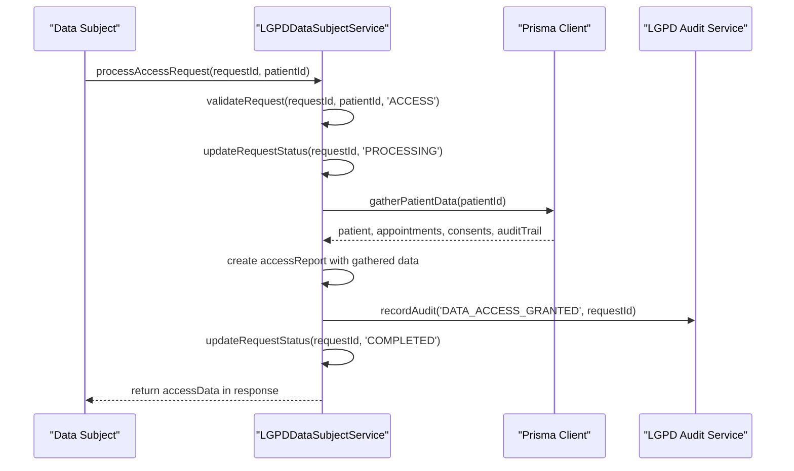
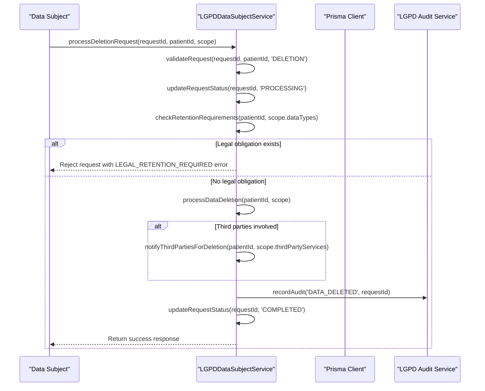
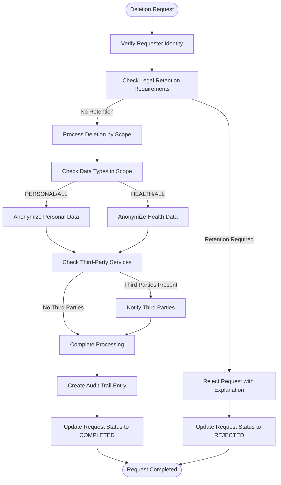
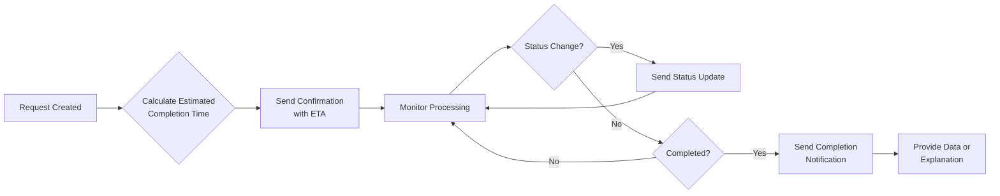
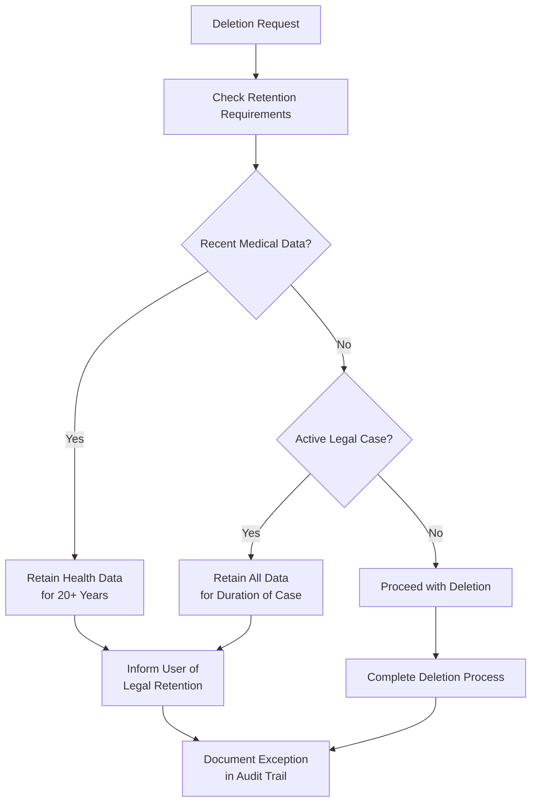
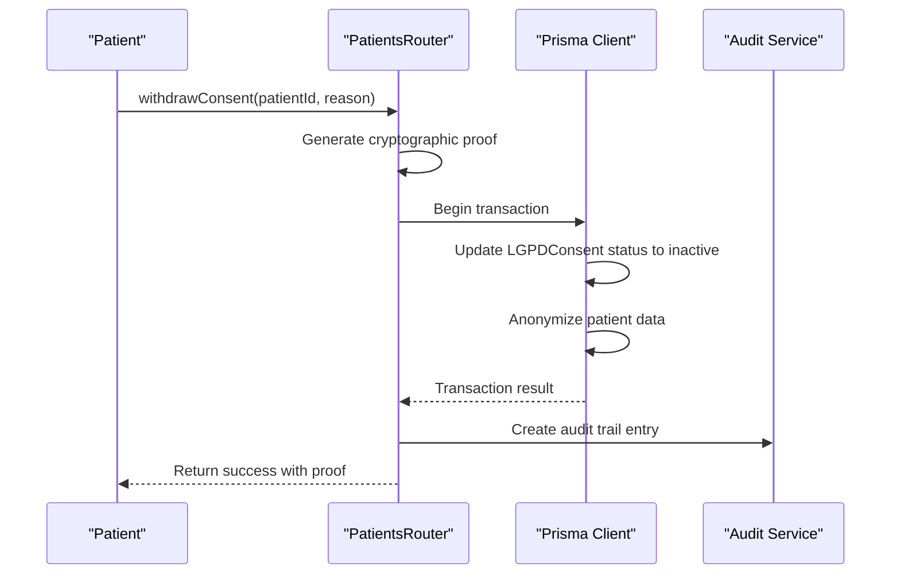

# Data Subject Rights

<cite>
**Referenced Files in This Document**   
- [lgpd-data-subject-service.ts](file://apps/api/src/services/lgpd-data-subject-service.ts)
- [patients.ts](file://apps/api/src/routes/patients.ts)
- [patients.ts](file://apps/api/src/trpc/routers/patients.ts)
</cite>

## Table of Contents
1. [Introduction](#introduction)
2. [Core Implementation](#core-implementation)
3. [Request Processing Workflows](#request-processing-workflows)
4. [Technical Safeguards and Data Protection](#technical-safeguards-and-data-protection)
5. [Notification System](#notification-system)
6. [Edge Cases and Legal Considerations](#edge-cases-and-legal-considerations)
7. [API Endpoints for Data Subject Rights](#api-endpoints-for-data-subject-rights)

## Introduction
The neonpro system implements comprehensive data subject rights as required by the Brazilian General Data Protection Law (LGPD). This documentation details how the system handles requests for access, rectification, and deletion of personal data through the LGPDDataSubjectService. The implementation ensures compliance with legal requirements while maintaining robust technical safeguards to prevent accidental data loss. The system provides complete audit trails for all data subject requests and processes them within legally mandated timeframes.

## Core Implementation
The LGPD data subject rights functionality is primarily implemented in the LGPDDataSubjectService class, which handles various types of data subject requests including access, deletion, correction, portability, and automated decision explanations. The service follows a structured approach to request processing, ensuring proper validation, authorization, and audit logging at each step.

```mermaid
classDiagram
class LGPDDataSubjectService {
+createRequest(patientId, requestType, description, options) Promise~LGPDOperationResult~
+processAccessRequest(requestId, patientId) Promise~LGPDOperationResult & {accessData? : AccessRequestData}~
+processDeletionRequest(requestId, patientId, scope) Promise~LGPDOperationResult~
+processPortabilityRequest(requestId, patientId, exportOptions) Promise~LGPDOperationResult & {exportData? : any, exportUrl? : string}~
+processAutomatedDecisionExplanation(requestId, patientId, decisionId?) Promise~LGPDOperationResult & {explanation? : any}~
+getRequestStatus(requestId, patientId) Promise~LGPDOperationResult & {_request? : DataSubjectRequest}~
+listPatientRequests(patientId, options) Promise~LGPDOperationResult & {requests? : DataSubjectRequest[]}~
}
class DataSubjectRequest {
id : string
patientId : string
requestType : RequestType
status : RequestStatus
priority : ProcessingPriority
description : string
requestData? : Record<string, any>
response? : string
responseData? : any
processedAt? : Date
processedBy? : string
estimatedCompletion? : Date
rejectionReason? : string
escalationReason? : string
reviewNotes? : string
complianceReferences? : string[]
createdAt : Date
updatedAt : Date
}
class AccessRequestData {
personalData : any
healthData : any
consentRecords : any
auditTrail : any
thirdPartySharing? : any
automatedDecisions? : any
retentionInfo? : any
}
class DeletionScope {
dataTypes : string[]
thirdPartyServices : string[]
backupSystems : string[]
retentionExceptions? : string[]
}
LGPDDataSubjectService --> DataSubjectRequest : "manages"
LGPDDataSubjectService --> AccessRequestData : "returns"
LGPDDataSubjectService --> DeletionScope : "uses"
```

**Diagram sources**
- [lgpd-data-subject-service.ts](file://apps/api/src/services/lgpd-data-subject-service.ts#L70-L960)

**Section sources**
- [lgpd-data-subject-service.ts](file://apps/api/src/services/lgpd-data-subject-service.ts#L70-L960)

## Request Processing Workflows
The system implements distinct workflows for different types of data subject requests, each following LGPD requirements for processing timelines and verification procedures. All requests begin with identity verification to ensure that only authorized individuals can access or modify personal data.

### Access Request Workflow
When a data access request is submitted, the system follows this sequence:
1. Verify the requester's identity and ownership of the data
2. Validate that the request type matches the intended operation
3. Gather all relevant patient data from various sources
4. Compile a comprehensive access report with data summary
5. Record audit trail entries for both request creation and completion
6. Update request status to completed with response data



**Diagram sources**
- [lgpd-data-subject-service.ts](file://apps/api/src/services/lgpd-data-subject-service.ts#L172-L243)

### Deletion Request Workflow
For deletion requests, the system implements additional safeguards to prevent accidental data loss:
1. Verify requester identity and request type
2. Check for legal retention requirements that may prevent deletion
3. Process deletion across all systems according to specified scope
4. Notify third-party services if required
5. Create comprehensive audit trail
6. Update request status upon completion



**Diagram sources**
- [lgpd-data-subject-service.ts](file://apps/api/src/services/lgpd-data-subject-service.ts#L248-L332)

**Section sources**
- [lgpd-data-subject-service.ts](file://apps/api/src/services/lgpd-data-subject-service.ts#L248-L332)

## Technical Safeguards and Data Protection
The system implements multiple technical safeguards to protect against accidental data loss during deletion operations and ensure data integrity throughout the process.

### Partial Redaction Handling
For sensitive operations like deletion, the system employs partial redaction techniques rather than complete data removal when appropriate. Personal identifiers are anonymized while preserving necessary medical history for legal and healthcare purposes. The anonymization process replaces sensitive fields with standardized values while maintaining referential integrity.



**Diagram sources**
- [lgpd-data-subject-service.ts](file://apps/api/src/services/lgpd-data-subject-service.ts#L500-L550)

**Section sources**
- [lgpd-data-subject-service.ts](file://apps/api/src/services/lgpd-data-subject-service.ts#L500-L550)

## Notification System
The system implements a comprehensive notification framework that keeps users informed about their request status and any limitations on their rights. Notifications are delivered through multiple channels and include detailed information about processing timelines and outcomes.

### Request Status Updates
Users receive notifications at key stages of the request lifecycle:
- Request submission confirmation with estimated completion date
- Processing updates when the request status changes
- Completion notification with access to requested data or explanation of outcome
- Rejection notifications with specific reasons and appeal options

The system calculates estimated completion times based on request type and priority, providing transparent expectations to data subjects.



**Section sources**
- [lgpd-data-subject-service.ts](file://apps/api/src/services/lgpd-data-subject-service.ts#L700-L750)

## Edge Cases and Legal Considerations
The system addresses several edge cases and conflicting legal requirements that may arise during data subject request processing.

### Conflicting Legal Requirements
When data retention obligations conflict with deletion requests, the system prevents deletion and provides clear explanations to the data subject. The checkRetentionRequirements method evaluates multiple factors including:
- Recent medical data (retained for 20+ years as required by law)
- Active legal proceedings that require data preservation
- Regulatory compliance requirements for healthcare records



**Diagram sources**
- [lgpd-data-subject-service.ts](file://apps/api/src/services/lgpd-data-subject-service.ts#L550-L600)

**Section sources**
- [lgpd-data-subject-service.ts](file://apps/api/src/services/lgpd-data-subject-service.ts#L550-L600)

## API Endpoints for Data Subject Rights
The system exposes several API endpoints that implement data subject rights, with the patients.ts file containing key implementations.

### Withdraw Consent Endpoint
The withdrawConsent endpoint implements the "right to be forgotten" by allowing patients to withdraw their consent and trigger data anonymization:



**Diagram sources**
- [patients.ts](file://apps/api/src/trpc/routers/patients.ts#L165-L682)

**Section sources**
- [patients.ts](file://apps/api/src/trpc/routers/patients.ts#L165-L682)