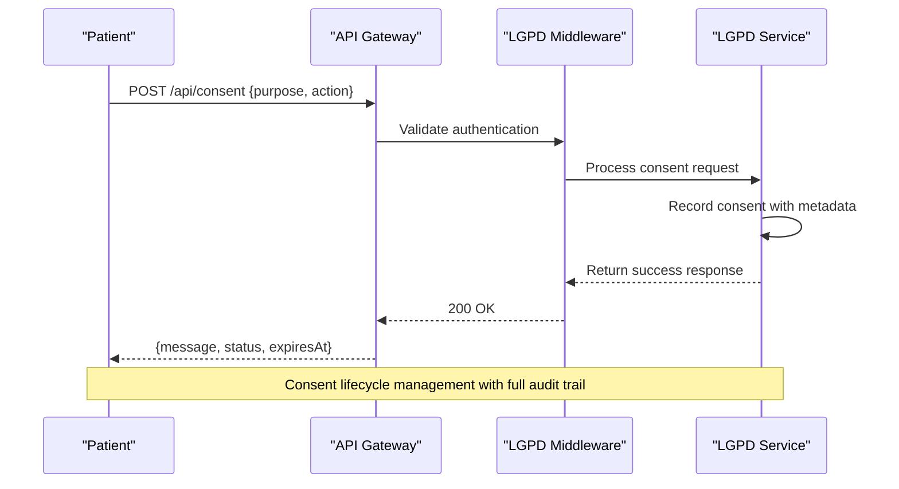
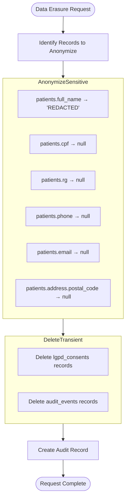
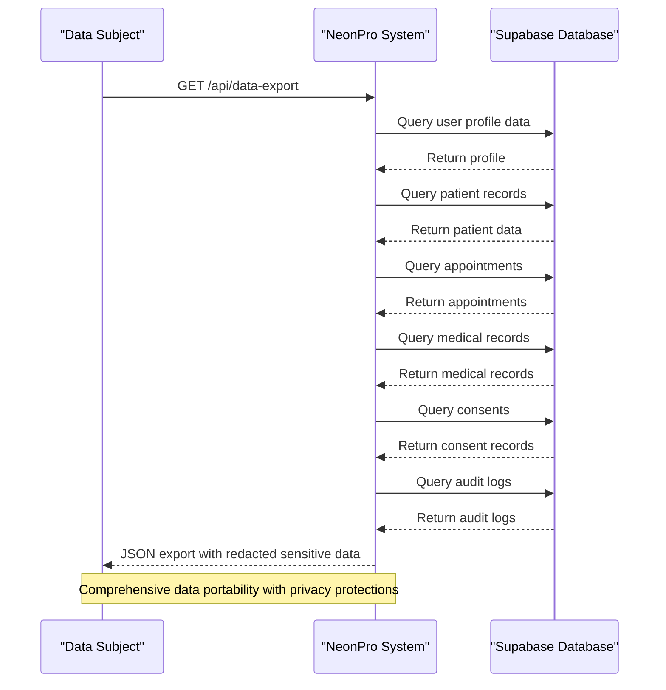
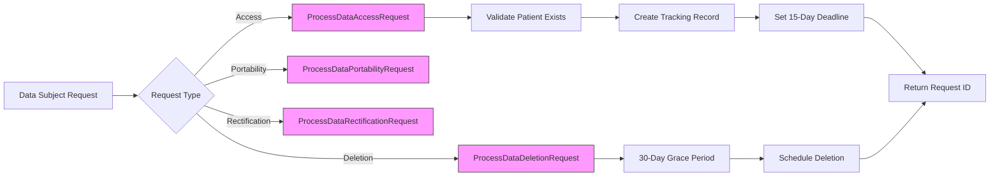
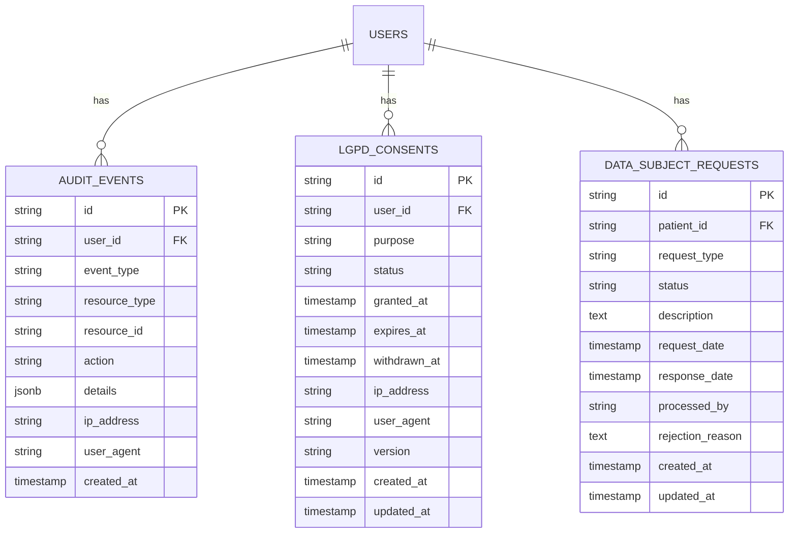
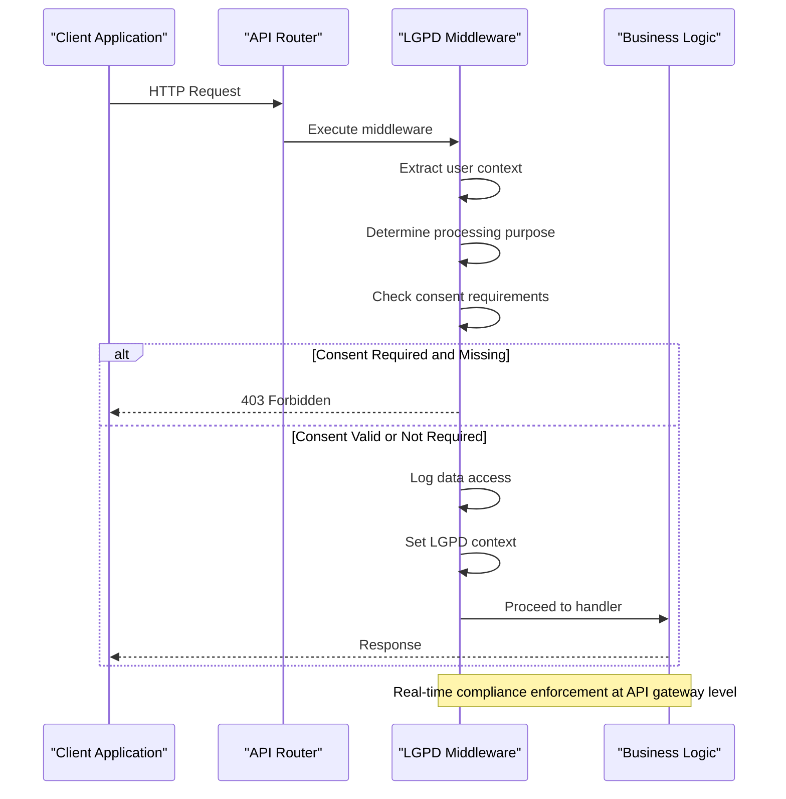
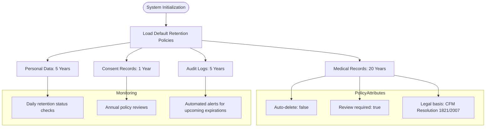

# LGPD Compliance

<cite>
**Referenced Files in This Document**
- [lgpd-middleware.ts](file://apps/api/src/middleware/lgpd-middleware.ts)
- [lgpd-service.ts](file://apps/api/src/services/lgpd-service.ts)
</cite>

## Table of Contents

1. [Introduction](#introduction)
2. [Consent Management Workflows](#consent-management-workflows)
3. [Data Anonymization and Pseudonymization](#data-anonymization-and-pseudonymization)
4. [Data Subject Rights Implementation](#data-subject-rights-implementation)
5. [Data Subject Request Handling](#data-subject-request-handling)
6. [Audit Trails and Compliance Verification](#audit-trails-and-compliance-verification)
7. [API Layer Enforcement](#api-layer-enforcement)
8. [Cross-Border Data Transfer and Retention Policies](#cross-border-data-transfer-and-retention-policies)

## Introduction

This document details the implementation of LGPD (Lei Geral de Proteção de Dados) compliance within the neonpro system. The Brazilian data protection law requires strict adherence to principles of transparency, accountability, and data subject rights. The system implements comprehensive mechanisms for consent management, data protection, and regulatory compliance through dedicated middleware and service components.

The core LGPD compliance features are implemented in two primary components: `lgpd-middleware.ts` which handles request-level compliance checks at the API layer, and `lgpd-service.ts` which provides business logic for consent management, data subject requests, and compliance operations. These components work together to ensure that all processing of personal data adheres to LGPD requirements.

**Section sources**

- [lgpd-middleware.ts](file://apps/api/src/middleware/lgpd-middleware.ts#L1-L50)
- [lgpd-service.ts](file://apps/api/src/services/lgpd-service.ts#L1-L50)

## Consent Management Workflows

The LGPD compliance system implements a comprehensive consent management workflow that covers collection, storage, and verification of patient consent. The system distinguishes between different processing purposes including medical care, appointment scheduling, billing, and other data processing activities.

Consent collection is handled through dedicated endpoints that allow patients to grant or withdraw consent for specific processing purposes. When a patient grants consent, the system records detailed information including the user ID, processing purpose, timestamp, IP address, user agent, and consent version. The `consentMiddleware` function processes these requests and maintains an audit trail of all consent actions.

**Diagram sources**

- [lgpd-middleware.ts](file://apps/api/src/middleware/lgpd-middleware.ts#L236-L349)
- [lgpd-service.ts](file://apps/api/src/services/lgpd-service.ts#L282-L323)

The system supports multiple consent statuses including pending, granted, denied, withdrawn, and expired. Each consent record includes expiration dates (typically one year from granting) and withdrawal timestamps when applicable. The `createConsent` method in the LGPD service validates input parameters and creates consent records with appropriate legal basis and processing purposes.

Consent verification occurs automatically through the `lgpdMiddleware` which intercepts API requests and checks whether valid consent exists for the requested processing purpose. If explicit consent is required and not present, the middleware returns a 403 Forbidden response directing the user to the consent URL. The system also logs all data access attempts for audit purposes, recording whether consent was present at the time of access.

**Section sources**

- [lgpd-middleware.ts](file://apps/api/src/middleware/lgpd-middleware.ts#L13-L234)
- [lgpd-service.ts](file://apps/api/src/services/lgpd-service.ts#L282-L428)

## Data Anonymization and Pseudonymization

The system implements robust data anonymization and pseudonymization techniques to protect sensitive health information as required by LGPD Article 7, Section X. These techniques are applied both for data erasure requests and for creating anonymized datasets for research and analytics purposes.

For data erasure requests, the system implements a hybrid approach combining true deletion with anonymization. Sensitive fields such as CPF (Brazilian individual taxpayer registry), RG (identity card), phone numbers, email addresses, and postal codes are either redacted or set to null values. Personal identifiers like full names are replaced with generic placeholders like "REDACTED". This approach ensures compliance with legal requirements while maintaining referential integrity in related records.

**Diagram sources**

- [lgpd-middleware.ts](file://apps/api/src/middleware/lgpd-middleware.ts#L576-L678)
- [lgpd-service.ts](file://apps/api/src/services/lgpd-service.ts#L1095-L1120)

The LGPD service also provides advanced anonymization capabilities through the `anonymizePatientData` method, which supports multiple anonymization methods including k-anonymity, l-diversity, t-closeness, and differential privacy. These methods are particularly useful for creating research datasets where statistical analysis is needed without compromising individual privacy.

The system validates the quality of anonymization through the `validateAnonymizationQuality` method, which returns a quality score between 0.85 and 0.95 along with risk assessment and recommendations for improvement. This ensures that anonymized datasets meet appropriate privacy standards before being released for secondary use.

**Section sources**

- [lgpd-middleware.ts](file://apps/api/src/middleware/lgpd-middleware.ts#L576-L678)
- [lgpd-service.ts](file://apps/api/src/services/lgpd-service.ts#L1095-L1153)

## Data Subject Rights Implementation

The system fully implements the data subject rights specified in LGPD Article 18, including the right to access, rectification, and deletion of personal data. These rights are enforced through dedicated middleware and service endpoints that handle each type of data subject request.

The right to access is implemented through the `dataPortabilityMiddleware` which handles requests to `/api/v1/data-export`. When a patient requests their data, the system collects information from multiple sources including user profiles, patient records, appointments, medical records, consent records, and audit logs. Sensitive data such as CPF and postal codes are redacted in the exported data to prevent re-identification.

**Diagram sources**

- [lgpd-middleware.ts](file://apps/api/src/middleware/lgpd-middleware.ts#L416-L570)
- [lgpd-service.ts](file://apps/api/src/services/lgpd-service.ts#L469-L513)

The right to rectification is implemented through the `processDataRectificationRequest` method, which allows patients to request corrections to inaccurate personal data. The system captures the field to be corrected, the current value, the proposed new value, and the justification for the change. These requests are processed according to organizational policies and typically approved unless there are legal or medical reasons to maintain the original data.

The right to deletion (or "right to be forgotten") is implemented through the `dataErasureMiddleware` which handles requests to `/api/v1/data-erasure`. As described in the anonymization section, this process involves both true deletion of certain records and anonymization of others to comply with legal retention requirements while respecting the data subject's request.

**Section sources**

- [lgpd-middleware.ts](file://apps/api/src/middleware/lgpd-middleware.ts#L416-L678)
- [lgpd-service.ts](file://apps/api/src/services/lgpd-service.ts#L469-L576)

## Data Subject Request Handling

The system implements a comprehensive workflow for handling data subject requests, ensuring timely responses and proper documentation as required by LGPD. All data subject requests are tracked through the `DataSubjectRequest` interface, which captures essential information including the patient ID, request type, description, urgency level, and processing status.

When a data access request is submitted, the system creates a tracking record and sets an estimated completion date based on LGPD requirements. The law mandates that organizations respond to data subject requests within 15 days, so the system automatically calculates an estimated completion date 15 days from the request date. For deletion requests, the system implements a 30-day grace period before final processing, allowing for verification and potential revocation of the request.

**Diagram sources**

- [lgpd-service.ts](file://apps/api/src/services/lgpd-service.ts#L469-L576)
- [lgpd-service.ts](file://apps/api/src/services/lgpd-service.ts#L548-L576)

The LGPD service maintains a centralized repository of all data subject requests, allowing administrators to monitor request volumes, processing times, and fulfillment rates. The `getPrivacyImpactAssessments` method can filter requests by status (pending, in progress, completed, rejected) and risk level, providing valuable insights for compliance reporting.

Each request type follows a specific processing workflow:

- Access requests trigger immediate validation of patient existence and creation of a tracking record
- Portability requests generate a secure download URL with the requested format (JSON, CSV, PDF)
- Deletion requests initiate the 30-day grace period and schedule the anonymization/deletion process
- Rectification requests capture the proposed changes and justification for review

All request processing is logged in the audit system, creating an immutable record of when requests were received, who processed them, and the outcome of each request.

**Section sources**

- [lgpd-service.ts](file://apps/api/src/services/lgpd-service.ts#L469-L576)
- [lgpd-service.ts](file://apps/api/src/services/lgpd-service.ts#L548-L576)

## Audit Trails and Compliance Verification

The system maintains comprehensive audit trails for all LGPD-related activities, providing verifiable evidence of compliance with Brazilian data protection requirements. Every significant action related to personal data processing is logged with detailed metadata including timestamp, user ID, IP address, user agent, and action description.

The audit system captures several categories of events:

- Consent actions (granting, updating, revoking)
- Data access attempts (successful and failed)
- Data subject requests (submission and processing)
- Data modification and deletion operations
- Compliance violations and security incidents

**Diagram sources**

- [lgpd-middleware.ts](file://apps/api/src/middleware/lgpd-middleware.ts#L600-L650)
- [lgpd-service.ts](file://apps/api/src/services/lgpd-service.ts#L282-L428)

The `exportUserData` function demonstrates the integration between audit logging and data subject rights. When a patient requests their data portability package, the system includes their audit log history (limited to the last 1000 records) showing all system interactions involving their data. This transparency empowers data subjects to understand how their information has been used and accessed.

Compliance verification is further supported by the `generateComplianceReport` method, which produces regular reports (daily, weekly, monthly, quarterly, annual) containing key metrics such as:

- Total number of active consents
- Percentage of compliant consent records
- Volume of data subject requests
- Processing activity summaries by legal basis and purpose
- Compliance score across multiple dimensions

These reports help organizations demonstrate accountability and identify areas for improvement in their data protection practices.

**Section sources**

- [lgpd-middleware.ts](file://apps/api/src/middleware/lgpd-middleware.ts#L416-L570)
- [lgpd-service.ts](file://apps/api/src/services/lgpd-service.ts#L950-L990)

## API Layer Enforcement

LGPD policies are enforced at the API layer through the `lgpdMiddleware` component, which acts as a gatekeeper for all incoming requests that involve personal data processing. This middleware implements a zero-trust approach, requiring explicit validation of compliance requirements before allowing requests to proceed to business logic handlers.

The middleware operates through several key functions:

- `lgpdMiddleware`: The core compliance checker that evaluates each request against configured policies
- `healthcareLGPDMiddleware`: A specialized variant for healthcare-specific endpoints with stricter requirements
- `consentMiddleware`: Handles consent collection and modification requests
- `dataPortabilityMiddleware`: Manages data export requests
- `dataErasureMiddleware`: Processes data deletion/anonymization requests

**Diagram sources**

- [lgpd-middleware.ts](file://apps/api/src/middleware/lgpd-middleware.ts#L143-L234)
- [lgpd-middleware.ts](file://apps/api/src/middleware/lgpd-middleware.ts#L227-L234)

The middleware uses a purpose-based authorization model, where different API endpoints require different levels of consent based on their processing purpose. The `getProcessingPurpose` function maps request paths to specific purposes:

- Medical care (for patient and medical record endpoints)
- Appointment scheduling (for appointment endpoints)
- Billing (for payment and invoice endpoints)
- General consent (for other operations)

Some purposes like legal obligation and vital interest do not require explicit consent under LGPD, so the middleware exempts these from consent checks while still logging the access for audit purposes. For all other purposes, the middleware verifies that valid consent exists before allowing the request to proceed.

The system also supports configurable strictness modes through the `LGPDConfig` interface, allowing different enforcement policies for development, testing, and production environments. In strict mode, missing consent results in a 403 error, while in non-strict mode, the request may proceed with only audit logging.

**Section sources**

- [lgpd-middleware.ts](file://apps/api/src/middleware/lgpd-middleware.ts#L143-L349)
- [lgpd-middleware.ts](file://apps/api/src/middleware/lgpd-middleware.ts#L18-L25)

## Cross-Border Data Transfer and Retention Policies

The system implements data retention policies aligned with Brazilian legal requirements, particularly CFM Resolution 1821/2007 and LGPD Article 16. These policies govern how long different categories of personal data must be retained and when they can be deleted or anonymized.

The LGPD service maintains a `retentionPolicies` map that defines retention periods for different data categories:

- Medical records: 20 years (per CFM Resolution 1821/2007)
- Personal data: 5 years (per LGPD Art. 16)
- Consent records: 1 year (typical consent duration)
- Audit logs: 5 years (for compliance verification)

**Diagram sources**

- [lgpd-service.ts](file://apps/api/src/services/lgpd-service.ts#L250-L270)
- [lgpd-service.ts](file://apps/api/src/services/lgpd-service.ts#L750-L815)

The system supports both automatic and manual retention management. For data categories with `autoDelete: true`, the system can automatically remove records when they reach the end of their retention period. For more sensitive data like medical records, the system requires manual review through the `processRetentionReview` method before any deletion or anonymization occurs.

Regarding cross-border data transfers, the current implementation assumes that all data remains within Brazil, as required by LGPD for health data. The system does not implement specific mechanisms for international data transfer because neonpro is designed to comply with the strictest interpretation of Brazilian data localization requirements. All database operations use the Supabase client configured to connect to Brazilian-hosted instances.

The `checkRetentionStatus` method provides real-time monitoring of data retention compliance, returning the status of all data categories for a given patient along with the next scheduled review date. This allows administrators to verify compliance at any time and prepare for upcoming retention deadlines.

**Section sources**

- [lgpd-service.ts](file://apps/api/src/services/lgpd-service.ts#L250-L270)
- [lgpd-service.ts](file://apps/api/src/services/lgpd-service.ts#L750-L815)
