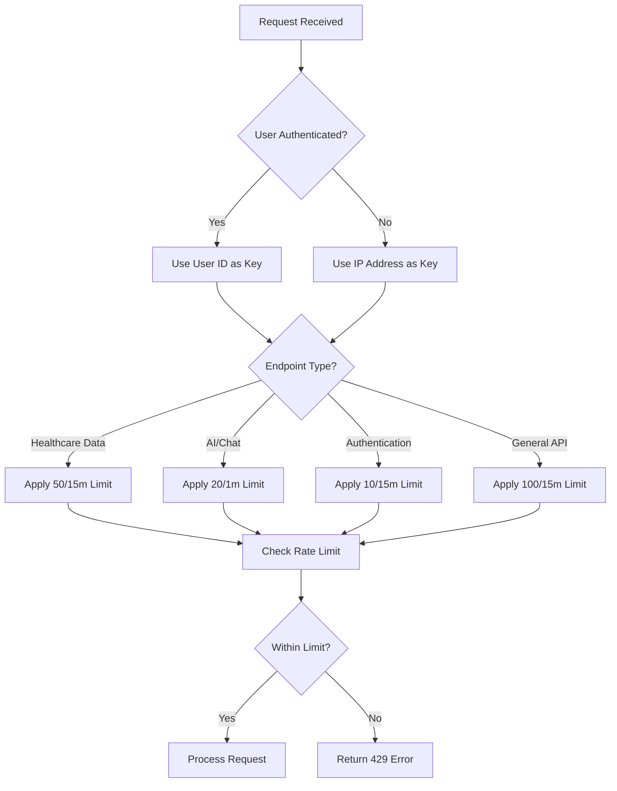
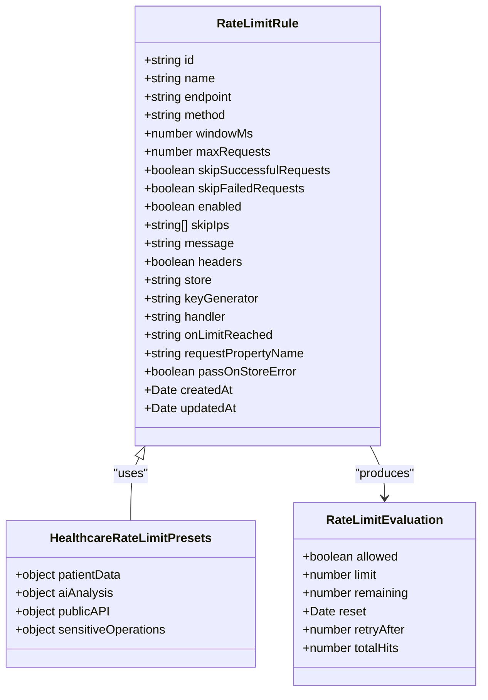
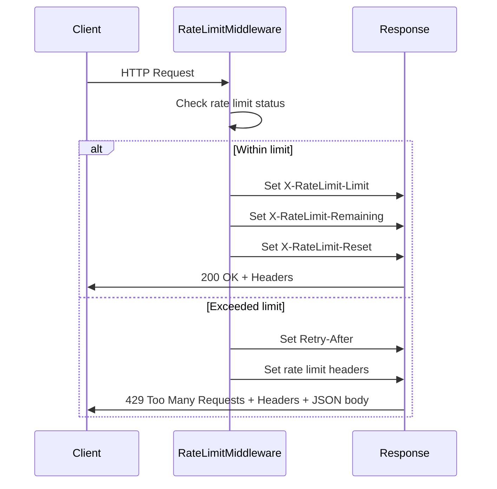

# Rate Limiting

<cite>
**Referenced Files in This Document**
- [rate-limit.ts](file://apps/api/src/middleware/rate-limit.ts)
- [rate-limiting.ts](file://apps/api/src/middleware/rate-limiting.ts)
- [rate-limit-service.ts](file://apps/api/src/services/rate-limit-service.ts)
- [api-rate-limiting.ts](file://packages/shared/src/services/api-rate-limiting.ts)
- [connection-pool-manager.ts](file://apps/api/src/services/connection-pool-manager.ts)
</cite>

## Table of Contents

1. [Introduction](#introduction)
2. [Rate Limiting Strategies](#rate-limiting-strategies)
3. [Storage Mechanism and State Management](#storage-mechanism-and-state-management)
4. [Configuration and Threshold Settings](#configuration-and-threshold-settings)
5. [Integration with Connection Pool Manager](#integration-with-connection-pool-manager)
6. [HTTP Headers for Rate Limit Status](#http-headers-for-rate-limit-status)
7. [Monitoring and Alerting for Abnormal Traffic](#monitoring-and-alerting-for-abnormal-traffic)
8. [Conclusion](#conclusion)

## Introduction

The rate limiting implementation in neonpro is designed to prevent abuse, ensure fair usage, and protect system resources. It employs multiple strategies including IP-based limits, authenticated user limits, and endpoint-specific quotas. The system uses in-memory storage for tracking rate limit state with periodic cleanup of expired entries. Rate limiting is integrated with the connection pool manager to prevent resource exhaustion during high traffic periods. Clients are informed of their rate limit status through standardized HTTP headers such as X-RateLimit-Limit, X-RateLimit-Remaining, and Retry-After. The system also includes monitoring and alerting capabilities to detect abnormal traffic patterns that might indicate scraping or DDoS attacks.

**Section sources**

- [rate-limiting.ts](file://apps/api/src/middleware/rate-limiting.ts#L1-L215)
- [rate-limit-service.ts](file://apps/api/src/services/rate-limit-service.ts#L1-L194)

## Rate Limiting Strategies

neonpro implements several rate limiting strategies tailored to different types of endpoints and user authentication states. For chat and AI endpoints, a dual-window approach is used with both short-term (5 minutes) and long-term (1 hour) limits. The chat-specific rate limiter applies stricter limits of 20 requests per 5 minutes and 100 per hour. For healthcare data endpoints containing sensitive information like patient records, more restrictive limits are enforced with 50 requests allowed per 15-minute window. Authentication endpoints have particularly strict limits of 10 attempts per 15 minutes, counting only failed attempts to prevent brute force attacks while allowing legitimate users to retry after successful logins.

Authenticated users are identified by their user ID when available, falling back to IP address for anonymous users. This allows for more precise rate limiting based on user identity rather than just network location. Different endpoint categories receive different treatment: general API endpoints have a default limit of 100 requests per 15 minutes, while AI/Chat endpoints are limited to 20 requests per minute. The system also supports emergency bypass conditions for critical healthcare operations, allowing certain requests to proceed even when normal rate limits would be exceeded.

**Diagram sources**

- [rate-limit.ts](file://apps/api/src/middleware/rate-limit.ts#L82-L215)
- [rate-limiting.ts](file://apps/api/src/middleware/rate-limiting.ts#L172-L213)

**Section sources**

- [rate-limit.ts](file://apps/api/src/middleware/rate-limit.ts#L1-L222)
- [rate-limiting.ts](file://apps/api/src/middleware/rate-limiting.ts#L1-L215)

## Storage Mechanism and State Management

The rate limiting system primarily uses an in-memory store implemented with JavaScript Map objects to track request counts and expiration times. The `RateLimitStore` class maintains a mapping of keys to count and reset time values, automatically cleaning up expired entries during retrieval operations. A periodic cleanup process runs every 5 minutes to remove any remaining expired entries from the store, preventing unbounded memory growth over time.

For each client, the system tracks the number of requests made within the current time window along with the timestamp when the limit will reset. When evaluating whether a request should be allowed, the system checks the current count against the configured maximum. If the limit has been exceeded, the system calculates the appropriate Retry-After value based on the remaining time until the next window. The in-memory storage approach provides low-latency access to rate limit data while maintaining simplicity and reliability.

In addition to the basic in-memory store, the system supports alternative storage backends through configuration options, though Redis integration appears to be referenced in dependencies without being actively used in the current implementation. The rate limit state is tracked using composite keys that combine the client identifier (user ID or IP address) with the specific rate limit configuration being applied, allowing for fine-grained control over different types of limits simultaneously.

**Section sources**

- [rate-limiting.ts](file://apps/api/src/middleware/rate-limiting.ts#L10-L170)
- [rate-limit-service.ts](file://apps/api/src/services/rate-limit-service.ts#L89-L124)

## Configuration and Threshold Settings

The rate limiting system in neonpro is highly configurable through a comprehensive schema that defines various parameters for each rate limit rule. The `RateLimitRuleSchema` specifies validation rules for properties such as window duration (1 second to 1 hour), maximum requests (1 to 10,000), and storage backend type. Default rules are defined for different healthcare scenarios, including patient data access (30 requests per minute), AI analysis (10 requests per minute), and public API access (100 requests per minute).

Configuration options include the ability to skip counting successful or failed requests, which is particularly useful for authentication endpoints where only failed attempts should contribute to rate limiting. The system also supports IP address exclusions through the skipIps array, allowing trusted clients to bypass rate limits entirely. Each rule can be enabled or disabled independently, providing flexibility in managing different rate limiting policies across the application.

The configuration system supports both standard and legacy rate limit headers, ensuring compatibility with various client implementations. Rules can be customized for specific endpoints using wildcard patterns in the endpoint field, such as `/api/v2/patients/*` for patient data access. The system also includes presets for common healthcare scenarios, making it easy to apply appropriate limits based on the sensitivity and resource requirements of different API endpoints.

**Diagram sources**

- [rate-limit-service.ts](file://apps/api/src/services/rate-limit-service.ts#L8-L32)
- [rate-limit-service.ts](file://apps/api/src/services/rate-limit-service.ts#L136-L192)

**Section sources**

- [rate-limit-service.ts](file://apps/api/src/services/rate-limit-service.ts#L8-L194)
- [api-rate-limiting.ts](file://packages/shared/src/services/api-rate-limiting.ts#L235-L352)

## Integration with Connection Pool Manager

The rate limiting system works in conjunction with the connection pool manager to prevent resource exhaustion during periods of high traffic. While the rate limiting middleware operates at the HTTP request level, the connection pool manager monitors database connection utilization and adjusts pool size dynamically based on workload patterns. The two systems complement each other by addressing different aspects of resource protection: rate limiting controls request frequency, while connection pooling manages concurrent database connections.

When rate limits are approached or exceeded, the system helps prevent cascading failures by rejecting excess requests before they consume valuable database connections. This integration is particularly important for healthcare applications where database performance directly impacts patient care. The connection pool manager uses healthcare-specific workload patterns to anticipate traffic spikes during peak clinic hours (8 AM to 6 PM) and adjusts pool sizing accordingly, while rate limiting ensures that individual clients cannot monopolize these expanded resources.

The monitoring system generates alerts when either rate limits are consistently being hit or when connection pool health degrades, allowing administrators to investigate potential issues. These alerts consider both the technical impact (such as increased error rates) and healthcare-specific implications (such as potential impact on patient safety). By combining rate limiting with intelligent connection pool management, neonpro maintains system stability even under heavy load while prioritizing critical healthcare operations.

**Section sources**

- [connection-pool-manager.ts](file://apps/api/src/services/connection-pool-manager.ts#L48-L163)
- [connection-pool-manager.ts](file://apps/api/src/services/connection-pool-manager.ts#L418-L459)

## HTTP Headers for Rate Limit Status

The rate limiting implementation informs clients of their rate limit status through standardized HTTP headers that follow common conventions. For general rate limiting, the system returns X-RateLimit-Limit, X-RateLimit-Remaining, and X-RateLimit-Reset headers indicating the total limit, remaining requests, and reset time in Unix timestamp format. Additionally, the Retry-After header is included when a 429 Too Many Requests response is returned, specifying the number of seconds the client should wait before making another request.

For chat-specific endpoints, extended headers provide additional granularity with separate limits for short (5-minute) and long (1-hour) windows. These include X-RateLimit-Limit-Short, X-RateLimit-Remaining-Short, X-RateLimit-Reset-Short, X-RateLimit-Limit-Long, X-RateLimit-Remaining-Long, and X-RateLimit-Reset-Long headers. This dual-window approach gives clients detailed information about both immediate and longer-term rate limiting constraints.

When a rate limit is exceeded, the system returns a 429 HTTP status code with a structured JSON response body that includes the error message, code (CHAT_RATE_LIMIT_EXCEEDED), retryAfter value, and details about the applicable limits. This comprehensive feedback enables clients to implement sophisticated retry logic and user interface elements that inform users about their rate limit status and expected wait times.

**Diagram sources**

- [rate-limit.ts](file://apps/api/src/middleware/rate-limit.ts#L82-L215)
- [rate-limiting.ts](file://apps/api/src/middleware/rate-limiting.ts#L103-L170)

**Section sources**

- [rate-limit.ts](file://apps/api/src/middleware/rate-limit.ts#L82-L215)
- [rate-limiting.ts](file://apps/api/src/middleware/rate-limiting.ts#L103-L170)

## Monitoring and Alerting for Abnormal Traffic

The rate limiting system includes comprehensive monitoring and alerting capabilities to detect abnormal traffic patterns that might indicate scraping, DDoS attacks, or other forms of abuse. The system tracks metrics such as total requests, blocked requests, and bypassed requests for each rate limit tier, collecting this data at regular intervals configurable through the monitoring settings. When usage exceeds a configurable threshold (default 80% of limit), the system triggers alerts that include detailed context about the affected tier, category, facility ID, and endpoint.

Alerts are logged with healthcare-specific context, including emergency flags and patient safety indicators, allowing security teams to prioritize responses based on potential clinical impact. The system distinguishes between different types of violations, logging both rate limit violations and emergency bypasses separately for audit purposes. Retention of audit logs is configurable, with a default retention period of 90 days to comply with healthcare regulations.

The monitoring system integrates with the broader observability framework, generating warnings when TLS handshake times exceed thresholds or when deprecated protocols and cipher suites are detected. Security alerts are triggered when there is a high volume of security events within a short timeframe, potentially indicating coordinated attacks. These monitoring capabilities provide early warning of potential issues, enabling proactive response before they impact system availability or patient care.

**Section sources**

- [api-rate-limiting.ts](file://packages/shared/src/services/api-rate-limiting.ts#L977-L1032)
- [api-rate-limiting.ts](file://packages/shared/src/services/api-rate-limiting.ts#L354-L397)

## Conclusion

The rate limiting implementation in neonpro provides a robust defense against abuse while maintaining flexibility for legitimate users. By employing multiple strategies including IP-based limits, authenticated user limits, and endpoint-specific quotas, the system effectively protects resources without unduly restricting access. The in-memory storage mechanism provides efficient state tracking with automatic cleanup of expired entries, ensuring reliable performance under varying loads.

Integration with the connection pool manager creates a layered defense against resource exhaustion, combining request-level throttling with database connection management. Comprehensive HTTP headers keep clients informed of their rate limit status, enabling intelligent retry logic and user feedback. The monitoring and alerting system provides early detection of abnormal traffic patterns, allowing for timely response to potential threats.

Overall, the rate limiting architecture balances security, performance, and usability requirements specific to healthcare applications, ensuring system stability while prioritizing critical operations that impact patient care.
