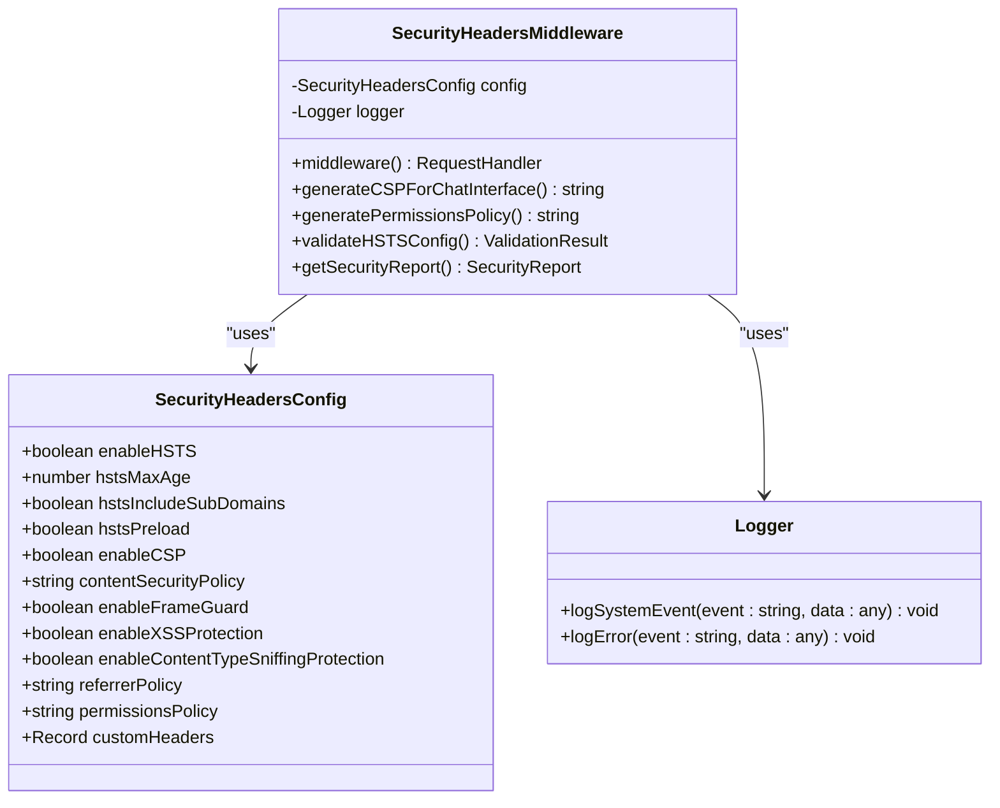
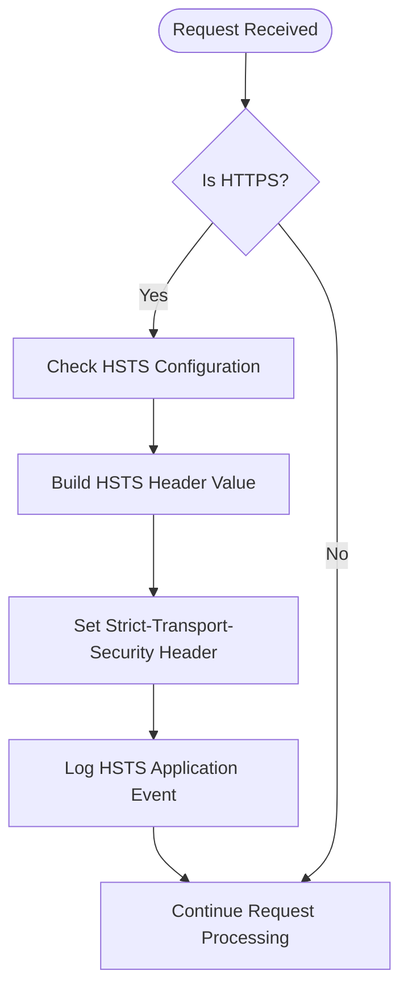
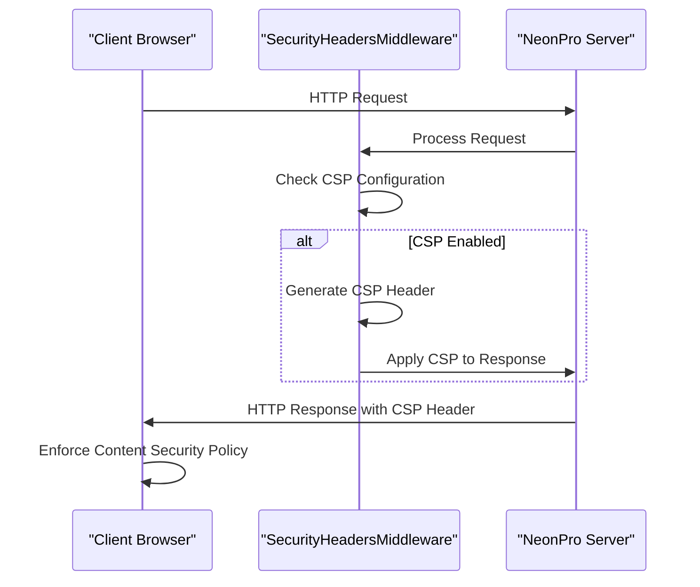
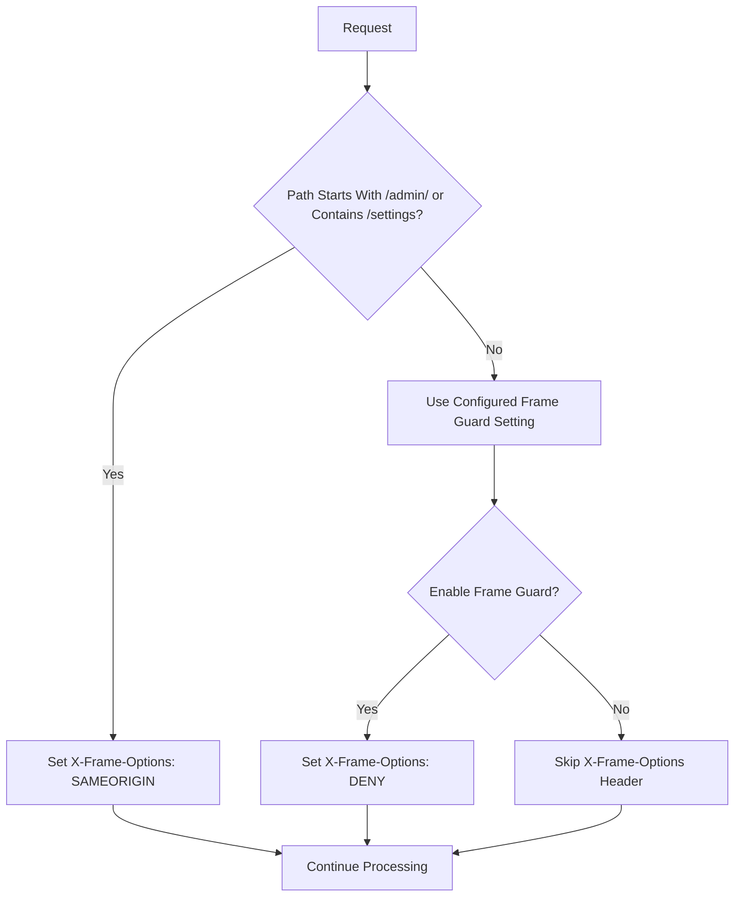
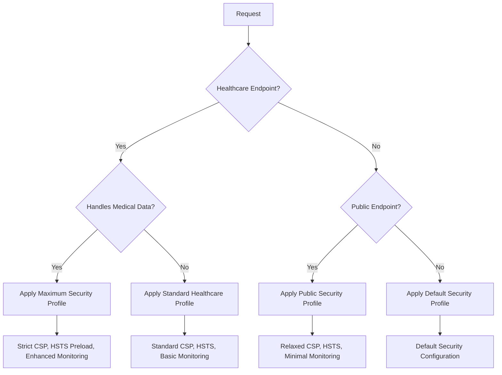

# Security Headers

<cite>
**Referenced Files in This Document **   
- [security-headers.ts](file://apps/api/src/middleware/security-headers.ts)
- [https-config.ts](file://apps/api/src/config/https-config.ts)
- [security-headers-service.ts](file://apps/api/src/services/security-headers-service.ts)
- [csp-report.ts](file://apps/api/vercel/csp-report.ts)
- [security-headers-simple.test.ts](file://apps/api/tests/integration/security-headers-simple.test.ts)
</cite>

## Table of Contents
1. [Introduction](#introduction)
2. [Security Headers Configuration](#security-headers-configuration)
3. [HTTP Strict Transport Security (HSTS)](#http-strict-transport-security-hsts)
4. [Content Security Policy (CSP)](#content-security-policy-csp)
5. [Clickjacking Protection](#clickjacking-protection)
6. [MIME Type Sniffing Protection](#mime-type-sniffing-protection)
7. [Cross-Site Scripting (XSS) Protection](#cross-site-scripting-xss-protection)
8. [Referrer Policy](#referrer-policy)
9. [Permissions Policy](#permissions-policy)
10. [Additional Security Headers](#additional-security-headers)
11. [Healthcare-Specific Security Implementation](#healthcare-specific-security-implementation)
12. [Testing and Validation](#testing-and-validation)
13. [Monitoring and Reporting](#monitoring-and-reporting)

## Introduction
The neonpro backend implements a comprehensive security headers strategy through the `security-headers.ts` middleware to protect against common web vulnerabilities. This document details the implementation of HTTP security headers including Content Security Policy (CSP), X-Content-Type-Options, X-Frame-Options, X-XSS-Protection, Strict-Transport-Security (HSTS), and Referrer-Policy. The security headers are configured to meet healthcare compliance requirements, particularly LGPD standards, while providing robust protection against XSS, clickjacking, MIME type sniffing, and protocol downgrade attacks.

**Section sources**
- [security-headers.ts](file://apps/api/src/middleware/security-headers.ts#L1-L382)

## Security Headers Configuration
The security headers implementation is centered around the `SecurityHeadersMiddleware` class, which provides a configurable approach to applying security headers across the application. The middleware uses the `SecurityHeadersConfig` interface to define configuration options for various security headers.

**Diagram sources **
- [security-headers.ts](file://apps/api/src/middleware/security-headers.ts#L31-L382)

**Section sources**
- [security-headers.ts](file://apps/api/src/middleware/security-headers.ts#L31-L382)

## HTTP Strict Transport Security (HSTS)
The HSTS header enforces secure HTTPS connections by instructing browsers to only communicate with the server over HTTPS for a specified period. In the neonpro implementation, HSTS is conditionally applied when requests are secure (HTTPS).

The HSTS configuration includes:
- `max-age`: Specifies the duration (in seconds) that the browser should remember to access the site using HTTPS only
- `includeSubDomains`: Applies the policy to all subdomains
- `preload`: Indicates the site should be included in browser preload lists

When enabled, the HSTS header is constructed based on the configuration values and applied to secure responses. The implementation logs system events when HSTS is applied, capturing the configuration parameters and request context.

**Diagram sources **
- [security-headers.ts](file://apps/api/src/middleware/security-headers.ts#L48-L62)

**Section sources**
- [security-headers.ts](file://apps/api/src/middleware/security-headers.ts#L48-L62)
- [https-config.ts](file://apps/api/src/config/https-config.ts#L145-L165)

## Content Security Policy (CSP)
The Content Security Policy header is implemented to mitigate cross-site scripting (XSS) attacks by specifying approved sources of content. The CSP implementation in neonpro is highly configurable and includes specialized policies for different application contexts.

The main CSP configuration allows:
- Scripts from self, inline scripts, and specific external domains like cdn.jsdelivr.net
- Connections to WebSocket services and API endpoints
- Images from self, data URLs, and HTTPS sources
- Blocking of mixed content and upgrading insecure requests

Additionally, the implementation includes a specialized CSP generator for the AI chat interface (`generateCSPForChatInterface`) that accommodates the specific requirements of interactive AI components while maintaining security.

**Diagram sources **
- [security-headers.ts](file://apps/api/src/middleware/security-headers.ts#L70-L75)
- [security-headers.ts](file://apps/api/src/middleware/security-headers.ts#L173-L211)

**Section sources**
- [security-headers.ts](file://apps/api/src/middleware/security-headers.ts#L70-L75)
- [security-headers.ts](file://apps/api/src/middleware/security-headers.ts#L173-L211)
- [security-headers-service.ts](file://apps/api/src/services/security-headers-service.ts#L1-L825)

## Clickjacking Protection
Clickjacking protection is implemented through the X-Frame-Options header, which prevents the website from being embedded in iframes on other sites. This mitigates attacks where malicious websites overlay invisible elements on top of legitimate UI components to trick users into performing unintended actions.

The implementation provides two levels of frame protection:
- Default DENY policy that prevents embedding in frames from any origin
- Conditional SAMEORIGIN policy for administrative and settings routes

The default policy is set to DENY when `enableFrameGuard` is true in the configuration. Additionally, the middleware applies more restrictive frame policies for sensitive routes like admin interfaces and user settings.

**Diagram sources **
- [security-headers.ts](file://apps/api/src/middleware/security-headers.ts#L77-L80)
- [security-headers.ts](file://apps/api/src/middleware/security-headers.ts#L155-L164)

**Section sources**
- [security-headers.ts](file://apps/api/src/middleware/security-headers.ts#L77-L80)
- [security-headers.ts](file://apps/api/src/middleware/security-headers.ts#L155-L164)

## MIME Type Sniffing Protection
The X-Content-Type-Options header is used to prevent MIME type sniffing, which could lead to security vulnerabilities when browsers interpret files differently than intended by the server. By setting this header to 'nosniff', the browser is instructed to strictly follow the Content-Type specified by the server rather than attempting to guess the file type.

This protection is particularly important for preventing certain types of XSS attacks where an attacker might upload a file with a benign content type but executable content, relying on the browser's MIME sniffing to execute it as JavaScript.

The implementation conditionally applies this header based on the `enableContentTypeSniffingProtection` configuration flag, ensuring that the protection is active when enabled in the security configuration.

**Section sources**
- [security-headers.ts](file://apps/api/src/middleware/security-headers.ts#L82-L84)

## Cross-Site Scripting (XSS) Protection
The X-XSS-Protection header enables the built-in XSS filter in web browsers. When enabled, the browser will block pages from loading if they detect reflected XSS attacks. The implementation sets this header to '1; mode=block', which instructs the browser to block the page rather than sanitize it when an XSS attack is detected.

This header provides an additional layer of defense against XSS attacks, complementing the Content Security Policy. While modern browsers are increasingly relying on CSP for XSS protection, maintaining the X-XSS-Protection header ensures compatibility with older browsers that may still support this feature.

The header is conditionally applied based on the `enableXSSProtection` configuration option, allowing for flexible security policies across different environments.

**Section sources**
- [security-headers.ts](file://apps/api/src/middleware/security-headers.ts#L86-L88)

## Referrer Policy
The Referrer-Policy header controls how much referrer information is included in requests. The implementation sets this header unconditionally based on the `referrerPolicy` configuration value, with a recommended value of 'strict-origin-when-cross-origin'.

This policy strikes a balance between privacy and functionality:
- For same-origin requests, it sends the full URL
- For cross-origin requests from HTTPS to HTTPS, it sends only the origin
- For cross-origin requests from HTTPS to HTTP, it sends no referrer

This helps prevent sensitive information in URLs from being leaked to third-party sites while maintaining necessary functionality for analytics and security measures that rely on referrer data.

**Section sources**
- [security-headers.ts](file://apps/api/src/middleware/security-headers.ts#L90-L92)

## Permissions Policy
The Permissions-Policy header (formerly Feature-Policy) allows fine-grained control over which browser features and APIs can be used in the context of the website. The implementation includes a comprehensive policy that disables potentially sensitive features by default.

The generated permissions policy disables access to:
- Device sensors (accelerometer, gyroscope, magnetometer)
- Media devices (camera, microphone)
- Location services (geolocation)
- Bluetooth and USB devices
- Payment APIs
- Screen wake lock and display capture

This restrictive approach minimizes the attack surface by preventing unauthorized access to device capabilities, which is particularly important for a healthcare application handling sensitive patient data.

**Section sources**
- [security-headers.ts](file://apps/api/src/middleware/security-headers.ts#L94-L96)
- [security-headers.ts](file://apps/api/src/middleware/security-headers.ts#L213-L251)

## Additional Security Headers
Beyond the core security headers, the implementation includes several additional security measures:

### Server Information Removal
The middleware removes the 'X-Powered-By' header to prevent exposing server technology details that could aid attackers in identifying potential vulnerabilities.

### Custom Headers
Custom security-related headers can be added through the `customHeaders` configuration option, allowing for organization-specific security markings and compliance indicators.

### Additional Security Headers
The `addAdditionalSecurityHeaders` method applies context-specific security headers:
- Cache control headers to prevent caching of sensitive information on API and authentication endpoints
- CORS headers for API endpoints to control cross-origin access
- Anti-clickjacking policies for administrative routes
- Response timing headers for monitoring purposes

These additional headers provide layered security that adapts to the specific characteristics of different routes and request types.

**Section sources**
- [security-headers.ts](file://apps/api/src/middleware/security-headers.ts#L100-L129)

## Healthcare-Specific Security Implementation
The neonpro platform includes specialized security configurations for healthcare applications, addressing the unique requirements of medical data protection and regulatory compliance.

The `healthcareSecurityHeadersMiddleware` function provides a pre-configured security profile optimized for healthcare endpoints, featuring:
- HSTS with 1-year max-age, includeSubDomains, and preload directives
- Comprehensive CSP with restrictions on object and frame sources
- Strict referrer policy
- Healthcare-specific custom headers indicating LGPD compliance
- Permissions policy restricting access to sensitive device features

Additionally, the implementation includes a dedicated `SecurityHeadersService` that generates security headers based on healthcare context, assessing factors such as:
- Whether the endpoint handles medical data
- Patient authentication requirements
- Data sensitivity level
- Emergency access scenarios

This context-aware approach ensures that security measures are appropriately stringent for high-sensitivity medical data while maintaining usability for less sensitive operations.

**Diagram sources **
- [security-headers.ts](file://apps/api/src/middleware/security-headers.ts#L348-L380)
- [security-headers-service.ts](file://apps/api/src/services/security-headers-service.ts#L1-L825)

**Section sources**
- [security-headers.ts](file://apps/api/src/middleware/security-headers.ts#L348-L380)
- [security-headers-service.ts](file://apps/api/src/services/security-headers-service.ts#L1-L825)

## Testing and Validation
The security headers implementation is validated through comprehensive testing to ensure proper configuration and effectiveness.

Integration tests verify that required security headers are present and correctly configured:
- Strict-Transport-Security with appropriate max-age and directives
- X-Content-Type-Options set to 'nosniff'
- X-Frame-Options set to 'DENY' for maximum protection
- X-XSS-Protection enabled in block mode
- Content-Security-Policy with appropriate directives
- Referrer-Policy with secure configuration

The tests also validate healthcare-specific requirements:
- HSTS max-age of at least one year (31,536,000 seconds)
- Strict CSP directives blocking object and frame sources
- Presence of healthcare compliance headers
- API version identification
- Absence of sensitive server information

These tests ensure that the security headers meet both general web security best practices and specific healthcare compliance requirements.

**Section sources**
- [security-headers-simple.test.ts](file://apps/api/tests/integration/security-headers-simple.test.ts#L0-L175)

## Monitoring and Reporting
The implementation includes comprehensive monitoring and reporting capabilities for security headers.

### CSP Violation Reporting
A dedicated CSP report collector endpoint (`csp-report.ts`) receives violation reports from browsers when content security policies are violated. The collector:
- Accepts POST requests with CSP violation reports
- Processes multiple content types (application/reports+json, application/csp-report, text/plain)
- Redacts potentially sensitive information to protect patient privacy
- Logs minimal non-PII details for security analysis
- Returns 204 No Content to avoid interfering with client-side behavior

### Security Event Logging
The middleware logs system events when security headers are applied, capturing:
- HSTS application with configuration details
- General security headers application with applied headers list
- Error events when header processing fails

### Security Reporting
The `getSecurityReport` method provides a comprehensive overview of the current security configuration, including:
- Enabled security features
- HSTS configuration details
- CSP status
- Validation results with errors and warnings
- Overall security assessment

This reporting capability enables administrators to monitor the security posture of the application and identify potential configuration issues.

**Section sources**
- [csp-report.ts](file://apps/api/vercel/csp-report.ts#L0-L106)
- [security-headers.ts](file://apps/api/src/middleware/security-headers.ts#L306-L328)