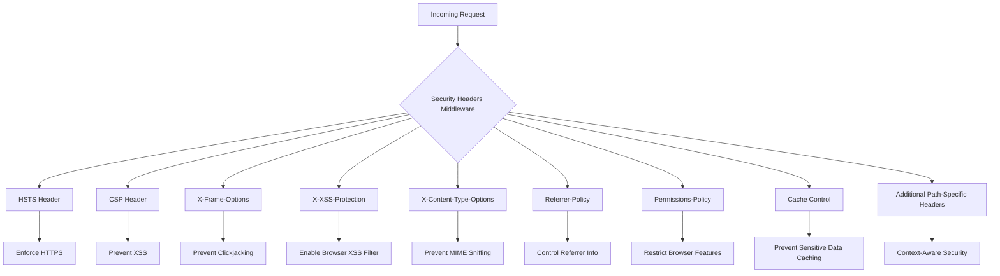
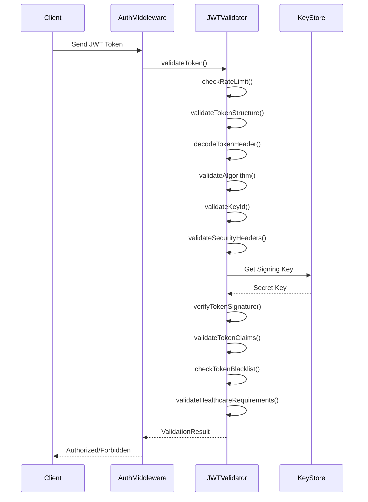
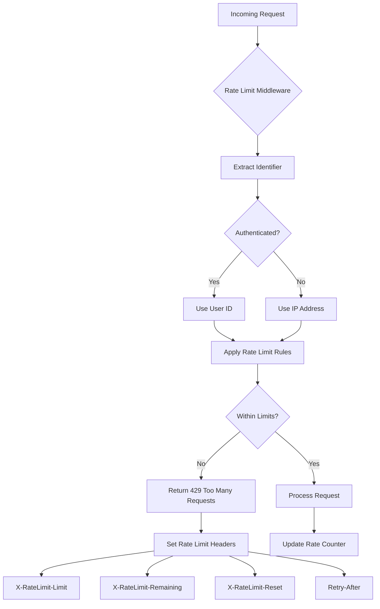
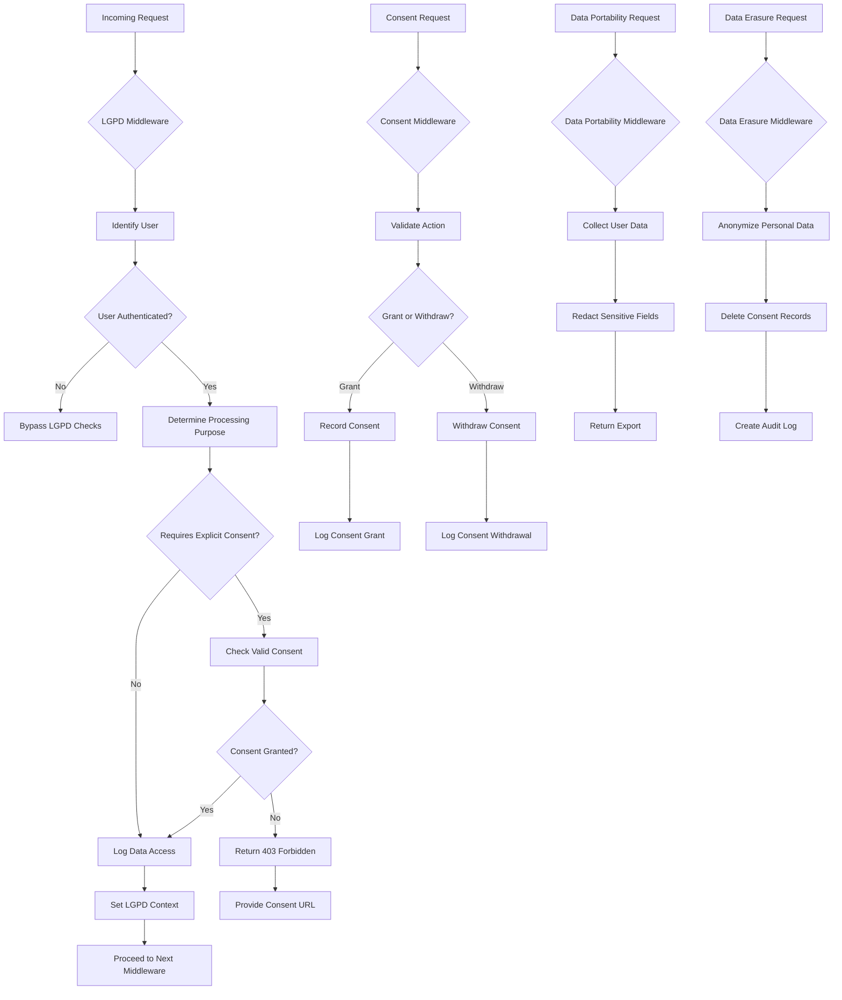

# Security Implementation

<cite>
**Referenced Files in This Document**
- [security-headers.ts](file://apps/api/src/middleware/security-headers.ts)
- [jwt-validator.ts](file://apps/api/src/security/jwt-validator.ts)
- [rate-limit.ts](file://apps/api/src/middleware/rate-limit.ts)
- [rate-limiting.ts](file://apps/api/src/middleware/rate-limiting.ts)
- [lgpd-middleware.ts](file://apps/api/src/middleware/lgpd-middleware.ts)
- [sql-sanitizer.ts](file://apps/api/src/security/sql-sanitizer.ts)
- [error-handler.ts](file://apps/api/src/middleware/error-handler.ts)
- [auth.ts](file://apps/api/src/middleware/auth.ts)
- [session-cookie-utils.ts](file://apps/api/src/security/session-cookie-utils.ts)
</cite>

## Table of Contents

1. [Introduction](#introduction)
2. [HTTP Security Headers](#http-security-headers)
3. [Authentication and JWT Validation](#authentication-and-jwt-validation)
4. [Session Management](#session-management)
5. [Rate Limiting Strategies](#rate-limiting-strategies)
6. [LGPD Compliance Protections](#lgpd-compliance-protections)
7. [Input Sanitization and SQL Injection Prevention](#input-sanitization-and-sql-injection-prevention)
8. [Secure Error Handling](#secure-error-handling)
9. [Middleware Composition and Security Policy Enforcement](#middleware-composition-and-security-policy-enforcement)
10. [Conclusion](#conclusion)

## Introduction

This document provides a comprehensive overview of the security implementation in neonpro's backend architecture. The system employs a multi-layered security approach that addresses various aspects of application security, including HTTP security headers, authentication flows, rate limiting, LGPD compliance, input sanitization, and secure error handling. The security model is designed to protect sensitive healthcare data while ensuring compliance with Brazilian data protection regulations (LGPD). Security policies are consistently applied across all endpoints through a well-structured middleware composition system that ensures defense in depth.

## HTTP Security Headers

The security implementation begins with robust HTTP security headers that protect against common web vulnerabilities. Implemented in `security-headers.ts`, this middleware configures multiple security headers to enhance the application's security posture. The system implements HSTS (HTTP Strict Transport Security) with configurable max-age, subdomain inclusion, and preload directives to enforce HTTPS connections. Content Security Policy (CSP) is implemented to mitigate cross-site scripting (XSS) attacks by restricting the sources from which content can be loaded. The implementation includes specific CSP configurations for different application interfaces, such as the AI chat interface, with tailored directives for script, style, image, font, and connection sources.

Additional security headers include X-Frame-Options to prevent clickjacking attacks, X-XSS-Protection to enable browser XSS filters, and X-Content-Type-Options to prevent MIME type sniffing. The system also implements Referrer-Policy to control referrer information disclosure and Permissions-Policy to restrict access to powerful browser features like camera, microphone, geolocation, and others. Sensitive information is protected by removing the X-Powered-By header and implementing strict caching policies for API and authentication endpoints. The middleware dynamically applies additional security headers based on request paths, with more restrictive policies for administrative and settings routes.



**Diagram sources**

- [security-headers.ts](file://apps/api/src/middleware/security-headers.ts#L1-L382)

**Section sources**

- [security-headers.ts](file://apps/api/src/middleware/security-headers.ts#L1-L382)

## Authentication and JWT Validation

The authentication system is built around JWT (JSON Web Token) validation, implemented in `jwt-validator.ts` with comprehensive security checks following OWASP best practices and healthcare compliance requirements. The JWT validator performs multiple layers of validation to prevent common attacks such as algorithm confusion, where an attacker might try to change the token's algorithm to 'none' to bypass signature verification. The system explicitly rejects the 'none' algorithm and only allows approved algorithms (HS256 and HS512), preventing signature bypass attacks.

The validation process includes checking audience and issuer claims against whitelisted values, ensuring tokens are used for their intended purposes and issued by trusted authorities. Token expiration is strictly enforced with configurable maximum lifetimes (default 24 hours) to limit the window of opportunity for token misuse. The system implements key ID (kid) validation to support key rotation and ensure tokens are signed with authorized keys. Healthcare-specific validation ensures user roles are valid for the application context, restricting access to appropriate user types such as patients, healthcare professionals, and administrators.

Additional security features include rate limiting for authentication attempts to prevent brute force attacks, token blacklisting for immediate revocation of compromised tokens, and HTTPS enforcement in production environments. The validator integrates with a secret manager to securely store and retrieve signing keys, avoiding hardcoded secrets. The system supports token revocation at both the individual token level (using JWT ID) and user level (revoking all tokens for a user), providing flexible security controls for different scenarios.



**Diagram sources**

- [jwt-validator.ts](file://apps/api/src/security/jwt-validator.ts#L1-L712)

**Section sources**

- [jwt-validator.ts](file://apps/api/src/security/jwt-validator.ts#L1-L712)
- [auth.ts](file://apps/api/src/middleware/auth.ts#L1-L200)

## Session Management

Session management in neonpro combines JWT-based authentication with secure session handling practices. The system uses JWT tokens as the primary authentication mechanism, with tokens stored securely in HTTP-only, SameSite cookies to prevent cross-site scripting (XSS) and cross-site request forgery (CSRF) attacks. Session-related utilities in `session-cookie-utils.ts` handle the secure creation, validation, and destruction of session cookies with appropriate security attributes.

The architecture supports both short-lived access tokens and refresh tokens for maintaining user sessions without compromising security. Access tokens have limited lifetimes (typically 15-30 minutes) to minimize exposure if compromised, while refresh tokens are longer-lived but stored securely and subject to additional validation. The system implements token revocation mechanisms that allow immediate invalidation of sessions when necessary, such as when users log out or when suspicious activity is detected.

Session state is kept minimal in tokens to reduce payload size and improve performance, with sensitive session data stored server-side when necessary. The system includes mechanisms for detecting and preventing session fixation attacks by regenerating session identifiers upon privilege changes. Concurrent session management allows users to have multiple active sessions while providing visibility into active sessions and the ability to terminate specific sessions remotely.

**Section sources**

- [session-cookie-utils.ts](file://apps/api/src/security/session-cookie-utils.ts#L1-L150)
- [auth.ts](file://apps/api/src/middleware/auth.ts#L150-L300)

## Rate Limiting Strategies

The rate limiting system implements multiple layers of protection to prevent abuse and denial-of-service attacks. Two complementary approaches are used: a general rate limiting middleware (`rate-limiting.ts`) and specialized chat rate limiting (`rate-limit.ts`). The general rate limiting system applies different thresholds based on endpoint types, with more restrictive limits for sensitive operations. Healthcare data endpoints are limited to 50 requests per 15 minutes, authentication endpoints to 10 attempts per 15 minutes (counting only failed attempts), AI/chat endpoints to 20 requests per minute, and general API endpoints to 100 requests per 15 minutes.

The chat-specific rate limiter implements a dual-window approach with both short-term (5 minutes) and long-term (1 hour) limits to prevent burst and sustained abuse patterns. This allows legitimate usage while blocking automated scraping or abusive behavior. Both systems use in-memory storage for rate tracking with periodic cleanup of expired entries to manage memory usage. The implementation includes comprehensive logging of rate limit events for monitoring and analysis.

Rate limit information is communicated to clients through standard headers (X-RateLimit-Limit, X-RateLimit-Remaining, X-RateLimit-Reset) and the Retry-After header, enabling clients to implement proper backoff strategies. The system distinguishes between IP-based and user-based rate limiting, applying user-based limits when authenticated and falling back to IP-based limits for anonymous users. This approach prevents circumvention through IP rotation while allowing fair usage limits for legitimate users.



**Diagram sources**

- [rate-limit.ts](file://apps/api/src/middleware/rate-limit.ts#L1-L222)
- [rate-limiting.ts](file://apps/api/src/middleware/rate-limiting.ts#L1-L215)

**Section sources**

- [rate-limit.ts](file://apps/api/src/middleware/rate-limit.ts#L1-L222)
- [rate-limiting.ts](file://apps/api/src/middleware/rate-limiting.ts#L1-L215)

## LGPD Compliance Protections

The LGPD (Lei Geral de Proteção de Dados) middleware implements comprehensive protections to ensure compliance with Brazilian data protection regulations. The system enforces explicit consent requirements for data processing activities, with different processing purposes mapped to specific endpoint categories (medical care, appointment scheduling, billing, etc.). For operations requiring explicit consent, the middleware checks for valid consent records before allowing data access, returning appropriate error responses when consent is missing.

The implementation includes specialized middleware for handling LGPD Article 18 rights, allowing data subjects to exercise their rights to access, portability, and erasure of their personal data. The data portability endpoint collects all user data from various systems and returns it in a structured format, with sensitive fields appropriately redacted for privacy. The data erasure functionality implements a hybrid approach of anonymization and deletion, permanently removing some data while anonymizing other records to comply with legal retention requirements.

Audit logging is integrated throughout the LGPD middleware, recording all data access events with user identification, purpose, timestamp, and IP address. This creates a comprehensive audit trail for compliance verification and incident investigation. The system also implements data minimization principles by limiting the scope of data returned in responses to only what is necessary for the requested operation. Consent management endpoints allow users to grant or withdraw consent for specific processing purposes, with all actions logged for accountability.



**Diagram sources**

- [lgpd-middleware.ts](file://apps/api/src/middleware/lgpd-middleware.ts#L1-L686)

**Section sources**

- [lgpd-middleware.ts](file://apps/api/src/middleware/lgpd-middleware.ts#L1-L686)

## Input Sanitization and SQL Injection Prevention

The SQL sanitizer implementation provides robust protection against injection attacks through a whitelist-based approach to query validation. Rather than attempting to detect and block malicious patterns (which can be evaded), the system validates all database operations against a predefined set of allowed tables, operations, and columns. This positive security model ensures that only explicitly permitted operations can be performed, eliminating entire classes of injection vulnerabilities.

The sanitizer validates each SQL operation against multiple criteria: table access permissions, allowed operation types (SELECT, INSERT, UPDATE, DELETE), column access restrictions, and condition safety. Sensitive columns containing personal data are identified and trigger warnings when accessed, ensuring developers are aware of potential privacy implications. The system blocks dangerous SQL patterns associated with injection attacks, including UNION SELECT, DROP/ALTER statements, comment sequences, and hexadecimal encoding.

For LGPD compliance, the sanitizer enforces additional checks on operations involving protected data, requiring user identification and validating patient consent where applicable. All SQL operations are automatically audited, creating a detailed record of who accessed what data and when. The implementation includes helper functions to quickly check if operations are allowed and to retrieve table configuration details, enabling developers to build secure applications without deep security expertise.

```mermaid
classDiagram
class SQLSanitizer {
+DANGEROUS_PATTERNS string[]
+ALLOWED_TABLES TableConfig[]
+ALLOWED_FUNCTIONS string[]
+validateOperation(operation) SQLValidationResult
+isOperationAllowed(type, table) boolean
+getTableConfig(table) TableConfig
+requiresLGPDCompliance(table) boolean
+requiresPatientConsent(table) boolean
}
class SQLOperation {
+type SELECT|INSERT|UPDATE|DELETE
+table string
+columns string[]
+conditions Record~string, any~
+userId string
+patientId string
}
class SQLValidationResult {
+isValid boolean
+sanitizedQuery string
+errors string[]
+warnings string[]
+riskLevel LOW|MEDIUM|HIGH|CRITICAL
}
class TableConfig {
+name string
+allowedOperations SQLOperation['type'][]
+sensitiveColumns string[]
+requiresPatientConsent boolean
+lgpdProtected boolean
+auditRequired boolean
}
SQLSanitizer --> SQLOperation : "validates"
SQLSanitizer --> SQLValidationResult : "returns"
SQLSanitizer --> TableConfig : "uses"
SQLSanitizer --> "Logger" : "audits"
```

**Diagram sources**

- [sql-sanitizer.ts](file://apps/api/src/security/sql-sanitizer.ts#L1-L513)

**Section sources**

- [sql-sanitizer.ts](file://apps/api/src/security/sql-sanitizer.ts#L1-L513)

## Secure Error Handling

The secure error handling system ensures that sensitive information is never exposed in error responses while providing adequate debugging information for legitimate troubleshooting. Implemented in `error-handler.ts`, the middleware intercepts errors throughout the application and transforms them into standardized, sanitized responses. Generic error messages are presented to clients, while detailed error information is logged server-side with appropriate severity levels.

The system distinguishes between client errors (4xx) and server errors (5xx), handling each appropriately. Client errors typically result from invalid input or unauthorized access and receive descriptive but non-revealing messages. Server errors are treated as security incidents until proven otherwise, with minimal information disclosed to prevent information leakage about the system's internal structure. Stack traces, database errors, and other sensitive details are never included in client responses.

Error responses follow a consistent format with error codes that can be referenced in documentation without revealing implementation details. The system includes specialized handling for security-related errors such as authentication failures, authorization denials, and rate limit exceedances, providing clear guidance to clients on how to resolve issues without compromising security. All errors are logged with contextual information including request path, method, IP address, and relevant identifiers, enabling effective monitoring and incident response.

**Section sources**

- [error-handler.ts](file://apps/api/src/middleware/error-handler.ts#L1-L200)

## Middleware Composition and Security Policy Enforcement

Security policies are consistently applied across all endpoints through a comprehensive middleware composition system. The architecture follows a layered approach where security middleware components are registered in a specific order to create a defense-in-depth strategy. The typical middleware chain begins with security headers, followed by HTTPS redirection, rate limiting, authentication, LGPD compliance checks, and finally business logic execution.

This ordered composition ensures that requests are validated and secured at multiple levels before reaching application logic. Each middleware component focuses on a specific security concern, promoting separation of concerns and maintainability. The system allows for conditional middleware application based on route patterns, enabling different security policies for different parts of the API (e.g., stricter limits for healthcare data endpoints).

The security middleware module (`security-middleware.ts`) provides a convenient way to register all security components with appropriate configuration. This ensures consistent security policy enforcement across the application while allowing customization for specific use cases. The middleware system is designed to fail securely, with rejected requests terminated early in the chain to minimize resource consumption and attack surface.

**Section sources**

- [security-headers.ts](file://apps/api/src/middleware/security-headers.ts#L1-L382)
- [rate-limit.ts](file://apps/api/src/middleware/rate-limit.ts#L1-L222)
- [auth.ts](file://apps/api/src/middleware/auth.ts#L1-L200)
- [lgpd-middleware.ts](file://apps/api/src/middleware/lgpd-middleware.ts#L1-L686)
- [error-handler.ts](file://apps/api/src/middleware/error-handler.ts#L1-L200)

## Conclusion

The security implementation in neonpro's backend architecture demonstrates a comprehensive, multi-layered approach to protecting healthcare data and ensuring regulatory compliance. By combining industry-standard security practices with LGPD-specific requirements, the system creates a robust defense against various threats while respecting user privacy rights. The modular middleware design allows for consistent security policy enforcement across all endpoints, with specialized protections for different types of operations.

Key strengths of the implementation include the positive security model for SQL operations, comprehensive JWT validation with anti-abuse measures, and thorough LGPD compliance features that go beyond basic requirements. The system balances security with usability, providing clear error messages and rate limit information to legitimate clients while effectively blocking malicious actors. As healthcare applications continue to face evolving security challenges, this foundation provides a solid basis for maintaining data confidentiality, integrity, and availability in compliance with Brazilian regulations.
