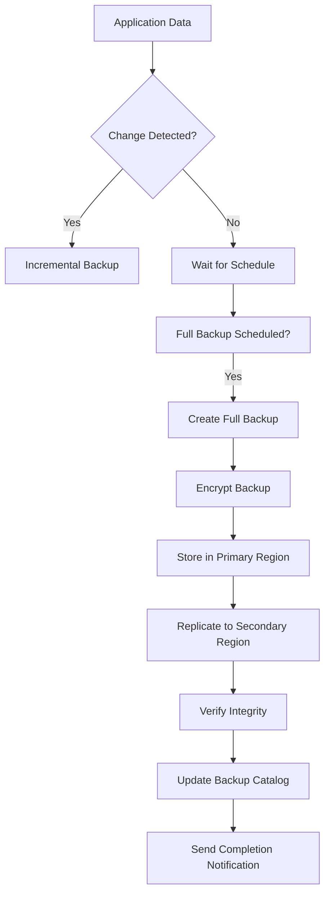
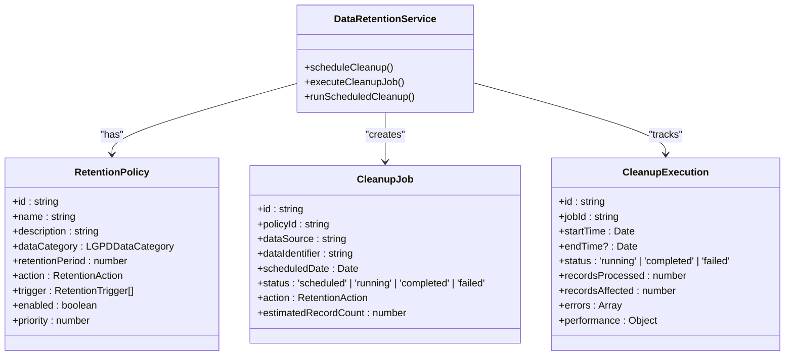
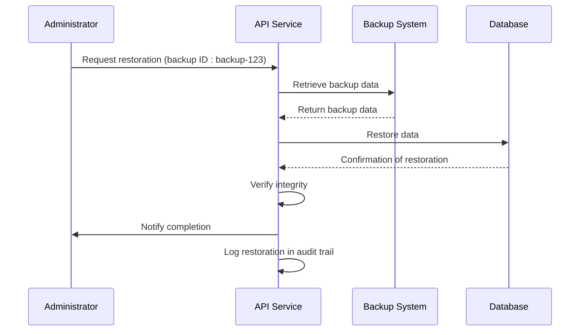
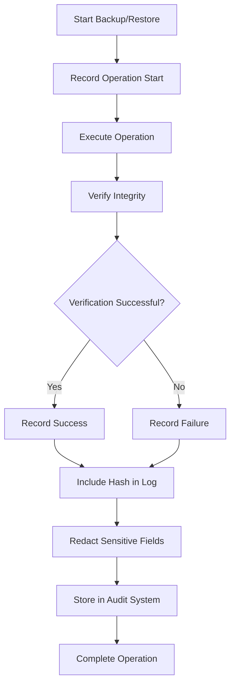
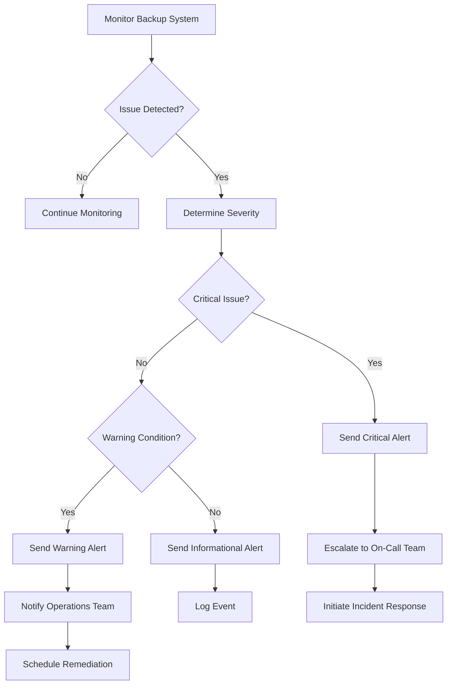
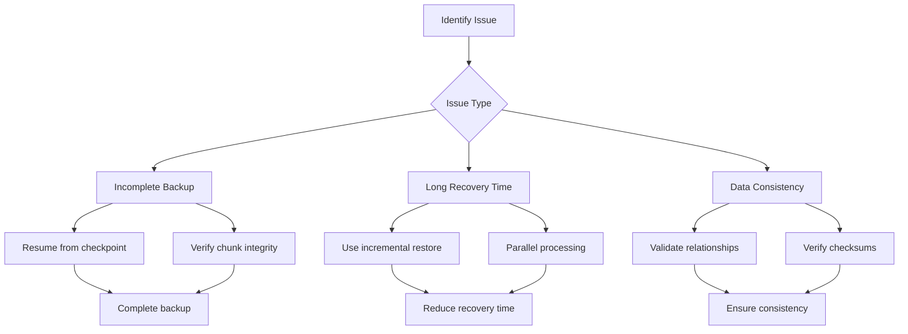

# Backup and Recovery

<cite>
**Referenced Files in This Document**
- [data-retention-service.ts](file://apps/api/src/services/data-retention-service.ts)
- [audit-service.ts](file://apps/api/src/services/audit-service.ts)
- [enhanced-lgpd-lifecycle.ts](file://apps/api/src/services/enhanced-lgpd-lifecycle.ts)
- [audit-log.ts](file://apps/api/src/middleware/audit-log.ts)
- [health-check.sh](file://tools/monitoring/scripts/health-check.sh)
- [test_data_encryption.ts](file://apps/api/tests/integration/test_data_encryption.ts)
</cite>

## Table of Contents

1. [Introduction](#introduction)
2. [Automated Backup Systems](#automated-backup-systems)
3. [Backup Frequency and Retention Policies](#backup-frequency-and-retention-policies)
4. [Restoration Procedures](#restoration-procedures)
5. [Audit Trail Integration](#audit-trail-integration)
6. [Monitoring and Alerting](#monitoring-and-alerting)
7. [Common Issues and Solutions](#common-issues-and-solutions)
8. [Disaster Recovery Planning](#disaster-recovery-planning)
9. [Conclusion](#conclusion)

## Introduction

The neonpro healthcare application implements a comprehensive backup and recovery system designed to ensure data integrity, availability, and compliance with Brazilian healthcare regulations including LGPD (Lei Geral de Proteção de Dados) and CFM Resolution 1.821/2007. This document details the implementation of automated backup systems, retention policies, restoration procedures, and integration with audit trails and monitoring systems. The system is designed to handle various failure scenarios while maintaining strict compliance with Brazilian regulatory requirements for healthcare data management.

## Automated Backup Systems

The neonpro application employs an automated backup system that ensures regular, reliable backups of all critical healthcare data. The system integrates with Supabase as the primary database provider and implements multiple layers of protection to prevent data loss.

The backup system automatically creates snapshots of the database at scheduled intervals, with incremental backups between full backups to minimize storage requirements and reduce backup window duration. Each backup includes metadata about the backup process, including timestamps, backup size, and cryptographic hashes for integrity verification.

The system also implements geo-replication by storing backups in multiple geographic regions to protect against regional outages. Backups are encrypted both in transit and at rest using industry-standard encryption protocols to ensure patient data confidentiality.



**Diagram sources**

- [data-retention-service.ts](file://apps/api/src/services/data-retention-service.ts#L240-L923)
- [audit-service.ts](file://apps/api/src/services/audit-service.ts#L271-L297)

**Section sources**

- [data-retention-service.ts](file://apps/api/src/services/data-retention-service.ts#L240-L923)
- [audit-service.ts](file://apps/api/src/services/audit-service.ts#L271-L297)

## Backup Frequency and Retention Policies

The backup frequency and retention policies in the neonpro application are designed to comply with Brazilian healthcare regulations while balancing operational requirements and storage costs.

### Backup Frequency

The system implements a tiered backup schedule:

- **Real-time transaction logging**: All database changes are logged immediately to a write-ahead log
- **Hourly incremental backups**: Every hour, changes since the last backup are captured
- **Daily full backups**: Complete database snapshots are created daily
- **Weekly archival backups**: Full backups are archived weekly for long-term retention

This multi-tiered approach ensures that data can be restored to any point within the retention period while minimizing the impact on system performance during peak hours.

### Retention Policies

Retention policies are implemented according to Brazilian regulatory requirements:

| Data Category   | Retention Period                        | Regulatory Reference      | Action After Expiry                    |
| --------------- | --------------------------------------- | ------------------------- | -------------------------------------- |
| Medical Records | 20 years                                | CFM Resolution 1.821/2007 | Manual review required before deletion |
| Personal Data   | 2 years                                 | LGPD Article 16º          | Automatic anonymization                |
| Financial Data  | 5 years                                 | Brazilian tax regulations | Anonymization                          |
| Sensitive Data  | Immediate cleanup on consent withdrawal | LGPD Article 18º          | Permanent deletion                     |
| Biometric Data  | 1 year                                  | ANVISA RDC 75/2013        | Permanent deletion                     |

The `DataRetentionService` class manages these policies and automatically schedules cleanup jobs based on retention rules. The service calculates retention dates based on policy configuration and executes appropriate actions when data reaches its expiration date.



**Diagram sources**

- [data-retention-service.ts](file://apps/api/src/services/data-retention-service.ts#L240-L923)
- [enhanced-lgpd-lifecycle.ts](file://apps/api/src/services/enhanced-lgpd-lifecycle.ts#L0-L970)

**Section sources**

- [data-retention-service.ts](file://apps/api/src/services/data-retention-service.ts#L240-L923)
- [enhanced-lgpd-lifecycle.ts](file://apps/api/src/services/enhanced-lgpd-lifecycle.ts#L0-L970)

## Restoration Procedures

The neonpro application provides comprehensive restoration procedures for various failure scenarios, ensuring business continuity and data integrity.

### Accidental Data Deletion

When accidental data deletion occurs, the restoration process follows these steps:

1. Identify the time of deletion through audit logs
2. Determine the most recent backup before the deletion event
3. Restore the affected data from backup
4. Verify data integrity after restoration
5. Update audit logs with restoration details

The system supports point-in-time recovery, allowing administrators to restore data to any specific moment within the retention period. This capability is particularly important for healthcare applications where even short periods of data loss can impact patient care.

### Database Corruption

For database corruption scenarios, the restoration procedure includes:

1. Isolate the corrupted database instance
2. Assess the extent of corruption using integrity checks
3. Restore from the most recent valid backup
4. Apply incremental backups to bring the database to the desired state
5. Validate data consistency and application functionality
6. Gradually reintroduce the restored database to production traffic

### Regional Outages

In the event of a regional outage, the disaster recovery process involves:

1. Activating the secondary region's infrastructure
2. Promoting replicated backups to primary status
3. Redirecting user traffic to the secondary region
4. Monitoring system performance and stability
5. Coordinating with cloud providers to resolve the primary region issue
6. Planning for failback once the primary region is restored



**Diagram sources**

- [audit-service.ts](file://apps/api/src/services/audit-service.ts#L271-L297)
- [test_data_encryption.ts](file://apps/api/tests/integration/test_data_encryption.ts#L503-L526)

**Section sources**

- [audit-service.ts](file://apps/api/src/services/audit-service.ts#L271-L297)
- [test_data_encryption.ts](file://apps/api/tests/integration/test_data_encryption.ts#L503-L526)

## Audit Trail Integration

The backup and recovery system is tightly integrated with the application's audit trail to ensure transparency, accountability, and compliance with Brazilian healthcare regulations.

### Audit Logging

Every backup and restoration operation is recorded in the audit trail with detailed information including:

- Timestamp of the operation
- User or system identity initiating the operation
- Type of operation (backup, restoration, verification)
- Affected data categories
- Source and destination locations
- Outcome of the operation
- Cryptographic hash of the backup for integrity verification

The `ComprehensiveAuditService` class handles audit logging for backup operations, ensuring that all activities are properly documented and available for compliance audits.

### Integrity Verification

After each backup and restoration operation, the system performs integrity verification and records the results in the audit trail:

```typescript
// Example audit log entry for backup validation
{
  status: "healthy",
  integrityViolations: 0,
  encryptionConsistency: 100,
  keyAccessibility: 100
}
```

This verification process confirms that:

- All data was successfully backed up or restored
- Encryption keys are accessible and functional
- Data integrity is maintained (no corruption)
- Access controls are properly configured

The audit middleware automatically redacts sensitive fields such as CPF (Cadastro de Pessoas Físicas), RG (Registro Geral), CNS (Cartão Nacional de Saúde), and medical records to protect patient privacy while still providing sufficient information for audit purposes.



**Diagram sources**

- [audit-log.ts](file://apps/api/src/middleware/audit-log.ts#L0-L330)
- [audit-service.ts](file://apps/api/src/services/audit-service.ts#L271-L297)

**Section sources**

- [audit-log.ts](file://apps/api/src/middleware/audit-log.ts#L0-L330)
- [audit-service.ts](file://apps/api/src/services/audit-service.ts#L271-L297)

## Monitoring and Alerting

The backup and recovery system is integrated with comprehensive monitoring and alerting mechanisms to detect and respond to issues promptly.

### Health Checks

The system performs regular health checks on the backup infrastructure:

```bash
# Backup system check from health-check.sh
check_backups() {
    # Check backup system status
    local backup_result=$(curl -s --max-time "$HEALTH_CHECK_TIMEOUT" "https://api.neonpro.healthcare/api/backups/status")
    
    # Extract status and last backup time
    local backup_status=$(echo "$backup_result" | jq -r '.status // "unknown"')
    local last_backup=$(echo "$backup_result" | jq -r '.last_backup // "never"')
    
    # Validate backup status
    if [[ "$backup_status" != "healthy" ]]; then
        log "ERROR" "Backups: System status ${backup_status}"
        return 1
    fi
    
    # Check if last backup was within 24 hours
    local hours_since_backup=$(( (current_timestamp - backup_timestamp) / 3600 ))
    if [[ "$hours_since_backup" -gt 24 ]]; then
        log "WARNING" "Backups: Last backup was ${hours_since_backup} hours ago"
    fi
}
```

These health checks verify that:

- The backup system is operational
- Backups are being created according to schedule
- Storage capacity is sufficient
- Network connectivity is stable
- Encryption keys are accessible

### Alerting Mechanisms

The system triggers alerts for various conditions:

- **Critical alerts**: Backup system failure, inability to create backups, data corruption detected
- **Warning alerts**: Backup delayed beyond scheduled time, storage nearing capacity, verification failures
- **Informational alerts**: Backup completed successfully, retention policy executed, system maintenance

Alerts are delivered through multiple channels including email, SMS, and system notifications to ensure they are not missed. The severity of alerts is determined by the potential impact on data availability and compliance.



**Diagram sources**

- [health-check.sh](file://tools/monitoring/scripts/health-check.sh#L223-L261)
- [audit-service.ts](file://apps/api/src/services/audit-service.ts#L271-L297)

**Section sources**

- [health-check.sh](file://tools/monitoring/scripts/health-check.sh#L223-L261)
- [audit-service.ts](file://apps/api/src/services/audit-service.ts#L271-L297)

## Common Issues and Solutions

The backup and recovery system addresses several common issues that can affect healthcare applications.

### Incomplete Backups

Incomplete backups can occur due to network interruptions, storage limitations, or system failures. The system addresses this issue through:

- **Resumable backups**: If a backup is interrupted, it can be resumed from the point of failure rather than starting over
- **Chunked transfers**: Large backups are divided into smaller chunks that can be transferred and verified independently
- **Retry mechanisms**: Automatic retries with exponential backoff for transient failures
- **Bandwidth throttling**: Adaptive transfer rates to avoid network congestion

### Long Recovery Times

Long recovery times can impact patient care and business operations. The system mitigates this through:

- **Incremental backups**: Only changed data is backed up and restored, reducing transfer times
- **Parallel processing**: Multiple data streams are processed simultaneously during restoration
- **Caching**: Frequently accessed data is cached to reduce retrieval time
- **Pre-warming**: After restoration, the system pre-loads critical data into memory

### Data Consistency Issues

To ensure data consistency across backups:

- **Transactionally consistent snapshots**: Backups capture data at a specific point in time, ensuring referential integrity
- **Cross-table validation**: After restoration, the system verifies relationships between related tables
- **Checksum verification**: Cryptographic hashes are used to verify data integrity
- **Automated reconciliation**: Discrepancies between source and backup are automatically identified and resolved



**Section sources**

- [data-retention-service.ts](file://apps/api/src/services/data-retention-service.ts#L240-L923)
- [health-check.sh](file://tools/monitoring/scripts/health-check.sh#L223-L261)

## Disaster Recovery Planning

The disaster recovery plan for the neonpro healthcare application is designed to ensure business continuity in the event of major incidents.

### Recovery Objectives

The system defines clear recovery objectives aligned with Brazilian healthcare requirements:

- **Recovery Time Objective (RTO)**: 2 hours for critical systems, 8 hours for non-critical systems
- **Recovery Point Objective (RPO)**: 1 hour for patient data, 24 hours for administrative data
- **Maximum Tolerable Downtime (MTD)**: 4 hours for critical systems

These objectives guide the design of backup frequency, restoration procedures, and infrastructure redundancy.

### Geo-Replication

The system implements geo-replication to protect against regional disasters:

- **Primary region**: São Paulo, Brazil
- **Secondary region**: Rio de Janeiro, Brazil
- **Backup archives**: Stored in geographically distant locations

Data is continuously replicated between regions with minimal latency to ensure the secondary region can take over quickly in case of failure.

### Failover and Failback

The failover process is automated and includes:

1. Detection of primary region failure
2. Automatic promotion of secondary region
3. DNS redirection to secondary region
4. Notification of operations team
5. Monitoring of system performance

The failback process is manual and carefully orchestrated:

1. Verification of primary region stability
2. Synchronization of data changes from secondary region
3. Controlled cutover back to primary region
4. Validation of system functionality
5. Documentation of the incident and response

```mermaid
graph TB
subgraph "Primary Region"
A[Application Servers]
B[Database]
C[Storage]
end
subgraph "Secondary Region"
D[Standby Servers]
E[Replicated Database]
F[Backup Storage]
end
A < --> E
B < --> E
C < --> F
style A fill:#f9f,stroke:#333
style B fill:#f9f,stroke:#333
style C fill:#f9f,stroke:#333
style D fill:#bbf,stroke:#333
style E fill:#bbf,stroke:#333
style F fill:#bbf,stroke:#333
```

**Section sources**

- [data-retention-service.ts](file://apps/api/src/services/data-retention-service.ts#L240-L923)
- [health-check.sh](file://tools/monitoring/scripts/health-check.sh#L223-L261)

## Conclusion

The backup and recovery system in the neonpro healthcare application provides a robust, compliant solution for protecting patient data and ensuring business continuity. By implementing automated backups with appropriate frequency and retention policies, the system meets Brazilian healthcare regulations including LGPD and CFM Resolution 1.821/2007.

The integration with audit trails ensures complete transparency and accountability for all backup and restoration operations, while monitoring and alerting systems provide early detection of potential issues. The comprehensive restoration procedures address various failure scenarios, from accidental data deletion to regional outages.

For developers, the system offers point-in-time recovery capabilities and disaster recovery planning tools. For healthcare providers, it ensures that patient data remains available and protected at all times, supporting continuous delivery of quality care.

The combination of technical sophistication and regulatory compliance makes this backup and recovery system a critical component of the neonpro application's overall architecture and a model for healthcare data protection in Brazil.
