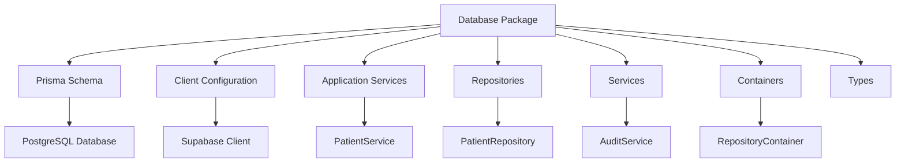
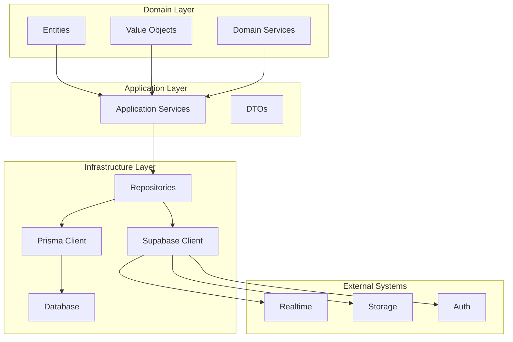
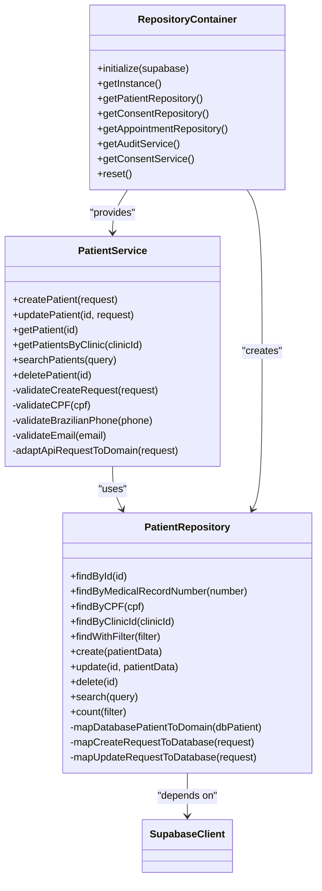
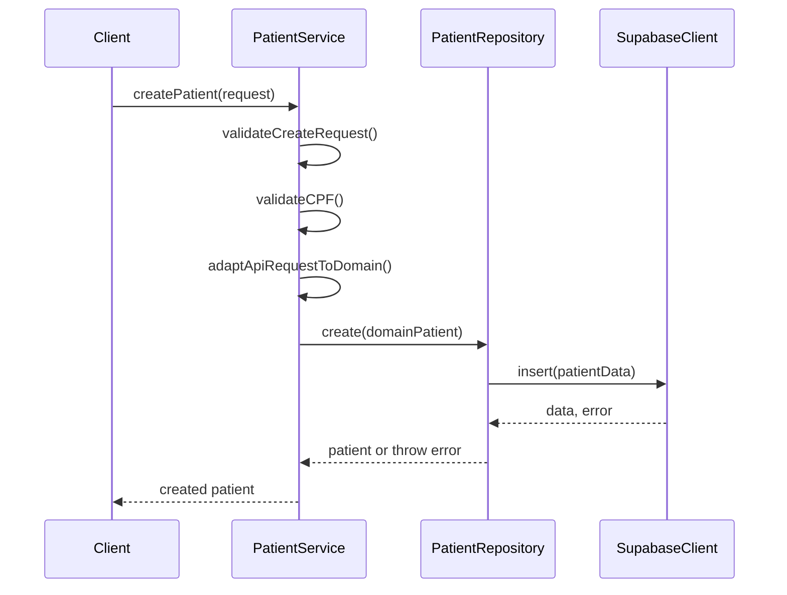
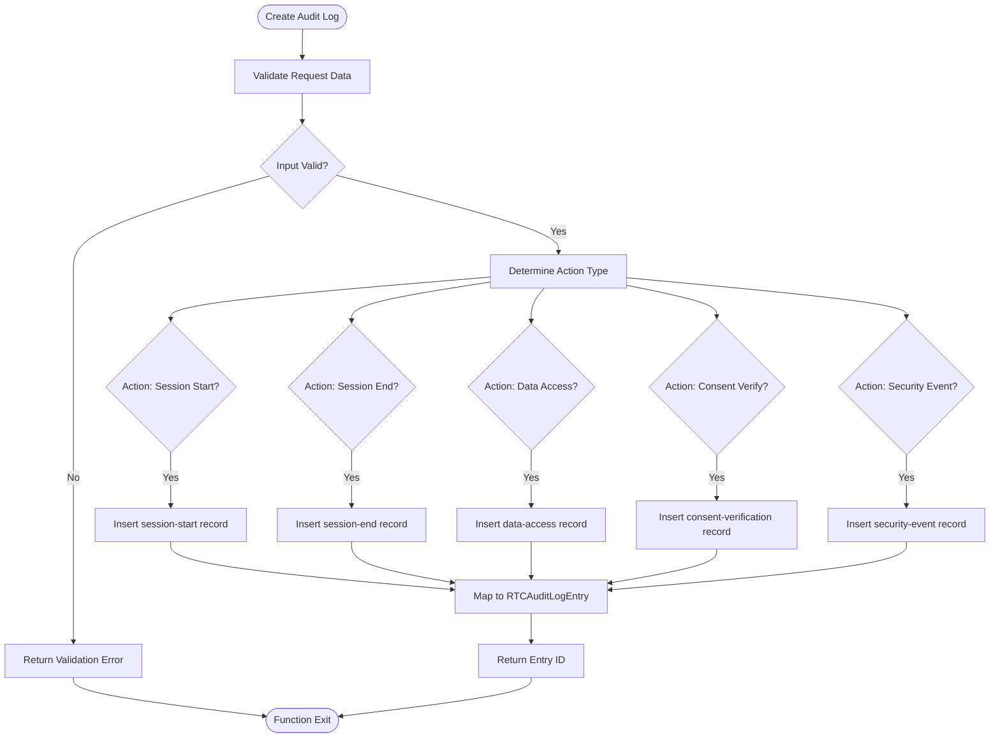
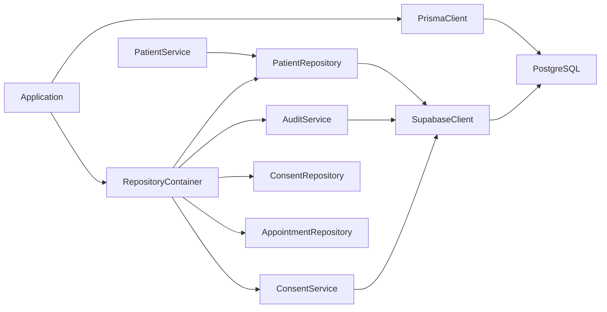

# Data Management

<cite>
**Referenced Files in This Document**
- [schema.prisma](file://packages/database/prisma/schema.prisma)
- [client.ts](file://packages/database/src/client.ts)
- [index.ts](file://packages/database/src/index.ts)
- [patient-repository.ts](file://packages/database/src/repositories/patient-repository.ts)
- [patient-service.ts](file://packages/database/src/application/patient-service.ts)
- [audit-service.ts](file://packages/database/src/services/audit-service.ts)
- [repository-container.ts](file://packages/database/src/containers/repository-container.ts)
</cite>

## Table of Contents

1. [Introduction](#introduction)
2. [Project Structure](#project-structure)
3. [Core Components](#core-components)
4. [Architecture Overview](#architecture-overview)
5. [Detailed Component Analysis](#detailed-component-analysis)
6. [Dependency Analysis](#dependency-analysis)
7. [Performance Considerations](#performance-considerations)
8. [Troubleshooting Guide](#troubleshooting-guide)
9. [Conclusion](#conclusion)

## Introduction

The NeonPro data management system is a domain-driven, healthcare-compliant architecture built on Prisma ORM with PostgreSQL hosted on Supabase. It implements robust data governance, privacy controls, and audit capabilities tailored for Brazilian healthcare regulations including LGPD, CFM, ANVISA, and ICP-Brasil standards. The system follows clean architectural patterns with clear separation between data access, business logic, and domain layers.

## Project Structure

The data management system is organized within the monorepo under `packages/database`, containing all database-related components including schema definitions, clients, repositories, services, and utilities. The structure follows domain-driven design principles with distinct layers for application services, infrastructure implementations, and domain models.

**Diagram sources**

- [schema.prisma](file://packages/database/prisma/schema.prisma)
- [client.ts](file://packages/database/src/client.ts)
- [index.ts](file://packages/database/src/index.ts)

**Section sources**

- [schema.prisma](file://packages/database/prisma/schema.prisma)
- [client.ts](file://packages/database/src/client.ts)
- [index.ts](file://packages/database/src/index.ts)

## Core Components

The core components of the data management system include the Prisma-generated client, Supabase integration, repository implementations, application services, and dependency injection container. These components work together to provide type-safe, secure, and compliant data access across the NeonPro application.

**Section sources**

- [client.ts](file://packages/database/src/client.ts)
- [index.ts](file://packages/database/src/index.ts)
- [repository-container.ts](file://packages/database/src/containers/repository-container.ts)

## Architecture Overview

The data management architecture follows a layered approach with Prisma ORM as the primary data access layer, Supabase for real-time capabilities and authentication, and a repository pattern implementation that abstracts database operations. The system implements domain-driven design with clear boundaries between infrastructure, application, and domain layers.

**Diagram sources**

- [schema.prisma](file://packages/database/prisma/schema.prisma)
- [client.ts](file://packages/database/src/client.ts)
- [patient-service.ts](file://packages/database/src/application/patient-service.ts)
- [patient-repository.ts](file://packages/database/src/repositories/patient-repository.ts)

## Detailed Component Analysis

### Patient Management System Analysis

The patient management system implements a comprehensive solution for handling patient data with full compliance to Brazilian healthcare regulations. It includes specialized fields for CPF, CNS, RG, insurance information, and LGPD consent tracking.

#### For Object-Oriented Components:

**Diagram sources**

- [patient-service.ts](file://packages/database/src/application/patient-service.ts)
- [patient-repository.ts](file://packages/database/src/repositories/patient-repository.ts)
- [repository-container.ts](file://packages/database/src/containers/repository-container.ts)

#### For API/Service Components:

**Diagram sources**

- [patient-service.ts](file://packages/database/src/application/patient-service.ts)
- [patient-repository.ts](file://packages/database/src/repositories/patient-repository.ts)
- [client.ts](file://packages/database/src/client.ts)

### Audit and Compliance System Analysis

The audit and compliance system provides comprehensive tracking of all data access and system events, with specialized support for WebRTC sessions, LGPD compliance, and security monitoring.

#### For Complex Logic Components:

**Diagram sources**

- [audit-service.ts](file://packages/database/src/services/audit-service.ts)
- [types/audit.types.ts](file://packages/database/src/types/audit.types.ts)

**Section sources**

- [patient-service.ts](file://packages/database/src/application/patient-service.ts)
- [patient-repository.ts](file://packages/database/src/repositories/patient-repository.ts)
- [audit-service.ts](file://packages/database/src/services/audit-service.ts)
- [repository-container.ts](file://packages/database/src/containers/repository-container.ts)

## Dependency Analysis

The data management system has well-defined dependencies between components, following inversion of control principles through the RepositoryContainer. The system depends on Prisma ORM for type-safe database access, Supabase for real-time capabilities and authentication, and implements proper error handling and logging throughout.

**Diagram sources**

- [client.ts](file://packages/database/src/client.ts)
- [index.ts](file://packages/database/src/index.ts)
- [repository-container.ts](file://packages/database/src/containers/repository-container.ts)

**Section sources**

- [client.ts](file://packages/database/src/client.ts)
- [index.ts](file://packages/database/src/index.ts)
- [repository-container.ts](file://packages/database/src/containers/repository-container.ts)

## Performance Considerations

The data management system includes several performance optimizations including connection pooling, query optimization through indexed fields, and efficient data retrieval patterns. The Prisma schema includes numerous database indexes on frequently queried fields such as clinicId, cpf, cns, and timestamps. The system also implements proper pagination and filtering to prevent excessive data loading.

## Troubleshooting Guide

Common issues in the data management system typically relate to environment configuration, database connectivity, or schema synchronization. The system provides health check endpoints and proper error logging to assist with diagnosis. Connection issues should be verified by checking environment variables for Supabase URL and service role keys. Schema mismatches can be resolved by running Prisma migrations and ensuring the generated client is up to date.

**Section sources**

- [client.ts](file://packages/database/src/client.ts)
- [patient-service.ts](file://packages/database/src/application/patient-service.ts)

## Conclusion

The NeonPro data management system provides a robust, compliant foundation for healthcare applications with its domain-driven design, comprehensive privacy controls, and well-structured architecture. By leveraging Prisma ORM with Supabase, the system achieves both type safety and real-time capabilities while maintaining strict adherence to Brazilian healthcare regulations. The repository pattern implementation ensures separation of concerns and testability, while the dependency injection container facilitates proper component composition.
