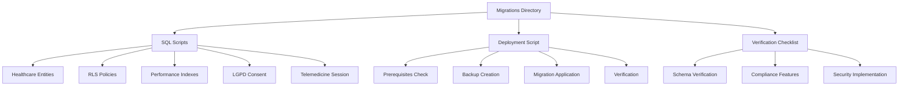
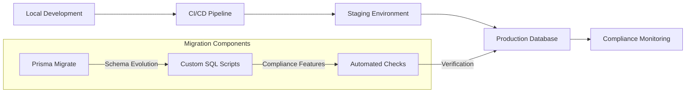
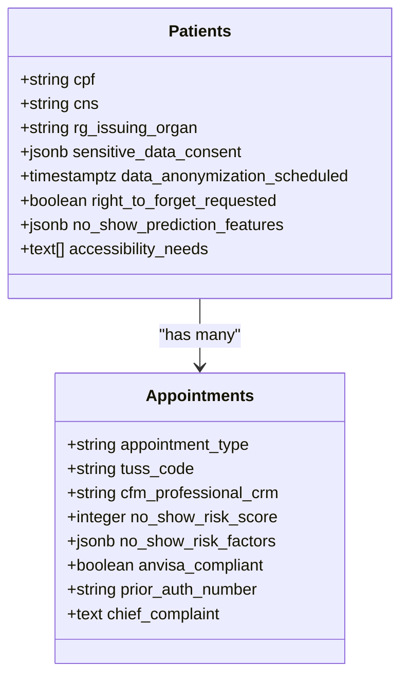
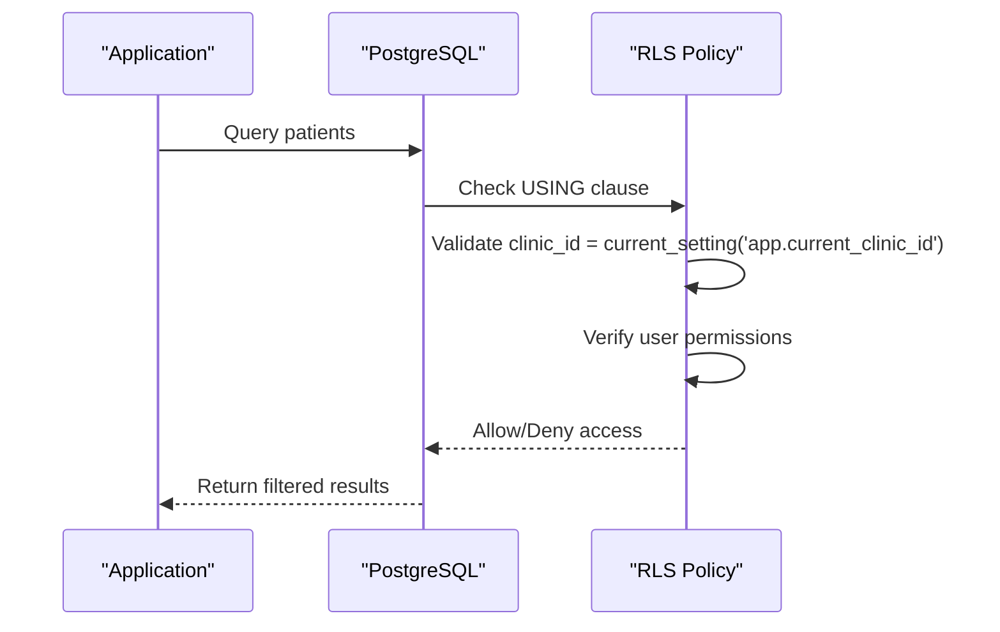
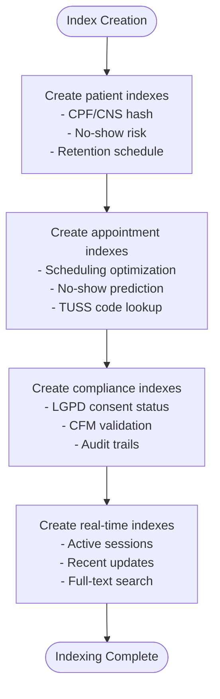
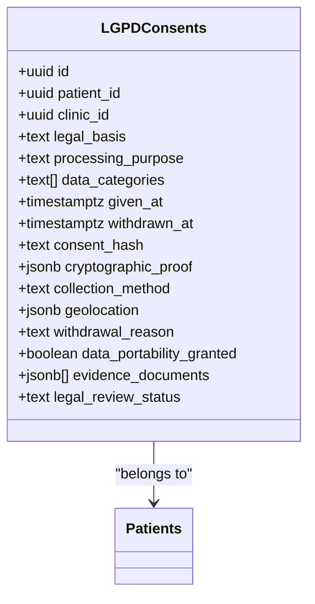
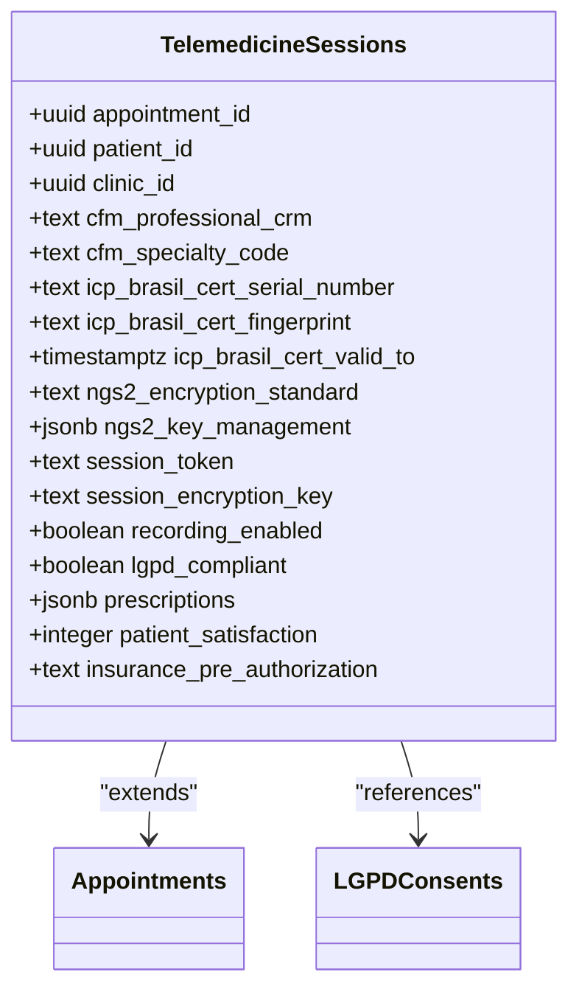
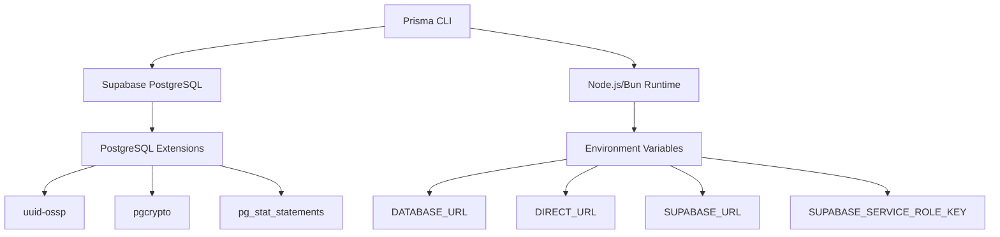

# Data Migration Strategy

<cite>
**Referenced Files in This Document **
- [README.md](file://packages/database/migrations/README.md)
- [deploy.sh](file://packages/database/migrations/deploy.sh)
- [verification-checklist.md](file://packages/database/migrations/verification-checklist.md)
- [20250918_healthcare_entities_migration.sql](file://packages/database/migrations/20250918_healthcare_entities_migration.sql)
- [20250918_rls_policies.sql](file://packages/database/migrations/20250918_rls_policies.sql)
- [20250918_performance_indexes.sql](file://packages/database/migrations/20250918_performance_indexes.sql)
- [20250918_lgpd_consent_table.sql](file://packages/database/migrations/20250918_lgpd_consent_table.sql)
- [20250918_telemedicine_session_table.sql](file://packages/database/migrations/20250918_telemedicine_session_table.sql)
- [migration.ts](file://packages/database/src/utils/migration.ts)
- [client.ts](file://packages/database/src/client.ts)
</cite>

## Table of Contents

1. [Introduction](#introduction)
2. [Project Structure](#project-structure)
3. [Core Components](#core-components)
4. [Architecture Overview](#architecture-overview)
5. [Detailed Component Analysis](#detailed-component-analysis)
6. [Dependency Analysis](#dependency-analysis)
7. [Performance Considerations](#performance-considerations)
8. [Troubleshooting Guide](#troubleshooting-guide)
9. [Conclusion](#conclusion)

## Introduction

This document outlines the data migration strategy for the neonpro application, focusing on the implementation of a robust database schema evolution system using Prisma Migrate with Supabase PostgreSQL. The strategy supports Brazilian healthcare compliance requirements including LGPD (General Data Protection Law), CFM (Federal Council of Medicine), and ANVISA (National Health Surveillance Agency). The migration system enables zero-downtime deployments, provides comprehensive rollback capabilities, and ensures data integrity throughout the development lifecycle from local environments to production.

## Project Structure

The data migration system is organized within the `packages/database/migrations` directory, containing SQL migration scripts, deployment automation, and verification checklists. The structure follows a versioned approach with timestamp-based filenames to ensure proper execution order. Migration scripts are complemented by utility functions in the `src/utils` directory that handle version tracking and migration state management.

**Diagram sources **

- [README.md](file://packages/database/migrations/README.md)
- [deploy.sh](file://packages/database/migrations/deploy.sh)
- [verification-checklist.md](file://packages/database/migrations/verification-checklist.md)

**Section sources**

- [README.md](file://packages/database/migrations/README.md)

## Core Components

The core components of the data migration strategy include healthcare-specific entity migrations, Row Level Security (RLS) policies for multi-tenant isolation, performance optimization indexes, and specialized tables for LGPD consent management and telemedicine session compliance. These components work together to ensure regulatory compliance while maintaining high performance and data security.

**Section sources**

- [20250918_healthcare_entities_migration.sql](file://packages/database/migrations/20250918_healthcare_entities_migration.sql)
- [20250918_rls_policies.sql](file://packages/database/migrations/20250918_rls_policies.sql)
- [20250918_performance_indexes.sql](file://packages/database/migrations/20250918_performance_indexes.sql)

## Architecture Overview

The data migration architecture implements a phased approach to schema evolution, starting with infrastructure setup and progressing through compliance feature implementation. The system leverages Prisma Migrate for declarative schema management while incorporating custom SQL scripts for complex compliance requirements that cannot be expressed through Prisma's DSL alone.

**Diagram sources **

- [deploy.sh](file://packages/database/migrations/deploy.sh)
- [verification-checklist.md](file://packages/database/migrations/verification-checklist.md)

## Detailed Component Analysis

### Healthcare Entities Migration

The healthcare entities migration enhances core application models with Brazilian compliance features, adding fields for patient identification (CPF, CNS, RG), LGPD consent tracking, and clinical workflow optimization. The migration also implements multi-schema support with dedicated schemas for audit logging and LGPD-specific data.

#### For Object-Oriented Components:

**Diagram sources **

- [20250918_healthcare_entities_migration.sql](file://packages/database/migrations/20250918_healthcare_entities_migration.sql)

**Section sources**

- [20250918_healthcare_entities_migration.sql](file://packages/database/migrations/20250918_healthcare_entities_migration.sql)

### RLS Policies Implementation

The Row Level Security (RLS) policies implement multi-tenant isolation at the database level, ensuring clinic-based data separation. The policies leverage PostgreSQL's RLS capabilities with session variables to control access based on clinic context, user role, and professional relationships.

#### For API/Service Components:

**Diagram sources **

- [20250918_rls_policies.sql](file://packages/database/migrations/20250918_rls_policies.sql)

**Section sources**

- [20250918_rls_policies.sql](file://packages/database/migrations/20250918_rls_policies.sql)

### Performance Indexes Strategy

The performance indexes strategy creates optimized database indexes for healthcare workflows and compliance queries. The implementation uses concurrent index creation to avoid table locking during production deployments, enabling zero-downtime migrations.

#### For Complex Logic Components:

**Diagram sources **

- [20250918_performance_indexes.sql](file://packages/database/migrations/20250918_performance_indexes.sql)

**Section sources**

- [20250918_performance_indexes.sql](file://packages/database/migrations/20250918_performance_indexes.sql)

### LGPD Consent Management

The LGPD consent management system implements comprehensive consent lifecycle tracking with cryptographic proof. The solution includes SHA-256 hashing of consent records, digital signature storage, and blockchain transaction references to provide verifiable audit trails.

#### For Object-Oriented Components:

**Diagram sources **

- [20250918_lgpd_consent_table.sql](file://packages/database/migrations/20250918_lgpd_consent_table.sql)

**Section sources**

- [20250918_lgpd_consent_table.sql](file://packages/database/migrations/20250918_lgpd_consent_table.sql)

### Telemedicine Session Compliance

The telemedicine session compliance component implements CFM Resolution 2314/2022 requirements with NGS2 security standards. The solution includes CRM professional validation, ICP-Brasil digital certificate verification, and AES-256 encryption for session data.

#### For Object-Oriented Components:

**Diagram sources **

- [20250918_telemedicine_session_table.sql](file://packages/database/migrations/20250918_telemedicine_session_table.sql)

**Section sources**

- [20250918_telemedicine_session_table.sql](file://packages/database/migrations/20250918_telemedicine_session_table.sql)

## Dependency Analysis

The migration system has dependencies on Prisma CLI tools, Supabase platform services, and PostgreSQL extensions. The implementation requires specific versions of these dependencies to ensure compatibility with the healthcare compliance features.

**Diagram sources **

- [deploy.sh](file://packages/database/migrations/deploy.sh)
- [client.ts](file://packages/database/src/client.ts)

**Section sources**

- [deploy.sh](file://packages/database/migrations/deploy.sh)
- [client.ts](file://packages/database/src/client.ts)

## Performance Considerations

The migration strategy incorporates several performance optimizations to minimize impact on production systems. These include concurrent index creation to avoid table locking, phased deployment to reduce downtime, and connection pooling configuration for high-concurrency scenarios.

**Section sources**

- [20250918_performance_indexes.sql](file://packages/database/migrations/20250918_performance_indexes.sql)
- [client.ts](file://packages/database/src/client.ts)

## Troubleshooting Guide

The migration system includes comprehensive verification procedures and rollback capabilities. The deployment script performs automated checks after migration application, validating table existence, RLS policies, and performance indexes. In case of issues, each migration includes rollback SQL statements for safe recovery.

**Section sources**

- [deploy.sh](file://packages/database/migrations/deploy.sh)
- [verification-checklist.md](file://packages/database/migrations/verification-checklist.md)

## Conclusion

The data migration strategy for neonpro provides a robust framework for evolving the database schema while maintaining compliance with Brazilian healthcare regulations. By combining Prisma Migrate with custom SQL scripts, the system achieves a balance between developer productivity and regulatory requirements. The implementation supports zero-downtime deployments through careful planning of migration steps and performance optimizations, ensuring uninterrupted service for healthcare providers and patients.
