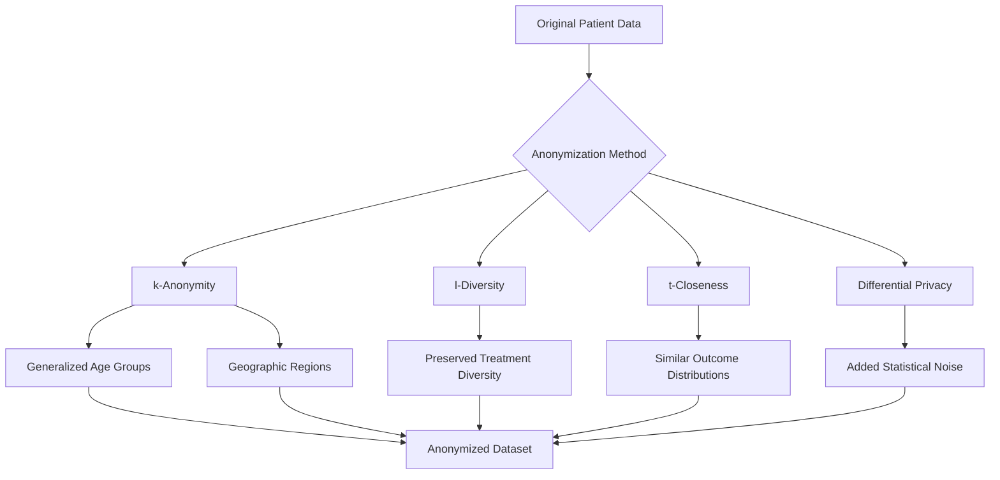
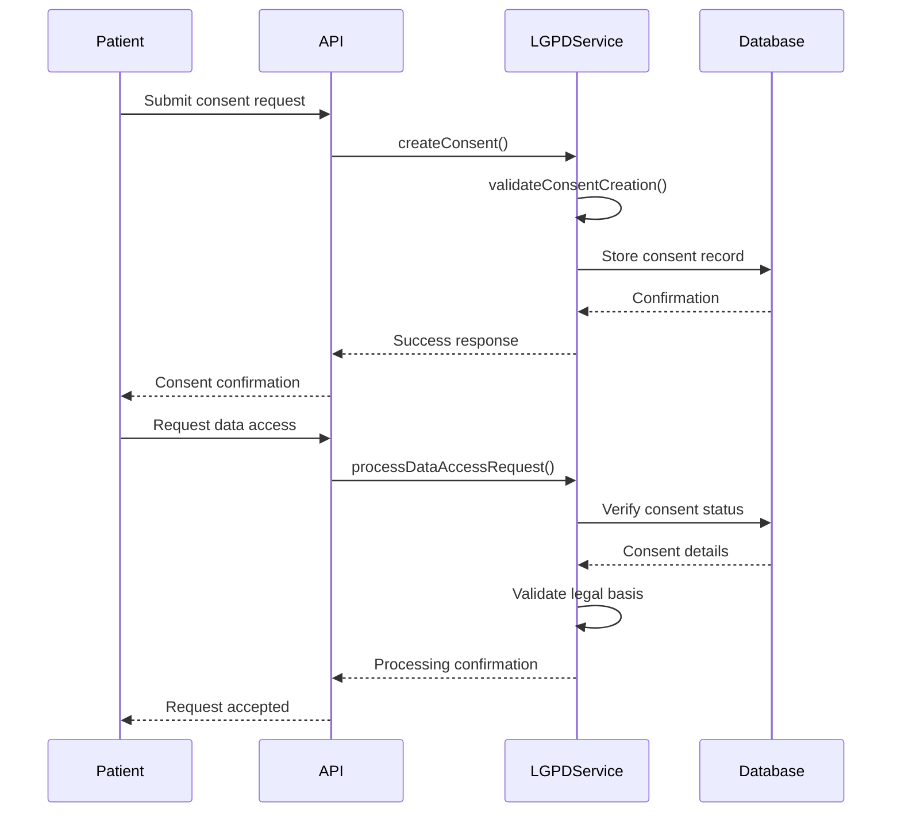
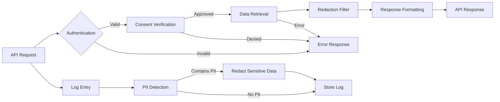
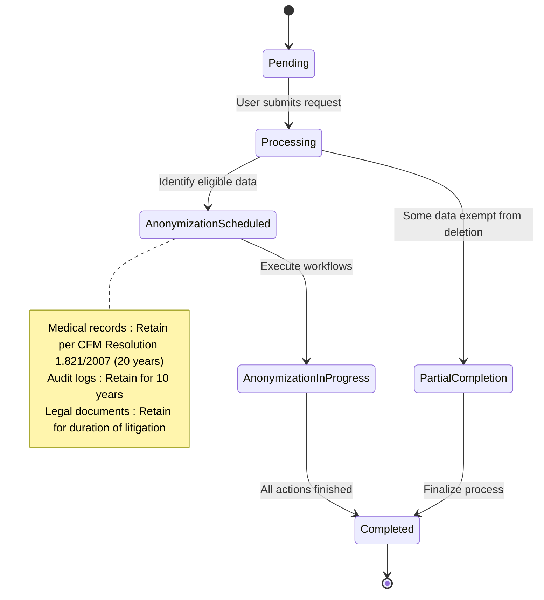

# Data Privacy Controls

<cite>
**Referenced Files in This Document**
- [lgpd-service.ts](file://apps/api/src/services/lgpd-service.ts)
- [encryption.ts](file://packages/security/src/encryption.ts)
- [lgpd-middleware.ts](file://apps/api/src/middleware/lgpd-middleware.ts)
- [enhanced-lgpd-lifecycle.ts](file://apps/api/src/services/enhanced-lgpd-lifecycle.ts)
- [sensitive-field-analyzer.ts](file://apps/api/src/services/sensitive-field-analyzer.ts)
- [utils/lgpd-compliance-validator.ts](file://apps/api/src/utils/lgpd-compliance-validator.ts)
</cite>

## Table of Contents

1. [Introduction](#introduction)
2. [Data Anonymization and Pseudonymization](#data-anonymization-and-pseudonymization)
3. [Field-Level Encryption Strategies](#field-level-encryption-strategies)
4. [Consent Management Architecture](#consent-management-architecture)
5. [API Response and Logging Protection](#api-response-and-logging-protection)
6. [Right-to-be-Forgotten Implementation](#right-to-be-forgotten-implementation)
7. [Developer Guidelines for Sensitive Data Handling](#developer-guidelines-for-sensitive-data-handling)

## Introduction

The neonpro application implements comprehensive data privacy controls to ensure compliance with Brazil's Lei Geral de Proteção de Dados (LGPD) for healthcare data processing. The system incorporates technical implementations of data anonymization, pseudonymization, redaction techniques, field-level encryption, and consent management systems. These controls are designed to protect patient information throughout its lifecycle, from collection through processing, storage, and eventual deletion or anonymization. The architecture supports privacy-by-design principles while maintaining the functionality required for healthcare services.

## Data Anonymization and Pseudonymization

The neonpro application implements multiple data anonymization and pseudonymization techniques to protect patient information while preserving data utility for research and analytics purposes. The system uses k-anonymity, l-diversity, t-closeness, and differential privacy methods to ensure that individual patients cannot be re-identified from datasets.



**Diagram sources**

- [enhanced-lgpd-lifecycle.ts](file://apps/api/src/services/enhanced-lgpd-lifecycle.ts#L0-L971)
- [lgpd-data-anonymization-pseudonymization.test.ts](file://apps/api/src/__tests__/compliance/lgpd-data-anonymization-pseudonymization.test.ts#L344-L758)

The pseudonymization process generates secure pseudonyms using cryptographic hash functions with salt values. For each patient record, the system creates a unique pseudonym based on the patient ID and data category, ensuring consistent mapping while preventing reverse engineering of original identities.

Microaggregation techniques are applied to numeric data such as age, weight, height, and treatment costs. The system clusters similar records together and replaces individual values with cluster centroids, reducing the risk of identification while preserving statistical properties of the dataset.

Hierarchical generalization is used to transform specific attributes into broader categories. For example, exact ages are generalized into 5-year groups, specific addresses are generalized to neighborhood or city levels, and exact dates are generalized to quarters or years. This approach maintains data utility for analysis while protecting individual privacy.

**Section sources**

- [enhanced-lgpd-lifecycle.ts](file://apps/api/src/services/enhanced-lgpd-lifecycle.ts#L0-L971)
- [lgpd-data-anonymization-pseudonymization.test.ts](file://apps/api/src/__tests__/compliance/lgpd-data-anonymization-pseudonymization.test.ts#L665-L699)

## Field-Level Encryption Strategies

The neonpro application implements robust field-level encryption strategies to protect sensitive health data both at rest and in transit. The system uses AES-256-GCM encryption with authenticated encryption to ensure confidentiality, integrity, and authenticity of protected data.

```mermaid
classDiagram
class EncryptionManager {
+algorithm : string
+keyLength : number
+ivLength : number
+generateKey() : string
+validateKey(key : string) : boolean
+encryptData(data : string, key : string) : string
+decryptData(encryptedData : string, key : string) : string
+encryptObject(obj : object, key : string, fields : string[]) : object
+decryptObject(obj : object, key : string, fields : string[]) : object
+hashData(data : string) : string
+compareHash(plaintext : string, hash : string) : boolean
}
class KeyManager {
-keys : Map~string, string~
-keyMetadata : Map~string, {createdAt : Date, expiresAt? : Date}~
+storeKey(keyId : string, key : string, expiresAt? : Date) : void
+getKey(keyId : string) : string | null
+removeKey(keyId : string) : void
+listKeys() : string[]
+rotateKey(keyId : string, ttl : number) : string
+cleanup() : void
}
EncryptionManager --> KeyManager : "uses"
```

**Diagram sources**

- [encryption.ts](file://packages/security/src/encryption.ts#L0-L301)

Sensitive fields identified by the HealthcareSensitiveFieldAnalyzer include CPF (Brazilian individual taxpayer registry), phone numbers, email addresses, medical history, allergies, genetic data, biometric data, insurance numbers, and billing information. These fields are automatically encrypted when stored in the database and decrypted only when accessed by authorized personnel with proper consent.

The encryption implementation follows a hybrid approach where sensitive fields are encrypted individually rather than encrypting entire records. This allows non-sensitive fields to remain searchable and indexable while protecting personal information. Each encrypted field contains metadata including the encryption algorithm, key identifier, initialization vector, and timestamp of encryption.

Key management is handled through a dedicated KeyManager class that securely stores encryption keys with creation timestamps and optional expiration dates. The system supports key rotation, allowing old keys to be phased out while maintaining access to data encrypted with previous keys during a grace period. Automatic cleanup removes expired keys from the system.

**Section sources**

- [encryption.ts](file://packages/security/src/encryption.ts#L0-L301)
- [sensitive-field-analyzer.ts](file://apps/api/src/services/sensitive-field-analyzer.ts#L175-L232)

## Consent Management Architecture

The consent management system in neonpro provides a comprehensive framework for handling patient consent in accordance with LGPD requirements. The architecture supports creation, updating, revocation, and tracking of consent records throughout their lifecycle.



**Diagram sources**

- [lgpd-service.ts](file://apps/api/src/services/lgpd-service.ts#L0-L1259)
- [lgpd-middleware.ts](file://apps/api/src/middleware/lgpd-middleware.ts#L0-L685)

The LGPDService class manages all aspects of consent processing, including legal basis validation, purpose limitation enforcement, and retention policy application. Each consent record includes the patient ID, consent version, timestamp, IP address, user agent, legal basis, processing purposes, data categories, and preferences for data processing, marketing, and analytics.

Consent records are immutable once created, with any changes tracked through a history mechanism that logs updates and revocations. When a patient updates their consent preferences, the system creates a new version while preserving the historical record for audit purposes. Revoked consents are marked with withdrawal dates and reasons but retained for the legally required period to demonstrate compliance.

The system implements middleware that intercepts API requests and verifies consent status before allowing access to personal data. Different endpoints require different processing purposes, with medical care and appointment scheduling having stricter consent requirements than billing or legal obligations. The middleware logs all data access attempts for audit trail purposes.

**Section sources**

- [lgpd-service.ts](file://apps/api/src/services/lgpd-service.ts#L0-L1259)
- [lgpd-middleware.ts](file://apps/api/src/middleware/lgpd-middleware.ts#L0-L685)

## API Response and Logging Protection

The neonpro application implements comprehensive protections for personal data in API responses and logging systems. These controls ensure that sensitive information is never exposed inappropriately, whether through direct API output or diagnostic logs.



**Diagram sources**

- [lgpd-middleware.ts](file://apps/api/src/middleware/lgpd-middleware.ts#L0-L685)
- [utils/lgpd-compliance-validator.ts](file://apps/api/src/utils/lgpd-compliance-validator.ts#L33-L439)

API responses containing patient data undergo automatic redaction of sensitive fields based on the requesting user's access level and purpose. For example, when exporting data for portability requests, CPF numbers and postal codes are replaced with "[REDACTED_FOR_PRIVACY]" placeholders. The system uses view layers in the database to provide redacted versions of medical records to users who don't require full access.

Logging systems implement real-time detection of personally identifiable information (PII) and automatically redact sensitive data before storage. The redaction process identifies Brazilian-specific identifiers such as CPF numbers, phone numbers with country codes, and email addresses, replacing them with hashed representations or generic placeholders. This ensures that diagnostic logs can be used for troubleshooting without compromising patient privacy.

The dataPortabilityMiddleware handles Article 18 requests for data portability by collecting all user data from across the system and formatting it in standard JSON format. Similarly, the dataErasureMiddleware processes right-to-be-forgotten requests by either anonymizing or deleting user data according to retention policies and legal requirements.

**Section sources**

- [lgpd-middleware.ts](file://apps/api/src/middleware/lgpd-middleware.ts#L0-L685)
- [utils/lgpd-compliance-validator.ts](file://apps/api/src/utils/lgpd-compliance-validator.ts#L33-L439)

## Right-to-be-Forgotten Implementation

The neonpro application implements a comprehensive right-to-be-forgotten system that complies with LGPD Article 18 requirements for data deletion and anonymization. The implementation balances patient rights with legal obligations to retain certain types of data.



**Diagram sources**

- [enhanced-lgpd-lifecycle.ts](file://apps/api/src/services/enhanced-lgpd-lifecycle.ts#L0-L971)
- [lgpd-middleware.ts](file://apps/api/src/middleware/lgpd-middleware.ts#L0-L685)

When a data deletion request is received, the system first identifies which data categories are subject to deletion versus those that must be retained for legal reasons. Medical records, for example, must be retained for 20 years per CFM Resolution 1.821/2007, while appointment data can be deleted after 5 years.

For data that can be deleted, the system implements a two-step process: first anonymizing sensitive fields such as names, CPF numbers, and contact information, then deleting associated consent records and audit logs. The anonymization process replaces identifying information with generic values like "REDACTED" while preserving the structural integrity of records for statistical analysis.

The EnhancedLGPDLifecycleService manages the entire deletion workflow, including scheduling anonymization tasks, generating legal validity proofs, and creating blockchain-based verification of the deletion process. Each step is logged in an immutable audit trail that records the action, timestamp, and responsible party.

Patients receive confirmation of their deletion request with details about which data was processed and which data was retained due to legal obligations. The system also sends notifications before automatic deletion or anonymization occurs, giving patients a final opportunity to withdraw their request if needed.

**Section sources**

- [enhanced-lgpd-lifecycle.ts](file://apps/api/src/services/enhanced-lgpd-lifecycle.ts#L0-L971)
- [lgpd-middleware.ts](file://apps/api/src/middleware/lgpd-middleware.ts#L0-L685)

## Developer Guidelines for Sensitive Data Handling

Developers working with the neonpro application must follow strict guidelines for handling sensitive healthcare data in accordance with privacy-by-design principles and regulatory requirements.

All code that processes personal data must use the established encryption and anonymization services rather than implementing custom solutions. Direct database queries on sensitive fields should be avoided in favor of service layer methods that automatically apply appropriate protections.

When designing new features that involve personal data, developers must:

1. Identify all data categories being collected and their sensitivity levels
2. Determine the legal basis for processing under LGPD Article 7
3. Define the specific purpose for data processing
4. Establish appropriate retention periods based on Brazilian healthcare regulations
5. Implement consent mechanisms where required
6. Design data minimization controls to collect only necessary information

Logs must never contain unredacted personal data. Developers should use structured logging with explicit field naming and rely on the automated redaction system rather than attempting manual filtering. Error messages should not expose sensitive information about patients or system internals.

API endpoints that return patient data must use the standardized response formats that incorporate automatic redaction based on user roles and consent status. Custom serialization logic should be avoided in favor of the established middleware protections.

Regular security reviews should verify that all data flows comply with the principle of least privilege and that no unauthorized data sharing occurs between subsystems. Automated tests should validate that protection mechanisms work correctly across all scenarios.

**Section sources**

- [lgpd-service.ts](file://apps/api/src/services/lgpd-service.ts#L0-L1259)
- [encryption.ts](file://packages/security/src/encryption.ts#L0-L301)
- [lgpd-middleware.ts](file://apps/api/src/middleware/lgpd-middleware.ts#L0-L685)
