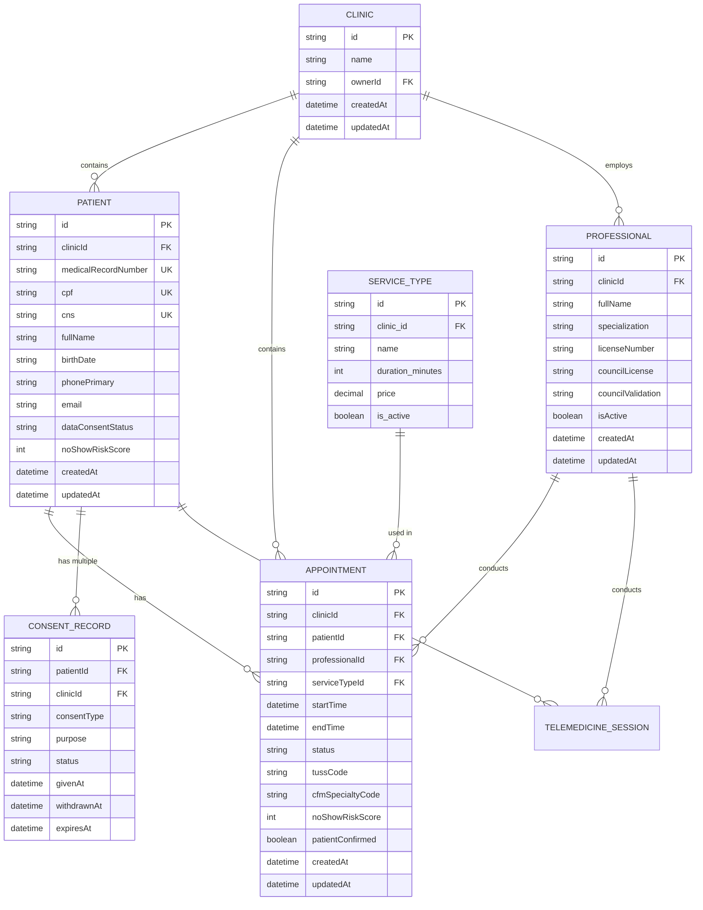
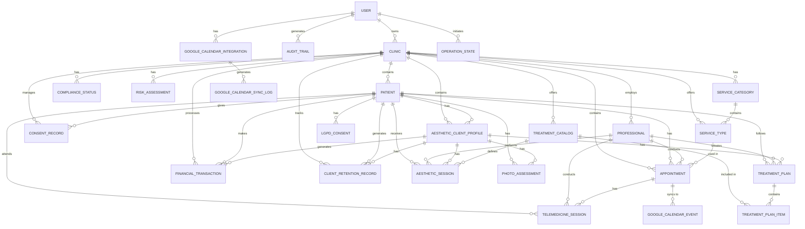
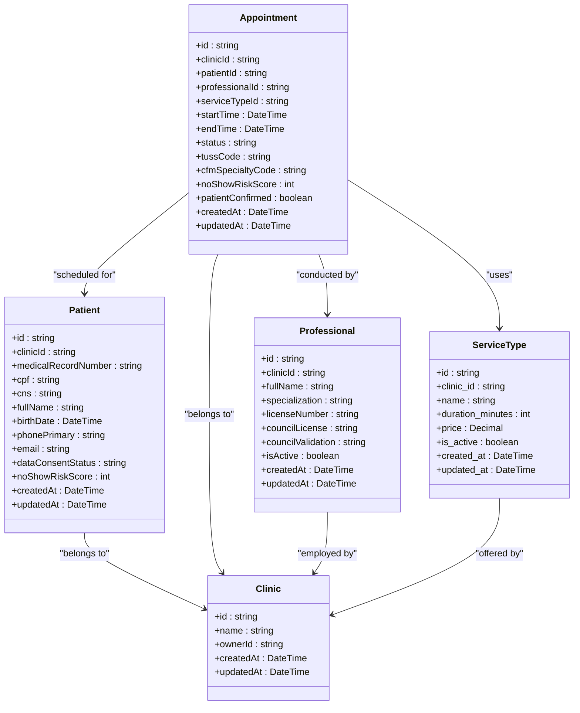
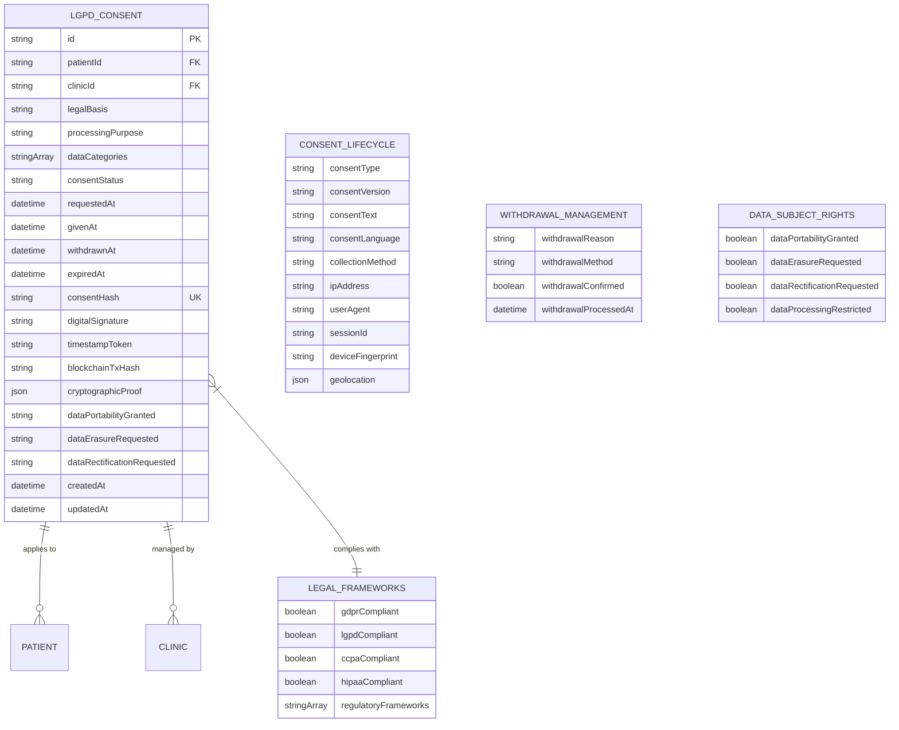
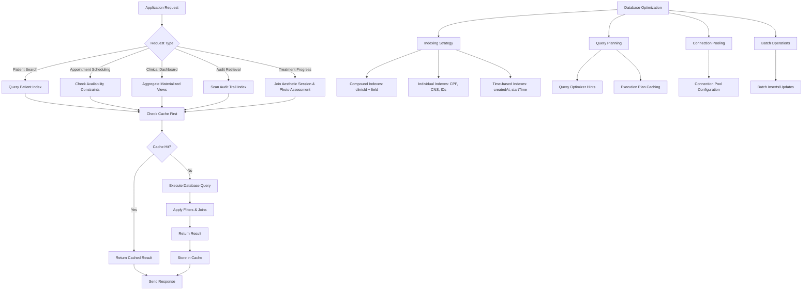
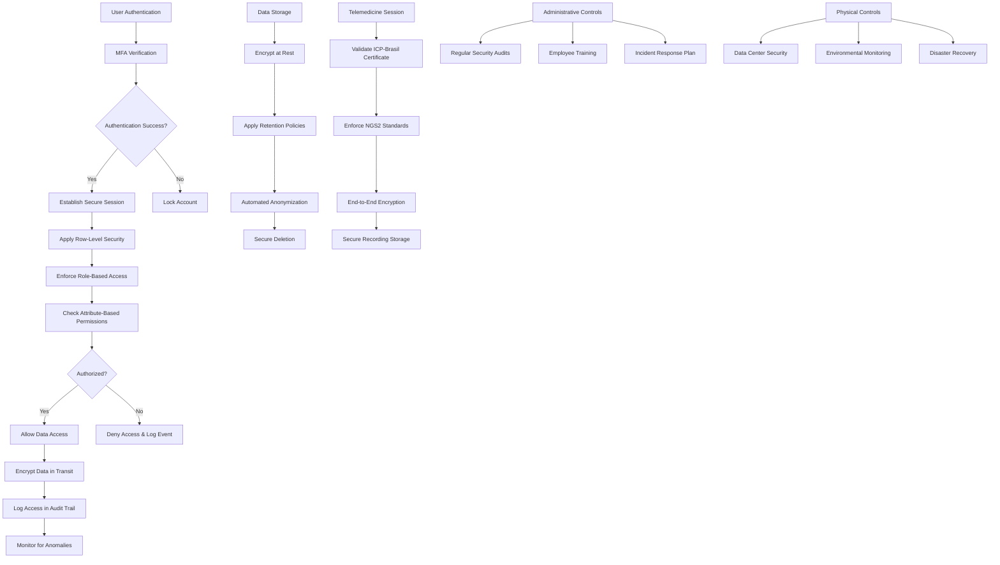
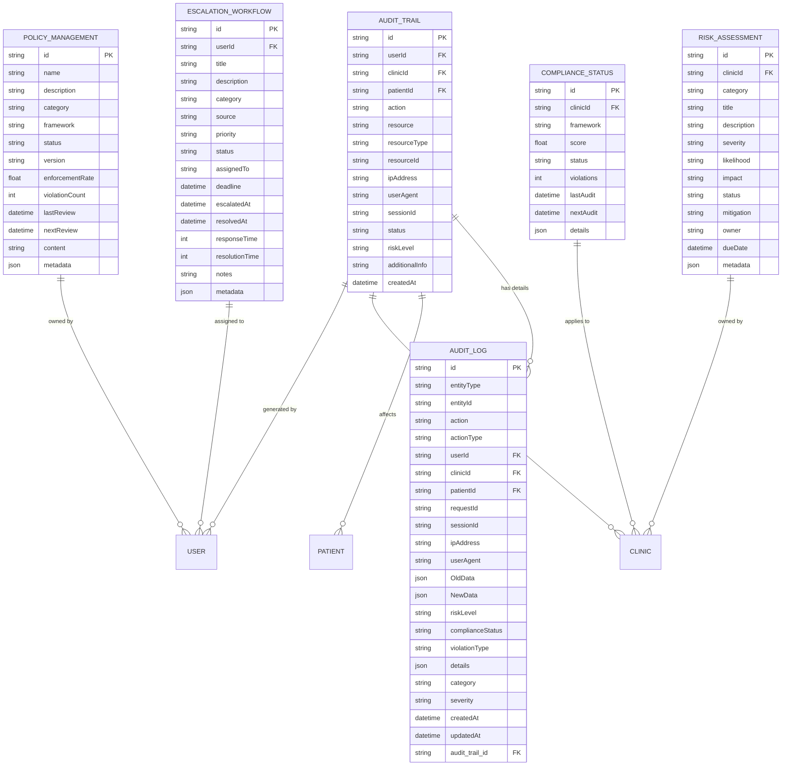

# Database Schema

<cite>
**Referenced Files in This Document**
- [schema.prisma](file://packages/database/prisma/schema.prisma)
- [README-PRISMA-HEALTHCARE.md](file://apps/api/src/README-PRISMA-HEALTHCARE.md)
</cite>

## Table of Contents

1. [Introduction](#introduction)
2. [Core Healthcare Entities](#core-healthcare-entities)
3. [Data Model Diagrams](#data-model-diagrams)
4. [Entity Relationships and Constraints](#entity-relationships-and-constraints)
5. [LGPD Compliance and Consent Management](#lgpd-compliance-and-consent-management)
6. [Aesthetic Clinic Extensions](#aesthetic-clinic-extensions)
7. [Data Access Patterns and Performance Optimization](#data-access-patterns-and-performance-optimization)
8. [Data Lifecycle Management and Retention Policies](#data-lifecycle-management-and-retention-policies)
9. [Security and Privacy Controls](#security-and-privacy-controls)
10. [Audit and Governance](#audit-and-governance)

## Introduction

The neonpro application implements a comprehensive healthcare data model designed specifically for the Brazilian market, with full compliance to LGPD (Lei Geral de Proteção de Dados) regulations. The database schema is defined using Prisma ORM and features a multi-tenant architecture where clinics serve as the primary isolation boundary. The system supports both general healthcare operations and specialized aesthetic clinic workflows.

The data model emphasizes patient privacy, consent management, and regulatory compliance while providing robust support for appointment scheduling, telemedicine, and AI-driven analytics. Key features include cryptographic proof of consent, pseudonymization techniques, row-level security (RLS), and comprehensive audit trails for all sensitive operations.

This documentation provides a detailed analysis of the database schema, focusing on entity relationships, data validation rules, business logic embedded in the schema definition, and compliance mechanisms implemented throughout the system.

**Section sources**

- [schema.prisma](file://packages/database/prisma/schema.prisma#L1-L100)
- [README-PRISMA-HEALTHCARE.md](file://apps/api/src/README-PRISMA-HEALTHCARE.md#L1-L50)

## Core Healthcare Entities

The core data model revolves around four primary entities: Patient, Appointment, Professional, and Clinic. These entities form the foundation of the healthcare platform and are interconnected through well-defined relationships that ensure data integrity and support complex clinical workflows.

The **Patient** entity contains comprehensive personal and medical information, including Brazilian-specific identifiers such as CPF (Cadastro de Pessoas Físicas), RG (Registro Geral), and CNS (Cartão Nacional de Saúde). It also includes extensive LGPD compliance fields for managing data consent, retention policies, and privacy rights. The model incorporates AI-driven no-show prediction capabilities with risk scoring and behavioral pattern analysis.

The **Appointment** entity supports both in-person and telemedicine visits, with detailed tracking of scheduling, confirmation status, and clinical outcomes. It integrates with TUSS (Terminologia Unificada da Saúde Suplementar) codes for standardized procedure classification and CFM (Conselho Federal de Medicina) validation for professional credentials. The model includes sophisticated no-show prediction with contributing factors and prevention actions.

The **Professional** entity extends basic user information with healthcare-specific details such as license numbers, specializations, and council validation status (CRM, COREN, CFF, CNEP). It supports scheduling preferences, service type associations, and availability management.

The **Clinic** entity serves as the organizational unit and data isolation boundary, containing references to all patients, appointments, professionals, and services offered within that clinic.

**Diagram sources**

- [schema.prisma](file://packages/database/prisma/schema.prisma#L150-L350)

**Section sources**

- [schema.prisma](file://packages/database/prisma/schema.prisma#L150-L350)

## Data Model Diagrams

### Healthcare Entity Relationship Diagram

**Diagram sources**

- [schema.prisma](file://packages/database/prisma/schema.prisma#L1-L1900)

## Entity Relationships and Constraints

The database schema implements a comprehensive set of relationships and constraints to maintain data integrity and support complex healthcare workflows. All foreign key relationships are explicitly defined with appropriate referential actions, typically using CASCADE deletion for dependent records.

Primary keys are universally implemented as UUIDs generated by the database, ensuring global uniqueness across distributed systems. Unique constraints are applied to critical identifiers such as CPF, CNS, and medical record numbers to prevent duplication.

The schema employs several indexing strategies to optimize query performance:

- Composite indexes on frequently queried field combinations (e.g., clinicId + isActive for patients)
- Individual indexes on high-cardinality fields used in filtering (e.g., noShowRiskScore, dataConsentStatus)
- Timestamp-based indexes for time-series queries and audit trails

Referential integrity is enforced at the database level with foreign key constraints. The multi-tenant architecture ensures data isolation through clinicId foreign keys on all patient-facing entities, enabling secure row-level security implementations in Supabase.

The Appointment entity demonstrates particularly sophisticated constraint management, with validation rules for temporal consistency (startTime before endTime), status transitions, and professional availability. The model prevents overlapping appointments for the same professional through application-level checks combined with database constraints.

**Diagram sources**

- [schema.prisma](file://packages/database/prisma/schema.prisma#L150-L350)

**Section sources**

- [schema.prisma](file://packages/database/prisma/schema.prisma#L750-L850)

## LGPD Compliance and Consent Management

The neonpro application implements a comprehensive LGPD compliance framework centered around explicit, granular consent management. The system captures and enforces patient consent for various data processing activities, including treatment, marketing, research, and data sharing.

The **ConsentRecord** model tracks individual consent events with detailed metadata including collection method, IP address, user agent, and evidence storage. Each record includes legal basis (Art. 7º, 11º LGPD), processing purpose, data categories involved, and retention period justification.

The enhanced **LGPDConsent** model provides cryptographic proof of consent through SHA-256 hashing of consent text combined with patient data, digital signatures, timestamp tokens, and optional blockchain transaction hashes. This creates an immutable audit trail that satisfies regulatory requirements for demonstrating valid consent.

Key compliance features include:

- Granular consent options for different data processing purposes (data sharing, marketing, research)
- Cryptographic proof and validation mechanisms
- Automated retention policy enforcement with scheduled anonymization
- Support for all LGPD Article 18 data subject rights (access, correction, deletion, portability)
- Withdrawal history tracking with reasons and methods
- Legal review workflow with approval status and notes

The system implements data minimization principles by only collecting necessary information and providing mechanisms for data portability and erasure requests. Right to be forgotten requests are tracked with the rightToForgetRequested flag and processed according to clinic policies.

**Diagram sources**

- [schema.prisma](file://packages/database/prisma/schema.prisma#L650-L750)

**Section sources**

- [schema.prisma](file://packages/database/prisma/schema.prisma#L650-L750)

## Aesthetic Clinic Extensions

The database schema includes specialized extensions for aesthetic clinics, building upon the core healthcare model with additional entities and attributes tailored to cosmetic medicine workflows.

The **AestheticClientProfile** extends the base Patient model with fields specific to aesthetic treatments, including skin type, skin tone, beauty goals, treatment preferences, and financial information such as membership status and loyalty points. It includes retention risk scoring and satisfaction metrics for client relationship management.

The **TreatmentCatalog** model defines standardized aesthetic procedures with ANVISA (Agência Nacional de Vigilância Sanitária) compliance tracking, including registration numbers, expiry dates, and certificate URLs. Each treatment includes detailed specifications for duration, sessions required, recovery time, pain level, and expected results.

The **AestheticSession** entity tracks individual treatment sessions with comprehensive documentation including pre- and post-treatment assessments, photos, equipment settings, and professional notes. It supports before-and-after photo comparisons with AI-powered skin analysis for objective progress measurement.

The **PhotoAssessment** model stores photographic evidence with AI-generated analysis of skin conditions, including aging indicators, wrinkle depth, pigmentation issues, and texture quality. Each photo assessment includes technical metadata about capture conditions and quality control measures.

Additional entities support financial management (**FinancialTransaction**), treatment planning (**TreatmentPlan**), and client retention analytics (**ClientRetentionRecord**) with predictive modeling for churn risk.

```mermaid
erDiagram
AESTHETIC_CLIENT_PROFILE ||--o{ AESTHETIC_SESSION : "has"
AESTHETIC_CLIENT_PROFILE ||--o{ TREATMENT_PLAN : "follows"
AESTHETIC_CLIENT_PROFILE ||--o{ PHOTO_ASSESSMENT : "includes"
AESTHETIC_CLIENT_PROFILE ||--o{ FINANCIAL_TRANSACTION : "generates"
AESTHETIC_CLIENT_PROFILE ||--o{ CLIENT_RETENTION_RECORD : "has"
TREATMENT_CATALOG ||--o{ AESTHETIC_SESSION : "defines"
TREATMENT_CATALOG ||--o{ TREATMENT_PLAN_ITEM : "included in"
TREATMENT_PLAN ||--o{ TREATMENT_PLAN_ITEM : "contains"
AESTHETIC_SESSION ||--o{ PHOTO_ASSESSMENT : "produces"
AESTHETIC_CLIENT_PROFILE {
string id PK
string patientId FK
string clinicId FK
string skinType
string skinTone
stringArray skinConcerns
stringArray beautyGoals
stringArray preferredTreatments
decimal treatmentBudget
string painTolerance
string downtimeTolerance
string preferredCommunication
boolean marketingConsent
boolean photoUsageConsent
boolean testimonialConsent
string paymentMethod
string membershipStatus
datetime membershipExpiry
int loyaltyPoints
decimal totalSpent
int retentionRiskScore
datetime lastVisitDate
datetime nextAppointmentDate
int visitFrequency
int satisfactionScore
int referralCount
boolean aestheticDataConsent
boolean beforeAfterPhotosConsent
boolean treatmentDataConsent
int dataRetentionPeriod
}
TREATMENT_CATALOG {
string id PK
string clinicId FK
string name
string description
string category
string subcategory
string treatmentType
string anvisaRegistrationNumber
datetime anvisaExpiryDate
string anvisaComplianceStatus
datetime anvisaApprovalDate
string anvisaCertificateUrl
int duration
int sessionsRequired
int sessionInterval
int recoveryTime
int painLevel
string complexity
decimal basePrice
string currency
stringArray priceIncludes
json additionalCosts
boolean discountAvailable
decimal membershipDiscount
stringArray indications
stringArray contraindications
stringArray risks
stringArray sideEffects
stringArray expectedResults
string maintenanceFrequency
stringArray equipmentUsed
stringArray materialsUsed
stringArray brandNames
stringArray productCodes
stringArray requiredQualifications
boolean certificationRequired
boolean supervisionRequired
stringArray treatmentImages
stringArray beforeAfterPhotos
stringArray videoUrls
string descriptionVideoUrl
boolean isActive
boolean isNewTreatment
boolean isPopular
json seasonalAvailability
int maxSessionsPerDay
int timesPerformed
decimal satisfactionScore
decimal complicationRate
decimal revenueGenerated
}
AESTHETIC_SESSION {
string id PK
string appointmentId FK
string patientId FK
string aestheticClientProfileId FK
string clinicId FK
string professionalId FK
string treatmentCatalogId FK
int sessionNumber
int totalSessions
string sessionType
stringArray treatmentAreas
string treatmentIntensity
stringArray productUsed
stringArray productBatch
json equipmentSettings
string techniqueUsed
json beforeAssessment
json afterAssessment
string immediateResults
stringArray expectedResults
stringArray preTreatmentPhotos
stringArray postTreatmentPhotos
json skinConditionBefore
json skinConditionAfter
int painLevelReported
stringArray sideEffectsExperienced
stringArray complications
datetime startTime
datetime endTime
int actualDuration
int preparationTime
int recoveryTime
stringArray aftercareInstructions
datetime followUpDate
datetime nextSessionDate
stringArray productsRecommended
stringArray homeCareInstructions
int patientSatisfaction
string patientFeedback
int resultsVisibility
string painToleranceReported
decimal sessionPrice
decimal discountApplied
decimal finalPrice
string paymentStatus
string paymentMethod
string anvisaProtocolNumber
boolean cfmCompliance
boolean informedConsentSigned
string consentDocumentUrl
string qualityAssessment
string qualityNotes
boolean peerReviewRequired
boolean peerReviewCompleted
string reviewedByProfessionalId
string status
string cancellationReason
datetime rescheduledFrom
string noShowReason
}
PHOTO_ASSESSMENT {
string id PK
string aestheticSessionId FK
string patientId FK
string aestheticClientProfileId FK
string clinicId FK
string photoType
string photoCategory
string photoUrl
string thumbnailUrl
string originalFilename
int fileSize
json dimensions
json aiAnalysisResults
json skinAnalysis
json agingAnalysis
json wrinkleAnalysis
json pigmentationAnalysis
json textureAnalysis
int overallSkinScore
int agingScore
int hydrationScore
int elasticityScore
int pigmentationScore
int textureScore
int progressPercentage
string treatmentEffectiveness
stringArray areasOfImprovement
stringArray areasOfConcern
string professionalNotes
datetime assessmentDate
string assessedBy
int confidenceLevel
string photoConsentStatus
datetime photoConsentDate
string photoConsentDocument
string usageConsent
int retentionPeriod
string captureDevice
json cameraSettings
string lightingConditions
json photoEditing
json qualityControl
boolean isEncrypted
string encryptionMethod
string accessLevel
string watermarkStatus
}
```

**Diagram sources**

- [schema.prisma](file://packages/database/prisma/schema.prisma#L1200-L1900)

**Section sources**

- [schema.prisma](file://packages/database/prisma/schema.prisma#L1200-L1900)

## Data Access Patterns and Performance Optimization

The database schema is optimized for common healthcare data access patterns through strategic indexing, query optimization, and caching strategies. The system implements a multi-layered approach to performance optimization that balances responsiveness with data consistency.

Key data access patterns include:

- Patient search and lookup by various criteria (name, CPF, medical record number)
- Appointment scheduling and conflict detection
- Clinical dashboard queries aggregating patient statistics
- Audit trail retrieval for compliance reporting
- Treatment history and progress tracking for aesthetic clients

The schema employs numerous indexes to accelerate these patterns:

- Compound indexes on clinicId + search fields for tenant-isolated queries
- Individual indexes on high-cardinality identifier fields (CPF, CNS)
- Time-based indexes on createdAt, updatedAt, and appointment startTime/endTime
- Status-based indexes for filtering active vs. inactive records

Query optimization is further enhanced through the use of materialized views and calculated fields. For example, the noShowRiskScore is pre-calculated and stored to enable fast filtering of high-risk patients without expensive real-time computation.

Caching strategies are implemented at multiple levels:

- Application-level caching of frequently accessed reference data (service types, treatment catalog)
- Query result caching with appropriate TTL based on data volatility
- In-memory caching of patient profiles for clinical workflows
- CDN caching of static assets like treatment images and educational videos

The system also implements connection pooling and batch operations to reduce database load during peak usage periods. Read replicas are used for analytical queries to separate operational and analytical workloads.

**Diagram sources**

- [schema.prisma](file://packages/database/prisma/schema.prisma#L800-L1200)

**Section sources**

- [schema.prisma](file://packages/database/prisma/schema.prisma#L800-L1200)

## Data Lifecycle Management and Retention Policies

The neonpro application implements comprehensive data lifecycle management aligned with LGPD requirements and industry best practices for healthcare data. The system enforces retention policies at both the organizational and individual patient level, with automated processes for data anonymization and archival.

Data retention periods are configurable at the clinic level and can be overridden for individual patients or data categories. The default retention period for most patient data is 20 years from the last contact, in accordance with Brazilian medical record retention laws. However, clinics can configure shorter or longer periods based on their specific needs and regulatory requirements.

The system implements a tiered approach to data lifecycle management:

1. **Active Storage**: Current patient data accessible for clinical operations
2. **Archival Storage**: Historical data moved to cost-effective storage after retention period expiration
3. **Anonymized Storage**: Data stripped of personally identifiable information but retained for statistical analysis
4. **Secure Deletion**: Complete removal of data when no legitimate purpose remains

Automated processes handle the transition between these states:

- Scheduled jobs identify records approaching their retention deadline
- Notifications are sent to administrators for review and potential extension
- After the retention period, data is either anonymized or securely deleted based on configuration
- Anonymization preserves statistical utility while protecting privacy

The **dataRetentionUntil** field on the Patient entity specifies the date until which data should be retained, while **dataAnonymizedAt** tracks when anonymization was performed. The **dataAnonymizationScheduled** field enables proactive planning for upcoming anonymization events.

For aesthetic clinics, additional retention rules apply to photographic evidence. The **dataRetentionPeriod** field on AestheticClientProfile specifies the number of days before-before and after photos are automatically anonymized or deleted, typically ranging from 1-5 years depending on local regulations and clinic policy.

All lifecycle transitions are logged in the audit trail with details of the action, responsible party, and justification, providing a complete record for compliance audits.

**Section sources**

- [schema.prisma](file://packages/database/prisma/schema.prisma#L200-L300)

## Security and Privacy Controls

The neonpro application implements a comprehensive security framework that combines technical, administrative, and physical controls to protect patient data. The system follows a defense-in-depth approach with multiple layers of protection.

At the database level, row-level security (RLS) is implemented in Supabase to enforce data isolation between clinics and restrict access based on user roles and permissions. Each query is automatically scoped to the user's clinic context, preventing unauthorized cross-tenant access.

Data privacy is protected through several mechanisms:

- **Pseudonymization**: Direct identifiers are separated from indirect identifiers, with linkage keys protected by strong access controls
- **Encryption**: Data is encrypted at rest using AES-256 and in transit using TLS 1.3
- **Access Logging**: All access to sensitive data is logged with user identity, timestamp, IP address, and user agent
- **Anonymization**: When data is no longer needed for its original purpose, it is anonymized to prevent re-identification

The system implements attribute-based access control (ABAC) with fine-grained permissions for different data categories and operations. Users are granted the minimum necessary privileges to perform their job functions, following the principle of least privilege.

For telemedicine sessions, additional security controls are enforced:

- ICP-Brasil digital certificate validation for participants
- NGS2 (Norma Geral de Segurança de Nível 2) compliance for communication security
- End-to-end encryption of video and audio streams
- Secure recording storage with access controls and audit logging

The **TelemedicineSession** model includes fields for tracking compliance with CFM Resolution 2314, ICP-Brasil certificate validation, and NGS2 security standards. These controls ensure that remote consultations meet Brazilian regulatory requirements for medical practice.

Two-factor authentication is required for all user accounts, with support for authenticator apps and security keys. Session management includes automatic timeout after 15 minutes of inactivity and concurrent session limits to prevent account sharing.

**Diagram sources**

- [schema.prisma](file://packages/database/prisma/schema.prisma#L900-L1000)

**Section sources**

- [schema.prisma](file://packages/database/prisma/schema.prisma#L900-L1000)

## Audit and Governance

The neonpro application implements a robust audit and governance framework to ensure accountability, transparency, and regulatory compliance. The system maintains comprehensive audit trails for all significant operations, with particular emphasis on data access, consent management, and security events.

The **AuditTrail** model captures critical information about each audited event, including:

- User identity and role
- Clinic context
- Patient affected (when applicable)
- Action performed (VIEW, CREATE, UPDATE, DELETE, EXPORT, LOGIN, LOGOUT)
- Resource accessed and its type
- IP address and user agent
- Session identifier
- Risk level assessment
- Additional contextual information

For more detailed compliance tracking, the **AuditLog** model provides enhanced capabilities with support for old and new data snapshots (for changes), request identifiers, and structured details. This enables forensic analysis of data modifications and supports regulatory requirements for demonstrating data integrity.

Governance is supported through several specialized models:

- **ComplianceStatus** tracks adherence to various frameworks (HIPAA, LGPD, GDPR, SOC2) with scores, violations, and audit schedules
- **RiskAssessment** manages identified risks with severity ratings, mitigation strategies, and ownership assignments
- **PolicyManagement** governs internal policies with versioning, enforcement rates, and review cycles
- **EscalationWorkflow** handles compliance issues and security incidents through structured workflows with priority levels and deadlines

The system also includes performance monitoring for AI models through the **AIGovernanceMetric** model, which tracks hallucination rates, accuracy scores, bias detection, and compliance with regulations. This ensures that AI-driven features operate within acceptable parameters and can be audited for fairness and reliability.

All audit and governance data is protected with the same stringent security controls as patient data, including encryption, access logging, and retention policies. Reports can be generated for internal review, regulatory submissions, and accreditation purposes.

**Diagram sources**

- [schema.prisma](file://packages/database/prisma/schema.prisma#L750-L850)

**Section sources**

- [schema.prisma](file://packages/database/prisma/schema.prisma#L750-L850)
