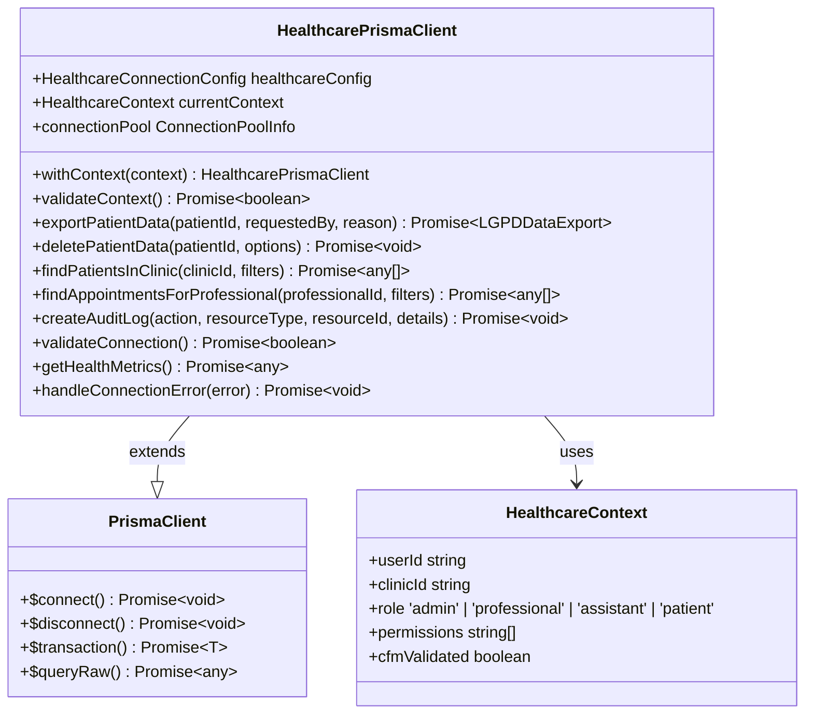
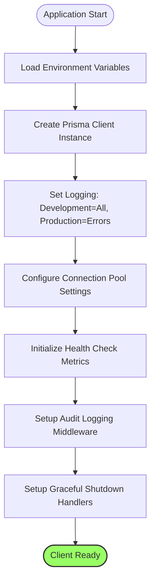
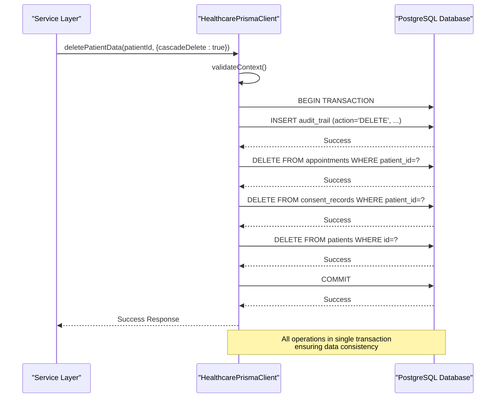
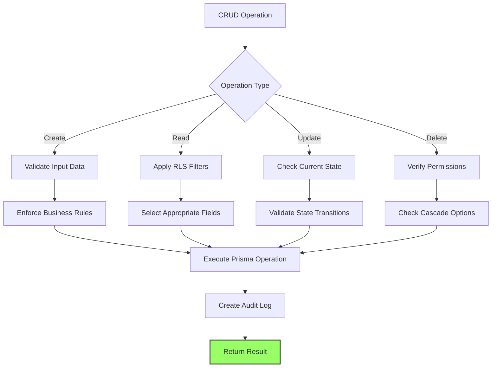
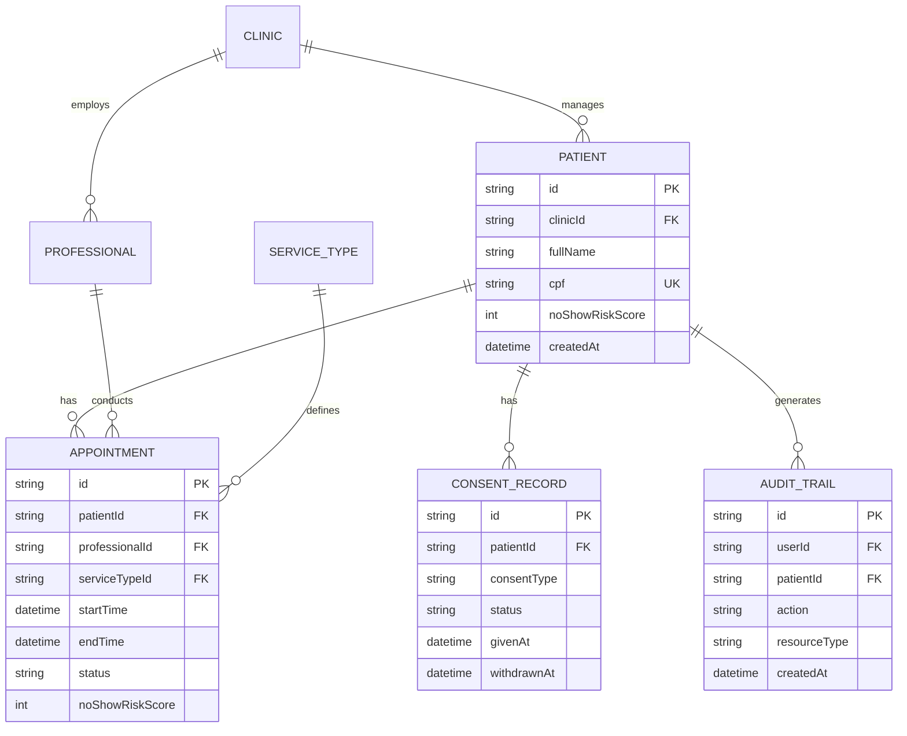
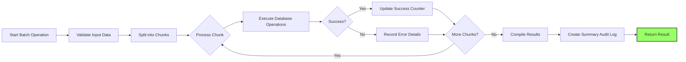
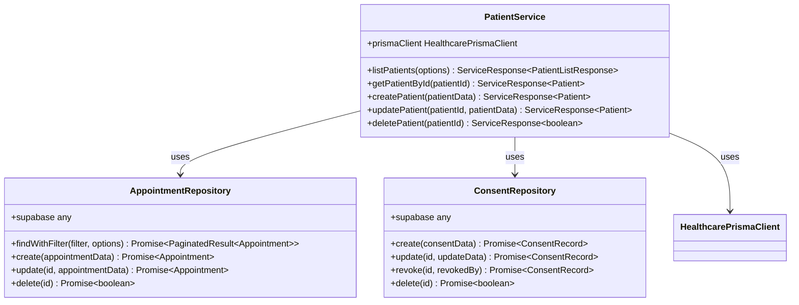
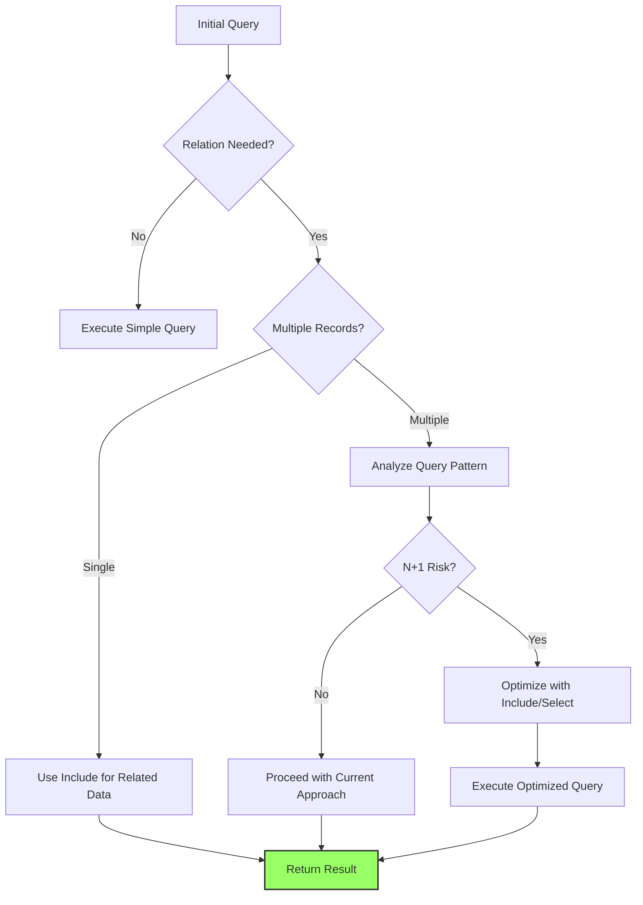
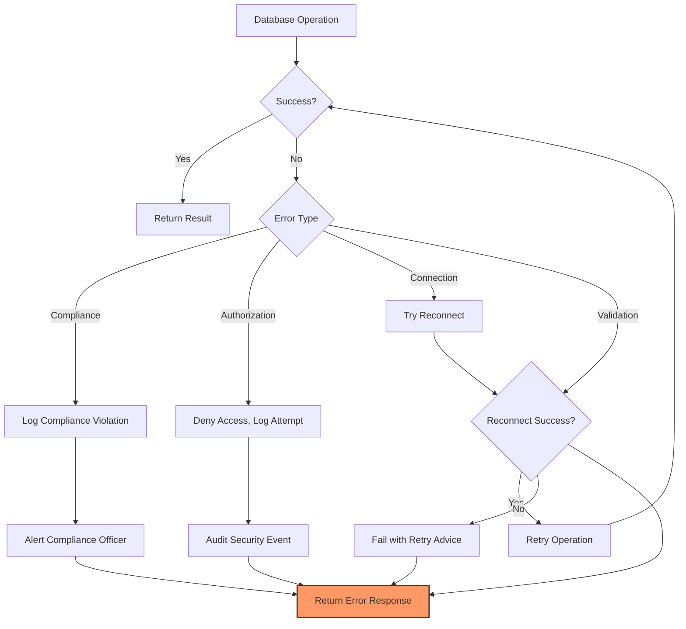
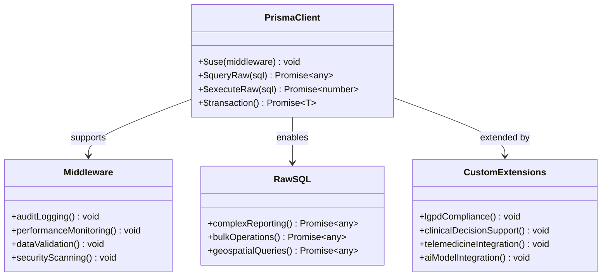

# ORM Usage

<cite>
**Referenced Files in This Document**
- [prisma.ts](file://apps/api/src/clients/prisma.ts)
- [schema.prisma](file://packages/database/prisma/schema.prisma)
- [patient-service.ts](file://apps/api/src/services/patient-service.ts)
- [appointment-repository.ts](file://packages/database/src/repositories/appointment-repository.ts)
- [consent-repository.ts](file://packages/database/src/repositories/consent-repository.ts)
- [healthcare-performance.ts](file://apps/api/src/utils/healthcare-performance.ts)
- [prisma-rls.ts](file://apps/api/src/trpc/middleware/prisma-rls.ts)
- [README-PRISMA-HEALTHCARE.md](file://apps/api/src/README-PRISMA-HEALTHCARE.md)
</cite>

## Table of Contents

1. [Introduction](#introduction)
2. [Prisma Client Integration](#prisma-client-integration)
3. [Connection Configuration](#connection-configuration)
4. [Transaction Management](#transaction-management)
5. [CRUD Operations](#crud-operations)
6. [Complex Queries with Relations](#complex-queries-with-relations)
7. [Batch Operations](#batch-operations)
8. [Repository Pattern and Service Layer](#repository-pattern-and-service-layer)
9. [N+1 Query Solutions](#n1-query-solutions)
10. [Error Handling](#error-handling)
11. [Advanced Features](#advanced-features)

## Introduction

This document provides comprehensive guidance on using Prisma ORM within the neonpro application with PostgreSQL. The implementation is specifically optimized for healthcare workloads, incorporating multi-tenant Row Level Security (RLS), LGPD compliance, and Brazilian healthcare regulatory requirements. The documentation covers the complete lifecycle of database interactions from connection management to complex query patterns, with a focus on patient data integrity, performance optimization, and regulatory compliance.

## Prisma Client Integration

The neonpro application implements a healthcare-optimized Prisma client that extends the base PrismaClient with domain-specific features for medical applications. The integration follows a singleton pattern to ensure resource efficiency while providing enhanced capabilities for healthcare operations.

The core integration is implemented in `prisma.ts`, which creates an extended HealthcarePrismaClient interface that includes methods for LGPD compliance, audit logging, and context-aware operations. The client is designed to work seamlessly with Supabase RLS policies, ensuring proper multi-tenant data isolation between clinics.

Key integration features include:

- Singleton pattern implementation for connection pooling
- Context injection for multi-tenant RLS enforcement
- Automatic audit trail creation for all data modifications
- LGPD compliance utilities for data export and deletion
- Brazilian healthcare regulatory compliance (ANVISA, CFM)

The integration also includes middleware that automatically enforces RLS policies for all database operations, ensuring that users can only access data within their authorized clinic context. This is particularly important for maintaining patient privacy and complying with Brazilian data protection regulations.



**Diagram sources**

- [prisma.ts](file://apps/api/src/clients/prisma.ts#L1-L790)

**Section sources**

- [prisma.ts](file://apps/api/src/clients/prisma.ts#L1-L790)
- [README-PRISMA-HEALTHCARE.md](file://apps/api/src/README-PRISMA-HEALTHCARE.md#L1-L200)

## Connection Configuration

The Prisma client in neonpro is configured with healthcare-optimized settings that balance performance, reliability, and regulatory compliance requirements. The connection configuration is defined through environment variables with sensible defaults for medical applications.

Key configuration parameters include:

- **maxConnections**: Maximum number of connections in the pool (default: 20)
- **connectionTimeout**: Timeout for establishing new connections (default: 30,000ms)
- **idleTimeout**: Timeout for idle connections before they are closed (default: 600,000ms)
- **healthCheckInterval**: Interval for health checks on the connection pool (default: 30,000ms)

The configuration is implemented in `prisma.ts` where it creates a HealthcareConnectionConfig object from environment variables. This approach allows different deployment environments (development, staging, production) to have appropriate connection settings based on their expected workload.

Connection logging is conditionally enabled based on the NODE_ENV environment variable, providing detailed query logs in development while minimizing log output in production for security and performance reasons. The error format is set to "pretty" to enhance readability during debugging.

The client also implements graceful shutdown handling by listening for SIGINT and SIGTERM signals, ensuring that database connections are properly closed when the application terminates. This prevents connection leaks and ensures data integrity during deployment cycles.



**Diagram sources**

- [prisma.ts](file://apps/api/src/clients/prisma.ts#L136-L180)

**Section sources**

- [prisma.ts](file://apps/api/src/clients/prisma.ts#L136-L180)

## Transaction Management

Transaction management in the neonpro application follows healthcare-specific patterns to ensure data consistency and regulatory compliance. The system implements both explicit and implicit transaction handling depending on the operation complexity and regulatory requirements.

For simple operations, the extended HealthcarePrismaClient provides atomic methods that internally manage transactions. For example, the `deletePatientData` method wraps related operations in a transaction to ensure that either all related records are deleted or none are, maintaining data integrity according to LGPD right to erasure requirements.

For complex operations involving multiple steps, the application uses Prisma's native `$transaction` method with appropriate isolation levels. The transaction patterns are designed to handle healthcare-specific scenarios such as appointment scheduling conflicts, consent record updates, and audit trail creation.

The system also implements retry logic for transient database errors, with exponential backoff to handle temporary connectivity issues without compromising patient care workflows. Transactions are timed to prevent long-running operations that could impact system performance.

Key transaction patterns include:

- **Atomic patient data operations**: Ensuring all related records are processed together
- **Audit-integrated transactions**: Creating audit logs as part of the same transaction
- **Conditional transactions**: Only proceeding with data modifications when all compliance checks pass
- **Rollback safety**: Ensuring that failed transactions leave no partial state



**Diagram sources**

- [prisma.ts](file://apps/api/src/clients/prisma.ts#L550-L590)

**Section sources**

- [prisma.ts](file://apps/api/src/clients/prisma.ts#L550-L590)
- [consent-repository.ts](file://packages/database/src/repositories/consent-repository.ts#L217-L259)

## CRUD Operations

The neonpro application implements comprehensive CRUD operations through the extended Prisma client, with healthcare-specific optimizations and compliance features. The operations follow consistent patterns across entities while incorporating domain-specific validation and business rules.

### Patient Data Retrieval

Patient data retrieval is implemented through the `findPatientsInClinic` method, which enforces RLS policies to ensure clinicians can only access patients within their authorized clinic. The method supports filtering and pagination, with automatic audit logging for compliance purposes.

```typescript
const patients = await prisma.findPatientsInClinic(clinicId, {
  patientStatus: 'active',
  isActive: true,
})
```

The implementation selectively exposes sensitive fields like CPF (Brazilian national identifier) only to users with admin privileges, implementing field-level security based on user role.

### Appointment Creation

Appointment creation follows a structured process that validates professional availability, checks for scheduling conflicts, and applies appropriate default values. The operation is wrapped in transaction management to ensure data consistency.

```typescript
const appointment = await prisma.appointment.create({
  data: {
    ...appointmentData,
    clinicId: context.clinicId,
    createdBy: context.userId,
  },
})
```

The system automatically calculates end time from start time and duration, assigns appropriate status, and creates corresponding audit trails.

### Consent Record Updates

Consent record management implements LGPD-compliant workflows for obtaining, updating, and withdrawing patient consent. Each operation creates a detailed audit trail with cryptographic proof when required.

```typescript
await prisma.consentRecord.update({
  where: { id: consentId },
  data: {
    status: 'withdrawn',
    withdrawnAt: new Date(),
    evidence: { withdrawalReason: reason },
  },
})
```

The update operation preserves historical consent states while recording the current status, supporting the legal requirement to maintain consent history.



**Diagram sources**

- [prisma.ts](file://apps/api/src/clients/prisma.ts#L600-L700)
- [appointment-repository.ts](file://packages/database/src/repositories/appointment-repository.ts#L347-L397)
- [consent-repository.ts](file://packages/database/src/repositories/consent-repository.ts#L173-L215)

**Section sources**

- [prisma.ts](file://apps/api/src/clients/prisma.ts#L600-L700)
- [patient-service.ts](file://apps/api/src/services/patient-service.ts#L228-L266)
- [appointment-repository.ts](file://packages/database/src/repositories/appointment-repository.ts#L347-L397)

## Complex Queries with Relations

The neonpro application leverages Prisma's relation loading capabilities to efficiently retrieve complex healthcare data structures while avoiding common performance pitfalls. The implementation uses strategic relation inclusion to optimize queries for specific use cases.

### Relation Loading Strategies

The system employs several relation loading strategies based on the access pattern:

**Eager Loading with Include**: Used when related data is always needed, such as retrieving a patient with their appointments and consent records.

```typescript
const patient = await prisma.patient.findFirst({
  where: { id: patientId },
  include: {
    appointments: {
      include: {
        professional: true,
        serviceType: true,
      },
    },
    consentRecords: true,
    auditTrails: true,
  },
})
```

**Explicit Selection with Select**: Used to minimize data transfer by specifying only required fields, particularly important for mobile clients and performance-critical operations.

```typescript
const patients = await prisma.patient.findMany({
  where: { clinicId },
  select: {
    id: true,
    fullName: true,
    phonePrimary: true,
    email: true,
    birthDate: true,
    noShowRiskScore: true,
  },
})
```

### Healthcare-Specific Query Patterns

The application implements several domain-specific query patterns:

**Multi-Clinic Access**: For administrative users who need to access data across multiple clinics, the system uses union queries or batch operations rather than attempting to bypass RLS policies.

**Temporal Queries**: For appointment scheduling and historical analysis, the system uses date range queries with appropriate indexing.

```typescript
const appointments = await prisma.appointment.findMany({
  where: {
    startTime: {
      gte: startDate,
      lte: endDate,
    },
  },
})
```

**Risk-Based Filtering**: For patient management, the system supports queries based on risk scores such as no-show prediction.

```typescript
const highRiskPatients = await prisma.patient.findMany({
  where: {
    noShowRiskScore: {
      gte: 75,
    },
  },
})
```

The schema is optimized with appropriate indexes on commonly queried fields including clinicId, status, timestamps, and risk scores to ensure query performance at scale.



**Diagram sources**

- [schema.prisma](file://packages/database/prisma/schema.prisma#L1-L1903)
- [prisma.ts](file://apps/api/src/clients/prisma.ts#L267-L350)

**Section sources**

- [schema.prisma](file://packages/database/prisma/schema.prisma#L1-L1903)
- [patient-service.ts](file://apps/api/src/services/patient-service.ts#L393-L439)

## Batch Operations

The neonpro application implements efficient batch operations for bulk data processing scenarios common in healthcare workflows, such as patient import, appointment scheduling, and reporting. The implementation balances performance optimization with system stability and regulatory compliance requirements.

### Batch Processing Patterns

The system uses several patterns for batch operations:

**Chunked Processing**: Large datasets are processed in smaller batches to prevent memory exhaustion and connection timeouts.

```typescript
async function batchCreatePatients(
  clinicId: string,
  patientsData: Array<Record<string, unknown>>,
): Promise<{ created: number; errors: Array<{ index: number; error: string }> }> {
  const batchSize = Math.min(config.maxBatchSize, patientsData.length)
  // Process in batches
  for (let i = 0; i < patientsData.length; i += batchSize) {
    const batch = patientsData.slice(i, i + batchSize)
    // Process batch
  }
}
```

**Error Resilience**: Individual failures within a batch do not abort the entire operation, allowing partial success with detailed error reporting.

**Progress Tracking**: Long-running batch operations provide progress updates and can be monitored through the system's performance metrics.

### Performance Optimization

The batch operations are optimized with:

- **Connection Pooling**: Efficient reuse of database connections
- **Query Caching**: Caching of frequently accessed reference data
- **Parallel Execution**: Concurrent processing of independent operations when safe

The system also implements rate limiting and resource monitoring to prevent batch operations from overwhelming the database, with automatic throttling when system load exceeds thresholds.



**Diagram sources**

- [healthcare-performance.ts](file://apps/api/src/utils/healthcare-performance.ts#L358-L404)
- [appointment-repository.ts](file://packages/database/src/repositories/appointment-repository.ts#L299-L345)

**Section sources**

- [healthcare-performance.ts](file://apps/api/src/utils/healthcare-performance.ts#L358-L404)
- [appointment-repository.ts](file://packages/database/src/repositories/appointment-repository.ts#L299-L345)

## Repository Pattern and Service Layer

The neonpro application implements a clean separation between data access and business logic through the repository pattern and service layer architecture. This design promotes code reusability, testability, and maintainability while enforcing healthcare-specific business rules.

### Repository Pattern Implementation

The repository layer abstracts the Prisma client behind domain-specific interfaces, providing a consistent API for data access regardless of the underlying storage mechanism.

```typescript
interface AppointmentRepository {
  findWithFilter(
    filter: AppointmentFilter,
    options?: PaginationOptions,
  ): Promise<PaginatedResult<Appointment>>
  create(appointmentData: CreateAppointmentRequest): Promise<Appointment>
  update(id: string, appointmentData: UpdateAppointmentRequest): Promise<Appointment>
  delete(id: string): Promise<boolean>
}
```

Each repository handles the mapping between domain objects and database records, applying appropriate filters and transformations. The repositories are responsible for:

- Enforcing RLS policies
- Applying default values
- Validating data constraints
- Creating audit trails
- Handling database-specific error conditions

### Service Layer Responsibilities

The service layer orchestrates complex business workflows by coordinating multiple repositories and enforcing domain rules. Key responsibilities include:

**Business Rule Enforcement**: Implementing healthcare-specific rules such as appointment scheduling policies, consent management workflows, and patient data validation.

**Transaction Coordination**: Managing transactions that span multiple entities, ensuring data consistency across related operations.

**Cross-Cutting Concerns**: Handling logging, monitoring, and error handling in a consistent manner across the application.

**Integration Points**: Coordinating with external systems such as messaging services, payment processors, and AI components.

The service layer also implements caching strategies to improve performance for frequently accessed data, with appropriate cache invalidation to ensure data freshness.



**Diagram sources**

- [patient-service.ts](file://apps/api/src/services/patient-service.ts#L1-L500)
- [appointment-repository.ts](file://packages/database/src/repositories/appointment-repository.ts#L1-L500)
- [consent-repository.ts](file://packages/database/src/repositories/consent-repository.ts#L1-L500)

**Section sources**

- [patient-service.ts](file://apps/api/src/services/patient-service.ts#L1-L500)
- [appointment-repository.ts](file://packages/database/src/repositories/appointment-repository.ts#L1-L500)

## N+1 Query Solutions

The neonpro application addresses the N+1 query problem through strategic use of Prisma's relation loading features and query optimization techniques. The N+1 issue is particularly critical in healthcare applications where large datasets and complex relationships are common.

### Prevention Strategies

The system implements several approaches to prevent N+1 queries:

**Eager Loading with Include**: The primary strategy is to use Prisma's `include` option to fetch related data in a single query rather than making additional queries for each relationship.

```typescript
// Anti-pattern: N+1 queries
const patients = await prisma.patient.findMany()
for (const patient of patients) {
  const appointments = await prisma.appointment.findMany({
    where: { patientId: patient.id },
  })
}

// Correct pattern: Single query with include
const patients = await prisma.patient.findMany({
  include: {
    appointments: true,
  },
})
```

**Selective Field Loading with Select**: When only specific fields are needed, the `select` option minimizes data transfer and improves performance.

```typescript
const patients = await prisma.patient.findMany({
  select: {
    id: true,
    fullName: true,
    appointments: {
      select: {
        id: true,
        startTime: true,
        status: true,
      },
    },
  },
})
```

### Performance Monitoring

The application includes a query optimizer that detects potential N+1 patterns and recommends fixes:

```typescript
// Query optimization service analyzes query patterns
const optimizations = await queryOptimizer.analyzeQueries()
if (optimizations.some((opt) => opt.issues.includes('Potential N+1 query pattern'))) {
  // Alert developers to optimize queries
}
```

The system also implements caching for frequently accessed reference data and commonly used queries, reducing database load and improving response times.



**Diagram sources**

- [healthcare-performance.ts](file://apps/api/src/utils/healthcare-performance.ts#L205-L251)
- [query-optimizer.ts](file://apps/api/src/utils/query-optimizer.ts#L170-L209)

**Section sources**

- [healthcare-performance.ts](file://apps/api/src/utils/healthcare-performance.ts#L205-L251)
- [query-optimizer.ts](file://apps/api/src/utils/query-optimizer.ts#L170-L209)

## Error Handling

The neonpro application implements comprehensive error handling for database operations, with specialized handling for healthcare-specific scenarios and regulatory requirements. The error handling system ensures data integrity, provides meaningful feedback, and maintains compliance with Brazilian healthcare regulations.

### Database Exception Handling

The system categorizes database errors into several types:

**Healthcare Compliance Errors**: Errors related to regulatory requirements such as LGPD, ANVISA, and CFM compliance.

```typescript
class HealthcareComplianceError extends Error {
  constructor(message: string, code: string, complianceFramework: 'LGPD' | 'ANVISA' | 'CFM') {
    super(message)
    this.name = 'HealthcareComplianceError'
  }
}
```

**Unauthorized Access Errors**: Errors when users attempt to access data outside their authorized scope.

```typescript
class UnauthorizedHealthcareAccessError extends Error {
  constructor(message: string, resourceType: string, resourceId?: string) {
    super(message)
    this.name = 'UnauthorizedHealthcareAccessError'
  }
}
```

**Connection and Transaction Errors**: Errors related to database connectivity and transaction management.

The error handling system automatically logs all database errors to the audit trail, capturing the context, timestamp, and affected resources. Critical errors trigger alerts to system administrators while maintaining patient privacy.

### Connection Failure Recovery

The application implements robust recovery mechanisms for database connection failures:

- **Automatic Reconnection**: Attempting to reconnect when connections are lost
- **Graceful Degradation**: Providing limited functionality when the database is unavailable
- **Retry Logic**: Implementing exponential backoff for transient failures
- **Circuit Breaker**: Preventing cascading failures during prolonged outages

The system also monitors connection health and can redirect traffic to read replicas when available, improving resilience during peak loads or maintenance periods.



**Diagram sources**

- [prisma.ts](file://apps/api/src/clients/prisma.ts#L700-L745)
- [healthcare-errors.ts](file://apps/api/src/utils/healthcare-errors.ts#L371-L550)

**Section sources**

- [prisma.ts](file://apps/api/src/clients/prisma.ts#L700-L745)
- [healthcare-errors.ts](file://apps/api/src/utils/healthcare-errors.ts#L371-L550)

## Advanced Features

The neonpro application leverages advanced Prisma features to implement sophisticated healthcare workflows and maintain regulatory compliance. These features extend beyond basic ORM functionality to address domain-specific requirements.

### Raw SQL Queries

For complex analytical queries and performance-critical operations, the system uses Prisma's raw SQL capabilities:

```typescript
// Execute raw SQL for complex reporting
const results = await prisma.$queryRaw`
  SELECT 
    p.full_name,
    COUNT(a.id) as appointment_count,
    AVG(a.no_show_risk_score) as avg_risk
  FROM patients p
  LEFT JOIN appointments a ON p.id = a.patient_id
  WHERE p.clinic_id = ${clinicId}
  GROUP BY p.id, p.full_name
  ORDER BY appointment_count DESC
  LIMIT 100
`
```

Raw queries are carefully audited and parameterized to prevent SQL injection, with additional sanitization through the application's SQL sanitizer module.

### Middleware Hooks

The application implements Prisma middleware for cross-cutting concerns:

**Automatic Audit Logging**: Creating audit trails for all data modifications.

```typescript
prisma.$use(async (params, next) => {
  const start = Date.now()
  const result = await next(params)

  if (['create', 'update', 'delete'].includes(params.action)) {
    await prisma.createAuditLog(
      params.action.toUpperCase(),
      params.model || 'UNKNOWN',
      JSON.stringify(params.args?.where || {}),
      { duration: Date.now() - start },
    )
  }

  return result
})
```

**Performance Monitoring**: Tracking query execution times and identifying slow operations.

**Data Validation**: Enforcing healthcare-specific business rules at the data access layer.

### Custom Extensions

The system extends Prisma with healthcare-specific methods:

**LGPD Compliance Operations**: Data export and deletion following Brazilian privacy regulations.

```typescript
// Export patient data per LGPD Article 18.I
const exportData = await prisma.exportPatientData(
  patientId,
  requestedBy,
  'Patient data portability request',
)

// Delete patient data per LGPD Article 18.VI
await prisma.deletePatientData(patientId, {
  cascadeDelete: true,
  retainAuditTrail: true,
  reason: 'Right to erasure request',
})
```

**Clinical Decision Support**: Integrating with AI models for risk prediction and treatment recommendations.

These advanced features are designed to work within the constraints of healthcare regulations while providing the flexibility needed for complex medical workflows.



**Diagram sources**

- [prisma.ts](file://apps/api/src/clients/prisma.ts#L650-L700)
- [README-PRISMA-HEALTHCARE.md](file://apps/api/src/README-PRISMA-HEALTHCARE.md#L93-L160)

**Section sources**

- [prisma.ts](file://apps/api/src/clients/prisma.ts#L650-L700)
- [README-PRISMA-HEALTHCARE.md](file://apps/api/src/README-PRISMA-HEALTHCARE.md#L93-L160)
