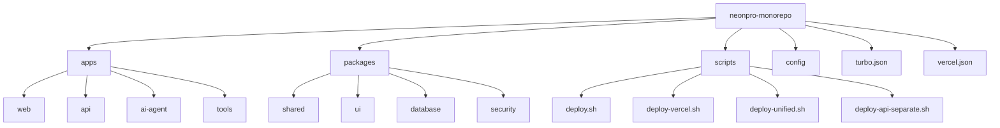
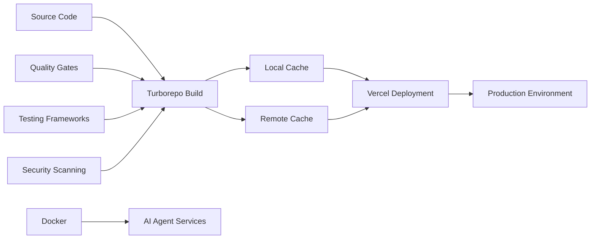
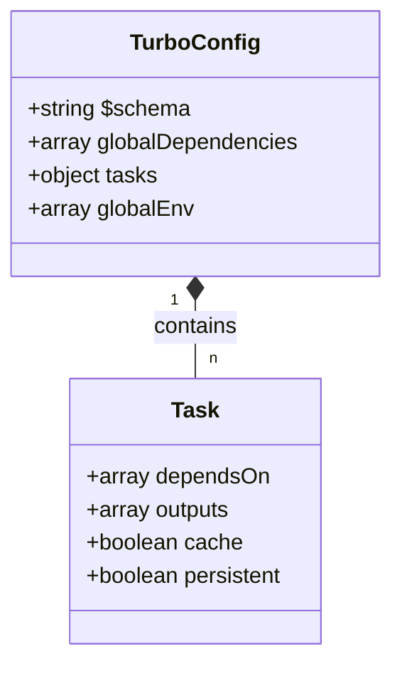
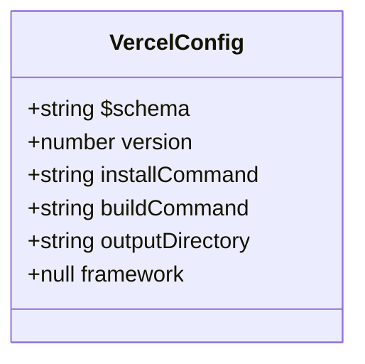
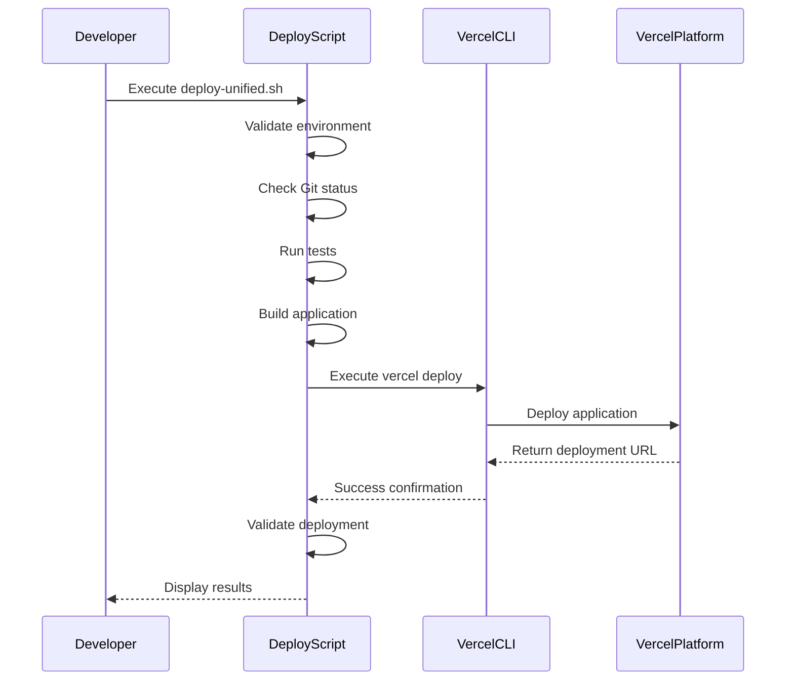
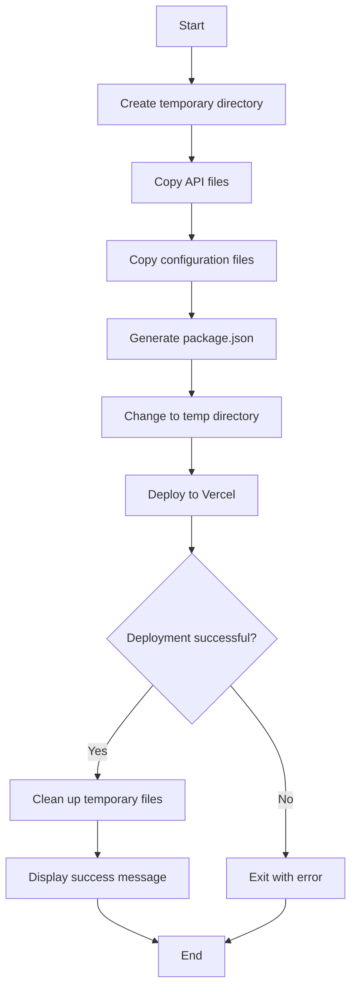
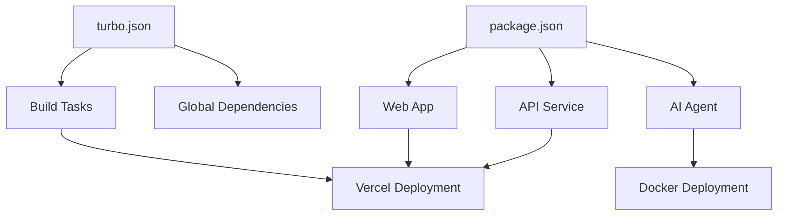

# CI/CD Pipeline

<cite>
**Referenced Files in This Document**   
- [turbo.json](file://turbo.json)
- [vercel.json](file://vercel.json)
- [deploy.sh](file://scripts/deploy.sh)
- [deploy-vercel.sh](file://scripts/deploy-vercel.sh)
- [deploy-unified.sh](file://scripts/deploy-unified.sh)
- [deploy-api-separate.sh](file://scripts/deploy-api-separate.sh)
- [apps/api/package.json](file://apps/api/package.json)
- [apps/web/package.json](file://apps/web/package.json)
- [package.json](file://package.json)
- [apps/ai-agent/Dockerfile](file://apps/ai-agent/Dockerfile)
</cite>

## Table of Contents
1. [Introduction](#introduction)
2. [Project Structure](#project-structure)
3. [Core Components](#core-components)
4. [Architecture Overview](#architecture-overview)
5. [Detailed Component Analysis](#detailed-component-analysis)
6. [Dependency Analysis](#dependency-analysis)
7. [Performance Considerations](#performance-considerations)
8. [Troubleshooting Guide](#troubleshooting-guide)
9. [Conclusion](#conclusion)

## Introduction
The NeonPro application implements a sophisticated CI/CD pipeline leveraging Turborepo for monorepo-aware builds and Vercel for deployment orchestration. This system enables efficient, incremental builds across multiple applications including frontend web interfaces, API services, and AI agent components. The pipeline integrates quality gates, testing frameworks, and security scanning tools to ensure reliable deployments while maintaining compliance with healthcare regulations such as LGPD, CFM, and ANVISA. The architecture supports both Vercel deployments for web and API components and Docker-based deployments for AI agent services, providing a unified deployment experience through comprehensive scripting.

## Project Structure
The NeonPro monorepo follows a structured organization with distinct directories for applications, packages, configuration, and scripts. Applications are separated into web frontend, API services, AI agents, and various tools. Shared functionality is encapsulated in reusable packages, while deployment configurations and scripts provide the infrastructure for the CI/CD pipeline. This structure enables independent development and deployment of components while maintaining shared standards and dependencies.

**Diagram sources**
- [turbo.json](file://turbo.json#L1-L48)
- [vercel.json](file://vercel.json#L1-L9)
- [package.json](file://package.json#L1-L177)

**Section sources**
- [turbo.json](file://turbo.json#L1-L48)
- [vercel.json](file://vercel.json#L1-L9)
- [package.json](file://package.json#L1-L177)

## Core Components
The CI/CD pipeline consists of several core components working together to enable efficient builds and deployments. Turborepo serves as the build orchestrator, managing task dependencies and caching across the monorepo. Vercel handles deployment of frontend and API components, while Docker manages AI agent service deployments. Multiple deployment scripts provide different strategies for various deployment scenarios, from simple deployments to comprehensive healthcare-compliant processes.

**Section sources**
- [turbo.json](file://turbo.json#L1-L48)
- [scripts/deploy.sh](file://scripts/deploy.sh#L1-L33)
- [scripts/deploy-vercel.sh](file://scripts/deploy-vercel.sh#L1-L74)

## Architecture Overview
The CI/CD architecture combines Turborepo's incremental build capabilities with Vercel's deployment platform and custom deployment scripts. The system uses remote caching to optimize build times across developers and CI environments. Task orchestration ensures proper dependency ordering, while quality gates enforce code standards before deployment. The architecture supports parallel execution of independent tasks and provides mechanisms for cache invalidation and dependency resolution.

**Diagram sources**
- [turbo.json](file://turbo.json#L1-L48)
- [package.json](file://package.json#L1-L177)
- [scripts/deploy.sh](file://scripts/deploy.sh#L1-L33)

## Detailed Component Analysis

### Turborepo Configuration Analysis
The Turborepo configuration defines the build orchestration strategy for the monorepo, specifying task dependencies, outputs, and global dependencies that trigger rebuilds. The configuration enables incremental builds by tracking file changes and caching task results.

**Diagram sources**
- [turbo.json](file://turbo.json#L1-L48)

**Section sources**
- [turbo.json](file://turbo.json#L1-L48)

### Vercel Deployment Configuration Analysis
The Vercel configuration specifies deployment settings including installation commands, build commands, and output directories. These configurations enable Vercel to properly build and deploy the application, with specific settings for different deployment scenarios.

**Diagram sources**
- [vercel.json](file://vercel.json#L1-L9)

**Section sources**
- [vercel.json](file://vercel.json#L1-L9)

### Deployment Script Analysis
The deployment scripts implement various deployment strategies, from simple deployments to comprehensive healthcare-compliant processes. These scripts handle environment validation, dependency installation, building, testing, and deployment to Vercel.

#### Unified Deployment Workflow

**Diagram sources**
- [scripts/deploy-unified.sh](file://scripts/deploy-unified.sh#L1-L673)

**Section sources**
- [scripts/deploy-unified.sh](file://scripts/deploy-unified.sh#L1-L673)

#### API Separate Deployment Process

**Diagram sources**
- [scripts/deploy-api-separate.sh](file://scripts/deploy-api-separate.sh#L1-L119)

**Section sources**
- [scripts/deploy-api-separate.sh](file://scripts/deploy-api-separate.sh#L1-L119)

## Dependency Analysis
The CI/CD system has a well-defined dependency graph that ensures proper execution order and caching behavior. Turborepo manages dependencies between tasks, while package.json files define runtime and development dependencies for each component.

**Diagram sources**
- [turbo.json](file://turbo.json#L1-L48)
- [package.json](file://package.json#L1-L177)

**Section sources**
- [turbo.json](file://turbo.json#L1-L48)
- [package.json](file://package.json#L1-L177)

## Performance Considerations
The CI/CD pipeline incorporates several performance optimizations to reduce build times and improve developer experience. Turborepo's remote caching allows sharing of build artifacts across developers and CI environments. Incremental builds ensure only changed components are rebuilt. Parallel task execution maximizes resource utilization during the build process.

**Section sources**
- [turbo.json](file://turbo.json#L1-L48)
- [package.json](file://package.json#L1-L177)

## Troubleshooting Guide
Common issues in the CI/CD pipeline include cache invalidation problems, dependency resolution failures, and deployment timeouts. Solutions involve clearing caches, verifying dependency versions, and adjusting timeout settings. The deployment scripts include comprehensive error handling and validation to identify and address issues early in the deployment process.

**Section sources**
- [scripts/deploy.sh](file://scripts/deploy.sh#L1-L33)
- [scripts/deploy-vercel.sh](file://scripts/deploy-vercel.sh#L1-L74)
- [scripts/deploy-unified.sh](file://scripts/deploy-unified.sh#L1-L673)

## Conclusion
The NeonPro CI/CD pipeline provides a robust, scalable solution for deploying a complex healthcare application. By leveraging Turborepo for build orchestration and Vercel for deployment, the system achieves fast, reliable builds with comprehensive quality assurance. The modular script architecture supports various deployment scenarios while maintaining consistency across environments. Future improvements could include enhanced monitoring, automated rollback capabilities, and deeper integration with security scanning tools.