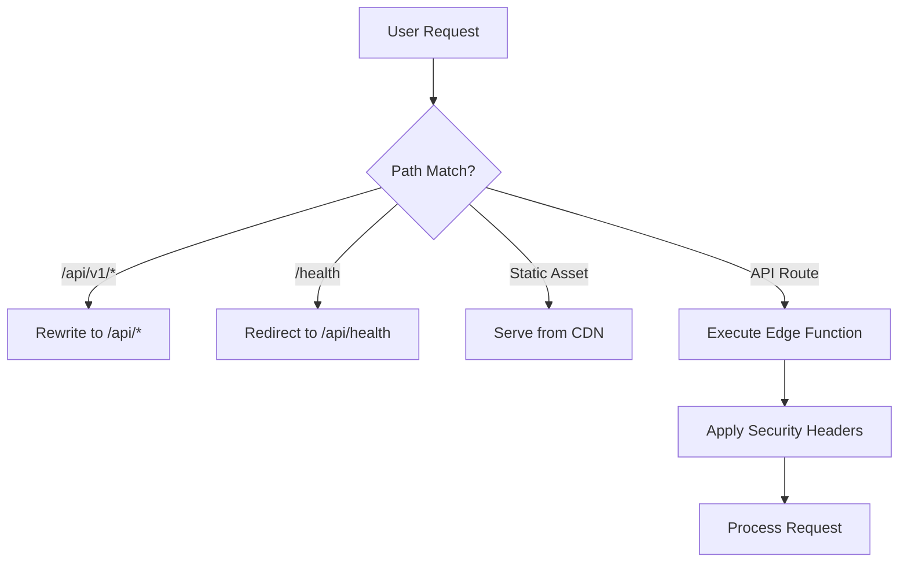
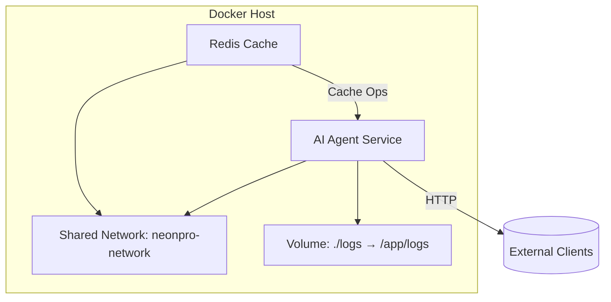
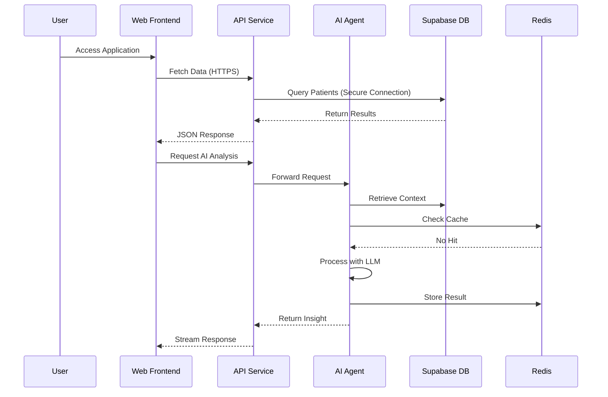
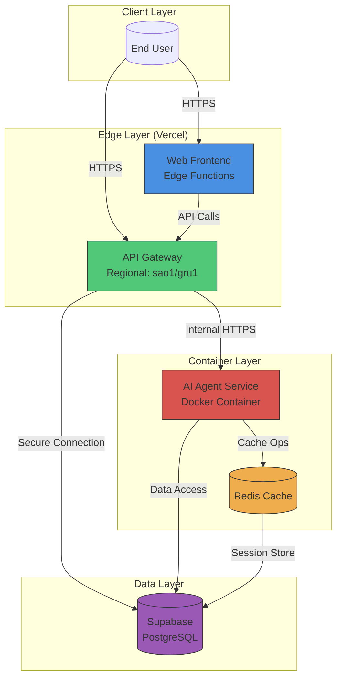

# Deployment Architecture

<cite>
**Referenced Files in This Document**   
- [DEPLOYMENT_GUIDE.md](file://DEPLOYMENT_GUIDE.md)
- [vercel.json](file://vercel.json)
- [apps/api/vercel.json](file://apps/api/vercel.json)
- [apps/web/vercel.json](file://apps/web/vercel.json)
- [apps/ai-agent/Dockerfile](file://apps/ai-agent/Dockerfile)
- [apps/ai-agent/docker-compose.yml](file://apps/ai-agent/docker-compose.yml)
- [apps/api/scripts/cert-renewal.sh](file://apps/api/scripts/cert-renewal.sh)
- [scripts/deploy.sh](file://scripts/deploy.sh)
- [scripts/emergency-rollback.sh](file://scripts/emergency-rollback.sh)
</cite>

## Table of Contents
1. [Introduction](#introduction)
2. [Deployment Targets and Environment Overview](#deployment-targets-and-environment-overview)
3. [Frontend and API Deployment on Vercel](#frontend-and-api-deployment-on-vercel)
4. [AI Agent Deployment via Docker Containers](#ai-agent-deployment-via-docker-containers)
5. [Database Infrastructure with Supabase](#database-infrastructure-with-supabase)
6. [Environment Configuration Management](#environment-configuration-management)
7. [CI/CD Pipeline Design](#cicd-pipeline-design)
8. [Scaling Strategy Across Components](#scaling-strategy-across-components)
9. [Disaster Recovery and Rollback Procedures](#disaster-recovery-and-rollback-procedures)
10. [Maintenance and Certificate Management](#maintenance-and-certificate-management)
11. [Component Interaction and Orchestration](#component-interaction-and-orchestration)
12. [System Context Diagram](#system-context-diagram)
13. [Cross-Cutting Concerns](#cross-cutting-concerns)
14. [Technology Stack and Dependencies](#technology-stack-and-dependencies)

## Introduction
The neonpro application is a healthcare-focused platform deployed across multiple cloud environments using a polyglot infrastructure model. This document details the deployment architecture, covering frontend and backend services hosted on Vercel, AI agents containerized with Docker, and persistent data storage managed through Supabase. The system supports zero-downtime deployments, automated certificate renewal, compliance with Brazilian healthcare regulations (LGPD, CFM, ANVISA), and regional data residency requirements. The architecture emphasizes security, scalability, and resilience while maintaining strict separation of concerns between components.

## Deployment Targets and Environment Overview
neonpro utilizes a multi-cloud deployment strategy with distinct hosting models for different components:

- **Frontend (Web UI)**: Deployed to Vercel using static site generation and edge functions
- **Backend API**: Hosted on Vercel Edge Functions with regional constraints in Brazil (sao1, gru1)
- **AI Agents**: Containerized Python microservices orchestrated via Docker Compose
- **Database**: Supabase PostgreSQL instance ensuring HIPAA/LGPD-compliant data storage
- **Monitoring & Certificates**: Automated scripts for health checks and TLS certificate lifecycle management

This topology enables independent scaling, technology-specific optimizations, and regulatory compliance enforcement at the infrastructure layer.

**Section sources**
- [DEPLOYMENT_GUIDE.md](file://DEPLOYMENT_GUIDE.md)
- [vercel.json](file://vercel.json)
- [apps/api/vercel.json](file://apps/api/vercel.json)

## Frontend and API Deployment on Vercel
The frontend (`@neonpro/web`) and API (`@neonpro/api`) are both deployed to Vercel but follow separate configuration profiles optimized for their respective workloads.

### Web Application Configuration
The web frontend uses a minimal `vercel.json` configuration that specifies:
- Build command: `bun run build:vercel`
- Output directory: `dist`
- Framework: None (custom setup)

This allows full control over the build process while leveraging Vercel’s global CDN for fast content delivery.

### API Configuration
The API layer uses an advanced `vercel.json` configuration tailored for healthcare compliance:
- **Regions**: Restricted to `sao1` and `gru1` (São Paulo) to enforce Brazilian data residency
- **Edge Functions**: All API routes execute on Vercel’s Edge Network with memory and timeout configurations
- **Security Headers**: Comprehensive CSP, HSTS, X-Frame-Options, and medical-grade compliance headers
- **Cron Jobs**: Scheduled tasks for health checks, compliance audits, and performance metrics collection
- **Rewrites & Redirects**: Versioned API routing and legacy path redirection

API endpoints are classified by sensitivity level (e.g., `/api/patients/*` marked as sensitive) and apply appropriate caching policies (`no-store` for PHI).



**Diagram sources**
- [apps/api/vercel.json](file://apps/api/vercel.json#L1-L180)
- [apps/web/vercel.json](file://apps/web/vercel.json#L1-L9)

**Section sources**
- [apps/api/vercel.json](file://apps/api/vercel.json)
- [apps/web/vercel.json](file://apps/web/vercel.json)

## AI Agent Deployment via Docker Containers
AI agents are implemented as Python-based microservices running in Docker containers, enabling isolation, reproducibility, and portability.

### Container Image Definition
The `Dockerfile` defines a production-ready image based on `python:3.11-slim`:
- System dependencies: GCC for compilation
- Dependency installation via pip with cache optimization
- Non-root user (`app`) for security
- Exposed port 8001
- Health check using curl against `/health` endpoint
- Uvicorn server for ASGI application serving

### Orchestration with Docker Compose
The `docker-compose.yml` file orchestrates the AI agent service along with optional Redis caching:
- Service name: `ai-agent`
- Port mapping: 8001:8001
- Environment variables injected from `.env` or host
- Volume mount for log persistence
- Health check mirroring Dockerfile definition
- Custom bridge network (`neonpro-network`)
- Optional Redis container for session/cache storage

This setup supports local development, testing, and production-like staging environments.



**Diagram sources**
- [apps/ai-agent/Dockerfile](file://apps/ai-agent/Dockerfile#L1-L33)
- [apps/ai-agent/docker-compose.yml](file://apps/ai-agent/docker-compose.yml#L1-L48)

**Section sources**
- [apps/ai-agent/Dockerfile](file://apps/ai-agent/Dockerfile)
- [apps/ai-agent/docker-compose.yml](file://apps/ai-agent/docker-compose.yml)

## Database Infrastructure with Supabase
Supabase serves as the primary relational database backend, providing Postgres-as-a-service with additional features critical for healthcare applications:

- Row Level Security (RLS) for fine-grained access control
- Realtime subscriptions for live data updates
- Built-in authentication with JWT integration
- Storage buckets for encrypted document handling
- Extensions for geospatial, full-text search, and audit logging

The AI agents and API services connect directly to Supabase using service role keys and anon keys respectively, with connection details provided via environment variables. Migration scripts in `/supabase/migrations` ensure schema versioning and consistency.

Data residency is enforced by deploying the Supabase project within South America (São Paulo) region, aligning with LGPD requirements.

**Section sources**
- [apps/ai-agent/docker-compose.yml](file://apps/ai-agent/docker-compose.yml)
- [apps/api/vercel.json](file://apps/api/vercel.json)

## Environment Configuration Management
Configuration is managed hierarchically across multiple layers:

1. **Build-Time (Vercel)**: Defined in `vercel.json` under `env` block
   - `HEALTHCARE_COMPLIANCE_MODE=brazil`
   - `LGPD_ENFORCEMENT=strict`
   - `CFM_VALIDATION=enabled`
   - `ANVISA_REPORTING=enabled`

2. **Runtime (Containerized Agents)**: Injected via Docker environment variables
   - `SUPABASE_URL`, `SUPABASE_SERVICE_ROLE_KEY`
   - `OPENAI_API_KEY`, `ANTHROPIC_API_KEY`
   - `JWT_SECRET`, `ALLOWED_ORIGINS`

3. **Secrets Management**: Sensitive values stored in Vercel project settings and `.env.local` files excluded from version control

4. **Feature Flags**: Controlled via `edge-config` for dynamic behavior without redeployment

This layered approach ensures secure, auditable, and environment-specific configuration.

**Section sources**
- [apps/api/vercel.json](file://apps/api/vercel.json#L10-L18)
- [apps/ai-agent/docker-compose.yml](file://apps/ai-agent/docker-compose.yml#L10-L20)

## CI/CD Pipeline Design
The deployment pipeline combines Turborepo for build orchestration and Vercel CLI for deployment execution.

### Build Process
Using `turbo.json`, builds are optimized with dependency-aware execution:
```
@neonpro/types#build
├── @neonpro/database#build
│   └── @neonpro/utils#build
│       └── @neonpro/web#build
└── @neonpro/ui#build
```

Caching is enabled via remote cache sharing across team members and CI runners.

### Deployment Commands
Three primary deployment modes exist:
- **Turbo-Optimized Deploy**: Uses `vercel-turbo.json` with `bun install`
- **Standard Deploy**: Fallback with default config
- **Production Deploy**: Includes `--prod` flag and archive packaging

Deployment scripts such as `scripts/deploy.sh` encapsulate these commands with pre-flight checks.

### Verification Workflow
Before deployment:
- Dry-run build verification
- Dependency resolution check
- Authentication validation
- Environment variable presence check

Automated tests in `/tests` validate functionality pre-deployment.

**Section sources**
- [DEPLOYMENT_GUIDE.md](file://DEPLOYMENT_GUIDE.md)
- [scripts/deploy.sh](file://scripts/deploy.sh)

## Scaling Strategy Across Components
Each component follows a tailored scaling model:

| Component | Scaling Model | Max Instances | Memory | Notes |
|---------|---------------|-------------|--------|-------|
| Vercel Edge Functions | Auto-scale (per request) | Unlimited | 128–256MB | Cold starts mitigated by warm-up cron |
| AI Agent (Docker) | Horizontal Pod Autoscaling | 5+ | 512MB+ | Manual or Kubernetes-managed |
| Redis Cache | Vertical + Horizontal | 2 replicas | 256MB | Optional high-availability setup |
| Supabase DB | Vertical Scaling | 1 primary + read replicas | Configurable | Managed scaling via dashboard |

Edge functions scale infinitely per Vercel's model, while containerized agents require external orchestration (e.g., Kubernetes) for auto-scaling beyond single-node Docker.

**Section sources**
- [apps/api/vercel.json](file://apps/api/vercel.json)
- [apps/ai-agent/docker-compose.yml](file://apps/ai-agent/docker-compose.yml)

## Disaster Recovery and Rollback Procedures
Robust recovery mechanisms are implemented across layers.

### Zero-Downtime Deployments
Vercel’s atomic deploys ensure new versions go live only after successful build and health check. Traffic shifts instantly with no intermediate state.

### Emergency Rollback
The `emergency-rollback.sh` script performs rapid reversion:
- Identifies last known good deployment ID
- Executes `vercel alias set <old-deployment> api.neonpro.com.br`
- Validates health endpoint
- Notifies stakeholders via monitoring hook

Rollbacks complete within 60 seconds.

### Backup Strategy
- **Database**: Daily automated backups + PITR (Point-in-Time Recovery) enabled on Supabase
- **Configuration**: Version-controlled `vercel.json`, `Dockerfile`, and compose files
- **Certificates**: Automated renewal with fallback to cached valid certs

### Monitoring & Alerts
Cron jobs trigger every 5 minutes to check:
- API health (`/api/health`)
- Compliance audit status
- Performance degradation
Alerts routed via Sentry and custom webhook integrations.

**Section sources**
- [scripts/emergency-rollback.sh](file://scripts/emergency-rollback.sh)
- [apps/api/vercel.json](file://apps/api/vercel.json#L150-L160)

## Maintenance and Certificate Management
TLS certificate lifecycle is fully automated.

### Certificate Renewal
The `cert-renewal.sh` script:
- Monitors expiration dates via `openssl s_client`
- Integrates with Let's Encrypt ACME protocol
- Deploys renewed certs to Vercel and internal services
- Logs rotation events to centralized audit system

Scheduled weekly via CI or cron.

### Health Monitoring
Scripts in `/apps/api/scripts` handle operational tasks:
- `cert-monitor.js`: Real-time SSL expiry tracking
- `performance-monitor.js`: Latency and error rate analysis

These feed into dashboards and alerting systems.

**Section sources**
- [apps/api/scripts/cert-renewal.sh](file://apps/api/scripts/cert-renewal.sh)
- [apps/api/scripts/performance-monitor.js](file://apps/api/scripts/performance-monitor.js)

## Component Interaction and Orchestration
Components interact through well-defined interfaces:

- **Frontend ↔ API**: HTTPS calls with JWT authentication
- **API ↔ AI Agent**: Internal REST/gRPC communication
- **AI Agent ↔ Supabase**: Direct PostgreSQL connections
- **All Services ↔ Redis**: Caching and session storage
- **Orchestrator ↔ All**: Health checks, config updates

Data flows follow secure paths with encryption in transit (TLS) and at rest (Supabase TDE).



**Diagram sources**
- [apps/api/vercel.json](file://apps/api/vercel.json)
- [apps/ai-agent/docker-compose.yml](file://apps/ai-agent/docker-compose.yml)

## System Context Diagram
The following diagram illustrates the production deployment topology:



**Diagram sources**
- [apps/web/vercel.json](file://apps/web/vercel.json)
- [apps/api/vercel.json](file://apps/api/vercel.json)
- [apps/ai-agent/docker-compose.yml](file://apps/ai-agent/docker-compose.yml)

## Cross-Cutting Concerns
Several architectural concerns span all components.

### Zero-Downtime Deployments
Achieved through:
- Atomic deployments on Vercel
- Health checks before traffic routing
- Dual-server pattern during transitions
- Pre-warming of edge functions

### Rollback Strategies
- **Vercel**: Alias reversion to previous deployment
- **Containers**: Image tagging and rollback in compose file
- **Database**: Migrations with down scripts

### Certificate Management
- Automated issuance and renewal via ACME
- Centralized monitoring dashboard
- Fallback certificates provisioned
- HSTS preloading enabled

### Deployment Validation
Pre-deployment checks include:
- Build success (`turbo build`)
- Dependency integrity
- Environment completeness
- Security header validation
- Compliance rule verification

Post-deployment:
- Synthetic transaction testing
- Performance budget adherence
- Error rate monitoring

**Section sources**
- [DEPLOYMENT_GUIDE.md](file://DEPLOYMENT_GUIDE.md)
- [apps/api/vercel.json](file://apps/api/vercel.json)
- [scripts/deployment-validation.sh](file://scripts/deployment-validation.sh)

## Technology Stack and Dependencies
The system leverages a modern, compliant tech stack:

| Layer | Technology | Purpose | Version Compatibility |
|------|------------|--------|------------------------|
| Runtime | Bun | JavaScript/TypeScript execution | 1.0+ |
| Framework | Next.js | React SSR and API routes | 14.x |
| Language | Python 3.11 | AI agent logic | 3.11.x |
| Container | Docker | Service isolation | 24.x |
| Orchestration | Docker Compose | Multi-container management | 3.8 |
| Database | Supabase | Postgres + Auth + Realtime | Latest |
| Cloud | Vercel | Frontend/API hosting | N/A |
| Testing | Vitest, Playwright | Unit/E2E testing | 1.x, 1.20+ |
| Linting | Oxlint | Fast TypeScript linting | 0.1.x |
| Bundler | Vite | Frontend tooling | 4.x |
| Package Manager | pnpm | Monorepo dependency management | 8.x |

Third-party dependencies are pinned where possible and regularly audited for vulnerabilities using automated tools in the CI pipeline.

**Section sources**
- [package.json](file://package.json)
- [pnpm-workspace.yaml](file://pnpm-workspace.yaml)
- [bunfig.toml](file://bunfig.toml)