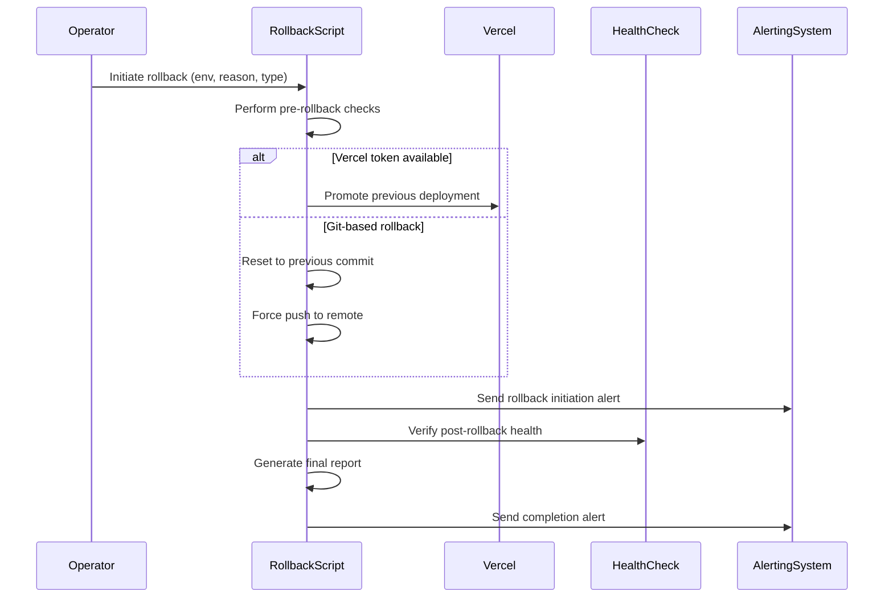
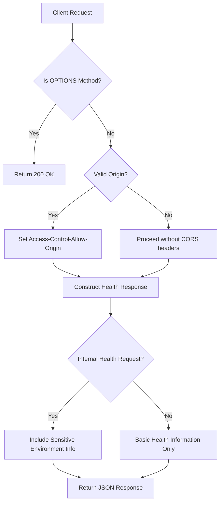
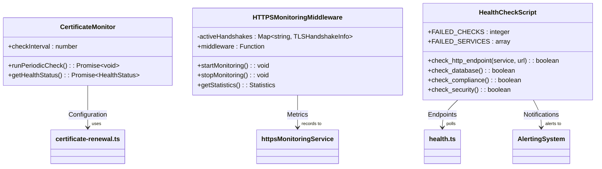
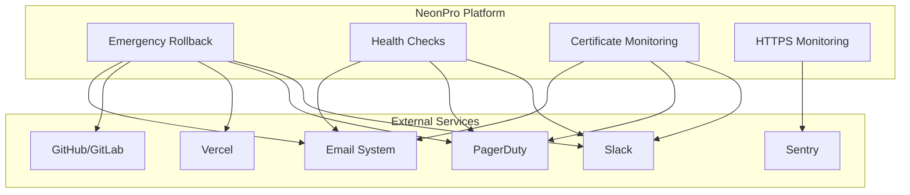

# Disaster Recovery

<cite>
**Referenced Files in This Document **   
- [emergency-rollback.sh](file://scripts/emergency-rollback.sh)
- [cert-monitor.js](file://apps/api/scripts/cert-monitor.js)
- [health.ts](file://apps/api/vercel/health.ts)
- [certificate-renewal.ts](file://apps/api/src/config/certificate-renewal.ts)
- [https-monitoring-middleware.ts](file://apps/api/src/middleware/https-monitoring-middleware.ts)
- [health-check.sh](file://tools/monitoring/scripts/health-check.sh)
- [monitoring-config.ts](file://config/vercel/monitoring-config.ts)
</cite>

## Table of Contents
1. [Introduction](#introduction)
2. [Emergency Rollback Mechanism](#emergency-rollback-mechanism)
3. [Health Check Endpoints](#health-check-endpoints)
4. [Monitoring Systems](#monitoring-systems)
5. [Incident Response Domain Model](#incident-response-domain-model)
6. [Common Issues and Solutions](#common-issues-and-solutions)
7. [Integration with External Services](#integration-with-external-services)
8. [Post-Mortem Analysis Procedures](#post-mortem-analysis-procedures)
9. [Conclusion](#conclusion)

## Introduction
The NeonPro healthcare platform implements a comprehensive disaster recovery system designed to ensure high availability, rapid incident response, and regulatory compliance with healthcare standards such as LGPD, ANVISA, and CFM. This document details the implementation of emergency rollback mechanisms, health check endpoints, and monitoring systems that enable rapid recovery from failures. The system is designed to balance automated recovery workflows with manual intervention procedures, ensuring both speed and safety in critical situations.

The disaster recovery framework consists of three core components: emergency rollback capabilities for immediate remediation of deployment issues, comprehensive health check endpoints for system status verification, and robust monitoring systems for proactive issue detection. These components work together to minimize downtime, maintain data integrity, and ensure continuous availability of critical healthcare services.

**Section sources**
- [emergency-rollback.sh](file://scripts/emergency-rollback.sh#L1-L482)
- [health-check.sh](file://tools/monitoring/scripts/health-check.sh#L1-L313)

## Emergency Rollback Mechanism

The emergency rollback mechanism in NeonPro provides a reliable way to revert to a previous stable state when critical issues are detected in production. Implemented as a Bash script (`emergency-rollback.sh`), this system supports multiple rollback types including full, partial, and configuration-only rollbacks, allowing operators to choose the appropriate level of intervention based on the severity and scope of the issue.

The rollback process follows a structured workflow: pre-rollback checks verify the availability of necessary tools and rollback points, the rollback execution phase performs the actual reversion using either Vercel deployment promotion or Git history manipulation, and post-rollback verification confirms the restored functionality through health endpoint checks. The script integrates with alerting systems like Slack and PagerDuty to notify relevant teams throughout the process.

Rollback operations are logged comprehensively, with detailed reports generated that include timestamps, operator information, rollback type, and verification results. The system also calculates downtime duration and assesses whether health has been fully restored, providing valuable metrics for post-incident analysis.

**Diagram sources **
- [emergency-rollback.sh](file://scripts/emergency-rollback.sh#L1-L482)

**Section sources**
- [emergency-rollback.sh](file://scripts/emergency-rollback.sh#L1-L482)

## Health Check Endpoints

NeonPro implements multiple health check endpoints to monitor system status at different levels of granularity. The primary health endpoint (`health.ts`) serves as a lightweight indicator of application availability, returning basic status information along with environment-specific details when accessed from authorized origins.

The health check system includes safeguards to prevent information disclosure, with sensitive environment variable presence only revealed in development environments or when explicitly requested through internal health checks. This approach balances operational visibility with security requirements, ensuring that critical deployment information is available to authorized personnel while protecting against potential reconnaissance by malicious actors.

Health endpoints are designed to be resilient and fast, with minimal dependencies to avoid cascading failures. They return within milliseconds even under heavy load conditions, making them suitable for frequent polling by external monitoring systems. The endpoints also support CORS configuration to allow secure access from designated frontend applications while preventing unauthorized cross-origin requests.

**Diagram sources **
- [health.ts](file://apps/api/vercel/health.ts#L1-L48)

**Section sources**
- [health.ts](file://apps/api/vercel/health.ts#L1-L48)
- [health-check.sh](file://tools/monitoring/scripts/health-check.sh#L1-L313)

## Monitoring Systems

The monitoring infrastructure in NeonPro comprises several interconnected components that provide comprehensive visibility into system health, performance, and security. Certificate monitoring, implemented in `cert-monitor.js`, runs periodic checks on SSL/TLS certificates to prevent expiration-related outages. This system can operate in both daemon mode for continuous monitoring and one-time execution mode for cron-based scheduling.

Certificate renewal is managed through the `certificate-renewal.ts` module, which supports both automated Let's Encrypt renewals and manual renewal processes. The system monitors certificate expiry dates and triggers renewal when certificates approach their expiration threshold, configurable via environment variables. Health status is exposed through standardized interfaces that integrate with broader monitoring dashboards.

HTTPS handshake monitoring, implemented in `https-monitoring-middleware.ts`, tracks TLS handshake performance to ensure compliance with healthcare regulations requiring ≤300ms connection times. The middleware captures detailed timing information for each handshake phase, including client hello, server hello, certificate exchange, key exchange, and finished messages, enabling fine-grained performance analysis.

**Diagram sources **
- [cert-monitor.js](file://apps/api/scripts/cert-monitor.js#L1-L121)
- [certificate-renewal.ts](file://apps/api/src/config/certificate-renewal.ts#L1-L297)
- [https-monitoring-middleware.ts](file://apps/api/src/middleware/https-monitoring-middleware.ts#L1-L456)
- [health-check.sh](file://tools/monitoring/scripts/health-check.sh#L1-L313)

**Section sources**
- [cert-monitor.js](file://apps/api/scripts/cert-monitor.js#L1-L121)
- [certificate-renewal.ts](file://apps/api/src/config/certificate-renewal.ts#L1-L297)
- [https-monitoring-middleware.ts](file://apps/api/src/middleware/https-monitoring-middleware.ts#L1-L456)
- [health-check.sh](file://tools/monitoring/scripts/health-check.sh#L1-L313)

## Incident Response Domain Model

The incident response framework in NeonPro defines a structured approach to handling system failures, with clear severity levels, escalation paths, and recovery time objectives (RTOs). Incidents are classified into three severity levels: critical (system outage or data breach), warning (degraded performance or non-critical failures), and informational (successful operations or routine events).

Escalation paths are defined in the monitoring configuration (`monitoring-config.ts`), with different alert channels activated based on severity. Critical incidents trigger notifications to email, Slack, and PagerDuty simultaneously, ensuring rapid response from on-call personnel. Warning-level incidents generate email notifications and optional Slack alerts, while informational events are logged but do not trigger external notifications.

Recovery time objectives are aligned with healthcare service level agreements, with critical incidents requiring resolution within 15 minutes, warning-level issues within 1 hour, and informational items addressed during regular business hours. The system automatically tracks incident duration and compares it against these objectives, generating compliance reports for audit purposes.

The domain model also includes detailed compliance monitoring for healthcare regulations, with specific tracking for LGPD data protection, ANVISA medical device requirements, and CFM professional standards. This ensures that incident response activities themselves comply with relevant regulations, maintaining the integrity of audit trails and patient data protection.

**Section sources**
- [monitoring-config.ts](file://config/vercel/monitoring-config.ts#L1-L485)

## Common Issues and Solutions

Several common issues have been identified and addressed in the NeonPro disaster recovery system. Failed rollbacks, often caused by missing dependencies or authentication issues, are mitigated through comprehensive pre-rollback checks that verify the availability of required tools and credentials before proceeding. The system includes fallback mechanisms, such as using Git-based rollback when Vercel CLI is unavailable.

False positive alerts, which can lead to unnecessary incident responses, are reduced through intelligent alerting rules that require sustained conditions over time rather than reacting to transient spikes. For example, the alerting system requires high error rates to persist for 5 minutes before triggering critical alerts, filtering out brief anomalies that resolve themselves.

Certificate expiration, a common cause of service outages, is prevented through proactive monitoring and automated renewal processes. The certificate monitoring system checks expiry dates regularly and initiates renewal when certificates approach their configured threshold (default 30 days). Multiple notification channels ensure that administrators are alerted well in advance of expiration, with escalating urgency as the deadline approaches.

Performance degradation is addressed through synthetic monitoring of critical user flows, including patient registration, appointment booking, and medical record access. These automated tests run every 5-10 minutes from multiple geographic locations, providing early warning of performance issues before they affect real users.

**Section sources**
- [emergency-rollback.sh](file://scripts/emergency-rollback.sh#L1-L482)
- [cert-monitor.js](file://apps/api/scripts/cert-monitor.js#L1-L121)
- [certificate-renewal.ts](file://apps/api/src/config/certificate-renewal.ts#L1-L297)
- [monitoring-config.ts](file://config/vercel/monitoring-config.ts#L1-L485)

## Integration with External Services

The disaster recovery system integrates with various external services to enhance its effectiveness and reach. Alerting channels, configured in `monitoring-config.ts`, include email, Slack, and PagerDuty, ensuring that critical incidents are communicated to the appropriate personnel through multiple redundant channels.

Deployment platforms are integrated through the emergency rollback script, which supports both Vercel deployment promotion and direct Git repository manipulation. This dual approach provides flexibility in rollback methods, allowing the system to adapt to different deployment scenarios and infrastructure configurations.

External monitoring services are incorporated through synthetic monitoring of critical healthcare workflows, simulating real user interactions from multiple geographic locations. These tests validate not just API availability but complete user journeys, ensuring that all components of the system work together as expected.

The system also integrates with logging and observability platforms like Sentry, providing centralized error tracking, performance monitoring, and real user monitoring. These integrations enable comprehensive post-incident analysis and long-term system improvement based on actual usage patterns and failure modes.

**Diagram sources **
- [emergency-rollback.sh](file://scripts/emergency-rollback.sh#L1-L482)
- [monitoring-config.ts](file://config/vercel/monitoring-config.ts#L1-L485)

**Section sources**
- [emergency-rollback.sh](file://scripts/emergency-rollback.sh#L1-L482)
- [monitoring-config.ts](file://config/vercel/monitoring-config.ts#L1-L485)

## Post-Mortem Analysis Procedures

Post-mortem analysis in NeonPro follows a structured process designed to extract maximum learning from incidents while maintaining focus on patient safety and service reliability. After each significant incident, a comprehensive report is generated that includes timeline reconstruction, root cause analysis, impact assessment, and action items for prevention.

The emergency rollback script automatically generates detailed rollback reports that serve as foundational documents for post-mortem analysis. These reports include precise timestamps, operator information, pre- and post-rollback verification results, and downtime calculations, providing an objective record of the incident response.

Analysis focuses on identifying systemic issues rather than individual blame, aligning with healthcare industry best practices for safety reporting. Action items are tracked to completion through the development workflow, ensuring that lessons learned translate into concrete improvements in system resilience.

Regular review of incident patterns helps identify areas for automation and process improvement. For example, repeated certificate-related issues led to the enhancement of automated renewal processes, while analysis of rollback failures resulted in more comprehensive pre-rollback validation checks.

**Section sources**
- [emergency-rollback.sh](file://scripts/emergency-rollback.sh#L1-L482)

## Conclusion

The disaster recovery system in NeonPro provides a robust framework for maintaining high availability and rapid incident response in a healthcare context. By combining automated recovery mechanisms with comprehensive monitoring and structured incident response procedures, the system ensures that critical medical services remain available even during unexpected failures.

The integration of emergency rollback capabilities, health check endpoints, and monitoring systems creates a defense-in-depth approach to system reliability. Automated processes handle routine issues efficiently, while providing clear escalation paths for complex problems requiring human intervention.

Future enhancements will focus on increasing automation while maintaining appropriate safeguards for healthcare data security and privacy. Machine learning techniques may be applied to predict potential failures before they occur, further reducing downtime and improving patient experience.

The documented procedures and code implementations provide a solid foundation for continuous improvement, ensuring that NeonPro remains at the forefront of reliable healthcare technology platforms.