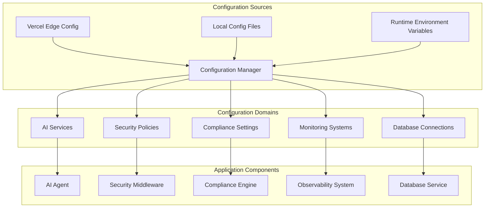
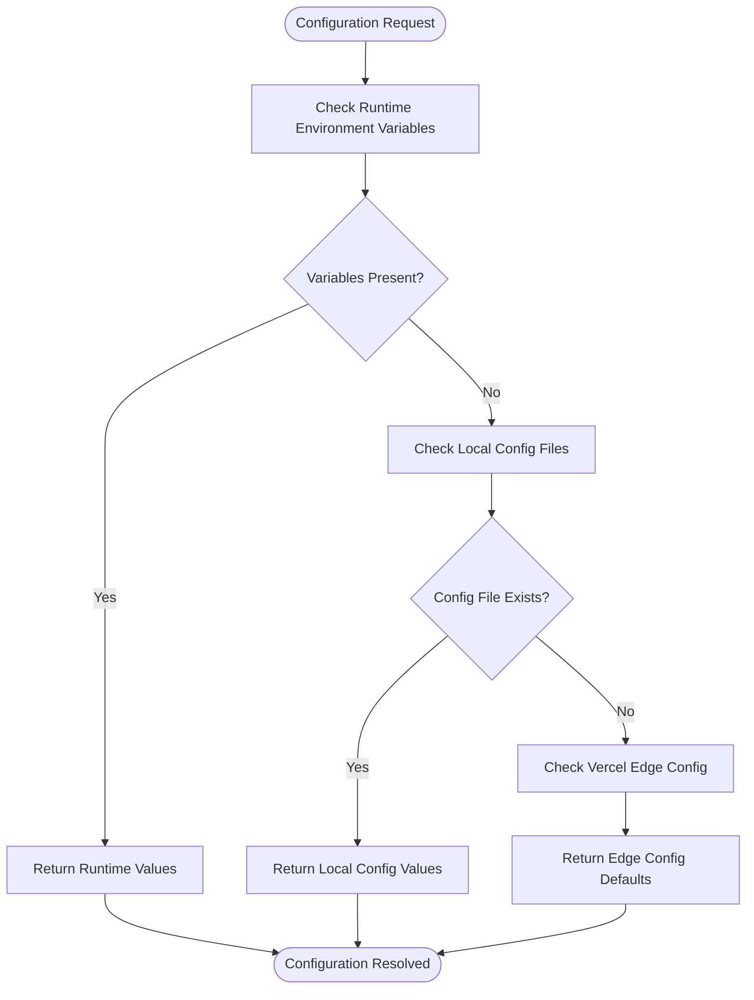
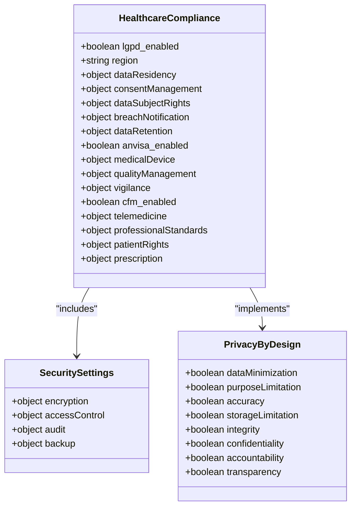
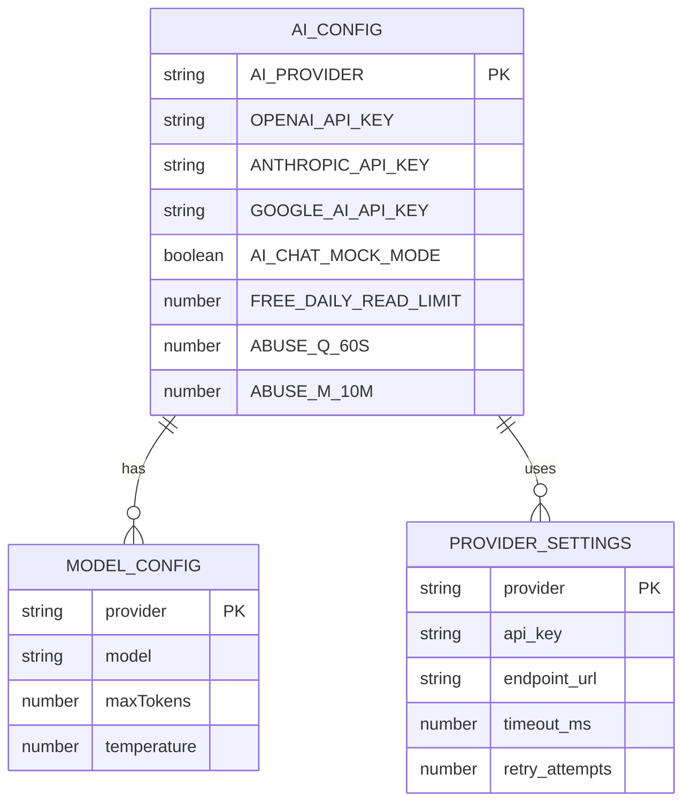
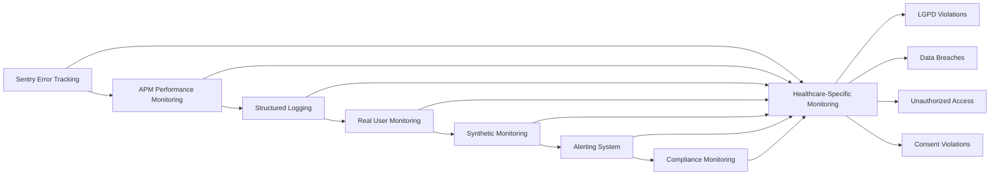
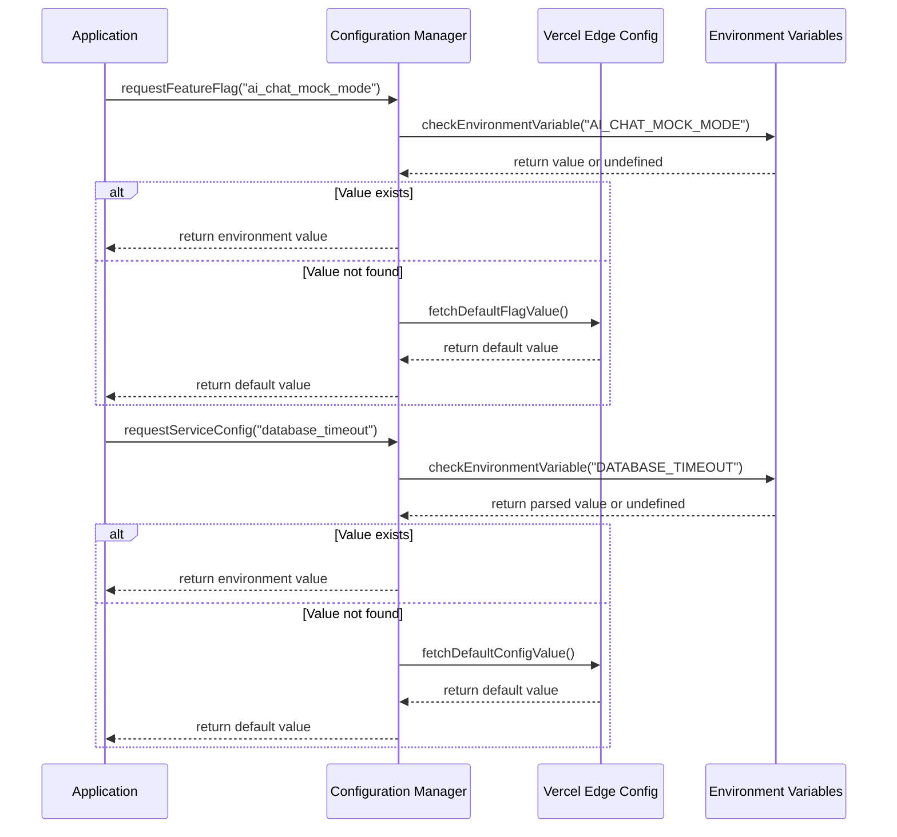
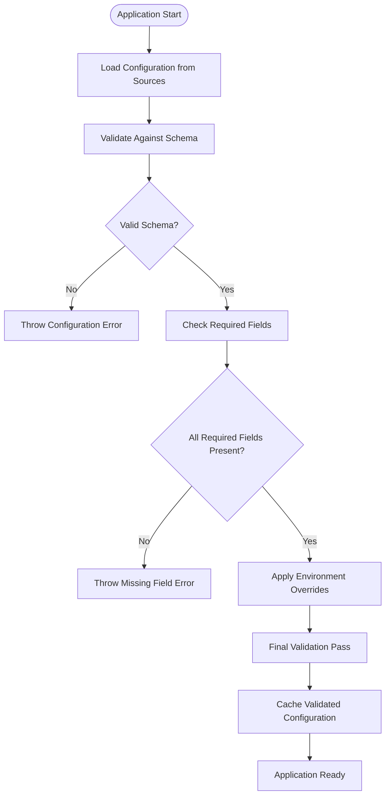
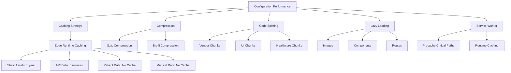
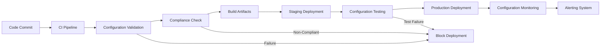

# Environment Configuration

<cite>
**Referenced Files in This Document **   
- [edge-config.ts](file://config/vercel/edge-config.ts)
- [healthcare-compliance-config.ts](file://config/vercel/healthcare-compliance-config.ts)
- [monitoring-config.ts](file://config/vercel/monitoring-config.ts)
- [performance-config.ts](file://config/vercel/performance-config.ts)
- [ai.ts](file://packages/config/src/ai.ts)
- [env.ts](file://packages/config/src/env.ts)
</cite>

## Table of Contents
1. [Introduction](#introduction)
2. [Configuration Architecture Overview](#configuration-architecture-overview)
3. [Hierarchical Configuration System](#hierarchical-configuration-system)
4. [Core Configuration Domains](#core-configuration-domains)
5. [AI Service Configuration](#ai-service-configuration)
6. [Security and Compliance Settings](#security-and-compliance-settings)
7. [Database and Monitoring Configuration](#database-and-monitoring-configuration)
8. [Feature Flags and Runtime Overrides](#feature-flags-and-runtime-overrides)
9. [Configuration Loading and Validation](#configuration-loading-and-validation)
10. [Performance Considerations](#performance-considerations)
11. [Common Issues and Solutions](#common-issues-and-solutions)
12. [Integration with Deployment Pipelines](#integration-with-deployment-pipelines)

## Introduction
The environment configuration system in the neonpro application provides a comprehensive framework for managing deployment-specific settings across development, staging, and production environments. This system ensures compliance with healthcare regulations while enabling flexible feature management and service configuration. The architecture combines Vercel Edge Config, local configuration files, and runtime environment variables to create a robust, hierarchical configuration model that supports the application's complex requirements.

## Configuration Architecture Overview
The neonpro configuration system implements a multi-layered approach that prioritizes security, compliance, and performance. The architecture is designed to handle the specific requirements of healthcare applications operating under Brazilian regulations such as LGPD, ANVISA, and CFM. The system integrates seamlessly with Vercel's Edge Runtime to provide low-latency configuration access while maintaining strict data protection standards.



**Diagram sources **
- [edge-config.ts](file://config/vercel/edge-config.ts#L1-L100)
- [healthcare-compliance-config.ts](file://config/vercel/healthcare-compliance-config.ts#L1-L254)

## Hierarchical Configuration System
The configuration system employs a hierarchical model that resolves settings from multiple sources with defined precedence. This approach enables environment-specific overrides while maintaining consistent defaults across deployments. The hierarchy follows the pattern: runtime environment variables (highest priority) → local config files → Vercel Edge Config (default values).

### Configuration Resolution Flow


**Diagram sources **
- [env.ts](file://packages/config/src/env.ts#L1-L23)
- [ai.ts](file://packages/config/src/ai.ts#L1-L32)

**Section sources**
- [env.ts](file://packages/config/src/env.ts#L1-L23)
- [ai.ts](file://packages/config/src/ai.ts#L1-L32)

## Core Configuration Domains
The configuration system manages several critical domains that define the application's behavior and compliance posture. Each domain contains specific settings tailored to its functional area, with particular emphasis on healthcare regulatory requirements.

### Healthcare Compliance Configuration
The healthcare compliance configuration enforces adherence to Brazilian regulations including LGPD (data protection), ANVISA (medical device standards), and CFM (medical professional guidelines). These settings ensure that all patient data handling meets legal requirements.



**Diagram sources **
- [healthcare-compliance-config.ts](file://config/vercel/healthcare-compliance-config.ts#L1-L254)

**Section sources**
- [healthcare-compliance-config.ts](file://config/vercel/healthcare-compliance-config.ts#L1-L254)

## AI Service Configuration
The AI service configuration manages settings for artificial intelligence components, including provider selection, model parameters, and usage limits. This configuration enables seamless switching between different AI providers while maintaining consistent interface contracts.

### AI Configuration Structure


**Diagram sources **
- [ai.ts](file://packages/config/src/ai.ts#L1-L32)

**Section sources**
- [ai.ts](file://packages/config/src/ai.ts#L1-L32)

## Security and Compliance Settings
Security and compliance settings form a critical component of the configuration system, ensuring that the application maintains appropriate protection levels for sensitive healthcare data. These settings are enforced at multiple levels, from infrastructure to application logic.

### Security Configuration Hierarchy
```mermaid
tree
root("Security Configuration")
root --- encryption("Encryption")
encryption --- atRest("At Rest")
atRest --- algorithm("AES-256")
atRest --- keyManagement("HSM")
atRest --- rotation("90d")
encryption --- inTransit("In Transit")
inTransit --- tlsVersion("1.3")
inTransit --- certificateValidation("true")
inTransit --- hsts("true")
encryption --- endToEnd("End-to-End")
endToEnd --- algorithm("AES-256-GCM")
endToEnd --- keyExchange("ECDH")
root --- accessControl("Access Control")
accessControl --- roleBased("Role-Based Access")
accessControl --- leastPrivilege("Principle of Least Privilege")
accessControl --- mfa("Multi-Factor Authentication")
accessControl --- sessionManagement("Session Management")
accessControl --- passwordPolicy("Password Policy")
root --- audit("Audit")
audit --- enabled("Enabled")
audit --- comprehensive("Comprehensive")
audit --- immutable("Immutable")
audit --- retention("10y")
audit --- realTime("Real-Time Monitoring")
audit --- alerting("Alerting")
```

**Diagram sources **
- [healthcare-compliance-config.ts](file://config/vercel/healthcare-compliance-config.ts#L1-L254)
- [edge-config.ts](file://config/vercel/edge-config.ts#L1-L100)

## Database and Monitoring Configuration
The database and monitoring configuration domains provide essential settings for data persistence and system observability. These configurations ensure reliable database connections and comprehensive monitoring coverage across all deployment environments.

### Monitoring Configuration Components


**Diagram sources **
- [monitoring-config.ts](file://config/vercel/monitoring-config.ts#L1-L485)

**Section sources**
- [monitoring-config.ts](file://config/vercel/monitoring-config.ts#L1-L485)

## Feature Flags and Runtime Overrides
Feature flags and runtime overrides enable dynamic configuration of application behavior without requiring code changes or redeployment. This capability supports gradual feature rollouts, A/B testing, and emergency toggling of functionality.

### Feature Flag Implementation


**Diagram sources **
- [env.ts](file://packages/config/src/env.ts#L1-L23)
- [edge-config.ts](file://config/vercel/edge-config.ts#L1-L100)

**Section sources**
- [env.ts](file://packages/config/src/env.ts#L1-L23)

## Configuration Loading and Validation
The configuration loading process includes comprehensive validation to ensure that all required settings are present and correctly formatted before the application starts. This prevents runtime failures due to missing or invalid configuration.

### Configuration Validation Workflow


**Section sources**
- [env.ts](file://packages/config/src/env.ts#L1-L23)
- [ai.ts](file://packages/config/src/ai.ts#L1-L32)

## Performance Considerations
The configuration system incorporates several performance optimizations to minimize startup time and runtime overhead while maintaining reliability and consistency across distributed deployments.

### Performance Optimization Strategies


**Diagram sources **
- [performance-config.ts](file://config/vercel/performance-config.ts#L1-L247)
- [edge-config.ts](file://config/vercel/edge-config.ts#L1-L100)

**Section sources**
- [performance-config.ts](file://config/vercel/performance-config.ts#L1-L247)

## Common Issues and Solutions
This section addresses common configuration-related issues encountered in the neonpro application and provides solutions for each scenario.

### Configuration Drift Prevention
Configuration drift occurs when different environments have inconsistent settings, leading to unpredictable behavior. The following strategies prevent configuration drift:

1. **Centralized Configuration Management**: Use Vercel Edge Config as the source of truth for default values
2. **Automated Validation**: Implement pre-deployment checks that validate configuration against schema
3. **Version Control**: Store configuration templates in version control alongside application code
4. **Environment Parity**: Maintain similar configuration structures across development, staging, and production

### Missing Environment Variables
When required environment variables are missing, the application should fail fast with descriptive error messages. The configuration system handles this by:

1. Defining clear defaults in Edge Config
2. Validating required variables during startup
3. Providing comprehensive error messages that include documentation links
4. Implementing graceful degradation where appropriate

### Incorrect Feature Flag States
To prevent incorrect feature flag states from causing issues:

1. Implement flag state validation before application startup
2. Use typed configuration objects to prevent invalid values
3. Provide audit trails for flag changes
4. Implement automated tests that verify flag behavior

**Section sources**
- [env.ts](file://packages/config/src/env.ts#L1-L23)
- [ai.ts](file://packages/config/src/ai.ts#L1-L32)

## Integration with Deployment Pipelines
The configuration system integrates tightly with deployment pipelines to ensure consistent and reliable configuration across all environments. This integration includes automated validation, rollback capabilities, and compliance checking.

### Deployment Pipeline Integration


**Section sources**
- [edge-config.ts](file://config/vercel/edge-config.ts#L1-L100)
- [healthcare-compliance-config.ts](file://config/vercel/healthcare-compliance-config.ts#L1-L254)