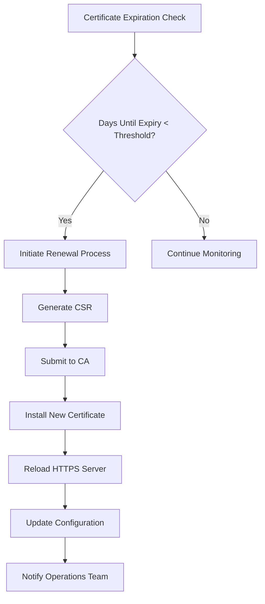
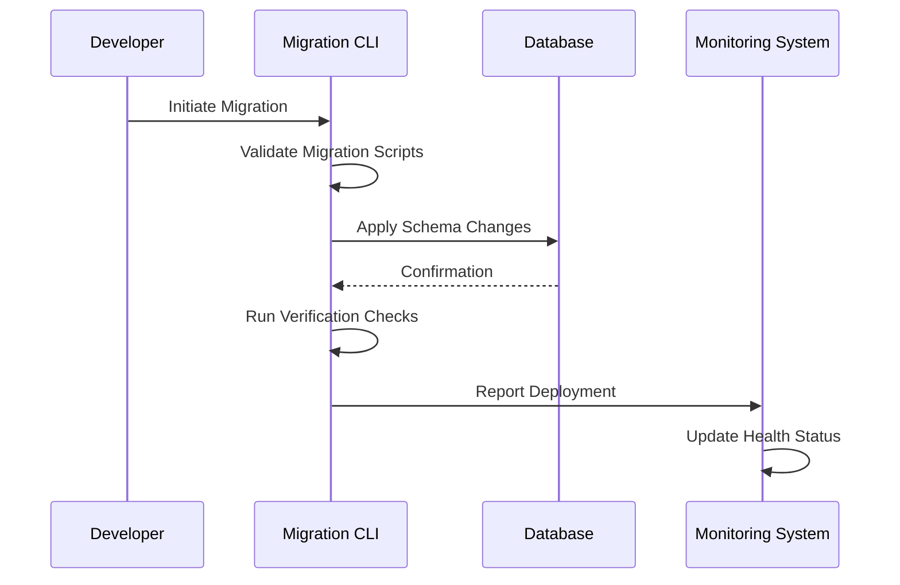
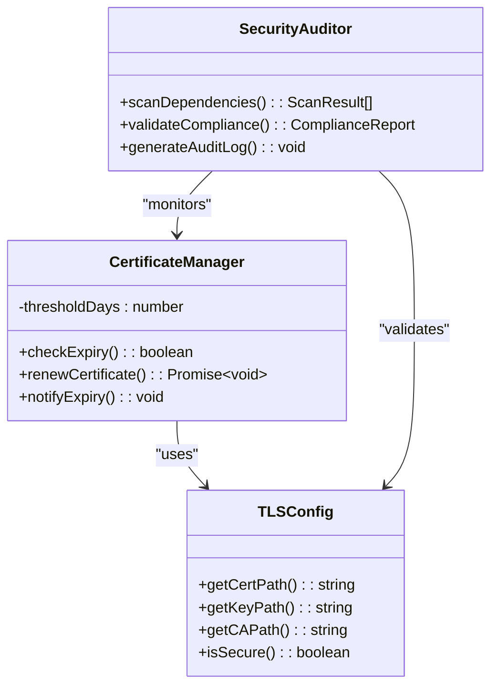
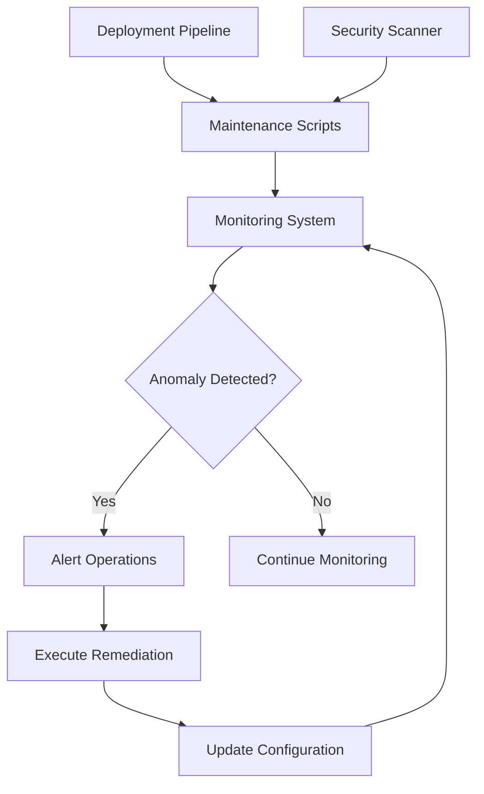

# Maintenance Procedures

<cite>
**Referenced Files in This Document**   
- [cert-renewal.sh](file://apps/api/scripts/cert-renewal.sh)
- [cert-monitor.js](file://apps/api/scripts/cert-monitor.js)
- [performance-monitor.js](file://apps/api/scripts/performance-monitor.js)
- [tls_config.py](file://apps/api/agents/ag-ui-rag-agent/tls_config.py)
- [setup-tls.sh](file://apps/api/agents/ag-ui-rag-agent/setup-tls.sh)
- [certificate-renewal.ts](file://apps/api/src/config/certificate-renewal.ts)
- [tls-config.ts](file://apps/api/src/config/tls-config.ts)
- [https-config.ts](file://apps/api/src/config/https-config.ts)
- [deploy.sh](file://packages/database/migrations/deploy.sh)
- [verification-checklist.md](file://packages/database/migrations/verification-checklist.md)
- [README.md](file://packages/database/migrations/README.md)
- [setup-supabase-migrations.sh](file://scripts/setup-supabase-migrations.sh)
- [setup-package-scripts.sh](file://scripts/setup-package-scripts.sh)
- [dev-setup.sh](file://scripts/dev-setup.sh)
- [run_tests.sh](file://apps/ai-agent/run_tests.sh)
- [main.py](file://apps/ai-agent/main.py)
- [config.py](file://apps/ai-agent/config.py)
- [security-audit.ts](file://scripts/security-audit.ts)
- [audit-unified.sh](file://scripts/audit-unified.sh)
- [emergency-rollback.sh](file://scripts/emergency-rollback.sh)
</cite>

## Table of Contents
1. [Introduction](#introduction)
2. [Maintenance Objectives and System Stability](#maintenance-objectives-and-system-stability)
3. [Routine Maintenance Tasks](#routine-maintenance-tasks)
4. [Frontend Maintenance Workflows](#frontend-maintenance-workflows)
5. [API Maintenance Procedures](#api-maintenance-procedures)
6. [AI Agent Maintenance](#ai-agent-maintenance)
7. [Database Migration Management](#database-migration-management)
8. [Security Patching and Certificate Renewal](#security-patching-and-certificate-renewal)
9. [Integration with Monitoring and Deployment Systems](#integration-with-monitoring-and-deployment-systems)
10. [Common Maintenance Issues and Solutions](#common-maintenance-issues-and-solutions)
11. [Performance Considerations During Maintenance](#performance-considerations-during-maintenance)
12. [Best Practices for Documentation and Automation](#best-practices-for-documentation-and-automation)

## Introduction
The neonpro application is a comprehensive healthcare-focused system integrating frontend, API, AI agents, and database components to deliver secure, compliant, and high-performance services. Maintenance procedures are critical to ensuring the long-term stability, security, and performance of the deployed system. These procedures encompass dependency updates, security patching, certificate renewal, and database migration management. This document details the implementation of these maintenance tasks across all components, their integration with monitoring systems and deployment pipelines, and best practices for automation and knowledge transfer.

## Maintenance Objectives and System Stability
Maintenance procedures in neonpro are designed to proactively address technical debt, security vulnerabilities, and performance bottlenecks while minimizing downtime and service disruption. The primary objectives include:
- Ensuring compliance with healthcare regulations (LGPD, HIPAA) through regular audits and security updates
- Maintaining system availability through automated health checks and rollback mechanisms
- Preventing service degradation via performance monitoring and capacity planning
- Facilitating smooth upgrades through well-documented migration paths and verification checklists

These objectives are achieved through a combination of automated scripts, configuration files, and standardized workflows that span the entire technology stack.

**Section sources**
- [audit-unified.sh](file://scripts/audit-unified.sh#L1-L50)
- [deployment-health-check.sh](file://scripts/deployment-health-check.sh#L1-L30)
- [security-audit.ts](file://scripts/security-audit.ts#L1-L40)

## Routine Maintenance Tasks
Routine maintenance in neonpro includes dependency updates, log rotation, cache cleanup, and health monitoring. These tasks are orchestrated through shell scripts and Node.js utilities located in the `scripts/` directory. Dependency updates are managed via package managers with version pinning to prevent breaking changes. Automated linting and syntax correction scripts ensure code quality during updates.

The system employs a layered approach to maintenance:
- **Daily**: Log analysis, certificate expiration checks, performance metric collection
- **Weekly**: Security scans, dependency vulnerability assessments, backup validation
- **Monthly**: Full system audits, compliance verification, documentation reviews

Automation is implemented through cron jobs and CI/CD pipeline triggers, with results logged and alerts configured for anomalies.

**Section sources**
- [dev-setup.sh](file://scripts/dev-setup.sh#L1-L60)
- [fix-web-lint.sh](file://scripts/fix-web-lint.sh#L1-L25)
- [fix-unused-imports.sh](file://scripts/fix-unused-imports.sh#L1-L20)
- [performance-monitor.js](file://apps/api/scripts/performance-monitor.js#L1-L45)

## Frontend Maintenance Workflows
Frontend maintenance focuses on UI consistency, accessibility compliance, and performance optimization. The process begins with development hook setup using `install-hooks.sh`, which configures pre-commit validators and linters. Package scripts are initialized via `setup-package-scripts.sh`, establishing standardized commands for testing, building, and auditing.

Key maintenance activities include:
- JSX syntax validation and automatic correction using `fix-jsx-syntax.sh`
- Type annotation verification with `fix-type-annotations.sh`
- Unused import detection and removal via `fix-unused-imports.sh`
- Accessibility audit execution through `analyze-healthcare-bundle.js`

These workflows integrate with Vite and Vitest configurations to ensure maintainable, testable frontend code.

**Section sources**
- [setup-package-scripts.sh](file://scripts/setup-package-scripts.sh#L1-L35)
- [fix-jsx-syntax.sh](file://scripts/fix-jsx-syntax.sh#L1-L28)
- [analyze-healthcare-bundle.js](file://scripts/analyze-healthcare-bundle.js#L1-L40)
- [vite.config.ts](file://vite.config.ts#L1-L100)

## API Maintenance Procedures
API maintenance ensures endpoint reliability, security, and performance. The API layer uses middleware components for rate limiting, authentication, error handling, and security headers enforcement. Maintenance tasks include regular validation of OpenAPI contracts, security header compliance, and performance benchmarking.

Critical scripts include:
- `cert-monitor.js`: Continuously checks SSL/TLS certificate expiration dates
- `cert-renewal.sh`: Automates certificate renewal process when thresholds are met
- Middleware health checks: Validate JWT tokens, session cookies, and RLS policies

Configuration files in `apps/api/src/config/` define thresholds and behaviors for certificate renewal, error tracking, and HTTPS enforcement.

**Diagram sources**
- [cert-monitor.js](file://apps/api/scripts/cert-monitor.js#L1-L60)
- [cert-renewal.sh](file://apps/api/scripts/cert-renewal.sh#L1-L80)
- [certificate-renewal.ts](file://apps/api/src/config/certificate-renewal.ts#L1-L35)

**Section sources**
- [cert-monitor.js](file://apps/api/scripts/cert-monitor.js#L1-L60)
- [security-middleware.ts](file://apps/api/src/middleware/security-middleware.ts#L1-L50)
- [error-tracking.ts](file://apps/api/src/config/error-tracking.ts#L1-L25)

## AI Agent Maintenance
AI agent maintenance involves ensuring model accuracy, response quality, and system integration. The Python-based agents in `apps/ai-agent/` use configuration files and validation scripts to maintain operational integrity. Key maintenance procedures include:

- Test suite execution via `run_tests.sh`, which validates agent functionality and integration points
- Syntax validation using `fix_syntax.py` to correct common coding errors
- Input/output validation through `validate_tests.py` to ensure data schema compliance
- Configuration management via `config.py` for environment-specific settings

Regular retraining cycles and performance monitoring ensure AI responses remain accurate and relevant. The main entry point `main.py` includes health check endpoints for monitoring agent status.

**Section sources**
- [run_tests.sh](file://apps/ai-agent/run_tests.sh#L1-L30)
- [main.py](file://apps/ai-agent/main.py#L1-L100)
- [config.py](file://apps/ai-agent/config.py#L1-L45)
- [validate_tests.py](file://apps/ai-agent/validate_tests.py#L1-L40)

## Database Migration Management
Database migrations are managed through a structured process using Supabase and custom deployment scripts. The `packages/database/migrations/` directory contains versioned migration files with accompanying documentation in `README.md` and `verification-checklist.md`.

Key components:
- `deploy.sh`: Orchestrates migration deployment with pre-flight checks and post-deployment verification
- `setup-supabase-migrations.sh`: Configures Supabase project and initializes migration environment
- Verification checklist: Ensures backward compatibility, data integrity, and rollback readiness

Migrations follow a three-phase approach:
1. **Preparation**: Schema diff generation and impact analysis
2. **Deployment**: Atomic migration execution with transaction safety
3. **Verification**: Data consistency checks and performance validation

**Diagram sources**
- [deploy.sh](file://packages/database/migrations/deploy.sh#L1-L70)
- [setup-supabase-migrations.sh](file://scripts/setup-supabase-migrations.sh#L1-L40)
- [verification-checklist.md](file://packages/database/migrations/verification-checklist.md#L1-L100)

**Section sources**
- [deploy.sh](file://packages/database/migrations/deploy.sh#L1-L70)
- [README.md](file://packages/database/migrations/README.md#L1-L50)
- [setup-supabase-migrations.sh](file://scripts/setup-supabase-migrations.sh#L1-L40)

## Security Patching and Certificate Renewal
Security maintenance is paramount in the healthcare domain. neonpro implements automated security patching and certificate management to protect sensitive patient data. The system uses both scheduled and event-driven approaches to security updates.

Certificate management workflow:
- Monitoring: `cert-monitor.js` checks expiration dates daily
- Renewal: `cert-renewal.sh` automates the renewal process 30 days before expiration
- Configuration: TLS settings defined in `tls-config.ts` and `https-config.ts`
- Agent-specific: `ag-ui-rag-agent` has dedicated `setup-tls.sh` and `tls_config.py`

Security patches are applied through:
- Regular dependency updates with `npm audit fix` and `pip check`
- Vulnerability scanning using `security-analysis.ts`
- Compliance validation via `healthcare-compliance-validation.sh`

**Diagram sources**
- [cert-renewal.sh](file://apps/api/scripts/cert-renewal.sh#L1-L80)
- [tls-config.ts](file://apps/api/src/config/tls-config.ts#L1-L50)
- [security-audit.ts](file://scripts/security-audit.ts#L1-L60)
- [setup-tls.sh](file://apps/api/agents/ag-ui-rag-agent/setup-tls.sh#L1-L35)

**Section sources**
- [cert-renewal.sh](file://apps/api/scripts/cert-renewal.sh#L1-L80)
- [tls_config.py](file://apps/api/agents/ag-ui-rag-agent/tls_config.py#L1-L30)
- [security-headers.ts](file://apps/api/src/middleware/security-headers.ts#L1-L40)

## Integration with Monitoring and Deployment Systems
Maintenance procedures are tightly integrated with monitoring and deployment systems to ensure seamless operations. The architecture connects maintenance tasks with observability tools, security scanners, and CI/CD pipelines.

Key integrations:
- **Monitoring**: Performance metrics collected by `performance-monitor.js` feed into dashboards
- **Alerting**: Certificate expiration and security issues trigger alerts via monitoring system
- **Deployment**: Maintenance scripts integrated into Vercel deployments through `deploy-vercel.sh`
- **Rollback**: Emergency rollback capability via `emergency-rollback.sh` for critical failures

The system uses a feedback loop where monitoring data informs maintenance priorities, and maintenance outcomes update monitoring baselines.

**Diagram sources**
- [performance-monitor.js](file://apps/api/scripts/performance-monitor.js#L1-L45)
- [emergency-rollback.sh](file://scripts/emergency-rollback.sh#L1-L35)
- [deploy-vercel.sh](file://scripts/deploy-vercel.sh#L1-L50)
- [monitoring-config.ts](file://config/vercel/monitoring-config.ts#L1-L30)

**Section sources**
- [performance-monitor.js](file://apps/api/scripts/performance-monitor.js#L1-L45)
- [emergency-rollback.sh](file://scripts/emergency-rollback.sh#L1-L35)
- [deployment-validation.sh](file://scripts/deployment-validation.sh#L1-L25)

## Common Maintenance Issues and Solutions
Despite robust automation, certain maintenance issues frequently arise. This section addresses common problems and their solutions:

**Broken Migrations**
- *Issue*: Schema conflicts or data loss during migration
- *Solution*: Use verification checklist and test migrations in staging first
- *Reference*: [verification-checklist.md](file://packages/database/migrations/verification-checklist.md)

**Incompatible Dependency Updates**
- *Issue*: Breaking changes from npm/pip packages
- *Solution*: Use lock files, test in isolation, implement gradual rollout
- *Tools*: `fix-workspace-deps.sh`, `package-manager-fallback.sh`

**Expired Certificates**
- *Issue*: Service interruption due to expired TLS certificates
- *Solution*: Implement proactive monitoring with 30-day renewal threshold
- *Automation*: `cert-monitor.js` + `cert-renewal.sh` pipeline

**Performance Degradation After Updates**
- *Issue*: Increased latency or memory usage post-deployment
- *Solution*: Conduct performance testing before deployment, monitor key metrics
- *Tools*: `performance-monitor.js`, `lighthouse-budget.json`

**Section sources**
- [verification-checklist.md](file://packages/database/migrations/verification-checklist.md#L1-L100)
- [fix-workspace-deps.sh](file://scripts/fix-workspace-deps.sh#L1-L25)
- [lighthouse-budget.json](file://lighthouse-budget.json#L1-L40)

## Performance Considerations During Maintenance
Maintenance activities must be carefully planned to minimize impact on system performance and user experience. Key considerations include:

- **Maintenance Windows**: Scheduled during low-traffic periods (typically 02:00-04:00 server time)
- **Downtime Planning**: Critical services use blue-green deployment to achieve zero downtime
- **Resource Allocation**: Additional resources provisioned during intensive maintenance tasks
- **Automated Tasks**: Non-disruptive tasks (log rotation, monitoring) run continuously

Performance budgets defined in `lighthouse-budget.json` and `performance-budget.json` ensure that maintenance updates do not degrade core web vitals. The system employs gradual rollout strategies for major updates, allowing performance monitoring at each stage.

**Section sources**
- [lighthouse-budget.json](file://lighthouse-budget.json#L1-L40)
- [performance-budget.json](file://tools/testing/performance-budget.json#L1-L35)
- [performance-middleware.ts](file://apps/api/src/middleware/performance-middleware.ts#L1-L45)

## Best Practices for Documentation and Automation
Effective maintenance requires comprehensive documentation and maximum automation. neonpro follows these best practices:

**Documentation Updates**
- Maintain living documentation in README files and spec documents
- Update verification checklists after each significant change
- Document known issues and workarounds in troubleshooting guides

**Knowledge Transfer**
- Standardize procedures through script comments and usage instructions
- Conduct regular knowledge sharing sessions among team members
- Use descriptive commit messages and pull request templates

**Procedure Automation**
- Convert manual steps into executable scripts whenever possible
- Integrate scripts into CI/CD pipelines for consistent execution
- Implement health checks and rollback mechanisms for automated processes

The `setup-*` scripts (e.g., `setup-package-scripts.sh`, `setup-supabase-migrations.sh`) exemplify this approach by automating complex setup procedures into single-command operations.

**Section sources**
- [setup-package-scripts.sh](file://scripts/setup-package-scripts.sh#L1-L35)
- [setup-supabase-migrations.sh](file://scripts/setup-supabase-migrations.sh#L1-L40)
- [DEPLOYMENT_GUIDE.md](file://DEPLOYMENT_GUIDE.md#L1-L100)
- [TDD_LINTING_FIX_SUMMARY.md](file://tools/orchestration/TDD_LINTING_FIX_SUMMARY.md#L1-L80)