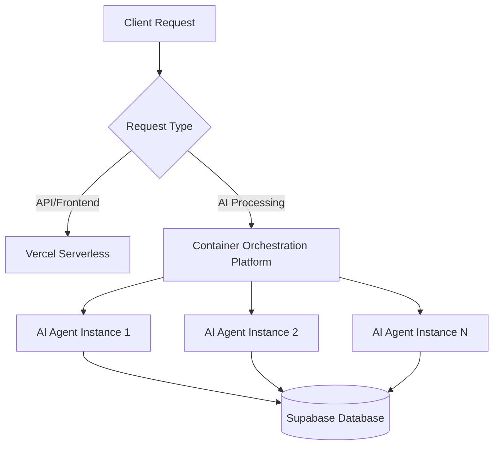
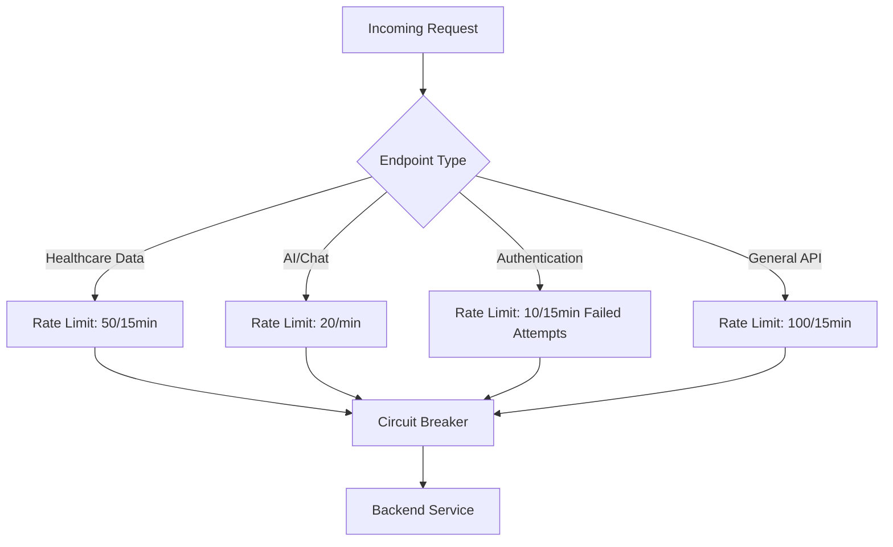
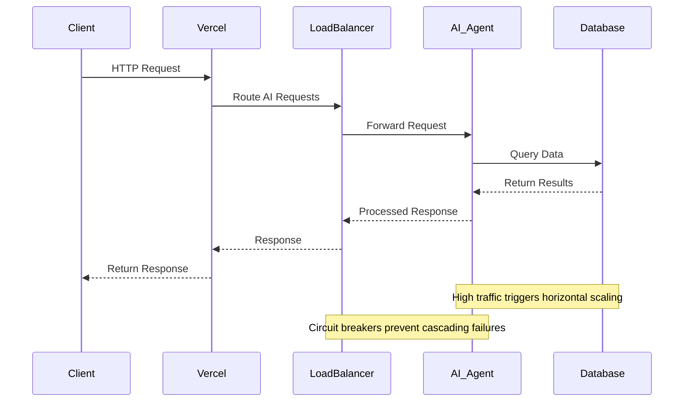
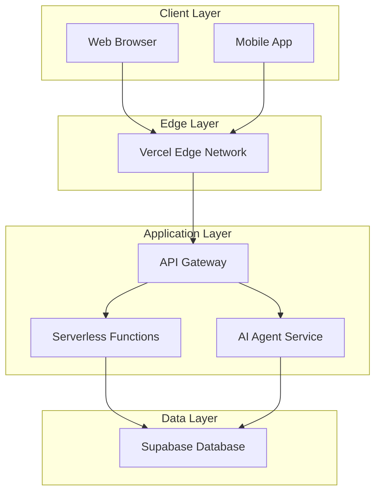

# Scaling Strategy

<cite>
**Referenced Files in This Document **   
- [Dockerfile](file://apps/ai-agent/Dockerfile)
- [main.py](file://apps/ai-agent/main.py)
- [config.py](file://apps/ai-agent/config.py)
- [agent_service.py](file://apps/ai-agent/services/agent_service.py)
- [database_service.py](file://apps/ai-agent/services/database_service.py)
- [websocket_manager.py](file://apps/ai-agent/services/websocket_manager.py)
- [rate-limiting.ts](file://apps/api/src/middleware/rate-limiting.ts)
- [security-headers.ts](file://apps/api/src/middleware/security-headers.ts)
- [error-handler.ts](file://apps/api/src/middleware/error-handler.ts)
- [performance-middleware.ts](file://apps/api/src/middleware/performance-middleware.ts)
</cite>

## Table of Contents
1. [Introduction](#introduction)
2. [Hybrid Scaling Architecture](#hybrid-scaling-architecture)
3. [AI Agent Containerization and Horizontal Scaling](#ai-agent-containerization-and-horizontal-scaling)
4. [Serverless API Limitations and Mitigation](#serverless-api-limitations-and-mitigation)
5. [Resilience Patterns: Circuit Breakers and Rate Limiting](#resilience-patterns-circuit-breakers-and-rate-limiting)
6. [Component Interactions and Data Flow](#component-interactions-and-data-flow)
7. [Infrastructure Requirements](#infrastructure-requirements)
8. [Scalability Considerations for Usage Patterns](#scalability-considerations-for-usage-patterns)
9. [Deployment Topology](#deployment-topology)
10. [Cross-Cutting Concerns](#cross-cutting-concerns)
11. [Technology Stack and Dependencies](#technology-stack-and-dependencies)

## Introduction
The neonpro application employs a hybrid scaling strategy that combines Vercel's serverless functions for API and frontend delivery with containerized AI agents to handle compute-intensive tasks. This architectural approach optimizes resource utilization by separating responsive, stateless API endpoints from the resource-demanding AI processing workloads. The system is designed to handle both bursty AI requests and steady-state API calls efficiently while maintaining compliance with Brazilian healthcare regulations (LGPD). This document details the high-level design decisions, architectural patterns, component interactions, and infrastructure requirements that enable this scalable architecture.

## Hybrid Scaling Architecture
The neonpro application implements a hybrid scaling architecture that strategically distributes workloads between serverless and containerized environments. The frontend and API endpoints are hosted on Vercel's serverless platform, leveraging its global edge network for low-latency content delivery and automatic scaling. In contrast, AI agents run as Docker containers on a dedicated orchestration platform, allowing for horizontal scaling based on computational demands. This separation enables independent scaling of components based on their specific resource requirements and traffic patterns. The architecture incorporates circuit breakers and rate limiting to ensure system resilience during peak loads, with Vercel acting as the load balancer that routes requests to appropriate backend services based on endpoint type and current system conditions.

**Section sources**
- [main.py](file://apps/ai-agent/main.py#L1-L180)
- [config.py](file://apps/ai-agent/config.py#L1-L90)

## AI Agent Containerization and Horizontal Scaling
The AI agent service is containerized using Docker, enabling horizontal scaling across multiple instances to handle increased computational loads. Each AI agent runs as an independent container with defined resource allocations for CPU and memory, ensuring predictable performance characteristics. The containerization approach allows for rapid deployment and scaling of AI services based on demand, with new instances automatically provisioned during traffic spikes. The Docker configuration specifies health checks and resource limits to maintain service stability. The agent service exposes WebSocket and REST endpoints for communication with the frontend, with connection pooling implemented to optimize resource utilization. Horizontal scaling is achieved by deploying multiple container instances behind a load balancer, distributing incoming AI requests across available resources.

**Diagram sources **
- [Dockerfile](file://apps/ai-agent/Dockerfile#L1-L33)
- [main.py](file://apps/ai-agent/main.py#L1-L180)

**Section sources**
- [Dockerfile](file://apps/ai-agent/Dockerfile#L1-L33)
- [main.py](file://apps/ai-agent/main.py#L1-L180)
- [config.py](file://apps/ai-agent/config.py#L1-L90)

## Serverless API Limitations and Mitigation
While Vercel's serverless functions provide excellent scalability for API and frontend delivery, they have inherent limitations in handling compute-intensive AI operations. These limitations include cold start latency, execution time constraints, and memory restrictions that make them unsuitable for complex AI processing tasks. To mitigate these limitations, the architecture separates AI workloads into dedicated containerized services that can run longer processes with higher resource allocations. The serverless functions act as lightweight gateways that route AI-related requests to the containerized agents, while handling simpler API calls directly. Connection pooling and efficient request batching are implemented to minimize the impact of cold starts, and circuit breakers prevent cascading failures when downstream services experience delays.

**Section sources**
- [main.py](file://apps/ai-agent/main.py#L1-L180)
- [config.py](file://apps/ai-agent/config.py#L1-L90)

## Resilience Patterns: Circuit Breakers and Rate Limiting
The neonpro application implements comprehensive resilience patterns to maintain system stability under varying load conditions. Rate limiting is applied at multiple levels, with different thresholds for healthcare data endpoints, AI/chat interfaces, and authentication services. Healthcare data access is restricted to 50 requests per 15 minutes per client, while AI endpoints allow 20 requests per minute. Authentication endpoints implement strict rate limiting with only 10 attempts allowed per 15 minutes, counting only failed attempts to prevent abuse while accommodating legitimate users. Circuit breakers monitor service health and temporarily halt requests to failing components, preventing cascading failures. The rate limiting implementation uses an in-memory store with periodic cleanup to track request counts and enforce window-based limits.

**Diagram sources **
- [rate-limiting.ts](file://apps/api/src/middleware/rate-limiting.ts#L1-L215)

**Section sources**
- [rate-limiting.ts](file://apps/api/src/middleware/rate-limiting.ts#L1-L215)
- [security-headers.ts](file://apps/api/src/middleware/security-headers.ts#L1-L382)

## Component Interactions and Data Flow
The system components interact through well-defined interfaces with clear data flow patterns. Client requests first reach Vercel's edge network, which routes them based on endpoint type. API requests are handled directly by serverless functions, while AI-related requests are forwarded to the containerized AI agent service. The AI agents process requests by interacting with the Supabase database for data retrieval and storage, implementing caching to reduce database load. WebSocket connections are maintained for real-time communication, with ping/pong messages to detect and clean up inactive connections. During high traffic periods, the load balancer distributes requests across multiple AI agent instances, with circuit breakers monitoring service health and rate limiters controlling request volume to prevent overload.

**Diagram sources **
- [main.py](file://apps/ai-agent/main.py#L1-L180)
- [agent_service.py](file://apps/ai-agent/services/agent_service.py#L1-L480)
- [database_service.py](file://apps/ai-agent/services/database_service.py#L1-L285)

**Section sources**
- [main.py](file://apps/ai-agent/main.py#L1-L180)
- [agent_service.py](file://apps/ai-agent/services/agent_service.py#L1-L480)
- [database_service.py](file://apps/ai-agent/services/database_service.py#L1-L285)
- [websocket_manager.py](file://apps/ai-agent/services/websocket_manager.py#L1-L230)

## Infrastructure Requirements
The hybrid scaling architecture has distinct infrastructure requirements for each component. The containerized AI agents require dedicated compute resources with sufficient CPU and memory to handle AI model inference, with each container allocated minimum resources to ensure consistent performance. The database layer must support high-concurrency access with optimized query performance, particularly for healthcare data retrieval operations. The serverless API tier requires integration with Vercel's edge network for global content delivery, with CDN caching configured for static assets. Network connectivity between components must be optimized for low latency, particularly between AI agents and the database. Monitoring infrastructure is required to track performance metrics, error rates, and resource utilization across all components.

**Section sources**
- [Dockerfile](file://apps/ai-agent/Dockerfile#L1-L33)
- [config.py](file://apps/ai-agent/config.py#L1-L90)

## Scalability Considerations for Usage Patterns
The architecture is designed to accommodate different usage patterns, including bursty AI requests and steady-state API calls. For bursty AI workloads, the container orchestration platform automatically scales the number of AI agent instances based on CPU utilization and request queue length. Pre-warming strategies may be employed to reduce cold start times during anticipated traffic spikes. Steady-state API calls are handled efficiently by Vercel's serverless infrastructure, which maintains warm instances for frequently accessed endpoints. The system implements adaptive rate limiting that can be adjusted based on historical usage patterns and business requirements. Analytics are collected to understand usage trends and optimize resource allocation proactively.

**Section sources**
- [main.py](file://apps/ai-agent/main.py#L1-L180)
- [config.py](file://apps/ai-agent/config.py#L1-L90)

## Deployment Topology
The deployment topology separates compute-intensive AI workloads from responsive API endpoints through a multi-tier architecture. The frontend and API gateway are deployed on Vercel's serverless platform with global distribution. AI agents are deployed as Docker containers on a container orchestration platform with internal networking isolated from public access. The database resides in a secure network segment with restricted access controls. Traffic flows from clients through Vercel's edge network to the API gateway, which routes requests to either serverless functions or the AI agent service based on endpoint patterns. Health checks and monitoring are implemented at each tier to ensure service availability and performance.

**Diagram sources **
- [main.py](file://apps/ai-agent/main.py#L1-L180)
- [config.py](file://apps/ai-agent/config.py#L1-L90)

**Section sources**
- [main.py](file://apps/ai-agent/main.py#L1-L180)
- [config.py](file://apps/ai-agent/config.py#L1-L90)

## Cross-Cutting Concerns
The architecture addresses several cross-cutting concerns to ensure system reliability and performance. Cold start mitigation is achieved through strategic workload separation, keeping frequently accessed API endpoints on serverless functions while isolating resource-intensive AI processing in always-running containers. Connection pooling is implemented in the AI agent service to optimize database connectivity and reduce connection overhead. Resource allocation is carefully managed through container resource limits and monitoring, preventing any single component from consuming excessive resources. Error handling is standardized across components with consistent logging and monitoring, enabling rapid issue detection and resolution. Security headers and compliance requirements are enforced through middleware that applies consistent policies across all endpoints.

**Section sources**
- [websocket_manager.py](file://apps/ai-agent/services/websocket_manager.py#L1-L230)
- [security-headers.ts](file://apps/api/src/middleware/security-headers.ts#L1-L382)
- [error-handler.ts](file://apps/api/src/middleware/error-handler.ts#L1-L47)
- [performance-middleware.ts](file://apps/api/src/middleware/performance-middleware.ts#L1-L425)

## Technology Stack and Dependencies
The neonpro application leverages a modern technology stack optimized for scalability and performance. The AI agent service is built with Python using FastAPI for the web framework and Uvicorn as the ASGI server, providing high-performance asynchronous capabilities. LangChain is used for AI model integration with OpenAI and Anthropic APIs. The containerization relies on Docker with standard base images for security and consistency. The API layer uses TypeScript with Hono framework for serverless compatibility. Supabase serves as the backend-as-a-service for database and authentication needs. The architecture depends on Vercel for serverless hosting and edge network capabilities, with version compatibility maintained between framework versions and third-party dependencies to ensure stable deployments.

**Section sources**
- [Dockerfile](file://apps/ai-agent/Dockerfile#L1-L33)
- [requirements.txt](file://apps/ai-agent/requirements.txt)
- [package.json](file://apps/api/package.json)
- [config.py](file://apps/ai-agent/config.py#L1-L90)