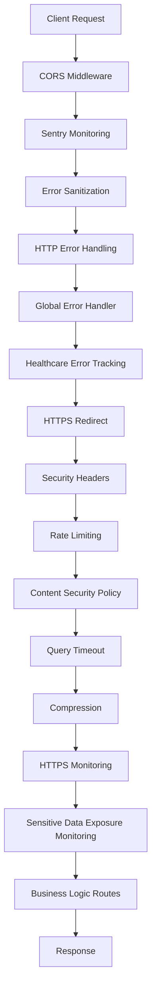
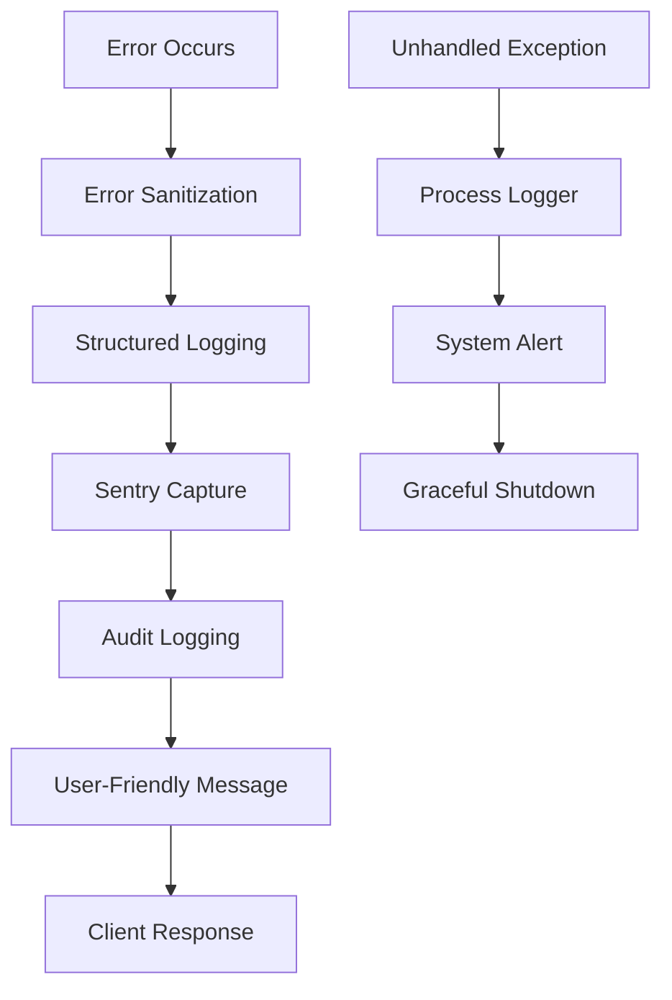
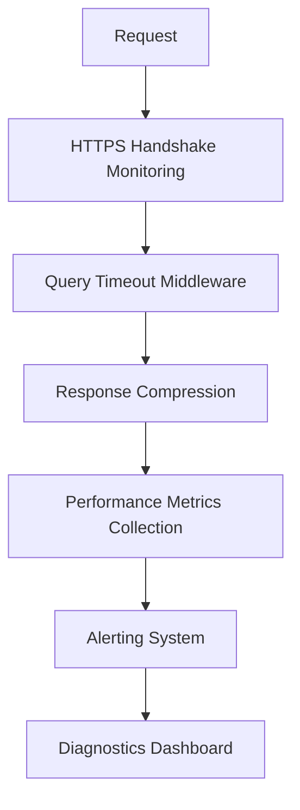

# Developer Onboarding Guide

<cite>
**Referenced Files in This Document**
- [dev-setup.sh](file://scripts/dev-setup.sh)
- [app.ts](file://apps/api/src/app.ts)
- [security-headers.ts](file://apps/api/src/middleware/security-headers.ts)
- [error-tracking.ts](file://apps/api/src/middleware/error-tracking.ts)
- [openapi-generator.ts](file://apps/api/src/lib/openapi-generator.ts)
- [logger.ts](file://apps/api/src/lib/logger.ts)
- [sentry.ts](file://apps/api/src/lib/sentry.ts)
- [https-monitoring-middleware.ts](file://apps/api/src/middleware/https-monitoring-middleware.ts)
- [query-timeout-middleware.ts](file://apps/api/src/middleware/query-timeout-middleware.ts)
- [compression-middleware.ts](file://apps/api/src/middleware/compression-middleware.ts)
</cite>

## Table of Contents

1. [Introduction](#introduction)
2. [Environment Setup](#environment-setup)
3. [Core Architecture Overview](#core-architecture-overview)
4. [Development Workflow](#development-workflow)
5. [Testing Practices](#testing-practices)
6. [Debugging and Error Tracking](#debugging-and-error-tracking)
7. [Performance Optimization](#performance-optimization)
8. [Compliance and Security](#compliance-and-security)
9. [Troubleshooting Common Issues](#troubleshooting-common-issues)
10. [Best Practices](#best-practices)

## Introduction

Welcome to the NeonPro healthcare platform development team! This guide provides comprehensive onboarding information to help new developers quickly become productive with our codebase. The NeonPro platform is a LGPD-compliant medical practice management system that handles sensitive patient data, requiring strict adherence to Brazilian healthcare regulations (LGPD, ANVISA, CFM).

Our technology stack combines modern web frameworks with robust security measures and performance monitoring. The platform consists of multiple applications including AI agents, API services, and web interfaces, all designed to work together seamlessly while maintaining compliance with healthcare data protection standards.

This document covers everything from initial environment setup to advanced debugging techniques, providing both conceptual overviews for beginners and technical details for experienced developers. Whether you're just starting out or have extensive experience, this guide will help you navigate the codebase efficiently and contribute effectively to the project.

## Environment Setup

### System Requirements

Before beginning development, ensure your system meets the following requirements:

- **Operating System**: Linux, macOS, or Windows (WSL recommended)
- **Node.js**: Version 20.0.0 or higher
- **Memory**: Minimum 8GB RAM (16GB recommended)
- **Disk Space**: At least 10GB free space
- **Package Managers**: pnpm (required), bun (recommended for testing)

The development environment is optimized for healthcare compliance, with specific configurations for LGPD, ANVISA, and CFM requirements.

### Automated Setup Script

The project includes an automated setup script that configures your development environment:

```bash
./scripts/dev-setup.sh
```

This script performs the following operations:

- Verifies system requirements
- Installs Node.js dependencies via pnpm
- Sets up Git hooks for healthcare compliance
- Configures VS Code with recommended settings and extensions
- Creates environment files with healthcare-specific variables
- Installs global development tools (axe-core, lighthouse)
- Adds developer aliases to your shell profile

### Manual Setup Steps

If you prefer manual setup, follow these steps:

1. **Install Dependencies**:
   ```bash
   pnpm install --frozen-lockfile
   ```

2. **Configure Environment Variables**:
   Copy the example file and update with your credentials:
   ```bash
   cp .env.example .env.local
   ```

   Key environment variables include:
   - `DATABASE_URL`: Supabase database connection string
   - `SUPABASE_SERVICE_KEY`: Service role key for database access
   - `OPENAI_API_KEY`: API key for AI services
   - `SENTRY_DSN`: Error tracking endpoint
   - `JWT_SECRET`: Secret for authentication tokens

3. **Set Up Database**:
   The platform uses Supabase for database operations. For local development:
   ```bash
   cd packages/database
   supabase start
   ```

4. **IDE Configuration**:
   Recommended VS Code extensions:
   - Tailwind CSS IntelliSense
   - Prettier
   - ESLint
   - axe-core for accessibility testing
   - TypeScript Next Version

The setup process ensures all healthcare compliance requirements are met, including proper configuration of security headers, error tracking, and audit logging.

**Section sources**

- [dev-setup.sh](file://scripts/dev-setup.sh#L1-L466)

## Core Architecture Overview

### Application Structure

The NeonPro platform follows a monorepo structure with multiple applications and shared packages:

```
apps/
├── ai-agent          # Python-based AI agent service
├── api               # Primary API server (TypeScript)
├── tools             # Testing and quality assurance tools
└── web               # Frontend application

packages/
├── agui-protocol     # Communication protocol definitions
├── ai-providers      # AI service integrations
├── analytics         # Analytics and reporting services
├── chat-domain       # Chat functionality domain logic
├── cli               # Command line interface
├── compliance        # Compliance-related utilities
├── config            # Configuration management
├── core-services     # Core business logic services
├── database          # Database access layer
├── domain            # Domain models and entities
├── governance        # Data governance services
├── monitoring        # Monitoring and observability
├── schemas           # Data schemas
├── security          # Security utilities
├── shared            # Shared components and utilities
├── types             # Type definitions
├── ui                # UI components library
├── utils             # Utility functions
└── validators        # Data validation utilities
```

### API Server Architecture

The API server is built using Hono framework with a comprehensive middleware stack designed for healthcare compliance. The architecture emphasizes security, performance, and maintainability.



The middleware pipeline ensures that every request passes through multiple layers of security and monitoring before reaching the business logic. Each middleware component is specifically configured for healthcare requirements, such as LGPD compliance and ANVISA security standards.

### Healthcare Compliance Features

The platform implements several healthcare-specific features:

- **Data Classification**: Five levels of data sensitivity (public, internal, personal, medical, financial)
- **Audit Logging**: Comprehensive tracking of all patient data access
- **PII Protection**: Automatic detection and redaction of sensitive information
- **Consent Management**: LGPD-compliant consent tracking and verification
- **Retention Policies**: Configurable data retention and automatic deletion

These features are integrated throughout the codebase, ensuring compliance with Brazilian healthcare regulations.

**Diagram sources**

- [app.ts](file://apps/api/src/app.ts#L1-L572)
- [security-headers.ts](file://apps/api/src/middleware/security-headers.ts#L1-L382)

**Section sources**

- [app.ts](file://apps/api/src/app.ts#L1-L572)
- [security-headers.ts](file://apps/api/src/middleware/security-headers.ts#L1-L382)

## Development Workflow

### Starting the Development Server

To start the development environment, use the following command:

```bash
pnpm run dev:all
```

This command starts all necessary services including the API server, database, and frontend application. The development server automatically reloads when code changes are detected.

For individual services, use:

```bash
# Start API server
pnpm run dev:api

# Start web frontend
pnpm run dev:web

# Start AI agent
cd apps/ai-agent && python main.py
```

### Code Structure and Navigation

The API codebase follows a structured organization:

```
src/
├── app.ts                    # Main application entry point
├── lib/                     # Library utilities
│   ├── logger.ts            # Structured logging
│   ├── openapi-generator.ts # API documentation
│   └── sentry.ts            # Error tracking
├── middleware/              # Request processing middleware
│   ├── security-headers.ts  # Security headers
│   ├── error-tracking.ts    # Error handling
│   └── compression-middleware.ts # Response optimization
├── routes/                  # API endpoints
│   ├── ai/                  # AI-related endpoints
│   ├── appointments/        # Appointment management
│   └── patients/            # Patient data
├── services/                # Business logic services
├── trpc/                    # Type-safe API routes
└── types/                   # Type definitions
```

Key architectural patterns include:

- **Middleware Pipeline**: Sequential processing of requests through specialized middleware
- **Healthcare-First Design**: Security and compliance features built into the foundation
- **Structured Logging**: Consistent log format with healthcare-specific context
- **Type Safety**: Extensive use of TypeScript for type safety

### Coding Standards

The project enforces strict coding standards to maintain code quality and consistency:

- **Code Formatting**: Prettier with custom rules for healthcare projects
- **Linting**: ESLint with healthcare-specific rules
- **Type Checking**: Strict TypeScript configuration
- **Import Ordering**: Consistent import organization
- **Naming Conventions**: Clear, descriptive names following healthcare terminology

Code quality is enforced through pre-commit hooks that run linting and formatting automatically. Developers should run `pnpm run lint:fix` regularly to ensure their code meets the standards.

### Contribution Guidelines

When contributing to the codebase:

1. **Branch Naming**: Use descriptive branch names following the pattern `feature/descriptive-name` or `fix/issue-description`
2. **Commit Messages**: Write clear, concise commit messages that explain the "why" behind changes
3. **Pull Requests**: Include detailed descriptions of changes and reference relevant issues
4. **Code Review**: Respond promptly to review feedback and make requested changes
5. **Testing**: Ensure all changes are covered by appropriate tests

The team follows a trunk-based development model with feature flags for incomplete functionality. This allows continuous integration while maintaining stability.

**Section sources**

- [app.ts](file://apps/api/src/app.ts#L1-L572)
- [logger.ts](file://apps/api/src/lib/logger.ts#L1-L188)

## Testing Practices

### Test Organization

The testing suite is organized into multiple categories:

```
tests/
├── e2e/                    # End-to-end tests
├── integration/            # Integration tests
├── tdd-infrastructure/     # Infrastructure tests
└── unit/                   # Unit tests

apps/api/tests/
├── audit/                  # Audit compliance tests
├── auth/                   # Authentication tests
├── compliance/             # Regulatory compliance tests
├── contracts/              # API contract tests
├── helpers/                # Test helper utilities
├── integration/            # API integration tests
├── middleware/             # Middleware tests
├── routes/                 # Route handler tests
├── security/               # Security tests
└── unit/                   # Unit tests
```

### Running Tests

Execute tests using the following commands:

```bash
# Run all tests
pnpm run test:all

# Run tests in watch mode
pnpm run test:watch

# Run healthcare compliance tests
pnpm run test:healthcare

# Run performance tests
pnpm run test:performance

# Run accessibility tests
npx axe ./dist
```

The test suite includes specific tests for healthcare compliance, including LGPD data protection, ANVISA security requirements, and CFM professional standards.

### Test Coverage Requirements

The project maintains high test coverage standards:

- **Unit Tests**: 80%+ coverage for business logic
- **Integration Tests**: Comprehensive coverage of API endpoints
- **E2E Tests**: Critical user journeys and healthcare workflows
- **Security Tests**: Vulnerability scanning and penetration testing
- **Accessibility Tests**: WCAG 2.1 AA compliance

Test coverage is monitored continuously, and new features require corresponding tests before merging.

### Testing Tools

The platform uses a comprehensive set of testing tools:

- **Vitest**: Primary testing framework
- **Playwright**: End-to-end browser testing
- **MSW**: Mock Service Worker for API mocking
- **Axe-core**: Accessibility testing
- **Lighthouse**: Performance and quality auditing
- **Stryker**: Mutation testing for test quality

These tools work together to ensure the platform meets healthcare quality standards.

**Section sources**

- [app.ts](file://apps/api/src/app.ts#L1-L572)
- [openapi-generator.ts](file://apps/api/src/lib/openapi-generator.ts#L1-L598)

## Debugging and Error Tracking

### Error Handling Architecture

The platform implements a comprehensive error handling system designed for healthcare applications:



The error handling pipeline ensures that sensitive patient data is never exposed in error messages while providing sufficient information for debugging.

### Logging Strategy

The logging system follows healthcare-specific guidelines:

- **Structured JSON Format**: Consistent log format for easy parsing
- **Context Enrichment**: Automatic addition of healthcare context (clinic ID, user ID)
- **PII Redaction**: Automatic masking of sensitive information
- **Log Levels**: Differentiated logging for various severity levels
- **Audit Trails**: Comprehensive logging of patient data access

```typescript
// Example of structured logging
logger.audit('patient_data_access', 'Patient record accessed', {
  patientId: 'pat_123',
  clinicId: 'clinic_456',
  userId: 'user_789',
  action: 'view_medical_record',
});
```

Logs include healthcare-specific fields such as data classification, compliance impact, and audit trail identifiers.

### Monitoring and Observability

The platform integrates with multiple monitoring systems:

- **Sentry**: Error tracking and performance monitoring
- **OpenTelemetry**: Distributed tracing
- **Prometheus**: Metrics collection
- **Grafana**: Dashboard visualization
- **Custom Monitoring Services**: Healthcare-specific metrics

Key healthcare metrics include:

- HTTPS handshake time (<300ms requirement)
- Query response time (<2s requirement)
- Data access compliance rate
- Audit log completeness
- Security incident frequency

### Debugging Tools

Developers have access to several debugging tools:

- **Sentry Dashboard**: Real-time error tracking with healthcare context
- **OpenAPI Documentation**: Interactive API explorer at `/docs`
- **Health Checks**: Comprehensive system status at `/v1/health`
- **Performance Monitoring**: HTTPS handshake metrics at `/v1/monitoring/https`
- **Compliance Verification**: LGPD status at `/v1/compliance/lgpd`

These tools help developers quickly identify and resolve issues while maintaining healthcare compliance.

**Diagram sources**

- [error-tracking.ts](file://apps/api/src/middleware/error-tracking.ts#L1-L114)
- [sentry.ts](file://apps/api/src/lib/sentry.ts#L1-L270)

**Section sources**

- [error-tracking.ts](file://apps/api/src/middleware/error-tracking.ts#L1-L114)
- [sentry.ts](file://apps/api/src/lib/sentry.ts#L1-L270)
- [logger.ts](file://apps/api/src/lib/logger.ts#L1-L188)

## Performance Optimization

### Performance Requirements

The platform has strict performance requirements for healthcare applications:

- **HTTPS Handshake**: ≤300ms
- **Query Response Time**: <2s for all endpoints
- **Page Load Time**: <3s for critical user journeys
- **API Latency**: <500ms for internal services
- **Database Queries**: Optimized for high concurrency

These requirements ensure a responsive user experience for healthcare professionals.

### Performance Monitoring

The platform includes comprehensive performance monitoring:



Each component in the request pipeline contributes to performance optimization and monitoring.

### Optimization Techniques

Several optimization techniques are implemented:

- **Response Compression**: Brotli and Gzip compression with intelligent selection
- **Caching Strategies**: Appropriate cache headers for different content types
- **ETag Support**: Conditional requests to reduce bandwidth usage
- **Streaming Compression**: For large responses
- **Precondition Checks**: If-None-Match and If-Modified-Since headers

The compression middleware automatically selects the optimal compression method based on client capabilities and response characteristics.

### Performance Testing

Regular performance testing ensures compliance with healthcare requirements:

```bash
# Run performance tests
pnpm run test:performance

# Check Lighthouse scores
npx lighthouse http://localhost:3000 --view

# Monitor HTTPS handshake time
curl http://localhost:3001/v1/monitoring/https
```

Performance budgets are defined in `lighthouse-budget.json` and enforced during CI/CD.

**Diagram sources**

- [https-monitoring-middleware.ts](file://apps/api/src/middleware/https-monitoring-middleware.ts#L1-L456)
- [query-timeout-middleware.ts](file://apps/api/src/middleware/query-timeout-middleware.ts#L1-L508)
- [compression-middleware.ts](file://apps/api/src/middleware/compression-middleware.ts#L1-L665)

**Section sources**

- [https-monitoring-middleware.ts](file://apps/api/src/middleware/https-monitoring-middleware.ts#L1-L456)
- [query-timeout-middleware.ts](file://apps/api/src/middleware/query-timeout-middleware.ts#L1-L508)
- [compression-middleware.ts](file://apps/api/src/middleware/compression-middleware.ts#L1-L665)

## Compliance and Security

### Healthcare Compliance Framework

The platform implements a comprehensive compliance framework for Brazilian healthcare regulations:

- **LGPD (Lei Geral de Proteção de Dados)**: Data protection and privacy
- **ANVISA**: Medical device and software regulations
- **CFM (Conselho Federal de Medicina)**: Professional standards for medical practice

Compliance is enforced through technical controls, policies, and procedures.

### Security Headers

The platform configures strict security headers:

```typescript
const config: SecurityHeadersConfig = {
  enableHSTS: true,
  hstsMaxAge: 31536000, // 1 year
  hstsIncludeSubDomains: true,
  hstsPreload: true,
  enableCSP: true,
  contentSecurityPolicy: 'default-src \'self\'; ...',
  enableFrameGuard: true,
  enableXSSProtection: true,
  enableContentTypeSniffingProtection: true,
  referrerPolicy: 'strict-origin-when-cross-origin',
};
```

These headers protect against common web vulnerabilities including XSS, clickjacking, and MIME sniffing attacks.

### Data Protection

Multiple layers of data protection are implemented:

- **Encryption**: AES-256-GCM for data at rest and in transit
- **Access Control**: Role-based access with clinic isolation
- **Audit Logging**: Comprehensive tracking of all data access
- **PII Detection**: Automatic identification of sensitive information
- **Data Masking**: Redaction of sensitive fields in logs and responses

All patient data access is logged with full context for audit purposes.

### Security Testing

Regular security testing ensures ongoing protection:

```bash
# Run security audit
pnpm run security:audit

# Check for vulnerabilities
npm audit

# Run penetration tests
pnpm run pentest
```

Security scans are integrated into the CI/CD pipeline to catch issues early.

**Section sources**

- [security-headers.ts](file://apps/api/src/middleware/security-headers.ts#L1-L382)
- [openapi-generator.ts](file://apps/api/src/lib/openapi-generator.ts#L1-L598)

## Troubleshooting Common Issues

### Development Environment Issues

**Issue**: Node.js version incompatible
**Solution**: Install Node.js 20.0.0 or higher using nvm:

```bash
nvm install 20
nvm use 20
```

**Issue**: Database connection fails
**Solution**: Ensure Supabase CLI is installed and running:

```bash
npm install -g supabase
cd packages/database && supabase start
```

**Issue**: Environment variables not loading
**Solution**: Verify `.env.local` exists and contains required variables. Restart the development server after making changes.

### API and Network Issues

**Issue**: CORS errors in browser
**Solution**: Check that your origin is included in the allowed origins list in `app.ts`. Development origins include `http://localhost:3000` and `http://localhost:5173`.

**Issue**: HTTPS redirect loop
**Solution**: Ensure your reverse proxy is properly configured to forward the `x-forwarded-proto` header. In development, access the site directly via HTTP.

**Issue**: Slow API responses
**Solution**: Check the query timeout middleware configuration. Large queries may need optimization or pagination.

### Testing Issues

**Issue**: Tests failing due to timing issues
**Solution**: Increase test timeouts in `vitest.config.ts`. Some healthcare compliance checks may take longer than expected.

**Issue**: Playwright tests failing
**Solution**: Ensure Chrome is installed and accessible. Run tests in headed mode to debug:

```bash
npx playwright test --headed
```

**Issue**: Lighthouse performance budget exceeded
**Solution**: Optimize assets and implement lazy loading. Check the specific metric that failed and address accordingly.

### Production-like Issues

**Issue**: High memory usage
**Solution**: Monitor for memory leaks using Node.js inspector. The platform is configured with a 4GB heap limit.

**Issue**: High error rates in Sentry
**Solution**: Check for unhandled promise rejections and implement proper error boundaries. Ensure all async operations are properly awaited.

**Issue**: Slow HTTPS handshakes
**Solution**: Verify TLS configuration and certificate chain. The monitoring service at `/v1/monitoring/https` provides detailed diagnostics.

## Best Practices

### Code Quality

Maintain high code quality through consistent practices:

- **Small, Focused Commits**: Each commit should address a single concern
- **Descriptive Naming**: Use clear, meaningful names for variables and functions
- **Documentation**: Comment complex logic and healthcare-specific requirements
- **Code Reviews**: Participate actively in code reviews and provide constructive feedback
- **Refactoring**: Regularly improve code structure without changing behavior

### Healthcare-Specific Considerations

When developing healthcare features:

- **Privacy by Design**: Always consider patient privacy implications
- **Audit Trail**: Ensure all patient data access is properly logged
- **Consent Management**: Verify consent status before accessing protected data
- **Data Minimization**: Only collect and store necessary data
- **Retention Policies**: Implement automatic data deletion according to policy

### Performance Optimization

Optimize for healthcare performance requirements:

- **Monitor HTTPS Handshake**: Keep under 300ms threshold
- **Optimize Queries**: Ensure responses within 2s limit
- **Use Caching Appropriately**: Balance freshness with performance
- **Compress Responses**: Enable Brotli and Gzip compression
- **Implement Pagination**: For large datasets

### Collaboration and Communication

Effective collaboration practices:

- **Clear Issue Descriptions**: Provide context and reproduction steps
- **Timely Updates**: Communicate progress on assigned tasks
- **Knowledge Sharing**: Document decisions and share learnings
- **Pair Programming**: Collaborate on complex healthcare logic
- **Regular Syncs**: Attend team meetings and provide updates

By following these best practices, developers can contribute effectively to the NeonPro platform while maintaining the high standards required for healthcare applications.
